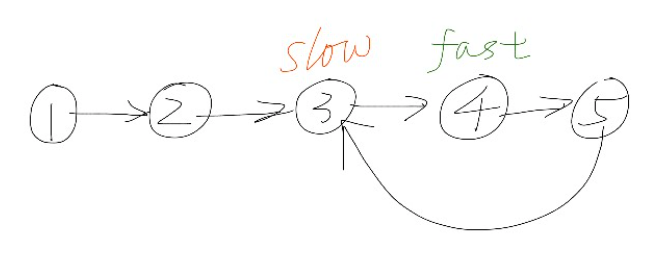
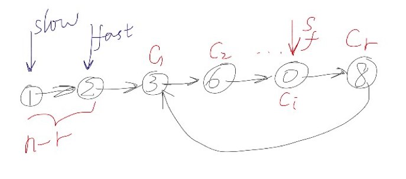
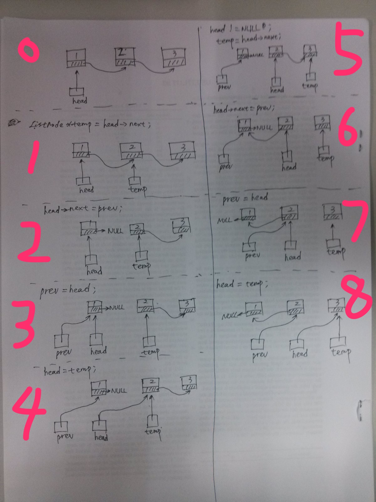

# 第 13 节 Linked List - 链表（二）

## Linked List Cycle

## Question

*   leetcode: [Linked List Cycle | LeetCode OJ](https://leetcode.com/problems/linked-list-cycle/)
*   lintcode: [(102) Linked List Cycle](http://www.lintcode.com/en/problem/linked-list-cycle/)

```
Given a linked list, determine if it has a cycle in it.

Example
Given -21->10->4->5, tail connects to node index 1, return true

Challenge
Follow up:
Can you solve it without using extra space? 
```

## 题解 - 快慢指针

对于带环链表的检测，效率较高且易于实现的一种方式为使用快慢指针。快指针每次走两步，慢指针每次走一步，如果快慢指针相遇(快慢指针所指内存为同一区域)则有环，否则快指针会一直走到`NULL`为止退出循环，返回`false`.

快指针走到`NULL`退出循环即可确定此链表一定无环这个很好理解。那么带环的链表快慢指针一定会相遇吗？先来看看下图。



在有环的情况下，最终快慢指针一定都走在环内，加入第`i`次遍历时快指针还需要`k`步才能追上慢指针，由于快指针比慢指针每次多走一步。那么每遍历一次快慢指针间的间距都会减少 1，直至最终相遇。故快慢指针相遇一定能确定该链表有环。

### C++

```
/**
 * Definition of ListNode
 * class ListNode {
 * public:
 *     int val;
 *     ListNode *next;
 *     ListNode(int val) {
 *         this->val = val;
 *         this->next = NULL;
 *     }
 * }
 */
class Solution {
public:
    /**
     * @param head: The first node of linked list.
     * @return: True if it has a cycle, or false
     */
    bool hasCycle(ListNode *head) {
        if (NULL == head || NULL == head->next) {
            return false;
        }

        ListNode *slow = head, *fast = head->next;
        while (NULL != fast && NULL != fast->next) {
            fast = fast->next->next;
            slow = slow->next;
            if (slow == fast) return true;
        }

        return false;
    }
}; 
```

### 源码分析

1.  异常处理，将`head->next`也考虑在内有助于简化后面的代码。
2.  慢指针初始化为`head`, 快指针初始化为`head`的下一个节点，这是快慢指针初始化的一种方法，有时会简化边界处理，但有时会增加麻烦，比如该题的进阶版。

### 复杂度分析

1.  在无环时，快指针每次走两步走到尾部节点，遍历的时间复杂度为 $$O(n/2)$$.
2.  有环时，最坏的时间复杂度近似为 $$O(n)$$. 最坏情况下链表的头尾相接，此时快指针恰好在慢指针前一个节点，还需 n 次快慢指针相遇。最好情况和无环相同，尾节点出现环。

故总的时间复杂度可近似为 $$O(n)$$.

## Reference

*   [Linked List Cycle | 九章算法](http://www.jiuzhang.com/solutions/linked-list-cycle/)

## Linked List Cycle II

## Question

*   leetcode: [Linked List Cycle II | LeetCode OJ](https://leetcode.com/problems/linked-list-cycle-ii/)
*   lintcode: [(103) Linked List Cycle II](http://www.lintcode.com/en/problem/linked-list-cycle-ii/)

```
Given a linked list, return the node where the cycle begins. If there is no cycle, return null.

Example
Given -21->10->4->5, tail connects to node index 1，return node 10

Challenge
Follow up:
Can you solve it without using extra space? 
```

## 题解 - 快慢指针

题 [Linked List Cycle | Data Structure and Algorithm](http://algorithm.yuanbin.me/zh-hans/linked_list/linked_list_cycle.html) 的升级版，题目要求不适用额外空间，则必然还是使用快慢指针解决问题。首先设组成环的节点个数为 $$r$$, 链表中节点个数为 $$n$$. 首先我们来分析下在链表有环时都能推出哪些特性：

1.  快慢指针第一次相遇时快指针比慢指针多走整数个环, 这个容易理解，相遇问题。
2.  每次相遇都在同一个节点。第一次相遇至第二次相遇，快指针需要比慢指针多走一个环的节点个数，而快指针比慢指针多走的步数正好是慢指针自身移动的步数，故慢指针恰好走了一圈回到原点。

从以上两个容易得到的特性可知，在仅仅知道第一次相遇时的节点还不够，相遇后如果不改变既有策略则必然找不到环的入口。接下来我们分析下如何从第一次相遇的节点走到环的入口节点。还是让我们先从实际例子出发，以下图为例。



`slow`和`fast`节点分别初始化为节点`1`和`2`，假设快慢指针第一次相遇的节点为`0`, 对应于环中的第`i`个节点 $$C_i$$, 那么此时慢指针正好走了 $$n - r - 1 + i$$ 步，快指针则走了 $$2 \cdot (n - r - 1 + i)$$ 步，且存在[¹]: $$n - r - 1 + i + 1= l \cdot r$$. (之所以在`i`后面加 1 是因为快指针初始化时多走了一步) 快慢指针第一次相遇时慢指针肯定没有走完整个环，且慢指针走的步数即为整数个环节点个数，由性质 1 和性质 2 可联合推出。

现在分析下相遇的节点和环的入口节点之间的关联，要从环中第`i`个节点走到环的入口节点，则按照顺时针方向移动[²]: $$(l \cdot r - i + 1)$$ 个节点 ($$l$$ 为某个非负整数) 即可到达。现在来看看式[¹]和式[²]间的关系。由式[¹]可以推知 $$n - r = l \cdot r - i$$. 从头节点走到环的入口节点所走的步数可用 $$n - r$$ 表示，故在快慢指针第一次相遇时让另一节点从头节点出发，慢指针仍从当前位置迭代，第二次相遇时的位置即为环的入口节点！

> **Note** 由于此题快指针初始化为头节点的下一个节点，故分析起来稍微麻烦些，且在第一次相遇后需要让慢指针先走一步，否则会出现死循环。

对于该题来说，快慢指针都初始化为头节点会方便很多，故以下代码使用头节点对快慢指针进行初始化。

### C++

```
/**
 * Definition of ListNode
 * class ListNode {
 * public:
 *     int val;
 *     ListNode *next;
 *     ListNode(int val) {
 *         this->val = val;
 *         this->next = NULL;
 *     }
 * }
 */
class Solution {
public:
    /**
     * @param head: The first node of linked list.
     * @return: The node where the cycle begins.
     *           if there is no cycle, return null
     */
    ListNode *detectCycle(ListNode *head) {
        if (NULL == head || NULL == head->next) {
            return NULL;
        }

        ListNode *slow = head, *fast = head;
        while (NULL != fast && NULL != fast->next) {
            fast = fast->next->next;
            slow = slow->next;
            if (slow == fast) {
                fast = head;
                while (slow != fast) {
                    fast = fast->next;
                    slow = slow->next;
                }
                return slow;
            }
        }

        return NULL;
    }
}; 
```

### 源码分析

1.  异常处理。
2.  找第一次相遇的节点。
3.  将`fast`置为头节点，并只走一步，直至快慢指针第二次相遇，返回慢指针所指的节点。

### 复杂度分析

第一次相遇的最坏时间复杂度为 $$O(n)$$, 第二次相遇的最坏时间复杂度为 $$O(n)$$. 故总的时间复杂度近似为 $$O(n)$$, 空间复杂度 $$O(1)$$.

## Reference

*   [Linked List Cycle II | 九章算法](http://www.jiuzhang.com/solutions/linked-list-cycle-ii/)

## Reverse Linked List

## Question

*   leetcode: [Reverse Linked List | LeetCode OJ](https://leetcode.com/problems/reverse-linked-list/)
*   lintcode: [(35) Reverse Linked List](http://www.lintcode.com/en/problem/reverse-linked-list/)

```
Reverse a linked list.

Example
For linked list 1->2->3, the reversed linked list is 3->2->1

Challenge
Reverse it in-place and in one-pass 
```

## 题解 1 - 非递归

联想到同样也可能需要翻转的数组，在数组中由于可以利用下标随机访问，翻转时使用下标即可完成。而在单向链表中，仅仅只知道头节点，而且只能单向往前走，故需另寻出路。分析由`1->2->3`变为`3->2->1`的过程，由于是单向链表，故只能由 1 开始遍历，1 和 2 最开始的位置是`1->2`，最后变为`2->1`，故从这里开始寻找突破口，探讨如何交换 1 和 2 的节点。

```
temp = head->next;
head->next = prev;
prev = head;
head = temp; 
```

要点在于维护两个指针变量`prev`和`head`, 翻转相邻两个节点之前保存下一节点的值，分析如下图所示：



1.  保存 head 下一节点
2.  将 head 所指向的下一节点改为 prev
3.  将 prev 替换为 head，波浪式前进
4.  将第一步保存的下一节点替换为 head，用于下一次循环

### Python

```
# Definition for singly-linked list.
# class ListNode:
#     def __init__(self, x):
#         self.val = x
#         self.next = None

class Solution:
    # @param {ListNode} head
    # @return {ListNode}
    def reverseList(self, head):
        prev = None
        curr = head
        while curr is not None:
            temp = curr.next
            curr.next = prev
            prev = curr
            curr = temp
        # fix head
        head = prev

        return head 
```

### C++

```
/**
 * Definition for singly-linked list.
 * struct ListNode {
 *     int val;
 *     ListNode *next;
 *     ListNode(int x) : val(x), next(NULL) {}
 * };
 */
class Solution {
public:
    ListNode* reverse(ListNode* head) {
        ListNode *prev = NULL;
        ListNode *curr = head;
        while (curr != NULL) {
            ListNode *temp = curr->next;
            curr->next = prev;
            prev = curr;
            curr = temp;
        }
        // fix head
        head = prev;

        return head;
    }
}; 
```

### Java

```
/**
 * Definition for singly-linked list.
 * public class ListNode {
 *     int val;
 *     ListNode next;
 *     ListNode(int x) { val = x; }
 * }
 */
public class Solution {
    public ListNode reverseList(ListNode head) {
        ListNode prev = null;
        ListNode curr = head;
        while (curr != null) {
            ListNode temp = curr.next;
            curr.next = prev;
            prev = curr;
            curr = temp;
        }
        // fix head
        head = prev;

        return head;
    }
} 
```

### 源码分析

题解中基本分析完毕，代码中的 prev 赋值比较精炼，值得借鉴。

### 复杂度分析

遍历一次链表，时间复杂度为 $$O(n)$$, 使用了辅助变量，空间复杂度 $$O(1)$$.

## 题解 2 - 递归

递归的终止步分三种情况讨论：

1.  原链表为空，直接返回空链表即可。
2.  原链表仅有一个元素，返回该元素。
3.  原链表有两个以上元素，由于是单链表，故翻转需要自尾部向首部逆推。

由尾部向首部逆推时大致步骤为先翻转当前节点和下一节点，然后将当前节点指向的下一节点置空(否则会出现死循环和新生成的链表尾节点不指向空)，如此递归到头节点为止。新链表的头节点在整个递归过程中一直没有变化，逐层向上返回。

### Python

```
"""
Definition of ListNode

class ListNode(object):

    def __init__(self, val, next=None):
        self.val = val
        self.next = next
"""
class Solution:
    """
    @param head: The first node of the linked list.
    @return: You should return the head of the reversed linked list.
                  Reverse it in-place.
    """
    def reverse(self, head):
        # case1: empty list
        if head is None:
            return head
        # case2: only one element list
        if head.next is None:
            return head
        # case3: reverse from the rest after head
        newHead = self.reverse(head.next)
        # reverse between head and head->next
        head.next.next = head
        # unlink list from the rest
        head.next = None

        return newHead 
```

### C++

```
/**
 * Definition of ListNode
 *
 * class ListNode {
 * public:
 *     int val;
 *     ListNode *next;
 *
 *     ListNode(int val) {
 *         this->val = val;
 *         this->next = NULL;
 *     }
 * }
 */
class Solution {
public:
    /**
     * @param head: The first node of linked list.
     * @return: The new head of reversed linked list.
     */
    ListNode *reverse(ListNode *head) {
        // case1: empty list
        if (head == NULL) return head;
        // case2: only one element list
        if (head->next == NULL) return head;
        // case3: reverse from the rest after head
        ListNode *newHead = reverse(head->next);
        // reverse between head and head->next
        head->next->next = head;
        // unlink list from the rest
        head->next = NULL;

        return newHead;
    }
}; 
```

### Java

```
/**
 * Definition for singly-linked list.
 * public class ListNode {
 *     int val;
 *     ListNode next;
 *     ListNode(int x) { val = x; }
 * }
 */
public class Solution {
    public ListNode reverse(ListNode head) {
        // case1: empty list
        if (head == null) return head;
        // case2: only one element list
        if (head.next == null) return head;
        // case3: reverse from the rest after head
        ListNode newHead = reverse(head.next);
        // reverse between head and head->next
        head.next.next = head;
        // unlink list from the rest
        head.next = null;

        return newHead;
    }
} 
```

### 源码分析

case1 和 case2 可以合在一起考虑，case3 返回的为新链表的头节点，整个递归过程中保持不变。

### 复杂度分析

递归嵌套层数为 $$O(n)$$, 时间复杂度为 $$O(n)$$, 空间(不含栈空间)复杂度为 $$O(1)$$.

## Reference

*   [全面分析再动手的习惯：链表的反转问题（递归和非递归方式） - 木棉和木槿 - 博客园](http://www.cnblogs.com/kubixuesheng/p/4394509.html)
*   [data structures - Reversing a linked list in Java, recursively - Stack Overflow](http://stackoverflow.com/questions/354875/reversing-a-linked-list-in-java-recursively)
*   [反转单向链表的四种实现（递归与非递归，C++） | 宁心勉学，慎思笃行](http://ceeji.net/blog/reserve-linked-list-cpp/)
*   [iteratively and recursively Java Solution - Leetcode Discuss](https://leetcode.com/discuss/37804/iteratively-and-recursively-java-solution)

## Reverse Linked List II

## Question

*   leetcode: [Reverse Linked List II | LeetCode OJ](https://leetcode.com/problems/reverse-linked-list-ii/)
*   lintcode: [(36) Reverse Linked List II](http://www.lintcode.com/en/problem/reverse-linked-list-ii/)

### Problem Statement

Reverse a linked list from position m to n.

#### Example

Given **1->2->3->4->5->NULL**, m = 2 and n = 4, return 1->4->3->2->5->NULL.

#### Note

Given m, n satisfy the following condition: 1 ≤ m ≤ n ≤ length of list.

#### Challenge

Reverse it in-place and in one-pass

## 题解

此题在上题的基础上加了位置要求，只翻转指定区域的链表。由于链表头节点不确定，祭出我们的 dummy 杀器。此题边界条件处理特别 tricky，需要特别注意。

1.  由于只翻转指定区域，分析受影响的区域为第 m-1 个和第 n+1 个节点
2.  找到第 m 个节点，使用 for 循环 n-m 次，使用上题中的链表翻转方法
3.  处理第 m-1 个和第 n+1 个节点
4.  返回 dummy->next

### C++

```
/**
 * Definition of singly-linked-list:
 *
 * class ListNode {
 * public:
 *     int val;
 *     ListNode *next;
 *     ListNode(int val) {
 *        this->val = val;
 *        this->next = NULL;
 *     }
 * }
 */
class Solution {
public:
    /**
     * @param head: The head of linked list.
     * @param m: The start position need to reverse.
     * @param n: The end position need to reverse.
     * @return: The new head of partial reversed linked list.
     */
    ListNode *reverseBetween(ListNode *head, int m, int n) {
        if (head == NULL || m > n) {
            return NULL;
        }

        ListNode *dummy = new ListNode(0);
        dummy->next = head;
        ListNode *node = dummy;

        for (int i = 1; i != m; ++i) {
            if (node == NULL) {
                return NULL;
            } else {
                node = node->next;
            }
        }

        ListNode *premNode = node;
        ListNode *mNode = node->next;
        ListNode *nNode = mNode, *postnNode = nNode->next;
        for (int i = m; i != n; ++i) {
            if (postnNode == NULL) {
                return NULL;
            }

            ListNode *temp = postnNode->next;
            postnNode->next = nNode;
            nNode = postnNode;
            postnNode = temp;
        }
        premNode->next = nNode;
        mNode->next = postnNode;

        return dummy->next;
    }
}; 
```

### Java

```
/**
 * Definition for ListNode
 * public class ListNode {
 *     int val;
 *     ListNode next;
 *     ListNode(int x) {
 *         val = x;
 *         next = null;
 *     }
 * }
 */
public class Solution {
    /**
     * @param ListNode head is the head of the linked list 
     * @oaram m and n
     * @return: The head of the reversed ListNode
     */
    public ListNode reverseBetween(ListNode head, int m , int n) {
        ListNode dummy = new ListNode(0);
        dummy.next = head;

        // find the mth node
        ListNode premNode = dummy;
        for (int i = 1; i < m; i++) {
            premNode = premNode.next;
        }

        // reverse node between m and n
        ListNode prev = null, curr = premNode.next;
        while (curr != null && (m <= n)) {
            ListNode nextNode = curr.next;
            curr.next = prev;
            prev = curr;
            curr = nextNode;
            m++;
        }

        // join head and tail before m and after n
        premNode.next.next = curr;
        premNode.next = prev;

        return dummy.next;
    }
} 
```

### 源码分析

1.  处理异常
2.  使用 dummy 辅助节点
3.  找到 premNode——m 节点之前的一个节点
4.  以 nNode 和 postnNode 进行遍历翻转，注意考虑在遍历到 n 之前 postnNode 可能为空
5.  连接 premNode 和 nNode，`premNode->next = nNode;`
6.  连接 mNode 和 postnNode，`mNode->next = postnNode;`

**务必注意 node 和 node->next 的区别！！**，node 指代节点，而`node->next`指代节点的下一连接。

## Merge Two Sorted Lists

## Question

*   leetcode: [Merge Two Sorted Lists | LeetCode OJ](https://leetcode.com/problems/merge-two-sorted-lists/)
*   lintcode: [(165) Merge Two Sorted Lists](http://www.lintcode.com/en/problem/merge-two-sorted-lists/)

### Problem Statement

Merge two sorted (ascending) linked lists and return it as a new sorted list. The new sorted list should be made by splicing together the nodes of the two lists and sorted in ascending order.

#### Example

Given `1->3->8->11->15->null`, `2->null` , return `1->2->3->8->11->15->null`.

## 题解

此题为两个链表的合并，合并后的表头节点不一定，故应联想到使用`dummy`节点。链表节点的插入主要涉及节点`next`指针值的改变，两个链表的合并操作则涉及到两个节点的`next`值变化，若每次合并一个节点都要改变两个节点`next`的值且要对`NULL`指针做异常处理，势必会异常麻烦。嗯，第一次做这个题时我就是这么想的... 下面看看相对较好的思路。

首先`dummy`节点还是必须要用到，除了`dummy`节点外还引入一个`curr`节点充当下一次合并时的头节点。在`l1`或者`l2`的某一个节点为空指针`NULL`时，退出`while`循环，并将非空链表的头部链接到`curr->next`中。

### C++

```
/**
 * Definition for singly-linked list.
 * struct ListNode {
 *     int val;
 *     ListNode *next;
 *     ListNode(int x) : val(x), next(NULL) {}
 * };
 */
class Solution {
public:
    ListNode* mergeTwoLists(ListNode* l1, ListNode* l2) {
        ListNode *dummy = new ListNode(0);
        ListNode *lastNode = dummy;
        while ((NULL != l1) && (NULL != l2)) {
            if (l1->val < l2->val) {
                lastNode->next = l1;
                l1 = l1->next;
            } else {
                lastNode->next = l2;
                l2 = l2->next;
            }

            lastNode = lastNode->next;
        }

        // do not forget this line!
        lastNode->next =  (NULL != l1) ? l1 : l2;

        return dummy->next;
    }
}; 
```

### Java

```
/**
 * Definition for ListNode.
 * public class ListNode {
 *     int val;
 *     ListNode next;
 *     ListNode(int val) {
 *         this.val = val;
 *         this.next = null;
 *     }
 * }
 */ 
public class Solution {
    /**
     * @param ListNode l1 is the head of the linked list
     * @param ListNode l2 is the head of the linked list
     * @return: ListNode head of linked list
     */
    public ListNode mergeTwoLists(ListNode l1, ListNode l2) {
        ListNode dummy = new ListNode(0);
        ListNode curr = dummy;

        while ((l1 != null) && (l2 != null)) {
            if (l1.val > l2.val) {
                curr.next = l2;
                l2 = l2.next;
            } else {
                curr.next = l1;
                l1 = l1.next;
            }
            curr = curr.next;
        }

        // link to non-null list
        curr.next = (l1 != null) ? l1 : l2;

        return dummy.next;
    }
} 
```

### 源码分析

1.  异常处理，包含在`dummy->next`中。
2.  引入`dummy`和`curr`节点，此时`curr`指向的节点为`dummy`
3.  对非空 l1,l2 循环处理，将 l1/l2 的较小者链接到`curr->next`，往后递推`curr`
4.  最后处理 l1/l2 中某一链表为空退出 while 循环，将非空链表头链接到`curr->next`
5.  返回`dummy->next`，即最终的首指针

注意`curr`的递推并不影响`dummy->next`的值，因为`lastNode`和`dummy`是两个不同的指针变量。

> **Note** 链表的合并为常用操作，务必非常熟练，以上的模板非常精炼，有两个地方需要记牢。1\. 循环结束条件中为条件与操作；2\. 最后处理`curr->next`指针的值。

### 复杂度分析

最好情况下，一个链表为空，时间复杂度为 $$O(1)$$. 最坏情况下，`curr`遍历两个链表中的每一个节点，时间复杂度为 $$O(l1+l2)$$. 空间复杂度近似为 $$O(1)$$.

## Reference

*   [Merge Two Sorted Lists | 九章算法](http://www.jiuzhang.com/solutions/merge-two-sorted-lists/)

## Merge k Sorted Lists

## Question

*   leetcode: [Merge k Sorted Lists | LeetCode OJ](https://leetcode.com/problems/merge-k-sorted-lists/)
*   lintcode: [(104) Merge k Sorted Lists](http://www.lintcode.com/en/problem/merge-k-sorted-lists/)

## 题解 1 - 选择归并(TLE) <i class="fa fa-thumbs-o-down"></i>

参考 [Merge Two Sorted Lists | Data Structure and Algorithm](http://algorithm.yuanbin.me/zh-hans/linked_list/merge_two_sorted_lists.html) 中对两个有序链表的合并方法，这里我们也可以采用从 k 个链表中选择其中最小值的节点链接到`lastNode->next`(和选择排序思路有点类似)，同时该节点所在的链表表头节点往后递推一个。直至`lastNode`遍历完 k 个链表的所有节点，此时表头节点均为`NULL`, 返回`dummy->next`.

这种方法非常简单直接，但是时间复杂度较高，容易出现 TLE.

### C++

```
/**
 * Definition of ListNode
 * class ListNode {
 * public:
 *     int val;
 *     ListNode *next;
 *     ListNode(int val) {
 *         this->val = val;
 *         this->next = NULL;
 *     }
 * }
 */

class Solution {
public:
    /**
     * @param lists: a list of ListNode
     * @return: The head of one sorted list.
     */
    ListNode *mergeKLists(vector<ListNode *> &lists) {
        if (lists.empty()) {
            return NULL;
        }

        ListNode *dummy = new ListNode(INT_MAX);
        ListNode *last = dummy;

        while (true) {
            int count = 0;
            int index = -1, tempVal = INT_MAX;
            for (int i = 0; i != lists.size(); ++i) {
                if (NULL == lists[i]) {
                    ++count;
                    if (count == lists.size()) {
                        last->next = NULL;
                        return dummy->next;
                    }
                    continue;
                }

                // choose the min value in non-NULL ListNode
                if (NULL != lists[i] && lists[i]->val <= tempVal) {
                    tempVal = lists[i]->val;
                    index = i;
                }
            }

            last->next = lists[index];
            last = last->next;
            lists[index] = lists[index]->next;
        }
    }
}; 
```

### 源码分析

1.  由于头节点不定，我们使用`dummy`节点。
2.  使用`last`表示每次归并后的新链表末尾节点。
3.  `count`用于累计链表表头节点为`NULL`的个数，若与 vector 大小相同则代表所有节点均已遍历完。
4.  `tempVal`用于保存每次比较 vector 中各链表表头节点中的最小值，`index`保存本轮选择归并过程中最小值对应的链表索引，用于循环结束前递推该链表表头节点。

### 复杂度分析

由于每次`for`循环只能选择出一个最小值，总的时间复杂度最坏情况下为 $$O(k \cdot \sum ^{k}*{i=1}l*i)$$. 空间复杂度近似为 $$O(1)$$.

## 题解 2 - 迭代调用`Merge Two Sorted Lists`(TLE) <i class="fa fa-thumbs-o-down"></i>

鉴于题解 1 时间复杂度较高，题解 2 中我们可以反复利用时间复杂度相对较低的 [Merge Two Sorted Lists | Data Structure and Algorithm](http://algorithm.yuanbin.me/zh-hans/linked_list/merge_two_sorted_lists.html). 即先合并链表 1 和 2，接着将合并后的新链表再与链表 3 合并，如此反复直至 vector 内所有链表均已完全合并[^soulmachine]。

### C++

```
/**
 * Definition of ListNode
 * class ListNode {
 * public:
 *     int val;
 *     ListNode *next;
 *     ListNode(int val) {
 *         this->val = val;
 *         this->next = NULL;
 *     }
 * }
 */

class Solution {
public:
    /**
     * @param lists: a list of ListNode
     * @return: The head of one sorted list.
     */
    ListNode *mergeKLists(vector<ListNode *> &lists) {
        if (lists.empty()) {
            return NULL;
        }

        ListNode *head = lists[0];
        for (int i = 1; i != lists.size(); ++i) {
            head = merge2Lists(head, lists[i]);
        }

        return head;
    }

private:
    ListNode *merge2Lists(ListNode *left, ListNode *right) {
        ListNode *dummy = new ListNode(0);
        ListNode *last = dummy;

        while (NULL != left && NULL != right) {
            if (left->val < right->val) {
                last->next = left;
                left = left->next;
            } else {
                last->next = right;
                right = right->next;
            }
            last = last->next;
        }

        last->next = (NULL != left) ? left : right;

        return dummy->next;
    }
}; 
```

### 源码分析

实现合并两个链表的子方法后就没啥难度了，`mergeKLists`中左半部分链表初始化为`lists[0]`, `for`循环后迭代归并`head`和`lists[i]`.

### 复杂度分析

合并两个链表时最差时间复杂度为 $$O(l*1+l*2)$$, 那么在以上的实现中总的时间复杂度可近似认为是 $$l*1 + l*1+l*2 +...+l*1+l*2+...+l*k = O(\sum *{i=1} ^{k} (k-i) \cdot l*i)$$. 比起题解 1 复杂度是要小一点，但量级上仍然差不太多。实际运行时间也证明了这一点，题解 2 的运行时间差不多时题解 1 的一半。那么还有没有进一步降低时间复杂度的可能呢？当然是有的，且看下题分解...

## 题解 3 - 二分调用`Merge Two Sorted Lists`

题解 2 中`merge2Lists`优化空间不大，那咱们就来看看`mergeKLists`中的`for`循环，仔细观察可得知第`i`个链表 $$l*i$$ 被遍历了 $$k-i$$ 次，如果我们使用二分法对其进行归并呢？从中间索引处进行二分归并后，每个链表参与合并的次数变为 $$\log k$$, 故总的时间复杂度可降至 $$\log k \cdot \sum _{i=1} ^{k} l*i$$. 优化幅度较大。

### C++

```
/**
 * Definition of ListNode
 * class ListNode {
 * public:
 *     int val;
 *     ListNode *next;
 *     ListNode(int val) {
 *         this->val = val;
 *         this->next = NULL;
 *     }
 * }
 */

class Solution {
public:
    /**
     * @param lists: a list of ListNode
     * @return: The head of one sorted list.
     */
    ListNode *mergeKLists(vector<ListNode *> &lists) {
        if (lists.empty()) {
            return NULL;
        }

        return helper(lists, 0, lists.size() - 1);
    }

private:
    ListNode *helper(vector<ListNode *> &lists, int start, int end) {
        if (start == end) {
            return lists[start];
        } else if (start + 1 == end) {
            return merge2Lists(lists[start], lists[end]);
        }

        ListNode *left = helper(lists, start, start + (end - start) / 2);
        ListNode *right = helper(lists, start + (end - start) / 2 + 1, end);

        return merge2Lists(left, right);
    }

    ListNode *merge2Lists(ListNode *left, ListNode *right) {
        ListNode *dummy = new ListNode(0);
        ListNode *last = dummy;

        while (NULL != left && NULL != right) {
            if (left->val < right->val) {
                last->next = left;
                left = left->next;
            } else {
                last->next = right;
                right = right->next;
            }
            last = last->next;
        }
        last->next = (NULL != left) ? left : right;

        return dummy->next;
    }
}; 
```

### 源码分析

由于需要建立二分递归模型，另建一私有方法`helper`引入起止位置较为方便。下面着重分析`helper`。

1.  分两种边界条件处理，分别是`start == end`和`start + 1 == end`. 虽然第二种边界条件可以略去，但是加上会节省递归调用的栈空间。
2.  使用分治思想理解`helper`, `left`和`right`的边界处理建议先分析几个简单例子，做到不重不漏。
3.  注意`merge2Lists`中传入的参数，为`lists[start]`而不是`start`...

在`mergeKLists`中调用`helper`时传入的`end`参数为`lists.size() - 1`，而不是`lists.size()`.

### 复杂度分析

题解中已分析过，最坏的时间复杂度为 $$\log k \cdot \sum *{i=1} ^{k} l*i$$, 空间复杂度近似为 $$O(1)$$.

优化后的运行时间显著减少！由题解 2 中的 500+ms 减至 40ms 以内。

## Reference

*   [^soulmachine]: [soulmachine 的 LeetCode 题解](https://raw.githubusercontent.com/billryan/algorithm-exercise/master/shared-files/docs/leetcode-cpp.pdf)