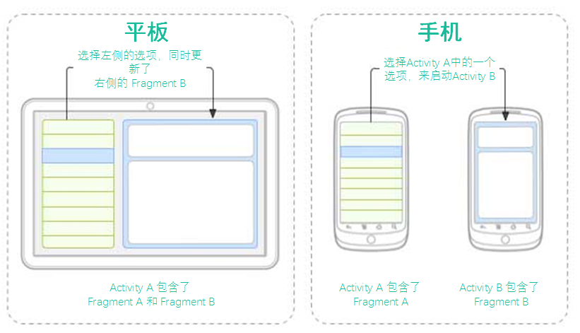
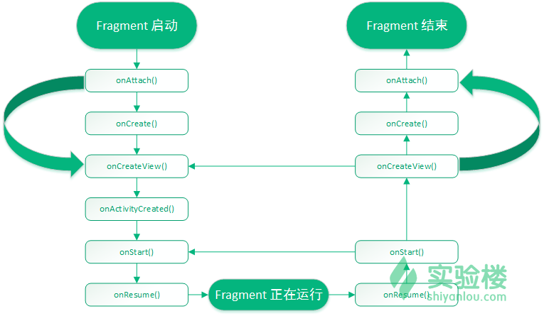
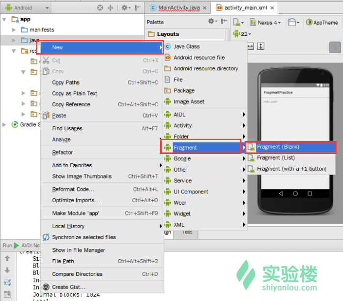
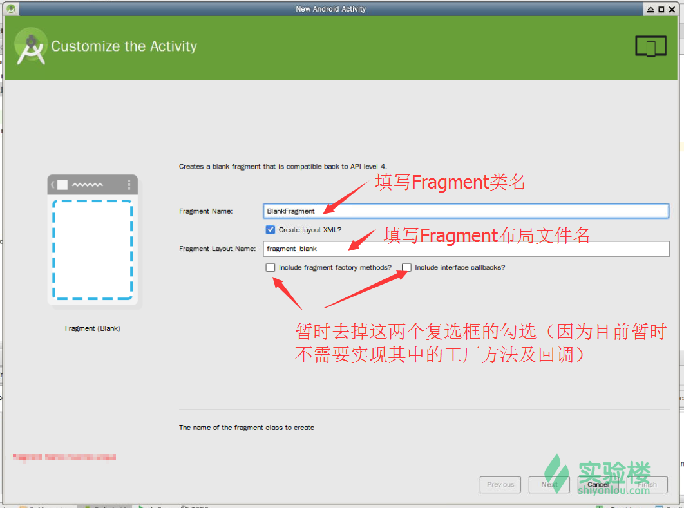
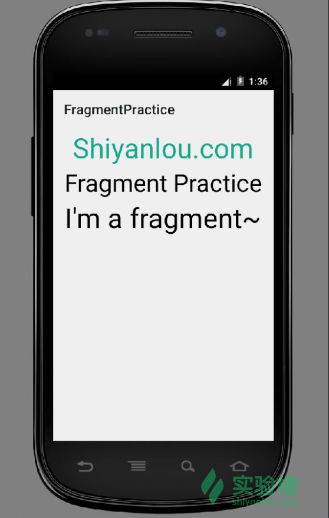

# 第 1 节 Fragment 简介及基本使用

## 一、实验简介

Fragment 是 Activity 的一种子模块，它必须嵌入到 Activity 中使用。Fragment 的引入最初是为了适应大屏幕设备，因为大屏幕设备（比如平板）可以容乃更多的 UI 组件，并且这些组件之间存在交互的关系。Fragment 允许开发者对 UI 组件进行模块化的管理，具有更多动态特性，对于提升应用的性能和体验非常有帮助。本实验就将带你学习 Fragment 的基础知识，并动手来创建一个简单的 Fragment。

### 1\. 知识点

*   Fragment 的概念
*   Fragment 的生命周期
*   Fragment 的种类
*   创建 Fragment

### 2\. 准备工作

请打开桌面上的 Android Studio，新建一个名为`FragmentPractice`的项目，域名填写`shiyanlou.com`（即包名为`com.shiyanlou.fragmentpractice`。项目最小 SDK 版本（`minSDK`）请选择`Android 5.1`，并选择`Blank Activity`作为模块创建一个 Activity，其它选项使用默认值即可。

等待项目创建完成后，请在 AVD 中创建一台模拟器并启动。

推荐的模拟器参数：

*   硬件平台：Nexus S （屏幕分辨率 480*800）
*   系统版本：Android 5.1.1 armeabli-v7a
*   **请去掉`Use Host GPU 选项`**

模拟器的启动时间约为 6 分钟，这段时间你可以回到 Android Studio 继续学习和编码。

## 二、Fragment 简介

>Fragment 是“一片装”的 Activity，能够实现更多模块化的 Activity 设计。换言之，我们可以说 Fragment 是一种“子 Activity”。可将其理解为“碎片”、“片段”。

我们用下面这些定义来描述 Fragment 中的关键信息：

*   Fragment 有自己的布局和带有生命周期回调方法的行为。
*   你可以在 Activity 运行中在其中添加或者移除 Fragment。
*   你可以在单个 Activity 中联合多个 Fragment 来构建多平面的 UI。
*   一个 Fragment 能够在多个 Activity 中使用。
*   Fragment 的生命周期与其宿主 Activity 的生命周期息息相关。例如，当 Activity 在暂停时，该 Activity 中所有可用的 Fragment 也会被停止。
*   一个 Fragment 可以实现一个没有用户界面组件的行为

在使用 Fragment 时，你可以通过继承`Fragment`类来创建 Fragment 对象，然后通过在 Activity 的布局文件中添加`<fragment>`标签，将其插入到 Activity 的布局中。

在 Fragment 组件引入 Android 体系之前，我们在开发过程中往往会遇到一些限制，比如在某一时刻，我们只能在屏幕上显示一个单独的 Activity。所以我们就无法将屏幕进行分割或是分开控制屏幕上不同的部分。这一点在平板等高分辨率设备上体现得特别明显。

但是有了 Fragment 之后，我们就能解除上述这个限制，从而更加灵活地创造应用。比如，我们可以有一个单一的 Activity，但是每个 Activity 可以包含多个 Fragment，并且每个 Fragment 都有自己的布局、事件和完整的生命周期。

下图给出了一个典型的例子，用于说明如何将 Fragment 定义的两个界面模块组合成平板上的一个 Activity，但在手机上却显示为分隔的。



当该应用运行在一个平板大小的设备上时，它可以在 Activity A 中嵌入两个 Fragment。但是，如果是在手机大小的设备上时（屏幕上没有足够的空间放置两个 Fragment），Activity A 将只会包含一个列表 Fragment。对于后者这种情况，当用户选择了某个列表项时，它就会启动包含了第二个 Fragment 的 Activity B。

### 1\. Fragment 的生命周期

我们说过，Fragment 有自己的生命周期，并且与一个 Activity 是类似的。

本小节就将介绍其生命周期的不同阶段，如下图所示：



你可以在项目的 Fragment 类中重写下列这些生命周期回调方法：

*   `onAttach()`：当 Fragment 与 Activity 发生关联时调用该方法。一个 Fragment 实例是与某个 Activity 实例相关联的。Fragment 和 Activity 没有被完全初始化。通常情况下，你在该方法中将 Fragment 关联到 Activity，然后 Activity 使用这个 Fragment 区完成进一步的初始化工作。
*   `onCreate()`：当创建 Fragment 时，系统会调用该方法。在该方法中，你应该初始化 Fragment 中必要的组件。
*   `onCreateView()`：当轮到 Fragment 首次绘制它的用户界面时，系统会调用该方法。为了绘制 Fragment 中的 UI，你应该从该方法中返回一个`View`组件。这个`View`组件代表了 Fragment 的根布局。如果某个 Fragment 没有提供 UI，那么你可以让该方法返回`null`。
*   `onActivityCreated()`：当宿主 Activity 被创建时，该方法会在`onCreateView()`方法之后被调用。Activity 和 Fragment 实例和 Activity 的视图层次结构一样会被创建。创建过程中，View 对象可以通过`findViewById()`方法来实例化。例如，在该方法中，你可以初始化一个需要`Context`对象的对象（这个解释可能有点深奥，在稍候的例子中再来体会其含义）。
*   `onStart()`：该方法只会在 Fragment 变为可视状态时被调用一次。
*   `onResume()`：当 Fragment 变为活跃状态时会调用该方法。
*   `onPause()`：系统调用该方法以作为用户离开 Fragment 的指示。
*   `onStop()`：当 Fragment 将要被停止时会调用该方法。
*   `onDestroyView()`：在该方法被调用时，Fragment 将会销毁所有的视图。
*   `onDestroy()`：该方法用于执行 Fragment 状态的最终清理，但不保证会被 Android 系统调用。

### 2\. 如何使用 Fragment

首先你需要思考在某个 Activity 中需要使用多少个 Fragment。例如，如果我们想要更好地处理设备上的横屏和竖屏模式，那就需要用两个 Fragment。

接着，基于 Fragment 的数量来创建对应的类，这些类需要继承`Fragment`类。`Fragment`类包含了所有上述的回调方法，你可以根据实际的需求，重写任意某个方法。

对于每个 Fragment，你需要创建对应的 xml 布局文件。这些文件里面包含了一些 UI 组件。

最后，根据需求，修改指定 Activity 的类文件，定义更换 Fragment 的实际逻辑。

### 3\. Fragment 的种类

Fragment 的用途主要分为三类，如下所示：

1.  单帧片段（Single Frame Fragment）：单帧片段主要用于手持设备（比如手机），在其中只会展示唯一一个作为视图的 Fragment。
2.  列表片段（List Fragment）：这类片段拥有特定的列表视图。
3.  片段通信（Fragment Transaction）：通过片段通信机制，我们可以将某个 Fragment 的信息转移到另一个那儿。

## 三、单帧片段 - Single Frame Fragments

单帧片段主要用于小屏幕设备（比如说手机），在 Android 3.0 及之后的系统中可用。

通常创建 Fragment 需要实现下列三个主要的回调方法：`onCreate()`、`onCreateView`和`onPause`。对于这三个方法的说明，在第二小节中已作解释。

下面，我们通过一个例子来创建自己的 Fragment。主要有以下步骤：

1.  请用 Android Studio 创建一个名为`FragmentPractice`的 Android 应用项目，包名为`com.shiyanlou.fragmentpractice`。如果已经创建了请忽略此步骤，该步骤可参考课程文档顶部的“准备工作”小节。
2.  项目创建成功后，通过目录树的右键菜单创建一个`Blank`类型的`Fragment`，如下图所示： 
3.  在弹出的对话框中填写 Fragment 的名称、布局文件名称。这里作为 Fragment 的入门教程，我们暂时不需要重写它的各种工厂方法和回调方法，所以请去掉下面两个复选框的勾选，如图所示： 
4.  编辑`res/layout`目录下的`fragment_blank.xml`文件，在其中放置一些用于标记特殊信息的文本标签。
5.  编辑`BlankFragment.java`中的内容，重写`onCreateView()`方法，为 Fragment 加载布局文件。
6.  编辑`res/layout`目录下的`activity_main`文件，为 MainActivity 中加载 Fragment 做准备。其中最重要的步骤就是放置一个`<Fragment/>`标签，你需要注意其中都用到了哪些属性。
7.  编辑`MainActivity.java`中的内容，向 MainActivity 中注入 Fragment 来显示内容。需要特别注意的是此处并没有用到`setContentView()`方法，而是用`FragmentManager`对象管理器来加载待使用的 Fragment 对象。

步骤`4`~`7`所使用到的代码已在下方给出，可供参考：

`MainActivity.java`中的主要内容有：

```java
package com.shiyanlou.fragmentpractice;

import android.app.Activity;
import android.app.FragmentManager;
import android.app.FragmentTransaction;
import android.os.Bundle;
import android.view.Menu;
import android.view.MenuItem;

public class MainActivity extends Activity {

    @Override
    protected void onCreate(Bundle savedInstanceState) {
        super.onCreate(savedInstanceState);

        FragmentManager fragmentManager = getFragmentManager();
        FragmentTransaction fragmentTransaction =
                fragmentManager.beginTransaction();

        BlankFragment blankFragment = new BlankFragment();
        fragmentTransaction.replace(android.R.id.content, blankFragment);

        fragmentTransaction.commit();
    }

} 
```

`res/layout`目录中的布局文件`activity_main.xml`中的主要内容如下：

```java
<RelativeLayout 
     android:layout_width="match_parent"
    android:layout_height="match_parent" android:paddingLeft="@dimen/activity_horizontal_margin"
    android:paddingRight="@dimen/activity_horizontal_margin"
    android:paddingTop="@dimen/activity_vertical_margin"
    android:paddingBottom="@dimen/activity_vertical_margin" tools:context=".MainActivity">

    <fragment
        android:name="com.shiyanlou.fragmentpractice.BlankFragment"
        android:id="@+id/blankfragment"
        android:layout_width="match_parent"
        android:layout_height="match_parent"
        tools:layout="@layout/fragment_blank" />

</RelativeLayout> 
```

`BlankFragment.java`的内容如下：

```java
package com.shiyanlou.fragmentpractice;

import android.app.Activity;
import android.net.Uri;
import android.os.Bundle;
import android.app.Fragment;
import android.view.LayoutInflater;
import android.view.View;
import android.view.ViewGroup;

public class BlankFragment extends Fragment {
    //作为自定义的片类，需要继承 Fragment 及其子类

    @Override
    public View onCreateView(LayoutInflater inflater, ViewGroup container,
                             Bundle savedInstanceState) {
        // 加载该 Fragment 的布局文件并返回
        return inflater.inflate(R.layout.fragment_blank, container, false);
    }

} 
```

`res/layout`目录下的`fragment_blank.xml`布局文件的内容如下：

```java
<FrameLayout 
     android:layout_width="match_parent"
    android:layout_height="match_parent"
    tools:context="com.shiyanlou.fragmentpractice.BlankFragment">

    <RelativeLayout
        android:layout_width="match_parent"
        android:layout_height="match_parent">
        <TextView
            android:layout_width="wrap_content"
            android:layout_height="wrap_content"
            android:id="@+id/textView_domain"
            android:layout_alignParentTop="true"
            android:layout_centerHorizontal="true"
            android:text="Shiyanlou.com"
            android:textSize="40dp"
            android:textColor="#11AA8C" />

        <TextView
            android:layout_width="wrap_content"
            android:layout_height="wrap_content"
            android:id="@+id/textView_title"
            android:layout_below="@+id/textView_domain"
            android:layout_centerHorizontal="true"
            android:gravity="center"
            android:text="Fragment Practice"
            android:textColor="#000000"
            android:textSize="35dp"/>

        <TextView
            android:layout_width="wrap_content"
            android:layout_height="wrap_content"
            android:id="@+id/textView_name"
            android:layout_below="@+id/textView_title"
            android:layout_centerHorizontal="true"
            android:gravity="center"
            android:text="I'm a fragment~"
            android:textColor="#000000"
            android:textSize="40dp"/>

    </RelativeLayout>

</FrameLayout> 
```

请编译并运行这个应用，在 Android 模拟器中（你应该在实验开始时就创建好了）启动它，然后检验我们在这个应用中的所作所为是正确的。



可以看到，我们并未在`MainActivity`的布局中放置上述任一一种 UI 组件，但该它仍然体现出一个普通的 Activity 外观。而我们看到的画面实际上是来自于定义好的`BlankFragment`，这些 UI 组件也是属于它的。

## 四、实验总结

Fragment 的开发与 Activity 的开发非常类似，我们在开发 Activity 时继承了 Activity 及其子类，而在开发 Fragment 时需要继承 Fragment 及其子类，这就是唯一的不同。对于一些业务逻辑的实现，你只需要将原来写在 Activity 的各个回调方法中的代码转移到对应的 Fragment 回调方法中即可。当然，这一步骤你还需要查阅官方的开发手册来完成，下面的参考文档中有你需要的信息。

我们将在后续的课程中继续讲解列表片段和片段通信的相关知识。

## 五、作业

本节实验只是完成了`onCreateView()`回调方法中的工作，请你继续完善`BlankFragment`的功能，在其中添加一个按钮，并通过点击按钮来弹出对话框。

当然，也可以尝试重写`onPause()`方法来通过`Log.v()`释放出一些消息。

## 参考文档

*   [Android 官方 API 手册（国内镜像站） - Fragment](http://www.android-doc.com/guide/components/fragments.html)