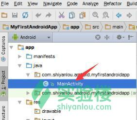
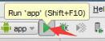

# 第 1 节 在 Android Studio 中创建项目和模拟器

## 一、实验简介

实验楼最近上线了一些 Android 的基础课程和项目课。建议你从本课程开始，熟悉 Android 的开发环境、一些基本的操作技巧以及调试技术，从而更好地学习后续课程。

本实验分为两个小节，

本章知识点

*   在 Android Studio 中创建项目
*   创建并启动 Android 模拟器

## 二、初识 Android Studio 并创建项目

通常，在实验楼 Android 相关的课程中，你会在最前面的位置看到下面这样的一段话： >请在`Android Studio`中新建一个名为`XXXPractice`的项目，包名可以取为`com.shiyanlou.android.xxxpractice`。项目基于`Android 5.1`版本的 SDK，在创建项目时请依靠`Blank Acticity`模板同时生成一个名为`MainActivity`的类文件。

我们将在本节实验中为你详细展开上述操作的具体步骤。

如同你耳熟能详的`DevC++`、`CodeBlocks`、`VisualStudio`或`Eclipse`，`Android Studio`已经逐渐取代`Eclipse`成为主流的 Android 开发环境。它能够运行在 linux、Windows 或 Mac OS X。

对于 Android Studio 与 Eclipse 之间的比较，你可以阅读知乎上的《[Android Studio 比 Eclipse 好用在哪里？](http://www.zhihu.com/question/21534929)》。

通常在打开 Android 课程的实验环境后，你看到的 linux 虚拟机环境如下所示：

此时双击桌面左上角的`AndroidStudio`图标打开它。

在启动画面中你可以看到右下角的一行字。是的，Android Studio 是基于`IntelliJ IDEA`的集成开发环境。IntelliJ IDEA 是被公认为最好的 java 开发工具之一，它的一些特性极大地简化了开发流程。你可以通过[百度百科 - IntelliJ IDEA](http://baike.baidu.com/view/2735945.htm)来详细了解它。

此时你可以看到 Android Studio 的欢迎页已经出来了，就像下面这样：

左侧的**Recent Projects**将会显示你在这里编辑做的最近项目。右侧的**Quick Start**则是快速开始选项。

红色方框选中的`Start a new Android Studio project`选项通常是我们课程里最常使用的，用于创建一个新的 Android 项目。

在此介绍一下其他的选项：

1.  `Open an existing Android Studio Project`：打开已有的 Android Studio 项目。在经历一段时间的学习后，如果你想继续编辑之前的项目，或者打开一个从网上下载的例子，你可以点击此选项。
2.  `Import an Android code sample`：导入 Android 代码样例。该功能将从 Google 及其合作伙伴那里读取示例的列表，你可以下载并查看一些优秀的项目并继续编辑它们（此功能需要科学上网）。
3.  `Check out project from Version Control`：从版本控制库中获取项目。对于团队开发来说，版本控制是必不可少的工具。此选项允许你从`GitHub`、`Google Cloud`以及`TortoiseSVN`等处同步项目。事实上，Android Studio 对于这些版本控制工具的支持也是很好的，你可以在设置中进行设定。
4.  `Import project(Eclipse ADT, Gradle, etc.)`：导入其他开发环境中的项目。通过该选项你可以将在 Eclipse 等处生成的项目迁移到 Android Studio 的开发环境中。
5.  `Configure`：设置。你可以在这里导入导出配置文件、管理插件和 SDK，以及更新等等。
6.  `Docs and How-Tos`：文档及提示。在这里对于 Android Studio 的使用给出了一些帮助和快捷键的对照表。但由于跳转的多数为境外网站，所以此功能并不是非常实用。

Android Studio 有更多的功能有待你去挖掘。对于创建项目而言，我们点击红框圈中的这个选项即可，此时会弹出新建项目对话框。

在该对话框中你需要填写待创建的项目名称、公司域名和项目的存放位置。

在填写时，有以下事项你需要注意：

1.  应用的命名应采用[驼峰命名法](http://baike.baidu.com/view/1165629.htm)，首字母必须要大写。
2.  此处的`Company Domain`在商业开发中是常用的，目的是便于归档。对于初学者而言，你可以理解为下面的`Package name`是域名的反转，即如果你要创建一个名为`com.shiyanlou.android.myfirstandroidapp`的包，你只需要填写域名为`android.shiyanlou.com`即可，末尾的`myfirstandroidapp`会被自动添加。这里的`包`是 java 中包的概念。
3.  根据实际情况，你可以设置`Project location`，也就是项目的位置。通常情况下我们使用默认值就行。

填好后，点击右下角的`Next`按钮进入下一步——选择目标 Android 设备。

你可以在这一步选择开发的应用将被在何种平台上运行，从上到下依次为手机和平板、电视（一些电视盒子即基于此开发）、手表（一些智能手表应用）、Google Glass。

同时，你还可以为发行平台设置最小的 SDK 版本号。`Minimum SDK`的版本即表明生成的应用能覆盖哪个版本及以后的系统。在实验楼的 Android 开发环境中，我们推荐你选择`API 22: Android 5.1(Lolipop)`这一版本，如下图所示：

点击`Next`按钮进入下一步，这时候会要求你为应用添加一个`Activity`，如下图所示。

Activity 是 Android 中的一种基础组件，你大致可以将其理解为一个页面。一些控件就将要被放置在这里面，而这一步选择不同类型的 Activity 实际上是依托各种类型的模板（例如全屏显示、登录页、自带导航栏等类型）来创建类文件。此处被添加的 Activity 将会被作为应用打开时默认启动的那一个。

如你所见，在我们的 Android 系列课程中，通常选择`Blank Activity`这个模板来创建 Activity。

请按照要求选择，并点击`Next`按钮进入到下一步。

这一步则是自定义 Activity 的信息，具体如下：

1.  `Activity Name`：定义 Activity 的名称。Android Studio 会据此生成同名的`.java`类文件。
2.  `Layout Name`：定义 Activity 的布局文件名。这里的布局文件是指一个决定 Activity 中各种控件属性的`xml`资源文件。
3.  `Title`：标题栏上要显示的文字信息，通常指明了这个页面的功能（比如首页、注册、帮助等）。这个内容可以在`res/values/string.xml`文件中找到。
4.  `Menu Resource Name`：菜单项资源文件名。对于一些次要的功能和设置项，Android 设计规范建议将其放在菜单中，这个内容可以在`res/values/menu.xml`文件中找到。

每个 Activity 都对应一个 xml 布局文件（layout），布局文件在项目的`res/layout`文件夹中可以找到。

设置好后，点击`Finish`按钮完成项目的创建工作。

Android Studio 会根据这些信息来创建项目，耐心等候它自动创建项目并进入主界面。这时你会在下图所示的对话框中看到一些关于`Gradle`的信息。

Gradle 是一款获业界高度评价自动化构建工具，它的用处很多，比如引入外部库等等。你可以访问[Gradle 官网](http://gradle.org/)了解更多信息。

稍候一会儿，你便能看到 Android Studio 的主界面了，如下图所示。

首先映入你眼帘的是巨大的编辑区，在左侧你能看到项目的组织结构和目录树，最上方则是常用的菜单和工具。

如果需要编辑指定的文件，比如编辑`MainActicity.java`文件，你就可以按照下面这样的路径并双击打开它。

Android Studio 的功能非常丰富，关于它的更加详细的介绍我们会在稍后的课程更新中提供。

## 三、配置和启动模拟器

Android 模拟器是可以运行在电脑上的虚拟设备，可以让你不需使用物理设备即可预览、开发和测试 Android 应用程序。当你身边并没有合适的 Android 设备时，模拟器就是一个不错的选择。

那么如何使用 Android 模拟器呢？

在 Android Studio 的主界面上方的工具栏中，你可以看到一个名为`AVD Manager`的按钮，点击它你就能打开 Android 虚拟设备管理器（AVD: Android Virtual Device）。

此时并没有任何的虚拟设备，我们需要点击中央的`Create a virtual device`按钮来创建一台模拟器。

创建模拟器的第一步是选择硬件。你可以通过选择现有的设备模板来定义一台模拟器。左侧的`Category`分类中可以选择是创建哪种类型的设备，通常我们是开发手机上的应用，所以选择`Phone`就可以了。右侧则显示了所有 Google 官方的设备模板，比如历年来发布的 Nexus 系列以及 Google Phone 系列。

需要注意的是，此处只是选择型号对应的硬件条件，而不会选择该设备在发布时搭载的系统镜像。

也就是说，你可以点击左下角的`New Hardware`完全定义一台设备的硬件配置和外观，或者通过`Import Hardware Profiles`来导入现成的配置方案。

点击右下角的`Next`按钮，进入到系统镜像的选择。

我们常说某个 Android 手机是 4.1 或 5.0 的系统，这里的`4.1`或`5.0`就是指系统镜像的版本。同样，对于模拟器而言，也需要为其配置某个版本的系统镜像。你可以看到这里只有 3 个镜像可供选择，请选择第一项——发布名为`Lolipop`的`Android 5.1.1`镜像。

如果你需要其他版本的系统，你可以在 Android SDK Manager 中下载对应的系统镜像包，再进入 AVD Manager 就能看到它们了。

接着，点击右下角的`Next`按钮，进入到确认配置的一步。

在这里，你可以设置模拟器的名称。我们建议你在名称中注明使用了哪一个版本的系统镜像（例如`API 22`）。

课程中你常常会看到这句话：

>**为获得更好的模拟器显示效果，请在本实验中，将 AVD 的屏幕缩放比例设置为默认值或者“`2dp on device = 1px on screen`”。**

这句话是指选项`Scale`一栏中，选择的屏幕缩放比例。若课程无特殊要求，使用`Auto`即可。

**需要特别注意的是**：在实验楼的环境中，我们建议你关闭`Use Host GPU`这一选项。而在你自己的电脑上则建议将其打开。

经过测算，在实验楼提供的实验环境中，Android 模拟器的启动时间在**6-8 分钟**左右。在此期间，你不必专门等候，耐心地阅读左侧的课程文档，并在 Android Studio 的编辑环境中跟着编写代码。在你创建的项目快要结束编写的时候，模拟器自然就启动好了。此时，你再编译并运行对应的项目即可。

在实际的开发工作中，我们建议你通过 USB 数据线将一台运行着 Android 系统的设备（手机或平板）与电脑相连接。这样你便能在较高性能的设备上测试应用，而不是体会模拟器给你带来的卡顿感。

最后点击`Finish`按钮，你就能在 AVD Manager 中的列表看到刚刚创建的模拟器。

点击每个模拟器列表项右侧的绿色箭头按钮，就能启动对应的模拟器了。

## 四、项目的编译和运行

在项目的源代码、资源文件和可能用到的外部库都编辑或配置好后，你就可以编译并运行这个“应用”了。

在工具栏上你可以找到`运行`按钮。

Android 项目在经过编译后会形成一个`apk`安装包，这个安装包在经过证书签名后就可以在各种设备（包括模拟器）上运行了。它在调试阶段使用的是`debug 证书`，若你想要将正式的安装包发布至应用市场，则需要使用自己的证书。

关于证书的介绍我们会在后续课程为你讲解。

## 四、实验总结

在本实验中我们学习了如何在 Android Studio 中创建项目并启动模拟器。这是做 Android 开发前最最基础的工作。在接下来的时间里，你也可以自己继续探索它的更多功能。

推荐 Android 系列课程：[Android 课程 - 实验楼](https://www.shiyanlou.com/courses/?course_type=all&tag=Android)