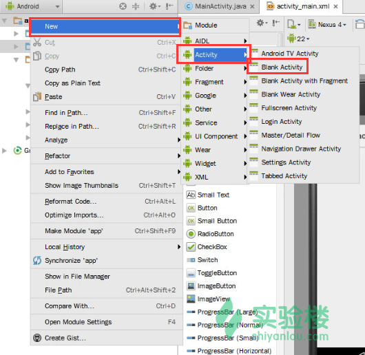
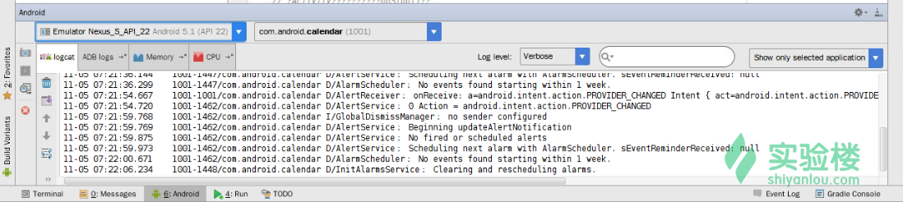

# 第 2 节 基础组件（1） - Activity

## 一、实验简介

本实验中，你将学习到 Android 四大组件之一的 Activity。你了解其主要的生命周期，并实际创建一个项目来使用 Activity。

### 1\. 知识点

*   Activity 的功能和作用
*   Activity 的生命周期
*   在 Android Studio 中创建 Activity
*   使用 Logcat

### 2\. 准备工作

请打开桌面上的 Android Studio，新建一个名为`ActivityPractice`的项目，域名填写`shiyanlou.com`（即包名为`com.shiyanlou.activitypractice`。项目最小 SDK 版本（`minSDK`）请选择`Android 5.1`，并选择`Blank Activity`作为模块创建一个 Activity，其它选项使用默认值即可。

等待项目创建完成后，请在 AVD 中创建一台模拟器并启动。

推荐的模拟器参数：

*   硬件平台：Nexus S （屏幕分辨率 480*800）
*   系统版本：Android 5.1.1 armeabli-v7a
*   **请去掉`Use Host GPU 选项`**

模拟器的启动时间约为 6 分钟，这段时间你可以回到 Android Studio 继续学习和编码。

上述过程如果你不是很会，可以参考课程《[Android Studio 项目创建和模拟器配置](https://www.shiyanlou.com/courses/417)》。

## 二、Activity 简介

Android 中有四大组件，分别是 Activity、Service、ContentProvider 和 Broadcast Receiver。对于 Activity，它是 Android 系统中最常用、最常见的一个组件。一个应用通常包含了多个 Activity。

一个 Activity 代表了一个具有用户交互接口的单个屏幕画面，这类似于 Java 里的`Window`或者`Frame`。Android 的 Activity 是`ContextThemeWrapper`类的子类。如果你有 C、C++或者 Java 语言的编程经验，你一定知道你的主程序运行起来时，是从`main()`方法开始的。十分类似的是，Android 系统在 Activity 中初始化自己的程序是从一个叫`onCreate()`的回调方法开始的。回调方法的序列能让一个 Activity 启动，也能让一个 Activity 关闭，如下图所示的 Activity 生命周期。


Activity 类定义了如下的回调事件，你不必在实际的项目中去实现所有的回调方法。但是很重要的一点是，你可能需要理解并实现它们，以确保你的应用能够按照用户所期待的那样来表现功能。

这些方法如下所示：

> - `onCreate()`：这是第一个回调方法。当 Activity 首次被创建时会调用它。 > - `onStart()`：当 Activity 对于用户来说变为可视状态时会回调此方法。 > - `onResume()`：当用户开始与应用交互时会调用此方法。 > - `onPause()`：当前的 Activity 正在暂停中，并且先前的 Activity 正在恢复时，被暂停的这个 Activity 不会再接收用户的输入，也不再执行任何代码和调用。 > - `onStop()`：当 Activity 不再为可视状态时会调用该回调方法。 > - `onDestroy()`：该方法会在 Activity 被系统销毁前被调用。 > - `onRestart()`：当 Activity 在被停止后重新启动时，会调用该回调方法。

## 三、创建 Activity

下面我们来动手做一个实例。这个实例将会通过几个简单的步骤来展示 Activity 的生命周期，你可以继续使用上一节课程中创建的`HelloWorld`项目。

1.  请用 Android Studio 创建一个名为`ActivityPractice`的 Android 应用项目，包名为`com.shiyanlou.activitypractice`。如果已经创建了请忽略此步骤，如果不太会的话请回到上一节。
2.  按照后文所示的那样来修改`MainActivity.java`中的内容，请保持该文件中的余下内容不被修改。
3.  请编译并运行这个应用，在 Android 模拟器中（你应该在本实验一开始就创建好了）启动它，然后检验我们在这个应用中的所作所为是正确的。

下面给出了`src/com.shiyanlou.activitypractice/MainActivity.java`中的代码内容。这个文件包含了 Activity 的基本的生命周期中的每一个方法。此处用到了`Log.d()`方法，它可用于产生日志信息，你可以在`Logcat`中看到这些信息。对于`Logcat`的详细解释你可以查看博文《[Log 图文详解](http://blog.csdn.net/Android_Tutor/article/details/5081713)》。

```java
package com.shiyanlou.activitypractice;

import android.os.Bundle;
import android.app.Activity;
import android.util.Log;

public class MainActivity extends Activity {
    String msg = "Shiyanlou :";

    // 当 Activity 首次启动时会调用 onCreate()方法
    // 可以简单理解为传统 java 程序中的 main()方法
    // 通常你需要重写这个方法，在其中加载界面的布局，初始化各类控件等
    @Override
    public void onCreate(Bundle savedInstanceState) {
        super.onCreate(savedInstanceState);
        setContentView(R.layout.activity_main);
        Log.d(msg, "The function onCreate() was called.");
    }

    // 当 Activity 即将变得可见时会调用 onStart()方法
    @Override
    protected void onStart() {
        super.onStart();
        Log.d(msg, "The function onStart() was called.");
    }

    // 当 Activity 已经变得可见时会调用 onResume()方法
    @Override
    protected void onResume() {
        super.onResume();
        Log.d(msg, "The function onResume() was called.");
    }

    // 当其他的 Activity 已经获得了焦点时会调用 onPause()方法
    @Override
    protected void onPause() {
        super.onPause();
        Log.d(msg, "The function onPause() was called.");
    }

    // 当 Activity 不再可见的时候会调用 onStop()方法
    @Override
    protected void onStop() {
        super.onStop();
        Log.d(msg, "The function onStop() was called.");
    }

    // 当 Activity 被销毁的时候会调用 onDestroy()方法
    @Override
    public void onDestroy() {
        super.onDestroy();
        Log.d(msg, "The function onDestroy() was called.");
    }
} 
```

一个 Activity 类会通过 XML 文件（该文件在项目的`res/layout`目录中）来加载所有的 UI 组件，下面这行代码从`res/layout/activity_main.xml`文件中加载 UI 组件。

```java
setContentView(R.layout.activity_main); 
```

一个应用可以有一个或多个 Activity，这没有任何限制。你在应用中定义的每个 Activity 都必须在项目的`AndroidManifest.xml`文件中声明。并且，应用中的主 Activity（你可想象成主界面）在声明时还必须注明`<intent-filter>`标签，这个标签中包括了`MAIN`动作（`action`）和`LAUNCHER`目录（`category`），如下所示：

```java
<?xml version="1.0" encoding="utf-8"?>
<manifest 
    package="com.shiyanlou.activitypractice" >

    <application
        android:allowBackup="true"
        android:icon="@mipmap/ic_launcher"
        android:label="@string/app_name"
        android:theme="@style/AppTheme" >
        <activity
            android:name=".MainActivity"
            android:label="@string/app_name" >
            <intent-filter>
                <action android:name="android.intent.action.MAIN" />

                <category android:name="android.intent.category.LAUNCHER" />
            </intent-filter>
        </activity>
    </application>

</manifest> 
```

如果你需要创建更多的 Activity，右键点击项目目录，在菜单中选择`New->Activity`即可，如下图所示：



如果一个应用没有任何一个 Activity 在声明时被注明上述两个标记，那么这个应用的图标将不会出现在主屏幕的应用列表中（不被系统所识别）。

## 四、运行项目

下面请尝试运行刚刚做好的这个`ActivityPractice`（或者`HelloWorld`）应用。

点击 Android Studio 上方的运行按钮。


此时项目进入编译状态，编译完成后会弹出`Choose Device`选择设备对话框，点击下方`OK`按钮。


如果没有可用的设备，则需要在`Android Device Monitor`中创建一台模拟器。

等待应用安装至模拟器，此时我们来说下怎样查看 Logcat 的消息。

在 Android Studio 的下方，有一个类似于控制台的消息窗口，如图所示：


点击带有绿色安卓小人图标的`Android`选项卡，就能切换到 Logcat 标签页，如下图所示：



在 Logcat 窗口的右上角搜索框内输入关键字，就能过滤出你想要的信息。当然不要忘了选择左边的`Log level`选择为`Debug`，因为我们用的是`Log.d()`方法。

回到模拟器，可以发现应用已经启动好了。我们在 Logcat 的关键字过滤中输入刚刚定义 log 信息时写的`shiyanlou`，如图所示：


从上图的信息中我们可以看到，`MainActivity`在启动过程中经历了`onCreate()`、`onStart()`和`onResume()`三个生命周期。

接下来，在模拟器上点击各个按键，看下你在执行各个操作时，Logcat 中都显示了这个应用经历了哪些生命周期。

按键的位置如下图所示：


在你按了`主页键`之后，系统就会返回桌面，此时你可以从应用菜单中再次点击`ActivityPractice`图标回到这个应用。

同时也不要忘了观察执行这些操作时，Logcat 中都出现了哪些信息。

至此，实验已经完成。

## 五、实验总结

作为基础课，我们主要是通过实际的操作来体会各个生命周期回调方法的作用和调用的时机。因此，熟练地掌握其生命周期是非常重要的。关于 Activity 更加详细地用法将在今后的课程中提供。

## 六、作业

请查阅文档，了解如何使用 Bundle 在 Activity 之间交换数据。

我们在第四节会对该知识点进行讲解。

稍后在实验楼也会上线该作业相关的项目课，请保持关注。

## 参考文档

*   [Android 开发官方文档 - Activities](http://www.android-doc.com/guide/components/activities.html)