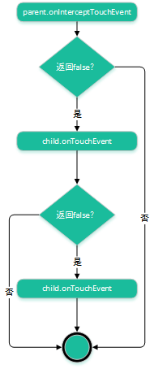
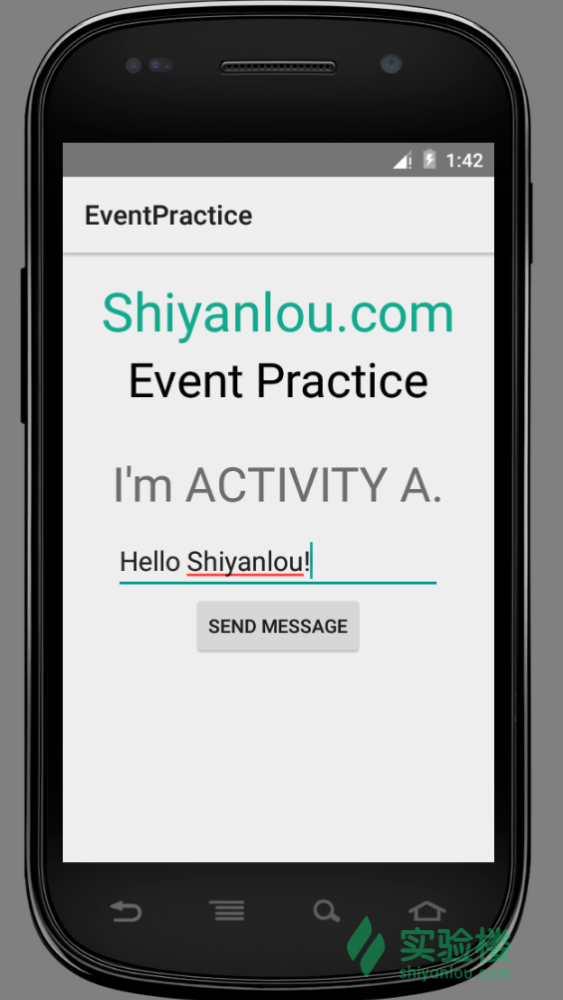
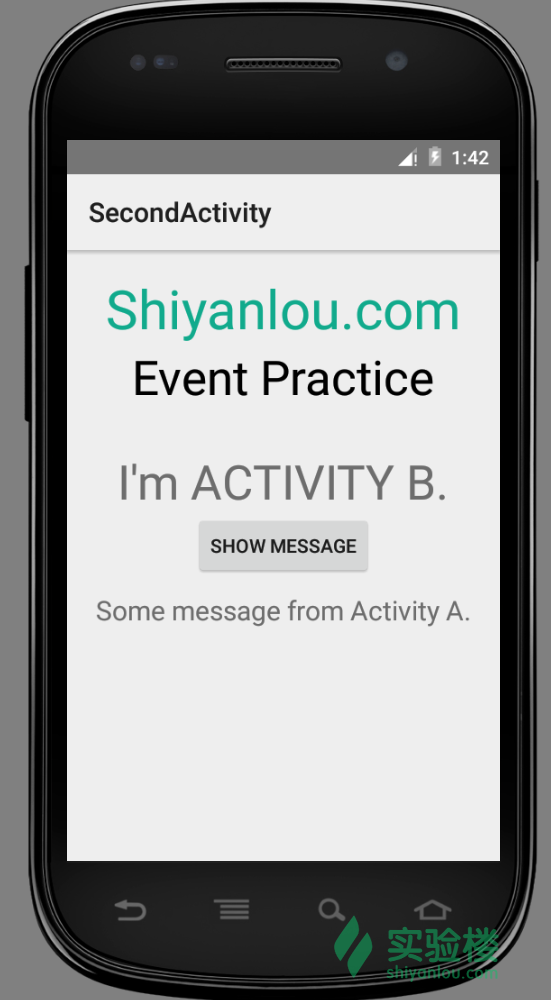

# 第 4 节 事件处理与内部通信

## 一、实验简介

本实验将带你学习 Android 中最基本的事件处理机制，了解什么是事件，怎样来监听事件。随后你将学习到什么是意图，以及通过一个实例来学习怎样用意图在 Activity 间传递信息。

### 1\. 知识点

*   Android 事件监听器
*   Android 事件处理者
*   事件监听器的注册
*   在 Activity 之间传递数据

### 2\. 准备工作

请打开桌面上的 Android Studio，新建一个名为`EventPractice`的项目，域名填写`shiyanlou.com`（即包名为`com.shiyanlou.eventpractice`。项目最小 SDK 版本（`minSDK`）请选择`Android 5.1`，并选择`Blank Activity`作为模块创建一个 Activity，其它选项使用默认值即可。

等待项目创建完成后，请在 AVD 中创建一台模拟器并启动。

推荐的模拟器参数：

*   硬件平台：Nexus S （屏幕分辨率 480*800）
*   系统版本：Android 5.1.1 armeabli-v7a
*   **请去掉`Use Host GPU 选项`**

模拟器的启动时间约为 6 分钟，这段时间你可以回到 Android Studio 继续学习和编码。

## 二、事件处理

对于应用的交互而言，事件是一个收集用户交互信息的有效途径。这些事件包括按压按钮或者触碰屏幕。Android 的框架维护了一个基于先进先出的事件队列，你可以在程序中捕获这些事件，并针对每个需求，采取合适的行动。

下面有三个关于 Android 事件管理的概念：

*   `事件监听器`：事件监听器是 View 类中的一个借口，它包含了一个回调方法。当用户与 UI 组件进行交互时，相应已注册的监听器会被触发，Android 框架会调用这些方法。
*   `事件监听器注册`：时间注册就是一个事件处理者通过事件监听器来注册的过程。因此，事件监听器触发事件时调用响应的处理者（`Handler`）。
*   `事件处理者`：当某个事件发生时，如果我们为该事件注册了一个事件监听器，那么这个监听器就会调用事件处理者。后者为实际处理该事件的方法。

### 1\. 事件监听器和事件处理者

以下为一些常见的事件处理者，后面补充了它对应的事件监听器和说明。

*   `onClick()`：对应的事件监听器是`OnClickListener()`。当用户点击、触摸或者聚焦（给它焦点）与任何一个部件时（这些部件有按钮、文本和图片等），该方法就会被调用。你可以使用名为`onCLick()`的事件处理者来处理这些事件。
*   `onLongClick()`：对应的事件监听器是`OnLongClickListener()`。当用户长时间（一秒或者很多秒）点击、触摸或聚焦于任何一个部件时，该方法会被调用。你可以使用名为`onLongClick()`的事件处理者来处理这些事件。
*   `onFocusChange()`：对应的事件监听器是`OnFocusChangeListener()`。有时当用户从某个视图部件上移开关注时，这个部件就会失去焦点，此时该方法会被调用。你可以使用`onFocusChange()`这个事件处理者来处理这些事件。
*   `onKey()`：对应的事件监听器是`OnFocusChangeListener`。当用户关注某个部件并且按压（或释放）了设备上的实体按键时，该方法会被调用。你可以使用`onKey()`事件处理者来处理这个事件。
*   `onTouch()`：对应的事件监听器是`OnTouchListener()`。当用户按键、释放按键或者在屏幕上任意移动手势时，会调用该方法。你可以使用`onTouch()`事件处理者来处理这个事件。
*   `onMenuItemClick`：对应的事件监听器是`onMenuItemCLickListener()`。当用户选择了一个菜单项时会调用该方法。你可以使用`onMenuItemCLick()`事件处理者来处理这个事件。
*   `onCreateContextMenu()`：对应的事件监听器是`OnCreateContextMenuItemListener()`。当上下文菜单正在建立时（持续的长按动作会触发该事件）会调用该方法。

在`View`类中，还有更多诸如`OnHoverListener`、`OnDragListener`之类的事件监听器可供使用。所以为了开发具有更加丰富功能的应用，你需要去查阅和参考 Android 开发的官方文档。

### 2\. 事件监听器注册

前文提到过，事件的注册就是一个事件处理者注册事件监听器的过程。尽管对于注册监听器来说，有许多灵活的方法，但在本课程中只列出了其中最常用的 3 种方法。在你的实际项目中，可以任意使用其中之一。

这些方法有：

*   使用匿名内部类
*   在`Activity`类中实现`Listener`的接口。
*   在`activity_main.xml`（对应的）布局文件中直接通过`android:onClick`属性指定事件处理者。

下面的内容将为你逐一讲解。

#### （1）使用匿名内部类注册事件监听器

以按钮的点击事件为例，首先要在 xml 布局文件中定义按钮的 id，然后在 Activity 类中实例化控件，使用自定义的内部类，如下所示：

```java
public class MainActivity extends Activity{
    @Override
    protected void onCreate(Bundle savedInstanceState) {
        super.onCreate(savedInstanceState);
        // 此处写其他代码
        // button 是查找后赋值的按钮对象
        button.setOnClickListener(new MyOnClickListener();
    }
    // 自定义的匿名内部类
    Private final  class MyOnClickListener implements OnClickListener{
        Public void onClick(View view){
            // 此处写点击功能的逻辑
        }
    }
} 
```

#### （2）实现事件监听器接口

这种方法是让当前 Activity 实现`OnClickListener`，并实现这个接口中的方法：`onClick(View view)`：

```java
public class MainActivity extends Activity implements OnClickListener{

    // 当然这儿应该还有该类中的其他内容

    @Override
    Public void onClick(View view){
    // 此处填实现的细节
    }
} 
```

#### （3）在布局文件中指定事件处理者

以按钮的点击事件为例，这种方法是在 xml 布局文件中，在控件属性里添加`android:onClick`属性，然后指明调用方法的名字，例如`android:onClick="onAddClick"`。

在对应的 Activity 类中，也需要写一个对应的方法，方法名要与之对应，如：

```java
public void onAddClick(View view){
    //这里填具体的逻辑
} 
```

### 3\. 触碰模式

用户可以通过实体按键、屏幕上的按钮，以及触摸屏幕来和设备交互。触摸屏幕能让设备进入触碰模式，用户可以通过屏幕上的虚拟按钮、图片来完成交互。你可以通过调用`View`类的`isInTouchMode()`方法来检查设备是否处于触碰模式。

这个流程图如下所示：



### 4\. 焦点

一个视图或部件在处于获得焦点状态时，通常会高亮显示或者显示一个闪烁的光标。这个状态意味着它已经准备好去接收用户的输入。

所以对于状态，主要的检查方法如下：

*   `isFocusable()`：返回`true`或者`false`。
*   `isFocusableInTouchMode()`：检查某个组件（或视图）在触碰模式下是否可以获得焦点（当使用实体按键但设备不处于触碰模式时，一个视图仍然是可以获得焦点的）。

在 XML 文件中可以对这些组件设置如下的属性，以确定是哪个组件可以获得焦点：

```java
android:focusUp="@+id/组件的 ID" 
```

### 5\. 触碰事件 onTouchEvent()

对于触碰事件的处理方式如下，请尝试去阅读代码块：

```java
public boolean onTouchEvent(motionEvent event){
// 通常需要重写这个 onTouchEvent()方法来对指定的操作实现响应

   switch(event.getAction()){
    // 对 event 对象传入的多个动作，使用 getAction()方法获得该动作的 ID 值（均是预定义好的常量），
    // 然后进行比较，在一些判断中来执行后续的操作。
    // 本例使用了 switch，你可以根据实际情况选择 if、while 并进行条件判断。

      case TOUCH_DOWN:
    //TOUCH_DOWN 指代了用户的手指已经按到屏幕上但还未抬起的这一动作。
      Toast.makeText(this,"The Button has been clicked down.",Toast.LENTH_LONG).show();
    //此处用了一个 Toast 提示框来显示用户执行了何种操作，下同。
      break();

      case TOUCH_UP:
    //TOUCH_UP 指代了用户的手指从屏幕上抬起的这一动作。
      Toast.makeText(this,"The Button has been clicked up.",Toast.LENTH_LONG).show();
      break;

      case TOUCH_MOVE:
    //TOUCH_MOVE 指代了用户的手指在屏幕上移动但还未抬起的这一动作。
      Toast.makeText(this,"The Button has been clicked move."Toast.LENTH_LONG).show();
      break;
   }
   return super.onTouchEvent(event) ;

} 
```

## 三、内部通信

当某个 Activity 需要启动另外一个 Activity 时，对于用于来说表现的是操作界面的切换，而对于应用本身来说，则需要通过`意图`（`Intent`）来告诉系统自己想要启动哪个 Activity。

事实上，无论是启动一个 Activity 还是一个 Service，或者一个 BroadcastReceiver，在 Android 中均需要用 Intent 来封装这种调用的“意图”。

而在这些组件切换的过程中，就可以使用 Intent 来传递信息。你可以将数据封装成 Bundle 对象，然后用 Intent 把这个对象携带至其他地方，从而实现了系统内部的一次数据交换。

在接下来的章节中经常会用到`startActivity(Intent intent)`、`startService(Intent service)`和`sendBroadcast(Intent intent)`等方法，这些方法就是使用了 Intent 来启动不同的组件。

**这一小节我们主要讨论 Intent 操作 Activity 的相关知识。**

意图是对于将要执行的操作的抽象描述。在`startActivity()`方法中，可以用意图来启动一个 Activity。意图的本身是一个 Intent 对象，它是一个可传递的数据结构，存放了将要执行的操作的抽象描述。

例如，你在某个 Activity 中需要打开邮件客户端并使用设备来发送给一封电子邮件，那么在你的 Activity 中就要用合适的选择器，发送一个`ACTION_SEND`意图给意图解析器。指定的选择器将给予用户合适的接口，让他选择怎样发送电子邮件数据（这一步有点类似于 Windows 系统中的打开方式，但它们并不是同一类东西）。

实现这个功能的主要代码如下：

```java
Intent intent_sendEmail = new Intent(Intent.ACTION_SEND, Uri.parse("mailto:"));
email.putExtra(Intent.EXTRA_EMAIL, 收件人的地址);
email.putExtra(Intent.EXTRA_SUBJECT, 邮件“主题”);
email.putExtra(Intent.EXTRA_TEXT, 邮件“正文”);
startActivity(Intent.createChooser(intent_sendEmail, "请选择一个邮件客户端以发送电子邮件…")); 
```

正如你所看到的，上面的代码中调用了`startActivity()`方法，会弹出一个让用户选择邮件发送客户端的 Activity，如下所示：


再比如，假设你需要一个 Activity 来打开设备上的浏览器应用并访问指定的 URL，你就需要在 Activity 中发送一个`ACTION_WEB_SEARCH`意图给 Android 意图解析器，从而在浏览器中打开这个 URL。

意图解析器解析了众多的 Activity，并且选中最适合当前设定的那一个（例如本例中的浏览器 Activity），然后意图解析器会将网页的 URL 传递给浏览器并访问它。

实现该功能的代码样例如下：

```java
String keyword = "shiyanlou";
Intent intent = new Intent(Intent.ACTION_WEB_SEARCH);
intent.putExtra(SearchManager.QUERY, keyword);
startActivity(intent); 
```

上面这段代码会在 Android 的搜索引擎中搜索`shiyanlou`相关信息。

对于在 Activity 中传递信息而言，则需要使用到 Bundle。我们稍后在实例中为你讲解其详细的使用方法。

## 四、实例

下面通过一个实例，通过实现匿名类和 XML 中声明两种方法来注册事件监听器。

主要有以下步骤：

1.  请使用 Android Studio 来创建一个名为`EventPractice`的项目，包名为`com.shiyanlou.eventpractice`。
2.  除了`MainActivity`，请通过菜单再创建一个名为`SecondActivity`的 Activity。
3.  在`res/layout/activity_main.xml`文件中的布局里，为`MainActivity`添加两个主要的控件：一个文本框`EditText`、一个按钮`Button`，并设置它们的属性（详细代码请参考后文）。
4.  在`res/layout/activity_second.xml`文件中的布局里，为`SecondActivity`添加两个主要的控件：一个按钮`Button`和一个文本标签`TextView`，并设置它们的属性（详细代码请参考后文）。特别注意在按钮的属性中添加一个`android:onClick="onShowMessage"`来注册监听器。
5.  修改`MainActivity.java`文件，在`MainActivity`类中声明刚刚添加的控件，在`onCreate()`方法内对它们进行实例化（使用`findViewById()`方法），对按钮以匿名内部类的方式添加点击事件监听器，在`onClick`方法中获取文本框的输入值，通过 Bundle 对象存入 Intent，并以这个 Intent 对象启动`SecondActivity`。
6.  修改`SecondActivity.java`文件中，实现已注册的`onShowMessgae`方法，在其中获取`MainActivity`传过来的值，并显示在 TextView 中。
7.  检查代码，编译并运行这个应用，在模拟器中查看运行的过程，检查其是否与设计的相一致。

下面是部分要用到的代码：

首先是`res/layout/activity_main.xml`中的内容：

```java
<RelativeLayout 
     android:layout_width="match_parent"
    android:layout_height="match_parent" android:paddingLeft="@dimen/activity_horizontal_margin"
    android:paddingRight="@dimen/activity_horizontal_margin"
    android:paddingTop="@dimen/activity_vertical_margin"
    android:paddingBottom="@dimen/activity_vertical_margin" tools:context=".MainActivity">

    <TextView
        android:layout_width="wrap_content"
        android:layout_height="wrap_content"
        android:id="@+id/textView_domain"
        android:layout_alignParentTop="true"
        android:layout_centerHorizontal="true"
        android:text="Shiyanlou.com"
        android:textSize="40dp"
        android:textColor="#11AA8C" />

    <TextView
        android:layout_width="wrap_content"
        android:layout_height="wrap_content"
        android:id="@+id/textView_title"
        android:layout_below="@+id/textView_domain"
        android:layout_centerHorizontal="true"
        android:gravity="center"
        android:text="Event Practice"
        android:textColor="#000000"
        android:textSize="35dp"/>

    <TextView
        android:layout_width="wrap_content"
        android:layout_height="wrap_content"
        android:id="@+id/textView_flagA"
        android:text="I'm ACTIVITY A."
        android:onClick="onStartService"
        android:layout_below="@+id/textView_title"
        android:layout_centerHorizontal="true"
        android:layout_marginTop="30sp"
        android:textSize="35dp"/>

    <EditText
        android:layout_width="wrap_content"
        android:layout_height="wrap_content"
        android:id="@+id/editText_message"
        android:hint="Enter some message here."
        android:layout_below="@+id/textView_flagA"
        android:layout_centerHorizontal="true"
        android:textSize="20dp"
        android:layout_marginTop="10sp"/>

    <Button
        android:layout_width="wrap_content"
        android:layout_height="wrap_content"
        android:id="@+id/button_sendMessage"
        android:layout_below="@+id/editText_message"
        android:layout_centerHorizontal="true"
        android:text="SEND MESSAGE"/>

</RelativeLayout> 
```

接下来是`MainActivity.java`中的内容，建议你先按照自己的思路实现，再来通过下面的代码验证自己的想法：

```java
package com.shiyanlou.eventpractice;

import android.app.Activity;
import android.content.Intent;
import android.os.Bundle;
import android.view.View;
import android.widget.Button;
import android.widget.EditText;

public class MainActivity extends Activity {

    // 声明两个待用的控件，一些只用于显示的控件你可以不用声明
    private EditText editText_mesage;
    private Button button_sendMessage;

    @Override
    protected void onCreate(Bundle savedInstanceState) {
        super.onCreate(savedInstanceState);
        setContentView(R.layout.activity_main);

        // 实例化两个控件
        editText_mesage = (EditText)findViewById(R.id.editText_message);
        button_sendMessage = (Button)findViewById(R.id.button_sendMessage);

        // 通过匿名内部类来为 button_sendMessage 注册点击事件监听器
        button_sendMessage.setOnClickListener(new View.OnClickListener() {

            // 重写 onCLick()方法，实现点击事件处理者的功能
            @Override
            public void onClick(View v) {
                // 创建一个字符串对象用于接收来自文本框的输入内容
                String message = new String();

                // 通过文本框的 getText()方法获取输入内容，赋予 message 字符串对象。
                message = editText_mesage.getText().toString();

                // 创建一个“意图”，用于从 MainActivity 跳转到 SecondActivity
                Intent intent = new Intent(MainActivity.this, SecondActivity.class);
                // 创建一个 Bundle 对象，名为 data，用于在 Activity 之间传递信息
                Bundle data = new Bundle();
                // 向这个 Bundle 对象中存入内容，因为是字符串，所以用 putString()方法
                // 参数的形式是 key-value 形式，在另外一个 Activity 取出内容的时候就是通过这个 key
                // 如果是其他的内容，则根据不同的数据类型选用不同的存入方法
                data.putString("mA",message);

                // 最后将 Bundle 存入 intent 对象中，让后者携带到另外一个 Activity 中
                intent.putExtras(data);

                // 调用 startActivity()方法，跳转到另外一个 Activity
                startActivity(intent);

                // 如果你想在启动 SecondActivity 的过程中关闭现在这个 Activity，
                // 则可以使用 finish()方法来结束当前 Activity。
                // MainActivity.this.finish();

            }
        });

    }

} 
```

接下来再创建一个`SecondActivity`，右键点击项目树，然后在菜单中依次选择`New->Activity->Blank Activity`，如下图所示：


在弹出的对话框中填入相关信息，点击`Finish`按钮完成`SecondActivity`的创建，如下图所示：


下面是`res/layout/activity_second.xml`中的内容，需要特别注意的是，这里使用了属性`android:onClick="onShowMessage"`为按钮`button_showMessage`注册了一个点击事件监听器。

```java
<RelativeLayout 
     android:layout_width="match_parent"
    android:layout_height="match_parent" android:paddingLeft="@dimen/activity_horizontal_margin"
    android:paddingRight="@dimen/activity_horizontal_margin"
    android:paddingTop="@dimen/activity_vertical_margin"
    android:paddingBottom="@dimen/activity_vertical_margin" tools:context=".MainActivity">

    <TextView
        android:layout_width="wrap_content"
        android:layout_height="wrap_content"
        android:id="@+id/textView_domain"
        android:layout_alignParentTop="true"
        android:layout_centerHorizontal="true"
        android:text="Shiyanlou.com"
        android:textSize="40dp"
        android:textColor="#11AA8C" />

    <TextView
        android:layout_width="wrap_content"
        android:layout_height="wrap_content"
        android:id="@+id/textView_title"
        android:layout_below="@+id/textView_domain"
        android:layout_centerHorizontal="true"
        android:gravity="center"
        android:text="Event Practice"
        android:textColor="#000000"
        android:textSize="35dp"/>

    <TextView
        android:layout_width="wrap_content"
        android:layout_height="wrap_content"
        android:id="@+id/textView_flagB"
        android:text="I&apos;m ACTIVITY B."
        android:onClick="onStartService"
        android:layout_below="@+id/textView_title"
        android:layout_centerHorizontal="true"
        android:layout_marginTop="30sp"
        android:textSize="35dp"/>

    <TextView
        android:layout_width="wrap_content"
        android:layout_height="wrap_content"
        android:id="@+id/textView_message"
        android:layout_below="@+id/button_showMessage"
        android:layout_centerHorizontal="true"
        android:textSize="20dp"
        android:text="Some message from Activity A."
        android:layout_marginTop="10sp"/>

    <Button
        android:layout_width="wrap_content"
        android:layout_height="wrap_content"
        android:id="@+id/button_showMessage"
        android:layout_below="@+id/textView_flagB"
        android:layout_centerHorizontal="true"
        android:text="SHOW MESSAGE"
        android:onClick="onShowMessage"/>

</RelativeLayout> 
```

以下是`SecondActivity.java`中的内容，在这里面我们就没有注册按钮的点击事件监听器了，而是实现了一个`onShowMessage()`方法用于承担点击事件处理者的职责。

```java
package com.shiyanlou.eventpractice;

import android.app.Activity;
import android.content.Intent;
import android.os.Bundle;
import android.view.View;
import android.widget.TextView;

public class SecondActivity extends Activity {

    // 声明一个文本标签控件
    private TextView textView_message;

    // 声明一个字符串变量用于存放前一个 Activity 中传过来的信息
    private String message ;

    @Override
    protected void onCreate(Bundle savedInstanceState) {
        super.onCreate(savedInstanceState);
        setContentView(R.layout.activity_second);

        // 实例化这个文本标签
        textView_message = (TextView)findViewById(R.id.textView_message);

        // 通过 getIntent()方法来获得启动当前 Activity 的上一个 Intent 对象
        Intent intent = getIntent();

        // 从 intent 对象中通过 getExtras()方法获得其携带的消息，
        // 接下来调用 getString()方法来得到这个字符串，注意该方法的参数为(字符串的 key，默认值)
        message = intent.getExtras().getString("mA","null");

    }

    public void onShowMessage(View view){
        // 如果获得了上个 Activity 传过来的消息，则显示在 TextView 中
        if(message!=null){
            textView_message.setText(message);
        }

    }

} 
```

以下是供参考的`AndroidManifest.xml`文件内容，一般而言不会手动改变其中的内容。

```java
<?xml version="1.0" encoding="utf-8"?>
<manifest 
    package="com.shiyanlou.eventpractice" >

    <application
        android:allowBackup="true"
        android:icon="@mipmap/ic_launcher"
        android:label="@string/app_name"
        android:theme="@style/AppTheme" >
        <activity
            android:name=".MainActivity"
            android:label="@string/app_name" >
            <intent-filter>
                <action android:name="android.intent.action.MAIN" />

                <category android:name="android.intent.category.LAUNCHER" />
            </intent-filter>
        </activity>
        <activity
            android:name=".SecondActivity"
            android:label="@string/title_activity_second" >
        </activity>
    </application>

</manifest> 
```

检查一下代码，编译并运行这个应用。等待应用安装至模拟器后，你会看到如下的画面：


在文本框中输入一些内容，比如：



然后点击`SEND MESSAGE`按钮，这时候就会启动另外一个 Activity，如下图所示：



尝试点击`SHOW MESSAGE`按钮，不出意外的话你会看到上一个 Activity 传递过来的信息，如下图所示：


至此，实验就完成了。

## 五、实验总结

在本实验中我们学习了什么是事件，以及如何来注册事件监听器、怎样实现具体的事件处理者。并且了解了什么是意图以及怎样通过意图在应用内部传递信息。通过这个实例，你应该学会了怎样让一个程序具有“生命力”，即怎样真正地去处理用户和应用的交互。这对于今后的开发时非常重要的。

不同的 UI 组件往往对应了不同的事件监听器，你可以查阅 Android 官方文档来作进一步了解。

## 六、作业

请阅读下方提供的参考文档，学习怎样使用 Intent Filter（意图过滤器）。

稍后实验楼会提供与该知识点有关的项目课，请保持关注。

## 参考文档

*   [Android 官方文档 - Intents and Intent Filters](http://www.android-doc.com/guide/components/intents-filters.html)