# 第 6 节 基础组件（3） - Content Provider

## 一、实验简介

本实验将带你学习 Androird 四大组件之三的 Content Provider。这是一种数据共享机制。

### 1\. 知识点

*   Android 内容共享机制
*   URI 简介
*   创建内容提供者

### 2\. 准备工作

请打开桌面上的 Android Studio，新建一个名为`ContentProviderPrac`的项目，域名填写`shiyanlou.com`（即包名为`com.shiyanlou.contetnproviderprac`。项目最小 SDK 版本（`minSDK`）请选择`Android 5.1`，并选择`Blank Activity`作为模块创建一个 Activity，其它选项使用默认值即可。

等待项目创建完成后，请在 AVD 中创建一台模拟器并启动。

推荐的模拟器参数：

*   硬件平台：Nexus S （屏幕分辨率 480*800）
*   系统版本：Android 5.1.1 armeabli-v7a
*   **请去掉`Use Host GPU 选项`**

模拟器的启动时间约为 6 分钟，这段时间你可以回到 Android Studio 继续学习和编码。

## 二、Content Provider 简介

内容提供者（`ContentProvider`）组件可以根据需要，把数据从一个应用程序发送到另一个。可以通过`ContentReceiver`类的一些方法来处理这些请求。一个内容提供者可以使用不同的方式去存储其数据，这些数据可以存储在数据库、文件或者网络中。

下图展示了 ContentProvider 在系统中所处的层次。

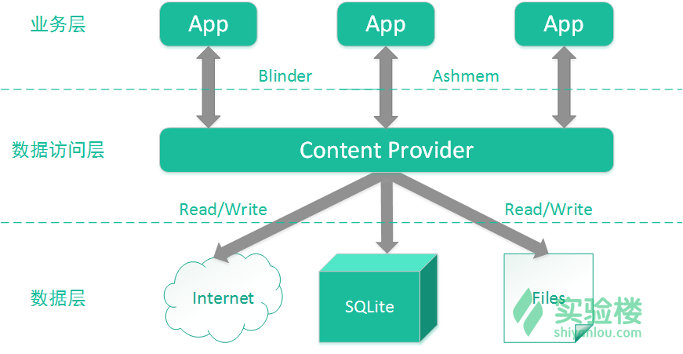

有时候在应用之间共享数据的时候需要使用 Content Provider，这也让它变得非常有用。

Content Provider 允许你将内容集中在一处而让许多其他不同的应用在需要的时候可以访问到。一个 Content Provider 就像数据库一样，你可以使用`insert()`、`delete()`、`query()`和`update()`等方法对内容进行增删查改。大多数情况下，这些内容存储在 SQLite 数据库中。

一个 Content Provider 实现为`ContentProvider`的一个子类（即继承后者），并且必须实现一系列能够使其它应用进行传输的系统标准 API。

```java
public class MyCP extends  ContentProvider {
    // 实现的细节
} 
```

### 1\. 内容统一标识符（URI）

>统一资源标识符（Uniform Resource Identifier，或 URI)是一个用于标识某一互联网资源名称的字符串。该种标识允许用户对任何（包括本地和互联网）的资源通过特定的协议进行交互操作。URI 由包括确定语法和相关协议的方案所定义。

对它更加详细的介绍欢迎查看[百度百科](http://baike.baidu.com/item/URI/2901761)。

为了查询一个内容提供者，你需要以 URI 的性质定义查询语句，形式如下：

```java
<prefix>://<authority>/<data_type>/<id> 
```

以下是 URI 各个部分的详细解释：

> - `prefix`：前缀，相当于 URL 中的协议部分（比如`http://`、`ftp:://`等），通常写成`content://`。 > - `authority`：相当于“作者”，这部分定义了特有的内容提供者名称（比如联系人、浏览器等）。对于第三方内容提供者，这部分必须是高质量的全称，比如`com.shiyanlou.dataprovider`。 > - `data_type`：这部分指示了特别的内容提供者给出的数据类型。例如，如果你正从名为`contacts`的内容提供者中获取所有的联系人，那么数据的路径将会是`people`，并且它的 URI 看起来就像是这样：`content://contacts/people`。 > - `id`：标识部分指定了请求中的特定记录。例如，如果你在内容提供者`contacts`中查找联系号码为`5`的数据，那么 URI 可以写成`contact://contacts/people/5`。

### 2\. 创建内容提供者

下面几个步骤能够让你创建自己的内容提供者。

*   首先你需要创建一个继承了`ContentProvider`类的内容提供者类。
*   第二步，你需要定义你的内容提供者的 URI 地址，这将用于访问指定内容。
*   接下来你需要创建自己的数据库来保存内容。通常在 Android 系统中使用 SQLite 数据库。这个框架需要重写`onCreate()`方法，会用到`SQLiteOpenHelper`里面的方法来创建或者打开提供者的数据库。在你的应用启动后，在应用的主线程内调用每个内容提供者的`onCreate()`方法。
*   接着你需要实现 n 内容提供者中的查询逻辑，使其执行不同的数据库指定操作。
*   最后在项目的`AndroidManifest.xml`文件中使用`<provider>`标签来注册这个内容提供者。

下面给出了`ContentProvider`类中，为了让内容提供者能正常使用而需要重写的方法。

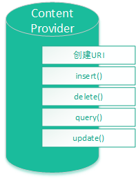

> - `onCreate()`：当提供者启动时会调用该方法。 > - `query()`：该方法接收来自客户端（此处的客户端可以理解为某个待服务的应用）的请求，返回的结果是一个`Cursor`（游标）对象。 > - `insert()`：该方法想内容提供者中插入新的记录。 > - `delete()`：该方法从内容提供者中删除一条已有的记录。 > - `update()`：该方法在内容提供者中更新一条已有的记录。 > - `getType()`：该方法返回给定 URI 中的数据的 MIME（多用途互联网邮件扩展类型）。

## 三、实例

下面通过一个例子来创建自己的内容提供者，请按照下面的步骤来操作。

这个应用主要是制作一个学生信息管理系统。为了简化开发所需的时间，要实现的功能主要是学生信息（姓名、描述信息）的录入，以及查找学生的相关信息（按名字或者按描述信息查找）。为了验证这个项目，我们将使用另外一个应用来访问该应用的 Content Provider 提供的内容。

### 1\. ContentProvider 应用

1.请使用 Android Studio 来创建一个名为`ContentProviderPrac`的项目，包名为`com.shiyanlou.contentproviderprac`。

2.修改`res/layout/activity_main.xml`文件中的默认内容，在线性布局中添加三个文本框，用于输入学生姓名、学生的信息以及待查找的关键字。另外，还需要两个按钮（添加学生、查找）和一个列表。

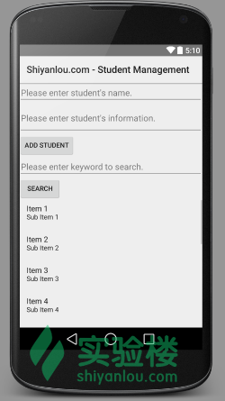

该文件的内容如下：

```java
<?xml version="1.0" encoding="utf-8"?>
<LinearLayout 
    android:orientation="vertical"
    android:layout_width="fill_parent"
    android:layout_height="fill_parent"
    >

    <EditText
        android:id="@+id/editText_student"
        android:layout_width="fill_parent"
        android:layout_height="wrap_content"
        android:hint="@string/hint_student"
        />

    <EditText
        android:id="@+id/editText_information"
        android:layout_width="fill_parent"
        android:layout_height="wrap_content"
        android:lines="2"
        android:hint="@string/hint_information"
        />

    <Button
        android:id="@+id/button_insert"
        android:layout_width="wrap_content"
        android:layout_height="wrap_content"
        android:text="@string/insert"
        />

    <EditText
        android:id="@+id/editText_keyword"
        android:layout_width="fill_parent"
        android:layout_height="wrap_content"
        android:hint="@string/hint_keyword"
        />

    <Button
        android:id="@+id/button_search"
        android:layout_width="wrap_content"
        android:layout_height="wrap_content"
        android:text="@string/search"
        />

    <ListView
        android:id="@+id/listView_result"
        android:layout_width="fill_parent"
        android:layout_height="fill_parent"
        />
</LinearLayout> 
```

3.修改`MainActivity.java`文件，对于具体代码的解释请看注释。

代码如下：

```java
package com.shiyanlou.contentproviderprac;

import android.app.Activity;
import android.content.Intent;
import android.database.Cursor;
import android.database.sqlite.SQLiteDatabase;
import android.os.Bundle;
import android.view.View;
import android.widget.Button;
import android.widget.EditText;
import android.widget.Toast;

import java.util.ArrayList;
import java.util.HashMap;
import java.util.Map;

public class MainActivity extends Activity {

    // 创建一个 DatabaseHelper 对象用于操作数据库
    MyDatabaseHelper dbHelper;

    // 声明两个按钮
    Button button_insert;
    Button button_search;

    @Override
    public void onCreate(Bundle savedInstanceState){

        super.onCreate(savedInstanceState);
        setContentView(R.layout.activity_main);

        // 实例化这个 MyDatabaseHelper 对象，指定它的数据库版本为 1，
        // 这个 myStudents.db 文件可以在应用的 data/databases 目录下找到
        dbHelper = new MyDatabaseHelper(this, "myStudents.db", 1);

        // 实例化两个按钮
        button_insert = (Button) findViewById(R.id.button_insert);
        button_search = (Button) findViewById(R.id.button_search);

        // 为按钮注册点击事件监听器
        button_insert.setOnClickListener(new View.OnClickListener() {

            @Override
            public void onClick(View source) {

                // 获取用户在文本框上的输入信息
                String student = ((EditText) findViewById(R.id.editText_student)).getText().toString();
                String information = ((EditText) findViewById(R.id.editText_information)).getText().toString();

                // 将输入信息插入到数据库中，这里用到了自定义的 insertData 方法
                insertData(dbHelper.getReadableDatabase(), student, information);

                // 显示一个 Toast 信息提示用于已经添加成功了
                Toast.makeText(MainActivity.this, "Add student successfully!", Toast.LENGTH_LONG).show();
            }
        });

        button_search.setOnClickListener(new View.OnClickListener(){

            @Override
            public void onClick(View source)
            {
                // 获取用户在文本框上输入的关键词
                String key = ((EditText) findViewById(R.id.editText_keyword)).getText().toString();

                // 利用游标对象，执行“行查询”，结果存入了游标对象中
                // 这部分不太懂没关系，在 SQLite 课程中会有讲解
                Cursor cursor = dbHelper.getReadableDatabase()
                        .rawQuery("select * from students where student like ? or information like ?",
                                new String[]{"%" + key + "%", "%" + key + "%"});

                // 创建一个 Bundle 对象来存入待传递的信息
                Bundle data = new Bundle();
                // 将游标转化为 list 对象放入 Bundle 对象中
                data.putSerializable("data", CursorConverToList(cursor));
                // 创建一个 Intent 来携带 Bundle 对象
                Intent intent = new Intent(MainActivity.this, ResultActivity.class);
                intent.putExtras(data);
                // 启动查询结果的 Activity
                startActivity(intent);
            }
        });
    }

    protected ArrayList<Map<String, String>> CursorConverToList(Cursor cursor){

        // 创建一个数组列表用于存放查询结果
        ArrayList<Map<String, String>> result = new ArrayList<Map<String, String>>();

        // 在 Cursor 对象中遍历整个结果集
        while (cursor.moveToNext())
        {
            // 将结果集中的数据存入 ArrayList 对象里面
            Map<String, String> map = new HashMap<String, String>();
            // 取出记录中第 2、3 列的值，即学生的名字和信息（第 1 列为 id）
            map.put("student", cursor.getString(1));
            map.put("information", cursor.getString(2));
            result.add(map);
        }

        // 返回转换的结果
        return result;
    }

    private void insertData(SQLiteDatabase db, String student, String information)
    {
        // 执行插入语句，插入学生的姓名以及信息
        db.execSQL("insert into students values(null , ? , ?)", new String[] {student, information });
    }

    // 需要重写 onDestroy()方法，用于保证应用应用退出时，数据库能被正常关闭
    @Override
    public void onDestroy()
    {
        super.onDestroy();

        if (dbHelper != null)
        {
            dbHelper.close();
        }
    }
} 
```

3.在同一个包内，使用右键菜单，新创建一个名为`ResultActivity`的 Activity。

具体过程如下所示：

首先是在项目目录树上右键点击，然后在右键菜单中依次选择“New->Activity->Blank Activity”，如下图所示：

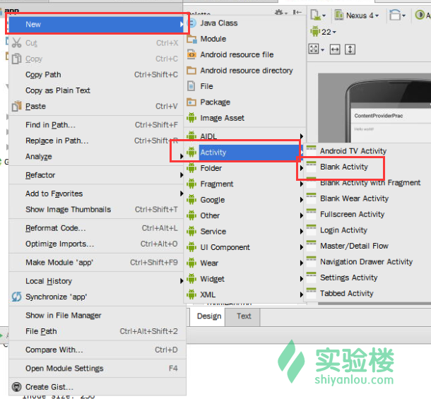

然后在弹出的对话框填入相关信息：

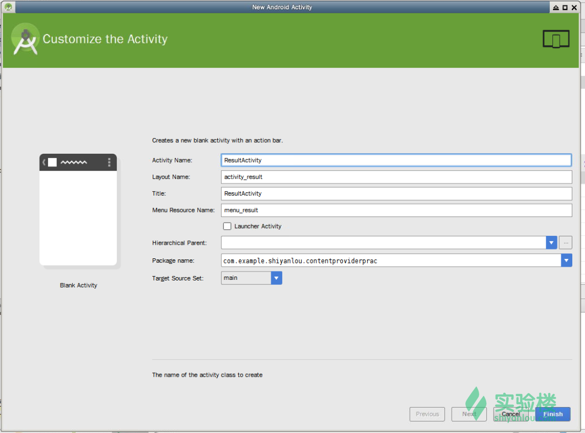

然后修改其布局文件`res/layout/activity_result.xml`，添加一个 ListView 用于显示搜索结果即可，主要内容如下：

```java
<?xml version="1.0" encoding="utf-8"?>
<LinearLayout 
    android:orientation="vertical"
    android:layout_width="fill_parent"
    android:layout_height="fill_parent"
    android:gravity="center"
    >
    <ListView
        android:id="@+id/listView_result"
        android:layout_width="fill_parent"
        android:layout_height="fill_parent"
        />
</LinearLayout> 
```

为了能正常向 ListView 中添加列表项，请在`res/layout`目录中再创建一个布局文件`item.xml`，步骤如下：

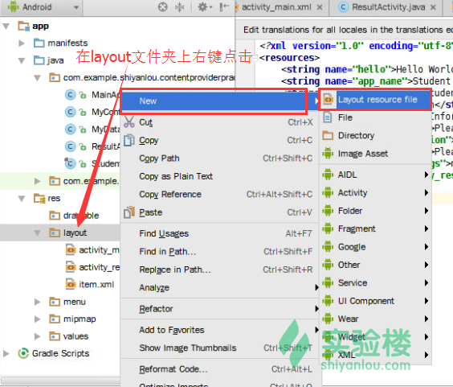

然后在弹出的对话框中填入相关信息即可。

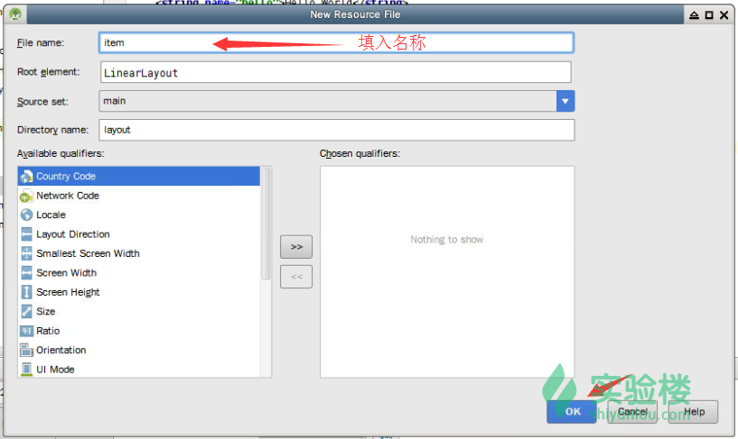

该布局文件中需要添加两个 EditText 和一个文本标签，内容如下：

```java
<?xml version="1.0" encoding="utf-8"?>
<LinearLayout 
    android:orientation="vertical"
    android:layout_width="fill_parent"
    android:layout_height="fill_parent"
    >
    <EditText
        android:id="@+id/editText_item_student"
        android:layout_width="fill_parent"
        android:layout_height="wrap_content"
        android:inputType="none"
        />
    <TextView
        android:layout_width="fill_parent"
        android:layout_height="wrap_content"
        android:text="@string/information"
        android:textSize="20dp"
        />
    <EditText
        android:id="@+id/editText_item_information"
        android:layout_width="fill_parent"
        android:layout_height="wrap_content"
        android:inputType="none"
        android:lines="2"
        />
</LinearLayout> 
```

最后，编辑`ResultActivity.java`文件，主要需要添加一个适配器用于向列表注入数据，具体如下：

```java
package com.shiyanlou.contentproviderprac;

import android.app.Activity;
import android.content.Intent;
import android.os.Bundle;
import android.widget.ListView;
import android.widget.SimpleAdapter;

import java.util.List;
import java.util.Map;

public class ResultActivity extends Activity {

    // 这个 Activity 用于显示查询的结果

    // 声明一个 ListView 对象用于显示查询结果
    ListView listView;

    @Override
    public void onCreate(Bundle savedInstanceState)
    {
        super.onCreate(savedInstanceState);
        setContentView(R.layout.activity_result);

        // 实例化 ListView 对象
        listView = (ListView)findViewById(R.id.listView_result);

        // 从 Intent 对象中取出携带的数据
        Intent intent = getIntent();
        // 从 Bundle 对象中进一步获得数据
        Bundle data = intent.getExtras();

        @SuppressWarnings("unchecked")
        List<Map<String , String>> list =
                (List<Map<String , String>>)data.getSerializable("data");

        // 将上面的 List 封装成 SimpleAdapter 对象，用于填充列表的数据

        SimpleAdapter adapter = new SimpleAdapter(ResultActivity.this , list, R.layout.item ,
                new String[]{"student" , "information"}, new int[]{R.id.editText_item_student, R.id.editText_item_information});

        // 用上面这个适配器对象为列表填充数据
        listView.setAdapter(adapter);
    }
} 
```

4.使用`<provider .../>`标签，在项目的`AndroidManifest.xml`文件中定义这个内容提供者（通常这一步在你使用菜单中的创建功能时已自动完成）。同样，一个应用可以拥有一个或多个内容提供者而不受任何限制。

`AndroidManifest.xml`文件的内容参考如下：

```java
<?xml version="1.0" encoding="utf-8"?>
<manifest 
    package="com.shiyanlou.contentproviderprac" >

    <application
        android:allowBackup="true"
        android:icon="@mipmap/ic_launcher"
        android:label="@string/app_name"
        android:theme="@style/AppTheme" >
        <activity
            android:name=".MainActivity"
            android:label="@string/app_name" >
            <intent-filter>
                <action android:name="android.intent.action.MAIN" />

                <category android:name="android.intent.category.LAUNCHER" />
            </intent-filter>
        </activity>

        <provider
            android:name=".MyContentProvider"
            android:authorities="com.shiyanlou.provider.Students"
            android:enabled="true"
            android:exported="true" >
        </provider>

        <activity
            android:name=".ResultActivity"
            android:label="@string/title_activity_result" >
        </activity>
    </application>

</manifest> 
```

5.同样在项目目录树上右键点击，然后在菜单中依次选择“New->Other->ContentProvider”，如下图所示：

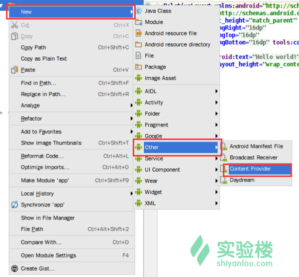

然后在弹出的对话框中填入相关信息，如下图所示：

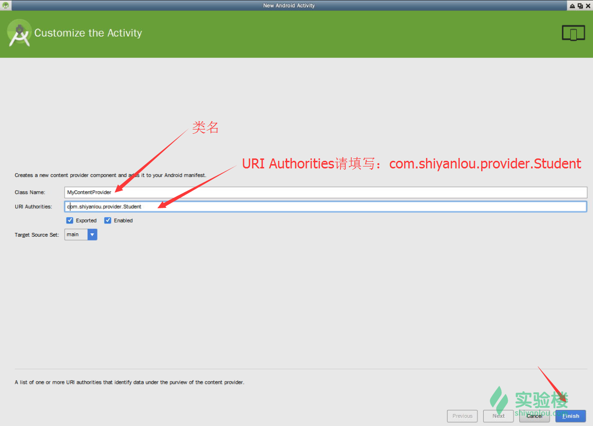

下面是`MyContentProvider.java`文件中的主要内容：

```java
package com.shiyanlou.contentproviderprac;
import android.content.ContentProvider;
import android.content.ContentUris;
import android.content.ContentValues;
import android.content.UriMatcher;
import android.database.Cursor;
import android.database.sqlite.SQLiteDatabase;
import android.net.Uri;

public class MyContentProvider extends ContentProvider {

    // 声明一个静态的 URI Matcher 对象
    private static UriMatcher matcher = new UriMatcher(UriMatcher.NO_MATCH);

    // 创建两个常量，用于标记 URI 的类别
    private static final int STUDENTS = 1;
    private static final int STUDENT = 2;

    // 同样创建一个 DatabaseHelper 对象用于操作数据库
    private MyDatabaseHelper dbOpenHelper;
    static
    {
        // 为 URI matcher 添加两个 URI
        matcher.addURI(Students.AUTHORITY, "students", STUDENTS);
        matcher.addURI(Students.AUTHORITY, "student/#", STUDENT);
    }

    // 此为 Content Provider 的 onCreate()方法
    // 在该内容提供者首次被调用时，该方法会被回调

    @Override
    public boolean onCreate()
    {
        dbOpenHelper = new MyDatabaseHelper(this.getContext(), "myStudents.db", 1);
        return true;
    }

    // 自定义方法 getType()，用于获得指定 URI 参数所对应数据的 MIME 类型
    @Override
    public String getType(Uri uri)
    {
        switch (matcher.match(uri))
        {

            // 该项对应操作的是多项数据记录
            case STUDENTS:
                return "vnd.android.cursor.dir/com.shiyanlou.students";
            // 该项对应操作的是单项数据记录
            case STUDENT:
                return "vnd.android.cursor.item/com.shiyanlou.student";
            default:
                throw new IllegalArgumentException("Unknown Uri:" + uri);
        }
    }

    // 自定的 query()方法，用于查询数据
    @Override
    public Cursor query(Uri uri, String[] projection, String where,
                        String[] whereArgs, String sortOrder)
    {
        SQLiteDatabase db = dbOpenHelper.getReadableDatabase();
        switch (matcher.match(uri))
        {
            // 如果 URI 的参数代表操作全部的学生信息数据项
            case STUDENTS:
                // 执行相应的查询
                return db.query("students", projection, where,
                        whereArgs, null, null, sortOrder);
            // 如果 URI 的参数代表操作指定某个学生的数据
            case STUDENT:
                // 如果 URI 的参数代表操作指定的学生信息数据项，则需要解析出指定学生的 ID
                long id = ContentUris.parseId(uri);

                String whereClause = Students.Student._ID + "=" + id;

                // 如果之前的 where 表达式存在，则直接用它来拼接新的操作语句
                if (where != null && !"".equals(where))
                {
                    whereClause = whereClause + " and " + where;
                }

                // 执行查询，返回结果
                return db.query("students", projection, whereClause, whereArgs,
                        null, null, sortOrder);
            default:
                throw new IllegalArgumentException("Unknown Uri:" + uri);
        }
    }

    // 自定义的 insert()方法，用于插入数据
    @Override
    public Uri insert(Uri uri, ContentValues values)
    {
        // 获得数据库的实例
        SQLiteDatabase db = dbOpenHelper.getReadableDatabase();
        switch (matcher.match(uri))
        {
            // 如果 URI 的参数代表操作全部的学生信息数据项
            case STUDENTS:
                // 插入学生相关数据，然后返回插入后的 ID
                long rowId = db.insert("students", Students.Student._ID, values);
                // 如果插入成功，rowID 肯定多于 0 个，所以返回其 URI
                if (rowId > 0)
                {
                    // 在已存在的 URI 后面追加 ID
                    Uri studentUri = ContentUris.withAppendedId(uri, rowId);
                    // 调用 notifyChange()方法，发出通知，表明数据已经被改变
                    getContext().getContentResolver().notifyChange(studentUri, null);
                    return studentUri;
                }
                break;
            default :
                throw new IllegalArgumentException("Unknown Uri:" + uri);
        }
        return null;
    }

    // 自定义的 update()方法，用于修改数据
    @Override
    public int update(Uri uri, ContentValues values, String where, String[] whereArgs)
    {
        // 获得数据库的实例
        SQLiteDatabase db = dbOpenHelper.getWritableDatabase();

        int num = 0;
        switch (matcher.match(uri))
        {
            // 如果 URI 的参数代表操作全部的学生信息数据项
            case STUDENTS:
                // 更新指定的记录
                num = db.update("students", values, where, whereArgs);
                break;

            // 如果 URI 的参数代表操作指定的学生信息数据项，则需要解析出指定学生的 ID
            case STUDENT:

                long id = ContentUris.parseId(uri);
                String whereClause = Students.Student._ID + "=" + id;
                // 同理，进行操作语句的拼接
                if (where != null && !where.equals(""))
                {
                    whereClause = whereClause + " and " + where;
                }
                num = db.update("students", values, whereClause, whereArgs);
                break;
            default:
                throw new IllegalArgumentException("Unknown Uri:" + uri);
        }

        // 调用 notifyChange()方法，发出通知，表明数据已经被改变
        getContext().getContentResolver().notifyChange(uri, null);
        return num;
    }

    // 自定义的 delete()方法，用于删除数据
    @Override
    public int delete(Uri uri, String where, String[] whereArgs)
    {
        // 获得数据库的实例
        SQLiteDatabase db = dbOpenHelper.getReadableDatabase();
        // 变量 num 用于记录待删除的记录数
        int num = 0;

        switch (matcher.match(uri))
        {
            // 如果 URI 的参数代表操作全部的学生信息数据项，则删除这些数据项
            case STUDENTS:
                num = db.delete("students", where, whereArgs);
                break;

            // 如果 URI 的参数代表操作指定的学生信息数据项，则需要解析出指定学生的 ID
            case STUDENT:

                long id = ContentUris.parseId(uri);
                String whereClause = Students.Student._ID + "=" + id;
                // 同理，拼接操作语句
                if (where != null && !where.equals(""))
                {
                    whereClause = whereClause + " and " + where;
                }
                num = db.delete("students", whereClause, whereArgs);
                break;
            default:
                throw new IllegalArgumentException("Unknown Uri:" + uri);
        }
        // 调用 notifyChange()方法，发出通知，表明数据已经被改变
        getContext().getContentResolver().notifyChange(uri, null);
        return num;
    }
} 
```

6.创建一个用于操作数据库的工具类`MyDatabaseHelper`。在项目目录树上右键点击，在菜单中依次选择“New->Java class”，如下图所示：

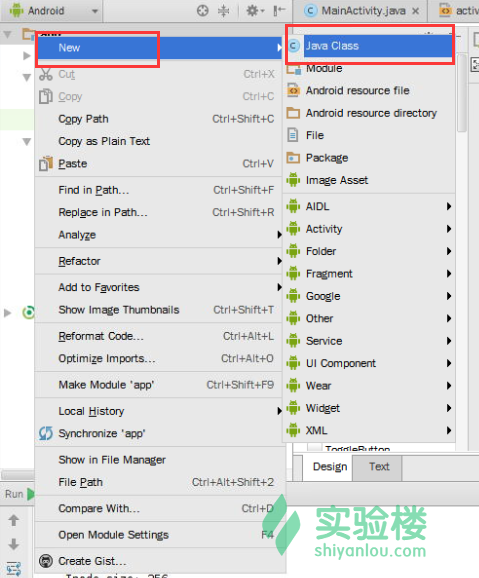

如果弹出下面这样的对话框，请选择第二个`src/main/java`目录作为创建文件的存放地址，如图所示：

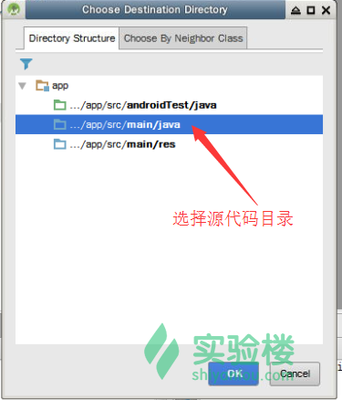

然后在新建类对话框中填入类名`MyDatabaseHelper`即可。对于该类我们不作详细解释，在 SQLite 相关的项目中你可以具体学习到相关知识。

```java
package com.shiyanlou.contentproviderprac;

import android.content.Context;
import android.database.sqlite.SQLiteDatabase;
import android.database.sqlite.SQLiteOpenHelper;

public class MyDatabaseHelper extends SQLiteOpenHelper
{
    final String CREATE_TABLE_SQL ="create table students(_id integer primary key autoincrement , student , information)";

    public MyDatabaseHelper(Context context, String name, int version)
    {
        super(context, name, null, version);
    }

    @Override
    public void onCreate(SQLiteDatabase db)
    {
        db.execSQL(CREATE_TABLE_SQL);
    }

    @Override
    public void onUpgrade(SQLiteDatabase db, int oldVersion, int newVersion)
    {
        System.out.println("Method onUpdate has been called.OLD:" + oldVersion + "Changed into NEW:" + newVersion);
    }
} 
```

7.使用同样的方法新建一个类，名为`Students.java`，该类作为常量类，存放一些字段信息。

```java
package com.shiyanlou.contentproviderprac;

import android.net.Uri;
import android.provider.BaseColumns;

public final class Students {

    // 定义内容提供者的 Authority 信息
    public static final String AUTHORITY = "com.shiyanlou.provider.Students";

    // 定义一个静态的内部类，用于存放该内容提供者都包含了哪些数据列
    public static final class Student implements BaseColumns {
        // 定义了能被操作的三个数据列的名称

        public final static String _ID = "_id";
        public final static String STUDENT = "student";
        public final static String INFORMATION = "info";

        // 定义了该内容提供者面向外界提供服务的两个 URI 地址
        public final static Uri STUDENTS_CONTENT_URI = Uri.parse("content://" + AUTHORITY + "/students");
        public final static Uri STUDENT_CONTENT_URI = Uri.parse("content://" + AUTHORITY + "/student");
    }
} 
```

8.以下是`res/values/strings.xml`中的内容，定义了许多布局中要使用的字符串资源。

```java
<?xml version="1.0" encoding="utf-8"?>
<resources>
    <string name="hello">Hello World</string>
    <string name="app_name">Student Management</string>
    <string name="insert">Add Student</string>
    <string name="search">Search</string>
    <string name="information">Information</string>
    <string name="hint_student">Please enter student\'s name.</string>
    <string name="hint_information">Please enter student\'s information.</string>
    <string name="hint_keyword">Please enter keyword to search.</string>
    <string name="action_settings">menu</string>
    <string name="title_activity_result">Search Result</string>
</resources> 
```

8.实现所有要求的功能，编译并运行这个应用，在模拟器中查看运行的过程，检查其是否与预想的一致。

程序运行的效果如下图所示：

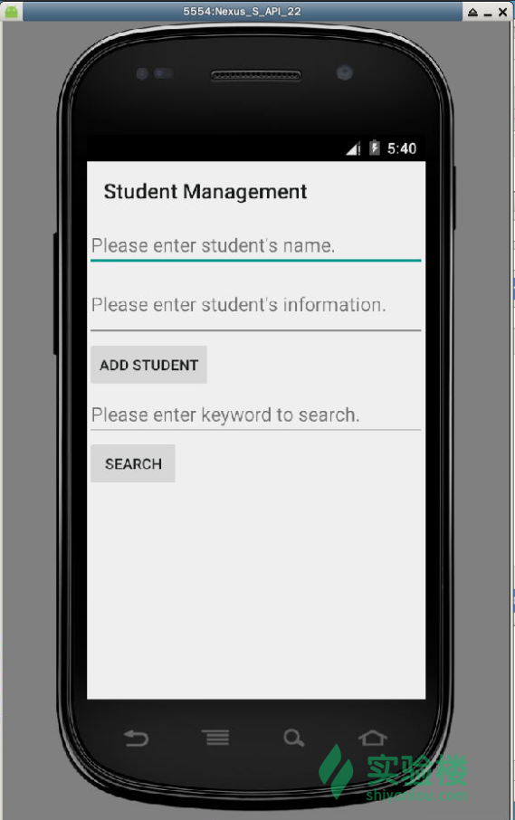

在上面两个文本框中输入一些学生的姓名和信息，然后点击`ADD STUDENT`按钮，就能将该信息添加到数据库中，如图所示：

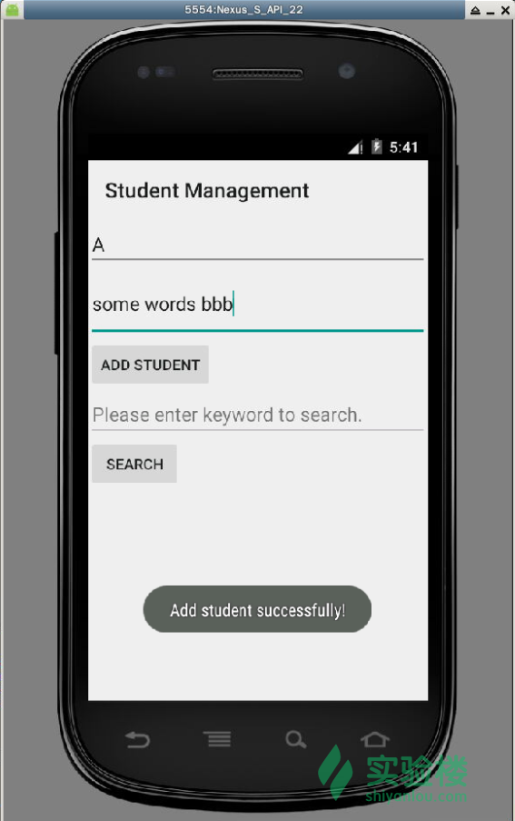

接下来再搜索的文本框中输入一些和刚刚学生的信息有关关键词，如下图所示：

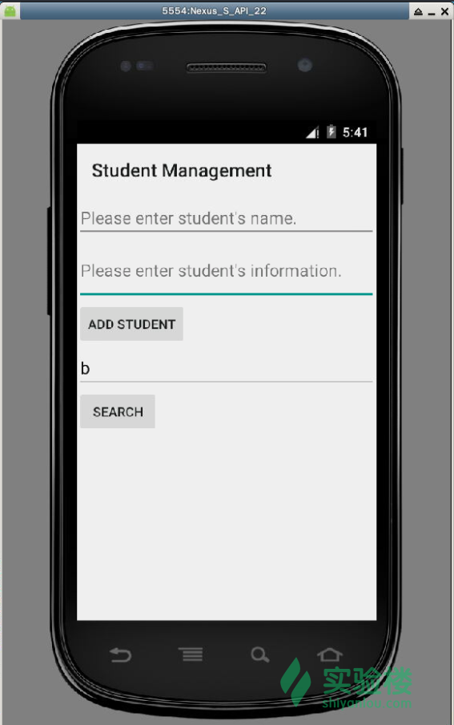

点击`SEARCH`按钮，稍候一会儿，就能在搜索结果页面中看到搜索的结果，如图所示：

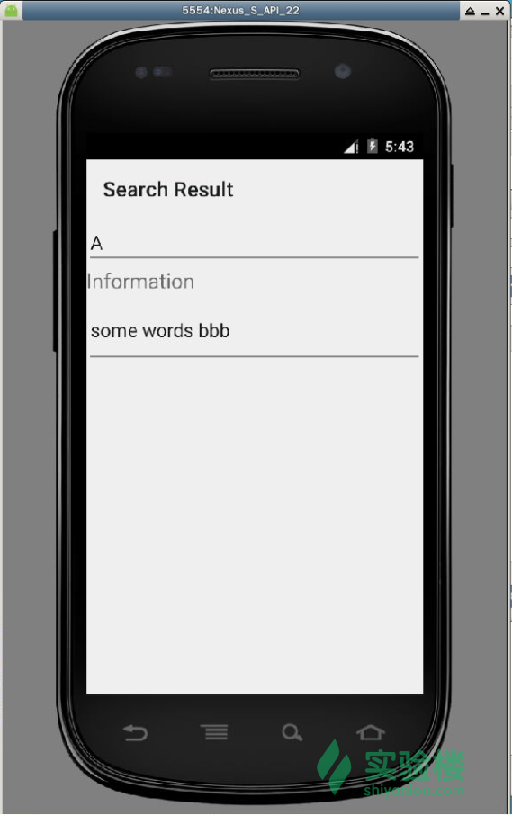

## 四、实验总结

在本实验中我们学习了 Android 的基础组件之一的 Content Provider。学习了它的工作机制，并且通过实际的项目来体会如何将应用自身的数据通过内容提供者的机制共享给其他应用。希望你能在今后的开发过程中尽可能依靠这一系统级的共享机制来为应用间数据交换提供便利。

## 参考文档

*   [Android 官方文档（镜像站） - Content Provider](http://www.android-doc.com/guide/topics/providers/content-providers.html)