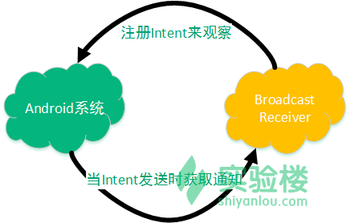
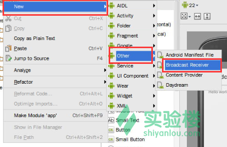
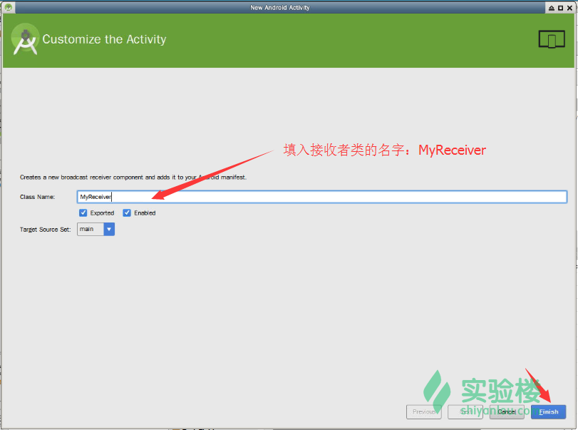
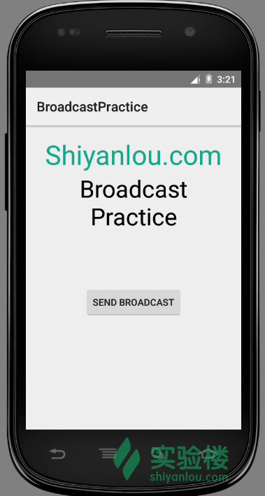
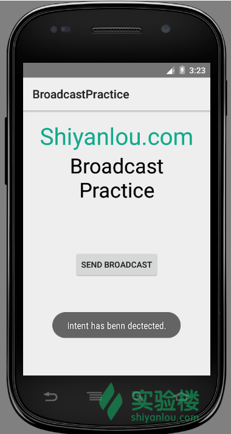

# 第 7 节 基础组件（4） - Broadcast Receiver

## 一、实验简介

本实验将带你学习 Android 中的最后一个基础组件——Broadcast Receiver。它就是 Android 中常用的广播机制，相当于一个全局的事件监听器。通过学习本节课程，你可以了解怎样广播意图以及接收广播。

### 1\. 知识点

*   Broadcast 的工作机制
*   创建和注册 Broadcast Receiver
*   使用广播发送意图

### 2\. 准备工作

请打开桌面上的 Android Studio，新建一个名为`BroadcastPractice`的项目，域名填写`shiyanlou.com`（即包名为`com.shiyanlou.broadcastpractice`。项目最小 SDK 版本（`minSDK`）请选择`Android 5.1`，并选择`Blank Activity`作为模块创建一个 Activity，其它选项使用默认值即可。

等待项目创建完成后，请在 AVD 中创建一台模拟器并启动。

推荐的模拟器参数：

*   硬件平台：Nexus S （屏幕分辨率 480*800）
*   系统版本：Android 5.1.1 armeabli-v7a
*   **请去掉`Use Host GPU 选项`**

模拟器的启动时间约为 6 分钟，这段时间你可以回到 Android Studio 继续学习和编码。

## 二、Broadcast 简介

`Broadcast Receiver`用于响应其他应用或系统本身发出的广播消息。这些消息有时被称为事件（`Event`）或意图（`Intent`）。例如，应用也能初始化广播，来让其他应用知道一些数据已经被下载到设备上了，并且对于其他应用时可用的。此时广播接收者就会侦听这个通讯，并且进行合适的初始化操作。

对于创建一个接收系统广播意图的 Broadcast Receiver，有两个重要的步骤：

*   创建 Broadcast Receiver。
*   注册 Broadcast Receiver。

如果你想实现自定义的意图，则需要一个额外的步骤来创建意图并将它们广播出去。

## 三、Broadcast 的使用

### 1\. 创建 Broadcast Receiver

一个广播接收者需要实现为 BroadcastReceiver 类的子类（即继承后者），并且重写`onReceice()`方法。这个方法中，每个消息都被接收，作为一个 Intent 对象参数，如下面这段代码所示。

```java
public class MyReceiver extends BroadcastReceiver {
   @Override
   public void onReceive(Context context, Intent intent) {
      Toast.makeText(context, "Intent Detected.", Toast.LENGTH_LONG).show();
   }
} 
```

### 2\. 注册 Broadcast Receiver

一个应用通过在`AndroidManifest.xml`文件中注册一个`Broadcast Receiver`来监听特定的广播意图。接下来的案例中，我们将要注册一个`MyReveiver`来监听系统产生的事件`ACTION_BOOT_COMPLETED`。这个事件将在 Android 系统完成启动过程之后由系统发起一次。

下图展现了这一过程。



```java
<application
   android:icon="@drawable/ic_launcher"
   android:label="@string/app_name"
   android:theme="@style/AppTheme" >
   <receiver android:name="MyReceiver">

      <intent-filter>
         <action android:name="android.intent.action.BOOT_COMPLETED">
         </action>
      </intent-filter>

   </receiver>
</application> 
```

现在无论何时，只要这台 Android 设备启动完成，名为`MyReceiver`的广播接收者就会拦截这一事件，并且执行其内在的`onReveice()`方法中的逻辑。

许多系统产生的事件在`Intent`类中被定义为静态域（`final static`）。下面展示了其中一些比较重要的系统事件。

> - `android.intent.action.BATTERY_CHANGED`：这是一个持续的广播，包含了充电状态、等级，以及其他关于电池的信息。 > - `android.intent.action.BATTERY_LOW`：指示了设备的低电量状态。 > - `android.intent.action.BATTERY_OKAY`：在电池经历了低电量状态后，指示其已经恢复。 > - `android.intent.action.BOOT_COMPLETED`：该广播只会在系统完成启动后出现一次。 > - `android.intent.action.BUG_REPORT`：显示某个 Activit 报告了一个 bug。 > - `android.intent.action.CALL`：展现一个拨给程序指定号码的拨号事件。 > - `android.intent.action.CALL_BUTTON`：当用户按拨号键进入拨号界面的时候，会展现该事件。当然，其他能完成拨号功能的用户界面也能完成此事。 > - `android.intent.action.DATE_CHANGED`：当日期发生改变时会有此事件。 > - `android.intent.action.REBOOT`：当设备重启时会有此事件。

### 3\. 广播自定义的意图（Intent）

如果你想让你的应用自身能够产生并发送自定义的意图，那么你需要在你的某个 Activity 类中，通过`sendBroadcast()`方法，来创建和发送这些意图（Intent）。如果你使用了`sendStickyBroadcast()`方法，则创建的这个意图我们称其是`粘性的`，这意味着你发送的这个意图将在广播完成后持续存在。

>通过`sendBroadcast()`中发出的`Intent`在`ReceverActivity`不处于`onResume`状态是无法接受到的，即使后面再次使其处于该状态也无法接受到。而`sendStickyBroadcast()`发出的`Intent`当`ReceverActivity`重新处于`onResume`状态之后就能重新接受到其`Intent`。换句话说，`sendStickyBroadcast()`发出的最后一个`Intent`会被保留，下次当`Recevier`处于活跃的时候，又会接受到它。（此段引用自[9ria 社区](http://bbs.9ria.com/thread-216610-1-1.html)）

下面的代码展现了如何创建和在广播中发送意图。

```java
public void broadcastIntent(View view)
{
   Intent intent = new Intent();
   intent.setAction("com.shiyanlou.CUSTOM_INTENT");
   sendBroadcast(intent);
} 
```

这个`com.shiyanlou.CUSTOM_INTENT`也能以类似于注册系统产生的意图那样注册，就像下面这样。

```java
<application
   android:icon="@drawable/ic_launcher"
   android:label="@string/app_name"
   android:theme="@style/AppTheme" >
   <receiver android:name="MyReceiver">

      <intent-filter>
         <action android:name="com.shiyanlou.CUSTOM_INTENT">
         </action>
      </intent-filter>

   </receiver>
</application> 
```

## 四、实例

下面通过一个实例来体会如何创建`BroadcastReceiver`来拦截自定义的意图。一旦你对自定义意图很熟悉了，那么你就可以在应用中编写代码来截获系统的意图。所以请按照下面的步骤来编写一个 Android 应用。

主要的步骤有：

1.  请使用 Android Studio 来创建一个名为`BroadcastPractice`的项目，包名为`com.shiyanlou.broadcastpractice`。
2.  修改`MainActivity.java`文件，在其中添加`onBroadcastIntent()`方法，用于将一个定义的意图广播出去。
3.  在项目的目录树上使用右键菜单，在同一个包内，创建一个名为`MyReceiver`的广播接收者类，用于接收上一步中发出的广播。
4.  使用`<eceiver .../>`标签，在项目的`AndroidManifest.xml`文件中注册这个广播。
5.  修改`res/layout/activity_main.xml`文件中的默认内容，在线性布局中添加一个按钮，为其注册点击事件监听器为`MainActivity.java`中的`onBroadcastIntent`方法。
6.  检查代码，编译并运行这个应用，在模拟器中查看运行的过程，检查其是否与预想的一致。

下面是`src/MainActivity.java`文件中的源代码：

```java
package com.shiyanlou.broadcastpractice;

import android.app.Activity;
import android.content.Intent;
import android.os.Bundle;
import android.view.View;

public class MainActivity extends Activity {

    @Override
    protected void onCreate(Bundle savedInstanceState) {
        super.onCreate(savedInstanceState);
        setContentView(R.layout.activity_main);
    }

    // 自定义的 broadcastIntent()方法，用于将自定义的意图发送出去
    public void onBroadcastIntent(View view){
        Intent intent = new Intent();
        intent.setAction("com.shiyanlou.CUSTOM_INTENT");
        sendBroadcast(intent);
    }
} 
```

下面是`MainActivity`的布局文件`res/layout/activity_main.xml`中的内容：

```java
<RelativeLayout 
     android:layout_width="match_parent"
    android:layout_height="match_parent" android:paddingLeft="@dimen/activity_horizontal_margin"
    android:paddingRight="@dimen/activity_horizontal_margin"
    android:paddingTop="@dimen/activity_vertical_margin"
    android:paddingBottom="@dimen/activity_vertical_margin" tools:context=".MainActivity">

    <TextView
        android:layout_width="wrap_content"
        android:layout_height="wrap_content"
        android:id="@+id/textView_domain"
        android:layout_alignParentTop="true"
        android:layout_centerHorizontal="true"
        android:text="Shiyanlou.com"
        android:textSize="40dp"
        android:textColor="#11AA8C" />

    <TextView
        android:layout_width="wrap_content"
        android:layout_height="wrap_content"
        android:id="@+id/textView_title"
        android:layout_below="@+id/textView_domain"
        android:layout_centerHorizontal="true"
        android:gravity="center"
        android:text="Broadcast Practice"
        android:textColor="#000000"
        android:textSize="35dp"/>

    <Button
        android:layout_width="wrap_content"
        android:layout_height="wrap_content"
        android:id="@+id/button_sendBroadcast"
        android:layout_centerHorizontal="true"
        android:text="SEND BROADCAST"
        android:layout_below="@+id/textView_title"
        android:layout_marginTop="80sp"
        android:onClick="onBroadcastIntent"/>

</RelativeLayout> 
```

对于创建广播接收者，你需要右键点击项目目录，然后在右键菜单内依次选择`New->Other->BroadcastReceiver`，如下图所示：



然后在弹出的对话框中填入类名，这里我们可以使用默认的`MyReceiver`，如下图所示：



下面是`src/com.shiyanlou.broadcastpractice/MyReceiver.java`文件中的内容。

```java
package com.shiyanlou.broadcastpractice;

import android.content.BroadcastReceiver;
import android.content.Context;
import android.content.Intent;
import android.widget.Toast;

public class MyReceiver extends BroadcastReceiver {

    public MyReceiver() {

    }

    // 重写的 onReceive()方法，在接收到指定的广播时会回调该方法
    @Override
    public void onReceive(Context context, Intent intent) {
        Toast.makeText(context, "Intent has benn dectected.",Toast.LENGTH_LONG).show();

    }
} 
```

最后是`AndroidManifest.xml`文件中的内容，你需要在这里面为广播接收者定义好其动作。

```java
<?xml version="1.0" encoding="utf-8"?>
<manifest 
    package="com.shiyanlou.broadcastpractice" >

    <application
        android:allowBackup="true"
        android:icon="@mipmap/ic_launcher"
        android:label="@string/app_name"
        android:theme="@style/AppTheme" >
        <activity
            android:name=".MainActivity"
            android:label="@string/app_name" >
            <intent-filter>
                <action android:name="android.intent.action.MAIN" />

                <category android:name="android.intent.category.LAUNCHER" />
            </intent-filter>
        </activity>

        <receiver
            android:name=".MyReceiver"
            android:enabled="true"
            android:exported="true" >
            <intent-filter>
                <action android:name="com.shiyanlou.CUSTOM_INTENT" />
            </intent-filter>
        </receiver>
    </application>

</manifest> 
```

检查一下代码，点击工具栏上的绿色箭头状的运行按钮，选择设备后等待应用安装至模拟器。

该应用启动后的界面如下所示： 

点击`SEND BROADCAST`按钮，应用会立即发送一条广播。而注册的`MyReceiver`在捕获到这个广播后，会立即通过 Toast 消息提示我们已经收到了广播，如下图所示：



至此，实验就完成了。

## 五、实验总结

在本实验中我们学习了最后一个 Android 的基础组件——广播接收者。实际上我们还在项目中学会了如何发送一个广播。通过这个机制，你就能更好地让自己的应用与其他应用进行交互，实现一些更高级的功能。

## 六、作业

请尝试在本实验的基础上，继续丰富这个应用的功能，可以发送更多的广播。你也可以重新创建一个项目，制作一个新的应用来接收原来这个应用发出的广播，即跨应用接收广播。

## 参考文档

*   [Android 官方 API 手册（镜像站）- BroadcastReceiver](http://www.android-doc.com/reference/android/content/BroadcastReceiver.html)