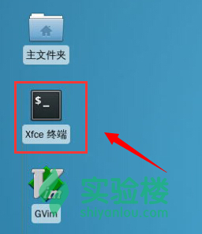
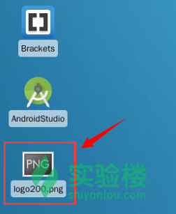
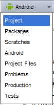
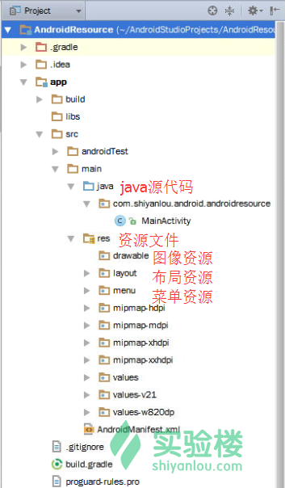
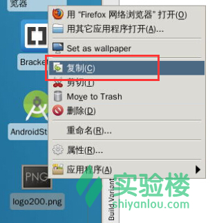
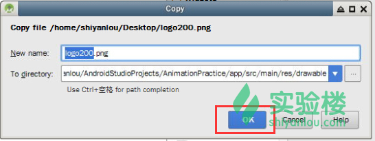
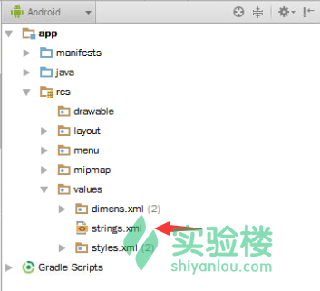
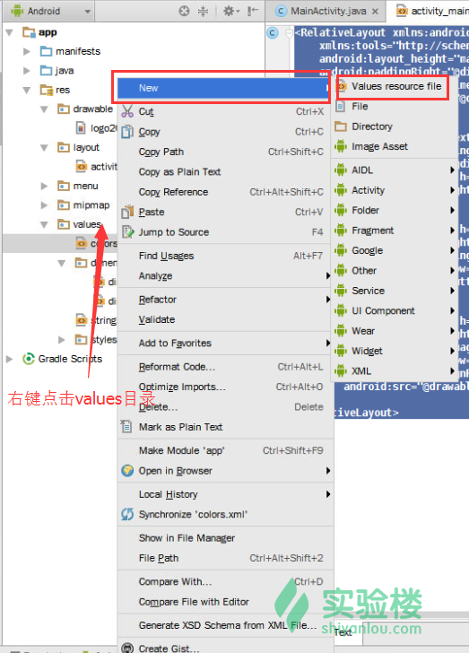
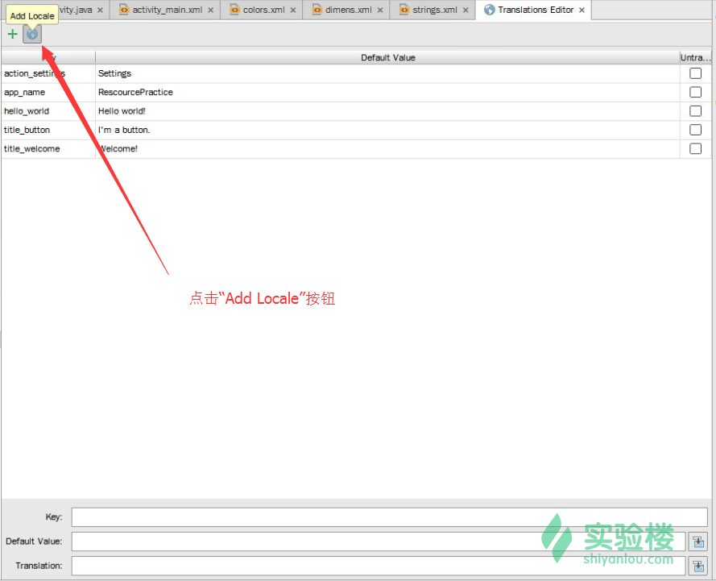
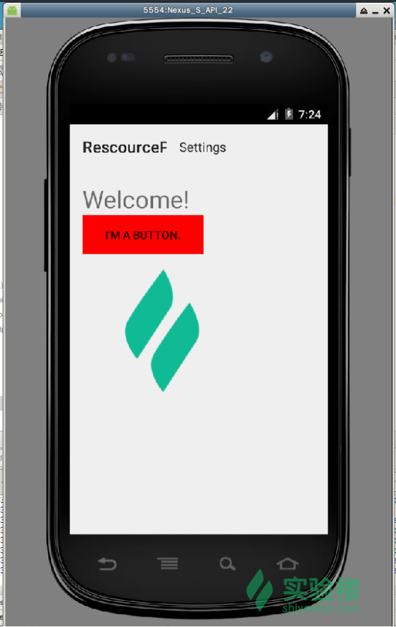

# 第 8 节 资源调用

## 一、实验简介

本实验将带你学习 Android 中除了程序以外也很重要的资源部分，了解项目的资源都可以由哪些内容构成，以及如何使用这些资源。

### 1\. 知识点

*   避免硬编码
*   Android 资源的介绍
*   屏幕适应和国际化

### 2\. 准备工作

请打开桌面上的 Android Studio，新建一个名为`ResourcePractice`的项目，域名填写`shiyanlou.com`（即包名为`com.shiyanlou.resourcepractice`。项目最小 SDK 版本（`minSDK`）请选择`Android 5.1`，并选择`Blank Activity`作为模块创建一个 Activity，其它选项使用默认值即可。

等待项目创建完成后，请在 AVD 中创建一台模拟器并启动。

推荐的模拟器参数：

*   硬件平台：Nexus S （屏幕分辨率 480*800）
*   系统版本：Android 5.1.1 armeabli-v7a
*   **请去掉`Use Host GPU 选项`**

模拟器的启动时间约为 6 分钟，这段时间你可以回到 Android Studio 继续学习和编码。

另外，我们需要获取一张图片。

请在桌面打开终端。



在终端中输入并执行下列命令：

```java
cd ./Desktop

wget http://labfile.oss.aliyuncs.com/courses/366/logo200.png 
```

此时你在桌面上可以看到加载的一张图片，我们将在后续步骤中用到它。



## 二、从“硬编码”说起

在前面的课程中，我们通常会遇到下面这样的代码写法：

```java
<TextView 
        android:layout_width="wrap_content"
        android:layout_height="wrap_content"
        android:id="@+id/textView1"
        android:text="Hello World" /> 
```

我们直接将 TextView 要显示的文本信息“Hello Word”写在了`android:text`属性里。这种做法通常被称为`Hard Coding`，也就是[硬编码](http://baike.baidu.com/view/2024903.htm)。

通过一个故事来了解一下为什么我们要在开发过程中避免“硬编码”。 >程序员 A 开发了一款应用，里面需要打开网址`http://www.shiyanlou.com`，但他是将这个网址以硬编码的形式写在了程序源代码的各个角落。有一次 A 出差了，但这个应用需要进行一些修改，于是公司派程序员 B 来负责此事。由于是硬编码，B 不得不进行查找替换，生怕漏过每一处。

实际上如果这个网址通过资源文件来管理，B 只需要修改某个 xml 文件对于这个网址的声明即可，极大地提高了工作效率（避免了浪费生命…）。

再比如，有些时候你会在代码中写出类似于`0.5`、`120`这样的数值，但过了一段时间之后你再去看这些代码，如果没有注释，你可能很难再去理解它们所代表的含义。这对开发工作是无益的。

所以对于上面的代码片段，更加正确的写法应该是：

```java
<TextView 
        android:layout_width="wrap_content"
        android:layout_height="wrap_content"
        android:id="@+id/textView1"
        android:text="@string/hello_world" /> 
```

你看出来两种写法的区别了吗？

## 三、资源的介绍

一些游戏开发者为了避免硬编码带来的问题，通常会自己定义一个常量类，将游戏中所有会用到的数值、字符串信息在一个类里面进行定义，然后在其他地方引用这个类里面的信息。这些值都带有定义时所取的名字，所以其意义一目了然。

而 Android 提供了更好的解决方案，它允许开发者将应用中会用到的各种资源放到`res`目录中。这些资源可以是字符串、图片、布局、菜单等等。它们通过 XML 标签来组织，开发时自动生成的`R 类`会负责索引它们，程序中直接调用这些值即可。本节课程主要讨论的就是`res`目录下的资源。

除此之外，还有一个名为`assets`的文件夹（可以自己创建）可用于存放应用无法直接访问的资源，比如字体文件等，放在这里面的文件会被原封不动地打包到 apk 文件中。**放在该文件夹下的内容不会被 R 类索引。**应用可以通过`AssetManager`来读取它们。

简要的用法示例如下：

```java
AssetManager am= getAssets();  
InputStream inputStrem = am.open("filename"); 
```

经过前面课程的讲解，相信你对于 Android 的应用开发体系已经有了一个比较系统的认识。回到一个 Android 项目的结构来说，项目的资源文件夹`res`里通常由以下几个部分组成：

```java
| 目录            | 存放资源类型    |
| ------------- |:-------------:|
| drawable        | 存放各种图像文件，如.jpg、.bmp、.png 等，也可存放能编译成各类 Drawable 对象的 xml 文件。它与 mipmap 的异同请参考这篇文章。| 
| mipmap        | 4.3 版本后推荐使用的图像文件目录，性质与 drawable 类似。但存放于该目录的图像能够提高系统渲染图片的速度，提高图片质量以及减少 GPU 压力。
| values        | 存放各种字符串、数组等目录，稍后会有详细介绍。    |
| layout        | 存放各个用户界面的布局资源。通常一个 Activity 对应一个 layout。    |
| menu            | 存放应用中各个菜单的资源，包括选项菜单、子菜单等。      |
| animator        | 存放定义属性动画效果的资源文件。     |
| anim            | 存放定义补间动画效果的资源文件。      |
| raw            | 存放原生资源，不限制其类型。与 assets 文件夹不同的是，这里面存放的文件能被 R 类索引，你可以通过 R 类获取到资源的 ID。      |
| xml            | 存放自定义的原生 xml 文件，可通过 Resources.getXML()方法来访问它们。     |
```

请打开`Android Studio`，建立一个名为`ResourcePractice`的项目（MinSDK 请选择`Anroid 5.1`）。如果已经创建请忽略。

在项目创建成功后，你能在左侧的目录树中看到如下所示的项目结构：


这里介绍一下项目视图的切换。你可以点击上方的`Android`下拉菜单切换到`Project`视图。



切换后整个项目便会以`Project`的视角来陈列整个项目的各个部分。



**下面所提到的 xml 文件中的内容，你可以自己将其添加到项目`RescourcePractice`的对应目录中。**

### 1.drawable 资源

drawable 资源即图片资源，你只需要把`*.jpg`、`*.bmp`、`*.png`等格式的图片放入该文件夹下，R 类就会生成它们的索引，然后就能在 java 代码中使用它们。

它们通常位于`/res/drawable`目录中。

将实验开始时获取到的这个图片`logo200.png`放入项目中。你可以在桌面上右键单击这个图片，然后在菜单中选择`复制`。



然后在项目的`reg/drawable`文件夹上右键单击，然后选择粘贴。


在弹出的`Copy`对话框中点击`OK`按钮。



于是就完成了图片的导入。

### 2.values 资源

该目录下能够存放各种字符串、颜色、整数、数组、尺寸、风格等。例如最初的例子里面给出的`hello_world`，就存放于`res/values/strings.xml`里面。同理，一个颜色值也可以放在`res/values/colors.xml`文件中。

根据开发规范，建议使用不同的资源文件来存放上述不同类型的值，以方便维护。以下是`values`目录下受支持的值类型。

*   字符串：位于`res/values/strings.xml`文件中。
*   颜色：位于`res/values/colors.xml`文件中。
*   数组：位于`res/values/arrays.xml`文件中。
*   尺寸：位于`res/values/dimens.xml`文件中。
*   风格：位于`res/values/styles.xml`文件中。

比如：任何一个新创建的项目，都用到`@string/hello_world`，即引用了资源中的`字符串（string）`，打开项目的`res/values/strings.xml`文件，你便能看到其中对于`hello_wordld`字段的定义。



这里用到了一个`string`标签来定义 TextView 要显示的文本，如下图所示。


当然这个资源不是独享的，其他任何需要显示内容“Hello World”的地方都可以引用这个名为`hello_world`的标签。对于其他类型的资源也是如此。

下面请你创建一个`colors.xml`。首先是在 values 文件夹上右键点击，然后在菜单中按照下图所示选择即可。



在下图所示的弹出对话框中输入文件名`colors`。


在创建好的`colors.xml`文件中添加以下内容：

```java
<?xml version="1.0" encoding="utf-8"?>
<resources>
    <color name="mycolor_1">#FF0000</color>

</resources> 
```

这里的`#FF0000`是指红绿蓝三色组成的颜色代码，格式是`#RRGGBB`。其中，`RR`指代红色的值（00 到 ff 之间的 16 进制数），`GG`指代绿色，`BB`指代蓝色。

接下来，我们在`dimens.xml`中添加以下内容：

```java
<resources>
    <!-- Default screen margins, per the Android Design guidelines. -->
    <dimen name="activity_horizontal_margin">16dp</dimen>
    <dimen name="activity_vertical_margin">16dp</dimen>
    <dimen name="button_width">150dp</dimen>
    <dimen name="textView_size">30sp</dimen>
</resources> 
```

然后在`strings.xml`中添加以下内容：

```java
<resources>
    <string name="app_name">RescourcePractice</string>

    <string name="hello_world">Hello world!</string>
    <string name="action_settings">Settings</string>
    <string name="title_welcome">Welcome!</string>
    <string name="title_button">I\'m a button.</string>
</resources> 
```

注意最后一项的`I\' a button`一定要使用`\`符号来进行字符的转义化。

### 3.layout 资源

布局的资源，一般是一个 Activity 关联一个 Layout 的 XML 文件。但是随着项目的演变，有时候可能需要多个布局。 请你在`res/layout/activity_main.xml`文件中添加以下内容：

```java
<RelativeLayout 
     android:layout_width="match_parent"
    android:layout_height="match_parent" android:paddingLeft="@dimen/activity_horizontal_margin"
    android:paddingRight="@dimen/activity_horizontal_margin"
    android:paddingTop="@dimen/activity_vertical_margin"
    android:paddingBottom="@dimen/activity_vertical_margin" tools:context=".MainActivity">

    <TextView
        android:id="@+id/textView_title"
        android:text="@string/title_welcome"
        android:textSize="@dimen/textView_size"
        android:layout_width="wrap_content"
        android:layout_height="wrap_content" />

    <Button
        android:layout_width="@dimen/button_width"
        android:layout_height="wrap_content"
        android:text="@string/title_button"
        android:layout_below="@+id/textView_title"
        android:id="@+id/button_1"
        android:background="@color/mycolor_1"/>

    <ImageView
        android:layout_width="wrap_content"
        android:layout_height="wrap_content"
        android:id="@+id/imageView_1"
        android:layout_below="@+id/button_1"
        android:layout_alignParentStart="true"
        android:src="@drawable/logo200"/>

</RelativeLayout> 
```

这个部件中就引用了其他类型的资源，比如按钮的宽度引用了`@dimen/button_width`，而这个值定义的是`150dp`；比如图片的素材引用了`@drawable/logo200`;再比如按钮的背景颜色引用了`@color/mycolor_1`，对应的值是我们定义的`#FF0000`。

### 4.自定义 XML

自定义的 xml 文件存放于`res/xml`目录中，这些 xml 是开发者自己制定的，如果需要在 java 代码中调用，则可以使用`Resources.getXML()`方法来访问它们。

我们在项目课[Android 小案例 - 桌面小部件（Widget）](https://www.shiyanlou.com/courses/414)中就用到了自定义的 XML 文件来制作桌面小部件。

## 四、屏幕适应与国际化

在以后的开发工作中，一些应用很有可能面向的是全球的市场。应用的国际化在于为多语言用户提供支持，而不改变其自身的业务逻辑和功能。业界通常使用`I18N`来指代国际化（Internationalization 恰好是 18 个字母，此为一种缩写），你可以[了解更多关于 I18N 的信息](http://baike.baidu.com/view/372835.htm)。

在 Android Studio 中，你可以按照下列步骤来实现语言的国际化。

首先打开`res/values/strings.xml`文件，在右上角找到`Open editor`选项，点击它进入国际化编辑器。


进入编辑器后点击左上角的`Add Locale`按钮来添加目标语言。



在下列列表中找到`German(de)`一些，点击它添加德语支持，在找的时候你可以直接按键盘上的`g`来快速定位到 G 开头字母的语言。


然后编辑器中就会多出一栏编辑德语的文本框，双击对应的栏目可以添加内容。


为了查看效果，我们可以回到`res/layout/activity_main.xml`文件，右边的预览窗口中提供了地区的切换，我们点击国际化按钮。


在下拉菜单中选择`German(de)`版本。


稍后一会儿，我们就能看到德语的布局预览。可以发现文本标签和按钮的文本都已经切换到了德语。


由于 Android 系统的开放性，导致了搭载 Android 系统的设备五花八门，也造就了不同的屏幕尺寸。对于开发者来说，开发一个能够自动适应多种尺寸屏幕的应用是我们开发能力的一种体现。

在`res/mipmap`目录中，我们就能看到`ic_launcher.png`图片（该文件是应用的图标）为了适配不同的屏幕尺寸，准备了四种不同分辨率的规格。


为此，推荐你阅读博文《[Android 屏幕适配全攻略(最权威的官方适配指导)](http://blog.csdn.net/zhaokaiqiang1992/article/details/45419023)》。

本实验至此已经讲解完成，不要求同学们一定在模拟器中运行查看结果。如果你有兴趣的话，可以点击工具栏上的运行按钮，等待应用安装至模拟器后，查看一下效果。



## 五、实验总结

本节我们学习了 Android 应用的资源相关知识，了解了资源与项目中其他组成部分之间的关系，掌握了如何在 Android 应用开发过程中定义和使用这些资源。

至此，《Android 应用开发基础》课程就接近尾声了。除此之外，实验楼目前还有许多其他的[Android 开发课程](https://www.shiyanlou.com/courses/?course_type=all&tag=Android)，请点击链接查看。

感谢你能坚持到此。课程虽然已经结束，但仍有许多地方仍不完美。受限于实验环境的特性，诸如“传感器调用”、“GPS 开发”、“多媒体开发”等课程未能在实验楼开设。建议你通过查阅官方的 API 手册以及其他资料来进行这部分的学习。

实验楼为有志于 Android 开发的同学建立了一条[Android 研发工程师](https://www.shiyanlou.com/jobs/android)学习路径，我们会不断地更新和丰富其中的课程，欢迎你继续在实验楼学习 Android 开发以及其他课程。

## 六、作业

请继续学习项目课《[Android 小案例 - 桌面小部件（Widget）](https://www.shiyanlou.com/courses/414)》。