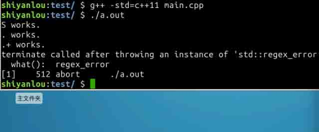
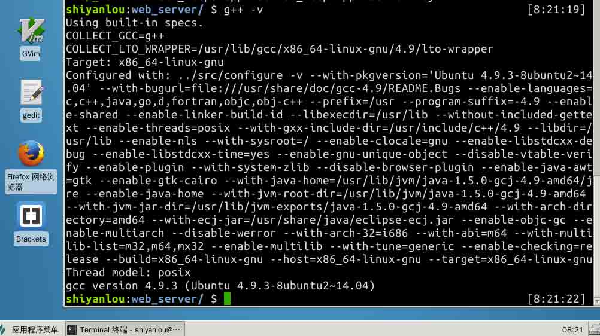

# 第 1 节 C++ 开发 Web 服务框架 - 基础知识：C++11 与 Boost Asio

## 一、概述

### 项目介绍

服务器开发中 Web 服务是一个基本的代码单元，将服务端的请求和响应部分的逻辑抽象出来形成框架，能够做到最高级别的框架级代码复用。本次项目将综合使用 C++11 及 Boost 中的 Asio 实现 HTTP 和 HTTPS 的服务器框架。

### 项目涉及的知识点

*   C++基本知识
    *   面向对象
    *   模板
    *   命名空间
    *   常用 IO 库
*   C++11 相关
    *   lambda expression
    *   std::shared*ptr*
    *   std::makeshared
    *   std::unordered*map*
    *   std::regex
    *   std::smatch
    *   std::regexmatch
    *   std::function
    *   std::thread
*   Boost Asio 相关
    *   boost::asio::io*service*
    *   boost::asio::ip::tcp::socket
    *   boost::asio::ip::tcp::v4()
    *   boost::asio::ip::tcp::endpoint
    *   boost::asio::ip::tcp::acceptor
    *   boost::asio::streambuf
    *   boost::asio::asyncread
    *   boost::asio::async*read*until
    *   boost::asio::async*write*
    *   boost::asio::transferexactly
    *   boost::asio::ssl::stream
    *   boost::asio::ssl::stream*base::server*
    *   boost::asio::ssl::context
    *   boost::asio::ssl::context::sslv23
    *   boost::asio::ssl::context::pem
    *   boost::system::errorcode

### 编译环境提示

在 g++ 4.9 之前，regex 库并不支持 ECMAScript 的正则语法，换句话说，在 g++4.9 之前，g++ 对 C++11 标准库的支持并不完善，为保证本次项目的顺利进行，请确保将 g++ 版本升级至 4.9 以上。

```cpp
// 下面的这段代码可以测试你的编译器对正则表达式的支持情况
#include <iostream>
#include <regex>

int main()
{
    std::regex r1("S");
    printf("S works.\n");
    std::regex r2(".");
    printf(". works.\n");
    std::regex r3(".+");
    printf(".+ works.\n");
    std::regex r4("[0-9]");
    printf("[0-9] works.\n");
    return 0;
} 
```

如果你的运行结果遇到了下图所示的错误，说明你确实需要升级你的 g++ 了：



使用 `g++ -v` 可以查看到当前编译器版本：



> 如果你最后一行中的 `gcc version` 显示的是 `4.8.x`，那么你需要手动将编译器版本升级至 `4.9` 以上，方法如下： > > > `bash > # 安装 add-apt-repository 工具 > sudo apt-get install software-properties-common > # 增加源 > sudo add-apt-repository ppa:ubuntu-toolchain-r/test > # 更新源 > sudo apt-get update > # 更新安装 > sudo apt-get upgrade > # 安装 gcc/g++ 4.9 > sudo apt-get install gcc-4.9 g++-4.9 > # 更新链接 > sudo updatedb > sudo ldconfig > sudo update-alternatives --install /usr/bin/gcc gcc /usr/bin/gcc-4.8 48 \ > --slave /usr/bin/g++ g++ /usr/bin/g++-4.8 \ > --slave /usr/bin/gcc-ar gcc-ar /usr/bin/gcc-ar-4.8 \ > --slave /usr/bin/gcc-nm gcc-nm /usr/bin/gcc-nm-4.8 \ > --slave /usr/bin/gcc-ranlib gcc-ranlib /usr/bin/gcc-ranlib-4.8 > sudo update-alternatives --install /usr/bin/gcc gcc /usr/bin/gcc-4.9 49 \ > --slave /usr/bin/g++ g++ /usr/bin/g++-4.9 \ > --slave /usr/bin/gcc-ar gcc-ar /usr/bin/gcc-ar-4.9 \ > --slave /usr/bin/gcc-nm gcc-nm /usr/bin/gcc-nm-4.9 \ > --slave /usr/bin/gcc-ranlib gcc-ranlib /usr/bin/gcc-ranlib-4.9 >`

此外，本次项目依赖了 `Boost` 和 `OpenSSL` 这两个库，不过好在实验楼的环境已经提供了这两个非常基本的库，你不需要再操心他们的安装了。

## 一、C++ 基础

面向对象和模板是 C++进阶知识的基础，这里不做过多介绍，本次项目我们将开发一个 Web 框架，我们在这里先回顾一下命名空间、和 sstream 字符串 IO 流的相关知识。如果对这部分比较熟悉，可以直接跳过本小节。

### 命名空间

在开发库时，库通常会有定义大量的全局名称，这时候当我们使用的库越来越多时，就不可避免的发生名称冲突的情况，这也就是我们常说的命名空间污染。

在命名空间诞生以前，通常使用的办法就是把一个函数、类、甚至变量名等名字取得足够长，在每一个名字的前面都增加相应的前缀，例如，当我们只想要定义一个 port 的变量时候：

```cpp
// 原本的样子
int port;
// 实际的样子
int shiyanlou_web_server_port; 
```

命名空间的定义非常简单，通过关键字 `namespace` 加上命名空间的名字，再使用花括号包裹需要的定义和声明即可完成相关的定义，例如：

```cpp
namespace shiyanlou_web_server {
    int port = 0;
} 
```

这时，这个 `port` 就被限制在了命名空间 `shiyanlou_web_server` 当中，如果不通过命名空间的指定，就不会被访问到。

参考下面的例子：

```cpp
//
// main.cpp
//
#include <iostream>
#include "web.hpp"
#include "web2.hpp"
int main() {
    std::cout << "hello world!" << std::endl;
    std::cout << "shiyanlou_web_server, port=" << shiyanlou_web_server::port << std::endl;
    std::cout << "shiyanlou_web2_server, port=" << shiyanlou_web2_server::port << std::endl;
    return 0;
} 
```

```cpp
// 
// web.hpp
//
namespace shiyanlou_web_server{
    int port = 0;
} 
```

```cpp
//
// web2.hpp
//
namespace shiyanlou_web2_server{
    int port = 2;
} 
```

最后的输出结果为：

```cpp
hello world!
shiyanlou_web_server, port=0
shiyanlou_web2_server, port=2 
```

### 常用 IO 库

我们常说的 C++ IO 库一般指 `iostream`, `fstream`, `sstream`。

*   iostream 包含了 `istream`(从流读)/`ostream`(从流写)/`iostream`(读写流)
*   fstream 包含了 `ifstream`(从文件读)/`ofstream`(condition 文件写)/`fstream`(读写文件)
*   sstream 包含了 `istringstream`(从 string 读)/`ostringstream`(向 string 写)/`stringstream`(读写 string)

> 其实标准库还有宽字符版本，但我们这里不讨论，有兴趣的话可以参考参考链接。

`iostream` 和 `fstream` 是两个比较常用的 IO 库，我们这里不再回顾，这里简单回顾一下 `sstream`。

如果你熟悉 C 语言，就知道将 int 转换为 string 类型其实是一件很麻烦的事情，虽然标准库中提供了 `itoa()` 这种函数，但是依然需要对转换后的 C 风格字符串(char *)通过 std::string 的构造函数构造为 std::string。 如果使用流操作，那么这将变得异常的简单：

```cpp
#include <string>
#include <sstream>
#include <iostrea>

int main() {
    // std::stringstream 支持读写
    std::stringstream stream;
    std::string result;
    int number = 12345;
    stream << number;   // 将 number 输入到 stream
    stream >> results;  // 从 stream 读取到 result
    std::cout < result << std::endl; // 将输出为字符串"12345"
} 
```

如果希望让 sstream 和 C 风格的字符串打交道，同样也可以：

```cpp
#include <sstream>
#include <iostream> 

int main()
{
    std::stringstream stream;
    char result[6];
    stream << 12345;
    stream >> result;
    std::cout << result << std::endl;
} 
```

需要注意的一点就是，在进行多次 IO 操作时，如果希望结果彼此不影响，需要对 stream 对象进行一次 `clear()` 操作：

```cpp
stream.clear() 
```

## 二、C++11 相关

C++11 几乎重新定义了 C++ 的一切，C++11 的出现伴随着大量的有用的新特性和标准库，这些特性和标准使得 C++ 变得更加现代，甚至在编码范式上都与传统 C++ 有着本质上的差异，本节我们将回顾一下这些特性：

*   lambda expression
*   std::shared_ptr
*   std::make_shared
*   std::unordered_map
*   std::regex
*   std::smatch
*   std::regex_match
*   std::function
*   std::thread

如果对这些特性比较熟悉，可以直接跳过本节。

### lambda 表达式

Lambda 表达式是 C++11 中最重要的新特性之一，而 Lambda 表达式，实际上就是提供了一个类似匿名函数的特性，而匿名函数则是在需要一个函数，但是又不想费力去命名一个函数的情况下去使用的。这样的场景其实有很多很多，所以匿名函数几乎是现代编程语言的标配。

Lambda 表达式的基本语法如下：

```cpp
捕获列表 mutable(可选) 异常属性 -> 返回类型 {
    // 函数体
} 
```

上面的语法规则除了 `[捕获列表]` 内的东西外，其他部分都很好理解，只是一般函数的函数名被略去，返回值使用了一个 `->` 的形式进行。

所谓捕获列表，其实可以理解为参数的一种类型，lambda 表达式内部函数体在默认情况下是不能够使用函数体外部的变量的，这时候捕获列表可以起到传递外部数据的作用。根据传递的行为，捕获列表也分为以下几种：

**1\. 值捕获**

与参数传值类似，值捕获的前期是变量可以拷贝，不同之处则在于，被捕获的变量在 lambda 表达式被创建时拷贝，而非调用时才拷贝：

```cpp
void learn_lambda_func_1() {
    int value_1 = 1;
    auto copy_value_1 = [value_1] {
        return value_1;
    };
    value_1 = 100;
    auto stored_value_1 = copy_value_1();
    // 这时, stored_value_1 == 1, 而 value_1 == 100.
    // 因为 copy_value_1 在创建时就保存了一份 value_1 的拷贝
} 
```

**2\. 引用捕获**

与引用传参类似，引用捕获保存的是引用，值会发生变化。

```cpp
void learn_lambda_func_2() {
    int value_2 = 1;
    auto copy_value_2 = [&value_2] {
        return value_2;
    };
    value_2 = 100;
    auto stored_value_2 = copy_value_2();
    // 这时, stored_value_2 == 100, value_1 == 100.
    // 因为 copy_value_2 保存的是引用
} 
```

**3\. 隐式捕获**

手动书写捕获列表有时候是非常复杂的，这种机械性的工作可以交给编译器来处理，这时候可以在捕获列表中写一个 `&` 或 `=` 向编译器声明采用 引用捕获或者值捕获.

总结一下，捕获提供了 lambda 表达式对外部值进行使用的功能，捕获列表的最常用的四种形式可以是：

*   [] 空捕获列表
*   [name1, name2, ...] 捕获一系列变量
*   [&] 引用捕获, 让编译器自行推导捕获列表
*   [=] 值捕获, 让编译器执行推导应用列表

#### std::shared*ptr, std::make*shared

C++11 在内存管理上同样做了很多改进，std::make*shared 就是其中之一。它是和 `std::shared_ptr` 共同出现的，`std::shared_ptr` 是一种智能指针，它能够记录多少个 shared*ptr 共同指向一个对象（熟悉 Objective-C 的可能知道，这种特性叫做引用计数），能够消除显示的调用 `delete`，当引用计数变为 0 的时候就会将对象自动删除。

但还不够，因为使用 `std::shared_ptr` 仍然需要使用 new 来调用，这使得代码出现了某种程度上的不对称。因此就需要另一种手段(工厂模式)来解决这个问题。

`std::make_shared` 就能够用来消除显示的使用 `new`，所以`std::make_shared` 会分配创建传入参数中的对象，并返回这个对象类型的`std::shared_ptr`指针。例如：

```cpp
#include <iostream>
#include <memory>

void foo(std::shared_ptr<int> i)
{
    (*i)++;
}
int main()
{
    // 构造了一个 std::shared_ptr
    auto pointer = std::make_shared<int>(10);
    foo(pointer);
    std::cout << *pointer << std::endl;
} 
```

### 无序容器 std::unordered_map

在传统的 C++中，我们已经熟知了 std::map 关联容器，std::map 容器在插入元素时，会根据 `<` 操作符比较元素大小并判断元素是否相同，并选择合适的位置插入到容器中。当对这个容器中的元素进行遍历时，输出结果会按照 `<` 操作符的顺序来逐个遍历。

而 C++11 终于推出了无序容器。 `std::unordered_map` 就是无序容器其中之一，这个容器会计算元素的 Hash 值，并根据 Hash 值来判断元素是否相同。由于无序容器没有定义元素之间的顺序，仅靠 Hash 值来判断元素是否已经存在于容器中，所以遍历 `std::unordered_map` 时，结果是无序的。

来看一个例子：

```cpp
#include <iostream>
#include <string>
#include <unordered_map>
#include <map>

int main() {
    // 两组结构按同样的顺序初始化
    std::unordered_map<int, std::string> u = {
        {1, "1"},
        {3, "3"},
        {2, "2"}
    };
    std::map<int, std::string> v = {
        {1, "1"},
        {3, "3"},
        {2, "2"}
    };

    // 分别对两组结构进行遍历
    std::cout << "std::unordered_map" << std::endl;
    for( const auto & n : u) 
        std::cout << "Key:[" << n.first << "] Value:[" << n.second << "]\n";

    std::cout << std::endl;
    std::cout << "std::map" << std::endl;
    for( const auto & n : v) 
        std::cout << "Key:[" << n.first << "] Value:[" << n.second << "]\n";
} 
```

最终的输出结果为：

```cpp
std::unordered_map
Key:[2] Value:[2]
Key:[3] Value:[3]
Key:[1] Value:[1]

std::map
Key:[1] Value:[1]
Key:[2] Value:[2]
Key:[3] Value:[3] 
```

可以看到 `std::map` 的遍历结果是有序的，而 `std::unordered_map` 的遍历结果是无序的。

事实上，`std::unordered_map` 在单个元素访问时，总是能够获得更高的性能。

### std::regex/std::regex_match/std::smatch

正则表达式是一个独立于 C++ 语言本身的另一个很大的话题，我们这里不详细讨论它的行为。

作为学习 `std::regex` 的一些介绍性内容，我们这里说明一下接下来会用到的一些正则表达式：

*   `[a-z]+\.txt`: 在这个正则表达式中, `[a-z]` 表示匹配一个小写字母, `+` 可以使前面的表达式匹配多次，因此 `[a-z]+` 能够匹配一个小写字母组成的字符串。在正则表达式中一个 `.` 表示匹配任意字符，而 `\.` 则表示匹配字符 `.`，最后的 `txt` 表示严格匹配 `txt` 则三个字母。因此这个正则表达式的所要匹配的内容就是由纯小写字母组成的文本文件。

`std::regex_match` 用于匹配字符串和正则表达式，有很多不同的重载形式。最简单的一个形式就是传入`std::string` 以及一个 �`std::regex` 进行匹配，当匹配成功时，会返回 `true`，否则返回 `false`。例如：

```cpp
#include <iostream>
#include <string>
#include <regex>

int main() {
    std::string fnames[] = {"foo.txt", "bar.txt", "test", "a0.txt", "AAA.txt"};
    // 在 C++ 中 `\` 会被作为字符串内的转义符，为使 `\.` 作为正则表达式传递进去生效，需要对 `\` 进行二次转义，从而有 `\\.`
    std::regex txt_regex("[a-z]+\\.txt");
    for (const auto &fname: fnames)
        std::cout << fname << ": " << std::regex_match(fname, txt_regex) << std::endl;
} 
```

另一种常用的形式就是依次传入 `std::string`/`std::smatch`/`std::regex` 三个参数，其中 `std::smatch` 的本质其实是 `std::match_results`，在标准库中， `std::smatch` 被定义为了 `std::match_results<std::string::const_iterator>`，也就是一个子串迭代器类型的 `match_results`。使用 `std::smatch` 可以方便的对匹配的结果进行获取，例如：

```cpp
std::regex base_regex("([a-z]+)\\.txt");
std::smatch base_match;
for(const auto &fname: fnames) {
    if (std::regex_match(fname, base_match, base_regex)) {
        // sub_match 的第一个元素匹配整个字符串
        // sub_match 的第二个元素匹配了第一个括号表达式
        if (base_match.size() == 2) {
            std::string base = base_match[1].str();
            std::cout << "sub-match[0]: " << base_match[0].str() << std::endl;
            std::cout << fname << " sub-match[1]: " << base << std::endl;
        }
    }
} 
```

以上两个代码段的输出结果为：

```cpp
foo.txt: 1
bar.txt: 1
test: 0
a0.txt: 0
AAA.txt: 0
sub-match[0]: foo.txt
foo.txt sub-match[1]: foo
sub-match[0]: bar.txt
bar.txt sub-match[1]: bar 
```

### std::function

`std::function` 是一种通用、多态的函数封装，它的实例可以对任何可以调用的目标实体进行存储、复制和调用操作，它也是对 C++中现有的可调用实体的一种类型安全的包裹（相对来说，函数指针的调用不是类型安全的），简而言之，`std::function` 就是函数的容器。

在前面的 Lambda 表达式中，我们已经介绍过使用 `auto` 关键字来接受一个 lambda 表达式。但有时候我们可能希望明确的指明这个 lambda 表达式的类型，这时就可以使用 `std::function` 来进行书写，例如：

```cpp
#include <functional>
#include <iostream>

int foo(int para) {
    return para;
}

int main() {
    // std::function 包装了一个返回值为 int, 参数为 int 的函数
    std::function<int(int)> func = foo;
    std::cout << func(10) << std::endl;
} 
```

### std::thread

`std::thread` 用于创建一个执行的线程实例，所以它是一切并发编程的基础，使用时需要包含<thread>头文件，它提供了很多基本的线程操作，例如`get_id()`来获取所创建线程的线程 ID，例如使用 `join()` 来等待线程等等，例如：

```cpp
#include <iostream>
#include <thread>
void foo() {
    std::cout << "hello world" << std::endl;
}
int main() {
    std::thread t(foo);
    t.join();
    return 0;
} 
```

## 三、Boost Asio 相关

Boost 是一个 C++的可移植库，是对标准库的后备扩展，也是 C++标准化进程的开发引擎之一。Boost 库是由 C++标准委员会的成员发起的，里面发展的内容很有可能会成为 C++标准库的内容之一。因此 Boost 也是 C++社区中影响力最大的 『准』标准库。

Boost Asio，就是 Boost 库中的一个部分，Asio 的全称为 Asynchronous input and output （异步输入输出）的缩写。顾名思义，结合 Boost 的特点，Asio 提供了一套平台无关的异步数据处理能力（当然它也支持同步数据处理）。

本节我们将熟悉一下下面这些知识点的用法，如果你对这些内容比较熟悉，可以直接跳过本节。

*   boost::asio::io_service
*   boost::asio::ip::tcp::socket
*   boost::asio::ip::tcp::v4()
*   boost::asio::ip::tcp::endpoint
*   boost::asio::ip::tcp::acceptor
*   boost::asio::streambuf
*   boost::asio::async_read
*   boost::asio::async*read*until
*   boost::asio::async_write
*   boost::asio::transfer_exactly
*   boost::asio::ssl::stream
*   boost::asio::ssl::stream_base::server
*   boost::asio::ssl::context
*   boost::asio::ssl::context::sslv23
*   boost::asio::ssl::context::pem
*   boost::system::error_code

使用 Asio 只需要引入一个头文件即可：

```cpp
#include <boost/asio.hpp> 
```

对于所有使用 Asio 的程序，都必须要包含至少一个 `io_service` 对象。对于 Asio 这个 Boost 库而言，它抽象了诸如网络、串口通信等等这些概念，并将其统一规为 IO 操作，所以 `io_service` 这个类提供了访问 I/O 的功能。因此，使用 Asio 时，必须定义：

```cpp
boost::asio::io_service io; 
```

### HTTP 连接

既然网络的相关概念已经被抽象为 IO，我们就只需要关心从这个 IO 流中获取消息，因此，我们本质上还是在进行 IO 操作，只不过这个操作需要具备一些基本的网络概念。

我们知道，HTTP 和 HTTPS 的底层实际上是使用的 TCP 可靠连接，通过 Socket 技术进行通信，而一个 Socket 由 IP 地址及端口构成。无例外地，Asio 同样也需要建立一个和 socket 有关的对象，那就是 `boost::asio::ip::tcp::socket`。可想而知，Socket 既然是网络通信的基础，那么自然的我们要进行的 IO 操作也就必须在这里完成，因此，我们定义的 `boost::asio::ip::tcp::socket` 对象，必须由 `io_service` 来进行构造，即：

```cpp
boost::asio::ip::tcp::socket socket(io); 
```

有了 socket 对象是不够的。在网络通信中，网络 IO 就入口串口一样，是以流的方式进行的。所以这个 socket 对象只能用来做我们日后进行 IO 操作时的一个必要属性。

不难看出，一个普通的 `boost::asio::ip::tcp::socket` 对象，实际上就是一个 HTTP 的 Socket 连接，因此我们在日后进行代码编写时，甚至于可以使用 `typedef` 将这个类型直接定义为 `HTTP`:

```cpp
typedef boost::asio::ip::tcp::socket HTTP; 
```

然而，作为服务端，我们可能构建很多很多的连接从而响应并发，所以当我们需要建立连接时候，就需要使用一个叫做 `acceptor` 的对象。

而 `boost::asio::ip::tcp::acceptor` 从名字上就可以看出，这个对象应该被用于建立连接。在 Boost 中，我们需要初始化一个 `acceptor` 对象时，必须提供一个 `io_service` 对象和一个 `endpoint` 对象。

那么 `endpoint` 又是什么？事实上，socket 是一个端到端的连接，所谓 `endpoint` 就是 socket 位于服务端的一个端点，我们知道，socket 是由 IP 地址和端口号组成的，那么当我们需要为其建立一个 IPv4 的网络，首先可以建立一个 `boost::asio::ip::tcp::endpoint` 对象：

```cpp
unsigned short port = 8080;
boost::asio::ip::tcp::endpoint endpoint(boost::asio::ip::tcp::v4(), port); 
```

其中 `boost::asio::ip::tcp::v4()` 用于初始化一个 IPv4 的网络。最后在使用这个 `endpoint` 对象来初始化 `acceptor`:

```cpp
boost::asio::ip::tcp::acceptor acceptor(io, endpoint); 
```

至此，我们讨论了如何使用 Asio 建立一个普通的网络操作对象 `acceptor`，以及在进行普通 HTTP 网络操作时需要的 `socket` 对象。

### HTTPS 连接

讨论完了 Asio 里 HTTP 连接，我们再来看看 Asio 中的 HTTPS 是如何建立连接的。Asio 是一个开源的库，所以它也不可避免的在处理不擅长的逻辑时需要添加对别的框架的依赖。Asio 的 HTTPS 相关的 SSL 操作，就依赖了 OpenSSL 库。

要使用 SSL 相关的操作，还需要额外引入一个头文件：

```cpp
#include <boost/asio/ssl.hpp> 
```

我们在上一小节里讨论了 `boost::asio::ip::tcp::socket` 产生的 Socket 对象实际上就是普通的 HTTP 对象。对于 HTTPS 而言，实际上就是对这个 socket 所产生的通道进行一个一层封装和加密。在 Boost Asio 中，加密 socket 的方式就是使用 `boost::asio::ssl::stream`，并将 `boost::asio::ip::tcp::socket` 作为模板参数传入给这个对象，即：

```cpp
typedef boost::asio::ssl::stream<boost::asio::ip::tcp::socket> HTTPS; 
```

而当我们要构造一个 HTTPS 的 socket 对象时，Boost Asio 要求必须为这个 socket 建立一个 `boost::asio::ssl::context` 对象。而一个 `context` 可以有很多不同的类型，最常用的，就是`boost::asio::ssl::context::sslv23`。构造好了 `context` 对象之后这还不够，因为一个 https 的服务器需要提供证书文件和秘钥文件，所以还需要使用 `use_certificate_chain_file()` 和 `use_private_key_file()` 这两个方法来进行进一步的配置：

```cpp
context.use_certificate_chain_file(cert_file);
context.use_private_key_file(private_key_file, boost::asio::ssl::context::pem); 
```

其中的 `boost::asio::ssl::context::pem` 是指定的证书类型。因此相较于 HTTP 而言，HTTPS 的建立其实就是增加了对证书的配置、和 socket 加密的环节，对比如下：

```cpp
// http
boost::asio::ip::tcp::socket http_socket(io);
// https
boost::asio::ssl::context context(boost::asio::ssl::context::sslv23);
context.use_certificate_chain_file(cert_file);
context.use_private_key_file(private_key_file, boost::asio::ssl::context::pem);
boost::asio::ssl::stream<boost::asio::ip::tcp::socket> https_socket(io, context); 
```

### IO 操作

上面我们讨论了如何建立连接，现在我们再来看看如何进行 IO 操作。

当我们有了 socket 对象之后，就可以从里面读取网络流数据了。读取数据时，我们需要定义一个流缓冲 `boost::asio::streambuf` 对象，用于逐行读取 socket 中的数据：

```cpp
boost::asio::streambuf read_buffer; 
```

另外，很多网络协议其实都是基于行实现的，也就是说这些协议元素是由 `\r\n` 符号进行界定，HTTP 也不例外，所以在 Boost Asio 中，读取使用分隔符的协议，可以使用 `async_read_untile()` 方法：

```cpp
boost::asio::async_read_until(socket, readbuffer, "\r\n\r\n", read_handler); 
```

其中 socket 就是我们的 socket 连接，而 readbuffer 就是根据界定符读取到的一行数据，`"\r\n\r\n"` 就是分隔符，而对于 `read_handler` 我们还需要再进一步讨论。

`read_handler` 是一个无返回类型的函数对象，它接受两个参数，一个是 `boost::system::error_code`，另一个是 `size_t`（`bytes_transferred`）：

```cpp
void read_handler(
    const boost::system::error_code& ec,
    std::size_t bytes_transferred)
{
  ...
} 
```

`boost::system::error_code` 用来描述操作是否成功，而 `size_t bytes_transferred` 则是用来确定接受到的字节数，通常情况下，我们可以用 `std::bind` 来将参数绑定到我们的某个函数传入，但实际上我们还有更好的做法，那就是 lambda 表达式，因为 Lambda 表达式还具有另外的一个功能，那就是进行值捕获，对于这一点，我们在后面实现框架的时候再详细讨论。

在这个 `read_handler` 中，我们实际上是在不断的读取 socket 里面的内容，因此我们还需要使用 `boost::asio::async_read` 对后面的内容进行进一步的读取，而它的用法 和 `boost::asio::async_read_until` 几乎一样，唯一的区别就是在 `read_handler` 这个参数之前，需要指定 读取的长度，通常我们可以使用 `boost::asio::transfer_exactly` 进行指定，故这里不再详细赘述，我们在后面实现框架的时候，再详细讨论。

最后，我们完成了读取的操作，就只剩下最后一步了，那就是服务器响应请求，回写请求的资源供给客户端，这时候我们就需要使用另一个方法：`boost::asio::async_write`。从名字上可以看出，这个方法和 `boost::asio::async_read` 属于同一个方法家族，可想而知用法也完全类似，我们还是留到后面的实际代码中再进行讨论。

## 总结

本节中我们回顾了 C++11 的相关知识，并对 Boost 中的 Asio 做了一些介绍。在下一节中，我们将综合运用上面提到的全部知识，开始实现我们的框架。

## 参考资料

1.  [C++ 11/14/17 标准在各编译器下支持情况](http://en.cppreference.com/w/cpp/compiler_support)
2.  [C++ IO 库](http://en.cppreference.com/w/cpp/io)
3.  [C++ 正则表达式库](http://en.cppreference.com/w/cpp/regex)
4.  [Boost Asio 库](http://www.boost.org/doc/libs/1_61_0/doc/html/boost_asio.html)