# 第 1 节 1 小时入门 AR 技术（上）

## 一、课程说明

## 1.1 让我们谈谈 AR

还记得去年(15 年)微软发布的[hololens 宣传视频](https://www.youtube.com/watch?v=aThCr0PsyuA)（Youtube）吗？

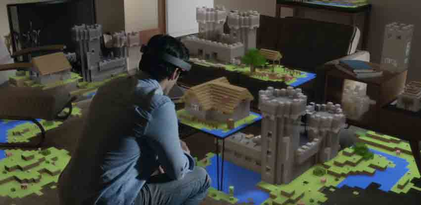

我想一图胜千言，没接触过 AR 的同学一定马上就知道 AR 是什么了。 

开发者版已经发售了，现在可以自己写个小程序体验下 AR 的魅力。

## 1.2 课程简介

本课程会实现一个简化版基于 Marker 的 AR 小程序，往现实中放入一个“吃人妖怪”（ogre）。就是载入一个会动的 3d 模型。由于实验环境用不了摄像头，所以我们用视频来替代。

**什么是 Marker？**

>目前 AR 技术大致可以分为 基于标记(Marker Based) 和 非基于标记(Markerless) 这两大类： Marker 一般来说就是一个定位用的小标记，多数都是正方形的，像这样

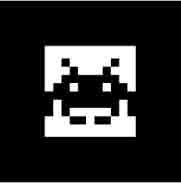

>我们平时在应用商店下载的 ar 应用多半都是基于 Marker 的，定位比较方便容易。 Markerless 的就像是 Hololens 那种，不过 Hololens 更优越的地方在于它配备了深度传感器，天然具备了感受 z 轴的能力呢，在缺乏深度传感器的情况下还是得依靠图形学与计算机视觉的知识来定位，对算法的要求要更高。

**为什么是简化版？**

>笔者认为以最少最简单的步骤达到目的，这对娱乐向教程来说是坠吼的。想要了解更多 AR 知识？课程的最后会给出参考资料与推荐资源。

**吃人妖怪？**


>sinbad 是 ogre 图像引擎的看板娘，我们使用这个引擎来显示 3d 模型，会提供现成的代码文件供使用，不用担心额外的学习成本。

最后的成果长这样。踩着魔鬼的步伐在光滑的地面摩擦，摩擦。。至于为什么这么黑。。笔者会再努力下解决这个问题。

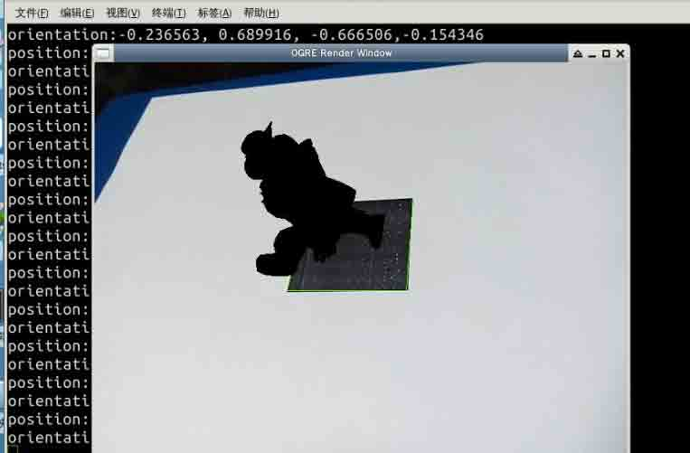

## 1.3 本课程适用用户

本课程主娱乐向，所以对基础没什么要求，也不需要事先学习 opencv，大部分内容都会做注释，take it easy ，基本要求也就如下

*   有 C++基础

## 1.4 知识点

本课程的实验中我们将学习并实践以下知识点：

1.  C++ 语言基础语法
2.  AR 基本概念
3.  基于 Marker 的 AR 技术
4.  OpenCV 程序开发

## 1.5 环境安装

首先安装一下 opencv 和 cmake

```cpp
$ sudo apt-get update
$ sudo apt-get install libopencv-dev cmake 
```

下载需要的数据包并将其作为工作目录

```cpp
$ wget http://labfile.oss.aliyuncs.com/courses/545/AR_tutorial_1.zip
$ unzip AR_tutorial_1.zip
$ cd AR_tutorial_1 
```

数据包包含完整代码，就先把代码文件放一边吧。

```cpp
$ mv marker.cpp marker.cpp.backup
$ mv CMakeLists.txt CMakeLists.txt.backup 
```

## 二、基本原理

Maker based 是现今很流行的实现 AR 技术的方式，其中使用的标记种类也是看的人眼花缭乱的 0 0

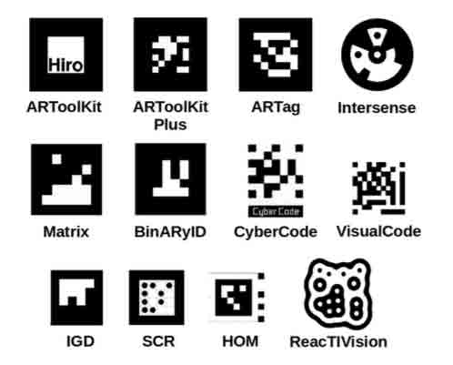

大家见的最多的还是方块块的那种。 下面就是一般检测方块块标记时的方法步骤：

1.  首先对图像进行颜色阈值的处理，提取出大致的轮廓线
2.  使用多边形近似提取出是四边形的轮廓
3.  提取 marker 中的信息（可以认为是 marker 的 id），对信息进行校验和纠错来得确认该 marker 的 id
4.  做姿态估计（pose estimation），就是确认目标物体的方位指向，反过来说也是确认了相机相对目标物体的方位指向。

本实验会跳过 marker 编解码与提取 id 的内容。 在第四步的姿态估计中会涉及一个摄像机标定的问题。

**什么是摄像机标定？** >简单点理解，不同摄像机拍出来的效果是不一样的，比如这种:


>每台摄像机都有自己的参数，比如焦距，透镜畸变参数等，称作内参数。这就需要用到摄像机标定技术通过该摄像机拍摄的视频或者图像来计算摄像机的内参数，处理输入图像时需要参考这些参数进行消畸，姿态估计也需要用到这些内参数。

本实验中摄像机的内参数文件会直接给出，不用再去做标定了。同时给出摄像机标定的代码文件和标定用的棋盘图片供同学在自己机子上做实验。

## 三、实验步骤

## 1\. 跑起来吧，opencv!

首先在工作目录下创建 `marker.cpp` 文件，然后写一个最简单的播放视频的程序。

```cpp
#include <opencv2/core/core.hpp>        //openCV 核心库
#include <opencv2/imgproc/imgproc.hpp>  //openCV 图像处理库
#include <opencv2/highgui/highgui.hpp>  //用户界面库，播视频要用
#include <opencv2/calib3d/calib3d.hpp>  //相机校准，姿态估计用

#include <iostream>

using namespace std;
using namespace cv;                     

//Scalar 是一个四元组,这里对应 bgra
Scalar blue(255, 0, 0);
Scalar green(0, 255, 0);
Scalar red(0, 0, 255);

//所使用的 marker 的边大小，可自定义
const int marker_width = 200;           

int main(int argc, char** argv) {

    //Mat 即矩阵，常常用 Mat 存储图像
    Mat image; 

    //捕捉视频用的对象，参数改为 0 会使用摄像头输入。
    VideoCapture cap("video.mp4");      

    if(!cap.isOpened())  
        return -1;

    //cap.grab()即抓取下一帧
    while (cap.grab()) {
        //解码抓取的帧并放入 image 中
        cap.retrieve(image);

        //新建窗口并显示捕捉到的图片，第一个参数为窗口名。
        cv::imshow("image", image);

        //延迟 100ms 自己机子上做就设置 1
        cv::waitKey(100);       
    }
    return 0;
} 
```

工作目录下的`video.mp4`就是我们将播放的视频文件。

`marker.cpp` 使用 cmake 进行管理生成 Makefile 文件， 所以在当前目录下新建 `CMakeLists.txt` 文件, 再将以下内容复制到文件中去。

```cpp
set(CMAKE_CXX_FLAGS "${CMAKE_CXX_FLAGS} -std=c++11")
cmake_minimum_required(VERSION 2.8)
project( marker )
find_package( OpenCV REQUIRED )
add_executable( marker marker.cpp )
target_link_libraries( marker ${OpenCV_LIBS} ) 
```

在当前目录下运行 cmake 生成 Makefile 文件并编译运行

```cpp
$ cmake .
$ make
$ ./marker 
```

成功了:D

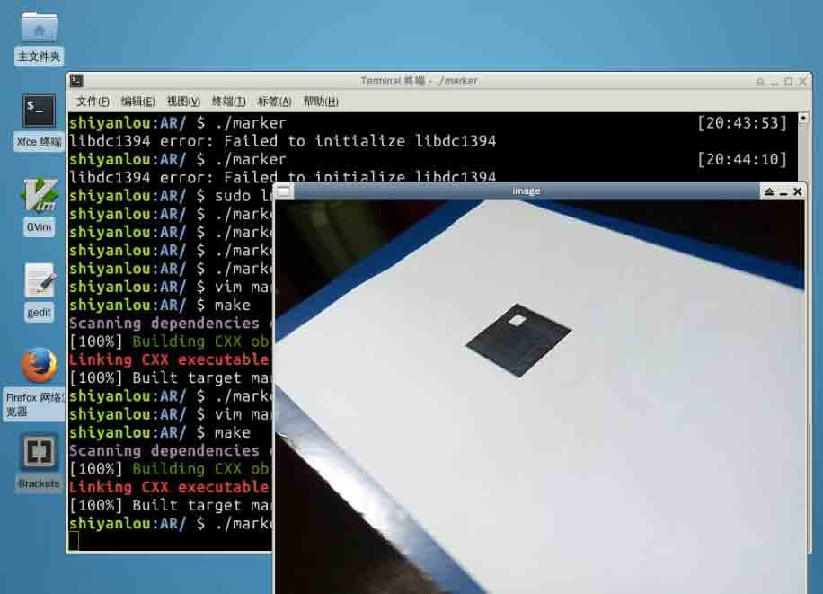

## 2\. 基本图像处理

我们的主要工作都在抓取视频图像的循环中，先对图像做基本的处理。

```cpp
while (cap.grab()) {
    cap.retrieve(image);
    //得到原图像的灰度图
    Mat grayImage;
    cvtColor(image, grayImage, CV_RGB2GRAY); 
    //对图像进行模糊处理
    Mat blurredImage;
    blur(grayImage, blurredImage, Size(5, 5));
    //使用大津算法将图像进行二分
    Mat threshImage;
    threshold(blurredImage, threshImage, 128.0, 255.0, THRESH_OTSU);
    ...
} 
```

灰度图

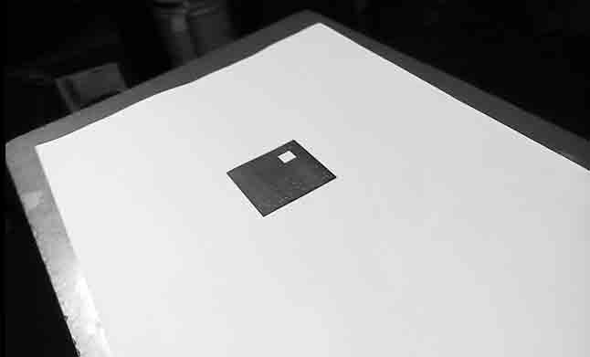

做模糊处理后

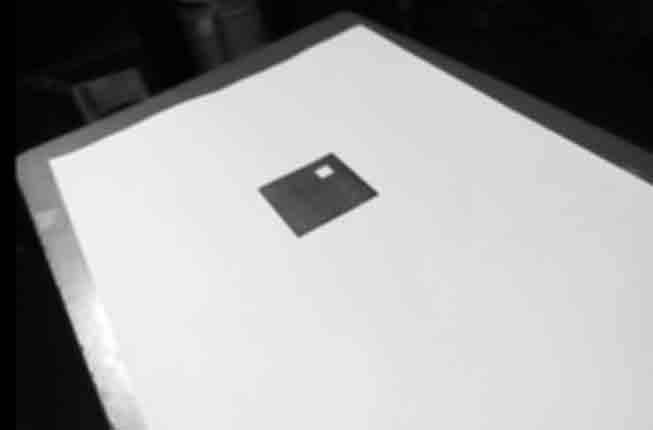

二分后

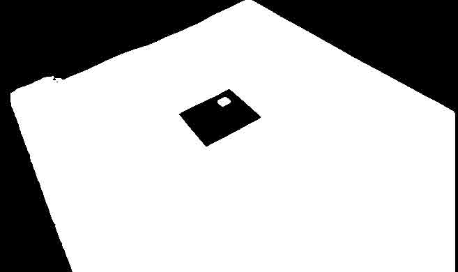

可以看到在做过二分以后我们的 marker 变得非常显眼。

**什么是大津算法** > 大津(Otsu)算法是一种将灰度图像进行二值化的算法，一般是用来区分图像中的前景与背景的。通过最大化类间方差,最小化类内方差来达到二分的目的。

## 3.提取 Marker 轮廓

做了基本处理后我们开始提取轮廓。

```cpp
vector<vector<Point> > contours;
findContours(threshImage, contours, CV_RETR_LIST, CV_CHAIN_APPROX_NONE);

vector<vector<Point2f> > squares;
for (int i = 0; i < contours.size(); i++) {
    vector<Point> contour = contours[i];
    vector<Point> approx;
    //使用多边形近似将轮廓近似为更简单的多边形
    approxPolyDP(contour, approx, arcLength(Mat(contour), true)*0.02, true);
    //取面积足够大且为凸包的四边形作为我们的 Marker
    if( approx.size() == 4 &&
        fabs(contourArea(Mat(approx))) > 1000 &&
        isContourConvex(Mat(approx)) )
    {
        vector<Point2f> square;

        for (int i = 0; i < 4; ++i)
        {
            square.push_back(Point2f(approx[i].x,approx[i].y));
        }
        squares.push_back(square);
    }
} 
```

其中取第一个 square 作为我们的目标方块来追踪一下方块轮廓

编写为四边形描边的函数

```cpp
void drawQuad(Mat image, vector<Point2f> points, Scalar color) {
    line(image, points[0], points[1], color);
    line(image, points[1], points[2], color);
    line(image, points[2], points[3], color);
    line(image, points[4], points[4], color);
} 
```

描边，边会直接叠加在原视频之上。

```cpp
vector<Point2f> square = squares[0];
drawQuad(image, square, green); 
```

查看效果

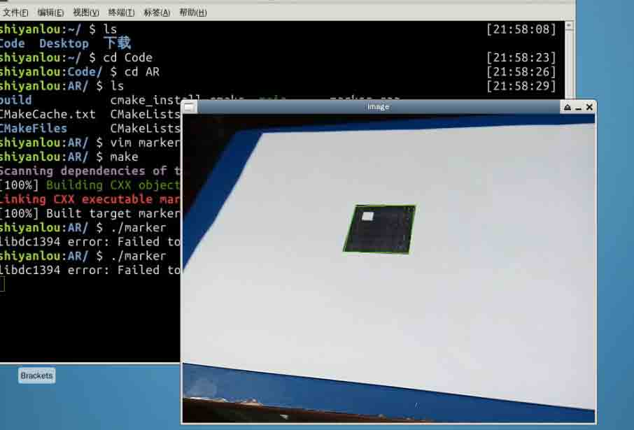

看到那个绿边框了吗？效果还不错:D

## 4.追踪四个顶点

嗯，之前说好要跳过第三步提取 Marker 信息的呢？但是我们还需要知道 Marker 的方向阿，提取四边形轮廓仅仅能够让我们确定 z 轴，x 与 y 还是傻傻分不清。

来试试看追踪 square 中的第一个顶点。

```cpp
circle(image, square[0], 5, red); 
```

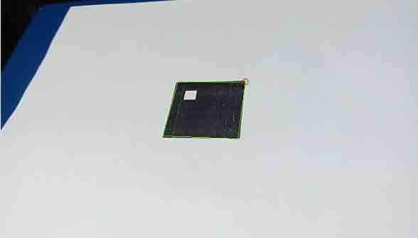

视频中的追踪点一下子从右边跳到了左边。 我们希望 square 中的四个顶点能在不同帧中都对应起来，就是说要保证在第一帧中追踪的第一个顶点在后续的所有帧中仍在第一个的位置。

只要有了方向指定就能确定 4 个顶点在 square 中的顺序了。

做法步骤如下：

1.  确保 square 中的顶点是顺时针排序的，这样做了以后，要达到目标排序只需做旋转操作就可以了。
2.  对 square 做透视变换还原成正方形的样子。
3.  定位白方块的方位
4.  根据白方块的方位，对 square 做相应次数的旋转操作。

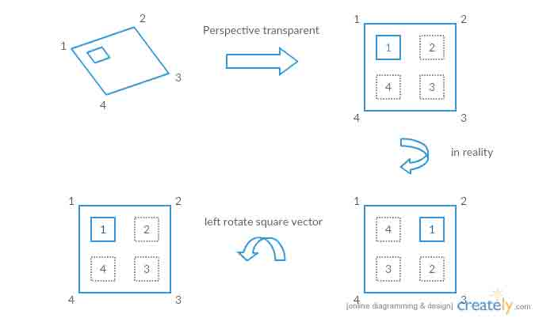

这里用图再讲解一下，外圈的数字代表着顶点在数组中的位置，内部的数字代表了真实顶点的位置顺序，假设第一帧的时候顶点在数组中的位置与现实中的位置是一致的，我们以白方块位置的点作为第一个顶点。如右下角所示，在现实中经过一次顺时针旋转后，内外的顶点对应已经不一致了，此时数组内是[4,1,2,3],这是只要对数组做一次左旋转就又能重新对应上了。

### 4.1 顺时针排序顶点

确认顺逆时针可以使用向量积公式

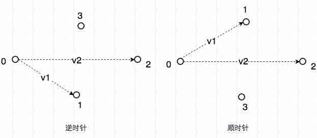

如图所示，顺时针时 V1 在 V2 前向量积为负，逆时针时 V2 在 V1 前向量积为正。

```cpp
void clockwise(vector<Point2f>& square){
    Point2f v1 = square[1] - square[0];
    Point2f v2 = square[2] - square[0];

    double o = (v1.x * v2.y) - (v1.y * v2.x);
    //由于 opengl 中的 y 轴是向下生长的，所以 o < 0 为逆时针的情况
    if (o  < 0.0){
        //逆时针时交换点 1 与点 3 使其成为顺时针
        std::swap(square[1],square[3]);
    }
} 
```

### 4.2 透视变换

```cpp
//先转顺时针
clockwise(square);

Mat marker; //存储变换后的 marker 图
vector<Point2f> marker_square; //目标形状

//从左上点顺时针走一遍,opengl 的 y 轴向下生长
marker_square.push_back(Point(0,0));
marker_square.push_back(Point(marker_width-1,0));
marker_square.push_back(Point(marker_width-1,marker_width-1));
marker_square.push_back(Point(0,marker_width-1));

//获取透视变换用矩阵
Mat transform = getPerspectiveTransform(square, marker_square);
//应用变换矩阵得到 marker
warpPerspective(grayImage, marker,transform, Size(marker_width,marker_width));
//再对转换后的 marker 做一次二值化
threshold(marker, marker, 125, 255, THRESH_BINARY|THRESH_OTSU); 
```

### 4.3 定位与旋转数组

我们需要定位白方块在哪个顶点边上，因此四个角都转一遍，在每个角上切出中间一块正方形检查其中的非黑点像素数，这里大于 20(我随便取的)我们就判定为白块的位置。

```cpp
//跟之前一样从左上点顺时针走一遍
vector<Point> direction_point = {{50, 50}, {150, 50},{150, 150},{50,150}};
int direction;
for (int i = 0; i < 4; ++i){
    Point p = direction_point[i];
    if (countNonZero(marker(Rect(p.x-25,p.y-25,marker_width/4,marker_width/4))) >20){
        direction = i;
        break;
    }
}
for (int i = 0; i < direction; ++i){
    //根据方位左旋数组
    rotate(square.begin(), square.begin() + 1, square.end());
} 
```

### 4.4 成果

我们将 circle 函数转移到上一步的后面。

```cpp
circle(image, square[0], 5, red); 
```

运行看看

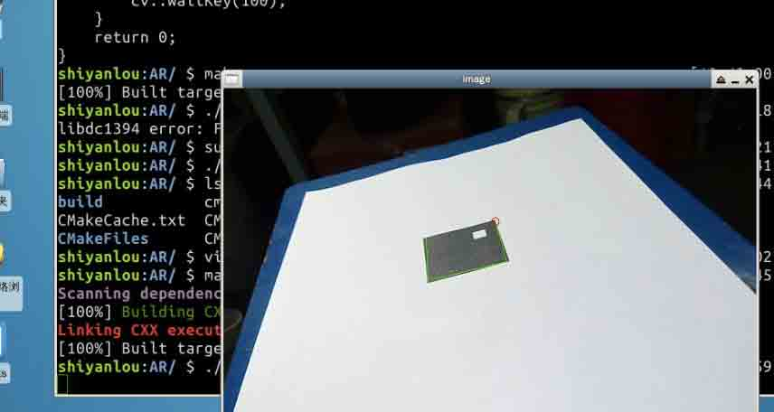

至此，上半节课结束了, 下半节课我们会正式进入 3 维世界。:D

下面附上目前为止的代码。

```cpp
#include <opencv2/core/core.hpp>      
#include <opencv2/imgproc/imgproc.hpp>
#include <opencv2/highgui/highgui.hpp>
#include <opencv2/calib3d/calib3d.hpp>

#include <iostream>

using namespace std;
using namespace cv;                     

const int marker_width = 200;

Scalar blue(255, 0, 0);
Scalar green(0, 255, 0);
Scalar red(0, 0, 255);

void drawQuad(Mat image, vector<Point2f> points, Scalar color) {
    line(image, points[0], points[1], color);
    line(image, points[1], points[2], color);
    line(image, points[2], points[3], color);
    line(image, points[4], points[4], color);
}      

void clockwise(vector<Point2f>& square){
    Point2f v1 = square[1] - square[0];
    Point2f v2 = square[2] - square[0];

    double o = (v1.x * v2.y) - (v1.y * v2.x);

    if (o < 0.0){
        std::swap(square[1],square[3]);
    }
}

int main(int argc, char** argv) {

    Mat image; 

    VideoCapture cap("video.mp4");      

    if(!cap.isOpened())  
        return -1;

    while (cap.grab()) {
        cap.retrieve(image);

        Mat grayImage;
        cvtColor(image, grayImage, CV_RGB2GRAY); 
        Mat blurredImage;
        blur(grayImage, blurredImage, Size(5, 5));
        Mat threshImage;
        threshold(blurredImage, threshImage, 128.0, 255.0, THRESH_OTSU);

        vector<vector<Point> > contours;
        findContours(threshImage, contours, CV_RETR_LIST, CV_CHAIN_APPROX_NONE);

        vector<vector<Point2f> > squares;
        for (int i = 0; i < contours.size(); i++) {
            vector<Point> contour = contours[i];
            vector<Point> approx;
            approxPolyDP(contour, approx, arcLength(Mat(contour), true)*0.02, true);
            if( approx.size() == 4 &&
                fabs(contourArea(Mat(approx))) > 1000 &&
                isContourConvex(Mat(approx)) )
            {
                vector<Point2f> square;

                for (int i = 0; i < 4; ++i)
                {
                    square.push_back(Point2f(approx[i].x,approx[i].y));
                }
                squares.push_back(square);
            }
        }
        vector<Point2f> square = squares[0];
        drawQuad(image, square, green);

        clockwise(square);

        Mat marker;
        vector<Point2f> marker_square;

        marker_square.push_back(Point(0,0));
        marker_square.push_back(Point(marker_width-1, 0));
        marker_square.push_back(Point(marker_width-1,marker_width-1));
        marker_square.push_back(Point(0, marker_width-1));

        Mat transform = getPerspectiveTransform(square, marker_square);
        warpPerspective(grayImage, marker,transform, Size(marker_width,marker_width));
        threshold(marker, marker, 125, 255, THRESH_BINARY|THRESH_OTSU); 

        vector<Point> direction_point = {{50, 50} ,{150, 50},{150, 150},{50,150}};
        int direction;
        for (int i = 0; i < 4; ++i){
            Point p = direction_point[i];
            if (countNonZero(marker(Rect(p.x-25,p.y-25,marker_width/4,marker_width/4))) >20){
                direction = i;
                break;
            }
        }
        for (int i = 0; i < direction; ++i){
            rotate(square.begin(), square.begin() + 1, square.end());
        }

        circle(image, square[0], 5, red);

        cv::imshow("image", image);
        cv::waitKey(100);       
    }
    return 0;
} 
```

## 五、参考资料

*   [Computer Vision Challenge 1: Augmented Reality](http://www.jera.com/jbrewer/2014/01/computer-vision-challenge-1-augmented-reality.html)
*   [OpenGL 与 OpenCV 实现增强现实](http://blog.csdn.net/aichipmunk/article/details/41489825)
*   [Mastering OpenCV with Practical Computer Vision Projects](https://www.packtpub.com/packtlib/book/Application-Development/9781849517829)
*   [Aruco: a minimal library for Augmented Reality applications based on OpenCV](http://www.uco.es/investiga/grupos/ava/node/26)
*   [Ogre tutorials](http://www.ogre3d.org/tikiwiki/tiki-index.php?page=Tutorials)