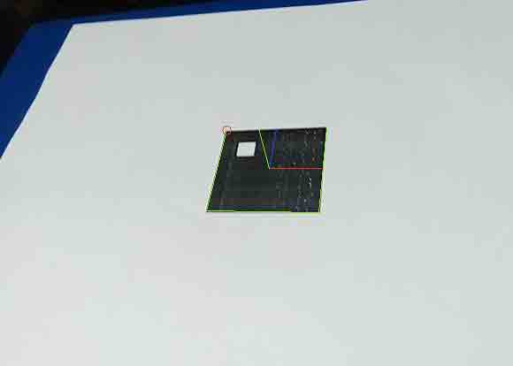

# 第 2 节 1 小时入门 AR 技术（下）

## 一、课程说明

在上一节课中，我们已经成功实现了定位 marker 与追踪 4 个顶点的功能，现在就要构建三维空间到二维空间的映射并载入我们的模型了。

## 二、基本原理

为了了解三维世界的点是如何映射到二维平面上的，让我们先弄清几个概念术语：

*   世界坐标系：系统的绝对坐标系，可以自己设定原点与 xyz 轴，但这个坐标系必须是固定不动的，而其它坐标系会参考这个坐标系移动自身。在我们的实验中，会以 marker 的中心为原点，取它的某个顶点就是取(顶点 x, 顶点 y, 0)这样一个世界坐标。
*   摄像机坐标系：想象一个真实的摄像机，以摄像机自身为原点，摄像机拍摄的那个方向为 z 轴，摄像机摆正的话，x 与 y 轴可以简单地理解为向右和向上。
*   成像平面坐标系：平面坐标系，单位是物理单位(如毫米)
*   图像坐标系：平面坐标系，单位是像素。

接着我们来看一下映射转换的公式：


可能没有学过线性代数的同学看到这个公式会有点慌。你就把一个（除表示坐标以外的）矩阵想象成一个函数，这个函数的作用呢就是把一个坐标系统中的一个点的坐标转换成了该点在另一个坐标系统中的坐标。好了。让我们讲讲这个公式吧，通过这个公式我们发现它对 3 维坐标点使用了两次"函数"操作，也就是做了两次坐标系统的转换。

第一次是标明“外参数”的地方，外参数即是描述该摄像机在世界坐标系中的位置与摄像机旋转方向的参数，通过它我们就能得到一个从世界坐标系到摄像机坐标系的映射，参数中的 `t` 代表了摄像机的位置，`r` 代表了摄像机分别在 x,y,z 轴上的旋转角度。

第二次是标明“内参数”的地方，内参数包含摄像机的焦距与光心位置。其中的 `f` 就是指焦距(focal), `c` 就是指光心(optical center)。通过它我们就能得到摄像机坐标系到成像平面坐标系的映射了。成像原理就跟我们小学、初中学的小孔成像一样。

简化后的公式：


以上是理想相机的模型，为什么说是理想呢，因为现实中的相机都加了"特效"阿，喏


现实中的相机还需要考虑径向畸变与切向畸变。公式扩展如下： 

这里 k 就是径向畸变参数，p 就是切向畸变参数了。在 opencv 中，只考虑(k1,k2,p1,p2,k3)作为整体的畸变参数五元组。更高阶的畸变因数对结果的影响非常小，所以可以忽略不计。畸变参数也是作为内参数之一可以通过摄像机标定获取。

关于如何做摄像机标定，篇幅有限，这里找到一篇非常好的博文：[单摄像机标定](http://pangbo.co/%E6%8A%80%E6%9C%AF%E5%8D%9A%E6%96%87/2015/08/06/%E5%8D%95%E7%9B%B8%E6%9C%BA%E6%A0%87%E5%AE%9A/)，有兴趣的同学可以看一下。

## 三、实验步骤

## 1\. 获取内参数与畸变系数

通过 FileStorage 读取 out*camera*data.xml 文件 加载摄像机内参数。

```cpp
FileStorage fs("calibrate/out_camera_data.xml", FileStorage::READ);
Mat intrinsics, distortion;
//内参数(焦距、光心)矩阵
fs["Camera_Matrix"] >> intrinsics;
//畸变五元组
fs["Distortion_Coefficients"] >> distortion; 
```

## 2\. 获取外参数

外参数即是 `r` 与 `t`, 我们可以通过 solvePnP 函数直接得到。

函数原型如下：

```cpp
bool solvePnP(InputArray objectPoints, InputArray imagePoints, InputArray cameraMatrix, InputArray distCoeffs, OutputArray rvec, OutputArray tvec, bool useExtrinsicGuess=false, int flags=SOLVEPNP_ITERATIVE ) 
```

参数解释：

*   objectPoints: 3d 点集
*   imagePoints: 与 3d 点集点与点之间相对应的 2d 点集
*   cameraMatrix: 相机内参
*   distCoeffs: 相机畸变参数
*   rvec：输出变量，指相机分别绕 x,y,z 轴的旋转量所组成的向量
*   tcev：输出变量，指相机在世界坐标系中的坐标

画图看得更清楚：


代码如下：

```cpp
//四顶点对应的 3d 点集
vector<Point3f> objectPoints; 
//注意：因为 opencv 中是 y 轴向下（x 轴在 y 轴前），为了我们所要的视觉效果（y 轴在 x 轴前），这里的 y 都取了负。
objectPoints.push_back(Point3f(-1, 1, 0));
objectPoints.push_back(Point3f(1, 1, 0));
objectPoints.push_back(Point3f(1, -1, 0));
objectPoints.push_back(Point3f(-1, -1, 0));
Mat objectPointsMat(objectPoints);  

//外参数
Mat rvec;
Mat tvec;
solvePnP(objectPointsMat, square, intrinsics, distortion, rvec, tvec); 
```

## 3\. 三维二维，来去自由

关键要素已经集齐！已经可以轻松的进行二维与三维的转换了（当然最主要还是靠 Marker 这个媒介啦）

画坐标轴验证一下效果。

```cpp
//比如第一个就是{原点，坐标（1,0,0）的点}
vector<Point3f> line3dx = {{0, 0, 0}, {1, 0, 0}};
vector<Point3f> line3dy = {{0, 0, 0}, {0, 1, 0}};
vector<Point3f> line3dz = {{0, 0, 0}, {0, 0, 1}};

//映射后的点坐标
vector<Point2f> line2dx;
vector<Point2f> line2dy;
vector<Point2f> line2dz;

//做点映射
projectPoints(line3dx, rvec, tvec, intrinsics, distortion, line2dx);
projectPoints(line3dy, rvec, tvec, intrinsics, distortion, line2dy);
projectPoints(line3dz, rvec, tvec, intrinsics, distortion, line2dz);

//绘制轴线
line(image, line2dx[0], line2dx[1], red);
line(image, line2dy[0], line2dy[1], blue);
line(image, line2dz[0], line2dz[1], green); 
```



效果不错哈。

## 4\. 目前为止的所有代码

```cpp
#include <opencv2/core/core.hpp>      
#include <opencv2/imgproc/imgproc.hpp>
#include <opencv2/highgui/highgui.hpp>
#include <opencv2/calib3d/calib3d.hpp>

#include <iostream>

using namespace std;
using namespace cv;                     

const int marker_width = 200;

Scalar blue(255, 0, 0);
Scalar green(0, 255, 0);
Scalar red(0, 0, 255);

void drawQuad(Mat image, vector<Point2f> points, Scalar color) {
    line(image, points[0], points[1], color);
    line(image, points[1], points[2], color);
    line(image, points[2], points[3], color);
    line(image, points[4], points[4], color);
}      

void clockwise(vector<Point2f>& square){
    Point2f v1 = square[1] - square[0];
    Point2f v2 = square[2] - square[0];

    double o = (v1.x * v2.y) - (v1.y * v2.x);

    if (o < 0.0){
        std::swap(square[1],square[3]);
    }
}

int main(int argc, char** argv) {

    Mat image; 

    VideoCapture cap("video.mp4");      

    if(!cap.isOpened())  
        return -1;

    while (cap.grab()) {
        cap.retrieve(image);

        Mat grayImage;
        cvtColor(image, grayImage, CV_RGB2GRAY); 
        Mat blurredImage;
        blur(grayImage, blurredImage, Size(5, 5));
        Mat threshImage;
        threshold(blurredImage, threshImage, 128.0, 255.0, THRESH_OTSU);

        vector<vector<Point> > contours;
        findContours(threshImage, contours, CV_RETR_LIST, CV_CHAIN_APPROX_NONE);

        vector<vector<Point2f> > squares;
        for (int i = 0; i < contours.size(); i++) {
            vector<Point> contour = contours[i];
            vector<Point> approx;
            approxPolyDP(contour, approx, arcLength(Mat(contour), true)*0.02, true);
            if( approx.size() == 4 &&
                fabs(contourArea(Mat(approx))) > 1000 &&
                isContourConvex(Mat(approx)) )
            {
                vector<Point2f> square;

                for (int i = 0; i < 4; ++i)
                {
                    square.push_back(Point2f(approx[i].x,approx[i].y));
                }
                squares.push_back(square);
            }
        }
        vector<Point2f> square = squares[0];
        drawQuad(image, square, green);

        clockwise(square);

        Mat marker;
        vector<Point2f> marker_square;

        marker_square.push_back(Point(0,0));
        marker_square.push_back(Point(marker_width-1, 0));
        marker_square.push_back(Point(marker_width-1,marker_width-1));
        marker_square.push_back(Point(0, marker_width-1));

        Mat transform = getPerspectiveTransform(square, marker_square);
        warpPerspective(grayImage, marker,transform, Size(marker_width,marker_width));
        threshold(marker, marker, 125, 255, THRESH_BINARY|THRESH_OTSU); 

        vector<Point> direction_point = {{50, 50} ,{150, 50},{150, 150},{50,150}};
        int direction;
        for (int i = 0; i < 4; ++i){
            Point p = direction_point[i];
            if (countNonZero(marker(Rect(p.x-25,p.y-25,marker_width/4,marker_width/4))) >20){
                direction = i;
                break;
            }
        }
        for (int i = 0; i < direction; ++i){
            rotate(square.begin(), square.begin() + 1, square.end());
        }

        circle(image, square[0], 5, red);

        FileStorage fs("calibrate/out_camera_data.xml", FileStorage::READ);
        Mat intrinsics, distortion;
        fs["Camera_Matrix"] >> intrinsics;
        fs["Distortion_Coefficients"] >> distortion;

        vector<Point3f> objectPoints; 
        objectPoints.push_back(Point3f(-1, 1, 0));
        objectPoints.push_back(Point3f(1, 1, 0));
        objectPoints.push_back(Point3f(1, -1, 0));
        objectPoints.push_back(Point3f(-1, -1, 0));
        Mat objectPointsMat(objectPoints);  

        Mat rvec;
        Mat tvec;

        solvePnP(objectPointsMat, square, intrinsics, distortion, rvec, tvec);

        cout << "rvec: " << rvec << endl;
        cout << "tvec: " << tvec << endl;

        vector<Point3f> line3dx = {{0, 0, 0}, {1, 0, 0}};
        vector<Point3f> line3dy = {{0, 0, 0}, {0, 1, 0}};
        vector<Point3f> line3dz = {{0, 0, 0}, {0, 0, 1}};

        vector<Point2f> line2dx;
        vector<Point2f> line2dy;
        vector<Point2f> line2dz;
        projectPoints(line3dx, rvec, tvec, intrinsics, distortion, line2dx);
        projectPoints(line3dy, rvec, tvec, intrinsics, distortion, line2dy);
        projectPoints(line3dz, rvec, tvec, intrinsics, distortion, line2dz);

        line(image, line2dx[0], line2dx[1], red);
        line(image, line2dy[0], line2dy[1], blue);
        line(image, line2dz[0], line2dz[1], green);    

        cv::imshow("image", image);
        cv::waitKey(100);       
    }
    return 0;
} 
```

## 5\. 载入 3d 模型

这部分内容由于涉及到游戏引擎的学习，学习量实在太大所以就简化为运行看看效果了囧。首先安装一下环境。

```cpp
sudo apt-get install libboost-filesystem-dev
sudo apt-get install libogre-1.9-dev libois-dev 
```

下载数据包

```cpp
wget http://labfile.oss.aliyuncs.com/courses/545/AR_tutorial_2.zip 
```

打开包编译运行

```cpp
unzip AR_tutorial_2.zip
cd AR_tutorial_2
cmake .
make
./sinbad video.avi 
```

一个踩着魔鬼的步伐的漆黑的食人魔


## 四、参考资料

*   [Computer Vision Challenge 1: Augmented Reality](http://www.jera.com/jbrewer/2014/01/computer-vision-challenge-1-augmented-reality.html)
*   [OpenGL 与 OpenCV 实现增强现实](http://blog.csdn.net/aichipmunk/article/details/41489825)
*   [Mastering OpenCV with Practical Computer Vision Projects](https://www.packtpub.com/packtlib/book/Application-Development/9781849517829)
*   [Aruco: a minimal library for Augmented Reality applications based on OpenCV](http://www.uco.es/investiga/grupos/ava/node/26)
*   [Ogre tutorials](http://www.ogre3d.org/tikiwiki/tiki-index.php?page=Tutorials)