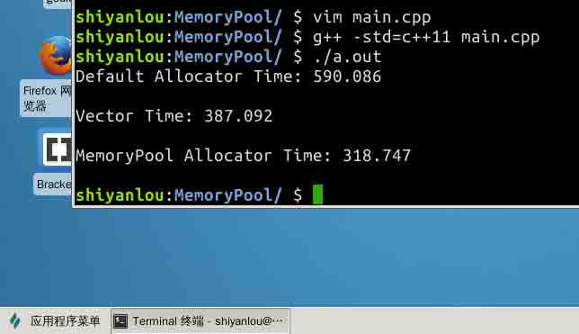

# 第 1 节 C++ 实现高性能内存池 - 基础知识

## 一、概述

### 项目介绍

在 C/C++ 中，内存管理是一个非常棘手的问题，我们在编写一个程序的时候几乎不可避免的要遇到内存的分配逻辑，这时候随之而来的有这样一些问题：是否有足够的内存可供分配? 分配失败了怎么办? 如何管理自身的内存使用情况? 等等一系列问题。在一个高可用的软件中，如果我们仅仅单纯的向操作系统去申请内存，当出现内存不足时就退出软件，是明显不合理的。正确的思路应该是在内存不足的时，考虑如何管理并优化自身已经使用的内存，这样才能使得软件变得更加可用。本次项目我们将实现一个内存池，并使用一个栈结构来测试我们的内存池提供的分配性能。最终，我们要实现的内存池在栈结构中的性能，要远高于使用 `std::allocator` 和 `std::vector`，如下图所示：



### 项目涉及的知识点

*   C++ 中的内存分配器 `std::allocator`
*   内存池技术
*   手动实现模板链式栈
*   链式栈和列表栈的性能比较

### 内存池简介

内存池是池化技术中的一种形式。通常我们在编写程序的时候回使用 `new` `delete` 这些关键字来向操作系统申请内存，而这样造成的后果就是每次申请内存和释放内存的时候，都需要和操作系统的系统调用打交道，从堆中分配所需的内存。如果这样的操作太过频繁，就会找成大量的内存碎片进而降低内存的分配性能，甚至出现内存分配失败的情况。

而内存池就是为了解决这个问题而产生的一种技术。从内存分配的概念上看，内存申请无非就是向内存分配方索要一个指针，当向操作系统申请内存时，操作系统需要进行复杂的内存管理调度之后，才能正确的分配出一个相应的指针。而这个分配的过程中，我们还面临着分配失败的风险。

所以，每一次进行内存分配，就会消耗一次分配内存的时间，设这个时间为 T，那么进行 n 次分配总共消耗的时间就是 nT；如果我们一开始就确定好我们可能需要多少内存，那么在最初的时候就分配好这样的一块内存区域，当我们需要内存的时候，直接从这块已经分配好的内存中使用即可，那么总共需要的分配时间仅仅只有 T。当 n 越大时，节约的时间就越多。

## 二、主函数设计

我们要设计实现一个高性能的内存池，那么自然避免不了需要对比已有的内存，而比较内存池对内存的分配性能，就需要实现一个需要对内存进行动态分配的结构（比如：链表栈），为此，可以写出如下的代码：

```cpp
#include <iostream>   // std::cout, std::endl
#include <cassert>    // assert()
#include <ctime>      // clock()
#include <vector>     // std::vector

#include "MemoryPool.hpp"  // MemoryPool<T>
#include "StackAlloc.hpp"  // StackAlloc<T, Alloc>

// 插入元素个数
#define ELEMS 10000000
// 重复次数
#define REPS 100

int main()
{
    clock_t start;

    // 使用 STL 默认分配器
    StackAlloc<int, std::allocator<int> > stackDefault;
    start = clock();
    for (int j = 0; j < REPS; j++) {
        assert(stackDefault.empty());
        for (int i = 0; i < ELEMS; i++)
          stackDefault.push(i);
        for (int i = 0; i < ELEMS; i++)
          stackDefault.pop();
    }
    std::cout << "Default Allocator Time: ";
    std::cout << (((double)clock() - start) / CLOCKS_PER_SEC) << "\n\n";

    // 使用内存池
    StackAlloc<int, MemoryPool<int> > stackPool;
    start = clock();
    for (int j = 0; j < REPS; j++) {
        assert(stackPool.empty());
        for (int i = 0; i < ELEMS; i++)
          stackPool.push(i);
        for (int i = 0; i < ELEMS; i++)
          stackPool.pop();
    }
    std::cout << "MemoryPool Allocator Time: ";
    std::cout << (((double)clock() - start) / CLOCKS_PER_SEC) << "\n\n";

    return 0;
} 
```

在上面的两段代码中，`StackAlloc` 是一个链表栈，接受两个模板参数，第一个参数是栈中的元素类型，第二个参数就是栈使用的内存分配器。

因此，这个内存分配器的模板参数就是整个比较过程中唯一的变量，使用默认分配器的模板参数为 `std::allocator<int>`，而使用内存池的模板参数为 `MemoryPool<int>`。

> std::allocator 是 C++标准库中提供的默认分配器，他的特点就在于我们在 使用 new 来申请内存构造新对象的时候，势必要调用类对象的默认构造函数，而使用 std::allocator 则可以将内存分配和对象的构造这两部分逻辑给分离开来，使得分配的内存是原始、未构造的。

下面我们来实现这个链表栈。

## 三、模板链表栈

栈的结构非常的简单，没有什么复杂的逻辑操作，其成员函数只需要考虑两个基本的操作：入栈、出栈。为了操作上的方便，我们可能还需要这样一些方法：判断栈是否空、清空栈、获得栈顶元素。

```cpp
#include <memory>

template <typename T>
struct StackNode_
{
  T data;
  StackNode_* prev;
};

// T 为存储的对象类型, Alloc 为使用的分配器, 并默认使用 std::allocator 作为对象的分配器
template <typename T, typename Alloc = std::allocator<T> >
class StackAlloc
{
  public:
    // 使用 typedef 简化类型名
    typedef StackNode_<T> Node;
    typedef typename Alloc::template rebind<Node>::other allocator;

    // 默认构造
    StackAlloc() { head_ = 0; }
    // 默认析构
    ~StackAlloc() { clear(); }

    // 当栈中元素为空时返回 true
    bool empty() {return (head_ == 0);}

    // 释放栈中元素的所有内存
    void clear();

    // 压栈
    void push(T element);

    // 出栈
    T pop();

    // 返回栈顶元素
    T top() { return (head_->data); }

  private:
    // 
    allocator allocator_;
    // 栈顶
    Node* head_;
}; 
```

简单的逻辑诸如构造、析构、判断栈是否空、返回栈顶元素的逻辑都非常简单，直接在上面的定义中实现了，下面我们来实现 `clear()`, `push()` 和 `pop()` 这三个重要的逻辑：

```cpp
// 释放栈中元素的所有内存
void clear() {
  Node* curr = head_;
  // 依次出栈
  while (curr != 0)
  {
    Node* tmp = curr->prev;
    // 先析构, 再回收内存
    allocator_.destroy(curr);
    allocator_.deallocate(curr, 1);
    curr = tmp;
  }
  head_ = 0;
}
// 入栈
void push(T element) {
  // 为一个节点分配内存
  Node* newNode = allocator_.allocate(1);
  // 调用节点的构造函数
  allocator_.construct(newNode, Node());

  // 入栈操作
  newNode->data = element;
  newNode->prev = head_;
  head_ = newNode;
}

// 出栈
T pop() {
  // 出栈操作 返回出栈元素
  T result = head_->data;
  Node* tmp = head_->prev;
  allocator_.destroy(head_);
  allocator_.deallocate(head_, 1);
  head_ = tmp;
  return result;
} 
```

至此，我们完成了整个模板链表栈，现在我们可以先注释掉 `main()` 函数中使用内存池部分的代码来测试这个连表栈的内存分配情况，我们就能够得到这样的结果：


在使用 `std::allocator` 的默认内存分配器中，在

```cpp
#define ELEMS 10000000
#define REPS 100 
```

的条件下，总共花费了近一分钟的时间。

> 如果觉得花费的时间较长，不愿等待，则你尝试可以减小这两个值

## 总结

本节我们实现了一个用于测试性能比较的模板链表栈，目前的代码如下。在下一节中，我们开始详细实现我们的高性能内存池。

```cpp
// StackAlloc.hpp

#ifndef STACK_ALLOC_H
#define STACK_ALLOC_H

#include <memory>

template <typename T>
struct StackNode_
{
  T data;
  StackNode_* prev;
};

// T 为存储的对象类型, Alloc 为使用的分配器,
// 并默认使用 std::allocator 作为对象的分配器
template <class T, class Alloc = std::allocator<T> >
class StackAlloc
{
  public:
    // 使用 typedef 简化类型名
    typedef StackNode_<T> Node;
    typedef typename Alloc::template rebind<Node>::other allocator;

    // 默认构造
    StackAlloc() { head_ = 0; }
    // 默认析构
    ~StackAlloc() { clear(); }

    // 当栈中元素为空时返回 true
    bool empty() {return (head_ == 0);}

    // 释放栈中元素的所有内存
    void clear() {
      Node* curr = head_;
      while (curr != 0)
      {
        Node* tmp = curr->prev;
        allocator_.destroy(curr);
        allocator_.deallocate(curr, 1);
        curr = tmp;
      }
      head_ = 0;
    }

    // 入栈
    void push(T element) {
      // 为一个节点分配内存
      Node* newNode = allocator_.allocate(1);
      // 调用节点的构造函数
      allocator_.construct(newNode, Node());

      // 入栈操作
      newNode->data = element;
      newNode->prev = head_;
      head_ = newNode;
    }

    // 出栈
    T pop() {
      // 出栈操作 返回出栈结果
      T result = head_->data;
      Node* tmp = head_->prev;
      allocator_.destroy(head_);
      allocator_.deallocate(head_, 1);
      head_ = tmp;
      return result;
    }

    // 返回栈顶元素
    T top() { return (head_->data); }

  private:
    allocator allocator_;
    Node* head_;
};

#endif // STACK_ALLOC_H 
```

```cpp
// main.cpp

#include <iostream>
#include <cassert>
#include <ctime>
#include <vector>

// #include "MemoryPool.hpp"
#include "StackAlloc.hpp"

// 根据电脑性能调整这些值
// 插入元素个数
#define ELEMS 25000000
// 重复次数
#define REPS 50

int main()
{
    clock_t start;

    // 使用默认分配器
    StackAlloc<int, std::allocator<int> > stackDefault;
    start = clock();
    for (int j = 0; j < REPS; j++) {
        assert(stackDefault.empty());
        for (int i = 0; i < ELEMS; i++)
          stackDefault.push(i);
        for (int i = 0; i < ELEMS; i++)
          stackDefault.pop();
    }
    std::cout << "Default Allocator Time: ";
    std::cout << (((double)clock() - start) / CLOCKS_PER_SEC) << "\n\n";

    // 使用内存池
    // StackAlloc<int, MemoryPool<int> > stackPool;
    // start = clock();
    // for (int j = 0; j < REPS; j++) {
    //     assert(stackPool.empty());
    //     for (int i = 0; i < ELEMS; i++)
    //       stackPool.push(i);
    //     for (int i = 0; i < ELEMS; i++)
    //       stackPool.pop();
    // }
    // std::cout << "MemoryPool Allocator Time: ";
    // std::cout << (((double)clock() - start) / CLOCKS_PER_SEC) << "\n\n";

    return 0;
} 
```

## 参考资料

1.  [内存池-维基百科](https://en.wikipedia.org/wiki/Memory_pool)
2.  [C++ 标准库参考](http://en.cppreference.com/w/Main_Page)

## 版权声明

项目来源：[`github.com/cacay/MemoryPool`](https://github.com/cacay/MemoryPool)

本节实验中所涉及代码均选自此开源项目，根据项目作者的许可协议(MIT)，**本次实验中所有代码在原项目基础上进行了适当的修改, 但未修改部分代码版权仍然属于原作者 Cosku Acay，原作者保留所有权利。**