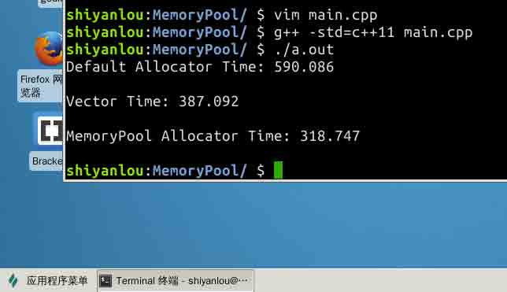

# 第 2 节 C++ 实现高性能内存池 - 实现高性能内存池

## 一、概述

### 项目介绍

在 C/C++ 中，内存管理是一个非常棘手的问题，我们在编写一个程序的时候几乎不可避免的要遇到内存的分配逻辑，这时候随之而来的有这样一些问题：是否有足够的内存可供分配? 分配失败了怎么办? 如何管理自身的内存使用情况? 等等一系列问题。在一个高可用的软件中，如果我们仅仅单纯的向操作系统去申请内存，当出现内存不足时就退出软件，是明显不合理的。正确的思路应该是在内存不足的时，考虑如何管理并优化自身已经使用的内存，这样才能使得软件变得更加可用。本次项目我们将实现一个内存池，并使用一个栈结构来测试我们的内存池提供的分配性能。最终，我们要实现的内存池在栈结构中的性能，要远高于使用 `std::allocator` 和 `std::vector`，如下图所示：



### 项目涉及的知识点

*   C++11 特性
*   C++ 中的内存分配器 `std::allocator`
*   内存池技术
*   手动实现模板链式栈
*   链式栈和列表栈的性能比较

### 内存池简介

内存池是池化技术中的一种形式。通常我们在编写程序的时候回使用 `new` `delete` 这些关键字来向操作系统申请内存，而这样造成的后果就是每次申请内存和释放内存的时候，都需要和操作系统的系统调用打交道，从堆中分配所需的内存。如果这样的操作太过频繁，就会找成大量的内存碎片进而降低内存的分配性能，甚至出现内存分配失败的情况。

而内存池就是为了解决这个问题而产生的一种技术。从内存分配的概念上看，内存申请无非就是向内存分配方索要一个指针，当向操作系统申请内存时，操作系统需要进行复杂的内存管理调度之后，才能正确的分配出一个相应的指针。而这个分配的过程中，我们还面临着分配失败的风险。

所以，每一次进行内存分配，就会消耗一次分配内存的时间，设这个时间为 T，那么进行 n 次分配总共消耗的时间就是 nT；如果我们一开始就确定好我们可能需要多少内存，那么在最初的时候就分配好这样的一块内存区域，当我们需要内存的时候，直接从这块已经分配好的内存中使用即可，那么总共需要的分配时间仅仅只有 T。当 n 越大时，节约的时间就越多。

## 二、设计内存池

在上一节实验中，我们在模板链表栈中使用了默认构造器来管理栈操作中的元素内存，一共涉及到了 `rebind<T>::other`, `allocate()`, `dealocate()`, `construct()`, `destroy()`这些关键性的接口。所以为了让代码直接可用，我们同样应该在内存池中设计同样的接口：

```cpp
#ifndef MEMORY_POOL_HPP
#define MEMORY_POOL_HPP

#include <climits>
#include <cstddef>

template <typename T, size_t BlockSize = 4096>
class MemoryPool
{
  public:
    // 使用 typedef 简化类型书写
    typedef T*              pointer;

    // 定义 rebind<U>::other 接口
    template <typename U> struct rebind {
      typedef MemoryPool<U> other;
    };

    // 默认构造, 初始化所有的槽指针
    // C++11 使用了 noexcept 来显式的声明此函数不会抛出异常
    MemoryPool() noexcept {
      currentBlock_ = nullptr;
      currentSlot_ = nullptr;
      lastSlot_ = nullptr;
      freeSlots_ = nullptr;
    }

    // 销毁一个现有的内存池
    ~MemoryPool() noexcept;

    // 同一时间只能分配一个对象, n 和 hint 会被忽略
    pointer allocate(size_t n = 1, const T* hint = 0);

    // 销毁指针 p 指向的内存区块
    void deallocate(pointer p, size_t n = 1);

    // 调用构造函数
    template <typename U, typename... Args>
    void construct(U* p, Args&&... args);

    // 销毁内存池中的对象, 即调用对象的析构函数
    template <typename U>
    void destroy(U* p) {
      p->~U();
    }

  private:
    // 用于存储内存池中的对象槽, 
    // 要么被实例化为一个存放对象的槽, 
    // 要么被实例化为一个指向存放对象槽的槽指针
    union Slot_ {
      T element;
      Slot_* next;
    };

    // 数据指针
    typedef char* data_pointer_;
    // 对象槽
    typedef Slot_ slot_type_;
    // 对象槽指针
    typedef Slot_* slot_pointer_;

    // 指向当前内存区块
    slot_pointer_ currentBlock_;
    // 指向当前内存区块的一个对象槽
    slot_pointer_ currentSlot_;
    // 指向当前内存区块的最后一个对象槽
    slot_pointer_ lastSlot_;
    // 指向当前内存区块中的空闲对象槽
    slot_pointer_ freeSlots_;

    // 检查定义的内存池大小是否过小
    static_assert(BlockSize >= 2 * sizeof(slot_type_), "BlockSize too small.");
};

#endif // MEMORY_POOL_HPP 
```

在上面的类设计中可以看到，在这个内存池中，其实是使用链表来管理整个内存池的内存区块的。内存池首先会定义固定大小的基本内存区块(Block)，然后在其中定义了一个可以实例化为存放对象内存槽的对象槽（Slot_）和对象槽指针的一个联合。然后在区块中，定义了四个关键性质的指针，它们的作用分别是：

1.  `currentBlock_`: 指向当前内存区块的指针
2.  `currentSlot_`: 指向当前内存区块中的对象槽
3.  `lastSlot_`: 指向当前内存区块中的最后一个对象槽
4.  `freeSlots_`: 指向当前内存区块中所有空闲的对象槽

梳理好整个内存池的设计结构之后，我们就可以开始实现关键性的逻辑了。

## 三、实现

### MemoryPool::construct() 实现

`MemoryPool::construct()` 的逻辑是最简单的，我们需要实现的，仅仅只是调用信件对象的构造函数即可，因此：

```cpp
// 调用构造函数, 使用 std::forward 转发变参模板
template <typename U, typename... Args>
void construct(U* p, Args&&... args) {
    new (p) U (std::forward<Args>(args)...);
} 
```

### MemoryPool::deallocate() 实现

`MemoryPool::deallocate()` 是在对象槽中的对象被析构后才会被调用的，主要目的是销毁内存槽。其逻辑也不复杂：

```cpp
// 销毁指针 p 指向的内存区块
void deallocate(pointer p, size_t n = 1) {
  if (p != nullptr) {
    // reinterpret_cast 是强制类型转换符
    // 要访问 next 必须强制将 p 转成 slot_pointer_
    reinterpret_cast<slot_pointer_>(p)->next = freeSlots_;
    freeSlots_ = reinterpret_cast<slot_pointer_>(p);
  }
} 
```

### MemoryPool::~MemoryPool() 实现

析构函数负责销毁整个内存池，因此我们需要逐个删除掉最初向操作系统申请的内存块：

```cpp
// 销毁一个现有的内存池
~MemoryPool() noexcept {
  // 循环销毁内存池中分配的内存区块
  slot_pointer_ curr = currentBlock_;
  while (curr != nullptr) {
    slot_pointer_ prev = curr->next;
    operator delete(reinterpret_cast<void*>(curr));
    curr = prev;
  }
} 
```

### MemoryPool::allocate() 实现

`MemoryPool::allocate()` 毫无疑问是整个内存池的关键所在，但实际上理清了整个内存池的设计之后，其实现并不复杂。具体实现如下：

```cpp
// 同一时间只能分配一个对象, n 和 hint 会被忽略
pointer allocate(size_t n = 1, const T* hint = 0) {
  // 如果有空闲的对象槽，那么直接将空闲区域交付出去
  if (freeSlots_ != nullptr) {
    pointer result = reinterpret_cast<pointer>(freeSlots_);
    freeSlots_ = freeSlots_->next;
    return result;
  } else {
    // 如果对象槽不够用了，则分配一个新的内存区块
    if (currentSlot_ >= lastSlot_) {
      // 分配一个新的内存区块，并指向前一个内存区块
      data_pointer_ newBlock = reinterpret_cast<data_pointer_>(operator new(BlockSize));
      reinterpret_cast<slot_pointer_>(newBlock)->next = currentBlock_;
      currentBlock_ = reinterpret_cast<slot_pointer_>(newBlock);
      // 填补整个区块来满足元素内存区域的对齐要求
      data_pointer_ body = newBlock + sizeof(slot_pointer_);
      uintptr_t result = reinterpret_cast<uintptr_t>(body);
      size_t bodyPadding = (alignof(slot_type_) - result) % alignof(slot_type_);
      currentSlot_ = reinterpret_cast<slot_pointer_>(body + bodyPadding);
      lastSlot_ = reinterpret_cast<slot_pointer_>(newBlock + BlockSize - sizeof(slot_type_) + 1);
    }
    return reinterpret_cast<pointer>(currentSlot_++);
  }
} 
```

## 四、与 std::vector 的性能对比

我们知道，对于栈来说，链栈其实并不是最好的实现方式，因为这种结构的栈不可避免的会涉及到指针相关的操作，同时，还会消耗一定量的空间来存放节点之间的指针。事实上，我们可以使用 `std::vector` 中的 `push_back()` 和 `pop_back()` 这两个操作来模拟一个栈，我们不妨来对比一下这个 `std::vector` 与我们所实现的内存池在性能上谁高谁低，我们在 主函数中加入如下代码：

```cpp
// 比较内存池和 std::vector 之间的性能
    std::vector<int> stackVector;
    start = clock();
    for (int j = 0; j < REPS; j++) {
        assert(stackVector.empty());
        for (int i = 0; i < ELEMS; i++)
          stackVector.push_back(i);
        for (int i = 0; i < ELEMS; i++)
          stackVector.pop_back();
    }
    std::cout << "Vector Time: ";
    std::cout << (((double)clock() - start) / CLOCKS_PER_SEC) << "\n\n"; 
```

这时候，我们重新编译代码，就能够看出这里面的差距了：


首先是使用默认分配器的链表栈速度最慢，其次是使用 std::vector 模拟的栈结构，在链表栈的基础上大幅度削减了时间。

> `std::vector` 的实现方式其实和内存池较为类似，在 std::vector 空间不够用时，会抛弃现在的内存区域重新申请一块更大的区域，并将现在内存区域中的数据整体拷贝一份到新区域中。

最后，对于我们实现的内存池，消耗的时间最少，即内存分配性能最佳，完成了本项目。

## 总结

本节中，我们实现了我们上节实验中未实现的内存池，完成了整个项目的目标。 这个内存池不仅精简而且高效，整个内存池的完整代码如下：

```cpp
#ifndef MEMORY_POOL_HPP
#define MEMORY_POOL_HPP

#include <climits>
#include <cstddef>

template <typename T, size_t BlockSize = 4096>
class MemoryPool
{
  public:
    // 使用 typedef 简化类型书写
    typedef T*              pointer;

    // 定义 rebind<U>::other 接口
    template <typename U> struct rebind {
      typedef MemoryPool<U> other;
    };

    // 默认构造
    // C++11 使用了 noexcept 来显式的声明此函数不会抛出异常
    MemoryPool() noexcept {
      currentBlock_ = nullptr;
      currentSlot_ = nullptr;
      lastSlot_ = nullptr;
      freeSlots_ = nullptr;
    }

    // 销毁一个现有的内存池
    ~MemoryPool() noexcept {
      // 循环销毁内存池中分配的内存区块
      slot_pointer_ curr = currentBlock_;
      while (curr != nullptr) {
        slot_pointer_ prev = curr->next;
        operator delete(reinterpret_cast<void*>(curr));
        curr = prev;
      }
    }

    // 同一时间只能分配一个对象, n 和 hint 会被忽略
    pointer allocate(size_t n = 1, const T* hint = 0) {
      if (freeSlots_ != nullptr) {
        pointer result = reinterpret_cast<pointer>(freeSlots_);
        freeSlots_ = freeSlots_->next;
        return result;
      }
      else {
        if (currentSlot_ >= lastSlot_) {
          // 分配一个内存区块
          data_pointer_ newBlock = reinterpret_cast<data_pointer_>(operator new(BlockSize));
          reinterpret_cast<slot_pointer_>(newBlock)->next = currentBlock_;
          currentBlock_ = reinterpret_cast<slot_pointer_>(newBlock);
          data_pointer_ body = newBlock + sizeof(slot_pointer_);
          uintptr_t result = reinterpret_cast<uintptr_t>(body);
          size_t bodyPadding = (alignof(slot_type_) - result) % alignof(slot_type_);
          currentSlot_ = reinterpret_cast<slot_pointer_>(body + bodyPadding);
          lastSlot_ = reinterpret_cast<slot_pointer_>(newBlock + BlockSize - sizeof(slot_type_) + 1);
        }
        return reinterpret_cast<pointer>(currentSlot_++);
      }
    }

    // 销毁指针 p 指向的内存区块
    void deallocate(pointer p, size_t n = 1) {
      if (p != nullptr) {
        reinterpret_cast<slot_pointer_>(p)->next = freeSlots_;
        freeSlots_ = reinterpret_cast<slot_pointer_>(p);
      }
    }

    // 调用构造函数, 使用 std::forward 转发变参模板
    template <typename U, typename... Args>
    void construct(U* p, Args&&... args) {
      new (p) U (std::forward<Args>(args)...);
    }

    // 销毁内存池中的对象, 即调用对象的析构函数
    template <typename U>
    void destroy(U* p) {
      p->~U();
    }

  private:
    // 用于存储内存池中的对象槽
    union Slot_ {
      T element;
      Slot_* next;
    };

    // 数据指针
    typedef char* data_pointer_;
    // 对象槽
    typedef Slot_ slot_type_;
    // 对象槽指针
    typedef Slot_* slot_pointer_;

    // 指向当前内存区块
    slot_pointer_ currentBlock_;
    // 指向当前内存区块的一个对象槽
    slot_pointer_ currentSlot_;
    // 指向当前内存区块的最后一个对象槽
    slot_pointer_ lastSlot_;
    // 指向当前内存区块中的空闲对象槽
    slot_pointer_ freeSlots_;
    // 检查定义的内存池大小是否过小
    static_assert(BlockSize >= 2 * sizeof(slot_type_), "BlockSize too small.");
};

#endif // MEMORY_POOL_HPP 
```

## 参考资料

1.  [内存池-维基百科](https://en.wikipedia.org/wiki/Memory_pool)
2.  [C++ 标准库参考](http://en.cppreference.com/w/Main_Page)

## 版权声明

项目来源：[`github.com/cacay/MemoryPool`](https://github.com/cacay/MemoryPool)

本节实验中所涉及代码均选自此开源项目，根据项目作者的许可协议(MIT)，**本次实验中所有代码在原项目基础上进行了适当的修改, 但未修改部分代码版权仍然属于原作者 Cosku Acay，原作者保留所有权利。**