# 第 1 节 GDB 常用命令实战

## 一、实验说明

### 1.1 实验简介

本课程通过动手实验学习 Linux 上 GDB 调试 C 语言程序的基本技巧。首先讲解了 GDB 的常用命令，然后通过对有问题的链表程序的调试来逐步实践挖掘程序 BUG 的过程。

### 1.2 知识点

本课程中将学习并实践以下知识点：

1.  Linux 环境下 C 语言的程序调试过程
2.  GDB 调试程序的基本步骤
3.  链表程序 BUG 调试实战

### 1.3 下载测试程序

实验楼最核心的是动手实践学习技术，所以本课程中我们将通过对两个程序的调试来熟悉 GDB 调试技术。

这两个程序分别为：

1.  `debugging.c` 程序：只有一个源文件，这是一个简单的求和程序，计算 `1+2+3+...+100` 的值。程序存在 bug，导致预期结果并不为 5050，我们将在本节实验中调试并修复 BUG。
2.  链表程序：本例的程序来源于 [github](http://github.com/cs202/cs202-gdb-tutorial), 程序定义了数据结构链表，并使用了三个测试函数进行测试，程序仍然有 BUG，需要我们使用 GDB 去发现。

在实验开始之前，我们先下载并解压上述的测试代码，打开桌面上的 Xfce 终端，输入下面的命令：

```cpp
# 进入到 shiyanlou 用户家目录
cd /home/shiyanlou/

# 下载代码压缩包
wget http://labfile.oss.aliyuncs.com/courses/496/gdbtest.zip

# 解压
unzip gdbtest.zip

# 进入到代码目录查看文件列表
cd gdbtest/
ls -l 
```

下载后的文件列表如下图所示：


### 1.4 建立 32 位编译环境

为了能够正常编译测试程序，需要在实验楼环境中执行下列命令，建立 32 位可执行程序编译环境：

```cpp
sudo apt-get update
sudo apt-get install gcc-multilib 
```

## 二、GDB 基础知识

### 2.1 GDB 相关概念

GDB, 是 `The GNU Project Debugger` 的缩写, 是 Linux 下功能全面的调试工具。GDB 支持断点、单步执行、打印变量、观察变量、查看寄存器、查看堆栈等调试手段。在 Linux 环境软件开发中，GDB 是主要的调试工具，用来调试 C 和 C++ 程序。

### 2.2 GDB 的进入和退出

如果要调试程序，需要在 gcc 编译可执行程序时加上 `-g` 参数，首先我们编译 `bugging.c` 程序，生成可执行文件：

```cpp
gcc -g -o bugging bugging.c -m32 
```

其中 `-o` 指定输出文件名, `-m32` 表示构建 32 位可执行程序，实验楼的环境是 64 位的 Ubuntu 14.04，所以默认会编译为 64 位的程序。

输入 `gdb bugging` 进入 gdb 调试 bugging 程序的界面：

```cpp
gdb bugging 
```

在 gdb 命令行界面，输入`run` 执行待调试程序：

```cpp
(gdb) run 
```

在 gdb 命令行界面，输入`quit` 退出 gdb：

```cpp
(gdb) quit 
```

上述步骤的操作截图如下：


### 2.3 GDB 命令行界面使用技巧

#### 命令补全

任何时候都可以使用 `TAB` 进行补全，如果只有一个待选选项则直接补全；否则会列出可选选项，继续键入命令，同时结合 `TAB` 即可快速输入命令。

#### 部分 gdb 常用命令一览表

```cpp
| 命令 | 简写形式 | 说明 |
| ---- | :------: | ---- |
| list | l | 查看源码 |
| backtrace | bt、where | 打印函数栈信息 |
| next | n | 执行下一行 |
| step | s | 一次执行一行，遇到函数会进入 |
| finish |  | 运行到函数结束 |
| continue | c | 继续运行 |
| break | b | 设置断点 |
| info  breakpoints |  | 显示断点信息 |
| delete | d | 删除断点 |
| print | p | 打印表达式的值 |
| run | r | 启动程序 |
| until | u | 执行到指定行 |
| info | i | 显示信息 |
| help | h | 帮助信息 |
```

#### 查询用法

在 gdb 命令行界面，使用 `(gdb) help command` 可以查看命令的用法。

#### 执行 Shell 命令

在 gdb 命令行界面可以执行外部的 Shell 命令：

```cpp
(gdb) !shell 命令 
```

例如查看当前目录的文件：


## 三、GDB 断点

### 3.1 重新进入 debugging 调试界面

```cpp
gdb bugging 
```

### 3.2 查看源码

*list* 命令用来显示源文件中的代码。

#### 通过行号查看源码

list 行号，显示某一行附近的代码：

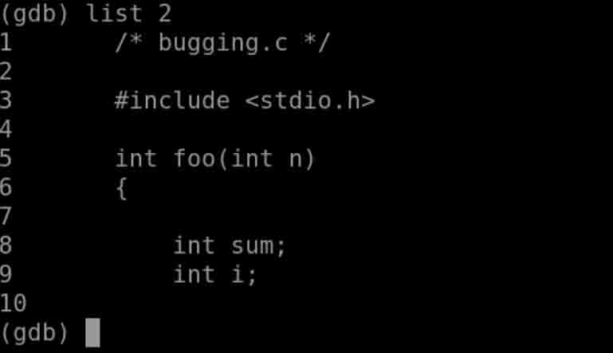

list 文件名 : 行号，显示某一个文件某一行附近的代码，用于多个源文件的情况。

#### 通过函数查看源码

list 函数名，显示某个函数附近的代码：

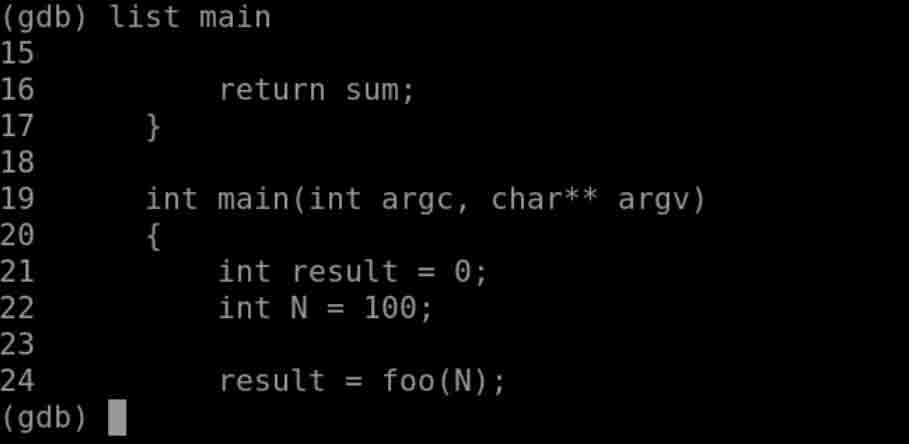

list 文件名 : 函数名，显示某一个文件某个函数附近的代码，用于多个源文件的情况。

### 3.3 设置断点

*break* 命令用来设置断点。

#### 通过行号设置断点

break 行号，断点设置在该行开始处，**注意：该行代码未被执行**：

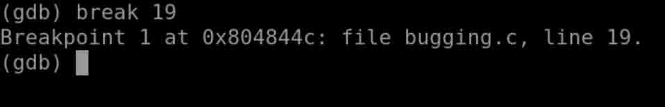

break 文件名 : 行号，适用于有多个源文件的情况。

#### 通过函数设置断点

break 函数名，断点设置在该函数的开始处，**断点所在行未被执行**：

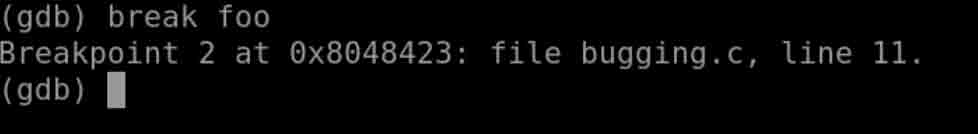

break 文件名 : 函数名，适用于有多个源文件的情况。

### 3.4 查看断点信息

*info breakpoints* 命令用于显示当前断点信息。

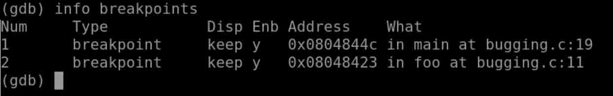

其中每一项的信息：

*   Num 列代表断点编号，该编号可以作为 delete/enalbe/disable 等控制断点命令的参数
*   Type 列代表断点类型，一般为 breakpoint
*   Disp 列代表断点被命中后，该断点保留(keep)、删除(del)还是关闭(dis)
*   Enb 列代表该断点是 enable(y) 还是 disable(n)
*   Address 列代表该断点处虚拟内存的地址
*   What 列代表该断点在源文件中的信息

### 3.5 删除断点

*delete* 命令用于删除断点。

#### 删除指定断点

delete Num，删除指定断点，断点编号可通过 info breakpoints 获得：


#### 删除所有断点

delete，不带任何参数，默认删除所有断点。

### 3.6 关闭和启用断点

*disable* 命令用于关闭断点，有些断点可能暂时不需要但又不想删除，便可以 disable 该断点。

*enable* 命令用于启用断点。

#### 关闭所有断点

disable，不带任何参数，默认关闭所有断点。

#### 关闭指定断点

disable Num，关闭指定断点，断点编号可通过 info breakpoints 获得：

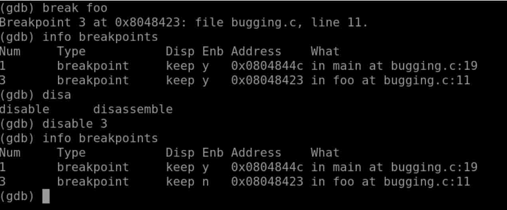

#### 启用所有断点

enable，不带任何参数，默认启用所有断点。

#### 启用指定断点

enable Num，启用指定断点，断点编号可通过 info breakpoints 获得。

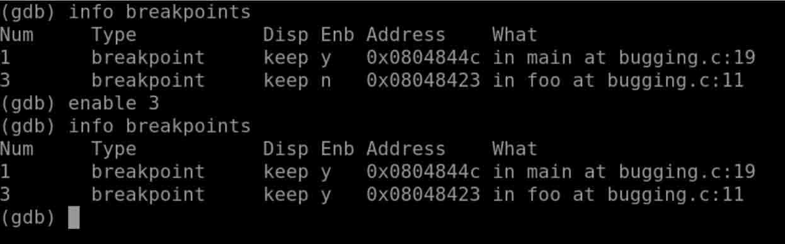

**disable 和 enable 命令影响的是 info breakpoints 的 Enb 列，表示该断点是启用还是关闭**

### 3.7 断点启用的更多方式

*enable* 命令还可以用来设置断点被执行的次数，比如当断点设在循环中的时候，某断点可能多次被命中。

#### 断点 hit 一次之后关闭该断点

```cpp
enable once Num 
```

#### 断点 hit 一次之后删除该断点

```cpp
enable delete Num 
```

实验中我们可以如下图测试该功能：

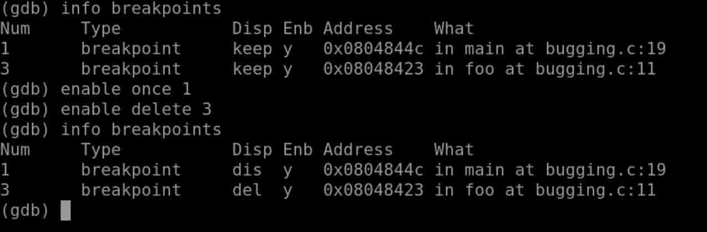

**这两个命令影响的是 info breakpoints 的 Disp 列，表示该断点被命中之后的行为**

### 3.8 断点小结

断点是调试最基本的方法之一，这一节主要介绍了断点相关的知识。主要是几个断点相关的命令。

*   `list`
*   `info breakpoints`
*   `break`
*   `delete`
*   `disable` 和 `enable`
*   `enable once` 和 `enable delete`

不熟悉命令的时候，记得在 gdb 命令行下键入 `help info breakpoints` 等命令，查询帮助文档。

## 四、GDB 单步调试

### 4.1 断点设置

本节将继续使用 bugging 程序，首先确认之前有执行过以下命令：

*   构建 bugging 可执行程序

```cpp
gcc -g -o bugging bugging.c -m32 
```

*   设置断点

在 main 函数处设置了一个断点，用于进行后续的单步调试。

```cpp
gdb bugging
(gdb) break main
(gdb) info breakpoints 
```

### 4.2 打印变量

调试的过程中需要观察变量或者表达式的值，所以先介绍两个基本的显示变量值的命令：

*   *info locals*

    打印当前断点处所在函数的所有局部变量的值，不包括函数参数。

*   *print 变量或表达式*

    打印表达式的值，可显示当前函数的变量的值、全局变量的值等

    `print/FMT` 可以控制打印的格式，常见的有 x(十六进制)、t(二进制)、c(显示为字符)等。

### 4.3 启动程序

*run* 命令用于启动待调试程序，并运行到断点处停下。

*   run

    不带任何参数，启动待调试程序，不传递参数。

*   run 参数

    有些程序需要跟参数，直接带上参数列表即可，会传递给 main 函数的 argc、argv 变量。

### 4.4 单步命令

*next, step, finish, continue, until* 用于控制整个调试过程中，程序执行的流程。

*   next

    *   next 单步执行，函数调用当做一条指令，不会进入被调用函数内部
    *   next N，表示单步执行 N 次
*   step

    *   step 单步执行，会进入到函数调用内部
    *   step N，表示单步执行 N 次
*   finish

    执行程序到当前函数结束

*   continue

    执行程序到下个断点

*   until

    until N，执行程序到源代码的某一行

下图是 windows 下图形 IDE c-free 的调试菜单，在 Linux 上 gdb 命令虽然没有图形化的显示，但如果理解了 gdb 的单步调试，这些选项应该可以很容易理解和使用：

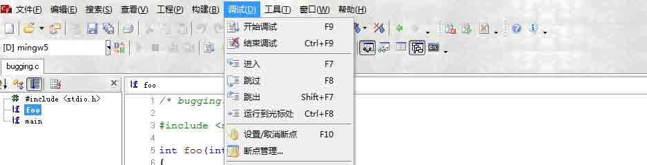

### 4.5 bugging 程序调试

#### bugging 程序简介

*   bugging 示例程序是用来计算 1+2+3+...+100 的值的，预期结果为高斯数 5050
*   程序运行的结果和我们预期的不一致，仅仅从代码不易看出 bug 所在
*   接下来使用 gdb 单步调试该程序，找到 bug 所在

#### 调试 bugging

*   `info breakpoints`

    

    在 main 处设置了一个断点，位于源文件 bugging.c 的 21 行

*   `run`

    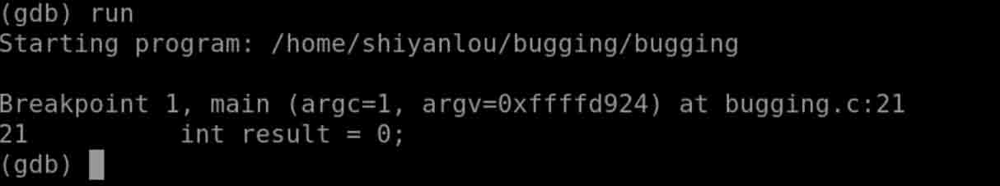

    启动 bugging 程序，停在断点处，位 main 函数的第一条指令处

*   `next`

    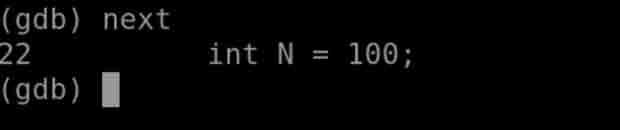

    单步执行，相当于执行了 result 变量的初始化

*   `next`

    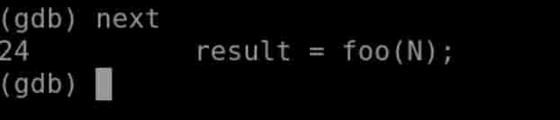

    单步执行，相当于执行了 N 变量的初始化

*   `step`

    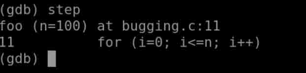

    单步进入，进入 foo 函数，停在 foo 函数的第一条指令处

*   `list`

    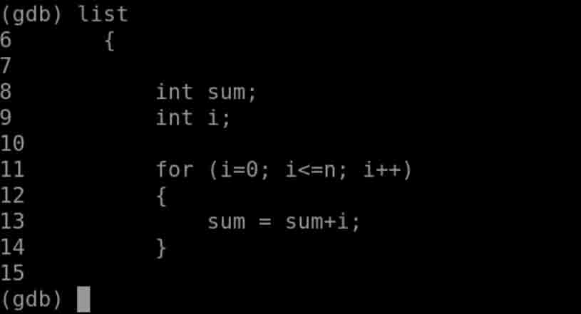

    查看下 foo 函数的源码

*   `info locals`

    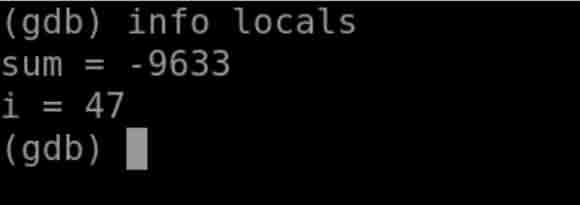

    打印下 foo 函数的所有局部变量，可以看到这些值是无规律的，因为没有初始化

*   `next`

    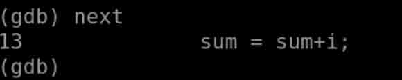

    单步执行，进入循环体

*   `next`

    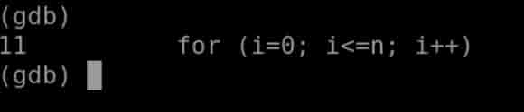

    单步执行，sum = sum + i; 程序继续执行到 for 语句的判断处

*   `info locals`

    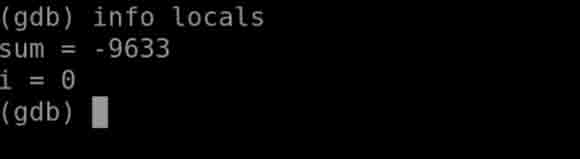

    再次查看变量，i 的值符合预期，sum 的值依然不合理

*   `list foo`

    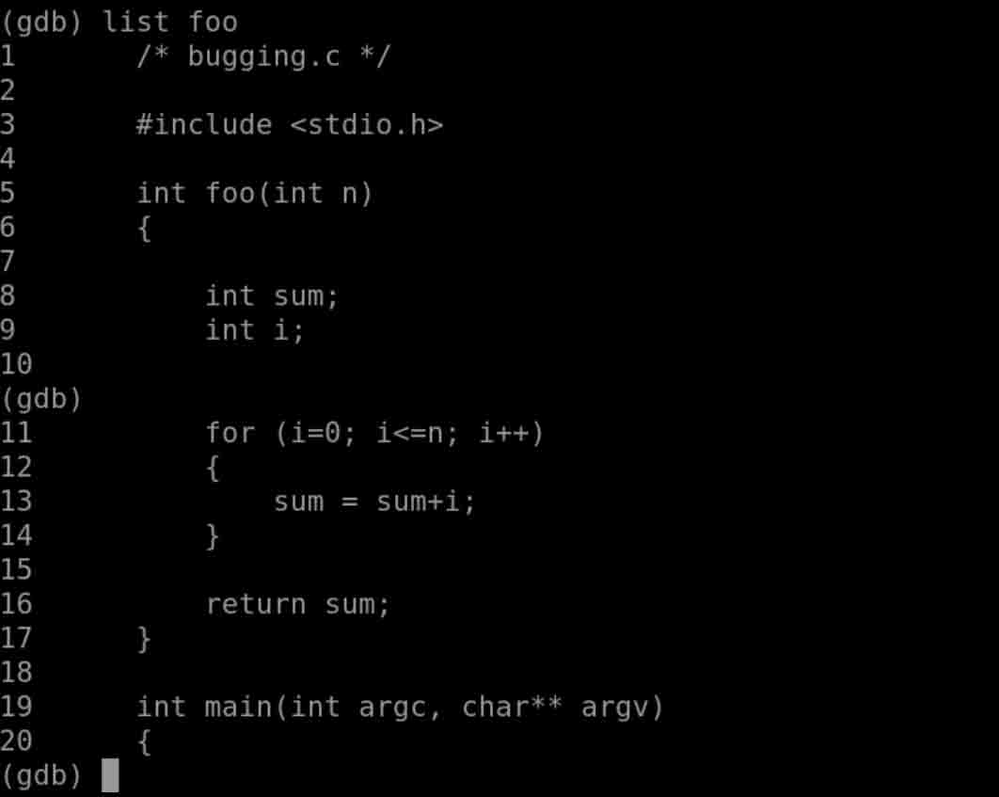

    检查 foo 函数的代码，很容易发现定义了两个变量 sum 和 i，i 在循环体被初始化。而 sum 未被初始化

到这里已经基本定位程序 bug 所在了，sum 的值从进入循环体到执行一次循环结束都不对。bug 根源就是 sum 变量未初始化，导致错误的累加。我们修改 `int sum = 0;` 重新构建程序，便可以得到预期结果。

### 4.6 单步调试小结

这一节主要介绍了单步调试相关的知识。主要是几个单步相关的命令：

*   `list`
*   `print`
*   `info locals`
*   `run`
*   `next`
*   `step`
*   `finish`
*   `continue`
*   `until`

不熟悉命令的时候，记得在 gdb 命令行下键入 `help next` 等命令，查询帮助文档。

## 五、GDB 函数栈

### 5.1 断点设置

本节将继续使用 bugging 程序，首先确认之前有执行过以下命令

*   构建 bugging 可执行程序

```cpp
gcc -g -o bugging bugging.c -m32 
```

*   设置断点

在 main 函数处设置了一个断点，用于进行后续的单步调试。

```cpp
gdb bugging
> (gdb) break foo
> (gdb) info breakpoints 
```

在 foo 函数处设置了一个断点。

### 5.2 函数与函数栈

进程在内存空间会拥有一块叫做 stack 的区域，函数内部的局部变量、函数之间调用时参数的传递和返回值等等都会用到栈这种数据结构。

*   *info proc mappings* 可以查看待调试进程的内存分布情况

    > (gdb) run

    > (gdb) info proc mappings

    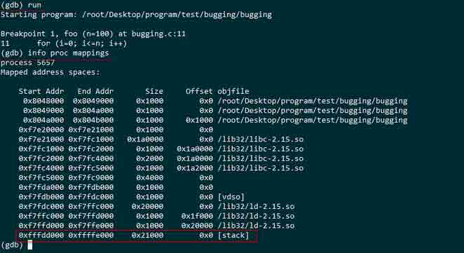

    从进程的地址空间分配情况可以看到，有一块区域 [stack]，这就是该进程的 栈空间

*   *backtrace* 查看函数调用栈的情况

    *   backtrace、where、info stack

        这三个命令都可以查看函数的调用情况

    *   backtrace full、where full、info stack full

        这三个命令查看函数调用情况的同时，打印所有局部变量的值

        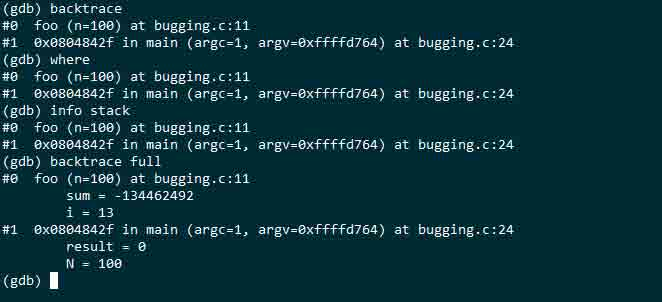

    *   栈帧(stack frame)

        #1 是 main 函数用到的栈空间，这一部分可以称之为 main 函数的 stack frame

        #0 是 foo 函数用到的栈空间，同样可称之为 foo 函数的 stack frame，0 代表当前执行停在 foo 函数内

        可以得到函数调用关系为，main 调用 foo

    *   *info frame Num* 查看某个函数栈帧的详细信息

        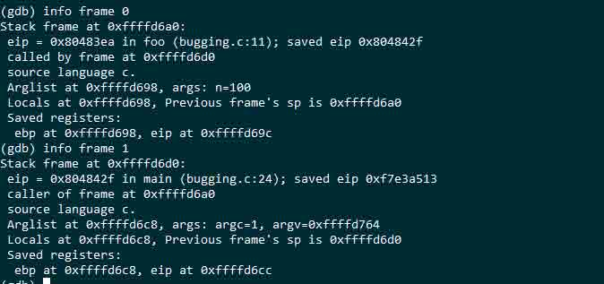

本节并不详细介绍 函数与函数栈的理论知识，但是通过回溯栈，可以调试函数之间的调用关系、局部变量值的变化等。所以还是需要理解一些基本概念，可以看一下这篇文章：

*   [函数调用过程中栈是怎么压入和弹出的？](https://www.zhihu.com/question/22444939)

### 5.3 函数栈小结

这一节主要介绍了函数栈相关的知识。主要是几个栈相关的命令：

*   `backtrace`
*   `backtrace full`
*   `info frame`

不熟悉命令的时候，记得在 gdb 命令行下键入 `help backtrace` 等命令，查询帮助文档。

## 六、总结

本节实验通过对一个实例 `buggging` 程序的调试过程，学习了 gdb 的进入和退出，设置断点，单步调试以及函数栈等调试功能。在下一节中，我们将利用本节的知识完成一个更复杂的链表程序的 BUG 调试和修复。