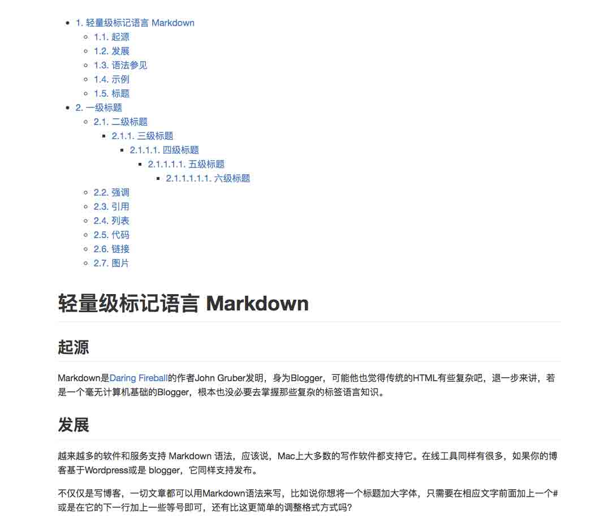

# 第 1 节 C++ 打造 Markdown 解析器

## 一、概述

### 项目介绍

Markdown 已经是程序员的标配，其语法简单的特点让我们能够更加专注于内容输出与写作。 本次项目我们将针对 Markdown 的一些最常用语法，手动实现一个 Markdown 解析器，作为展示，还将为文档生成目录，如图所示：



### 项目涉及的知识点

*   词法分析技术
*   语法树
*   DFS 深度优先搜索
*   C++11
*   使用指针进行字符流处理

### Markdown 常用语法

Markdown 的语法非常简单，下面是一些常用的语法：

```cpp
## 标题

# 一级标题
## 二级标题
### 三级标题

## 强调
- **粗体**
- _ 斜体 _

## 引用
> 引用内容

## 列表
- 列表内容 7
- 列表内容 8
- 列表内容 9
1\. 列表内容 10
2\. 列表内容 11
3\. 列表内容 12

## 代码

代码的插入方式 `printf('\n');` 
```

function method() { alert("javascript"); }

```cpp
## 链接
行内连接 [github](https://github.com/) 的链接

## 图片
 
```

`

可以看到，Markdown 的语法之所以不复杂，是因为它的大部分词法规则都位于行首。这就为我们快速编写一个简单的 Markdown 解析器提供了方便之处。

唯一需要考虑的，就是诸如链接、图片、代码、粗体、斜体等这些特殊的标记。

## 二、测试驱动

为了更加专注于编写 Markdown 解析器本身，我们先部署好相关测测试文件。

首先你可以输入：

```cpp
http://labfile.oss.aliyuncs.com/courses/569/test.md 
```

来获取 Markdown 的测试文件。

其次，为了测试 Markdown 的解析结果，我们很自然的想到把解析结果直接转换到 HTML 进行展示，所以，这里已经为你准备好了好看的 CSS 文件，你可以先下载：

```cpp
wget http://labfile.oss.aliyuncs.com/courses/569/github-markdown.css 
```

为了让我们的代码便于测试，我们先编写好主函数：

```cpp
//
//  main.cpp
//  MarkdownParser
//

#include <fostream>         // std::ofstream
#include "mdtransform.hpp"  // 需要实现的 Markdown 解析类

int main() {
    // 装载构造 Markdown 文件
    MarkdownTransform transformer("test.md");

    // 编写一个 `getTableOfContents()` 方法来获取 Markdown 文件 HTML 格式的目录
    std::string table = transformer.getTableOfContents();

    // 编写一个 `getContents()` 方法来获取 Markdown 转成 HTML 后的内容
    std::string contents = transformer.getContents();

    // 准备要写入的 HTML 文件头尾信息
    std::string head = "<!DOCTYPE html><html><head>\
        <meta charset=\"utf-8\">\
        <title>Markdown</title>\
        <link rel=\"stylesheet\" href=\"github-markdown.css\">\
        </head><body><article class=\"markdown-body\">";
    std::string end = "</article></body></html>";

    // 将结果写入到文件
    std::ofstream out;
    out.open("output/index.html");
    // 将转换后的内容构造到 HTML 的 <article></article> 标签内部
    out << head+table+contents+end;
    out.close();
    return 0;
} 
```

至此，我们的整个项目目录结构树为：

```cpp
MarkdownParser
├── main.cpp
├── output
│   └── github-markdown.css
└── test.md 
```

> 生成这个目录树的工具叫做 `tree`, 如果你感兴趣可以使用 > > `bash > sudo apt-get install tree >` > 来获取这个命令工具，使用方法如图所示： > > 

## 三、`mdtransform` 设计

我们要解析 Markdown 文件，自然就要先在程序中定义好相关的词法信息、语法规则，这样才能后为后续的转换工作提供铺垫。

如果你对编译原理有所了解，就能够立刻明白对 Markdown 的解析，其实就是编译过程中的词法分析和语法分析阶段，而最后的到 HTML 的转换，实际上就是『目标代码的生成』这个阶段。

幸运的是，Markdown 的语法是在是太过于简单，它所支持的这些语法，几乎完全不需要我们对它的语义进行分析，这就省去了语义分析、代码优化等这些阶段。使得整个 Markdown 解析器变得非常的简单。

首先，我们来进行词法分析。我们要规划好需要实现的相关词法，也就是常说的设计关键字 Token。

1.  `#` 就是 Markdown 的标志性关键字，它的个数直接决定了标题的类型，因此，我们可以非常简单的直接将其转换层 `<h>` 类型的 HTML 标签；

2.  正常的段落，没有任何标志性的说明，可以直接用 `<p>` 进行包裹；

3.  `[]()`, `` 这两个语法能够让我们在 Markdown 文件中插入超链接和图片，因此可以分别使用 `<a href=" ">...</a>` 和 ``

4.  两个 ` 可以包裹一个行内的代码，而三个 ` 则可以包裹一块代码段，可以分别使用 `<code>` 和 `<pre><code>` 来进行替换

5.  `>` 这个关键字用来处理引用的内容，可以使用 `<blockquote>` 标签

6.  `-`, `1.` 这些列表形式的关键字，可以使用 `<ul>` 和 `<ol>` 进行包裹，最后将整个内容使用 `<li>` 进行包装。

7.  `_` 和 `*` 这两个关键字分别有进行斜体和加粗强调的作用，在 HTML 中对应 `<em>` 和 `<strong>` 两个标签。

至此，以上七点的分析足以涵盖最常用的 Markdown 语法，我们将对这部分内容进行解析，定义 Token 如下：

```cpp
* 0: null                          |开始
* 1: <p>                           |段落
* 2: <a href=" ">...</a>           |超链接
* 3: <ul>                          |无序列表
* 4: <ol>                          |有序列表
* 5: <li>                          |列表
* 6: <em>                          |斜体
* 7: <strong>                      |加粗
* 8: <hr />                        |水平分割线
* 9: <br />                        |换行
* 10:         |图片
* 11: <blockquote>                 |引用
* 12: <h1>                         |h1
* 13: <h2>                         |h2
* 14: <h3>                         |h3
* 15: <h4>                         |h4
* 16: <h5>                         |h5
* 17: <h6>                         |h6
* 18: <pre><code>                  |代码段
* 19: <code>                       |行内代码 
```

根据前面的测试代码，我们可以将 `MarkdownTransform` 类设计成如下的形式：

```cpp
#ifndef MD2HTML
#define MD2HTML

#include <string>

// 词法关键字枚举
enum{
    maxLength       = 10000,
    nul             = 0,
    paragraph       = 1,
    href            = 2,
    ul              = 3,
    ol              = 4,
    li              = 5,
    em              = 6,
    strong          = 7,
    hr              = 8,
    br              = 9,
    image           = 10,
    quote           = 11,
    h1              = 12,
    h2              = 13,
    h3              = 14,
    h4              = 15,
    h5              = 16,
    h6              = 17,
    blockcode       = 18,
    code            = 19
};
// HTML 前置标签
const std::string frontTag[] = {
    "","<p>","","<ul>","<ol>","<li>","<em>","<strong>",
    "<hr color=#CCCCCC size=1 />","<br />",
    "","<blockquote>",
    "<h1 ","<h2 ","<h3 ","<h4 ","<h5 ","<h6 ", // 右边的尖括号预留给添加其他的标签属性, 如 id
    "<pre><code>","<code>"
};
// HTML 后置标签
const std::string backTag[] = {
    "","</p>","","</ul>","</ol>","</li>","</em>","</strong>",
    "","","","</blockquote>",
    "</h1>","</h2>","</h3>","</h4>","</h5>","</h6>",
    "</code></pre>","</code>"
};

class MarkdownTransform{
private:
    string content, TOC;
public:
    // 构造函数
    MarkdownTransform(const std::string &filename);

    // 获得 Markdown 目录
    std::string getTableOfContents() { return TOC; }
    // 获得 Markdown 内容
    std::string getContents() { return content; }

    // 析构函数
    ~MarkdownTransform();
};
#endif 
```

下一节实验中，我们将实现这个 Markdown 解析器。

## 参考资料

1.  [Markdown 官方语法说明](http://daringfireball.net/projects/markdown/syntax)