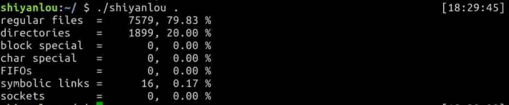

# 第 1 节 C 语言实现文件类型统计程序

## 一、实验简介

本章基于 Linux 的文件和目录接口，本项目围绕文件系统的性质，基于 `lstat` 函数和目录操作，实现一个递归统计文件类型的程序，方便从文件类型的构成深入了解 Linux 的文件文件系统。与此同时，该项目开发的基于 Linux 的文件类型统计程序可以用到实际的学习工作当中。

### 1.1 知识点

*   保存文件类型信息的 `stat` 结构及 `lstat` 函数的使用
*   文件的七种类型及判断文件的类型的函数
*   读目录的相关系统调用，如 `opendir`, `readdir`
*   保存目录项的 `dirent` 结构

### 1.2 效果截图



## 二、实验主要步骤一：设计 `main` 函数

`main` 函数的主要功能首先是接收命令行参数，并检测其合法性。其实调用计算各类文件数目的 `myftw` 的函数。最后计算文件类型的百分比并输出。

*   这部分的完整代码如下：

```cpp
/* nreg：普通文件的数量； ndir：目录文件的数量； nblk：块特殊文件的数量； 
nchr：字符特殊文件的数量； nfifo：管道特殊文件的数量； 
nslink：符号链接文件的数量； nsock：套接字文件数量； ntot：总共文件数量；*/
static long    nreg, ndir, nblk, nchr, nfifo, nslink, nsock, ntot;

int
main(int argc, char *argv[])
{
    int ret;

    //进行输入合法性检测
    if (argc != 2)
    {
        printf("fault command input! \n");
        exit(1);
    }

    /* 计算各类文件的个数 */
    ret = myftw(argv[1], myfunc);       

    /* 计算总的文件数量 */
    ntot = nreg + ndir + nblk + nchr + nfifo + nslink + nsock;

    /* 避免除以 0，提高程序的稳定性 */
    if (ntot == 0)
        ntot = 1;       

    /* 打印各类文件的百分比 */
    printf("regular files  = %7ld, %5.2f %%\n", nreg,
        nreg*100.0 / ntot);
    printf("directories    = %7ld, %5.2f %%\n", ndir,
        ndir*100.0 / ntot);
    printf("block special  = %7ld, %5.2f %%\n", nblk,
        nblk*100.0 / ntot);
    printf("char special   = %7ld, %5.2f %%\n", nchr,
        nchr*100.0 / ntot);
    printf("FIFOs          = %7ld, %5.2f %%\n", nfifo,
        nfifo*100.0 / ntot);
    printf("symbolic links = %7ld, %5.2f %%\n", nslink,
        nslink*100.0 / ntot);
    printf("sockets        = %7ld, %5.2f %%\n", nsock,
        nsock*100.0 / ntot);
    exit(ret);
}
} 
```

## 三、实验主要步骤二：设计 `myftw` 函数

函数用于处理 pathname 并保存在一个全局的字符数组里，并调用 dopath。分配空间的函数是自定义的`path_alloc`, 特别注意 `fullpath` 是一个全局变量，所以可以各个函数可以很方便的使用。然后，调用 dopath 函数来进一步处理路径名(是目录还是非目录)。

*   这部分的代码如下：

```cpp
/*该函数用于处理 pathname 并保存在一个全局的字符数组里，并调用 dopath*/
static int                
myftw(char *pathname, Myfunc *func)
{
    /* 为保存路径的字符串数组分配空间 */
    fullpath = path_alloc(&pathlen);

    /* 如果分配的空间不够保存路径，怎用 realloc 重新分配 */
    if (pathlen <= strlen(pathname)) {
        pathlen = strlen(pathname) * 2;
        if ((fullpath = realloc(fullpath, pathlen)) == NULL);
        printf("realloc failed!\n");
    }

    /*　将路径名参数保存在全路径中，特别注意：全路径 fullpath 是全局变量，
    能够被 dopath 所调用　*/
    strcpy(fullpath, pathname);

    /* 调用 dopath 函数 */
    return(dopath(func));
}
} 
```

## 四、实验主要步骤三：设计 `dopath` 函数

*   `int lstat(const char *path, struct stat *buf)`当文件是一个符号链接时，lstat 返回的是该符号链接本身的信息,而 stat 返回的是该链接指向的文件的信息。这里边用到的一个数据结构是 `stat` 结构，该结构定义如下：

```cpp
struct stat {
dev_t           st_dev;
ino_t           st_ino;
mode_t          st_mode;
nlink_t         st_nlink;
uid_t           st_uid;
gid_t           st_gid;
dev_t           st_rdev;
off_t           st_size;
timestruc_t     st_atim;
timestruc_t     st_mtim;
timestruc_t     st_ctim;
blksize_t       st_blksize;
blkcnt_t        st_blocks;
char            st_fstype[_ST_FSTYPSZ];
}; 
```

*   `DIR* opendir (const char * path )` 作用：打开一个目录，在失败的时候返回一个空的指针。

*   `struct dirent *readdir(DIR *dir)` 函数说明：`readdir()` 返回参数 dir 目录流的下个目录进入点。函数返回值：成功则返回下个目录进入点。有错误发生或读取到目录文件尾则返回 `NULL`。

*   这部分的代码如下：

```cpp
/*
dopath 用于判断是否是目录，然后根据情况选择是直接进入 myfun 函数取计数，还是递归调用
dopath 函数。
 */
static int                
dopath(Myfunc* func)
{
    struct stat statbuf;
    struct dirent *dirp;
    DIR *dp;
    int ret, n;

    /* 调用 lstat 获得路径名的 stat 信息，若不成功，调用 func 函数，并传递 FTW_NS */
    if (lstat(fullpath, &statbuf) < 0)   
        return(func(fullpath, &statbuf, FTW_NS));

    /* 查看文件 stat 结构的 st_mode,若不是目录，调用 func 函数，
    并传递参数 FTW_F，交由 myfun 进一步判断文件类型 */
    if (S_ISDIR(statbuf.st_mode) == 0)  
        return(func(fullpath, &statbuf, FTW_F));

    /* 最后一种情况就是该路径名代表的是一个目录，此处 fun 的正常返回情况是 0，
    所以执行完 func 后还不会返回，会继续递归调用 func */
    if ((ret = func(fullpath, &statbuf, FTW_D)) != 0)
        return(ret);
    /* 路径处理，扩充路径空间长度 */
    n = strlen(fullpath);
    if (n + NAME_MAX + 2 > pathlen) {    
        pathlen *= 2;
        if ((fullpath = realloc(fullpath, pathlen)) == NULL)
            printf("realloc failed!\n");
    }
    fullpath[n++] = '/';
    fullpath[n] = 0;

    /* 处理目录每个表项 */
    if ((dp = opendir(fullpath)) == NULL)   
        return(func(fullpath, &statbuf, FTW_DNR));
    while ((dirp = readdir(dp)) != NULL) {
        if (strcmp(dirp->d_name, ".") == 0  ||
            strcmp(dirp->d_name, "..") == 0)
                continue;       /* 忽略当前目录(.)和上一级目录(..)，以避免死循环 */
        strcpy(&fullpath[n], dirp->d_name);  /* 在 "/"之后加上当前目录项的名字 */
        if ((ret = dopath(func)) != 0)      /* 然后采用新的路径名递归地调用 dopath */
            break;  
    }
    fullpath[n-1] = 0;  

    /* 关闭目录 */
    if (closedir(dp) < 0)
        printf("can't close directory %s", fullpath);
    return(ret);
} 
```

## 四、实验主要步骤三：设计 `myfunc` 函数

`myfunc` 函数主要实现的功能就是根据 `stat` 判断文件类型，并且计数。

*   `S_IFMT` 是用于解释 st_mode 标志的掩码。

*   一些用于帮助确定文件类型的宏定义，这些是带有参数的宏，类似与函数的使用方法：
    `S_ISBLK`：测试是否是特殊的块设备文件
    `S_ISCHR`：测试是否是特殊的字符设备文件
    `S_ISDIR`：测试是否是目录
    `S_ISFIFO`：测试是否是 FIFO 设备
    `S_ISREG`：测试是否是普通文件
    `S_ISLNK`：测试是否是符号链接
    `S_ISSOCK`：测试是否是 socket

*   这部分的完整代码如下：

```cpp
/* 通过 stat 结构的 st_mode 字段来判断文件的类型，并计数 */
static int
myfunc(const char *pathname, const struct stat *statptr, int type)
{
    switch (type) {

    /* 对于非目录文件情况的处理 */
    case FTW_F:
        switch (statptr->st_mode & S_IFMT) {
        case S_IFREG:   nreg++;     break;
        case S_IFBLK:   nblk++;     break;
        case S_IFCHR:   nchr++;     break;
        case S_IFIFO:   nfifo++;    break;
        case S_IFLNK:   nslink++;   break;
        case S_IFSOCK:  nsock++;    break;
        case S_IFDIR:   
            printf("for S_IFDIR for %s", pathname);
        }
        break;

    /* 对于目录文件的处理 */
    case FTW_D:
        ndir++;
        break;

    /* 对于不可都目录的处理 */
    case FTW_DNR:
        printf("%s 目录不可读", pathname);
        break;
    case FTW_NS:
        printf("%s stat 出错", pathname);
        break;
    default:
        printf("%d 类型不可识别，路径名师 %s", type, pathname);
    }
    return(0);
} 
```

## 五、编译并测试

### 5.1 编译


### 5.2 运行


*   实验结果表明当前实验楼环境下的当前目录下，普通文件有 79.83%，目录 20.00%， 符号链接 0.17%。
*   如果需要统计系统目录下的权限，那么可以在命令执行之前使用 sudo, 如 `sudo ./shiyanlou /home`，即便如此，也有些文档没权限统计。

## 六、实验总结

通过该项目的训练，可以提高对 Linux 文件系统的进一步认识。学会读目录操作，并且深入了解存储文件的信息的 `stat` 结构。完成本实验，可以开发出一个实用的 Linux 小工具。

*   本项目的完整代码如下：

```cpp
#include <dirent.h>
#include <limits.h>
#include <sys/stat.h>
#include <stdio.h>
#include <unistd.h>
#include <stdlib.h>
#include <string.h>

/* 标记非目录文件 */
#define    FTW_F   1   

/* 标记目录文件 */
#define    FTW_D   2   

/* 标记不可读目录 */
#define    FTW_DNR 3

/* 标记不可获得 stat 的文件 */
#define    FTW_NS  4       

/* 用来保存文件的全路径 */
static char    *fullpath;  

/* 用来保存文件的路径长度 */
static size_t pathlen;

/* 定义处理文件的函数 */
typedef    int Myfunc(const char *, const struct stat *, int);
static Myfunc myfunc;
static int myftw(char *, Myfunc *);
static int dopath(Myfunc *);
char *path_alloc(size_t *size);

/* nreg：普通文件的数量； ndir：目录文件的数量； nblk：块特殊文件的数量； 
nchr：字符特殊文件的数量； nfifo：管道特殊文件的数量； 
nslink：符号链接文件的数量； nsock：套接字文件数量； ntot：总共文件数量；*/
static long    nreg, ndir, nblk, nchr, nfifo, nslink, nsock, ntot;

int
main(int argc, char *argv[])
{
    int ret;

    //进行输入合法性检测
    if (argc != 2)
    {
        printf("fault command input! \n");
        exit(1);
    }

    /* 计算各类文件的个数 */
    ret = myftw(argv[1], myfunc);       

    /* 计算总的文件数量 */
    ntot = nreg + ndir + nblk + nchr + nfifo + nslink + nsock;

    /* 避免除以 0，提高程序的稳定性 */
    if (ntot == 0)
        ntot = 1;       

    /* 打印各类文件的百分比 */
    printf("regular files  = %7ld, %5.2f %%\n", nreg,
        nreg*100.0 / ntot);
    printf("directories    = %7ld, %5.2f %%\n", ndir,
        ndir*100.0 / ntot);
    printf("block special  = %7ld, %5.2f %%\n", nblk,
        nblk*100.0 / ntot);
    printf("char special   = %7ld, %5.2f %%\n", nchr,
        nchr*100.0 / ntot);
    printf("FIFOs          = %7ld, %5.2f %%\n", nfifo,
        nfifo*100.0 / ntot);
    printf("symbolic links = %7ld, %5.2f %%\n", nslink,
        nslink*100.0 / ntot);
    printf("sockets        = %7ld, %5.2f %%\n", nsock,
        nsock*100.0 / ntot);
    exit(ret);
}

/*该函数用于处理 pathname 并保存在一个全局的字符数组里，并调用 dopath*/
static int                
myftw(char *pathname, Myfunc *func)
{
    /* 为保存路径的字符串数组分配空间 */
    fullpath = path_alloc(&pathlen);

    /* 如果分配的空间不够保存路径，怎用 realloc 重新分配 */
    if (pathlen <= strlen(pathname)) {
        pathlen = strlen(pathname) * 2;
        if ((fullpath = realloc(fullpath, pathlen)) == NULL);
        printf("realloc failed!\n");
    }

    /*　将路径名参数保存在全路径中，特别注意：全路径 fullpath 是全局变量，
    能够被 dopath 所调用　*/
    strcpy(fullpath, pathname);

    /* 调用 dopath 函数 */
    return(dopath(func));
}

/*
dopath 用于判断是否是目录，然后根据情况选择是直接进入 myfun 函数取计数，还是递归调用
dopath 函数。
 */
static int                    
dopath(Myfunc* func)
{
    struct stat statbuf;
    struct dirent *dirp;
    DIR *dp;
    int ret, n;

    /* 调用 lstat 获得路径名的 stat 信息，若不成功，调用 func 函数，并传递 FTW_NS */
    if (lstat(fullpath, &statbuf) < 0)   
        return(func(fullpath, &statbuf, FTW_NS));

    /* 查看文件 stat 结构的 st_mode,若不是目录，调用 func 函数，
    并传递参数 FTW_F，交由 myfun 进一步判断文件类型 */
    if (S_ISDIR(statbuf.st_mode) == 0)  
        return(func(fullpath, &statbuf, FTW_F));

    /* 最后一种情况就是该路径名代表的是一个目录，此处 fun 的正常返回情况是 0，
    所以执行完 func 后还不会返回，会继续递归调用 func */
    if ((ret = func(fullpath, &statbuf, FTW_D)) != 0)
        return(ret);
    /* 路径处理，扩充路径空间长度 */
    n = strlen(fullpath);
    if (n + NAME_MAX + 2 > pathlen) {    
        pathlen *= 2;
        if ((fullpath = realloc(fullpath, pathlen)) == NULL)
            printf("realloc failed!\n");
    }
    fullpath[n++] = '/';
    fullpath[n] = 0;

    /* 处理目录每个表项 */
    if ((dp = opendir(fullpath)) == NULL)   
        return(func(fullpath, &statbuf, FTW_DNR));
    while ((dirp = readdir(dp)) != NULL) {
        if (strcmp(dirp->d_name, ".") == 0  ||
            strcmp(dirp->d_name, "..") == 0)
                continue;       /* 忽略当前目录(.)和上一级目录(..)，以避免死循环 */
        strcpy(&fullpath[n], dirp->d_name);  /* 在 "/"之后加上当前目录项的名字 */
        if ((ret = dopath(func)) != 0)      /* 然后采用新的路径名递归地调用 dopath */
            break;  
    }
    fullpath[n-1] = 0;  

    /* 关闭目录 */
    if (closedir(dp) < 0)
        printf("can't close directory %s", fullpath);
    return(ret);
}

/* 通过 stat 结构的 st_mode 字段来判断文件的类型，并计数 */
static int
myfunc(const char *pathname, const struct stat *statptr, int type)
{
    switch (type) {

    /* 对于非目录文件情况的处理 */
    case FTW_F:
        switch (statptr->st_mode & S_IFMT) {
        case S_IFREG:   nreg++;     break;
        case S_IFBLK:   nblk++;     break;
        case S_IFCHR:   nchr++;     break;
        case S_IFIFO:   nfifo++;    break;
        case S_IFLNK:   nslink++;   break;
        case S_IFSOCK:  nsock++;    break;
        case S_IFDIR:   
            printf("for S_IFDIR for %s", pathname);
        }
        break;

    /* 对于目录文件的处理 */
    case FTW_D:
        ndir++;
        break;

    /* 对于不可都目录的处理 */
    case FTW_DNR:
        printf("%s 目录不可读", pathname);
        break;
    case FTW_NS:
        printf("%s stat 出错", pathname);
        break;
    default:
        printf("%d 类型不可识别，路径名师 %s", type, pathname);
    }
    return(0);
}

/* 路径数组分配 */
char *path_alloc(size_t* size)
{
    char *p = NULL;
    if (!size) 
        return NULL;
    p = malloc(256);
    if (p)
        *size = 256;
    else
        *size = 0;
    return p;
} 
```

## 参考资料

*   [《UNIX 环境高级编程》](https://book.douban.com/subject/1788421/)