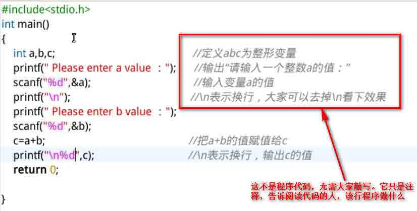
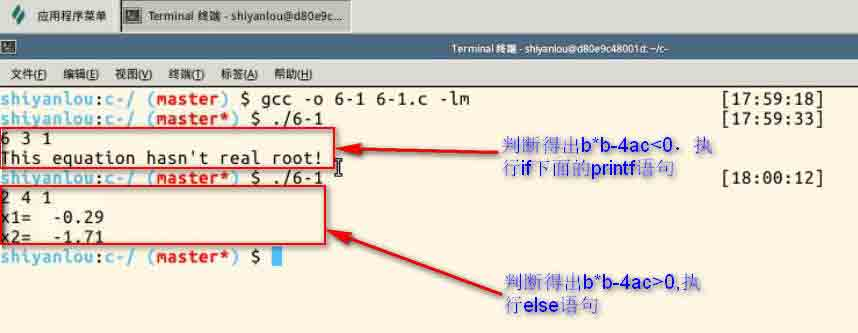
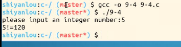
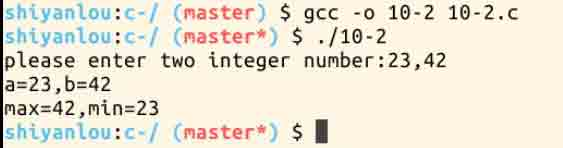

# C 语言入门教程

你想加入“实验楼”施工队的行列吗？你想从“菜鸟”升级为“程序猿”吗？那就加入我们，和我们一起踏上 C 语言之旅吧。

## 一、实验说明

### 1\. 环境登录

无需密码自动登录，系统用户名 shiyanlou

### 2\. 环境介绍

本实验环境采用 Ubuntu Linux 桌面环境，实验中会用到桌面上的程序：

1.命令行终端: Linux 命令行终端，打开后会进入 Bash 环境，可以使用 Linux 命令

2.Firefox 及 Opera：浏览器，可以用在需要前端界面的课程里，只需要打开环境里写的 HTML/JS 页面即可

3.gvim：非常好用的 Vim 编辑器，最简单的用法可以参考课程[Vim 编辑器](http://www.shiyanlou.com/courses/2)

4.gedit 及 Brackets：如果您对 gvim 的使用不熟悉，可以用这两个作为代码编辑器，其中 Brackets 非常适用于前端代码开发

### 3\. 环境使用

使用编辑器输入实验所需的代码及文件，使用命令行终端运行所需命令进行操作。

“实验记录”页面可以在“我的主页”中查看，每次实验的截图及笔记，以及有效学习时间（指的是在实验桌面内操作的时间，如果没有操作，系统会记录为发呆时间）。这些都是您在实验楼学习的真实性证明。

### 4.预备知识

本课程可以零基础进行学习，如果你学过《linux》和《大学生计算机》等相关课程，将有助于深入了解本课程的部分内容，但这些课程的学习不是必须的。

### 代码下载

```cpp
git clone http://git.shiyanlou.com/shiyanlou/c 
```

## 二、为什么是 c—因为你无可替代

### 1.c 语言的前世今生

1972-1973 年间，美国[贝尔实验室](http://baike.baidu.com/view/37115.htm?fr=aladdin)为了描述和实现 UNIX 操作系统（一个具有强大影响力的操作系统，我们实验楼的实验环境 linux 系统就是一种类 unix 系统）于是就改良了 B 语言，这就是今天的大名鼎鼎的 C 语言。 c 语言相当灵活，用于执行计算机几乎可以完成的所有任务，既可以用于编写应用程序，还可用于编写操作系统，伟大的 Windows 和 Linux 操作系统的内核就是使用 C 语言开发。c 语言包含了基本的编程元素，后来的很多语言（C++、Java 等）都参考了 C 语言，说 C 语言是现代编程语言的开山鼻祖毫不夸张，它改变了编程世界。

**下面这张图是 14 年 10 月份 tiobe 根据编程语言在企业中的使用情况统计出来的编程语言排行榜，程序猿们可以了解自我的编程技能价值，以便跟上编程潮流。这一排行榜亦可以作为初学者们对未来发展方向选择的参考依据。该数据每月都会更新，有兴趣的小伙伴可以去官网 http://www.tiobe.com/index.php/content/paperinfo/tpci/index.html 查看最新。**


**通过该图大家可以看到 17.8%程序是使用 c 语言写的，虽然 c 语言是 70 后的老人，但他依然牢牢地占据在排行榜首位。**

### 2.无可替代的 c 语言


这张图同样来自 tiobe，通过这张图大家可以发现从 2002 今，c 语言在编程中占有比例一直保持稳定，java 语言却呈现下跌态势，两者还会经常争夺霸主地位。 **但是为什么 java 所占比例一直在下跌，而 c 语言保持稳定呢？主要是因为能够代替 java 的语言不断涌现和上升，而 c 语言能保持稳定，是因为在很多领域 c 语言是唯一的选择，比如说做操作系统，做嵌入式系统。**

美国一位资深软件专家写了一篇文章，题为“对计算机学生的建议”，可供参考。他说“大学生毕业前要学好 c 语言，c 语言是当前程序员共同的语言。它是程序员互相沟通，比你大学学到的现代语言（比如 ML，java，python 或者其他流行的语言）都更接近机器”。他指出“不管你懂多少延续、闭包、异常处理，只要你不能解释为什么 while（*s++=*t++）的作用是复制字符串，那你就是盲目无知的情况下编程，就像一个医生不懂最基本的解剖学就在开处方”

## 三、如何学习 c 语言

### 1.勤动手

c 语言并不是一门纯理论课程，而是一门应用课程。学习过程中要通过大量的例题学习怎么设计一个算法，构造一个程序。初学时一定不要在语法细节上死记硬背，从一开始就应该编写简单程序，然逐步深入。语法细节需要通过长期的编程实践才能熟练掌握。 我们所给的所有习题，即使他们非常简单，也要自己动手输入。自己亲自输入，以后就不容易忘记。不要害怕用代码进行实验。犯错对编程而言非常有教育性！！早起犯错越多，学到的东西就越多。

### 2.勤思考

学习程序设计，主要是掌握程序设计的思路和方法。学会使用一种计算机语言编程，在需要改用另一种语言应当不会太难。不要设想今后一辈子只使用大学学过的某一种语言。在学习时要善于思考，举一反三，完成一个程序需要什么样的算法，怎么去设计，都自己学会独立思考。

### 3.勤查找

很多同学在学习过程中稍微遇到点困难就想要放弃，遇到一点内容没有懂就不往下学习了，常常半途而废。在学习过程中我们难免遇到各种困难，遇到各种难懂的词汇，遇到一种半天解不出来的题目。当自己实在不明白的概念，可以放一放往前走。如果这些概念或者题目很重要，不懂没办法往前走，那就好好利用下百度吧。一个勤奋的少年，即使只给他一个 google 或者百度，他也能学好一门语言。一个不上进的屌丝你给他买好 10 本 c 语言的书，找个骨灰级的程序猿带他，他也学不会 c 语言编程。

## 四、第一个 c 语言程序-Hello ShiYanLou

在我们文档右边的实验楼虚拟化操作系统中，打开桌面的 Xfce 终端，输入`cd Desktop`**（cd 命令是切换目录命令，`cd Desktop`表示切换目录至桌面，如果你懂这些内容当然很好，想要学习 linux 基本命令可以学习实验楼的“linux 入门”的这门课程，即使不懂也没关系，按照我说的做就可以了）**切换至桌面，紧接着输入`touch 1-1.c`，你便可以看到在桌面建立了一个 1-1.c 的文件。 

**接下来我们输入`gedit 1-1.c`，系统便用 gedit 编辑器将 1-1.c 文件打开了。** 

**在 gedit 里面输入以下代码，不懂不要紧，以后我们将会给大家详细的讲述**

```cpp
#include<stdio.h>                
int main()
{
    printf("Hello ShiYanLou");
    return 0；

} 
```


**点击 save 保存，接下来就是见证我们编写程序运行的结果了，有木有很激动！ 在终端输入`gcc -o 1-1 1-1.c`后，点击回车，这是桌面上便生成了一个 1-1 的可执行文件，紧接着我们在终端输入`./1-1`来执行这个可执行文件。你的屏幕上面是不是显示出了 Hello ShiYanLou，小伙伴你表现不错，这时你已经编写一个程序并让其运行了**

### 注意：当你写完代码保存之后务必关掉 gedit 编辑器，否则无法在终端输入命令。


## 五、小结

本节课我们只讲述了 c 语言的前世今生和它经久不衰生命力，接下来我们将要正式走入 c 编程了。是不是想了解一下我们刚才编写的第一个 c 语言程序究竟是怎么执行的呢，接下来的课程将讲解我们编写 c 语言的开发环境以及对第一个 c 语言的剖析

## 一、c 语言开发环境

### 1.在 linux 下运行 c 程序

市面上常见的 Linux 都是发行版本，典型的 Linux 发行版包含了 Linux 内核、桌面环境和各种常用的必备工具，国内使用较多的是 Ubuntu（乌班图）、CentOS、Deepin（深度 Linux）。我们实验楼的环境采用的是 Ubuntu 的操作系统。

#### Gedit

Gedit 是一个简单实用的文本编辑器，拥有漂亮的界面，支持语法高亮，比 Vim 更易上手。本教程将 Gedit 作为 C 代码编辑器，当然如果你懂得使用 gvim 等其他编辑器，你也可以使用。 在上一节课我们已经使用了 gedit 编写代码了，相信大家并不陌生。 

#### GCC

Linux 下使用最广泛的 C/C++编译器是 GCC，大多数的 Linux 发行版本都默认安装，不管是开发人员还是初学者，一般都将 GCC 作为 Linux 下首选的编译工具。本教程毫不犹豫地使用 GCC 来编译 C 程序。 **编译概念不懂也不要紧，我们马上就会讲述**

程序编写完成后保存文件并退出，打开终端并 cd 到当前目录，上一节我们写第一个 c 语言程序时在终端输入下面的命令，便调用了 gcc 编译器：

```cpp
gcc -o 1-1 1-1.c 
```

就可以直接将 1-1.C 文件编译链接为可执行文件 1-1。

可以看到在当前目录下多出一个文件 1-1，这就是可执行文件。不像 Windows，Linux 不以文件后缀来区分可执行文件，Linux 下的可执行文件后缀理论上是可以任意更改的。


### 2.在 windows 下运行 c 语言程序

Windows 下的 c 编程工具常常使用 VC 6.0 或者 Dev C++ 5.7.1，vc6.0 是一个集成开发环境（IDE），简单来讲就是编程、编译、链接和执行集成在了一个软件上面。在我们实验楼暂且不需要你去学习在 windows 下的 c 编程，当然，如果你想要了解如何在 windows 下编程 c 语言，可以查看该教程[vc6.0 使用教程](http://jingyan.baidu.com/article/f0e83a25c24f8a22e591019f.html),网上也有非常多的其他相关教程可以供你学习参考。

## 二、剖析第一个 c 语言

**接下来我们将以我们上节课编写的 1-1 的 c 程序讲解 c 程序的创建过程以及 c 语言程序结构的简单介绍**

### 1.创建 c 程序

c 程序的创建过程有四个基本步骤或过程： 1.编辑 2.编译 3.链接 4.执行

#### 编辑

编辑的过程就是创建和修改 c 程序的源代码——我们使用 gedit 的编写的程序便是源代码。其实在 linux 上，最常用的文本编辑器是 vim 编辑器，为了让大家更便捷的理解 c 语言我们采用了 gedit 编辑器，有兴趣的小伙伴可以在我们实验楼学习一下 vim 编辑器。

#### 编译

编译器可以将源代码转换成机器语言，在编译过程中，会找出并报告错误。这个阶段的输入是在编辑期间产生的文件，常称为源文件。 编译器能找出程序中很多无效和无法识别的错误，以及结构错误，例如程序的某个部分永远不会执行。编译器输出的结构成为对象代码，存放他们的文件成为对象文件。在 linux 中这些文件的扩展名通常是.o，在 windows 下面这些文件的扩展名通常是.obj。如果编译成功就会生成一个文件，它与源文件同名。但扩展名为.o 或者.obj。 *注：其实我们在上一节编写第一个 c 语言程序的时候，使用 `gcc -o 1-1 1-1.c`这条命令既包含了编译也包含了链接，所以直接生成了可执行文件 1-1。* 在 linux 下的编译命令是在源代码文件所在目录输入一下命令（假如源代码文件是上节课的 1-1.c）

```cpp
gcc -c 1-1.c 
```

这时所在目录将会生成 1-1.o 的文件

#### 链接

链接器将源代码文件中由编译器产生的各种对象模块组合起来，再从 c 语言提供的程序库中添加必要的代码模块，将他们组合成一个可执行文件。链接器也可以检测和报告错误，例如程序中引用了一根本不存在的库组件。 链接一旦成功，就会生成可执行文件，在 windows 下面可执行文件的扩展名是.exe，在 linux 下面，可执行文件没有扩展名，但它是可执行的文件类型。 在编译生成的.o 文件的基础上我们将会输入一下命令链接（以编译生成 1-1.o 为例）

```cpp
gcc -o 1-1 1-1.o 
```

这时 1-1.o 所在的目录将会生成 1-1 可执行文件 **注：多数情况下，我们是通过`gcc -o 1-1 1-1.c`一次性完成编译和链接**

#### 执行

执行阶段就是成功完成了前述的三个过程后，运行程序。但是这个阶段可能会出现各种错误，包括输出错误，计算机什么也不做哦，甚至是计算机崩溃。无论如何，都需要我们返回编辑阶段，检查并修改源代码。 相信大家都还记得上一节课的执行命令，在文件所在目录执行

```cpp
./1-1 
```

**创建 c 程序的各个过程** 

### 2.c 语言的简单结构

#### 预处理指令

1-1 的第一行代码如下

```cpp
#include<stdio.h> 
```

严格的说，它不是可执行程序的一部分，但他很重要，事实上程序没有他是不执行的。符号#表示这是一个预处理指令，告诉编译器在编译源代码之前，要先执行一些操作。编译器在编译过程开始之前的预处理阶段处理这些指令。预处理指令相当多，大多放于程序源文件的开头。

在这个例子中，编译器要将 stdio.h 文件的内容包含进来，这个文件成为头文件，因为通常放在程序的开头处。在本例中，头文件定义了 c 标准库中一些函数的信息，本例要用到标准库中的 printf（）函数，所以必须包含 stdio.h 头文件。stdio 是“standard input&output”的缩写，包含了编译器理解 printf（）以及其他输入/输出函数所需要的信息。c 语言所有头文件的扩展名都是.h。在以后的学习过程中大家会看到很多其他的预处理指令。

#### main（）函数

```cpp
int main()
{
    printf("Hello ShiYanLou");
    return 0;
} 
```

main（）函数是“主函数”。每个 c 程序都由一个或多个函数组成，但每个 c 程序都必须有一个 main（）函数——因为每个程序总是从这个函数开始执行。

程序的几乎全部工作都是由各个函数分别完成的，函数是 c 程序的基本单位，在设计良好的程序中，每个函数都用来实现一个或几个特定的功能。

一个 c 语言程序是有一个或者多个函数组成的，其中必须包含一个 main 函数（且只能有一个 main 函数）。 一个函数包括两个部分 **函数首部** 即函数的第一行

```cpp
int main() 
```

**函数体** 即函数首部下面的花括号内的部分。

```cpp
{

} 
```

函数的内容我们会在以后的课程中涉及，这里只是简单的提及。

*程序框架*

```cpp
#include<stdio.h>
{
    XXXX
    return 0;
} 
```

我们课程的所有程序都需要写上写一段，直到学习函数之前，我们的代码都是放在“xxxx”的位置，所以以后你每次写程序的时候，可以先把这个框架写上去，之后在这个框架中间写代码。

#### printf 函数

printf 是 c 编译系统提供的函数库中的输出函数。printf 函数中双撇号内的字符串“Hello ShiYanLou”按照原样输出，每个语句最后都有一个分号，表示语句结束。

## 三、小结

到了这里，大家可能遇到很多不懂的地方，不要担心是自己的智商或者是实验楼的课程太烂（当然，如果课程有问题或者不懂的地方，问答放开了提出来），我们会在以后的课程中通过编程练习，让大家懂 c 爱上 c！

## 四、练习

### 1.

我们现在的练习还没有涉及到算法，很简单，大家在我们环境中编写一个 c 语言小程序，实现输出“I love shiyanlou”就好。

### 2.

编写以下程序，输出运行结果：

```cpp
#include<stdio.h>
int main（）
{
   printf("23+56=%d\n",23+56);
    return 0;
} 
```

**d%说明后面有一个整数要输出在这个位置上面**

## 一、学习目标

有了前面对 c 语言的初步了解，我们现在开始由浅入深的学习 c 语言程序设计了。 从本章开始我们将要引入大量的 c 语言程序案例，把算法和语法结合起来，通过引导大家由浅入深的编写 c 程序，让大家掌握 c 语言。也希望大家在学习的过程中，勤动手，把我们每一个案例都自己来写一遍。 我们接下来将讲述 c 语言的顺序程序设计，由于 c 语言的顺序程序设计并不容易独立成章，也需要大家具有数据类型和表达式等知识的相关基础，所以我们将顺序程序设计这一大的章节分为以下几个小节同时融入顺序程序设计的相关例题在接下几节课中去讲述这些内容：

*   数据类型
*   运算符与表达式
*   c 语句 +数据的输入与输出

## 二、顺序程序设计举例

首先我们先举一个例子 3-1，用`touch 3-1.c`建立一个 c 的源程序文件，自己用 gedit 编写以下代码，编译并运行： 

如果大家把该程序成功运行，首先终端显示`Please enter a value：`提示大家输入 a 的值，大家写一个整数（记住是整数），终端将会显示`Please enter b value：`提示大家输入 b 的值，之后将会运算出 a+b 的结果。如下图输入 4 和 5 将计算出 c 的值为 9： 

### 首先我们依托这个程序讲解几个知识点，之后我们再做分析

#### 1.printf（）函数

格式输出函数 一般形式：printf（格式控制，输出表列） 例如:`printf（"%d,%d",a,b）;` 括号内包含两个部分 （1）**“格式控制”**是用双撇号括起来的一个字符串，称“转换控制字符串”，简称“格式字符串”它包括两个信息：

*   **格式声明**，格式声明由%和格式字符组成，如%d(%d 代表输出整数，%f 代表输出实数)，它的作用是将输出的数据转换为指定的格式然后输出。格式声明总是由“%”字符开始的。
*   **普通字符**，普通字符即需要在输出时原样输出的字符。例如上例中的`printf（"Please enter a value："）;`中的`Please enter a value`即为原样输出。

（2）**输出表列**是程序需要输出的数据

**看下面例子：**

```cpp
printf("I love %d and %d",x,s); 
```

第一个 d%对应的是 x 的值，第二个%d 对应的是 s 的值。 I love 和 and 都是普通字符会原样输出。 假如 a 的值是 3，s 的值是 4，这条语句将会输出`I love 3 and 4`

#### 2.scanf（）函数

格式输入函数 一般形式：scanf（格式控制，地址表列） **“格式控制”**的含义同 printf 函数。“地址表列”是由若干地址组成的表列，可以是变量的地址。

**看下面的例子**

```cpp
scanf("a=%d,b=%d",&a,&b); 
```

在格式字符串中除了有格式声明的%f 以外，其他普通字符原样输出（如“a=”，“b=”和“，”），假如给 a 和 b 分别赋值 5 和 6，将显示`a=5，b=6` *注意：scanf 函数中是地址列表。scanf("a=%d,b=%d",&a,&b);中 a 和 b 前面的&不能省掉，这一点要和 printf 作区分*

printf（）函数和 scanf（）函数我们会在以后的“数据的输入与输出”版块继续讲述。

#### 3.注释

位于“/*........ */”中和“//”后面的内容为注释，用来对程序进行说明；注释在编译时会被自动忽略。

#### 这个程序是一个简单的计算程序，通过定义变量让用户可以自由设定 a 和 b 的值，之后通过`c=a+b;`这条语句实现把 a 和 b 的和计算出来并赋值给 c。究竟什么事变量，什么是常量呢？接下来我们来一一讲述。

## 三、常量与变量

### 1.常量

顾名思义，值不能被改变的量称为常量。如 5,7,19 或者 0.54,4.33 这些值，常见的常量分为以下类型：

#### 1.1 整形常量。

如 0,100,-30 等整数都是整形常量。

#### 1.2 实型常量。

 *注意：e 或者 E 之前必须有数字，且 e 或者 E 后面必须为整数，不能是 12e4.1 或者 e3 这种形式*

#### 1.3 字符常量，字符常量有两种：

（1）普通字符 用单撇号括起来的一个字符，如'a','E','%','3'。不能写成'ab','12',字符常量只能是一个字符，不包括单撇号。 （2）转义字符 除了以上形式的字符常量外，c 还允许用一种特殊形式的字符常量，就是以字符\开头的字符序列，比如我们本节课的 3-1 例中，'\n'它代表的就是换行符，显示跳转到下一行。这是一种在屏幕上无法显示的“控制字符”。

**常用的控制字符** 

现在无需大家记住这张表格，只是大概了解便可，当大家每天写代码的时候自然会记住这些内容。

## 2.变量

在例子 3-1 中的 a，b，c 都是变量。变量代表一个有名字的、具有特殊属性的一个存储单元。他可以用来保存数据。变量的值是可以改变的。 变量在程序中定义的一般形式就是： <类型名称> <变量名称>； 比如： `int a；` `int b;` `int a,b;` `int price;` `int amount;`

**int 代表定义的变量是整数类型** 我们在 3-1 的例子中便是直接定义了 a，b，c 三个变量为整数类型。

```cpp
int a，b，c； 
```

### 标识符

变量需要一个名字，变量的名字便是一种“标识符”，用来区别它和其他不同的变量。 用来对变量，函数，数组等命名的字符序列统称为标识符，上面提到的 price、amount 是标识符，函数名 printf 也是一种标识符。 c 语言规定标识符只能由字母，数字和下划线构成，且第一个字母必须为字母或下划线。 ￥qa，1ew，#22 这些都是非法的标识符。

### 2.1 变量的赋值与初始化

```cpp
int price=0; 
```

变量必须先定义后使用。这一行定义了一个变量，变量的名字是 price，类型是 int，初始的值是 0； **注意：和数学不同，a=b 在数学中表示关系，即 a 和 b 的值一样；而在程序设计中，a=b 表示要求计算机做一个动作：将 b 的值赋值给 a。关系是静态的，而动作是动态的。在数学中，a=b 和 b=a 是等价的，而在程序设计中，两者意思相反**

## 四、数据类型

我们之前的案例中讲到了整数类型 int 定义整型变量，在程序中我们还会用到浮点类型（float）用来表示具有小数点的实数，讲解数据类型之前我们先来看一个用到浮点型数据的例子 3-2: **一台拖拉机耕地一亩耗油 0.85kg，它的油箱的容积是 100 升(0.1m3)，柴油的密度是 850kg/m3，该拖拉机装满油后最多耕地的亩数是多少？** 我们在函数中首先要几个变量，定义油箱的容积的变量为浮点型类型 tank*volume，油的密度为浮点类型 oil*density,油箱装在油的总质量为浮点型 oil_kg,该拖拉机装满油最多耕地的亩数是浮点型 area。下面我们建立一个程序 3-2.c 用 gedit 打开并输入一下代码：

```cpp
#include<stdio.h>
int main()
{
    float tank_volume;                      //定义邮箱的容积为浮点类型变量 tank_volume
    float oil_density;                      //定义油的密度为浮点类型变量 oil_density
    float oil_kg;                           
    float area;

    tank_volume=0.1;                       //给变量 tank_volume 赋值
    oil_density=850;                       //给变量 oil_density 赋值

    oil_kg=tank_volume*oil_density;        //求 tank_volume 和 oil_density 的积并赋值给 oil_kg
    area=oil_kg/0.85;                      //求 oil_kg/0.85 的商并赋值给 area
    printf("Most farming is %f mu",area);  
    return 0;
} 
```

代码说明： 下面我们来解释这个程序。 下面的语句定义了四个变量

```cpp
float tank_volume;                     
float oil_density;                      
float oil_kg;                           
float area; 
```

这两条语句是给 tank*volume 和 oil*density 这两个变量赋值。

```cpp
tank_volume=0.1;                       //给变量 tank_volume 赋值
oil_density=850;                       //给变量 oil_density 赋值 
```

其实`tank_volume=0.1;`与`oil_density=850;`这两条语句可以和前面的`float tank_volume;`与`float oil_density;`这两条语句放在一起，定义变量的同时并初始化赋值，即

```cpp
float tank_volume=0.1;                     
float oil_density=850; 
```

接下来我们使用乘法运算符`*`将油箱的容积和油的密度相乘，计算出油箱可以存放油的总质量

```cpp
oil_kg=tank_volume*oil_density;        //求 tank_volume 和 oil_density 的积并赋值给 oil_kg 
```

之后我们利用除法运算符`/`求出油箱总质量除以每亩地的用油量，将值赋值给 area。

```cpp
area=oil_kg/0.85; 
```

#### 为什么在用计算机运算时，需要指定数据的类型呢？

在数学中，数值是不区分类型的，数值的运算时绝对准确的，例如：1/3 的值是 0.33333......(循环小数)。数学是研究抽象的学科，数和数的运算都是抽象的。而在计算机中，数据是存储在计算机的一个个单元里面，它是具体存在的。而且，存储单元是由有限的字节构成的，每一个存储单元存储的数据是有限的，不可能存放无限大的数，也不能存放无限循环小数，例如计算和输出 1/3:

```cpp
printf("%f",1.0/3.0); 
```

得到的结果是 0.333333，只能得到六位小数，而不是无穷位的小数。

**c 语言允许使用的数据类型见下图：** 

大家可以大致浏览该图，不需要大家现在背下来这些数据类型。接下来我们将要讲述基本类型里面的整型和浮点型。

### 1.整数类型

#### 计算机内存

为了方便大家理解数据在计算机的存储方式，我们首先给大家讲述一下计算机内存。计算机在执行程序的时候，组成程序的指令和程序所操作的数据都必须存储在某个地方，这个地方就是计算机的内存，也称为 RAM。 可以将计算机的 RAM 想象成一排井然有序的盒子。每个盒子都有两个状态：满为 1，空为 0，因此每个盒子代表一个二进制数：0 或 1。计算机有时用真和假表示他们：1 为真，0 为假。每个盒子称为一个位（bit）。每 8 个位组成一个字节，在计算机中，一个英文字母（不分大小写）占一个字节的空间，一个中文汉字占两个字节的空间。
计算机中常用的单位是千字节（KB）、兆字节（MB）、千兆字节（GB）。 这些单位的意义如下： 1KB 是 1024 字节。其中 1024=2¹⁰(2 的 10 次方) 1MB=1024KB 1GB=1024MB 如果大家对二进制、字节这些概念不是很熟悉，可以点击查看[字节](http://www.baidu.com/s?wd=字节&ie=utf-8&f=8&rsv_bp=1&tn=92452588_hao_pg&rsv_pq=ba04834400003dcb&rsv_t=b84fNAt7xN3JAP9MLMpbNJ5%2FLzP5ak08CohxLg1fSYX606AfE%2FDahoZxUKjZd%2FMAO1N0pCeT&bs=位)，[二进制](http://baike.baidu.com/view/18536.htm?fr=aladdin)学习了解相关概念。

#### 整数类型的分类

##### （1）基本类型（int 类型）

编译系统分配给 int 类型数据 2 个字节或者 4 个字节（由具体的 c 编译系统自行决定）。我们使用的 gcc 编译器为每个整数类型分配四个字节（32 个二进位）。在存储单元中的存储方式是：用整数的补码形式存放。所以当 4 个字节的整数类型取值范围是-2³¹~(2³¹-1)。无符号基本整型表示为`unsigned int`,和 int 类型占有的字节数相同，取值范围是 0~2³²-1。

##### （2）短类型（short 类型）

短整型的类型名为 short，gcc 编译系统分配给 short 类型为 2 个字节，存储方式和 int 类型一样，也是补码的形式存储，取值范围是-2¹⁵~2¹⁵-1，无符号短整型`unsigned short`取值范围是 0~2¹⁶-1。

##### （3）长整形（long 类型）

gcc 编译系统分配给 long 类型为 8 个字节，存储方式和 int 类型一样，也是补码的形式存储，取值范围是-2⁶³~2⁶³-1，无符号长整型`unsigned long`取值范围是 0~2⁶⁴-1。

#### 在这里大家可以通过 sizeof（）运算符查看相关类型函数的占据多少字节：

在终端输入`touch 3-3.c`命令在建立一个 3-3.c 的源文件，用 gedit 打开输入一下代码：


保存后编译运行显示一下结果： 

## 四、小结

我们本节课讲述了常量与变量，数据类型中的整数类型。下一节课我们将接着讲述数据类型中的浮点型和字符型，以后的课程我们会逐步的增多编程的数量，小伙伴们做好心理准备，知识的海洋等着你去遨游。

## 五、练习

少年小明的骑电瓶车的速度是 40km/h,他以这样的速度从家到公司花费了 1 小时 30 分钟，红绿灯时间忽略不计，家与公司的距离是多远。

程序中变量的命名需要采用[骆驼命名法](http://baike.baidu.com/item/骆驼命名法?from_id=7560610&type=syn&fromtitle=驼峰命名法&fr=aladdin)

## 一、学习目标

上节课我们讲述了 c 语言的常量与变量以及数据类型中的整数类型，同时我们还涉及了一些数据存储的知识。很多小伙伴反应课程中的编程数量太少，学习起来很不带劲。小编痛定思痛，决定增加课程的实验数量。这节课我们将接着上一节课的内容，继续讲述数据类型中的浮点型和字符型。

## 二、浮点型数据

浮点型数据是用来表示具有小数点的实数的。**想知道为什么在 c 中把实数称为浮点数么？**在 C 语言中，实数是以指数的形式存放在存储单元的。一个实数表示为指数可以不止一种形式，如 4.3242 可以表示为`4.3242\*10⁰`,`0.43242\*10¹`,`0.043242\*10²`,`432.42*10^-2`等，他们代表同一个值。可以看到小数点的位置是可以在 43242 几个数字之间浮动的，只要在小数点位置浮动的同时改变指数的值，就可以保证它的值不会改变。由于小数点的位置可以浮动，所以实数的指数形式成为浮点数。

**知识小点** **规范化的指数形式：在指数形式的多种表示方式中把小数部分中小数点前的数字为 0，小数点后第 1 位数字不为 0 的表示形式称为规范化的指数形式，如 0.43242*10¹ 就是 4.3242 的规范化的指数形式。一个实数只有一个规范化的指数形式。**

浮点数类型包括 float（单精度浮点型）、double（双精度浮点型）、long double（长双精度浮点型）。

### 1.float 型（单精度浮点型）

gcc 编译系统为每一个 float 型变量分配 4 个字节，数值以规范化的二进制数指数形式存放在存储单元中。在存储时，系统将实型数据分成小数部分和指数部分两个部分、分别存储。如 3.14159 在内存中的存放形式如下图： 

图中是用十进制来示意的，实际在计算机中是用二进制数来表示小数部分以及用 2 的幂次来表示指数部分的。在 4 个字节（32 位）究竟用多少位表示小数部分，多少位表示指数部分，是由 c 语言编译系统自定的。

如果想要知道 float 的取值范围，我们可以编写 4-1.c 程序： 

如果程序你成功运行的话，你将会看到 float 数据类型的取值范围。现在我们试着编写一个计算题吧！ 我们要做的是利用输入的直径计算一个圆桌的周长及面积。计算圆的周长或者面积时，数学公式要使用 pi（周长=2*pi*r，面积=pi*r²,其中 r 是半径）。如果不记得这些公式也不用担心。这不是数学课本，所以只要理解程序是如何运行的即可。

**编写 4-2.c 程序：** 

### 2.double 型（双精度浮点型）

为了能扩大数字的范围，用 8 个字节（64 位）存储一个 double 型数据，可以得到 15 位有效数字，double 型的数值范围大家可以按照 4-1 案例查看，其中 double 的极限值符号的下限为：`DBL_MIN`,上限为`DBL_MAX`。double 型的存储方式和 float 的存储方式相同。 浮点型数据所占的内存空间以及取值范围： 

#### 在平时我们使用的浮点型数据的时候要注意这几个点哦！

**（1）超过有效位的数字被舍去，可能产生舍入误差** 编写 4-3.c 程序，输入一下代码

```cpp
#include <stdio.h>
int main()
{
       float  a , b ;
       a = 123456.789e5 ;    /*   相当于 123456.789 * 10⁵   */
       b = a+20 ;                    /*   20 加上无意义   */
       printf(" %f ", b) ;

      return 0;
} 
```

其运行结果为：

```cpp
12345678848.000000 
```

*为什么计算出来不是正确的结果呢？是因为 float 数据的有效位是 7 位，`a = 123456.789e5`这条语句中赋值给 a 的值超过了 float 的有效位 ;输出结果中 `12345678848.000000`中只有前 7 位才是有效数字*

现在我们再次用 gedit 打开 4-3.c,把程序修改如下：

```cpp
#include <stdio.h>
int main()
{
       double  a , b ;        //把 float 改为 double 类型
       a = 123456.789e5 ;   
       b = a+20 ;                    
       printf(" %f ", b) ;

      retrun 0;
} 
```

程序修改完成后保存并再次编译`gcc -o 4-3 4-3.c`。运行程序得到了以下结果：

```cpp
12345678920.000000 
```

这个时候我们发现运行的结果是一个正确的计算结果。因为 double 型的有效数字是 15~16 位，而`123456.789e5`（其实是`12345678900`）其有效数字是 11 位，把它赋值给 a 不会出现溢出。 在我们以后的项目编程中一定要小心数值溢出的问题，不要以为这种情况很难出现。举个简单的例子，我国很多城市的地铁造价每公里超过了 5 亿，我国 2014 年上半年国内生产总值 269044 亿元，这个时候如果我们定义变量为 float 甚至是 double 类型，都是很危险的。

## 三、字符型

**c 语言中，字符型的基本类型符是 char。**

上一节中我们讲到了字符常量，字符型常量是用单引号括起来的一个字符。如'A','a','?'d 等等。 在所有的编译系统中都规定以 1 个字节（8 位）来存放一个字符。字符型数据在存储时，并不是把该字符本身存放到内存单元中，而是把该字符相应的 ASCII 码值存放到该存储单元中。（什么是 ASCII 码，为什么采用 ASCII 来存储，大家可以查看百度百科[ASCII](http://baike.baidu.com/view/15482.htm?fr=aladdin)。） 如 x 的十进制 ASCII 码是 120，y 的十进制 ASCII 码是 121。对字符变量 a、b 赋予'x'和'y'值： a='x'; b='y'; 实际上是在 a、b 两个单元内存放 120 和 121 的二进制代码： 

另外还有需要注意的是，字符常量是区分大小写的，例如，字符'c'的 ASCII 码值是 99，'C'的 ASCII 码值是 67，两者并不是同一个字符。大家可以通过[ASCII 码表](http://maxiang.info/)查看字符对应的 ASCII 码值。

我们编写程序 4-4，代码如下

```cpp
#include<stdio.h> 
int main()
{ 
  char a,b;                   //定义 a 和 b 为字符型变量
  a='c';                      //把字符常量'c'赋值给变量 a
  b=121; 
  printf("%c,%c\n",a,b);      //%c 表示以字符的形式输出
  printf("%d,%d\n",a,b);      //%d 表示以有符号十进制形式输出整数型
  return 0;
} 
```

编译并运行之后的结果是：

```cpp
c,y
99,121 
```

本程序中定义 a，b 为字符型，在赋值语句中给 a 赋以字符值，但是给 b 却赋以整型值。从结果看，a，b 值的输出形式取决于 printf 函数格式串中的格式符，当格式符为"c"时，对应输出的变量值为字符，当格式符为"d"时，对应输出的变量值为整数。 **也就是说，一个在字符的数据既可以以字符的形式输出，也可以以整数的形式输出。以字符形式输出时，先将存储单元中的 ASCII 码转换成相应的字符再输出；以整数的形式输出时，直接输出其 ASCII 码。**

我们还可以对字符型数据进行算术运算，此时相当于对他们的 ASCII 码进行运算，编写程序 4-5：

```cpp
#include<stdio.h> 
int main()
{ 
  char a,x;
  int b;                  
  a='c';                      
  b=1; 
  x=a+b;
  printf("%c\n",x);      
  printf("%d\n",x);      
  return 0;
} 
```

程序运行的结果是：

```cpp
d
100 
```

## 四、字符串常量

字符串常量是用一对双引号括起来的零个或多个字符组成的序列，如"hello","China","b"都是字符串常量。 字符串常量的存储与字符常量的存储是不同的。字符串中的每个字符占用一个字节，在存储字符串常量时还要自动在其末尾加上'\0'作为字符串结束的标志。 我们先来一起看下"How do you do."是如何存储的吧！ 

因此大家不要将字符常量和字符串常量混淆哦，'b'和"b"是完全不同的。前者是字符常量，在内存中占用的字节数为 1；而后者是字符串常量，在内存中占用的字节数为 2，包含字符 b 和\0。

**注意：在 c 语言中没有专门的字符串变量，如果你想要将一个字符串存放在变量中，必须使用字符数组，数组中每一个元素存放一个字符，数组的内容我们会在以后的课程中和大家详细讲述**

### 各位小伙伴，我们学到了字符串常量，这个时候有木有想起我们编写的第一个程序 Hello ShiYanLou！回忆起我们一起走过的日子真好！

## 五、小结

各位实验楼的小伙伴们，学完这一节课，我们的数据类型就讲解结束了，大家有没有感觉收获了很多东西。常量、变量、整形（int short long）、浮点型（float double）、字符型（char），还有字符串常量，，，，，如果你说你什么都不记得了，我建议你重温我们的故事，从第三章到这里在大概的浏览一遍吧！下面有进入了我们的答题时间了。有木有很期待！

## 六、练习

**1.**已知华氏温度与摄氏温度之间的转换公式是： C=5/9*(F-32) 编写一个程序，将用户输入的摄氏温度转换成为华氏温度，并予以输出；

#### 是不是总是做算术题小伙伴有些不开心啦，我们来一个有意思的题目吧

**2.**制作中文图书管理系统的登陆界面

问题分析：中文图书管理系统登陆界面是进入图书管理系统的第一个界面，实现实现用户登录系统的功能，可据此对用户的合法性进行检查，本案例只是实现简单的登录功能。 用户输入：借书卡号，用户姓名 期望的输出：登陆成功的提示信息

**这一次我们带着大家写完程序的代码，以后可要大家自己想怎么写了**

编写程序 4-2，代码如下

```cpp
#include<stdio.h>
int main()
{
    int cardnum;
    char name[20];  //小伙伴注意了，这个就是定义了一个字符串数组，可以容纳 20 字符
    printf("**********************************************************\n");
    printf("********Welcome to the books management system************\n");
    printf("**********************************************************\n");
    printf("~~~~~~~~~\t\t\t\t~~~~~~~~~~~~~~\n");
    printf("Please input your card number:\n");
    scanf("%d",&cardnum);
    printf("Please input your name:\n");
    scanf("%s",name);
    printf("\nWelcome，%s！Your card number is：%d\n",name,cardnum);
    return 0;

} 
```

运行结果： 

## 一、学习目标

小伙伴们，前两节课程我们学习了 c 语言的数据类型，了解了整形、浮点型、字符型和字符串的相关知识。这节课我们将要讲述 c 语言的运算符和表达式，各位会做很多计算题，这些将要大量的涉及到前两节课程中数据类型。学习内容包括

**1.基本的算数运算符**

**2.自增、自减运算符**

**3.不同数据类型之间的混合运算**

**4.强制类型转换**

**5.数据的输入和输出**

## 二、基本的算数运算符

**常用的算术运算符表**

*   `x + y`：将 x 与 y 相加
*   `x - y`：将 x 与 y 相减
*   `x * y`：将 x 与 y 相乘
*   `x / y`：x 除以 y
*   `x % y`：求 x 除以 y 的余数

#### 注意

1.x/y 中，两个实数（亲！注意说的是实数）相除的结果是双精度实数，两个整数相除的结果为整数。如 5/3 的结果为 1，舍去小数部分。

2.%运算符要求参加运算的对象为整数，结果也是整数。如 7%3，结果为 1，除了%以外的运算符的操作数都可以是任何算数类型。

下面我们举例说明上述注意事项：

**编写程序 5-1.c**

```cpp
# include<stdio.h>
int main()
{
    int a=22;
    int b=3;
    printf("%d\n",a/b);
    return 0;
 } 
```

**运行后之后，大家可以看到运行的结果是 7 而非 7.33333**

**我们用 gedit 从新打开 5-1.c 作出以下修改**

```cpp
# include<stdio.h>
int main()
{
    float a=22.5;
    int b=3;
    printf("%d\n",a%b);
    return 0;
 } 
```

现在我们从新编译该程序，显示出以下结果。


编译出现 error 表示编译未成功（出现 warning 表示警告，但是编译已经成功生成了可执行文件），并提示了错误内容。

**这也验证了我们在注意中提到的%运算符要求参加运算的对象为整数**

## 三、自增、自减运算符

作用是使变量的值加 1 或减 1，例如： ++i,--i(在使用 i 之前，先使 i 加（减）1) i++，i--（在使用 i 之后，使 i 的值加（减）1）

猛地一看，++i 和 i++的作用相当于 i=i+1。但是++i 和 i++的不同之处在于++i 是先执行 i=i+1 后，再使用 i 的值；而 i++是先使用 i 的值之后，再执行 i=i+1。我们看下面的例子

**编写源程序 5-2.c**

```cpp
# include<stdio.h>
int main()
{
    int a=5;
    printf("%d\n",a++);
    printf("%d\n",++a);
    return 0;
 } 
```

编译之后的结果是

```cpp
5
7 
```

大家千万不要以为结果应该是

```cpp
5
6 
```

因为 a++以后 a 的值已经成为了 6，而非是 5，经过++a 后的值是 7. 这个程序虽然简单，大家还是需要认真思考一番。

#### 注意

自增运算符（++）和自减运算符（--）只能用于变量，而不能用于常量或表达式。如 5++或者（a+b）++都是不合法的。因为 5 是常量，常量的值是不能改变的。（a+b）++也是不可能实现，加入 a+b 的值是 5，自增后变为 6 放在什么地方呢？无变量可供存放。

#### 现在大家可能还不能感受到自增和自减的用处，等我们学到循环语句和指针的时候，你将会在大量的程序中看到自增和自减。

## 四、不同数据之间的混合运算

在程序中经常会遇到不同类型的数据进行运算，比如 7*3.5。如果一个运算符的两侧数据类型不同，则先进行类型的转换，使两者具有同一种类型，然后进行运算。因此整形、浮点型、字符型数据之间可以进行混合运算。 数据类型计算的时候究竟是如何转换类型的呢？大家先看下表：


（1）如果 int 类型的数据和 float 或 double 型数据进行运算时，先把 int 型和 float 型数据转换为 double 型数据，然后进行运算，结果为 double 型。其他的大家可以按照上图来做。

（2）字符（char）型数据和整形数据进行运算，就是把字符的 ASCII 代码与整形运算。如 4+'B',由于字符'B'的 ASCII 代码是 66，相当于 66+4=70。字符型数据可以直接和整形数据进行运算。如果字符型数据和浮点型数据运算，则将字符的 ASCII 码先转化为 double 型，然后在进行运算。

我们编写一个程序分析一下他们转换的编译过程，编写程序 5-3.c

```cpp
# include<stdio.h>
int main()
{
    int i=3;
    float f=4.3;
    double d=7.5;
    double sum;
    sum=10+'a'+i*f-d/3;
    return 0;
 } 
```

在`sum=10+'a'+i*f-d/3;`这条语句中，右边的表达式从左到右扫描，运算次序为：

*   10+'a'的运算，'a'的值是整数 97，运算结果为 107.
*   i*f 的运算。先将 i 与 f 都转换为 double 型，两者运算 12.9，double 型。
*   整数 107 与 i*f 的值相加，结果为 119.9，double 型。
*   d/3 的运算，现将 3 转换 double 类型，d/3 的结果为 2.5，double 型
*   将 119.9 与 2.5 相减，117.4，double 型

编写 5-4.c，给定一个大写字母要求用小写字母输出。 **解题思路：**我们前面已经介绍过，字符数据以 ASCII 码存储在内存中，形式与整数的存储形式相同，所以字符型数据和其他算数型数据之间可以相互赋值和运算。 通过 ASCII 码表我们可以找到同一个字母的大写形式和小写形式之间有什么内在的联系。那就是同一个字母，用小写表示的字符的 ASCII 码比用大写表示的 ASCII 码大 32。 编写 5-4 程序如下

```cpp
#include<stdio.h>
int main()
{
    char c1,c2;
    printf("Please enter a capital letter:");
    scanf("%c",&c1);
    c2=c1+32;
    printf("\n%c",c2);
    return 0;
} 
```

我们的程序运行如下：


## 五、强制类型转换

可以利用强制类型转换运算符将一个表达式转换为所需的类型，例如： （double）a (将 a 转换成为 double 型) （int)(x+y) （将 x+y 的值转换成为 int 类型) 其一般形式就是

**（类型名）（表达式）**

上述例子中如果写成（int）x+y 则只将 x 转换成为整形在与 y 相加。

**需要说明的是，在强制类型转换时，得到一个所需类型的中间数据，而原来变量的类型未发生变化。例如： a=（int）x 如果已经定义了 x 为 float 型变量，a 为整形变量，进行强制类型运算（int）x 后得到一个 int 类型的临时值，它的值等于 x 的整数部分，把它赋值给 a，注意 x 的值和类型都未变化，仍为 float 型，该临时值在赋值后就不再存在了。**

## 六、数据的输入和输出

之前为了方便大家学习，我们粗略的讲述过 scanf 和 printf 函数。这一小节内容，我们系统的讲述数据的输入和输出。

### 1.举例说明

求 ax²+bx+c=0 方程的根。a,b,c 由键盘输入，设 b²-4ac>0 **解题思路**我们知道


有了这个式子，我们只要知道 a,b,c 的值，就能求出方程的两个根。接下来我们编写程序 5-5 ，程序如下：

```cpp
#include<stdio.h>
#include<math.h>               //程序中要调用求平方根函数 sqrt
int main()
{
    double a,b,c,disc,x1,x2,p,q;
    scanf("%lf%lf%lf",&a,&b,&c);
    disc=b*b-4*a*c;
    p=-b/(2.0*a);
    q=sqrt(disc)/(2.0*a);
    x1=p+q,x2=p-q;
    printf("x1=%7.2f\nx2=%7.2f\n",x1,x2);
    return 0;
} 
```

**编译时需要注意** **在 Linux 系统下，Ｃ源文件若调用了 math 库里的函数，则编译时要加上-lm（是字母 l，不是数字１），表示链接到 math 库。**


#### 程序分析

（1）在 scanf 函数中，格式声明为"%lf",表示输入的是双精度型实数。从上面的运行结果来看输入“1 3 2”时，两个数字之间是用空格分开，如果用其他符号（如逗号）会出错。我们输入的 1 3 2 虽然是整数，但是由于指定了用%lf 的格式输入，因此系统会先把这 3 个整数装换成为实数 1.0,3.0,2.0 然后赋值给变量 a，b，c。

（2）在 printf 函数中，不是简单地用%f 格式声明，而是在格式符 f 的前面加了“7.2”。表示的意思是在输出 x1，x2 时，指定数据占 7 列，其中小数占 2 列。这样做有两个好处。 1.可以根据实际需求来输出小数的位数，因为并不是任何时候都需要 6 位小数的。 2.如果输出多个数据各占一行，用同一个格式输出，即使输出的数据整数部分不同，但输出时上下行必然按小数点对齐，使输出数据整齐美观。

（3）因为我们假设了 a,b,c 的值满足 b²-4ac>0，但是实际我们输入的 abc 三个值并不一定满足要求，所以我们在程序中先判断 a,b,c 的值是否满足 b²-4ac>0。只有满足，我们采用使用上述方法计算，判断我们将会在下一节课程中讲述。

### 2.printf 和 scanf 中的格式字符

前面我们已经介绍了，在输入输出时，对不同的数据要指定不同的格式声明，而格式声明最重要的就是格式字符，我们在此做下总结：


**这个表不用死记，开始时会用比较简单的形式输入数据即可。在这里我们也不会详细的阐述，如果想要学习相关内容，可以买相关书籍**

**小知识点：** （1）在输入函数时，用%c 格式声明输入字符时，空格字符和转义字符都是作为有效字符输入，例如：

```cpp
scanf("%c%c%c",&c1,&c2,&c3); 
```

在执行这个程序时，需要我们连续输入 3 个字符，中间不要有空格，如下：

```cpp
abc 
```

下面插入空格的形式是错误的：

```cpp
a b c 
```

这种形式第一个字符'a'送给 c1，第二个字符是空格字符' '送给了 c2，第三个字符'b'送给了 c3

（2）在使用%d 输出时，我们可以指定输出的宽度。 具体用法

*   `%d`：按照整型数据的实际长度输出。
*   `%md`：以 m 指定的字段宽度输出，右对齐。
*   `%ld`：输出长整型数据。
*   `%mld`：输出指定宽度的长整型数据。

我们编写 5-6.c 程序可以体验一下

```cpp
#include<stdio.h>
int main()
{
    int a=12,b=-3456;
    long int c=123456;
    printf("%5d\n",a);
    printf("%d\n",b);
    printf("%ld\n",c);
    printf("%6md\n",c);
    return 0;
} 
```

会得到输出结果

```cpp
 12
-3456
123456
123456 
```

### 3.字符数据的输入输出

除了可以用 printf 函数和 scanf 函数输出和输入的字符外，C 库函数还提供一些专门用于输入和输出的字符的函数。

#### （1）用 putchar 函数输出一个字符

**一般形式：** putchar(c);

**功能：** 输出变量 c 所代表的一个字符。

**说明：** c 为字符型变量或整型变量。

我们建立 5-7.c 程序，输入以下内容：

```cpp
#include <stdio.h>
main()
{
    char a,b,c;
    a='O';b='K';c='\n';
    putchar(a);putchar(b);putchar(c);
} 
```

输出结果为

```cpp
OK 
```

通过此例我们可以看到：用 putchar 函数既可以输出能在显示器屏幕上显示的字符，也可以输出屏幕控制字符，如\n 的作用就是输出一个换行符，使输出的当前位置移到下一行的开头。

#### （2）用 getchar 函数输入一个字符

**一般形式：** getchar（）

**功能：** 要求用户从终端（键盘）输入单个字符。

**返回值：** 从输入设备上得到的字符。

我们现在改写之前的一个练习，实现在键盘上输入一个大写字母，显示一个对应的小写字母。建立 5-8.c，输入一下程序:

```cpp
#include <stdio.h>
int main()
{
   char c;
   printf("Input an uppercase letter:\n");
   c=getchar();
   putchar(c+32);
   return 0;
} 
```

**注意：运行程序时，系统等待用户输入，注意回车也是一个合法字符。**

输出结果：


## 七、小结

到这里我们本节课程就已经结束了，在这节课我们讲述了运算符，数据类型转换以及数据的输入和输出。也是到这里我们就可以说是大家已经了解了 c 语言的基础知识，从下一节课，我们将要讲述 c 语言的选择结构。

## 八、练习

1.请编写程序将“ShiYanLou”译成密码，用原来的字母后面第一个字母替代原来的字母。例如 A 后面的第二个字母是 B，因此“ShiYanLou”应该译成“TijZboMpv”。请大家编写一个程序，用赋初值的方法使 c1，c2，c3，c4，c5，c6,c7,c8,c9 这 9 个变量值分别为'S''h''i''Y''a''n''L''o''u',经过运算 c1，c2，c3，c4，c5，c6,c7,c8,c9 分别变为'T''i''j''Z''b''o''M''p''v'。分别用 putchar 函数和 printf 函数输出这 9 个字符。

2.设一个圆柱底面圆的半径 r=2.5，圆柱的高 h=3，求底面圆周长、圆面积以及圆柱的体积。用 scanf 输入数据，输出计算结果，要求保留小数点后两位。

## 一、学习目标

前面三节课我们讲述了顺序结构设计，同时在里面穿插了 c 语言的数据类型和运算符等内容。这节课程我们将开始学习选择结构的程序设计。学习完成选择结构设计以后，你编写程序的灵活性将会迈出一大步。

在顺序结构设计中，每个语句都是按照自上而下的顺序执行的，执行完成一个语句就自动执行下一个语句，是无条件的，不必作任何判断。但是生活中很多情况下，需要根据某个条件是否满足来决定是否执行相应的操作。比如说遇到红灯需要等待，遇到绿灯直接前行，这就是一个判断。这节课我们就要学习这些内容，最后还会带着大家做一个项目课。说到这里是不是有了想要学习的冲动。

我们本节课将会讲述一下内容：

*   条件判断案例
*   用 if 语句实现选择结构
*   关系运算符和关系表达式
*   逻辑运算符和逻辑表达式
*   条件运算符和条件表达式
*   用 switch 语句实现多分支选择结构

## 二、条件判断案例

大家应该还记得我们上一节课做过一个题目，这个题目是用来求一元二次方程的根的，原来的程序如下：

```cpp
#include<stdio.h>
#include<math.h>               //程序中要调用求平方根函数 sqrt
int main()
{
    double a,b,c,disc,x1,x2,p,q;
    scanf("%lf%lf%lf",&a,&b,&c);
    disc=b*b-4*a*c;
    p=-b/(2.0*a);
    q=sqrt(disc)/(2.0*a);
    x1=p+q,x2=p-q;
    printf("x1=%7.2f\nx2=%7.2f\n",x1,x2);
    return 0;
} 
```

这个程序我们并没有加入一个 b²-4ac>=0 的一个判断，现在我们对这个程序做出一些改动，加入判断语句 6-1.c 程序如下：

```cpp
#include<stdio.h>
#include<math.h>               //程序中要调用求平方根函数 sqrt
int main()
{
    double a,b,c,disc,x1,x2,p,q;
    scanf("%lf%lf%lf",&a,&b,&c);
    disc=b*b-4*a*c;
    if（disc<0）
        printf("This equation hasn't real root!\n");
    else
       {
           p=-b/(2.0*a);
           q=sqrt(disc)/(2.0*a);
           x1=p+q,x2=p-q;
           printf("x1=%7.2f\nx2=%7.2f\n",x1,x2);
     }
    return 0;
} 
```

我们运行两次，分别输入 a，b，c 不同的值 会看到以下结果：



**程序分析**

这就是一个选择结构，if 对给定的条件“disc<0”进行判断后，形成了两条路径，如果 disc<0 成立，执行`printf("This equation hasn't real root!\n");`,如果 disc<0 不成立，执行 else{}中的内容。

**知识点：可以把几个语句放在一个{}中，这样如果 disc<0 不成立，就会执行 else 下面{}里面所有的内容，假如没有{}同时 disc<0,这个时候执行完`printf("This equation hasn't real root!\n");`语句以后会从`q=sqrt(disc)/(2.0*a);`接着往下执行，大家可以自己思考下加不加{}的影响**

```cpp
if（disc<0）
        printf("This equation hasn't real root!\n");
    else
       {
           p=-b/(2.0*a);
           q=sqrt(disc)/(2.0*a);
           x1=p+q,x2=p-q;
           printf("x1=%7.2f\nx2=%7.2f\n",x1,x2);
     } 
```

## 三、用 if 语句实现选择结构

在 c 语言中选择结构最常用的就是 if 语句，为了了解 if 语句的应用，我们举一个例子进行说明。

### 1.设计程序 6-2.c

```cpp
#include<stdio.h>
int main()
{
    int number=0;
    printf("\nPlease enter an interger between 1 and 10:");
    scanf("%d",&number);

    if(number>5)
    printf("You entered %d which is greater than 5\n",number);

    if(number<6)
    printf("You enter %d which is less than 6\n",number);

    return 0;

} 
```

运行两次，分别输入 6 和 2.结果如下： 

**程序分析**

**1.main（）函数体的前三个语句如下**

```cpp
int number=0;
printf("\nPlease enter an interger between 1 and 10:");
scanf("%d",&number); 
```

这段代码声明一个整形变量 number，并初始化为 0，接着提示用户输入一个 1~10 的数字。使用 scanf（）函数读取这个数值，并存储在变量 number 中。

**2.下一条语句就是一条测试输入值的 if 语句**

```cpp
if(number>5)
    printf("You entered %d which is greater than 5\n",number); 
```

比较 number 变量的值和 5，如果 number 大于 5，就执行下一条语句，然后进入程序的下一个部分。如果 number 不大于 5，就跳过 printf（）。

**3.接下来这条语句和上一条语句意义相同。**

```cpp
if(number<6)
    printf("You enter %d which is less than 6\n",number); 
```

### 2.if 语句的一般形式

通过上面的两个例子，我们可以初步的了解怎样使用 if 语句去实现选择结构了。

if 语句可以写成不同的形式，最常用的有以下三种形式： （1）.**if（表达式） （没有 else 子句部分） 语句一**

（2）.**if（表达式） （有 else 子句部分） 语句一 else 语句二**

（3）.**if（表达式 1） 语句一 else if（表达式 2） 语句二 else if（表达式 3） 语句三 else if（表达式 4） 语句四 . . . . . else if（表达式 m） 语句 m else 语句 m+1**

例如：

```cpp
if (number>500)  cost=0.15;
else  if (number>300)  cost=0.10;
else  if (number>100)  cost=0.07;
else  if (number>50)  cost=0.05;
else                  cost=0; 
```

#### 说明

1.我们 6-1 的例子便是上面你的第二种形式，6-2 的例子便是第一种形式。 2.整个 if 语句可以写在多行上，也可以写在一行上面。如：

```cpp
if (x>0) y=1;else y=-1; 
```

但是为了程序的清晰，我们很少用上面的形式，而是采用锯齿的形式。

## 四、关系运算符和关系表达式

C 语言提供 6 种关系运算符，如表所示：


关系运算符的值只能是 0 或 1。 关系运算符的值为真时，结果值都为 1。 关系运算符的值为假时，结果值都为 0。

## 五、逻辑运算符和逻辑表达式

有时要求判断的条件不是一个简单的条件，时有几个条件组合而成的复合条件。比如“如果周六下雨，我在实验楼做一个项目课”，这就是有两个条件组合而成的符合条件，需要同时满足两个条件：（1）是否周六（2）是否下雨，只有满足是周六又在下雨，才来实验楼做项目课。

C 语言中提供了三种逻辑运算符：


之前我们做过用户输入一个大写字母，命令行显示与之对应小写字母的程序。但是在当时我们并没有去判断输入的字符是否是一个大写字母。现在我们从新编写程序， **建立一个 6-3.c 的程序。**

```cpp
#include<stdio.h>
int main()
{
    char letter;
    printf("Enter an upper case letter:");
    scanf("%c",&letter);

    if((letter>='A')&&(letter<'Z'))
    {
        letter+='a'-'A';   //等同于 letter=letter+'a'-'A'; 
        printf("You entered an uppercase %c.\n",letter);
    }
    else
       printf("You did not enter an uppercase letter.\n");

    return 0;
} 
```

**程序分析**

```cpp
 if((letter>='A')&&(letter<'Z'))
    {
        letter+='a'-'A';   //等同于 letter=letter+'a'-'A'; 
        printf("You entered an uppercase %c.\n",letter);
    }
    else
       printf("You did not enter an uppercase letter.\n"); 
```

在这段程序中`if((letter>='A')&&(letter<'Z'))`检查输入的字符是否大于等于'A',且小于等于'Z'。两者同时满足才会执行：

```cpp
{
        letter+='a'-'A';   //等同于 letter=letter+'a'-'A'; 
        printf("You entered an uppercase %c.\n",letter);
    } 
```

## 六、条件运算符和条件表达式

有一种 if 语句，当被判别的表达式的值为“真”或“假”时，都执行一个赋值语句且向同一个变量赋值。如：

```cpp
if（a>b）
   max=a;
else
  max=b; 
```

当 a>b 时将 a 的值赋值给 max，当 a<=b 时将 b 的值赋给 max，可以看到无论 a>b 是否满足，都是给同一个变量赋值。c 提供的条件运算符和条件表达式来处理这类问题。可以把上面的 if 语句改写为

```cpp
max=（a>b）?a:b; 
```

`（a>b）?a:b;`是一个“条件表达式”。？是条件运算符 如果（a>b）为真，则表达式的值等于 a，否则取值为 b。条件运算符由两个符号（？和：）组成，必须一起使用。要求三个对象，成为三目运算符，它是 c 语言唯一的一个三目运算符。

条件表达式的一般形式为： **表达式 1？表达式 3：表达式 2**


### 编写 6-4.c 程序

这次我们列举一个打折的例子。假定产品的单价是 3.5，提供 3 个级别的折扣：数量超过 50，折扣为 15%；数量超过 20，折扣为 10%；数量超过 10，折扣为 5%，下面是代码：

```cpp
#include<stdio.h>
int main()
{
    double unit_price=3.5;
    double discount1=0.05;
    double discount2=0.1;
    double discount3=0.15;
    double total_price=0.0;
    int quantity=0;

    printf("Enter the number that you want to buy:");
    scanf("%d",&quantity);

    total_price=quantity*unit_price*(1.0-
                   (quantity>50?discount3:(
                       quantity>20?discount2:(
                            quantity>10?discount1:0.0))));

    printf("The price for %d is %7.2f\n",quantity,total_price);
    return 0;

} 
```

**程序分析：** 比较有趣的是根据输入的数量计算产品的总价的语句。该语句包含额三个条件运算符，所以有点难以理解：

```cpp
total_price=quantity*unit_price*(1.0-
                   (quantity>50?discount3:(
                       quantity>20?discount2:(
                            quantity>10?discount1:0.0)))); 
```

把它分解为各个部分，就容易理解它是如何得出正确结果的。总价是用表达式 quantity*unit_price 计算出来的。它只是将单价乘以订购数量。其数量必须乘以由数量决定的折扣因子，如果数量超过 50，总价必须乘以（1.0-discount3），这用下面的表达式(1.0-quantity>50?discount3:something_else)。 如果 quantity>50 表达式就乘以(1.0-discount3），完成赋值运算符右边的运算，否则，表达式乘以(1.0-something_else），其中 something_else 是另一个条件运算符的结果。

## 七、用 switch 语句实现多分支选择结构

if 语句只有两个分支可供选择，而实际中常常用到多分支选择。例如成绩分类（85 分以上为 A，70-85 为 B，60-69 为 C 等），人口的分类（可以分为老、中、青、少、儿童），工资统计分类等等，如果我们使用 if 语句就会嵌套很多层数，影响可读性。c 语言提供的 switch 语句直接处理多分支选择。

我们首先用一个例子说明，编写 6-5 程序

```cpp
#include<stdio.h>
int main()
{
    char grade;
    scanf("%c",&grade);
    printf("you score:");
    switch(grade)
    {
         case 'a':printf("85~100\n");break;
         case 'b':printf("70~84\n");break;
         case 'c':printf("60~69\n");break;
         case 'd':printf("<60\n");break;
        default:printf("error!\n");
   }

   return 0;
} 
```

**运行结果：** 

**程序说明** （1）.等级 grade 定义为字符变量，从键盘输入一个大写字母，赋给变量 grade，switch 得到 grade 的值并和各 case 中给定的值（'a''b''c''d'之一）相比较，如果和其中之一相同，则执行该 case 后面的语句（即 printf 语句）。如果输入的字符与'a''b''c''d'都不相同，就执行 default 后面的语句，输出 error！信息。

（2）注意每个 case 语句中，后面都有一个 break 语句，该语句的作用是使得当前流程跳转到闭括号'}'后面的语句。 假如去掉程序中所有 break 语句，用户从键盘输入 b 以后，输出 70~84 并换行以后，程序将执行`case 'c':printf("60~69\n");`语句，并且还要执行下去，结果如下： 

通过上例我们已经基本了解了 switch 语句。 其一般形式如下： **switch（表达式） { case 常量 1：语句 1 case 常量 2：语句 2 . . . case 常量 n ：语句 n default ： 语句 n+1 }**

**说明：**

*   switch 括号内的“表达式”，其值的类型应为整数类型或者字符类型，不可以是其他数据类型。
*   default 语句为选择项，可有可无。另外，default 后面可以不加 break 语句。

## 八、小结

我们本节课基本上学习了 c 语言选择结构程序设计的大部分内容，但是并没给大家更多的案例和习题，接下来我们写一个小的项目课来巩固本节课的学习。

## 九、练习题

#### 1.实验楼项目课程-c 语言制作简单计算器


## 一、为什么需要循环控制

前几节课我们学习程序中常用到的顺序结构和选择结构，但是只有这两种结构结构是不够的，还需要用到循环结构。因为在日常生活中或是在程序所处理的问题中常常遇到需要重复处理的问题：

*   计算 1+2+3......+100 的和 （重复相同的加法操作）
*   统计班级里面所有学生考试成绩在 80 分以上的人 （重复判别操作）
*   计算全班 50 个人的考试平均成绩 （重复的计算操作）

按照我们之前学到的知识，如果计算全班 50 个人的平均成绩，我们会先编写求一个人的平均成绩段。

```cpp
scanf("%f%f%f%f",&score1,&score2,&score3,&score4);    //输入一个学生 4 门课程的成绩
aver=(score1+score2+score3+score4)/4;               //求该学生的平均成绩
printf("aver=%7.2f",aver);                          //输出该学生平均成绩 
```

然后再重复写 49 个同样的程序段。这种方法虽然可以实现要求，但是显然不可取的，因为这样工作量大、程序冗长，难以阅读，这是编程中最笨的方法。 在 c 语言中我们可以采取这样的循环语句来处理上述问题：

```cpp
i=1;
while(i<=50)
{
    scanf("%f%f%f%f",&score1,&score2,&score3,&score4);    //输入第 i 个学生 4 门课程的成绩
    aver=(score1+score2+score3+score4)/4;                //求第 i 个学生的平均成绩
    printf("aver=%7.2f",aver);                           //输出第 i 个学生的平均成绩
    i++；                                                //每执行完一次循环使 i 的值加 1，直到 i<=50 不成立跳出循环。
} 
```

大多数应用程序都会包含循环结构。循环结构、顺序结构和选择结构是结构化程序设计的 3 种基本结构，它们是包含各种复杂程序的基本构成单元。

## 二、本节目标

我们本节课程将要讲述一下内容：

*   用 while 语句实现循环
*   用 do...while 语句实现循环
*   用 for 语句实现循环
*   改变循环的执行状态
*   循环的嵌套

## 三、用 while 语句实现循环

while 循环的循环特点是先判断表达式后执行循环体语句。 一般语法如下：

```cpp
while(expression)
     statement1;

statament2; 
```

statement1 和 statement2 既可以是单个语句也可以是语法块，其语法结构如下：


我们通过一个例子来学习怎样利用 while 语句进行循环程序设计。 例 7-1.求 1+2+3+4+5+6......+100

**解题思路** 这是我们从小学到初中经常看到的一个练习题，我们会用很多简便方法去计算，而对于计算机我们可能需要用最笨的方法计算了。 （1）作为一个累加问题，需要重复进行 100 次的加法运算，显然可以用循环结构来实现，重复执行循环体 100 次，每次加一个数。 （2）我们会发现每次累加的数是有规律的，后一个数是前一个数加 1，因此不需要每次通过用 scanf 语句从键盘临时输入数据，只需要再加完一个数 i 后，使 i 加 1 就可得到下一个数。


**运行结果如下**


循环体如果包含一个以上的语句，应该用花括号括起来，作为复合语句出现。如果不加花括号，则 while 语句的范围只到 while 后面第一个分号处。如本例中的 while 语句如果无花括号，则 while 语句范围只到“sum=sum+i；”

## 四、用 do...while 语句实现循环

while 循环体是先判断再循环，而 do...while 语句是先循环后判断。do...while 语句的一般形式如下：

```cpp
do
  statement;
while(expression); 
```

statement 就是循环体。 **注意**：和 while 语句不同，do...while 语句中的 while（）；后面是有“；”的。

我们这次用 do...while 来实现 1 到 100 的累加。


通过 7-1.c 和 7-2.c 可以看到，对同一个问题可以用 while 语句处理，也可以用 do...while 语句处理。do...while 语句结构可以转换成 while 结构，很多情况两者是等价的。**但是如果 while 后面的表达式一开始为假的时候，两者循环结构是不同的。**

我们举例说明 while 和 do...while 循环的比较。设计 7-3 和 7-4 的程序 （1）用 while 循环

```cpp
#include<stdio.h>
int main()
{
   int i,sum=0;
   printf("please enter i:");
   scanf("%d",&i);
   while(i<=100)
   {
      sum=sum+i;
      i++;
   }
   printf("sum=%d\n",sum);
} 
```

(2)用 do...while 循环

```cpp
#include<stdio.h>
int main()
{
   int i,sum=0;
   printf("please enter i:");
   scanf("%d",&i);
   do
   {
      sum=sum+i;
      i++;
   }while(i<=100);
   printf("sum=%d\n",sum);
} 
```

每个程序运行两次，结果如下：


我们可以得到以下结论：当 while 后面的表达式的第一次值为“真”时，两种循环得到的结果是相同的；否则，二者结果不相同。

## 五、用 for 语句实现循环

除了可以用 while 语句和 do...while 语句实现循环外。c 语言还提供 for 语句实现循环，for 语言十分灵活，很多情况下他完全可以替代 while 语句。

**for 语句的一般形式如下： for（表达式 1；表达式 2；表达式 3） 语句**

3 个表达式的作用如下：

**表达式 1**：设置初始条件，只执行一次。可以为零个、一个或者多个表达式赋初值。

**表达式 2**：是循环条件表达式，用来判定是否继续循环。在每次执行循环体前限制性此表达式，决定是否继续执行循环。

**表达式 3**：作为循环的调整，例如循环变量的增值，是在执行完循环体后才进行的。

**我们依然用 1 到 100 的和这个计算题来理解 for 语句，程序如下：**


for 语句的执行过程如下：

*   （1）先求解表达式 1。本例中的表达式 1 就是 i=1，即把整数 1 赋值给 i。
*   （2）求解表达式 2。若此条件表达式的值为真（非 0），则执行 for 语句的循环体，然后执行第三步。若为假（0），则结束循环，转到第（5）步。
*   （3）求解表达式 3。在本例中，执行 i++，使 i 的值加 1，i 的值变成 2。
*   （4）转回步骤 2 继续执行。 由于此时 i=2，表达式 i<=100 的值为真，再次执行循环体中的语句。然后再执行步骤（3)。如此反复，知道 i 的值变到了 101，此时表达式 i<=100 的值为假，不再执行循环体，而转到步骤（5）。
*   （5）循环结束，执行 for 语句下面的一个语句。

上面的 for 语句

```cpp
for(i=1;i<=100;i++)
sum=sum+i; 
```

其执行过程和下面语句相当：

```cpp
i=1;
while(i<=100)
{
   sum=sum+i;
   i++;
} 
```

显然用 for 语句更简单、方便。

### 关于 for 语句的一些说明

（1）for 语句的一般形式 **for(表达式 1；表达式 2；表达式 3)语句** 可以改写成为 while 循环的形式： 表达式 1； **while （表达式 2） { 语句 表达式 3 }**

两者是无条件等价的。

（2）表达式 1 可以省略，即为不初值。但是表达式 1 后面的分号不能省略。例如：

```cpp
i=1;
for(;i<=100;i++)sum=sum+i; 
```

（3）表达式 2 也可以省略。代码如下：

```cpp
for(i=1;;i++)sum=sum+i; 
```

此时循环将会无终止的进行下去，默认为表达式 2 是真。

（4）表达式 3 也可以省略，代码如下：

```cpp
for(i=1;i<=100;)
{
  sum=sum+i;
  i++;
} 
```

i++操作不放在表达式 3 原本的位置，放到循环体中效果是一样的。

**通过以上介绍，我们知道了 c 语言的 for 循环语句变化多端，十分灵活。但是我们应该注意的是不要过分利用这一特点，这样会使的 for 语句显得杂乱，可读性差**

## 六、改变循环的执行状态

我们上一章节在 switch 语句中使用过 break 语句。它的作用是终止 switch 块中代码的执行，并继续执行跟在 switch 后的第一行语句。break 语句在循环体内的作用和 switch 基本相同。

例：某电商网站某天做促销活动，当天新注册的用户（1000 人）购物全部 9 折，当新注册用户购买商品总金额超过 10 万，停止活动。统计此时购物的新注册用户人数以及平均每人购物的金额。

for 语句本来循环 1000 次。在每一次循环中，输入一个新注册用户的购买金额，然后把它累加到 total 中，如果没有 if 语句，则执行循环体 1000 次。现在设置一个 if 语句，在每一次累加了购买金额 amount 后，立即检查累加和 total 是否达到或者超过 SUM，当 total>=100000 时，就执行 break 语句，流程跳转到循环体的花括号外，即不再继续执行其余的几次循环，提前结束循环。此时的 i 是什么呢？是已经购买商品的新注册用户。

实现中的核心代码如下：

```cpp
for (i=0; i < 1000; i++) {
   # 初始化购买金额
   int money = 0;

   # 输入新的购买金额
   scanf("%d", &money);

   # 增加到总金额里
   total += money;

   # 判断是否达到停止活动条件
   if (total > 100000)
      break;
} 
```

contine 语句与 break 语句不同，并不停止循环，而是跳出当前循环的状态继续执行下一轮的循环。

例：求取 100-200 之间所有不可以被 3 整除的数，并打印出来。实现过程中凡是遇到可以被 3 整除的数则跳过循环内的后面所有的代码，继续执行下一轮循环。


执行结果如下：


continue 的作用为结束本次循环，就是跳过循环体中下面尚未执行的语句，然后接着下一次的循环操作。 continue 语句是结束本次循环，而不是终止整个循环的执行。而 break 语句则是结束整个循环过程，不在判断执行循环的条件是否成立。

## 七、循环的嵌套

一个循环体内又包含另外一个完整的循环结构，称为循环的嵌套。内嵌的循环中还可以嵌套循环，这就是多层循环。while 循环、do...while 循环和 for 循环可以互相嵌套。我们在这里不敞开一一讲述，举一个 for 循环的嵌套供大家理解，以后的学习中我们还会经常遇到其他嵌套。

输出一下 4*5 的矩阵 1 2 3 4 5 2 4 6 8 10 3 6 9 12 15 4 8 12 16 20

我们可以使用嵌套来处理此问题，用外循环来输出一行数据，用内循环来输出一列数据。要注意设法输出以上矩阵的格式（每行 5 个数据），即每输出万 5 个数据后换行。


输出结果：


该程序包含一个双重循环，是 for 循环的嵌套。外循环变量 i 由 1 变到 4，用来控制输出的 4 行数据，内循环变量 j 由 1 变到 5，用来控制输出中的 5 个数据。输出的值是 i*j。在执行第 1 次外循环体时，i=1，j 由 1 变到 5，因此 i*j 就是 1,2,3,4,5.在执行第二次外循环时，i=2，j 由 1 变到 5，因此 i*j 的值就是 2，4，6，8，10。以此类推。

## 小结

我们本节课讲述了 c 语言的循环语句，大家可以通过练习体验 while，do...while 和 for 语句之间的区别和联系,同时讲述循环的中断与嵌套。循环语句想要真正的掌握就必须大量的进行编程练习。

## 练习

1.有一个分数序列 2/1,3/2,5/3,8/5,13/8,21/13,....... 求这个序列的前 20 项之和

2.输出一下图案：

```cpp
 *
   ***
  *****
 *******
  *****
   ***
    * 
```

## 一、本节目标

大家走到现在可以说已经掌握了 c 语言最基础的部分，我们学习了 c 语言的数据类型、三大结构，这个时候可以说我们已经算是入门了。但是这个时候我们其实远没有学到 c 语言的精彩部分，接下来我们将要讲述的数组就是 c 语言精彩部分的一节-数组。本节目标：

*   一维数组
*   二维数组
*   字符数组

## 二、一维数组

我们通过一个案例来简单的理解数组。班主任要计算班级里面 50 个同学四级考试成绩的平均成绩，道理上讲这是一个比较简单的问题，只需要把每个人的成绩加起来除以 50 就可以了。但是如何表示 50 个人的成绩呢？按照我们之前的逻辑定义 50 个变量，s1，s2，s3...s50，但是你有没有发现这样存在的问题？第一，这是 50 个学生，假如是 5000 个呢？这样定义很繁琐。第二，这样的定义没有反应出他们之间内在的联系，他们都是一个班级的，都是统计的四级成绩，这样的问题如何解决呢？ 首先我们可以用同一个名字表示他们（如 S<sub></sub>），而在名字的右下角加一个数字来表示这是第几名学生的成绩，例如，可以用 S<sub>1</sub>，S<sub>2</sub>，S<sub>3</sub>代表学生 1、学生 2、学生 3......学生 50 等 50 个学生的成绩。这个右下角的数字常称为下标。一批具有同名的同属性的数据就组成一个数组（array），就是数组名。我们首先从一维数组来理解和学习。

### 定义一维数组

定义一维数组的一般形式为

**类型符 数组名[常量表达式]**

例如定义以下数组：

```cpp
int student[10]; 
```

**注意：**

（1）数组名的命名规则和变量名相同，遵循标识符命名规则。

（2）在定义数组时，需要指定数组中元素的个数，方括号中的常量表达式用来表示元素的个数，即数组长度。例如，student[10]，表示 a 数组有 10 个元素。注意，下标是从 0 开始的，这 10 个元素分别是 student[0]...student[9]。一定要注意这里面不会有 student[10].

（3）常量表达式中可以包括常量和符号变量，如“int a[4*2]”是合法的。但是不能包括变量，如下面的就是不合法的：

```cpp
int n;
scanf("%d",&n);
int b[n]; 
```

经过上面的定义，在内存中划出一片存储空间（空间大小：4*10=40 字节），存放一个含有 10 个整形元素的数组。


### 一维数组的初始化

为了让程序简洁，我们常常在定义数组的同时，给各数组元素赋值，这就是数组的初始化。 （1）在定义数组时对全部数组元素赋予初值。例如：

```cpp
int a[10]={0,1,2,3,4,5,6,7,8,9}； 
```

经过上面的定义并初始化之后，a[0]=0,a[1]=1,a[2]=2,a[3]=3,a[4]=4,a[5]=5,a[6]=6,a[7]=7,a[8]=8,a[9]=9

（2）给数组中的部分元素赋值，例如：

```cpp
int a[10]={0,1,2,3}; 
```

定义 a 数组有 10 个元素，但是花括号内只给了 4 个初值，这表示只给前 4 个元素赋初值，其余元素系统自动给其赋初值为 0。

### 一维数组举例

（1）定义一个含有 10 个元素的数组，依次赋值为 1,2,3,4,5,6,7,8,9,10，然后按逆序输出。

**解题思路**：要赋的值是 1~10，有一定规律，我们可以用循环来赋值。同样，用循环来输出这 10 个值，在输出时，先输出最后的元素，按下标从大到小输出这 10 个元素。

```cpp
#include<stdio.h>
int main()
{
    int i,a[10];
    for(i=0;i<10;i++)
    a[i]=i+1;

    for(i=9;i>=0;i--)
    printf("%d\t",a[i]);
    return 0;

} 
```

**输出结果：** 

（2）现在输入 10 个用户的有效学习时间，要求对它们按由小到大的顺序排序。

**解题思路**：这种问题是一个典型的排序问题，排序方法是一种重要且基本的算法，我们在此使用“冒泡排序法”，其思路为：每次将相邻两个数比较，将小的调到前面，如果有 6 个数：8,7,5,4,2,0。第一次先将最前面的两个数 8 和 7 对调（看下图）。第二次将第二个数和第三个数（8 和 5）对调.....如此总计进行了 5 次，得到 7-5-4-2-0-8 的顺序，可以看到：最大的数 8 已经沉底，成为最下面的一个数，而小的数上升。经过第一轮（5 次比较）后，得到了最大的数 9。


然后进行第二轮的比较（见下图），对余下的 7,5,4,2,0 进行新一轮的比较，以便使次大的数沉底。经过这一轮 4 次的比较与交换，得到次大的数 7。


按照此规律进行下去，可以推知 6 个数需要比较 5 轮，其中第一轮需要比较 5 次，第二轮需要比较 4 次....第五轮只需比较一次。

如果有 n 个数，则需要比较 n-1 轮，在第一轮比较重要进行 n-1 次两两比较，在第 j 轮中要进行 n-j 次的两两比较。

这种如水底的气泡逐步冒出水面一样，故称之为冒泡法。

编写 8-2.c 的源程序，程序如下：


运行结果：


## 三、二维数组

很多问题我们需要用到二维数组，比如一个年级有 4 个班，每个班有 30 个人，需要统计每个班的学生成绩，这个时候就要用的二维数组。如果建立一个数组 student，第一维用来表示第几班，二维用来表示第几号，比如$$student*2,*3$$表示 2 班的 3 号同学。

### 定义二维数组

二维数组的定义方法和一维数组类似，其一般形式为：

**类型说明符 数组名[常量表达式][常量表达式]**

例如：

```cpp
float a[3][4]; 
```

c 语言中，二维数组在内存中存放的顺序是按行存放的，即在内存中先顺序存放第一行元素，接着再来存放第二行元素。 假设数组存放是从 2000 开始的，一个元素占用 4 个字节，下图就是 a[3][4]在内存中存放的具体形式。


### 二维数组的初始化

（1）分行给二维数组赋初值。例如：

```cpp
int a[3][4]={{1,2,3,4},{5,6,7,8},{9,10,11,12}}; 
```

这种赋值方法比较直观，把第一个花括号的值给第 0 行元素，第 2 个花括号的值给第一行元素....

（2）可以将所有的数据放在一个花括号内，例如：

```cpp
int a[3][4]={1,2,3,4,5,6,7,8,9,10,11,12}; 
```

效果和（1）相同。但是很显然第一种方式较好，一行对一行，界限很清楚。用第二种方法如果数据多，则会写成一大片，容易遗漏。

（3）可以对部分元素赋初值。例如：

```cpp
int a[3][4]={{1},{3},{5}}; 
```

它的作用是只给各行第 0 列的元素赋初值，其他元素默认为 0.赋初值后的结果为：

```cpp
1 0 0 0
3 0 0 0
5 0 0 0 
```

### 二维数组的举例

(1)有一个 3*4 的矩阵，求出其中的最大值并输出最大值和其所在的行号和列号。

**解题思路**：先思考一下在打擂台的时候怎样确定最后的优胜者。先找出任一个人站在台上，第 2 个人上去与之比武，胜者留在台上。再上去第 3 个人，与太上的人比武，胜者留在台上，败者下台。以后每一个人都和当时留在台上的人比武。直到所有人都上台比过为止，最后留在台上的就是冠军，这中方法就是打擂台法。 我们本题目也采用打擂台算法。先让 a[0][0]做“擂主”，把它的值赋给变量 max，max 用来存放当前已知的最大值，在开始时还未进行比较，把最前面的元素认为是当前最大值，然后让下一个元素 a[0][1]和 max 比较，如果 a[0][1]>max，则把 a[0][1]赋值给 max，取代 max 的原值。以后以此处理，直到全部比完之后，max 就是最大值。

8-3 程序如下：

```cpp
#include<stdio.h>
int main()
   {
       int i,j,row=0,colum=0,max;
       int a[3][4]={{3,4,16,2},{7,5,1,9},{11,23,3,8}};
       max=a[0][0];
       for(i=0;i<3;i++)
         for(j=0;j<4;j++)
          if(a[i][j]>max)
              {
                 max=a[i][j];
                 row=i;
                 colum=j;
              }

       printf("max=%d\nrow=%d\ncolum=%d\n",max,row,colum);
       return 0; 
```

运行结果为：


## 四、字符数组

前面我们已经讲解过，字符型数据是以字符的 ASCII 代码存储在存储单元中的，一般占一个字节。由于 ASCII 代码属于整数形式，因此，把字符型归纳为整数类型中的一种。 由于字符数据的应用十分广泛，尤其是作为字符串形式的使用，有其自己的特点，我们单独成节来讲述该内容。

**注意：**c 语言中没有字符串类型，字符串都是存储在字符型数组中的。

### 字符数组的定义

定义字符数组的方法与定义数值型数组的方法类似：例如：

```cpp
char c[10]; 
```

以上就定义了 c 为字符数组，包含 10 个元素。

### 字符数组的初始化

把各个字符以此赋给数组中格元素。例如：

```cpp
char c[10]={'I',' ','a','m',' ','h','a','p','p','y'}; 
```

把这 10 个字符以此赋给 c[0]~c[9]这 10 个元素。

**注意：**上面例子中花括号提供的初值个数（即字符个数）等于数组长度，倘若花括号中的提供初值个数大于数组长度，则会出现语法错误。倘若初值个数小于数组长度，则只将这些字符赋给数组中前面那些元素，其余元素自动定为空字符（即''\0'）.例如：

```cpp
char c[10]={'I',' ','l','o','v','e',' ','c'}; 
```

该数组在内存的存储状态如下：


在定义数组时可以省略数组长度，系统会自动根据处置个数确定数组长度。例如：

```cpp
char c[]={'I',' ','a','m',' ','h','a','p','p','y'}; 
```

数组 c 的长度自动定为 10.这种方式不用人工去数字符的个数，尤其在赋初值字符个数不较多的情况下，比较方便。

（1）编写程序 8-4. 输出一个正方形。

**解题思路**：先画出一个平面正方形图案，每行包含 5 个字符，其中有的是空白字符，有的是'*'字符，定义一个字符型的二维数组并初始化，用 for 循环嵌套输出。

```cpp
#include<stdio.h>
int main()
{
    char c[][5]={{'*','*','*','*','*'},{'*',' ',' ',' ','*'},{'*',' ',' ',' ','*'}, {'*',' ',' ',' ','*'},{'*','*','*','*','*'}};
    int i,j;
    for(i=0;i<5;i++)
      {
           for(j=0;j<5;j++) 
           printf("%c",c[i][j]);
           printf("\n");
      }

    return 0;  
} 
```

运行结果：


—— ——||不好意思各位，没考虑到空格，输出成为了长方形，但是我相信大神们是可以输出正方形的，我们论坛见。

### 字符串和字符串结束标志

在 c 语言中，是将字符串作为字符数组来处理的。在平时的应用中，人们往往关心的是字符串的有效长度而不是字符数组的长度。例如，定义一个字符数组长度 50，而实际有效字符只有 30 个。为了测定字符串的实际长度，c 语言规定了一个“字符串结束标志（'\0'）”，以字符'\0'作为结束标志。如果字符数组中存在若干字符，前面 9 个字符都不是空字符（'\0'）,而第 10 个字符是'\0'，则认为数组中有一个字符串，其有效字符为 9 个。 c 系统在用字符数组存储字符串常量时会自动加一个'\0'作为结束符。 例如：

```cpp
printf("Shiyanlou"); 
```

在执行次语句时系统怎么知道该输出到哪里为止呢？实际上，在向内存中存储时，系统自动在最后一个字符'u'后面加一个'\0'作为字符串结束标志。在执行 printf 函数时，每输出一个字符检查一次，看下一个字符是否为'\0'，遇到'\0'就停止输出。


有了上述理解，在对字符数组初始化的方法上面我们做出一些补充。例如：

```cpp
char[]={"I love shiyanlou"}; 
```

我们也可以直接省去花括号：

```cpp
char[]="I love shiyanlou"; 
```

这里不像之前单个字符作为字符数组的初值，而是用字符串作为初值（字符串做初值是用双撇号而不是单撇号）。这种方法更直观、更方便。

**注意：**此时数组的长度是 17，而不是 16，因为字符串常量的最后系统自动加了一个'\0'。上面的初始化与下面的初始化等价的。

```cpp
char c[]={'I',' ','l','o','v','e',' ','s','h','i','y','a','n','l','o','u','\0'}; 
```

和下面的这个不等价：

```cpp
char c[]={'I',' ','l','o','v','e',' ','s','h','i','y','a','n','l','o','u'}; 
```

### 字符数组的输入输出

字符数组的输入输出可以有两种方法。 （1）逐个字符输入输出，用格式“%c”输入或者输出一个字符。 （2）将整个字符串一次输入或者输出，用“%s”格式符，例如：


内存中数组 c 的存储情况：


## 使用字符串处理函数

c 语言函数库中提供了一些用来专门处理字符串的函数，使用比较方便。

#### puts 函数-输出字符串的函数

其一般形式如下

**puts（字符数组）**

起作用是讲一个字符串输出到终端，因此该函数用的不是很多，我们可以编写 8-5 一个小程序来体验：

```cpp
#include<stdio.h>
#include<string.h> //在使用字符串处理函数时，在程序文件的开头用#include<string.h>
int main()
{
   char str[]="China\nChengdu";
   puts(str);
   return 0;
} 
```

运行结果为：


#### gets 函数-输入字符串的函数

一般形式为

**gets（字符数组）**

其作用是从终端输入一个字符串到字符数组，并且得到一个函数值。 我们对上一个程序稍加修改，程序如下：

```cpp
#include<stdio.h>
#include<string.h> //在使用字符串处理函数时，在程序文件的开头用#include<string.h>
int main()
{
   char str[100];
   gets(str);
   printf("%s\n", str);
   return 0;
} 
```

运行结果为：


#### strcat 函数-字符串连接函数

其一般形式为

**strcat（字符数组 1，字符数组 2）**

其作用是把两个字符数组中的字符串连接起来，把字符串 2 接到 1 后面，结果放到字符串 1 中。编写程序 8-6：

```cpp
#include<stdio.h>
#include<string.h> //在使用字符串处理函数时，在程序文件的开头用#include<string.h>
int main()
{
   char str1[30]="People's Republic of";
   char str2[]="China";
   printf("%s",strcat(str1,str2));
   return 0;
} 
```

运行结果：


**注意：**

（1）连接前两个字符串后面都有'\0'，连接时将字符串 1 后面的'\0'取消，只在新串后面保留'\0' （2）字符串 1 必须足够大，以便于容纳字符串 2。如果在定义是定义为`char str1[]="People's Republic of";`就会出现问题，因为长度不够。

#### strlen 函数-测字符串长度的函数

一般形式:

**strlen(字符数组)**

它是测量字符串长度的函数。函数的值为字符串中的实际长度（不包含'\0'在内）。例如：

```cpp
#include<stdio.h>
#include<string.h> //在使用字符串处理函数时，在程序文件的开头用#include<string.h>
int main()
{

   char str[]="China";
   printf("%d",strlen(str));
   return 0;
} 
```

运行结果：

```cpp
5 
```

#### strcpy 和 strncpy——字符串复制函数

一般形式为：

**strcpy（字符数组 1，字符数组 2）**

作用是将字符串 2 复制到字符串 1 中。例如：

```cpp
#include<stdio.h>
#include<string.h> //在使用字符串处理函数时，在程序文件的开头用#include<string.h>
int main()
{
   char str1[10],str2[]="China";
   strcpy(str1,str2);
   printf("%s",str1);

   return 0;
} 
```

运行结果：

```cpp
China 
```

**注意：**

（1）字符数组 1 必须定义的足够大，以便容纳被复制的字符串 2. （2）“字符数组 1”必须携程数组名形式（如 str1），“字符串 2”可以使字符数组名，也可以是一个字符串常量。例如：

```cpp
strcpy(str1,"China"); 
```

作用与前面的相同 （3）不能用赋值语句将一个字符串常量直接给一个字符数组。如下面两行是错误的：

```cpp
str1="shiyanlou";  //错误，企图用赋值语句将一个字符串常量直接赋值给一个数组
str1=str2;          //错误，企图用赋值语句将一个字符数组直接赋给另一个字符数组 
```

### strcmp——字符串比较函数

一般形式

**strcmp（字符串 1，字符串 2）**

它的作用是比较字符串 1 和字符串 2.例如：

```cpp
strcmp(str1,str2);
strcmp("Chengdu","Beijing"); 
```

**比较规则**：将两个字符串自左向右逐个字符比较（按照 ASCII 码值大小比较），直到出现不同的字符或者遇到'\0'为止。 （1）如果全部字符相同，则认为两个字符串相同。 （2）若出现不同的字符，则以第 1 对不相同的字符的比较结果为准。例如： "A"<"D","e">"E","these">"that","computer">"compare"

比较结果由函数值带回。 （1）字符串 1=字符串 2，则函数值为 0 （2）字符串 1>字符串 2，则函数值为一个正整数 （3）字符串 1<字符串 2，则函数值为一个负整数

**关于字符串处理函数，还有 strlwr 函数（转换为小写的函数）、strupr 函数（转换为大写的函数）等其它函数，我们这里不再一一阐述，有兴趣的小伙伴可以查询相关内容。**

### 字符数组应用举例

任意键入 3 个字符串，编程找出最小的一个。

```cpp
#include<stdio.h>
#include<string.h> //在使用字符串处理函数时，在程序文件的开头用#include<string.h>
int main()
{    char string[30];
    char ch[3][30];
    int i;
    for(i=0;i<3;i++)
        gets(ch[i]);
    strcpy(string,ch[0]);
    for(i=1;i<3;i++)
        if(strcmp(ch[i],string)<0)
            strcpy(string,ch[i]);
    printf("The result is :\n%s\n",string);

    return 0;
} 
```

运行结果为：


## 五、小结

本节课讲述的内容较多,需要大家多多练习方可掌握，接下来的练习题大家也务必自己独立思考并完成程序编写才能融会贯通，掌握数组知识。

## 六、练习

（1）输入 20 个实数存放在一维数组中，输出它们的平均值以及高于平均的数的个数。

（2）围绕着山顶有 10 个洞，一只兔子和一只狐狸住在各自的洞里，狐狸总想吃掉兔子，一天兔子对狐狸说，你想吃我有一个条件，你先把洞编号 1 到 10，你从第 10 洞出发，先到第 1 号洞找我，第二次隔一个洞找我，第三次隔两个洞找我，以后依次类推，次数不限，若能找到我你就可以饱餐一顿，在没找到我之前不能停止，狐狸一想只有 10 个洞，寻找的次数又不限，哪有找不到的道理，就答应了条件，结果狐狸跑得昏了过去也没找到兔子，请问兔子躲在哪个洞里。程序中可假定狐狸找了 1000 次。

## 一、前言

我们现在已经能够编写很多简单的 c 语言程序了，但是如果程序的功能比较多的话，规模比较大，把所有的程序代码都写在一个主函数（main 函数）中，就会使主函数变得庞杂，阅读和维护都会很困难。此外，有时程序需要多次实现某一个功能，就需要多次编写实现此功能的程序代码。这使得程序变得冗杂，不精练。

所以一个较为复杂的程序系统往往需要若干个子系统。然后对这些子系统分别进行开发和调试。高级语言中的子程序就是用来实现这种模块划分的。c 语言的子系统具体体现就是函数，通常将相对独立经常使用的功能抽象为函数。函数编写完成以后可以重复使用，使用时只需要关心程序的功能而不必关心函数功能的具体实现。这样有利于代码重用，可以提高开发效率，也便于分工合作以及修改维护。这就是模块化程序设计。

一个 c 语言程序可由一个主函数和若干其它函数构成，每个函数实现一个特定的功能。主函数调用其他函数，其它函数也可以互相调用。同一个函数可以被一个或者多个函数调用多次。下图是一个程序中函数调用的示意图。


**我们通过 9-1 的例子来理解模块化程序设计** 输出一下结果,要求用函数调用实现

```cpp
*************
how do you do!
************* 
```

**解题思路：**在输出的文字上下分别有一行“*”号，显然不必重复写这段代码，用一个函数 printstar 来实现输出一行“*”的功能。再写一个 print_message 函数来输出中间一行文字信息，用主函数分别调用这两个函数即可。 编写如下：


**运行结果：**


**程序分析**：printstar 和 print_message 都是用户自定义的函数名，分别用来输出一排“*”号和一行文字信息。在定义这两个函数时指定函数的类型为 void，表示函数无类型，即无函数值，也就是说，执行这两个函数不会带任何值到 main 函数。

在程序中，定义 printstar 和 print_message 函数的位置是在 main 函数后面，在这种情况下，应该在 main 函数之前或 main 函数中的开头部分，对以上两个函数进行“声明”。函数声明的作用是把有关函数的信息（函数名、函数类型、函数参数的个数与类型）通知编译系统，以便于在编译系统对程序进行编译时，在进行到 main 函数调用 printstar 和 print_message 时知道他们是函数而不是变量或其他对象。

### 函数的分类

#### 用户使用角度分类

（1）库函数。它是由系统提供的，用户不必去定义，可以直接使用它。比如 printf（）函数、puts（）函数等等。

（2）用户自定义函数。比如上例中的 printstar（）函数和 print_message（）函数。

#### 函数的形式角度分类

（1）无参函数。上例中的 printstar 和 print_message 都是无参函数。在调用无参函数的时候，主调函数不向被调函数传递数据。无参函数一般用来执行指定的一组操作，比如 printstar 就是输出一行“*”。无参函数可以带回也可以不带回函数值。

（2）有参函数。在调用函数时，主调函数通过参数向被调函数传输数据，例如上一节的 strlen（）函数就是有参函数，主函数传递一个字符串到 strlen（）函数，strlen 返回值是这个字符串的长度。

### 本节目标

我们本节课将要讲述以下内容：

*   函数的定义
*   函数的嵌套调用
*   递归函数
*   数组与函数

## 二、函数的定义

c 语言要求，在程序中用到的所有函数，必须“先定义，后使用”。例如想用 max 求两个数的最大值。必须先按规范对它进行定义，指定他的名字、函数返回类型、函数实现的功能以及参数的个数和类型，将这些信息通知给编译系统。这样程序执行 max 函数的时，编译系统就会按照定义式所指定的功能去执行。如果事先不定义，编译系统是无从知晓 max 是什么，要实现什么功能的。

对于 c 编译系统提供的库函数，是由编译系统事先定义好的，库文件中包含了对各函数的定义。程序设计者不必自己定义，只需要用#include 指令把有关的头文件包含到本文件中即可。例如在程序中用到 sqrt，fabs，sin 等数学函数，就必须在文件模块开头写上：

```cpp
#include<math.h> 
```

库函数只提供了最基本、最通用的一些函数，而不可能包括人们在实际应用中所用到的所有函数。我们往往需要自己定义想要用的而库函数并没有提供的函数。

### 定义无参函数

我们在 9-1 中的 printstar 和 print_message 函数都是无参函数，大家可以看到函数名后的括号中是空的，没有任何参数。其一般形式为

**类型名 函数名（） { 函数体 }**

**说明：**

（1）类型名表示的是返回值的类型，比如 9-1 中在定义 printstar 函数为

```cpp
void printstar ()
{

} 
```

函数没有返回值所以定义为 void

### 定义有参函数

一般形式为

**类型名 函数名（形式参数列表） { 函数体 }**

我们通过案例来理解，编写程序 9-2.求出两个数的最大值。程序如下：


运算结果：

```cpp
20 
```

**说明**：

（1）在上述函数调用过程中，主调函数和被调函数之间存在数据传递的关系。在定义函数的时候函数名后面括号中的变量名称为“形式参数”（简称“形参”）（上例中为 x 和 y），在调用语句`c=max(a,b);`中，a 和 b 称为“实际参数”（简称“实参”）。

（2）函数的调用过程：

*   在定义函数中指定的形参，在未出现函数调用时，他们并不占内存中的存储单元。在发生函数调用时，函数 max 的形参被临时分配内存单元。
*   将实参对应的值传递给形参。9-2 例题中，实参的值 a 为 10，b 为 20.把 10 和 20 传递给相应的形参 x 和 y，这是形参 x 就得到了 10，形参 y 得到值 20.
*   在执行 max 函数期间，由于形参已经有值，就可以利用形参进行有关运算了
*   通过 return 语句将运算得到的 z 的值带回主调函数。应当注意返回值的类型和函数类型一致。如 max 函数为 int 型，返回值是变量 z，也是 int 类型，两者一致。
*   调用结束，形参单元被释放。注意：实参单元仍保持原值和存储单元，自始至终未发生变化。形参会临时占用内存存储单元，但是实参和形参在内存中占用的存储单元是不同的。

## 三、函数的嵌套调用

c 语言的函数定义是互相平行、独立的，也就是说，在定义函数时，一个函数内不能定义另一个函数，也就是不能嵌套定义，但是可以嵌套调用函数，也就是说，在调用一个函数的过程中，又可以调用另一个函数。如下图：


上图的执行的过程为： （1）执行 main 函数的开头部分；

（2）遇到函数调用语句，调用 a 函数，流程转去 a 函数；

（3）执行 a 函数的开头部分；

（4）遇到函数调用语句，调用函数 b，流程专区函数 b；

（5）执行 b 完成，返回 a 函数中调用 b 函数的位置继续执行 a 函数尚未执行的部分。直到 a 函数结束；

（6）返回 main 函数中调用 a 函数的位置，继续执行剩余的 main 函数部分。

#### 程序举例

编写程序 9-3，输入四个整数，找出其中最大的整数。

**解题思路**：本题目我们就是使用函数嵌套的方法来处理。在 main 函数中调用 max4 函数，max4 函数的作用是找出 4 个数中的最大值。在 max4 中调用 max2 函数，max2 是用来找出两个数中的最大值，max4 多次调用 max2 函数来达到找出 4 个数中最大值的目的。

编写程序：

```cpp
#include<stdio.h>
int main()
{
    int max4(int a,int b,int c,int d);
    int a,b,c,d,max;
    printf("please enter 4 interger number:");
    scanf("%d%d%d%d",&a,&b,&c,&d);
    max=max4(a,b,c,d);
    printf("max=%d\n",max);
    return 0;
}

int max4(int a,int b,int c,int d)
{
    int max2(int a,int b);      //声明 max2
    int m;
    m=max2(a,b);
    m=max2(m,c);
    m=max2(m,d);
    return(m);
}

int max2(int a,int b)
{
    if(a>=b)
      return a;
    else
      return b;

} 
```

运算结果为：


## 四、函数的递归调用

递归调用：在调用一个函数的过程中又出现直接或间接的调用该函数本身，称为函数的递归调用。例如：

```cpp
int fun(int a)
{
    int b,c;
    c=fun(b);   //在执行的过程中又调用了函数 fun
    return(2*c);
} 
```

在调用函数 fun 的过程中，又调用 fun 函数，这是直接调用本函数，见下图：


这种调用都是无终止的调用，显然程序中不可能出现这种状况，而是应该出现有限次数的、有终止的递归调用，这可以用 if 语句来控制。

#### 程序举例

编写程序 9-4，要求用递归的方法求 n！

**解题思路：**n！=1*2*3*4.......*(n-1)*n。采用递归的公式可表示为：


即 5！=4！*5，而 4！=3！*4...,1!=1,具体计算过程如下：


我们编写程序如下：

```cpp
#include<stdio.h>
int main()
{
    int fac(int n);
    int n,y;
    printf("please input an integer number:");
    scanf("%d",&n);
    if(n<0)
      printf("date error");   //n 不能小于 0
    else
       {
           y=fac(n);
           printf("%d!=%d\n",n,y);
       }
    return 0;
}

int fac(int n)
{
    int f;
    if(n==0||n==1)
    f=1;
    else f=fac(n-1)*n;
    return(f);
} 
```

运行结果如下：



小编本想在这里给大家画出该程序在递归调用的版块具体的流程图，但左思右想觉得课程一直在照顾小白用户，尽量用多的图让小白能够快速理解，但这并不利于小白的学习，所以小编在此希望各位能够自己独立思考，自己画图或脑子里画图这个程序递归调用的流程图。

## 五、数组与函数

### 数组元素作为函数实参

数组元素可以作为函数实参，不能作为函数形参。因为形参是在函数被调用时临时分配的存储单元，不可能作为一个数组元素单独分配存储单元（数组是一个整体，在内存中占连续的一段存储单元）。在用数组元素作为函数实参时，把实参的值传给形参，是“值传递”的方式。

#### 程序举例

输入 10 个数，要求输出其中值最大的元素和该数是第几个数。

**解题思路：**可以定义一个长度为 10 的数组。设计一个函数 max，用来求两个数中的大者。在主函数中定义一个变量 m，m 的初值为 a[0]，每次调用 max 函数后的返回值存放在 m 中。用打擂台算法，将数组元素 a[1]到 a[9]与 m 比较，最后的到的 m 就是最大值。

编写程序：

```cpp
#include<stdio.h>
int main()
{
    int max(int x,int y);
    int a[10],m,n,i;
    printf("please enter 10 integer number:");
    for(i=0;i<10;i++)
       scanf("%d",&a[i]);
    printf("\n");

    for(i=1,m=a[0],n=0;i<10；i++)   
    {
        if(max(m,a[i])>m)          //若 max 函数返回值大于 m
        {
            m=max(m,a[i]);        //max 函数的返回值取代 m
            n=i;                  //把数组元素的序号记下来，放到 n 中
        }
    }

    printf("the largest number is %d\n it is the %dth number \n",m,n+1);
}

int max(int x,int y)
{
    return(x>y?x:y);
} 
```

运行结果：


**请注意分析怎样得到最大数是 10 个数中第几个数的。**

### 数组名作为函数参数

除了可以用数组元素作为函数的参数外，还可以用数组名做函数参数（包括实参和形参）。应当注意的是：**用数组元素作为实参时，向形参变量传递的是数组所对应数组元素的值，而用数组名做函数实参时，向形参（数组名或指针变量）传递的是数组首元素的地址，下一节指针大家会更加深入的理解该内容**

#### 程序举例

编写程序 9-6 有一个一位数组 score，内放 10 个学生成绩，求平均成绩。

**解题思路：**用一个函数 average 来求平均成绩，不用数组元素作为函数实参，而是用数组名作为函数的实参，形参也用数组名，在 average 函数中引用各数组的元素，求平均成绩并返回 main 函数。

编写程序：

```cpp
#include<stdio.h>
int main()
{
    float average(float array[10]);
    float score[10],aver;
    int i;
    printf("please enter 10 scores:");
    for(i=0;i<10;i++)
       scanf("%f",&score[i]);
    printf("\n");

    aver=average(score);   //注意这里调用函数时，向形参传递的是数组首元素的地址
    printf("average score is %5.2f\n ",aver);
    return 0;
}

float average(float array[10])
{
    int i;
    float aver,sum=0;
    for(i=0;i<10;i++)
      sum=sum+array[i];
    aver=sum/10;
    return(aver);
} 
```

运行结果：


**注意：**用数组名作为函数参数，应该在主调函数和被调用函数分别定义数组，例如 array 是形参的数组名，score 是实参数组名，分别在其所在函数中定义。

## 六、小结

该章节接触到一些重要的概念和方法，这些对于一个程序猿来讲，是必须了解和掌握的。模块化程序设计在一定规模和深度的程序设计时是必不可少的。本章只介绍了最基本的内容，希望大家能认真消化，在实验楼环境中完成每一道编程题，为以后的深入学习打下良好的基础。

## 七、练习

1.编写函数 fun，其功能是：将 1~m 能被 7 或 11 整除的所有整数放在数组 a 中，并通过 n 返回这些数的个数。 例如，如果传给 m 的值是 50，则程序输出： 7,11,14,22,28,33,35,42,44,49

2.编写函数 fun，其功能是将两个两位数的正整数 a、b 合并成一个整数放在 c 中。合并的方式是：将 a 数的十位和个位依次放在 c 数的十位和千位上，b 数的十位和个位依次放在 c 数的百位和各位上。 例如，当 a=45，b=12 时，调用该函数后，c=5142.

## 一、前言

终于走到了指针，走到了翘首期盼的指针。指针是 c 语言中一个重要的概念，也是 c 语言最精彩的部分。正确而灵活的运用它，可以是程序简洁、紧凑、高效，每一个学习 c 语言的小伙伴都应该深入的学习和掌握指针。

### 本节目标

*   指针是什么
*   指针变量
*   通过指针引用数组
*   通过指针引用字符串

## 二、指针是什么

为了了解指针的概念，我们先来看一个小故事。 话说福尔摩斯派华生到威尔爵士居住的城堡去取回一个重要的数据。白天，在书房里，威尔爵士当着福尔摩斯和华生的面亲自将数据锁在了书柜中编号为 3010 的抽屉，用手电筒一照，只见里面有一张纸条，上面赫然写着 6 个大字：地址 2000。华生眼前一亮，迅速的找到了编号为 2000 的抽屉，取出了重要的数据 123，完成了任务。 可以用下图描述几个数据之间的关系。


**说明：**

（1）数据藏在一个内存地址单元中，地址是 2000.

（2）地址 2000 又由 Pointer 单元所指认，Pointer 单元的地址为 3010.

（3）123 的**直接地址**是 2000,123 的**间接地址**是 3010,3010 中存的是直接地址 2000.

（4）称 Pointer 单元为指针变量，2000 是指针变量的值。

由此可见，指针变量是一种特殊的变量，它存放的不是数据，而是另一种变量的地址。这个存放数据的变量被称为指针变量所指向的目标变量。由于通过指针变量中的地址可以直接访问它指向的目标变量，常把指针变量简称为指针。

指针变量是一种存放地址的特殊变量，其特殊性表现在类型和值上。从变量角度讲，指针变量也具有变量的要素：

（1）指针变量的命名，与一般变量命名相同，遵循 c 语言的命名规则。

（2）指针变量的类型，是指针变量所指向的变量的类型，而不是自身的类型。

（3）在实验楼的环境中，指针变量在内存中占用 8 个字节。

## 三、指针变量

先分析一个指针案例

通过指针变量访问整数类型


运行结果：


`10-1.c`代码中如果指针打印出为负数，则需要将打印的类型`%d`调整为`%ld`才可以正常输出。

**程序分析**：

（1）在开头处定义了两个指针变量 point_1 和 point_2。但此时他们并未指向任何一个变量，只是提供两个指针变量，规定他们可以指向整形变量，至于指向哪一个整形变量，要在程序语句中指定。程序第 6,7 两行的作用就是使 point_1 指向 a，point_2 指向 b，此时 point_1 的值为&a（即 a 的地址），point_2 的值为&b。

（2）第 10 行输出*point_1 和*point_2 的值，其中的“*”表示“指向”。*point_1 表示“指针变量 point_1 所指向的变量”，也就是变量 a。*point_2 表示“指针变量 point_2 所指向的变量”，也就是变量 b。从运行结果来看他们也就是 100 和 10.

（3）程序中有两处出现*point_1 和*point_2，但是两者含义不同。程序第 5 行的*point_1 和*point_2 表示定义两个指针变量*point_1 和*point_2。它们前面的“*”只是表示该变量是指针变量。程序最后 10 行中的 printf 函数中的*point_1 和*point_2 则表示指针变量 point*1 和 point*2 所指向的变量。

### 定义指针变量

在 10-1 中我们看到了定义指针变量，定义指针变量的一般形式为

**类型名 * 指针变量名**

如

```cpp
int * point_1,* point_2; 
```

上面定义的、基类型为 int 的指针变量 point_1 和 point_2 只能用来指向整形的变量。

**注意：**我们在这里再次强调一遍，在定义指针变量时要注意，指针变量前面的“*”表示该变量的类型为指针型变量。指针变量名是 point_1 和 point_2，而不是*point_1 和*point_2。这是和定义整形或实型变量不同的。上面程序 6 行和 7 行是不能写成`* point_1=&a；`和 `*point_2=&b;`的。因为 a 的地址是赋给指针变量 point_1，而不是赋值给* point_1（即变量 a）。

### 引用指针变量

在引用指针变量时，有以下 3 种情况：

（1）给指针变量赋值。如：

```cpp
p=&a;  //把 a 的地址赋给指针变量 p 
```

指针变量 p 的值是变量 a 的地址，p 指向 a。

（2）引用指针变量指向的变量。 如果已经执行`p=&a；`即指针变量 p 指向了整形变量 a，则

```cpp
printf("%d",*p); 
```

其作用是以整数形式输出指针变量 p 所指向的变量的值，即变量 a 的值。

如果有以下赋值语句：

```cpp
*p=1; 
```

表示将整数 1 赋给 p 当前所指向的变量，如果 p 指向变量 a，则相当于把 1 赋给 a，即`a=1;`.

（3）引用指针变量的值。如：

```cpp
printf("%o",p); 
```

作用是以八进制数形式输出指针变量 p 的值，如果 p 指向了 a，就是输出了 a 的地址，即&a。

**注意：**比较地址运算符&和指针运算符*的差异：


#### 程序举例

编写程序 10-2，输入两个整数，按先大后小的顺序输出 a 和 b。

**解题思路：**用指针的方法来处理这个问题。不交换整形变量的值，而是交换两个指针变量的值。

编写程序：

```cpp
#include<stdio.h>
int main()
{
    int *p1,*p2,*p,a,b;
    printf("please enter two integer number:");
    scanf("%d,%d",&a,&b);
    p1=&a;
    p2=&b;
    if(a<b)
    {
        p=p1;p1=p2;p2=p;          //使 p1 和 p2 的值互换
    }

    printf("a=%d,b=%d\n",a,b);
    printf("max=%d,min=%d\n",*p1,*p2);
    return 0;
} 
```

运行结果：



**程序分析**

输入 23 和 42，由于 a<b，将 p1 和 p2 交换，交换前后的情况如下图


**注意：**a 和 b 的值并未交换，他们仍然保持原值，但 p1 和 p2 的值改变了。p1 的值原来为&a，后来变为&b。这样输出* p1 和* p2 时，实际上输出变量 b 和 a 的值，所以先输出 42，然后输出 23.

程序中`p=p1;p1=p2;p2=p;`这个语句是我们之前使用过的方法，两个变量的值交换要利用第三个变量。实际上学到指针我们可以用更加简洁的方法把`p=p1;p1=p2;p2=p;`改为`p1=&b,p2=&a`，这样就不需要定义中间变量 p，使得程序更加简洁。

### 指针变量作为函数参数

函数的参数不仅可以是整形，浮点型等数据，也可以是指针类型。他的作用是将一个变量的地址传送到另一个函数中。

下面通过一个例子来说明： 编写程序 10-3，要求实现的功能和 10-2 相同，只不过这次我们采用函数来处理，而且用指针类型的数据做函数的参数。

```cpp
#include<stdio.h>
int main()
{
    void swap(int * point_1,int * point_2);
    int *p1,*p2,*p,a,b;
    printf("please enter two integer number:");
    scanf("%d,%d",&a,&b);
    p1=&a;
    p2=&b;
    if(a<b)
    swap(p1,p2);

    printf("max=%d,min=%d\n",a,b);
    return 0;
}

void swap(int * point_1,int * point_2)
{
    int temp;
    temp=* point_1;                 //使*p1 和*p2 互换
    * point_1=* point_2;
    * point_2=temp;
} 
```

**运行结果为：**


**程序分析：** swap 是用户自定义函数，它的作用是交换两个变量（a 和 b）的值。swap 函数的两个形参 point_1 和 point_2 是指针变量。程序运行时，先执行 main 函数，输入 a 和 b 的值（我们输入的是 23 和 34），然后将 a 和 b 的地址分别赋给 int 指针变量 p1 和 p2，使 p1 指向 a，p2 指向 b，见下图 a，接着执行 if 语句，由于 a<b，因此执行 swap 函数。注意实参 p1 和 p2 是指针变量，在函数调用时，将实参变量的值传送给形参变量，采取的依然是“值传递”方式。因此虚实结合后形参 point*1 的值是&a，point*2 的值为&b，见下图 b。这时 p1 和 point*1 都指向变量 a，p2 和 point*2 都指向变量 b。接着执行 swap 函数的函数体，使* point*1 和* point*2 的值互换，也就是使 a 和 b 的值互换。互换后的情况见图 c。函数调用结束后，形参 point*1 和 point*2 不复存在（已释放），情况如图 d，最后在 main 函数中输出的 a 和 b 的值已经是经过交换的值。


可以看到，在执行 swap 函数后，变量 a 和 b 的值改变了。**各位兄台，各位兄台！**请仔细分析，这个改变是怎么实现的，这个改变不是通形参值传回实参实现的。大家可以考虑下能否通过下面的函数实现 a 和 b 互换。

```cpp
void swap(int x ,int y)
{
    int temp;
    temp=x;
    x=y;
    y=temp;
} 
```

如果在 main 函数中调用 swap 函数：

```cpp
swap(a,b); 
```

会有什么结果？在函数调用时，a 的值传送给 x，b 的值传送给 y，执行完 swap 函数后，x 和 y 的值是互换了，但并未影响到 a 和 b 的值。在函数结束时，变量 x 和 y 释放了，main 函数中的 a 和 b 并未互换。也就是说，这种单向的值传递，形参值的改变不能使实参的值随之改变。

为了使在函数中改变了的变量值能被主调函数 main 所用，不能采取上述的把要改变的变量作为参数的办法，而应该用指针变量作为函数参数，在函数执行过程中使指针变量所指向的变量值发生变化，函数调用结束后，这些变量值依然保留了下来。

如果想通过函数调用得到 n 个要改变的值，可以这样做：

（1）在主调函数中设 n 个变量，用 n 个指针变量指向它们；

（2）设计一个函数，有 n 个指针形参，在这个函数中改变 n 个形参的值；

（3）在主调函数中调用这个函数，在调用时将这 n 个指针变量作实参，将他们的地址传给该函数的形参。

（4）在执行该函数的过程中，通过形参指针变量，改变它们所指向的 n 个变量的值；

（5）主调函数中就可以使用这些改变了值的变量了。

大家是不是转的有点晕，相信小编，你把刚才的程序再写两遍，下面的这个程序练习再来好好写一遍并独立思考你绝对掌握了。

编写程序 10-4，输入 3 个整数 a，b，c 要求按从大到小的顺序将他们输出，用函数实现

**解题思路：**采用 10-3 的方法在函数中改变 3 个变量的值。用 swap 函数交换两个变量的值，用 exchange 函数改变着 3 个变量的值。 编写程序：

```cpp
#include<stdio.h>
int main()
{
   void exchange(int * q1,int * q2,int * q3);
   int a,b,c,*p1,*p2,*p3;
   printf("please enter 3 integer number:");
   scanf("%d%d%d",&a,&b,&c);
   p1=&a;p2=&b;p3=&c;
   exchange(p1,p2,p3);
   printf("the order is :%d,%d,%d\n",a,b,c);
   return 0;
}

void exchange(int *q1,int *q2,int *q3)
{
   void swap(int *pt1,int *pt2);
   if(* q1<* q2) swap(q1,q2);
   if(* q1<* q3) swap(q1,q3);
   if(* q2<* q3) swap(q2,q3);
}

void swap(int *p1,int *p2)
{
  int temp;
  temp=*p1;
  *p1=*p2;
  *p2=temp;
} 
```

运行结果：


请小伙伴自己画出类似于我们上一个例题那样的图来，仔细分析变量的值变化的过程，不要偷懒！

## 四、通过指针引用数组

可以用一个指针变量指向一个数组元素。例如：

```cpp
int a[10]={1,2,3,4,5,6,7,8,9,10};
int *P;
p=&a[0]; 
```

以上是使指针变量 p 指向 a 数组的第 0 号元素。

在 c 语言中，数组名（不包括形参数组名，形参数组并不占据实际的内存单元）代表数组中首元素（即序号为 0 的元素）的地址。因此，下面两个语句等价：

```cpp
p=&a[0];  //p 的值是 a[0]的地址
p=a;      //p 的值是数组 a 首元素（即 a[0]）的地址 
```

**注意：**数组名不代表整个数组，只代表数组首元素的地址。上述`p=a;`的作用是“把 a 数组的首元素的地址赋给指针变量 p”，而不是“把数组 a 各元素的值赋给 p”。

### 引用数组元素时指针的运算

在指针指向数组元素时，可以对指针进行以下运算：

*   加减一个整数，如`p+1;`或者`p-1;`
*   自加运算，如`p++`或者`++p`
*   自减运算，如`p--`或者`--p`

分别说明如下： （1）如果指针变量 p 已指向数组中的一个元素，则 p+1 指向同一数组中的下一个元素，p-1 指向同一数组中的上一个元素。注意:执行 p+1 时并不是将 p 的值（地址）简单地加 1，而是加上一个数组元素所占用的字节数。例如，数组元素是 float 型，每个元素占 4 个字节，则 p+1 意味着使 p 的值加 4 个字节，以使它指向下一个元素。p+1 所代表的地址实际上是 p+1*d，d 是一个数组元素所占的字节数。若 p 的值是 2000，则 p+1 的值不是 2001 而是 2004。

（2）如果 p 的初值为&a[0],则 p+i 和 a+i 就是数组元素 a[i]的地址，或者说，他们指向 a 数组序号为 i 的元素，见下图，这里注意的是 a 代表数组首元素的地址，a+1 也是地址，它的计算方法同 p+1，即它的实际地址为 a+1*d。例如，p+9 和 a+9 的值是&a[9],它指向 a[9]。


（3）*（p+i）和*(a+i)是 p+i 或 a+i 所指向的元素，即 a[i]。例如*(p+5)和*(a+5)就是 a[5]，三者等价。

根据以上叙述，引用一个数组元素，可以用下面两种方法： （1）**下标法**，如 a[i]的形式； （2）**指针法**，如*（a+1）或*（p+i）。其中 a 是数组名，p 是指向数组元素的指针变量，其初值 p=a。

#### 程序举例

有一个整型数组 a，有 10 个元素，要求输出数组中的全部元素。

**解题思路：**引用数组中各元素的值有 3 中方法：（1）下标法，如 a[2]；（2）通过数组名计算数组元素地址，找出元素的值;(3)用指针变量指向数组元素。分别写出程序，以便我们比较分析。

编写程序： （1）10-5，下标法

```cpp
#include<stdio.h>
int main()
{
    int a[10];
    int i;
    printf("please enter 10 integer numbers: ");
    for(i=0;i<10;i++)
    scanf("%d",&a[i]);

    for(i=0;i<10;i++)
    printf("%d\t",a[i]);     //数组元素用数组名和下标表示

    return 0;

} 
```

运行结果：


（2）通过数组名计算数组元素的地址

```cpp
#include<stdio.h>
int main()
{
    int a[10];
    int i;
    printf("please enter 10 integer numbers: ");
    for(i=0;i<10;i++)
    scanf("%d",&a[i]);

    for(i=0;i<10;i++)
    printf("%d\t",*(a+i));  //通过数组名和元素序号计算元素地址，再找该元素

    return 0;

} 
```

运行结果与（1）相同

**运行分析：** 程序中语句`scanf("%d",&a[i]);`用&a[i]表示 a[i]的地址,也可以改用（a+i）表示，即：

```cpp
scanf("%d",a+i); 
```

（3）用指针变量指向数组元素。

```cpp
#include<stdio.h>
int main()
{
    int a[10];
    int *p,i;
    printf("please enter 10 integer numbers: ");
    for(i=0;i<10;i++)
    scanf("%d",&a[i]);

    for(p=a;p<(a+10);p++)
    printf("%d\t",*p);  //用指针指向当前的数组元素

    return 0;

} 
```

运行结果：与（1）相同

**程序分析**：

程序中的

```cpp
for(i=0;i<10;i++)
    scanf("%d",&a[i]); 
```

可以修改为：

```cpp
for(p=a;p<(a+10);p++)
scanf("%d",p); 
```

用指针变量表示当期的地址

**3 种方法的比较：**

（1）第（1）种和第（2）种方法的执行效率是相同的。c 编译系统是将 a[i]装换为*（a+i）处理的，即先计算元素的地址。因此用第（1）和第（2）种方法找数组元素费时较多。

（2）第（3）种方法比第（1）、第（2）种方法快，用指针变量直接指向元素，不必每次都重新计算地址，像 p++这样的自加操作是比较快的。这种有规律的改变地址值（p++）能大大提高执行效率。

（3）用下标比较直观，能直接知道是第几个元素。例如，a[5]是数组中序号为 5 的元素（注意序号是从 0 算起）。用地址发或者指针变量的方法不直观，难以很快的判断出当前处理的是哪一个元素。例如，方法（3）中，要仔细分析指针变量 p 的当前指向，才能判断当前输出的是第几个元素。有经验的程序猿往往喜欢用第（3）种形式，用 p++进行控制，程序简洁、高效。对于小白用户最好还是用第（1）种方式，直观，不易出错。

**注意**：在使用指针变量指向数组元素时，有一些问题需要注意：

（1）可以通过改变指针变量的值指向不同的元素。例如：上述第（3）种方法是用指针变量 p 来指向元素，用 p++使 p 的值不断改变从而指向不同的元素。

如果不用 p 变化的方法而用数组名 a 变化的方法行不行呢？假如将上述第（3）中方法中的程序的

```cpp
for(p=a;p<(a+10);p++)
    printf("%d\t",*p); 
```

改为

```cpp
for(p=a;a<(p+10);a++)
   printf("%d",*a); 
```

是不行的。因为数组名 a 代表数组首元素的地址，它是一个指针型常量，它的值在程序运行期间是固定不变的。既然 a 是常量，所以 a++是无法实现的。

（2）注意指针变量的当前值。看下例 编写程序：

```cpp
#include<stdio.h>
int main()
{
    int *p,i,a[10];
    p=a;
    printf("please enter 10 integer number:");
    for(i=0;i<10;i++)
    scanf("%d",p++);

    for(i=0;i<10;i++,p++)
    printf("%d",*p);
    printf("\n");

    return 0;
} 
```

运行结果：


**程序分析：**显然输出的数值并不是 a 数组中各元素的值。需要检查和分析程序。

可能大家会觉得上面的程序没有什么问题，即使已被告知此程序有问题，还是找不出问题出在哪里。问题出在指针变量 p 的指向。指针变量 p 的初始值为 a 数组首元素的地址，但经过第一个 for 循环读入数据后，p 已指向 a 数组的末尾。因此，在执行第 2 个 for 循环时，p 的起始值不是&a[0]了，而是 a+10。由于执行第 2 个 for 循环时，每次要执行 p++，因此 p 指向的是 a 数组下面的 10 个存储单元。

解决这个问题的方法只需要在第 2 个 for 循环之前加一个赋值语句：

```cpp
p=a; 
```

使 p 的初始值重新等于&a[0]，这样的结果就对了。

利用指针引用数组元素，比较方便灵活，有不少技巧。在专业人员中常喜欢用一些技巧，以使程序简洁。我们来分析下面几种情况

（1）

```cpp
p++;
* p; 
```

p++使 p 指向下一个元素 a[1].然后若在执行* p，则得到下一个元素 a[1]的值。

（2）

```cpp
*p++; 
```

由于++和*同优先级，结合方向为自右而左，因此它等价于*（p++）。先引用 p 的值，实现*p 的运算，然后再使 p 自增 1.

（3） *（p++）与*（++p）作用是否相同？答案肯定是不相同的。前者是先取*p 的值，然后使 p 加 1.后者是先使 p 加 1，再取*p。

上面的内容对小白来讲不建议使用，但是应当知道有关知识。

### 用数组名做函数参数

在数组章节我们介绍过可以用数组名作为函数的参数。例如：

```cpp
int main()
{
        void fun(int arr[],int n);
        int arry[10];
             .
             .
             .
             .
        fun(arry,10);      //用数组名作为函数的参数
        return 0;
}

void fun(int arr[],int n)
{
        .
        .
        .
} 
```

array 是实参数组名，arr 为形参数组名。从前两节我们应该知道，当用数组名作为参数时，如果形参数组中各元素的值发生变化，实参数组元素的值随之变化。这究竟是何原因呢？学过我们上一节指针的话应该不难理解。

先看数组元素为实参时的情况。如果已经定义一个函数，其原型为：

```cpp
void swap(int x,int y); 
```

假设函数的作用是将两个形参(x,y)的值交换，现有以下的函数调用：

```cpp
swap(a[1],a[2]); 
```

用数组元素 a[1]和 a[2]作为实参的情况，与用变量作实参时一样，是“值传递”的方式，将 a[1]和 a[2]的值单向传递给 x 和 y。当 x 和 y 的值改变时 a[1]和 a[2]的值并没有改变。

我们再来看数组名作为函数参数的情况，实参数组名代表该数组首元素的地址，而形参是用来接收从实参传递过来的数组首元素地址的。因此，形参应该是一个指针变量。实际上 c 编译系统是将形参数组名作为指针变量来处理的。例如

```cpp
fun(int arry[],int n) 
```

在程序编译时是将 arr 按指针变量处理的，相当于将函数 fun 的首部写成

```cpp
fun(int *arr,int n); 
```

上面的两种写法是等价的。在该函数被调用时，系统会在 fun 函数中建一个指针变量 arr，用来存放从主调函数传递过来的实参数组首元素的地址。

当 arr 接收了实参数组的首元素地址后，arr 就指向实参数组首元素，也就是指向 array[0]。因此*arr 就是 array[0]，*(arr+1)就是 array[1]。我们可以这样来理解，在函数调用期间，形参数组从实参数组那里得到起始地址，因此形参数组与实参数组共占同一段内存单元，在调用函数期间，如果改变了形参数组的值，也就是改变了实参数组的值。

c 语言常用这种方法通过调用一个函数来改变实参数组的值。

#### 程序举例

将数组 a 中 n 个整数按相反的顺序存放，见下图：


**解题思路**：将 a[0]与 a[n-1]对换，再将 a[1]和 a[n-2]对换.........直到将 a[int (n-1)/2]与 a[n-int(n-1)/2-1]对换。现用循环处理此问题，设两个“位置指示变量”i 和 j，i 的初值为 0，j 的初值为 n-1。将 a[i]和 a[j]交换，然后是 i 的值加 1，j 的值减 1，再将 a[i]和 a[j]交换，直到 i=(n-1)/2 为止。

用一个函数 change 来实现交换。实参用数组名 a，形参可用数组名，也可用指针变量名。

编写程序 10-9：

```cpp
#include<stdio.h>
int main()
{
   void change(int x[],int n);
   int i,a[10]={3,7,9,11,0,6,7,5,4,2};
   printf("the original array:\n");
   for(i=0;i<10;i++)
      printf("%d\t",a[i]);
   printf("\n");

   change(a,10);
   printf("the array has been inverted:\n");
   for(i=0;i<10;i++)
     printf("%d\t",a[i]);

   return 0;
}

void change(int x[],int n)
{
   int temp,i,j,m=(n-1)/2;
   for(i=0;i<=m;i++)
   {
      j=n-1-i;
      temp=x[i];
      x[i]=x[j];
      x[j]=temp;
    }
} 
```

实验结果：

```cpp
the original array:
3     7     9     11     0     6     7     5    4     2
the array has been enverted:
2    4      5     7      6     0     11    9    7     3 
```

**程序分析**：这个程序我们可以做一些改动。将函数 change 中的形参 x 改成指针变量。相应的实参仍为数组名 a（即数组 a 首元素的地址），将它传给形参指针变量 x，这时 x 就指向 a[0]。x+m 是 a[m]元素的地址。设 j 和 i 以及 p 都是指针变量，用它们指向有关元素。i 的初值 x，j 的初值为 x+n-1，见下图。使得*i 与*j 交换就是 a[i]和 a[j]交换。


编写程序 10-10：

```cpp
#include<stdio.h>
int main()
{
   void change(int *x,int n);
   int i,a[10]={3,7,9,11,0,6,7,5,4,2};
   printf("the original array:\n");
   for(i=0;i<10;i++)
      printf("%d\t",a[i]);
   printf("\n");

   change(a,10);
   printf("the array has been inverted:\n");
   for(i=0;i<10;i++)
     printf("%d\t",a[i]);

   return 0;
}

void change(int *x,int n)
{
   int *p,temp,*i,*j,m=(n-1)/2;
   i=x;j=x+n-1;p=x+m;
   for(;i<=p;i++,j--)
   {
      temp=*i;
      *i=*j;
      *j=temp;
    }
} 
```

运行结果和上一个程序相同。

**归纳分析**：如果有一个实参数组，要想在函数中改变数组中的元素的值，实参和形参的对应关系有以下 4 种情况。

（1）形参和实参都用数组名，例如：

```cpp
int main()     
{
   int a[10];
   .
   .
   .
   f(a,10);

}

int f(int x[],int n)
{
   .
   .
   .
} 
```

由于形参数组名 x 接收了实参数组首元素 a[0]的地址，因此可以认为在函数调用期间，形参数组与实参数组共用一段内存单元，这种形式比较好理解。

（2）实参用数组名，形参用指针变量。例如：

```cpp
int main()
{
   int a[10];
   .
   .
   .
   f(a，10)；

}

void f(int *x,int n)
{
  .
  .
  .
} 
```

实参 a 为数组名，形参 x 为 int *型的指针变量，调用函数开始后，形参 x 指向 a[0],即 x=&a[0],通过 x 的值的改变，可以指向 a 数组的任一元素。例 11-2 就属于此类。

（3）实参形参都用指针变量。例如：

```cpp
int main()
{
    int a[10],*p=a;
    .
    .
    .
    f(p,10);
    .
    .
    .
}

void f(int *x,int n)
{
   .
   .
   .
} 
```

实参 p 和形参 x 都是 int *型的指针变量。先使实参指针变量 p 指向数组 a[0],p 的值是&a[0]。然后将 p 的值传给形参指针变量 x，x 的初始值也是&a[0]，通过 x 的值的改变可以使 x 指向数组 a 的任意元素。

（4） 实参为指针变量，形参为数组名。例如：

```cpp
int main（）
 {
    int a[10],*p=a;
    .
    .
    .
    f(p,10);
 }

void f(int x[],int n)
{
   .
   .
   .
   .
} 
```

实参 p 为指针变量，它指向 a[0]。形参为数组名 x，编译系统把 x 作为指针变量处理，今将 a[0]的地址传给形参 x，使 x 也指向 a[0]。也可以理解为形参数组 x 和 a 数组共用同一段内存单元。在执行过程中可以使 x[i]的值变化，而 x[i]就是 a[i]。这样，main 函数可以使用变化了的数组元素的值。

**以上 4 种方法，实质上都是地址的传递。其中（3）和（4）两种只是形式上不同，实际上形参都是使用指针变量。**

## 通过指针引用字符串

在前面章节我们已经大量的使用了字符串，如在 scanf 函数中输入一个字符串。我们本节将会详细的介绍使用字符串更加灵活的方法-通过指针引用字符串。

### 字符串的引用方式

在 c 程序中，字符串是存放在字符数组中的。想引用一个字符串，可以使用下面两种方式。

**1.用字符数组存放一个字符串，可以通过数组名和下标引用字符串中一个字符，也可以通过数组名和格式声明“%s”输出该字符**

例：11-1，定义一个字符数组，在其中存放字符串“I love Shiyanlou!”，输出该字符串和第 10 个字符。

编程如下：

```cpp
#include<stdio.h>
int main()
{
 char string[]="I love Shiyanlou!";
 printf("%s\n",string);
 printf("%c\n",string[9]);

 return 0;

} 
```

运行结果：

```cpp
I love Shiyanlou!
i 
```

**程序分析**：

>在定义字符数组 string 时未指定长度，由于对它初始化，因此它的长度是确定的，长度应为 18，其中 17 个字节存放“I love Shiyanlou!”这 17 个字符（包含空格和感叹号），最后一个字节存放字符串`'\0'`，数组名 string 代表字数组首元素的地址。

**2.用字符指针变量指向一个字符串常量，通过字符指针变量引用字符串常量**

例 11-1，通过字符指针变量输出一个字符串

编写代码：

```cpp
#include<stdio.h>
int main()
{
   char * string="I love Shiyanlou!";
   printf("%s\n",string);

   return 0;
} 
```

运行结果：

```cpp
I love Shiyanlou! 
```

>对字符指针变量 string 初始化，实际上是把字符串第一个元素的地址赋给指针变量 string，使 string 指向字符串的第一个字符。 >有人误认为 string 是一个字符串变量，以为在定义时把“I love Shiyanlou!”这几个字符赋给该字符串变量，这是不对的。在 c 语言中只有字符变量，没有字符串变量。

在 11-2 以下语句中：

```cpp
printf("%s\n",string); 
```

%s 是输出字符串时所用的格式，在输出项中给出字符指针变量名 string，则系统会输出 string 所指向的字符串第一个字符，然后自动使 string 加 1，使之指向下一个字符，再输出该字符......如此直到遇到字符串结束标志`'\0'`，因此再输出是能确定输出的字符到何时结束。

#### 程序举例

例 11-3，将字符串 a 复制为字符串 b，然后输出字符串 b。

**解题思路**：定义两个字符数组 a 和 b，用“I am a programmer”对 a 数组进行初始化。将 a 数组中的字符逐个复制到 b 数组中。可以用不同的方法引用并输出字符数组元素，我们本例采用地址发算出各元素的值。

**编写程序**：

```cpp
#include<stdio.h>
int main()
{
   char a[]="I am a programmer",b[20];
   int i;
   for(i=0;*(a+i)!='\0';i++)
   *(b+i)=*(a+i);
   *(b+i)='\0';

   printf("string a is:%s\n",a);
   printf("string b is:");
   for(i=0;b[i]!='\0';i++)
   printf("%c",b[i]);

   printf("\n");
   return 0;
} 
```

运行结果：

```cpp
string a is:I am a programmer
string b is:I am a programmer 
```

本例我们也可以采用另外一种方法—用指针变量访问字符串。通过改变指针变量的值使它指向字符串中的不同字符。编写程序 11-4：

```cpp
#include<stdio.h>
int main()
{
   char a[]="I am a programmer",b[20],*p1,*p2;
   p1=a,p2=b;
   for(;*p1!='\0';p1++,p2++)
   *p2=*p1;
   *p2='\0';

   printf("string a is:%s\n",a);
   printf("string b is:%s\n",b);

   return 0;
} 
```

运行结果：

```cpp
string a is:I am a programmer
string b is:I am a programmer 
```

### 字符指针作函数参数

假如想把一个字符串从一个函数“传递”到另一个函数，可以用地址传递的办法，即用字符数组名作参数，也可以用字符指针变量做参数。在被调用的函数中可以改变字符串的内容，在主调函数中可以引用改变后的字符串。

**例 11-5**在函数调用实现字符串的复制。

**解题思路**：定义一个函数 copy_string 用来实现字符串复制的功能，在主函数中调用此函数，函数的形参和实参可以分别用字符数组名或字符指针变量。分别编程，以供分析比较。

编写程序(1)用字符数组名作为函数参数

```cpp
#include<stdio.h>
int main()
{
   void copy_string(char from[],char to[])；
   char a[]="I am a teacher";
   char b[]="You are a programmer";
   printf("string a=%s\nstring b=%s\n",a,b);
   printf("copy string a to string b:\n");
   copy_string(a,b);
   printf("\nstring a=%s/nstring b=%s\n",a,b);
   return 0;

}

void copy_string(char from[],char to[])
{
   int i=0;
   while(from[i]!='\0')
   {
      to[i]=from[i];
      i++;
   }
   to[i]='\0';
} 
```

运行结果：


程序分析： 将数组 a 复制到数组 b 后，未能全部覆盖 b 数组原有内容。b 数组最后 3 个元素仍保留原状。在输出 b 时由于按%s 输出，遇到`'\0'`就会结束，因此第一个`'\0'`后的字符不输出。


(2)用字符型指针变量作实参 copy_string 不变，在 main 函数中定义字符指针变量 from 和 to，分别指向两个字符数组 a 和 b。

```cpp
#include<stdio.h>
int main()
{
   void copy_string(char from[],char to[]);
   char a[]="I am a teacher";
   char b[]="You are a programmer";
   char *from=a,*to=b;
   printf("string a=%s\n string b=%s\n",a,b);
   printf("copy string a to string b:\n");
   copy_string(from,to);
   printf("\n string a=%s\n string b=%s\n",a,b);
   return 0;

}

void copy_string(char from[],char to[])
{
   int i=0;
   while(from[i]!='\0')
   {
      to[i]=from[i];
      i++;
   }
   to[i]='\0';
} 
```

运行结果和上面完全相同

**程序分析：**

>指针变量 from 的值是 a 数组首元素的地址，指针变量 to 的值是 b 数组首元素的地址。它们作为实参，把 a 数组首元素的地址和 b 数组首元素的地址传递给形参数组名 from 和 to（它们实质也是指针变量）

(3)用字符指针变量作形参和实参

```cpp
#include<stdio.h>
int main()
{
   void copy_string(char from[],char to[]);
   char *a="I an a teacher";
   char b[]="You are a programmer";
   char *p=b;
   printf("string a=%s\n string b=%s\n",a,b);
   printf("copy string a to string b:\n");
   copy_string(a,p);
   printf("\n string a=%s\n string b=%s\n",a,b);
   return 0;

}

void copy_string(char *from,char *to)
{
   for(;*from!='\0';from++,to++)
   {*to=*from;}
   to[i]='\0';
} 
```

运行结果同上

**程序分析：**

>形参改用 char *型变量（即字符指针变量）。在程序（1）和（2）中 copy_string 函数的参数用字符数组名，其实编译系统是把字符数组名按指针变量处理的，只是表示形式不同。

### 使用字符指针变量和字符数组的比较

用字符数组和字符指针变量都能实现字符串的存储和运算，但它们两者之间是有区别的，主要为一下几点：

（1）字符数组由若干元素组成，每个元素中放一个字符，而字符指针变量中存放的是地址（字符串第 1 个字符的地址），绝不是将字符串放到字符指针变量中。

（2）赋值方式。可以对字符指针变量赋值，但不能对数组名赋值。 对字符指针变量赋值：

```cpp
char *a;
a="I love shiyanlou!";    //将字符串首元素地址赋给指针变量，合法。但是赋给 a 的不是字符串，只是一个字符串首元素的地址。 
```

不能用以下办法对字符数组名赋值：

```cpp
char str[14];
str[0]='I';                        //合法，对字符数组元素赋值
str="I love Shiyanou";             //非法，数组名是地址，是常量，不能被赋值 
```

（3）存储单元的内容。编译时为字符数组分配若干存储单元，以存放各元素的值，而对字符指针变量，只分配一个存储单元。

## 小结

由于指针这一章节介绍的内容偏多，概念和应用比较复杂，我们做一下总结，希望大家能够理清思路。

（1）首先要准确地弄清楚指针的含义。指针就是地址，凡是出现“指针”的地方，都可以用“地址”代替，例如，变量的指针就是变量的地址，指针变量就是地址变量。

要区别**指针**和**指针变量**。指针就是地址本身，例如 2008 是某一变量的地址，2008 就是变量的指针。而指针变量是用来存放地址的变量。

（2）**什么叫指向？**地址就意味着指向，因为通过地址能找到具有该地址的对象。对于指针变量来说，把谁的地址存放在指针变量中，就说此指针变量指向谁。但应该注意：并不是任何类型的数据都可以存放在同一个指针变量中的。例如：

```cpp
int a,*p;
float b;
p=&a;                    //a 是 int 类型，合法
p=&b;                   //b 是 float 类型，类型不匹配 
```

（3）指针运算 **指针变量加（减）一个整数**。 例如：p++，p- -，p+i，p-i，p-=i 等均是指针变量加减一个整数。 将该指针变量的原值（地址）和它指向的变量所占用的存储单元的字节数相加（减）。

**指针变量赋值** 将一个变量地址赋给一个指针变量。例如：

```cpp
p=&a;           //将变量 a 的地址赋给 p
p=&array；       //将数组 array 的首元素地址赋给 p
p=&array[i];     //将数组 array 的第 i 个元素的地址赋给 p
p=max；           //max 为已定义的函数，将 max 的入口地址赋给 p
p1=p2；          //p1 和 p2 是基类型相同指针变量，将 p2 的值赋给 p1 
```

本 c 语言教程是入门教程，我们仅仅学习的指针的基本概念和初步应用，想要深入并熟练的掌握还需要更加深入的学习。使用指针有两大优势优势：

*   提高编程效率
*   在调用函数是当指针指向变量的值改变时，这些值能够为主调函数使用，即可以从函数调用得到更多个可改变的值

指针使用十分灵活，对熟练的程序人员来说，可以利用它写出质量很高的程序，实现许多其他高级语言难以实现的功能。但是也十分容易出错，而且这种错误十分隐蔽，所以使用指针需要大家谨小慎微，多上机调试。

## 练习

1.编写一个程序，输入月份号，输出该月份号的英文名称。例如输入 8，测输出“August”，要求用指针数组处理。

2.有 n 个人围成一圈，顺序排号。从第一个人开始报数（从 1 报到 3），凡是报到 3 的人退出圈子，问最后留下的是原来第几号的那位。