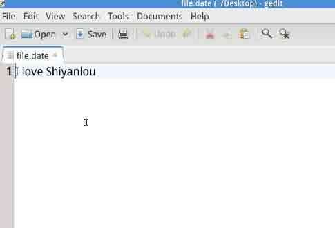

# 第 12 节 文件

标签（空格分隔）： c 语言

* * *

## 一、前言

相信大家都不会对“文件”感到陌生。我们写一篇文章把它存放在磁盘上用文件形式保存；编写好一个程序，以文件形式保存在磁盘中；电子邮件发送的“附件”也是以文件的形式保存的信息。 本节目标：

*   文件
*   打开和关闭文件
*   文件的输出与输出

## 二、文件

### 什么是文件

文件有不同的类型，在程序设计中，主要用到两种文件： **1.程序文件** 包括源程序文件（后缀为.c），目标文件（后缀为.o）以及可执行文件等。这种文件你的内容是程序代码。

**2.数据文件** 文件的内容不是程序，而是供程序运行时读写的数据，如在程序运行过程中输出到磁盘的数据，或在程序运行过程中供读入的数据。如全班学生的成绩数据、货物交易的数据等。 我们本章节讨论的是**数据文件**。 为了简化用户对输入输出设备的操作，用户不必区分各种输入输出设备之间的区别，操作系统**把各种设备都统一作为文件来处理**。例如终端键盘是输入文件，显示屏和打印机是输出文件。

### 文件的分类

根据数据的组织形式，数据文件可分为 ASCII 文件和二进制文件。数据在内存中都是以二进制形式存储的，如果不加转换地输出到外存，就是二进制文件，可以认为就是存在数据的映像，称为映像文件。如果要求在外存上以 ASCII 代码形式存储，则需要在存储前进行转换。ASCII 文件又称为文本文件，每一个字节放一个字符的 ASCII 代码。

用 ASCII 码形式输出时字节与字符一一对应，一个字节代表一个字符，因而便于对字符进行逐个处理，也便于输出字符。但一般占存储空间较多，而且要花费转换时间。用二进制形式输出数值，可以节省外存空间和转换时间，把内存中的存储单元中的内容原封不动的输出到磁盘上，此时每一个字节并不一定代表一个字符。

## 三、打开和关闭文件

对文件读写之前应该“打开”该文件，使用结束之后“关闭”文件。实际上，所谓的打开文件是指为文件简历相应的信息区（用来存放有关文件的信息）和文件缓冲区（用来暂时存放输入输出的数据）。

### fopen 函数打开数据文件

fopen 函数的调用方式为 **fopen（文件名，使用文件的方式）；**

例如:

```cpp
fopen("a1","r"); 
```

表示要打开名字为“a1”的文件，使用文件方式为“读入”（r 代表 read，即读入）。fopen 函数的返回值是指向 a1 文件的指针（即 a1 文件信息区的起始地址）。通常将 fopen 函数的返回值赋给一个指向文件指针变量。如：

```cpp
FILE *p;
fp=fopen("a1","r"); 
```

这样 fp 就和文件 a1 相联系了，或者说 fp 指向了 a1 文件。

### fclose 函数关闭数据文件

在使用完一个文件后应该关闭它，以防止它再被误用。“关闭”就是撤销文件信息区和文件缓冲区，使文件指针变量不再指向该文件。 fclose 函数的调用方式： **fclose（文件指针）；**

例如：

```cpp
fclose(fp); 
```

如果不关闭文件将会丢失数据，应当养成在程序终止之前关闭所有文件的习惯。

## 四、文件的输入与输出

### 顺序读写数据文件

文件打开之后，就可以对它进行读写了。在顺序写时，先写入的数据存放在文件中前面的位置，后写入的数据存放在文件中后面的位置。在顺序读时，先读文件写数据的顺序和数据在文件中的物理顺序是一致的。顺序读写需要用库函数实现。

对文本文件读入或输出一个字符的函数见表：

```cpp
函数名|调用形式|功能|返回值
------|-------|------|----
fgetc|fgetc(fp)|从 fp 指向的文件读入一个字符|成功，带回所读的字符，失败则返回文件结束标志 EOF（即-1）|
fputc|fputc(ch,fp)|把字符 ch 写到文件指针变量 fp 所指向的文件中|输出成功，返回值就是输出的字符；输出失败，则返回 EOF（即-1）|
```

**说明：fgetc 的第一个字母 f 代表文件（file），中间的 get 表示获取，最后一个 c 表示字符 char。fputc 也类似。**

举例说明: 从键盘输入一些字符，逐个把它们送到磁盘上去，直到用户输入一个“#”为止。

**解题思路**：用 fgetc 函数从键盘逐个输入字符，然后用 fputc 函数写到磁盘文件即可。

在桌面编写程序 12-1 编译并运行：

```cpp
#include<stdio.h>
#include<stdlib.h>   //stdlib 头文件即 standard library 标准库头文件
int main()
{
   FILE * fp;
   char ch,filename[10];
   printf("Please enter the file name:");

   scanf("%s",filename);
   if((fp=fopen(filename,"w"))==NULL)    //打开输出文件并使 fp 指向此文件
   {
      printf("Unable to open this file\n"); //如果打开出错，就输出“打不开”的信息
      exit(0);     //终止程序
   }

   ch=getchar();     //用来接收最后输入的回车符
   printf("Please enter a string  in the disk（Ends with a #）：");
   ch=getchar();   //接收从键盘输入的第一个字符
   while(ch!='#')  //当输入#时结束循环
   {
      fputc(ch,fp);
      putchar(ch);
      ch=getchar();
   }

   fclose(fp);
   putchar(10);
   return 0;
} 
```

运行结果： 运行时输入文件名为 file.date，桌面便创建了该文件


我们打开 file.date 文件便会看到 I love Shiyanlou



**程序分析**： （1）exit 是标准 C 的库函数，作用是使程序终止，用此函数时在程序的开头应包含 stdlib.h 头文件。

（2）执行过程如下：先从键盘读入一个字符，检查它是否“#”，如果是，表示字符串结束，不执行循环体。如果不是，则执行循环体，将发字符输出到 file.date。然后在屏幕上显示出该字符，接着再从键盘读入一个字符。如此反复，直到‘#’字符为止。这时程序已经将“I love Shiyanlou”写到“file.date”命名的文件中。

### 随机读写数据文件

对文件进行顺序读写比较容易理解，也容易操作单，但是效率不高。比如文件中存放了一个城市几百万人的资料，我们想要查找某一个人，按照顺序读写需要从第一个数据一个数据一个数据的读入，等待的时间是不能忍受的。为了解决这个问题可移动文件内部的位置指针到需要读写的位置，再进行读写，这种读写称为随机读写。随机访问不是按数据在文件中的物理位置次序进行读写而是可以对任何位置上的数据进行访问，显然这种方法比顺序访问效率高的多。

**实现随机读写的关键是要按要求移动位置指针，这称为文件的定位。**

动文件内部位置指针的函数主要有两个，即 rewind()和 fseek()。

rewind 函数其调用形式为：

**rewind(文件指针);**

它的功能是把文件内部的位置指针移到文件首。

下面主要介绍 fseek 函数。fseek 函数用来移动文件内部位置指针，其调用形式为： fseek(文件指针,位移量,起始点); 其中： “文件指针”指向被移动的文件。 “位移量”表示移动的字节数，要求位移量是 long 型数据，以便在文件长度大于 64KB 时不会出错。当用常量表示位移量时，要求加后缀“L”。 “起始点”表示从何处开始计算位移量，规定的起始点有三种：文件首，当前位置和文件尾。

其表示方法如下表：

```cpp
起始点    | 表示符号  | 数字表示
--------|-----------|---------
文件首    | SEEK*SET  | 0
当前位置|     SEEK*CUR   | 1
文件末尾|     SEEK_END| 2
```

例如：

```cpp
fseek(fp,100L,0); 
```

其意义是把位置指针移到离文件首 100 个字节处。

还要说明的是 fseek 函数一般用于二进制文件。在文本文件中由于要进行转换，故往往计算的位置会出现错误。

## 四、小结

我们本节课程讲述了文件，由于文件不是 c 语言重点内容，我们本节并没有详细讲述该内容。同时本节课也是 c 语言入门教程的最后一节课程，希望大家给可曾多多提出意见，小编会听取各位建议，让该课程变得更加完善。