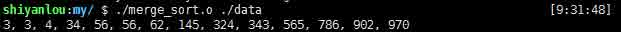

# 第 1 节 C 语言实现多线程排序

## 一、实验简介

归并排序是建立在归并操作上的一种有效的排序算法。该算法是采用分治（Divide and Conquer）的一个非常典型的应用。 传统的算法往往采用多个串行的函数实现分治算法，这样做的缺点是本来可以并行处理的部分，由于串行导致计算复杂度较高，但是优点是程序简单，没有线程开销。而基于多线程的归并排序反之。它采用并行处理的方式，减小了计算复杂度，但是由于引入多线程，导致系统开销较大。本项目我们就来探讨一下多线程排序。

### 1.1 知识点

*   归并排序算法

*   多线程编程模型

### 1.2 效果截图

*   编译：

编译时要连接线程库，命令行如下：


*   运行结果：



### 1.3 程序框架

*   本项目的主框架如下：


## 二、main 开启归并排序线程

main 函数作为一个主程序主要完成数据从文件读入内存，启动归并排序的线程，退出线程，打印数据等功能。主函数框架如 1.3 节所示。具体过程如下：

### 2.1 计算数据的规模

通过调用自定义函数 `read_length`,从指定的文件中计算数据长度：

```cpp
file_length = read_length(fname); 
```

*   `read_length` 函数实现原理是以只读方式打开文件 `freader = fopen(fname, "rt")`，然后循环读取文件中的数据，并保存到 `line` 所指的字符数组，`file_length` 每读一行加 1，直到读到文件末尾。

```cpp
while (fgets(line, 80, freader) != NULL)
    file_length += 1; 
```

### 2.2 读取文件中的数据并保存至数组

main 已经将数据长度保存在全局变量 `file_length` 中，然后通过 `array_master = read_file(fname);` 读取数据文件，保存数据。

*   `read_file` 函数实现原理原理：根据全局变量`file_length`，动态申请内存空间 `int *input = malloc(bufsize*sizeof(int))`。循环把数据从文件读入数组：

```cpp
while (fgets(line, 80, freader) != NULL) 
    {
        sscanf(line, "%d", &integer); 
        input[index] = integer;
        ++index;
        ++array_length;
    } 
```

### 2.3 创建线程执行排序算法

主函数创建新的线程调用归并排序算法 `merge_sort`。创建方法：

```cpp
pthread_t tid;
pthread_create(&tid, NULL, merge_sort, arg); 
```

### 2.4 线程同步

在主程序中为了打印已排序好的数据，必须等待排序线程执行完毕，才能打印到已排好的数组，所以需要线程同步。线程同步通过如下：

```cpp
pthread_join(tid, NULL); 
```

### 2.5 打印已排好数组

循环打印数组 `array_master` 中元素：

```cpp
for (j = 0; j < array_length; j++) 
{
    if (j == array_length - 1)
        printf("%d\n", array_master[j]);

    else 
        printf("%d, ", array_master[j]);
} 
```

## 三、归并函数

归并操作（merge），也叫归并算法，指的是将两个已经排序的序列合并成一个序列的操作。归并排序算法依赖归并操作。

### 3.1 函数框架：


### 3.2 从数组原址上拷贝相应的数据

当归并排序的时候应该有两个以排序数组,从原址上拷贝的数据的方式如下：

```cpp
for (i = 0; i < half1; i++)
    first[i] = arr[left + i];

for (j = 0; j < half2; j++) 
    second[j] = arr[middle + 1 + j]; 
```

### 3.3 然后选择两个有序子数组（`first`,`second`）中的最小的元素，插入原址中：

```cpp
while (i < half1 && j < half2) 
{

    if (first[i] <= second[j]) 
    {
        arr[k] = first[i];
        ++i;
    }
    else 
    {
        arr[k] = second[j];
        j++;
    }

    k++;
} 
```

*   此时有可能其中某个有序子数组的数还没有完全插入原址中，所以采用下边方式将剩余的数插入数组：

```cpp
while (i < half1) 
{
    arr[k] = first[i];
    i++;
    k++;
}

while (j < half2) 
{
    arr[k] = second[j];
    j++;
    k++;
} 
```

## 四、归并排序函数

归并排序是多线程部分的核心。如 4.1 节框架中所示：红色区域部分，归并排序函数 `merge_sort` 总是将当前排序的总长度分成两部分，折半排序。那么在以前的排序算法中，这会在一个线程中调用两次 `merge_sort` 函数，导致程序是串行运行的。但是在该类排序算法中，两个折半排序算法的数据空间是独立的，不存在依赖关系，所以采用多线程分别排序具有可行性。

### 4.1 函数框架：


### 4.2 多线程创建

判断待排序数组是否含有两个以上的数，如果是，则创建两个线程，折半查找,代码如下：

```cpp
pthread_create(&tid1, NULL, merge_sort, arg1);
pthread_create(&tid2, NULL, merge_sort, arg2); 
```

*   注意 `arg1`,`arg2` 是传给 `merge_sort` 的参数

### 4.3 等待子线程结束

只有等待子线程结束，才能得到两个有序的子序列，也就才能调用归并函数 `merge`.

等待子程序结束的同步语句为：

```cpp
pthread_join(tid1, NULL);
pthread_join(tid2, NULL); 
```

### 4.4 执行归并函数

得到一个有序的数组，和该线程的兄弟线程得到的有序数组一同等待父线程执归并操作。

```cpp
merge(arr, l, middle, r); 
```

### 4.5 退出线程

```cpp
pthread_exit(0); 
```

## 五、实验总结

归并排序是建立在归并操作上的一种有效的排序算法,传统上采用单线程串行的方式执行归并排序，计算时间复杂度高。本项目采用了多线程方式实现了归并排序算法。

本项目的完整代码如下：

```cpp
#include <stdio.h>
#include <pthread.h>
#include <stdlib.h>
#include <string.h>

/* 声明变量 */
int array_length, file_length;
int *array_master;
FILE *freader;

/* 用于从文件读取数据 */
int *read_file(char *fname) 
{
    freader = fopen(fname, "rt"); /* 只读方式打开文件 */
    int bufsize = file_length; /* 数组规模 */
    char line[80];
    int integer;
    int index = 0;
    int *input = malloc(bufsize*sizeof(int)); /* 动态分配内存空间 */

    while (fgets(line, 80, freader) != NULL)
    {
        sscanf(line, "%d", &integer); /*从字符串 line 中获得整数（完成字符串到整数的转换）*/
        input[index] = integer;
        ++index;
        ++array_length;
    }

    fclose(freader); /* 关闭文件 */
    return input;
}

/* 求文件的行数（也就是数据量）*/
int read_length(char *fname) 
{
    freader = fopen(fname, "rt"); /* 以只读方式打开文件 */
    char line[80];
    int file_length = 0;

    /* fgets 从数据文件中读数据，每读一行的字符串
    （最长为 80 个字符），读到文件末尾 EOF，返回 NULL */
    while (fgets(line, 80, freader) != NULL)
        file_length += 1;
    return file_length;
}

/* 归并函数 */
void merge(int arr[], int left, int middle, int right)
{
    int i, j, k;
    int half1 = middle - left + 1; /* 数组前一半的数据量 */
    int half2 = right - middle;  /* 数组后一半的数据量 */

    int first[half1], second[half2]; /* 声明两个临时数组，
                                     保存前半部分数据和后半部分数据 */

    /* 从 arr 数组复制 left 到 right 之间前半部分的数据 */
    for (i = 0; i < half1; i++) 
        first[i] = arr[left + i]; 

    /* 从 arr 数组复制 left 到 right 之间后半部分的数据 */
    for (j = 0; j < half2; j++) 
        second[j] = arr[middle + 1 + j];

    i = 0;
    j = 0;
    k = left;

    /* 比较两个临时数组的数，找出当前最小的数，然后按序存入 arr */
    while (i < half1 && j < half2) 
    {

        if (first[i] <= second[j]) 
        {
            arr[k] = first[i];
            ++i; 
        }
        else 
        {
            arr[k] = second[j];
            j++;
        }

        k++; /* arr 数组的索引 */
    }

    /* 将临时数组中剩余的数存入 arr 数组 */
    while (i < half1) 
    {
        arr[k] = first[i];
        i++;
        k++;
    }

    while (j < half2)
    {
        arr[k] = second[j];
        j++;
        k++;
    }
}

/* 归并排序函数 */
void merge_sort(void* arg) 
{
    /* 变量声明 */
    int *arr = array_master; /* 指向全局变量 array_master 数组 */
    int *argu = (int*)arg;
    int l = argu[0]; /* 由线程传入的参数，获得要排序数据的最小索引值 */
    int r = argu[1]; /* 由线程传入的参数，获得要排序数据的最大索引值 */

    /* 若 l==r 则不必排序 */
    if (l < r) 
    {   
        /* 声明两个线程买描述符 */
        pthread_t tid1;
        pthread_t tid2;

        /* 声明调用线程处理函数的参数 */
        int arg1[2];
        int arg2[2];

        int middle;
        middle = (l + (r - 1)) / 2;
        arg1[0] = l;
        arg1[1] = middle;
        arg2[0] = middle + 1;
        arg2[1] = r;

        /* 由于用二分法对数组分成两部分分别排序，
        所以存在并行的可能，这里采用多线程 */
        pthread_create(&tid1, NULL, merge_sort, arg1);
        pthread_create(&tid2, NULL, merge_sort, arg2);

        /* 这里必须等待两部分数组都已排序完毕，才能进行归并，
        所以这里调用 pthread_join 使得线程同步 */
        pthread_join(tid1, NULL);
        pthread_join(tid2, NULL);

        /* 此时归并两个已排序子序列 */
        merge(arr, l, middle, r);
        pthread_exit(0);
    }
}

/* 主函数 */
int main(int argc, char *argv[])
{
    char *fname = argv[1];  /* 从命令行中读取数据文件 */

    /* 获取数据的长度 */
    file_length = read_length(fname);

    /* 从数据文件中读取数据 */
    array_master = read_file(fname);

    int arg[2];
    arg[0] = 0;
    arg[1] = file_length;

    /* 创建线程执行归并排序 */
    pthread_t tid;
    pthread_create(&tid, NULL, merge_sort, arg);

    /* 进程同步 */
    pthread_join(tid, NULL);

    /* 打印已排序数组 */
    int j;
    for (j = 0; j < array_length; j++) 
    {
        if (j == array_length - 1) 
            printf("%d\n", array_master[j]); /* 打印已排序数组的最后一个元素 */

        else 
            printf("%d, ", array_master[j]); /* 打印已排序数组的非最后一个元素 */
    }

    return 0;
} 
```

## 参考资料

*   [《UNIX 环境高级编程》](https://book.douban.com/subject/1788421/)