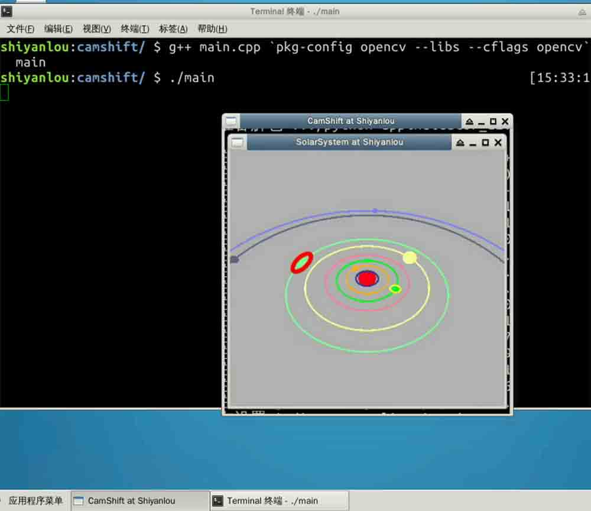
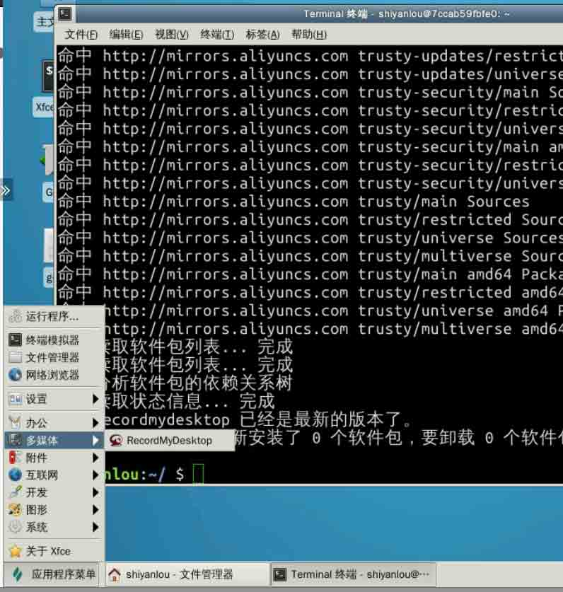
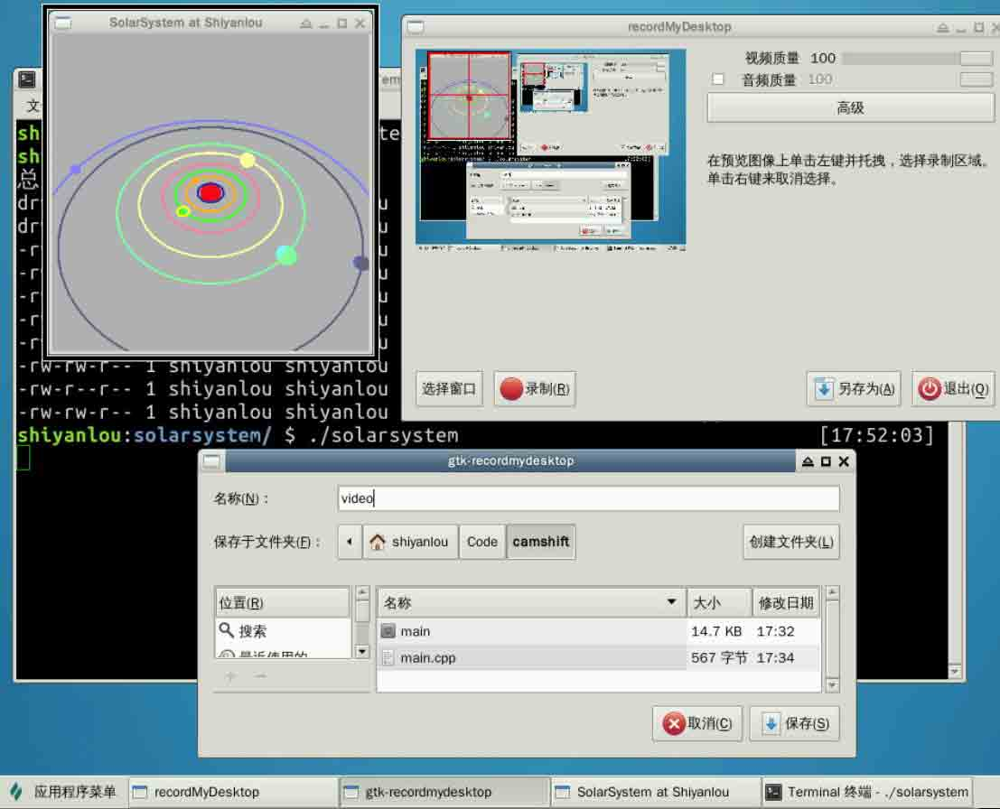
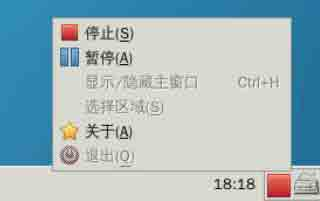
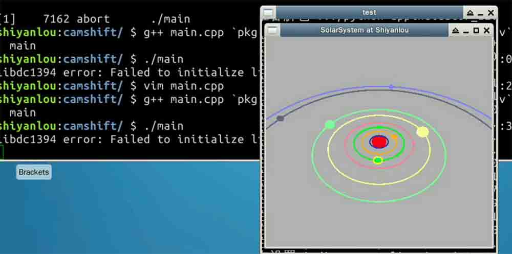

# 第 1 节 C++ 实现运动目标的追踪

## 一、说明

### 实验介绍

本次实验将使用利用 OpenCV 来实现对视频中动态物体的追踪。

### 实验涉及的知识点

*   C++ 语言基础
*   g++ 的使用
*   图像基础
*   OpenCV 在图像及视频中的应用
*   Meanshift 和 Camshift 算法

本次实验要实现的效果是追踪太阳系中运动的行星（图中选择了浅绿颜色轨道上的土星，可以看到追踪的目标被红色的椭圆圈住）：



## 二、环境搭建

进行本节的实验时，您需要先完成 [C++实现太阳系行星运行系统](https://www.shiyanlou.com/teacher/courses/558) 的相关实验，才能进行下面的相关学习。

### 创建视频文件

在实验楼环境中暂时还不支持连接用户计算机的摄像头进行实时取景，我们首先需要创建实验前的视频文件。

首先安装屏幕录制工具：

```cpp
sudo apt-get update && sudo apt-get install gtk-recordmydesktop 
```

安装完成后，我们能够在应用程序菜单中找到：



运行之前完成的太阳系行星系统程序 `./solarsystem` 并使用 `RecordMyDesktop` 录制程序运行画面（10~30s 即可），并保存到 `~/Code/camshift` 路径下，命名为 `video`：



时间足够后停止录制便能得到一个`.ogv`结尾的视频文件`video.ogv`：



### 图像基础

OpenCV 是一个开源的跨平台计算机视觉库，与 OpenGL 所提供的图像绘制不同，OpenCV 实现了图像处理和计算机视觉方面的很多通用的算法。在学习 OpenCV 之前，我们需要先了解一下图像、视频在计算机中的一些基本概念。

首先，我们要理解图片在计算机中的表示方式：图像在显示生活中以连续变化的形式而存在，但在计算机中，有两种常见的存储图片的方式：一种是矢量图，一种则是像素图。

矢量图，也称为面向对象的图像或绘图图像，在数学上定义为一系列由线连接的点。矢量文件中的图形元素称为对象。每个对象都是一个自成一体的实体，它具有颜色、形状、轮廓、大小和屏幕位置等属性。

而更常见的则是像素图，比如常说的一张图片的尺寸为 1024*768，这就意味着这张图片水平方向上有 1024 个像素，垂直方向上有 768 个像素。

像素就是表示像素图的基本单位，通常情况下一个像素由三原色（红绿蓝）混合而成。由于计算机的本质是对数字的识别，一般情况下我们把一种原色按亮度的不同从 0~255 进行表示，换句话说，对于原色红来说，0 表示最暗，呈现黑色，255 表示最亮，呈现纯红色。

这样，一个像素就可以表示为一个三元组`(B,G,R)`，比如白色可以表示为`(255,255,255)`，黑色则为`(0,0,0)`，这时我们也称这幅图像是 RGB **颜色空间**中的一副图像，R、G、B 分别成为这幅图像的三个**通道**，除了 RGB 颜色空间外，还有很多其他的颜色空间，如 HSV、YCrCb 等等。

像素是表示像素图的基本单位，而图像则是表示视频的基本单位。一个视频由一系列图像组成，在视频中我们称其中的图像为帧。而通常我们所说的视频帧率，意味着这个视频每秒钟包含多少帧图像。比如帧率为 25，那么这个视频每秒钟就会播放 25 帧图像。

1 秒钟共有 1000 毫秒，因此如果帧率为 `rate` 那么每一帧图像之间的时间间隔为 `1000/rate`。

### 图像颜色直方图

颜色直方图是描述图像的一种工具，它和普通的直方图类似，只是颜色直方图需是根据某一幅图片计算而来。

如果一副图片是 RGB 颜色空间，那么我们可以统计 R 通道中，颜色值为 0~255 这 256 中颜色出现的次数，这边能获得一个长度为 256 的数组(颜色概率查找表)，我们再将所有的值同时除以这幅图像中像素的总数，将这之后所得的数列转化为直方图，其结果就是颜色直方图。

### 直方图反向投影

人们已经证明，在 RGB 颜色空间中，对光照亮度变化较为敏感，为了减少此变化对跟踪效果的影响，就需要对直方图进行反向投影。这一共分为三个步骤：

1.  首先将图像从 RGB 空间转换到 HSV 空间。
2.  然后对其中的 H 颜色通道的直方图。
3.  将图像中每个像素的值用颜色概率查找表中对应的概率进行替换，就得到了颜色概率分布图。

这个过程就叫反向投影，颜色概率分布图是一个灰度图像。

### OpenCV 初步使用

首先安装 OpenCV：

```cpp
sudo apt-get install libopencv-dev 
```

我们已经熟悉了 C++的基本语法，几乎在写过的每一个程序中都有使用到 `#include <iostream>` 和 `using namespace std;` 或者 `std::cout`。OpenCV 也有它自己的命名空间。

使用 OpenCV，只需要包含这一个头文件：

```cpp
#include <opencv2/opencv.hpp> 
```

我们可以使用

```cpp
using namespace cv; 
```

来启用 OpenCV 的名称空间，也可以在 OpenCV 提供的 API 前使用 `cv::` 来使用它提供的接口。

由于我们是初次接触 OpenCV，对 OpenCV 所提供的接口还不熟悉，所以我们推荐先使用 `cv::` 前缀来进行接下来的学习。

我们先写一个程序来读取之前录制的视频：

```cpp
//
// main.cpp
//
#include <opencv2/opencv.hpp> // OpenCV 头文件

int main() {

    // 创建一个视频捕获对象
    // OpenCV 提供了一个 VideoCapture 对象，它屏蔽了
    // 从文件读取视频流和从摄像头读取摄像头的差异，当构造
    // 函数参数为文件路径时，会从文件读取视频流；当构造函
    // 数参数为设备编号时(第几个摄像头, 通常只有一个摄像
    // 头时为 0)，会从摄像头处读取视频流。
    cv::VideoCapture video("video.ogv"); // 读取文件
    // cv::VideoCapture video(0);        // 使用摄像头

    // 捕获画面的容器，OpenCV 中的 Mat 对象
    // OpenCV 中最关键的 Mat 类，Mat 是 Matrix(矩阵) 
    // 的缩写，OpenCV 中延续了像素图的概念，用矩阵来描述
    // 由像素构成的图像。
    cv::Mat frame;
    while(true) {

        // 将 video 中的内容写入到 frame 中，
        // 这里 >> 运算符是经过 OpenCV 重载的
        video >> frame;

        // 当没有帧可继续读取时，退出循环
        if(frame.empty()) break;

        // 显示当前帧
        cv::imshow("test", frame);

        // 录制视频帧率为 15, 等待 1000/15 保证视频播放流畅。
        // waitKey(int delay) 是 OpenCV 提供的一个等待函数，
        // 当运行到这个函数时会阻塞 delay 毫秒的时间来等待键盘输入
        int key = cv::waitKey(1000/15);

        // 当按键为 ESC 时，退出循环
        if (key == 27) break;
    }
    // 释放申请的相关内存
    cv::destroyAllWindows();
    video.release();
    return 0;

} 
```

将这个文件和 `video.ogv` 同样至于 `~/Code/camshift/` 下，使用 g++ 编译 `main.cpp`：

```cpp
g++ main.cpp `pkg-config opencv --libs --cflags opencv` -o  main 
```

运行，可以看到成功播放视频：

```cpp
./main 
```

> **提示** > > 你可能注意到运行后，命令行会提示： > > `> libdc1394 error: Failed to initialize libdc1394 >` > > 这是 OpenCV 的一个 Bug，虽然它并不影像我们程序的运行，但是如果你有强迫症，那么下面这条命令可以解决这个问题： > > `> sudo ln /dev/null /dev/raw1394 >`



## 三、Meanshift 和 Camshift 算法

### Meanshift

Meanshift 和 Camshift 算法是进行目标追踪的两个经典算法，Camshift 是基于 Meanshift 的，他们的数学解释都很复杂，但想法却非常的简单。所以我们略去那些数学事实，先介绍 Meanshift 算法。

假设屏幕上有一堆红色的点集，这时候蓝色的圆圈（窗口）必须要移动到点最密集的地方（或者点数最多的地方）：


如图所示，把蓝色的圆圈标记为 `C1`，蓝色的矩形为圆心标记为 `C1_o`。但这个圆的质心却为 `C1_r`，标记为蓝色的实心圆。

当`C1_o`和`C1_r`不重合时，将圆 `C1`移动到圆心位于 `C1_r`的位置，如此反复。最终会停留在密度最高的圆 `C2` 上。

而处理图像来说，我们通常使用图像的反向投影直方图。当要追踪的目标移动时，显然这个移动过程可以被反向投影直方图反应。所以 Meanshift 算法最终会将我们选定的窗口移动到运动目标的位置（收敛，算法结束）。

### Camshift

经过之前的描述，我们可以看到 Meanshift 算法总是对一个固定的窗口大小进行追踪，这是不符合我们的需求的，因为在一个视频中，目标物体并不一定是很定大小的。

所以 Camshift 就是为了改进这个问题而产生的。这一点从 Camshift 的全称（Continuously Adaptive Meanshift）也能够看出来。

它的基本想法是：首先应用 Meanshift 算法，一旦 Meanshift 的结果收敛后，Camshift 会更新窗口的大小，并计算一个带方向的椭圆来匹配这个窗口，然后将这个椭圆作为新的窗口应用 Meanshift 算法，如此迭代，便实现了 Camshift。

OpenCV 提供了 Camshift 算法的通用接口：

```cpp
RotatedRect CamShift(InputArray probImage, Rect& window, TermCriteria criteria) 
```

其中第一个参数 probImage 为目标直方图的反向投影，第二个参数 window 为执行 Camshift 算法的搜索窗口，第三个参数为算法结束的条件。

### 分析

理解了 Camshift 算法的基本思想之后我们就可分析实现这个代码主要分为几个步骤了：

1.  设置选择追踪目标的鼠标回调事件;
2.  从视频流中读取图像;
3.  实现 Camshift 过程;

下面我们继续修改 `main.cpp` 中的代码：

### 第一步：选择追踪目标区域的鼠标回调函数

与 OpenGL 不同，在 OpenCV 中，对鼠标的回调函数指定了五个参数，其中前三个是我们最需要的：通过 `event` 的值我们可以获取这次回调鼠标发生的具体事件，如左键被按下(`CV_EVENT_LBUTTONDOWN`)、左键被抬起(`CV_EVENT_LBUTTONUP`) 等。

```cpp
bool selectObject = false; // 用于标记是否有选取目标
int trackObject = 0;       // 1 表示有追踪对象 0 表示无追踪对象 -1 表示追踪对象尚未计算 Camshift 所需的属性
cv::Rect selection;        // 保存鼠标选择的区域
cv::Mat image;             // 用于缓存读取到的视频帧

// OpenCV 对所注册的鼠标回调函数定义为：
// void onMouse(int event, int x, int y, int flag, void *param)
// 其中第四个参数 flag 为 event 下的附加状态，param 是用户传入的参数，我们都不需要使用
// 故不填写其参数名
void onMouse( int event, int x, int y, int, void* ) {
    static cv::Point origin; 
    if(selectObject) {
        // 确定鼠标选定区域的左上角坐标以及区域的长和宽
        selection.x = MIN(x, origin.x);
        selection.y = MIN(y, origin.y);
        selection.width = std::abs(x - origin.x);
        selection.height = std::abs(y - origin.y);

        // & 运算符被 cv::Rect 重载
        // 表示两个区域取交集, 主要目的是为了处理当鼠标在选择区域时移除画面外
        selection &= cv::Rect(0, 0, image.cols, image.rows);
    }

    switch(event) {
        // 处理鼠标左键被按下
        case CV_EVENT_LBUTTONDOWN:
            origin = cv::Point(x, y);
            selection = cv::Rect(x, y, 0, 0);
            selectObject = true;
            break;
        // 处理鼠标左键被抬起
        case CV_EVENT_LBUTTONUP:
            selectObject = false;
            if( selection.width > 0 && selection.height > 0 )
                trackObject = -1; // 追踪的目标还未计算 Camshift 所需要的属性
            break;
    }
} 
```

### 第二步：从视频流中读取图像

我们已经在之前实现了读取视频流的基本结构，下面我们进一步细化：

```cpp
int main() {
    cv::VideoCapture video("video.ogv");
    cv::namedWindow("CamShift at Shiyanlou"); 

    // 1\. 注册鼠标事件的回调函数, 第三个参数是用户提供给回调函数的，也就是回调函数中最后的 param 参数
    cv::setMouseCallback("CamShift at Shiyanlou", onMouse, NULL);

    cv::Mat frame; // 接收来自 video 视频流中的图像帧

    // 2\. 从视频流中读取图像
    while(true) {
        video >> frame;
        if(frame.empty()) break;

        // 将 frame 中的图像写入全局变量 image 作为进行 Camshift 的缓存
        frame.copyTo(image);

        // 如果正在选择追踪目标，则画出选择框
        if( selectObject && selection.width > 0 && selection.height > 0 ) {
            cv::Mat roi(image, selection);
            bitwise_not(roi, roi);  // 对选择的区域图像反色
        }
        imshow("CamShift at Shiyanlou", image);
        int key = cv::waitKey(1000/15.0);
        if(key == 27) break;
    }
    // 释放申请的相关内存
    cv::destroyAllWindows();
    video.release();
    return 0;
} 
```

> **提示** > > ROI（Region of Interest），在图像处理中，被处理的图像以方框、圆、椭圆、不规则多边形等方式勾勒出需要处理的区域，称为感兴趣区域，ROI。

### 第三步：实现 Camshift 过程

计算追踪目标的反向投影直方图为需要先使用 `cvtColor` 函数，这个函数可以将 RGB 颜色空间的原始图像转换到 HSV 颜色空间。计算直方图必须在选择初始目标之后，因此：

```cpp
int main() {
    cv::VideoCapture video("video.ogv");
    cv::namedWindow("CamShift at Shiyanlou"); 
    cv::setMouseCallback("CamShift at Shiyanlou", onMouse, NULL);

    cv::Mat frame;
    cv::Mat hsv, hue, mask, hist, backproj;
    cv::Rect trackWindow;             // 追踪到的窗口
    int hsize = 16;                   // 计算直方图所必备的内容
    float hranges[] = {0,180};        // 计算直方图所必备的内容
    const float* phranges = hranges;  // 计算直方图所必备的内容

    while(true) {
        video >> frame;
        if(frame.empty()) break;
        frame.copyTo(image);

        // 转换到 HSV 空间
        cv::cvtColor(image, hsv, cv::COLOR_BGR2HSV);
        // 当有目标时开始处理
        if(trackObject) {

            // 只处理像素值为 H：0~180，S：30~256，V：10~256 之间的部分，过滤掉其他的部分并复制给 mask
            cv::inRange(hsv, cv::Scalar(0, 30, 10), cv::Scalar(180, 256, 10), mask);
            // 下面三句将 hsv 图像中的 H 通道分离出来
            int ch[] = {0, 0};
            hue.create(hsv.size(), hsv.depth());
            cv::mixChannels(&hsv, 1, &hue, 1, ch, 1);

            // 如果需要追踪的物体还没有进行属性提取，则对选择的目标中的图像属性提取
            if( trackObject < 0 ) {

                // 设置 H 通道和 mask 图像的 ROI
                cv::Mat roi(hue, selection), maskroi(mask, selection);
                // 计算 ROI 所在区域的直方图
                calcHist(&roi, 1, 0, maskroi, hist, 1, &hsize, &phranges);
                // 将直方图归一
                normalize(hist, hist, 0, 255, CV_MINMAX);

                // 设置追踪的窗口
                trackWindow = selection;

                // 标记追踪的目标已经计算过直方图属性
                trackObject = 1;
            }
            // 将直方图进行反向投影
            calcBackProject(&hue, 1, 0, hist, backproj, &phranges);
            // 取公共部分
            backproj &= mask;
            // 调用 Camshift 算法的接口
            cv::RotatedRect trackBox = CamShift(backproj, trackWindow, cv::TermCriteria( CV_TERMCRIT_EPS | CV_TERMCRIT_ITER, 10, 1 ));
            // 处理追踪面积过小的情况
            if( trackWindow.area() <= 1 ) {
                int cols = backproj.cols, rows = backproj.rows, r = (MIN(cols, rows) + 5)/6;
                trackWindow = cv::Rect(trackWindow.x - r, trackWindow.y - r,
                                   trackWindow.x + r, trackWindow.y + r) & cv::Rect(0, 0, cols, rows);
            }
            // 绘制追踪区域
            ellipse( image, trackBox, cv::Scalar(0,0,255), 3, CV_AA );

        }

        if( selectObject && selection.width > 0 && selection.height > 0 ) {
            cv::Mat roi(image, selection);
            bitwise_not(roi, roi);
        }
        imshow("CamShift at Shiyanlou", image);
        int key = cv::waitKey(1000/15.0);
        if(key == 27) break;
    }
    cv::destroyAllWindows();
    video.release();
    return 0;
} 
```

## 四、总结本节实现的代码

下面的代码实现仅供参考：

```cpp
#include <opencv2/opencv.hpp>

bool selectObject = false;
int trackObject = 0;
cv::Rect selection;
cv::Mat image;

void onMouse( int event, int x, int y, int, void* ) {
    static cv::Point origin;
    if(selectObject) {
        selection.x = MIN(x, origin.x);
        selection.y = MIN(y, origin.y);
        selection.width = std::abs(x - origin.x);
        selection.height = std::abs(y - origin.y);
        selection &= cv::Rect(0, 0, image.cols, image.rows);
    }
    switch(event) {
        case CV_EVENT_LBUTTONDOWN:
            origin = cv::Point(x, y);
            selection = cv::Rect(x, y, 0, 0);
            selectObject = true;
            break;
        case CV_EVENT_LBUTTONUP:
            selectObject = false;
            if( selection.width > 0 && selection.height > 0 )
                trackObject = -1;
            break;
    }
}

int main( int argc, const char** argv )
{
    cv::VideoCapture video("video.ogv");
    cv::namedWindow( "CamShift at Shiyanlou" );
    cv::setMouseCallback( "CamShift at Shiyanlou", onMouse, 0 );

    cv::Mat frame, hsv, hue, mask, hist, backproj;
    cv::Rect trackWindow;
    int hsize = 16;
    float hranges[] = {0,180};
    const float* phranges = hranges;

    while(true) {
        video >> frame;
        if( frame.empty() )
            break;

        frame.copyTo(image);

        cv::cvtColor(image, hsv, cv::COLOR_BGR2HSV);

        if( trackObject ) {

            cv::inRange(hsv, cv::Scalar(0, 30, 10), cv::Scalar(180, 256, 256), mask);
            int ch[] = {0, 0};
            hue.create(hsv.size(), hsv.depth());
            cv::mixChannels(&hsv, 1, &hue, 1, ch, 1);

            if( trackObject < 0 ) {
                cv::Mat roi(hue, selection), maskroi(mask, selection);
                calcHist(&roi, 1, 0, maskroi, hist, 1, &hsize, &phranges);
                normalize(hist, hist, 0, 255, CV_MINMAX);

                trackWindow = selection;
                trackObject = 1;
            }

            calcBackProject(&hue, 1, 0, hist, backproj, &phranges);
            backproj &= mask;
            cv::RotatedRect trackBox = CamShift(backproj, trackWindow, cv::TermCriteria( CV_TERMCRIT_EPS | CV_TERMCRIT_ITER, 10, 1 ));
            if( trackWindow.area() <= 1 ) {
                int cols = backproj.cols, rows = backproj.rows, r = (MIN(cols, rows) + 5)/6;
                trackWindow = cv::Rect(trackWindow.x - r, trackWindow.y - r,
                                   trackWindow.x + r, trackWindow.y + r) &
                cv::Rect(0, 0, cols, rows);
            }
            ellipse( image, trackBox, cv::Scalar(0,0,255), 3, CV_AA );

        }

        if( selectObject && selection.width > 0 && selection.height > 0 ) {
            cv::Mat roi(image, selection);
            bitwise_not(roi, roi);
        }

        imshow( "CamShift at Shiyanlou", image );
        char c = (char)cv::waitKey(1000/15.0);
        if( c == 27 )
            break;
    }
    cv::destroyAllWindows();
    video.release();
    return 0;
} 
```

## 五、结果

重新编译 `main.cpp`：

```cpp
g++ main.cpp `pkg-config opencv --libs --cflags opencv` -o  main 
```

运行：

```cpp
./main 
```

在视频中用鼠标拖拽选择一个要追踪的物体，即可看到追踪的效果：


> 图中选择了浅绿颜色轨道上的土星，可以看到追踪时的窗口呈现红色的椭圆状。

## 进一步阅读的参考

1.  OpenCV 官方教程. [`docs.opencv.org/2.4/`](http://docs.opencv.org/2.4/).
2.  学习 OpenCV. [`shop.oreilly.com/product/0636920044765.do`](http://shop.oreilly.com/product/0636920044765.do)
3.  Gary, Bradsky. Computer Vision Face Tracking for Use in a Perceptual User Interface. [`opencv.jp/opencv-1.0.0_org/docs/papers/camshift.pdf`](http://opencv.jp/opencv-1.0.0_org/docs/papers/camshift.pdf)