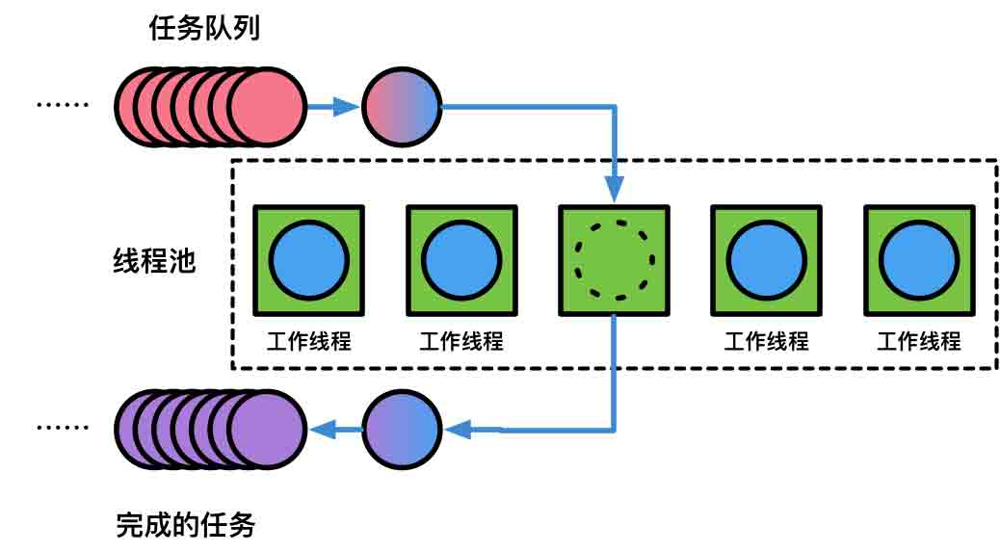
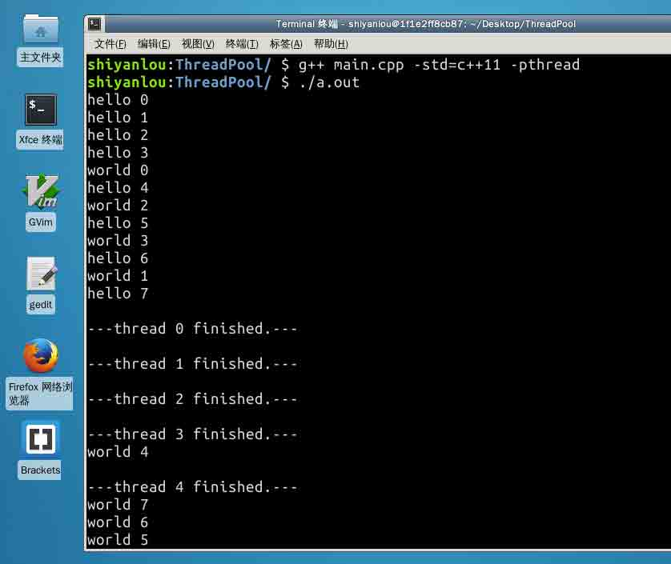

# 第 2 节 100 行 C++ 代码实现线程池 - 实现

## 一、概述

### 项目介绍

为了追求性能，在服务器开发中我们经常要面临大量线程任务之间的调度和管理，本次实验我们将使用 C++ 设计并实现一个简单的线程池库。

### 项目涉及的知识点

*   C++11 标准库特性

    *   std::thread
    *   std::mutex, std::unique_lock
    *   std::condition_variable
    *   std::future, std::packaged_task
    *   std::function, std::bind
    *   std::shared*ptr, std::make*shared
    *   std::move, std::forward
*   C++11 语言特性

    *   Lambda 表达式
    *   尾置返回类型
*   线程池模型

*   测试驱动开发思想

### 线程池模型



上一节中，我们认识了线程池模型，同时还回顾了 C++11 的诸多关于并发编程相关的新特性。本节我们正式开始实现这个只有 100 行的线程池。

## 一、测试驱动

线程池通常作为一个系统内的模块(说高级一点可以被叫做库)被编写出来，这时我们不可避免的要保证代码的健壮性(至少要保证库的正确性)，为做到此目的，最好的办法就是先编写测试代码，然后根据测试代码驱动整个库的开发。

我们要规划一个 `ThreadPool` 类来进行线程池的管理，所以我们可以尝试编写这样的 main 函数来进行测试：

```cpp
//
// main.cpp
//
#include <iostream> // std::cout, std::endl

#include <vector>   // std::vector
#include <string>   // std::string
#include <future>   // std::future
#include <thread>   // std::this_thread::sleep_for
#include <chrono>   // std::chrono::seconds

#include "ThreadPool.h"

int main()
{
    // 创建一个能够并发执行四个线程的线程池
    ThreadPool pool(4);
    // 创建并发执行线程的结果列表
    std::vector< std::future<std::string> > results;

    // 启动八个需要执行的线程任务
    for(int i = 0; i < 8; ++i) {
        // 将并发执行任务的返回值添加到结果列表中
        results.emplace_back(
            // 将下面的打印任务添加到线程池中并发执行
            pool.enqueue([i] {
                std::cout << "hello " << i << std::endl;
                // 上一行输出后, 该线程会等待 1 秒钟
                std::this_thread::sleep_for(std::chrono::seconds(1));
                // 然后再继续输出并返回执行情况
                std::cout << "world " << i << std::endl;
                return std::string("---thread ") + std::to_string(i) + std::string(" finished.---");
            })
        );
    }

    // 输出线程任务的结果
    for(auto && result: results)
        std::cout << result.get() << ' ';
    std::cout << std::endl;

    return 0;
} 
```

## 二、设计

首先确定线程池中的成员和方法，定义 ThreadPool 对象：

```cpp
//
// ThreadPool.hpp
//

class ThreadPool {
public:

    // 在线程池中创建 threads 个工作线程
    ThreadPool(size_t threads);

    // 向线程池中增加线程
    template<typename F, typename... Args>
    auto enqueue(F&& f, Args&&... args) 
        -> std::future<typename std::result_of<F(Args...)>::type>;

    ~ThreadPool();
private:
    // 需要持续追踪线程来保证可以使用 join
    std::vector< std::thread > workers;
    // 任务队列
    std::queue< std::function<void()> > tasks;

    // 同步相关
    std::mutex queue_mutex;             // 互斥锁
    std::condition_variable condition;  // 互斥条件变量

    // 停止相关
    bool stop;
}; 
```

在这个代码中，值得一提的是 `enqueue` 方法的定义：

```cpp
template<typename F, typename... Args>
    auto enqueue(F&& f, Args&&... args) 
        -> std::future<typename std::result_of<F(Args...)>::type>; 
```

在这个定义中，设计的是一个可变参数的模板，使用 `typename...` 可以指出接下来的参数表示零个或者多个类型的列表，并使用 Args 来表示，这个 Args 是一个模板参数包。而在后面的函数参数表中，args 则是函数参数包，用来表示零个或多个参数。

设计的 enqueue 函数会让一个新的线程被传入进去，在第一个参数中使用 `F&&` 来进行右值引用，而不会发生拷贝行为而再次创建一个执行体，其返回类型，我们设计成获得要执行函数体在执行完毕后返回的结果，这时候就必须推断出返回类型是什么，才能写出 `std::future<typename 返回类型>` 的代码。

而实际上执行函数的返回类型是可以被 `std::result_of` 推断的，我们只需要使用所调函数的类型`F`，以及这个函数的参数 `Args` 即可 `std::result_of<F(Args...)>::type`。

最后，这个定义中使用了尾置返回类型的 C++11 特性，但这里并不是因为无法写出返回类型，而是因为返回类型太长，使用尾置的形式可以让我们的代码比下面的写法更加清晰好看：

```cpp
// 头重脚轻, 不推荐这么写
template<class F, class... Args>
std::future<typename std::result_of<F(Args...)>::type> 
enqueue(F&& f, Args&&... args) 
```

## 三、实现

在熟悉语言特性、并发编程基本知识、深刻理解线程池模型的情况下，编码其实并不复杂。

### 线程池构造与销毁

我们首先来实现线程池的构造函数。编写线程池的构造函数的过程中，要注意这样几点：

1.  构造的线程池应该执行的是指定的可并发执行的线程的数量；
2.  任务的执行和结束阶段应该是位于临界区的，这样才能保证不会并发的同时启动多个需要执行的任务；

下面是它的详细实现：

```cpp
// 构造函数只负责启动一定数量的工作线程(worker)
inline ThreadPool::ThreadPool(size_t threads)
: stop(false)
{
    // 启动 threads 数量的工作线程(worker)
    for(size_t i = 0;i<threads;++i)
        workers.emplace_back(
            // 此处的 lambda 表达式捕获 this, 即线程池实例
            [this]
            {
                // 循环避免虚假唤醒
                for(;;)
                {
                    // 定义函数对象的容器, 存储任意的返回类型为 void 参数表为空的函数
                    std::function<void()> task;

                    // 临界区
                    {
                        // 创建互斥锁
                        std::unique_lock<std::mutex> lock(this->queue_mutex);

                        // 阻塞当前线程, 直到 condition_variable 被唤醒
                        this->condition.wait(lock,
                            [this]{ return this->stop || !this->tasks.empty(); });

                        // 如果当前线程池已经结束且等待任务队列为空, 则应该直接返回
                        if(this->stop && this->tasks.empty())
                            return;

                        // 否则就让任务队列的队首任务作为需要执行的任务出队
                        task = std::move(this->tasks.front());
                        this->tasks.pop();
                    }

                    // 执行当前任务
                    task();
                }
            }
        );
} 
```

线程池的销毁对应构造时究竟创建了什么实例，销毁线程池之前，我们并不知道当前线程池中的工作线程是否执行完成，所以必须先创建一个临界区将线程池状态标记为停止，从而禁止新的线程的加入，最后等待所有执行线程的运行结束，完成销毁，详细实现如下：

```cpp
// 销毁所有线程池中创建的线程
inline ThreadPool::~ThreadPool()
{
    // 临界区
    {
        // 创建互斥锁
        std::unique_lock<std::mutex> lock(queue_mutex);

        // 设置线程池状态
        stop = true;
    }

    // 通知所有等待线程
    condition.notify_all();

    // 使所有异步线程转为同步执行, 此处循环为 c++11 新提供的循环语法 for(value:values)
    for(std::thread &worker: workers)
        worker.join();
} 
```

### 向线程池中添加新任务

向线程池中添加新任务的实现逻辑主要需要注意这样几点：

1.  支持多个入队任务参数需要使用变长模板参数
2.  为了调度执行的任务，需要包装执行的任务，这就意味着需要对任务函数的类型进行包装、构造
3.  临界区可以在一个作用域里面被创建，最佳实践是使用 RAII 的形式

```cpp
// 添加一个新的线程到线程池中
template<class F, class... Args>
auto ThreadPool::enqueue(F&& f, Args&&... args) 
    -> std::future<typename std::result_of<F(Args...)>::type>
{
    // 推导任务返回类型
    using return_type = typename std::result_of<F(Args...)>::type;

    // 获得当前任务
    auto task = std::make_shared< std::packaged_task<return_type()> >(
        std::bind(std::forward<F>(f), std::forward<Args>(args)...)
    );

    // 获得 std::future 对象以供实施线程同步
    std::future<return_type> res = task->get_future();

    // 临界区
    {
        std::unique_lock<std::mutex> lock(queue_mutex);

        // 禁止在线程池停止后加入新的线程
        if(stop)
            throw std::runtime_error("enqueue on stopped ThreadPool");

        // 将线程添加到执行任务队列中
        tasks.emplace([task]{ (*task)(); });
    }

    // 通知一个正在等待的线程
    condition.notify_one();
    return res;
} 
```

### 运行结果分析

编译代码并执行，一个可能的结果会向下面这样（显然，你的结果几乎不可能和这里的结果完全一样）：



最后我们来分析一下出现的这个结果的原因：

1.  首先我们看到四个 `hello <i=0,1,2,3>` 被输出，这是符合我们预期的，因为最初的线程池中的线程全部空闲，并且能够容纳四个线程同时执行；
2.  执行完后，这些线程开始等待一秒钟的时间，这时，`hello 0` 所在的线程率先结束等待，并开始输出 `word 0`，为方便起见，接下来我们称各个线程为第 i 号线程（i=0,1,...,7）；
3.  0 号线程在输出完 `word` 后会结束当前线程的运行，但是其返回结果并不会马上被打印出来，因为 main 函数中只有当所有任务的结果都在 results 中创建后，才会执行后面的代码；
4.  0 号线程执行完成，马上便能看到还在等待的线程（图中是 4 号线程）开始输出，这时 2 号线程结束等待，也同时开始了输出；
5.  这个过程一直持续到 7 号线程开始被执行，这时所有需要执行的线程都在 results 中创建了 `std::future` 结果，后面的 `.get()` 开会被执行（`std::future` 具备同步功能），由于在 7 号线程开始执行之前，已经有四个线程结束执行了，所以立即看到了连续的四个线程结束的输出；
6.  后面的 `word 4` 标志着 4 号线程执行完毕，这时并马上输出了一个 4 号线程的结束的结果，以此类推。

## 总结

本次项目我们运用了大量 C++11 的技术编写了一个线程池，总行数不超过 100 (事实上不到 80 行)：

```cpp
// 
// ThreadPool.hpp
// ThreadPool
// 
// Original Author: Jakob Progsch, Václav Zeman
// Modified By:     https://www.shiyanlou.com
// Original Link:   https://github.com/progschj/ThreadPool
//

#ifndef ThreadPool_hpp
#define ThreadPool_hpp
#include <vector>               // std::vector
#include <queue>                // std::queue
#include <memory>               // std::make_shared
#include <stdexcept>            // std::runtime_error
#include <thread>               // std::thread
#include <mutex>                // std::mutex,        std::unique_lock
#include <condition_variable>   // std::condition_variable
#include <future>               // std::future,       std::packaged_task
#include <functional>           // std::function,     std::bind
#include <utility>              // std::move,         std::forward

class ThreadPool {
public:
    inline ThreadPool(size_t threads) : stop(false) {
        for(size_t i = 0;i<threads;++i)
            workers.emplace_back([this] {
                for(;;)
                {
                    std::function<void()> task;
                    {
                        std::unique_lock<std::mutex> lock(this->queue_mutex);
                        this->condition.wait(lock,
                            [this]{ return this->stop || !this->tasks.empty(); });
                        if(this->stop && this->tasks.empty())
                            return;
                        task = std::move(this->tasks.front());
                        this->tasks.pop();
                    }
                    task();
                }
            });
    }
    template<class F, class... Args>
    auto enqueue(F&& f, Args&&... args)
    -> std::future<typename std::result_of<F(Args...)>::type> {
        using return_type = typename std::result_of<F(Args...)>::type;
        auto task = std::make_shared< std::packaged_task<return_type()> >(
            std::bind(std::forward<F>(f), std::forward<Args>(args)...)
        );
        std::future<return_type> res = task->get_future();
        {
            std::unique_lock<std::mutex> lock(queue_mutex);
            if(stop)
                throw std::runtime_error("enqueue on stopped ThreadPool");
            tasks.emplace([task]{ (*task)(); });
        }
        condition.notify_one();
        return res;
    }
    inline ~ThreadPool() {
        {
            std::unique_lock<std::mutex> lock(queue_mutex);
            stop = true;
        }
        condition.notify_all();
        for(std::thread &worker: workers)
            worker.join();
    }
private:
    std::vector< std::thread > workers;
    std::queue< std::function<void()> > tasks;
    std::mutex queue_mutex;
    std::condition_variable condition;
    bool stop;
};
#endif /* ThreadPool_hpp */ 
```

其中涉及的 C++11 特性包括：

1.  lambda expression
2.  std::thread
3.  std::mutex, std::unique_lock
4.  std::condition_variable
5.  std::future, std::packaged_task
6.  std::function, std::bind
7.  std::shared*ptr, std::make*shared
8.  std::move, std::forward

值得一提的是，这段代码非常优秀且经典，非常适合收录到我们自己保存的优秀代码片段中去，能够在需要使用线程池进行开发时，立刻拿出来使用。

## 参考资料

1.  [线程池-维基百科](https://en.wikipedia.org/wiki/Thread_pool)
2.  [RAII-维基百科](https://zh.wikipedia.org/wiki/RAII)
3.  [管程-维基百科](https://en.wikipedia.org/wiki/Monitor_%28synchronization%29)
4.  [C++ 标准库参考](http://en.cppreference.com/w/Main_Page)
5.  [C++ 并发编程(中文版)](https://www.gitbook.com/book/chenxiaowei/cpp_concurrency_in_action/details)

## 版权声明

代码来源：[`github.com/progschj/ThreadPool`](https://github.com/progschj/ThreadPool)

本节实验中所涉及代码均选自此开源项目，根据项目作者的许可协议，允许他人使用、分发、改进此代码，但不能保持原样(AS-IS)的声明为他人创作。因此，**本次实验中所有代码在原项目基础上进行了适当的修改，但未修改部分仍受到版权保护，原作者 Jakob Progsch, Václav Zeman 保留所有权利。**