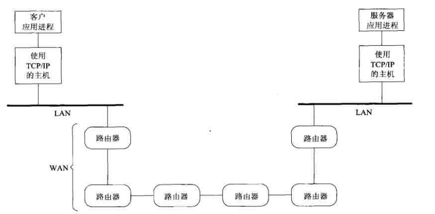
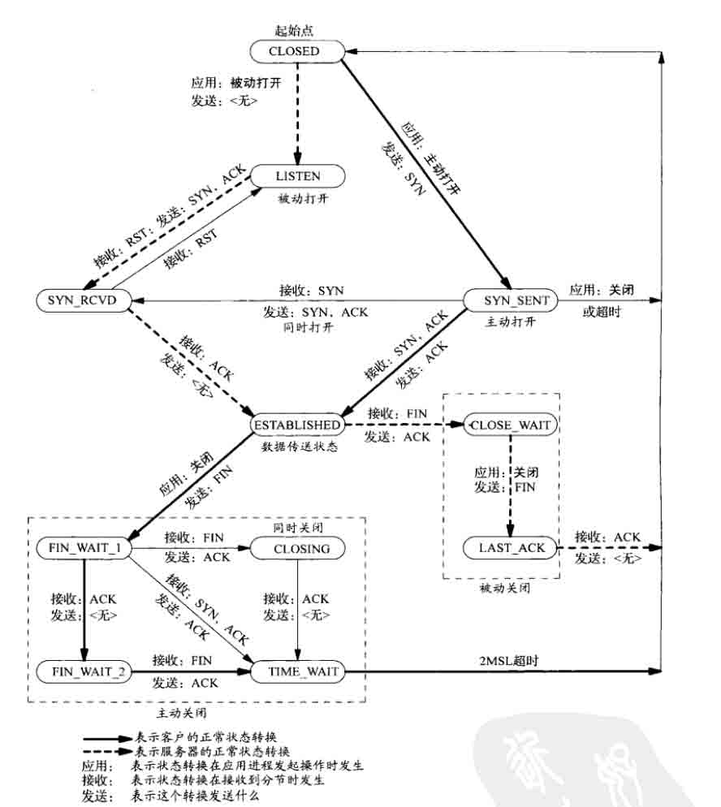
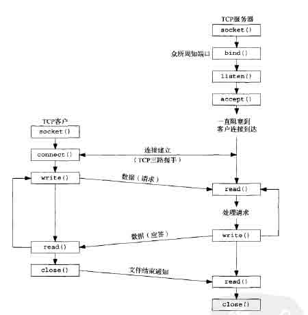

# 第 1 节 套接字联网基本知识

## 一、实验简介

本实验目的在于提供套接字联网的基本知识，为聊天室程序提供预备预备知识。

### 1.1 知识点

*   TCP/IP 协议族
*   套接字编程概念
*   套接字相关函数

## 二、TCP/IP 协议族基本知识

### 2.1 常见的网络拓扑

两台主机通信的过程：应用进程产生消息，经由主机的 TCP/IP 协议栈发送到局域网（LAN），最后经过广域网（目前最大的广域网的因特网）中的网络设备（路由器）传给目的主机所在的局域网（LAN），最后经过局域网（LAN）将报文传送个目的主机，经由主机 TCP/IP 协议栈处理，将消息递交给目的应用程序。网络拓扑如下：



*   图中路由器是网络中的架构设备，是因特网的组成部分。

*   图片引用自 [《UNIX 环境高级编程》](https://book.douban.com/subject/1788421/)

### 2.2 OSI 和 TCP/IP 分层模型

OSI 模型是国际化标准组织定义的七层模型，和现行的 TCP/IP 协议族是等价的。OSI 的顶上三层等价于 TCP/IP 协议族的应用层（典型的有 Web、Telnet、FTP 等应用）。 OSI 底下两层等价于 TCP/IP 协议族中随系统提供的设备驱动程序和硬件。


*   基于套接字的编程所处的位置是 TCP/IP 协议族应用层和传输层（TCP、UDP）的交界处。

*   为什么套接字提供的是从 OSI 模型的顶上三层（TCP/IP 协议族的应用层）进入传输层的接口？两个原因如下：

1.  顶上三层处理具体网络应用的所有细节，却对通信细节了解很少；底下四层对具体网络应用了解不多，却处理所有的通信细节。

2.  顶上三层通常构成所谓的用户进程，底下四层却通常作为操作系统内核的一部分提供（Unix 与其他现代操作系统都提供分隔用户进程与内核的机制）由此可见，第 4 层和第 5 层之间的接口是构建 API 的自然位置。

### 2.3 TCP 状态转移

TCP 是一个有限状态机，TCP 为一个连接定义了 11 中状态，并且 TCP 规则规定如何基于当前状态及该状态下所连接的分组从一个状态转换到另一个状态。例如：客户机的 TCP 连接状态经历的过程如下：首先处于起始点（CLOSE）状态，然后客户机主动打开，会转移到 SYN_SENT 状态。如果客户机接收到来自服务器的 SYN,ACK 报文，则发送 ACK 确认消息，并转移至 ESTABLISHED 状态，就可以收发消息了。



*   粗实线表示通常的客户状态转换，用粗虚线表示通常的服务器状态转换。

*   图片引用自 [《UNIX 环境高级编程》](https://book.douban.com/subject/1788421/)

### 2.4 TCP 的分组交换流程

站在 Linux 系统编程的角度来看 TCP 协议栈的状态转移分为三个阶段讲解：

1.  三次握手建立连接阶段：首先由客户机调用 `connect` 函数发起主动连接，激发 TCP 协议栈发送 SYN 报文；服务器协议栈收到该 SYN 报文后, 发送给处于 LISTEN 状态的套接字，应用进程通过 `accept` 函数激发 TCP 协议栈发送 SYN+ACK 报文，接受连接请求；客户机收到服务器 SYN+ACK 报文后发送确认 ACK 报文，进入 ESTABLISHED 状态；当服务器收到客户机 ACK 报文后，也进入 ESTABLISHED 状态，`accept` 函数返回。

2.  数据传输阶段：这一阶段主要的任务就是通过调用 `read`，`write` 函数收发消息。

3.  四次挥手断开连接阶段：客户端发送一个 FIN，用来关闭客户到服务器的数据传送；服务器收到这个 FIN，它发回一个 ACK，确认序号为收到的序号加 1。和 SYN 一样，一个 FIN 将占用一个序号；服务器关闭与客户端的连接，发送一个 FIN 给客户端；客户端发回 ACK 报文确认，并将确认序号设置为收到序号加 1。


*   本项目的第二和第三个实验的编程将基于该流程进行。客户机创建套接字（`socket`），与服务器连接（`connnect`），成功后和内核 TCP 协议栈进行读写交互（`write`、`read`）来收发信息。
*   服务器创建套接字（`socket`）、绑定到特定的服务器 IP 地址和端口（`bind`），然后将其设置为监听客户请求的状态（`listen`）。如果有来自客户机的请求，则接收连接（`accept`），成功后和内核 TCP 协议栈进行读写交互（`write`、`read`）来收发信息。

## 三、套接字联网有关的函数调用

### 3.1 `socket`

```cpp
int  socket(int protofamily, int type, int protocol);//返回 sockfd,sockfd 是描述符。 
```

*   功能： `socket` 函数对应于普通文件的打开操作。普通文件的打开操作返回一个文件描述字，而 `socket()` 用于创建一个 `socket` 描述符（socket descriptor），它唯一标识一个 `socket`。这个 `socket` 描述字跟文件描述符一样，后续的操作都有用到它，把它作为参数，通过它来进行一些读写操作。

*   参数：

1.  `protofamily`：即协议域，又称为协议族（family）。常用的协议族有，`AF_INET`(IPV4)、`AF_INET6`(IPV6)、`AF_LOCAL`（或称 `AF_UNIX`，Unix 域 socket）、`AF_ROUTE`等等。协议族决定了 socket 的地址类型，在通信中必须采用对应的地址，如 `AF_INET` 决定了要用 `ipv4` 地址（32 位的）与端口号（16 位的）的组合、`AF_UNIX` 决定了要用一个绝对路径名作为地址。

2.  `type`：指定 socket 类型。常用的 socket 类型有，`SOCK_STREAM`、`SOCK_DGRAM`、`SOCK_RAW`、`SOCK_PACKET`、`SOCK_SEQPACKET`等等。

3.  `protocol`：故名思意，就是指定协议。常用的协议有，`IPPROTO_TCP`、`IPPTOTO_UDP`、`IPPROTO_SCTP`、`IPPROTO_TIPC` 等，它们分别对应 TCP 传输协议、UDP 传输协议、STCP 传输协议、TIPC 传输协议。

### 3.2 `bind`

```cpp
int bind(int sockfd, const struct sockaddr *addr, socklen_t addrlen); 
```

*   功能： `bind()` 函数把一个地址族中的特定地址赋给 socket。例如对应 `AF_INET`、`AF_INET6` 就是把一个 ipv4 或 ipv6 地址和端口号组合赋给 socket。

-参数：

1.  `sockfd`：即 socket 描述字，它是通过 `socket()` 函数创建了，唯一标识一个 socket。`bind()` 函数就是将给这个描述字绑定一个名字。

2.  `addr`：一个 `const struct sockaddr *` 指针，指向要绑定给 sockfd 的协议地址。这个地址结构根据地址创建 socket 时的地址协议族的不同而不同。

ipv4 对应的是：

```cpp
 struct sockaddr_in {
    sa_family_t    sin_family; /* address family: AF_INET */
    in_port_t      sin_port;   /* port in network byte order */
    struct in_addr sin_addr;   /* internet address */
};
/* Internet address. */
struct in_addr {
    uint32_t       s_addr;     /* address in network byte order */
}; 
```

ipv6 对应的是：

```cpp
 struct sockaddr_in6 { 
    sa_family_t     sin6_family;   /* AF_INET6 */ 
    in_port_t       sin6_port;     /* port number */ 
    uint32_t        sin6_flowinfo; /* IPv6 flow information */ 
    struct in6_addr sin6_addr;     /* IPv6 address */ 
    uint32_t        sin6_scope_id; /* Scope ID (new in 2.4) */ 
};

struct in6_addr { 
    unsigned char   s6_addr[16];   /* IPv6 address */ 
}; 
```

Unix 域对应的是：

```cpp
 #define UNIX_PATH_MAX    108

struct sockaddr_un { 
    sa_family_t sun_family;               /* AF_UNIX */ 
    char        sun_path[UNIX_PATH_MAX];  /* pathname */ 
}; 
```

1.  addrlen：对应的是地址的长度。

### 3.3 `listen`

```cpp
int listen(int sockfd, int backlog); 
```

*   `listen` 函数的第一个参数即为要监听的 socket 描述符，第二个参数为相应 socket 可以排队的最大连接个数。`socket()` 函数创建的 socket 默认是一个主动类型的，`listen` 函数将 socket 变为被动类型的，等待客户的连接请求。

### 3.4 `connect`

```cpp
int connect(int sockfd, const struct sockaddr *addr, socklen_t addrlen); 
```

`connect` 函数的第一个参数即为客户端的 socket 描述符，第二参数为服务器的 socket 地址，第三个参数为 socket 地址的长度。客户端通过调用 `connect` 函数来建立与 TCP 服务器的连接。

### 3.5 `accept`

```cpp
int accept(int sockfd, struct sockaddr *addr, socklen_t *addrlen); //返回连接 connect_fd 
```

*   功能：
    TCP 服务器端依次调用 `socket()`、`bind()`、`listen()` 之后，就会监听指定的 socket 地址了。TCP 客户端依次调用 `socket()`、`connect()` 之后就向 TCP 服务器发送了一个连接请求。TCP 服务器监听到这个请求之后，就会调用 `accept()` 函数取接收请求，这样连接就建立好了。之后就可以开始网络 I/O 操作了，即类同于普通文件的读写 I/O 操作。

*   参数：

1.  参数 `sockfd` 参数 `sockfd` 就是上面解释中的监听套接字，这个套接字用来监听一个端口，当有一个客户与服务器连接时，它使用这个一个端口号，而此时这个端口号正与这个套接字关联。当然客户不知道套接字这些细节，它只知道一个地址和一个端口号。

2.  参数 `addr` 这是一个结果参数，它用来接受一个返回值，这返回值指定客户端的地址，当然这个地址是通过某个地址结构来描述的，用户应该知道这一个什么样的地址结构。如果对客户的地址不感兴趣，那么可以把这个值设置为 `NULL`。

3.  参数 `len` 如同大家所认为的，它也是结果的参数，用来接受上述 `addr` 的结构的大小的，它指明 `addr` 结构所占有的字节个数。同样的，它也可以被设置为 `NULL`。 如果 `accept` 成功返回，则服务器与客户已经正确建立连接了，此时服务器通过 `accept` 返回的套接字来完成与客户的通信。

## 四、实验总结

本实验讲解了套接字联网的基本知识，并细致的讲解了几个重要的套接字函数。

*   本实验的知识点总结如下图：

客户机创建套接字（`socket`），与服务器连接（`connnect`），成功后和内核 TCP 协议栈进行读写交互（`write`、`read`）来收发信息。
服务器创建套接字（`socket`）、绑定到特定的服务器 IP 地址和端口（`bind`），然后将其设置为监听客户请求的状态（`listen`）。如果有来自客户机的请求，则接收连接（`accept`），成功后和内核 TCP 协议栈进行读写交互（`write`、`read`）来收发信息。



*   图片引用自 [《UNIX 环境高级编程》](https://book.douban.com/subject/1788421/)

## 参考资料

*   [《UNIX 环境高级编程》](https://book.douban.com/subject/1788421/)