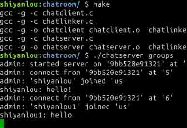

# 第 2 节 聊天室服务器端程序

## 一、实验简介

《聊天室服务器端程序》 实验利用套接字编程模型实现一个聊天室服务器软件。通过该项目的学习，可以学习 Linux 网络编程，Linux 多进程编程等知识。

### 1.1 知识点

*   `select` 函数实现高并发的 IO
*   客户机服务器模型
*   套接字编程相关函数

### 1.2 效果截图



*   源码可以在 https://labfile.oss.aliyuncs.com/courses/602/chatroom.zip 下载

### 1.3 客户/服务器模型

大多数网络应用按照划分成客户（client）和服务器（server）来组织的。在设计网络应用时，确定总是由客户发起请求往往能够简化协议和程序本身。通常客户每次只与一个服务器通信，在该项目实现的聊天室服务端程序是基于下图的模型，客户发起通信的大概流程是：首先客户 1 发送消息到聊天室服务器，然后由该聊天室服务器广播该消息到同一个聊天室的其他成员，这样就到达聊天室所有成员都可以共享聊天消息。


## 二、main 函数设计

### 2.1 初始化

首先 main 函数应该创建一个套接字描述符，然后绑定到特定端口，最后设置该套接字作为监听套接字。代码如下：

```cpp
servsock = startserver(); 
```

*   `startserver` 函数首先声明一个 socket 描述符 `sd`,然后获取套接字描述符值 `sd = socket(PF_INET, SOCK_STREAM, 0)`。

*   然后借助于地址结构，将该套接字绑定在一个本机 IP 和特定端口上：

```cpp
struct sockaddr_in server_address;
  server_address.sin_family = AF_INET;
  server_address.sin_addr.s_addr = htonl(INADDR_ANY); /* 通配地址 INADDR_ANY 表示 IP 地址为 0.0.0.0，
                                                      内核在套接字被连接后选择一个本地地址
                                                      htonl 函数 用于将 INADDR_ANY 转换为网络字节序 */
  server_address.sin_port = htons(0);  /* 指派为通配端口 0，调用 bind 函数后内核将任意选择一个临时端口 */

  bind(sd, (struct sockaddr *) &server_address, sizeof(server_address)); 
```

*   最后将套接字设置为监听状态 `listen(sd, 20)`。

*   `startserver` 定义在文件 "chatlinker.c" 中。完整代码如下：

```cpp
int startserver()
{
  int     sd;      /* socket 描述符 */
  int     myport;  /* 服务器端口 */
  const char *  myname;  /* 本地主机的全称 */

  char       linktrgt[MAXNAMELEN];
  char       linkname[MAXNAMELEN];

  /*
    调用 socket 函数创建 TCP socket 描述符
  */
  sd = socket(PF_INET, SOCK_STREAM, 0);

  /*
    调用 bind 函数将一个本地地址指派给 socket
  */

  struct sockaddr_in server_address;
  server_address.sin_family = AF_INET;
  server_address.sin_addr.s_addr = htonl(INADDR_ANY); /* 通配地址 INADDR_ANY 表示 IP 地址为 0.0.0.0，
                                                      内核在套接字被连接后选择一个本地地址
                                                      htonl 函数 用于将 INADDR_ANY 转换为网络字节序 */
  server_address.sin_port = htons(0);  /* 指派为通配端口 0，调用 bind 函数后内核将任意选择一个临时端口 */

  bind(sd, (struct sockaddr *) &server_address, sizeof(server_address));

  /* 调用 listen 将服务器端 socket 描述符 sd 设置为被动地监听状态，并设置接受队列的长度为 20 */
  listen(sd, 20);

  /*
    调用 getsockname、gethostname 和 gethostbyname 确定本地主机名和服务器端口号
  */

  char hostname[MAXNAMELEN];

  if (gethostname(hostname, sizeof hostname) != 0)
      perror("gethostname");

  struct hostent* h;
    h = gethostbyname(hostname);

  int len = sizeof(struct sockaddr);

  getsockname(sd, (struct sockaddr *) &server_address, &len);

  myname = h->h_name;
  myport = ntohs(server_address.sin_port);

  /* 在家目录下创建符号链接'.chatport'指向 linktrgt */
  sprintf(linktrgt, "%s:%d", myname, myport);
  sprintf(linkname, "%s/%s", getenv("HOME"), PORTLINK); /* 在头文件 common.h 中：
                                                        #define PORTLINK ".chatport" */
  if (symlink(linktrgt, linkname) != 0) {
    fprintf(stderr, "error : server already exists\n");
    return(-1);
  }

  /* 准备接受客户端请求 */
  printf("admin: started server on '%s' at '%d'\n",
     myname, myport);
  return(sd);
} 
```

### 2.2 循环监听所有已连接套接字和服务器监听套接字的读就绪条件

这里用到的是 `select` 函数:

```cpp
select(maxsd + 1, &tempset, NULL, NULL, NULL); 
```

*   `tempset` 维护者服务器端所有已连接套接字和服务器的监听套接字。当有任何一个套接字读就绪条件满足的时候，`select` 返回，并且将读就绪条件满足的套接字在套接字描述符集合`tempset` 对应位置置位。

### 2.3 根据可读条件就绪的是客户机套接字 or 监听套接字 => 采取两种不同的动作

*   如果是客户端套接字可读就绪：调用 `recvpkt`(定义在"chatlinker.c"中)接收数据包。代码如下：

```cpp
Packet *recvpkt(int sd)
{
  Packet *pkt;

  /* 动态分配内存 */
  pkt = (Packet *) calloc(1, sizeof(Packet));
  if (!pkt) {
    fprintf(stderr, "error : unable to calloc\n");
    return(NULL);
  }

  /* 读取消息类型 */
  if (!readn(sd, (char *) &pkt->type, sizeof(pkt->type))) {
    free(pkt);
    return(NULL);
  }

  /* 读取消息长度 */
  if (!readn(sd, (char *) &pkt->lent, sizeof(pkt->lent))) {
    free(pkt);
    return(NULL);
  }
  pkt->lent = ntohl(pkt->lent);

  /* 为消息内容分配空间 */
  if (pkt->lent > 0) {
    pkt->text = (char *) malloc(pkt->lent);
    if (!pkt) {
      fprintf(stderr, "error : unable to malloc\n");
      return(NULL);
    }

    /* 读取消息文本 */
    if (!readn(sd, pkt->text, pkt->lent)) {
      freepkt(pkt);
      return(NULL);
    }
  }
  return(pkt);
} 
```

*   然后根据数据包的类型采取不同的动作：

```cpp
switch (pkt->type) 
    {
        case LIST_GROUPS :
            listgroups(sock);
            break;
        case JOIN_GROUP :
            gname = pkt->text;
            mname = gname + strlen(gname) + 1;
            joingroup(sock, gname, mname);
            break;
        case LEAVE_GROUP :
            leavegroup(sock);
            break;
        case USER_TEXT :
            relaymsg(sock, pkt->text);
            break;
    } 
```

*   如果是监听套接字的读条件就绪，说明有来自客户端的连接请求。应该调用 `accept` 函数接受请求。代码如下：

```cpp
csd = accept(servsock, (struct sockaddr *) &remoteaddr, &addrlen); 
```

*   然后将新的已连接套接字加入描述符集合：

```cpp
FD_SET(csd, &livesdset); 
```

## 三、initgroups

初始化函数主要功能用于将聊天室配置文件中的信息（聊天室名字，容量）读入服务器进程维护的数据结构 `Group` 中。

*   这部分的代码如下：

```cpp
int initgroups(char *groupsfile)
{
    FILE *fp;
    char name[MAXNAMELEN];
    int capa;
    int grid;

    /* 打开存储聊天室信息的配置文件 */
    fp = fopen(groupsfile, "r");
    if (!fp) 
    {
        fprintf(stderr, "error : unable to open file '%s'\n", groupsfile);
        return(0);
    }

    /* 从配置文件中读取聊天室的数量 */
    fscanf(fp, "%d", &ngroups);

    /* 为所有的聊天室分配内存空间 */
    group = (Group *) calloc(ngroups, sizeof(Group));
    if (!group) 
    {
        fprintf(stderr, "error : unable to calloc\n");
        return(0);
    }

    /* 从配置文件读取聊天室信息 */
    for (grid =0; grid < ngroups; grid++) 
    {
        /* 读取聊天室名和容量 */
        if (fscanf(fp, "%s %d", name, &capa) != 2)
        {
            fprintf(stderr, "error : no info on group %d\n", grid + 1);
            return(0);
        }

    /* 将信息存进 group 结构 */
        group[grid].name = strdup(name);
        group[grid].capa = capa;
        group[grid].occu = 0;
        group[grid].mems = NULL;
    }
    return(1);
} 
```

## 四、其他函数简介

`int findgroup(char *name) /* 通过聊天室名字找到聊天室 ID */`

`Member *findmemberbyname(char *name) /* 通过室成员名字找到室成员的信息 */`

`Member *findmemberbysock(int sock) /* 通过 socket 描述符找到室成员的信息 */`

`int listgroups(int sock) /* 把所有聊天室的信息发给客户端 */`

`int joingroup(int sock, char *gname, char *mname) /* 加入聊天室 */`

`int leavegroup(int sock) /* 离开聊天室 */`

`int relaymsg(int sock, char *text) /* 把成员的消息发送给其他聊天室成员 */`

## 五、实验总结

通过简单的对套接字描述符，实现了一个高并发的服务器程序。

*   本项目的服务器完整代码如下：

```cpp
/* 聊天室服务器端程序 */

#include <stdlib.h>
#include <stdio.h>
#include <fcntl.h>
#include <string.h>
#include <sys/types.h>
#include <sys/socket.h>
#include <netinet/in.h>
#include <arpa/inet.h>
#include <netdb.h>
#include <time.h>
#include <errno.h>
#include <signal.h>
#include "common.h"

/* 聊天室成员信息 */
typedef struct _member 
{
    /* 成员姓名 */
    char *name;

    /* 成员 socket 描述符 */
    int sock;

    /* 成员所属聊天室 */
    int grid;

    /* 下一个成员 */
    struct _member *next;

    /* 前一个成员 */
    struct _member *prev;

} Member;

/* 聊天室信息 */
typedef struct _group 
{
    /* 聊天室名字 */
    char *name;

    /* 聊天室最大容量（人数） */
    int capa;

    /* 当前占有率（人数） */
    int occu;

    /* 记录聊天室内所有成员信息的链表 */
    struct _member *mems;

} Group;

/* 所有聊天室的信息表 */
Group *group;
int ngroups;

/* 通过聊天室名字找到聊天室 ID */
int findgroup(char *name)
{
    int grid; /* 聊天室 ID */

    for (grid = 0; grid < ngroups; grid++)
    {
        if(strcmp(group[grid].name, name) == 0)
            return(grid);
    }
    return(-1);
}

/* 通过室成员名字找到室成员的信息 */
Member *findmemberbyname(char *name)
{
    int grid; /* 聊天室 ID */

    /* 遍历每个组 */
    for (grid=0; grid < ngroups; grid++) 
    {
        Member *memb;

        /* 遍历改组的所有成员 */
        for (memb = group[grid].mems; memb ; memb = memb->next)
        {
            if (strcmp(memb->name, name) == 0)
            return(memb);
        }
    }
    return(NULL);
}

/* 通过 socket 描述符找到室成员的信息 */
Member *findmemberbysock(int sock)
{
    int grid; /* 聊天室 ID */

    /* 遍历所有的聊天室 */
    for (grid=0; grid < ngroups; grid++) 
    {
        Member *memb;

        /* 遍历所有的当前聊天室成员 */
        for (memb = group[grid].mems; memb; memb = memb->next)
        {
            if (memb->sock == sock)
            return(memb);
        }
    }
    return(NULL);
}

/* 退出前的清理工作 */
void cleanup()
{
  char linkname[MAXNAMELEN];

  /* 取消文件链接 */
  sprintf(linkname, "%s/%s", getenv("HOME"), PORTLINK);
  unlink(linkname);
  exit(0);
}

/* 主函数程序 */
main(int argc, char *argv[])
{
    int    servsock;   /* 聊天室服务器端监听 socket 描述符 */
    int    maxsd;        /* 连接的客户端 socket 描述符的最大值 */
    fd_set livesdset, tempset; /* 客户端 sockets 描述符集 */

    /* 用户输入合法性检测 */
    if (argc != 2) 
        {
            fprintf(stderr, "usage : %s <groups-file>\n", argv[0]);
            exit(1);
        }

    /* 调用 initgroups 函数，初始化聊天室信息 */
    if (!initgroups(argv[1]))
        exit(1);

    /* 设置信号处理函数 */
    signal(SIGTERM, cleanup);
    signal(SIGINT, cleanup);

    /* 准备接受请求 */
    servsock = startserver(); /* 定义在 "chatlinker.c" 文件中，
                            主要完成创建服务器套接字，绑定端口号，
                            并设置把套接字为监听状态 */
    if (servsock == -1)
        exit(1);

    /* 初始化 maxsd */
    maxsd = servsock;

    /* 初始化描述符集 */
    FD_ZERO(&livesdset); /* 清理 livesdset 的所有的比特位*/
    FD_ZERO(&tempset);  /* 清理 tempset 的所有的比特位 */
    FD_SET(servsock, &livesdset); /* 打开服务器监听套接字的套接字
                                  描述符 servsock 对应的 fd_set 比特位 */

    /* 接受并处理来自客户端的请求 */
    while (1) 
        {
            int sock;    /* 循环变量 */

            /* 特别注意 tempset 作为 select 参数时是一个 "值-结果" 参数，
            select 函数返回时，tempset 中打开的比特位只是读就绪的 socket
            描述符，所以我们每次循环都要将其更新为我们需要内核测试读就绪条件
            的 socket 描述符集合 livesdset */
            tempset = livesdset; 

            /* 调用 select 函数等待已连接套接字上的包和来自
            新的套接字的链接请求 */
            select(maxsd + 1, &tempset, NULL, NULL, NULL);

            /* 循环查找来自客户机的请求 */
            for (sock=3; sock <= maxsd; sock++)
                {
                    /* 如果是服务器监听 socket，则跳出接收数据包环节，执行接受连接 */
                    if (sock == servsock)
                        continue;

                    /* 有来自客户 socket 的消息 */
                    if(FD_ISSET(sock, &tempset))
                    {
                        Packet *pkt;

                        /* 读消息 */
                        pkt = recvpkt(sock); /* 函数 recvpkt 定义在"chatlinker.c" */

                        if (!pkt)
                            {
                                /* 客户机断开了连接 */
                                char *clientname;  /* host name of the client */

                                /* 使用 gethostbyaddr，getpeername 函数得到 client 的主机名 */
                                socklen_t len;
                                struct sockaddr_in addr;
                                len = sizeof(addr);
                                if (getpeername(sock, (struct sockaddr*) &addr, &len) == 0) 
                                    {
                                        struct sockaddr_in *s = (struct sockaddr_in *) &addr;
                                        struct hostent *he;
                                        he = gethostbyaddr(&s->sin_addr, sizeof(struct in_addr), AF_INET);
                                        clientname = he->h_name;
                                    }
                                else
                                    printf("Cannot get peer name");

                                printf("admin: disconnect from '%s' at '%d'\n",
                                    clientname, sock);

                                /* 从聊天室删除该成员 */
                                leavegroup(sock);

                                /* 关闭套接字 */
                                close(sock);

                                /* 清除套接字描述符在 livesdset 中的比特位 */
                                FD_CLR(sock, &livesdset);

                            } 
                        else 
                            {
                                char *gname, *mname;

                                /* 基于消息类型采取行动 */
                                switch (pkt->type) 
                                {
                                    case LIST_GROUPS :
                                        listgroups(sock);
                                        break;
                                    case JOIN_GROUP :
                                        gname = pkt->text;
                                        mname = gname + strlen(gname) + 1;
                                        joingroup(sock, gname, mname);
                                        break;
                                    case LEAVE_GROUP :
                                        leavegroup(sock);
                                        break;
                                    case USER_TEXT :
                                        relaymsg(sock, pkt->text);
                                        break;
                                }

                                /* 释放包结构 */
                                freepkt(pkt);
                            }
                    }
                }

            struct sockaddr_in remoteaddr; /* 客户机地址结构 */
            socklen_t addrlen;

            /* 有来自新的客户机的连接请求请求 */
            if(FD_ISSET(servsock, &tempset))
            {
                int  csd; /* 已连接的 socket 描述符 */

                /* 接受一个新的连接请求 */
                addrlen = sizeof remoteaddr;
                csd = accept(servsock, (struct sockaddr *) &remoteaddr, &addrlen);

                /* 如果连接成功 */
                if (csd != -1) 
                    {
                        char *clientname;

                        /* 使用 gethostbyaddr 函数得到 client 的主机名 */
                        struct hostent *h;
                        h = gethostbyaddr((char *)&remoteaddr.sin_addr.s_addr,
                            sizeof(struct in_addr), AF_INET);

                        if (h != (struct hostent *) 0) 
                            clientname = h->h_name;
                        else
                            printf("gethostbyaddr failed\n");

                        /* 显示客户机的主机名和对应的 socket 描述符 */
                        printf("admin: connect from '%s' at '%d'\n",
                            clientname, csd);

                        /* 将该连接的套接字描述符 csd 加入 livesdset */
                        FD_SET(csd, &livesdset);

                        /* 保持 maxsd 记录的是最大的套接字描述符 */
                        if (csd > maxsd)
                            maxsd = csd;
                    }
                else 
                    {
                        perror("accept");
                        exit(0);
                    }
            }
        }
}

/* 初始化聊天室链表 */
int initgroups(char *groupsfile)
{
    FILE *fp;
    char name[MAXNAMELEN];
    int capa;
    int grid;

    /* 打开存储聊天室信息的配置文件 */
    fp = fopen(groupsfile, "r");
    if (!fp) 
    {
        fprintf(stderr, "error : unable to open file '%s'\n", groupsfile);
        return(0);
    }

    /* 从配置文件中读取聊天室的数量 */
    fscanf(fp, "%d", &ngroups);

    /* 为所有的聊天室分配内存空间 */
    group = (Group *) calloc(ngroups, sizeof(Group));
    if (!group) 
    {
        fprintf(stderr, "error : unable to calloc\n");
        return(0);
    }

    /* 从配置文件读取聊天室信息 */
    for (grid =0; grid < ngroups; grid++) 
    {
        /* 读取聊天室名和容量 */
        if (fscanf(fp, "%s %d", name, &capa) != 2)
        {
            fprintf(stderr, "error : no info on group %d\n", grid + 1);
            return(0);
        }

    /* 将信息存进 group 结构 */
        group[grid].name = strdup(name);
        group[grid].capa = capa;
        group[grid].occu = 0;
        group[grid].mems = NULL;
    }
    return(1);
}

/* 把所有聊天室的信息发给客户端 */
int listgroups(int sock)
{
    int      grid;
    char     pktbufr[MAXPKTLEN];
    char *   bufrptr;
    long     bufrlen;

    /* 每一块信息在字符串中用 NULL 分割 */
    bufrptr = pktbufr;
    for (grid=0; grid < ngroups; grid++) 
    {
        /* 获取聊天室名字 */
        sprintf(bufrptr, "%s", group[grid].name);
        bufrptr += strlen(bufrptr) + 1;

        /* 获取聊天室容量 */
        sprintf(bufrptr, "%d", group[grid].capa);
        bufrptr += strlen(bufrptr) + 1;

        /* 获取聊天室占有率 */
        sprintf(bufrptr, "%d", group[grid].occu);
        bufrptr += strlen(bufrptr) + 1;
    }
    bufrlen = bufrptr - pktbufr;

    /* 发送消息给回复客户机的请求 */
    sendpkt(sock, LIST_GROUPS, bufrlen, pktbufr);
    return(1);
}

/* 加入聊天室 */
int joingroup(int sock, char *gname, char *mname)
{
    int       grid;
    Member *  memb;

    /* 根据聊天室名获得聊天室 ID */
    grid = findgroup(gname);
    if (grid == -1) 
    {
        char *errmsg = "no such group";
        sendpkt(sock, JOIN_REJECTED, strlen(errmsg), errmsg); /* 发送拒绝加入消息 */
        return(0);
    }

    /* 检查是否聊天室成员名字已被占用 */
    memb = findmemberbyname(mname);

    /* 如果聊天室成员名已存在，则返回错误消息 */
    if (memb) 
    {
        char *errmsg = "member name already exists";
        sendpkt(sock, JOIN_REJECTED, strlen(errmsg), errmsg); /* 发送拒绝加入消息 */
        return(0);
    }

    /* 检查聊天室是否已满 */
    if (group[grid].capa == group[grid].occu) 
    {
        char *errmsg = "room is full";
        sendpkt(sock, JOIN_REJECTED, strlen(errmsg), errmsg); /* 发送拒绝加入消息 */
        return(0);
    }

    /* 为聊天室新成员申请内存空间来存储成员信息 */
    memb = (Member *) calloc(1, sizeof(Member));
    if (!memb) 
    {
        fprintf(stderr, "error : unable to calloc\n");
        cleanup();
    }
    memb->name = strdup(mname);
    memb->sock = sock;
    memb->grid = grid;
    memb->prev = NULL;
    memb->next = group[grid].mems;
    if (group[grid].mems) 
    {
        group[grid].mems->prev = memb;
    }
    group[grid].mems = memb;
    printf("admin: '%s' joined '%s'\n", mname, gname);

    /* 更新聊天室的在线人数 */
    group[grid].occu++;

    sendpkt(sock, JOIN_ACCEPTED, 0, NULL); /* 发送接受成员消息 */
    return(1);
}

/* 离开聊天室 */
int leavegroup(int sock)
{
    Member *memb;

    /* 得到聊天室成员信息 */
    memb = findmemberbysock(sock);
    if (!memb) 
        return(0);

    /* 从聊天室信息结构中删除 memb 成员 */
    if (memb->next) 
        memb->next->prev = memb->prev; /* 在聊天室成员链表的尾部 */

    /* remove from ... */
    if (group[memb->grid].mems == memb) /* 在聊天室成员链表的头部 */
        group[memb->grid].mems = memb->next;

    else 
        memb->prev->next = memb->next; /* 在聊天室成员链表的中部 */

    printf("admin: '%s' left '%s'\n",
        memb->name, group[memb->grid].name);

    /* 更新聊天室的占有率 */
    group[memb->grid].occu--;

    /* 释放内存 */
    free(memb->name);
    free(memb);
    return(1);
}

/* 把成员的消息发送给其他聊天室成员 */
int relaymsg(int sock, char *text)
{
    Member *memb;
    Member *sender;
    char pktbufr[MAXPKTLEN];
    char *bufrptr;
    long bufrlen;

    /* 根据 socket 描述符获得该聊天室成员的信息 */
    sender = findmemberbysock(sock);
    if (!sender)
    {
        fprintf(stderr, "strange: no member at %d\n", sock);
        return(0);
    }

    /* 把发送者的姓名添加到消息文本前边 */
    bufrptr = pktbufr;
    strcpy(bufrptr,sender->name);
    bufrptr += strlen(bufrptr) + 1;
    strcpy(bufrptr, text);
    bufrptr += strlen(bufrptr) + 1;
    bufrlen = bufrptr - pktbufr;

    /* 广播该消息给该成员所在聊天室的其他成员 */
    for (memb = group[sender->grid].mems; memb; memb = memb->next)
    {
        /* 跳过发送者 */
        if (memb->sock == sock) 
            continue;
        sendpkt(memb->sock, USER_TEXT, bufrlen, pktbufr); /* 给聊天室其他成员
                                                          发送消息（TCP 是全双工的） */
    }
    printf("%s: %s", sender->name, text);
    return(1);
} 
```

*   "chatlinker.c" 中的代码：

```cpp
/* 连接服务器和客户机的函数 */

#include <stdio.h>
#include <fcntl.h>
#include <string.h>
#include <strings.h>
#include <sys/types.h>
#include <sys/socket.h>
#include <netinet/in.h>
#include <arpa/inet.h>
#include <netdb.h>
#include <time.h>
#include <errno.h>
#include <stdlib.h>
#include "common.h"

/*
  为服务器接收客户端请求做准备，
  正确返回 socket 文件描述符
  错误返回 -1
*/
int startserver()
{
  int     sd;      /* socket 描述符 */
  int     myport;  /* 服务器端口 */
  const char *  myname;  /* 本地主机的全称 */

  char       linktrgt[MAXNAMELEN];
  char       linkname[MAXNAMELEN];

  /*
    调用 socket 函数创建 TCP socket 描述符
  */
  sd = socket(PF_INET, SOCK_STREAM, 0);

  /*
    调用 bind 函数将一个本地地址指派给 socket
  */

  struct sockaddr_in server_address;
  server_address.sin_family = AF_INET;
  server_address.sin_addr.s_addr = htonl(INADDR_ANY); /* 通配地址 INADDR_ANY 表示 IP 地址为 0.0.0.0，
                                                      内核在套接字被连接后选择一个本地地址
                                                      htonl 函数 用于将 INADDR_ANY 转换为网络字节序 */
  server_address.sin_port = htons(0);  /* 指派为通配端口 0，调用 bind 函数后内核将任意选择一个临时端口 */

  bind(sd, (struct sockaddr *) &server_address, sizeof(server_address));

  /* 调用 listen 将服务器端 socket 描述符 sd 设置为被动地监听状态，并设置接受队列的长度为 20 */
  listen(sd, 20);

  /*
    调用 getsockname、gethostname 和 gethostbyname 确定本地主机名和服务器端口号
  */

  char hostname[MAXNAMELEN];

  if (gethostname(hostname, sizeof hostname) != 0)
      perror("gethostname");

  struct hostent* h;
    h = gethostbyname(hostname);

  int len = sizeof(struct sockaddr);

  getsockname(sd, (struct sockaddr *) &server_address, &len);

  myname = h->h_name;
  myport = ntohs(server_address.sin_port);

  /* 在家目录下创建符号链接'.chatport'指向 linktrgt */
  sprintf(linktrgt, "%s:%d", myname, myport);
  sprintf(linkname, "%s/%s", getenv("HOME"), PORTLINK); /* 在头文件 common.h 中：
                                                        #define PORTLINK ".chatport" */
  if (symlink(linktrgt, linkname) != 0) {
    fprintf(stderr, "error : server already exists\n");
    return(-1);
  }

  /* 准备接受客户端请求 */
  printf("admin: started server on '%s' at '%d'\n",
     myname, myport);
  return(sd);
}

/*
  和服务器建立连接，正确返回 socket 描述符，
  失败返回  -1
*/
int hooktoserver()
{
    int sd;                 

    char linkname[MAXNAMELEN];
    char linktrgt[MAXNAMELEN];
    char *servhost;
    char *servport;
    int bytecnt;

  /* 获取服务器地址 */
  sprintf(linkname, "%s/%s", getenv("HOME"), PORTLINK);
  bytecnt = readlink(linkname, linktrgt, MAXNAMELEN);
  if (bytecnt == -1) 
    {
        fprintf(stderr, "error : no active chat server\n");
        return(-1);
    }

    linktrgt[bytecnt] = '\0';

    /* 获得服务器 IP 地址和端口号 */
    servport = index(linktrgt, ':');
    *servport = '\0';
    servport++;
    servhost = linktrgt;

    /* 获得服务器 IP 地址的 unsigned short 形式 */
    unsigned short number = (unsigned short) strtoul(servport, NULL, 0);

    /*
    调用函数 socket 创建 TCP 套接字
    */

    sd = socket(AF_INET, SOCK_STREAM, 0);

    /*
    调用 gethostbyname() 和 connect()连接 'servhost' 的 'servport' 端口
    */
    struct hostent *hostinfo;
    struct sockaddr_in address;

    hostinfo = gethostbyname(servhost); /* 得到服务器主机名 */
    address.sin_addr = *(struct in_addr *) *hostinfo->h_addr_list;
    address.sin_family = AF_INET;
    address.sin_port = htons(number);

    if (connect(sd, (struct sockaddr *) &address, sizeof(address)) < 0)
    {
        perror("connecting");
        exit(1);
    }

    /* 连接成功 */
    printf("admin: connected to server on '%s' at '%s'\n",
        servhost, servport);
    return(sd);
}

/* 从内核读取一个套接字的信息 */
int readn(int sd, char *buf, int n)
{
  int     toberead;
  char *  ptr;

  toberead = n;
  ptr = buf;
  while (toberead > 0) {
    int byteread;

    byteread = read(sd, ptr, toberead);
    if (byteread <= 0) {
      if (byteread == -1)
    perror("read");
      return(0);
    }

    toberead -= byteread;
    ptr += byteread;
  }
  return(1);
}

/* 接收数据包 */
Packet *recvpkt(int sd)
{
  Packet *pkt;

  /* 动态分配内存 */
  pkt = (Packet *) calloc(1, sizeof(Packet));
  if (!pkt) {
    fprintf(stderr, "error : unable to calloc\n");
    return(NULL);
  }

  /* 读取消息类型 */
  if (!readn(sd, (char *) &pkt->type, sizeof(pkt->type))) {
    free(pkt);
    return(NULL);
  }

  /* 读取消息长度 */
  if (!readn(sd, (char *) &pkt->lent, sizeof(pkt->lent))) {
    free(pkt);
    return(NULL);
  }
  pkt->lent = ntohl(pkt->lent);

  /* 为消息内容分配空间 */
  if (pkt->lent > 0) {
    pkt->text = (char *) malloc(pkt->lent);
    if (!pkt) {
      fprintf(stderr, "error : unable to malloc\n");
      return(NULL);
    }

    /* 读取消息文本 */
    if (!readn(sd, pkt->text, pkt->lent)) {
      freepkt(pkt);
      return(NULL);
    }
  }
  return(pkt);
}

/* 发送数据包 */
int sendpkt(int sd, char typ, long len, char *buf)
{
  char tmp[8];
  long siz;

  /* 把包的类型和长度写入套接字 */
  bcopy(&typ, tmp, sizeof(typ));
  siz = htonl(len);
  bcopy((char *) &siz, tmp+sizeof(typ), sizeof(len));
  write(sd, tmp, sizeof(typ) + sizeof(len));

  /* 把消息文本写入套接字 */
  if (len > 0)
    write(sd, buf, len);
  return(1);
}

/* 释放数据包占用的内存空间 */
void freepkt(Packet *pkt)
{
  free(pkt->text);
  free(pkt);
} 
```

## 参考资料

*   [《UNIX 环境高级编程》](https://book.douban.com/subject/1788421/)