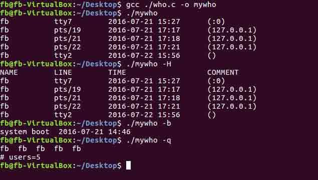

# 第 1 节 C 语言实现 Linux who 命令

## 一、实验简介

UNIX 系统的正常运作需要使用大量与系统有关的数据文件，例如，口令文件 /etc/passwd 和组文件 /etc/group 就是经常被多个程序频繁使用的两个文件。用户每次登陆 UNIX 系统，以及每次执行 `ls -l` 命令时都要使用口令文件。本项目中 《用 C 语言实现 Linux who 命令》 就是这样一个需要调用系统数据文件的程序，只不过调用的是 /var/run/utmp 和 /var/log/wtmp 文件而已。
由于历史原因，这些数据文件都是 ASCII 文本文件，并且使用标准 I/O 库读这些文件。但是，对于较大的系统，顺序扫描口令文件很花费时间，我们需要能够以非 ASCII 文本格式存放这些文件，但仍向使用其他文本格式的应用程序提供接口。对于这些数据文件的可移植性接口的使用是本实验的主题。

### 1.1 知识点

*   对两个系统数据文件 var/run/utmp 和 /var/log/wtmp 的了解
*   访问系统文件的接口函数 `getutent`、`setutent`、 `endutent` 以及改变这些接口访问文件的路径的函数 `utmpname`
*   了解 `utmp` 的结构内容

### 1.2 效果截图



## 二、实验主要步骤一：设计 main 函数

*   本部分的完整代码如下：

main 函数的主要作用是接收命令行传过来的参数，然后根据不同的参数标记不同的变量，以便 `mywho` 能够根据这些标记的变量分类处理。

```cpp
int main(int argc, char *argv[])
{
    int c;
    int ok;

    //分析命令行选项
    while ((c = getopt(argc, argv, "Hqb")) != -1)
    {
        switch (c)
        {
        case 'H':
            opt_H = true;
            break;
        case 'q':
            opt_q = true;
            break;
        case 'b':
            opt_b = true;
            break;
        default:
            exit(1);
        }
    }

    //命令行检错
    if (argc != optind)
        printf("fault command!\n");

    //调用 mywho 程序
    ok = mywho();

    if (!ok)
        return 0;
    else
        exit(1);
} 
```

## 三、实验主要步骤二：设计 mywho 函数

### 3.1 针对 `-q` 选项

这部分处理比较简单，先读取 utmp 文件的数据， 过滤出 `utmp` 结构 `ut_type` 字段为 `USER_PROCESS` 的记录，然后计数。代码如下：

```cpp
while ((um = getutent()))
        {
            /*  利用 utmp 结构的 ut_type 域，过滤出普通进程  */
            if (um->ut_type != USER_PROCESS)
                continue;
            printf("%-2s  ", um->ut_user);
            users += 1;
        }
        printf("\n# users=%d\n", users); 
```

### 3.2 针对 `-H` 选项

这个选项是打印输出的各列的含义，处理简单，代码如下：

```cpp
if (opt_H)
        printf("%-12s%-12s%-20.20s  %s\n", "NAME", "LINE", "TIME", "COMMENT"); 
```

### 3.3 针对 `-b` 选项

该选项目的在于打印系统最后一次 boot 的时间，所以要读取 wtmp 文件。 因为 wtmp 文件保存的数据结构和 utmp 一样，所以访问的方法一样，请参看 utmp 文件的访问接口，再次不在赘述。但是要注意的一点是，`<utmp.h>` 默认的路径为宏 *PATH*UTMP，该宏定义在 `/usr/include/paths.h` 中: `#define _PATH_UTMP "/var/run/utmp`, 所以要用 `utmpname()` 函数设定 wtmp 文件所在的路径,才能正确读到 boot 信息。代码如下:

```cpp
utmpname(_PATH_WTMP); 
```

*   注意这部分要过滤出的是 `BOOT_TIME`。表示 boot 的记录。

*   这部分的完整代码如下：

```cpp
/**mywho 函数是调用系统数据文件的核心程序；
*它首先调用系统数据文件的接口函数，然后逐条将其数据保存下来；
*根据选项的标记为，然后输出不同的信息
*关闭系统数据文件
*/
static int mywho()
{
    /**在系统的数据文件中，提供两个文件 utmp 和 wtmp 两个文件
    * 这两个文件记录的数据结构就是 utmp, 所以要声明一个 utmp 数据结构
    */
    struct utmp *um;

    //用来保存方便人可读的时间字符串
    char timebuf[24];

    //当命令选型为 -q, 用来保存用户数量
    int users = 0;

    //处理命令行参数为 -q 的情况
    if (opt_q)
    {
        /** getutent 函数用来读下一条记录，如果需要，还会打开该文件。
        *返回一个指向 utmp 的指针，当已达文件尾端的时返回空指针。
        */
        while ((um = getutent()))
        {
            /*  利用 utmp 结构的 ut_type 域，过滤出普通进程  */
            if (um->ut_type != USER_PROCESS)
                continue;
            printf("%-2s  ", um->ut_user);
            users += 1;
        }
        printf("\n# users=%d\n", users);
        // 关闭文件
        endutent();
        return 0;
    }

    //打印各栏标题头部
    if (opt_H)
        printf("%-12s%-12s%-20.20s  %s\n", "NAME", "LINE", "TIME", "COMMENT");

    /** 模拟 who -b 打印最后一次 boot 时间
    *这个要用到 wtmp 文件，所以要设置 utmpname(_PATH_WTMP);
    */
    if (opt_b) 
    {
        time_t tm;
        int n = 0;
        utmpname(_PATH_WTMP);

        //记录 wtmp 文件中的 boot 条目
        while (um = getutent())
        {
            /*  利用 utmp 结构的 ut_type 域，过滤出 boot 时间  */
            if (um->ut_type != BOOT_TIME)
                continue;
            n++;
        }

        //重新将 wtmp 文件反绕，从文件开始处读
        setutent();

        //读最后一个 boot 记录
        while (n--) 
        {
            um = getutent();

            //利用 utmp 结构的 ut_type 域，过滤出 boot 时间
            if (um->ut_type != BOOT_TIME)
            {
                n++;
                continue;
            }
        }

        // 时间转换成方便人读的格式
        tm = (time_t)(um->ut_tv.tv_sec);
        strftime(timebuf, 24, "%F %R", localtime(&tm));
        // 打印相关信息
        printf("system boot  %-20.20s\n", timebuf);

        //关闭数据文件
        endutent();
        exit(0);
    }

    //此处处理的是 utmp 文件的内容
    while ((um = getutent()))
    {
        // 利用 utmp 结构的 ut_type 域，过滤出普通进程  
        if (um->ut_type != USER_PROCESS)
            continue;
        time_t tm;
        tm = (time_t)(um->ut_tv.tv_sec);
        strftime(timebuf, 24, "%F %R", localtime(&tm));
        printf("%-12s%-12s%-20.20s  (%s)\n", um->ut_user, um->ut_line, timebuf, um->ut_host);
    }
    endutent();
    return 0;
} 
```

### 3.4 不带任何选项

分别读取 utmp 文件关于用户登陆的信息。

*   这部分的完整代码如下：

```cpp
//此处处理的是 utmp 文件的内容
    while ((um = getutent()))
    {
        // 利用 utmp 结构的 ut_type 域，过滤出普通进程  
        if (um->ut_type != USER_PROCESS)
            continue;
        time_t tm;
        tm = (time_t)(um->ut_tv.tv_sec);
        strftime(timebuf, 24, "%F %R", localtime(&tm));
        printf("%-12s%-12s%-20.20s  (%s)\n", um->ut_user, um->ut_line, timebuf, um->ut_host);
    }
    endutent();
    return 0; 
```

*   注意这部分过滤出的类型为 `USER_PROCESS`。

## 四、实验总结

本项目重点在于从 Linux 系统数据文件中获取信息，这要利用这些良好的系统接口：
`setutent()` 函数打开文件 utmp，并且将文件指针指向文件的最开始。
`getutent()` 函数从文件 utmp 中，每次读取一个 `struct utmp` 的结构体。读取失败返回 `NULL`。
`endutent()` 函数关闭文件 utmp。

*   本项目的完整代码如下：

```cpp
#include <stdlib.h>
#include <stdio.h>
#include <getopt.h>
#include <utmp.h>
#include <time.h>
#include <string.h>
#include <stdbool.h>

//设置标志位，用来标志命令行参数
bool opt_H = false;
bool opt_q = false;
bool opt_b = false;

/**mywho 函数是调用系统数据文件的核心程序；
*它首先调用系统数据文件的接口函数，然后逐条将其数据保存下来；
*根据选项的标记为，然后输出不同的信息
*关闭系统数据文件
*/

static int mywho()
{
    /**在系统的数据文件中，提供两个文件 utmp 和 wtmp 两个文件
    * 这两个文件记录的数据结构就是 utmp, 所以要声明一个 utmp 数据结构
    */
    struct utmp *um;

    //用来保存方便人可读的时间字符串
    char timebuf[24];

    //当命令选型为 -q, 用来保存用户数量
    int users = 0;

    //处理命令行参数为 -q 的情况
    if (opt_q)
    {
        /** getutent 函数用来读下一条记录，如果需要，还会打开该文件。
        *返回一个指向 utmp 的指针，当已达文件尾端的时返回空指针。
        */
        while ((um = getutent()))
        {
            /*  利用 utmp 结构的 ut_type 域，过滤出普通进程  */
            if (um->ut_type != USER_PROCESS)
                continue;
            printf("%-2s  ", um->ut_user);
            users += 1;
        }
        printf("\n# users=%d\n", users);
        // 关闭文件
        endutent();
        return 0;
    }

    //打印各栏标题头部
    if (opt_H)
        printf("%-12s%-12s%-20.20s  %s\n", "NAME", "LINE", "TIME", "COMMENT");

    /** 模拟 who -b 打印最后一次 boot 时间
    *这个要用到 wtmp 文件，所以要设置 utmpname(_PATH_WTMP);
    */
    if (opt_b) 
    {
        time_t tm;
        int n = 0;
        utmpname(_PATH_WTMP);

        //记录 wtmp 文件中的 boot 条目
        while (um = getutent())
        {
            /*  利用 utmp 结构的 ut_type 域，过滤出 boot 时间  */
            if (um->ut_type != BOOT_TIME)
                continue;
            n++;
        }

        //重新将 wtmp 文件反绕，从文件开始处读
        setutent();

        //读最后一个 boot 记录
        while (n--) 
        {
            um = getutent();

            //利用 utmp 结构的 ut_type 域，过滤出 boot 时间
            if (um->ut_type != BOOT_TIME)
            {
                n++;
                continue;
            }
        }

        // 时间转换成方便人读的格式
        tm = (time_t)(um->ut_tv.tv_sec);
        strftime(timebuf, 24, "%F %R", localtime(&tm));
        // 打印相关信息
        printf("system boot  %-20.20s\n", timebuf);

        //关闭数据文件
        endutent();
        exit(0);
    }

    //此处处理的是 utmp 文件的内容
    while ((um = getutent()))
    {
        // 利用 utmp 结构的 ut_type 域，过滤出普通进程  
        if (um->ut_type != USER_PROCESS)
            continue;
        time_t tm;
        tm = (time_t)(um->ut_tv.tv_sec);
        strftime(timebuf, 24, "%F %R", localtime(&tm));
        printf("%-12s%-12s%-20.20s  (%s)\n", um->ut_user, um->ut_line, timebuf, um->ut_host);
    }
    endutent();
    return 0;
}

int main(int argc, char *argv[])
{
    int c;
    int ok;

    //分析命令行选项
    while ((c = getopt(argc, argv, "Hqb")) != -1)
    {
        switch (c)
        {
        case 'H':
            opt_H = true;
            break;
        case 'q':
            opt_q = true;
            break;
        case 'b':
            opt_b = true;
            break;
        default:
            exit(1);
        }
    }

    //命令行检错
    if (argc != optind)
        printf("fault command!\n");

    //调用 mywho 程序
    ok = mywho();

    if (!ok)
        return 0;
    else
        exit(1);
} 
```

## 参考资料

*   [《UNIX 环境高级编程》](https://book.douban.com/subject/1788421/)