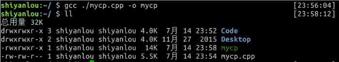

# 第 1 节 C 语言实现 Linux cp 命令

## 一、实验简介

linux cp 命令用来将一个或多个源文件或者目录复制到指定的目的文件或目录。

它可以将单个源文件复制成一个指定文件名的具体的文件或一个已经存在的目录下。

cp 命令还支持同时复制多个文件，当一次复制多个文件时，目标文件参数必须是一个已经存在的目录，否则将出现错误。

```cpp
cp -[Rrls] 源文件 SOURCE 目标文件 DEST 
```

选项：

`-R/r`：递归处理，将指定目录下的所有文件与子目录一并处理；
`-s`：对源文件建立符号连接，而非复制文件；
`-l`：对源文件建立硬连接，而非复制文件；

来自: http://man.linuxde.net/cp

### 1.1 知识点

*   Linux `cp` 命令的用法。
*   系统调用 `open`, `opendir` 函数的使用
*   系统调用 `careat` 函数的使用
*   系统调用 `read`, `readdir` 函数的使用
*   系统调用 `write` 函数的使用
*   系统调用 `close` 函数的使用
*   系统调用 `open` 函数的使用
*   系统调用 `link`, `symlink` 函数的使用
*   函数 `getopt` 的使用
*   C 语言字符串处理

### 1.2 效果截图


## 二、框架设计

本项目主要分三步完成：

**1、 设计主函数 `main` 的流程；**
**2、 设计基本文件拷贝函数 `copyF2F`；**
**3、 设计目录拷贝函数 `copyD2D`；**

### 2.1 设计主函数 `main` 的流程

`main` 函数用于接收命令行传进来的参数，并判断是否符合规范。然后根据不同的选项调用不同的子函数。

函数中采用三个 `bool` 变量来标记命令行选项，分别为`opt_r`, `opt_l`,`opt_s`。

根据函数 `optget` 得到的选项经过 `case` 语句来标记相应的 `bool` 变量。

其中函数 `int getopt(int argc,char * const argv[ ],const char * optstring);` 包含在头文件 `#include <unistd.h>`，作用： 分析命令行参数。 返回值：参数字符。

*   该部分代码如下：

```cpp
 while ((c = getopt(argc, argv, "rRls")) != -1)
    {
        switch (c)
        {
        /*若有-r,-R,则将标记递归地复制目录项的选项（opt_r）置为真*/
        case 'R':
        case 'r':
            opt_r = true;
            break;

        /*若有-l,则将标记创建硬链接的选项（opt_l）置为真*/
        case 'l':
            opt_l = true;
            break;

        /*若有-s,则将标记创建符号链接的选项（opt_s）置为真*/
        case 's':
            opt_s = true;
            break;
        }
    } 
```

### 2.2 设计基本文件拷贝函数 `copyF2F`

`copyF2F` 主要完成基本的文件拷贝，首先要判断目标文件是不是目录，若是目录，则根据源文件补全目标文件的路径。

然后通过系统调用 `open` 函数以可读模式打开源文件 `in_fd = open(src_file, O_RDONLY)`，以可读可写的方式打开目标文件，若目标文件不存在，则创建 `out_fd = open(dest_file, O_WRONLY | O_CREAT, COPYMORE)`。

最后循环使用 `read` 和 `write` 系统调用实现文件的复制。

*   注： 函数 open 是 UNIX 系统的系统调用函数，区别于 C 语言库函数 fopen。包含在头文件 `#include <fcntl.h>`，作用：打开和创建文件。

```cpp
int open(constchar*pathname, int flags);    
int open(constchar*pathname, int flags, mode_t mode); 
```

返回值：成功则返回文件描述符，否则返回-1

参数说明：对于 `open` 函数来说，第三个参数仅当创建新文件时（即使用了 `O_CREAT` 时）才使用，用于指定文件的访问权限位（`access permission bits`）。`pathname` 是待打开/创建文件的 POSIX 路径名（如/home/user/a.cpp）；`flags` 用于指定文件的打开/创建模式，这个参数可由以下常量（定义于`fcntl.h`）通过逻辑位或逻辑构成。

```cpp
O_RDONLY 只读模式
O_WRONLY 只写模式
O_RDWR 读写模式 
```

*   本阶段的完整代码如下：

```cpp
int 
copyF2F(char *src_file, char *dest_file)
{
    int in_fd, out_fd, n_chars;
    char buf[BUFFERSIZE];

    /*如果目标文件是一个目录，那么默认是在该目录下建立一个与源文件同名的文件*/
    if (isdir(dest_file)) 
    {   
        char c;
        char temp[10] = { '\0' };
        char *r_temp;
        int n = strlen(src_file);
        int m = 0;

        /*读取源文件的最后一级文件名作为目标文件名*/
        while ((c = src_file[n - 1]) != '/') 
        {
            temp[m] = c;
            m++;
            n--;
        }
        r_temp = strrev(temp);
        strcat(dest_file, r_temp);
    }

    /* 以可读模式打开源文件 */
    if ((in_fd = open(src_file, O_RDONLY)) == -1)
    {
        printf("%s 文件读取失败！",src_file);
        return 1;

    }

    /* O_WRONLY 代表以读写的方式打开目标文件，O_CREAT 选项代表若文件不存在则创建,
    COPYMORE = 0644，文件所有者可读可写，其他可读 */
    if ((out_fd = open(dest_file, O_WRONLY | O_CREAT, COPYMORE)) == -1)
        return 1;

    /* 通过 read 和 write 系统调用实现文件的复制 */
    while ((n_chars = read(in_fd, buf, BUFFERSIZE)) > 0)
    {
        if (write(out_fd, buf, n_chars) != n_chars)
        {
            printf("%s 文件写失败！", dest_file);
            return 1;
        }

        if (n_chars == -1)
        {
            printf("%s 文件读取失败！", src_file);
            return 1;
        }
    }

    /* 关闭文件 */
    if (close(in_fd) == -1 || close(out_fd) == -1)
    {
        printf("文件关闭失败！");
        return 1;
    }
    return 0;
} 
```

### 2.3 设计目录拷贝函数 `copyD2D`

目录的拷贝是基于基本文件的拷贝实现的，该函数输入两个目录，然后根据源目录的目录项 `dirp->d_name` 在目标目录中建立同名的文件，然后调用 `copyF2F` 函数。

特别注意：打开目录要用到 `opendir` 函数，读取目录项要用到 `readdir` 函数。

**注：** `DIR* opendir (const char * path );`

作用：打开一个目录，在失败的时候返回一个空的指针。

DIR 的结构体如下：

```cpp
 typedef struct __dirstream DIR;
       struct __dirstream
       {
         void                   *__fd;                /* `struct hurd_fd' pointer for descriptor.   */
         char                   *__data;            /* Directory block.   */
         int                       __entry_data;    /* Entry number `__data' corresponds to.   */
         char                   *__ptr;               /* Current pointer into the block.   */
         int                       __entry_ptr;        /* Entry number `__ptr' corresponds to.   */
         size_t                  __allocation;      /* Space allocated for the block.   */
         size_t                  __size;                /* Total valid data in the block.   */
         __libc_lock_define (, __lock)          /* Mutex lock for this structure.   */
        }; 
```

`struct dirent *readdir(DIR *dir)` 函数说明：`readdir()` 返回参数 dir 目录流的下个目录进入点。

函数返回值：成功则返回下个目录进入点。有错误发生或读取到目录文件尾则返回 `NULL`。

```cpp
Struct dirent
{
        ino_t                           d_ino;                          //此目录进入点的 inode
        ff_t                           d_off;                           //目录文件开头到此目录进入点的位移
        signed  short int      d_reclem;                             //_name 的长度，不包含 NULL 字符
        unsigned  char             d_type;                        // d_name 所指的文件类型
        char                           d_name[256];             //文件名
} 
```

*   本部分的完整代码如下：

```cpp
/*该函数用于处理复制目录的情况*/
int 
copyD2D(char *src_dir, char *dest_dir)
{
    DIR *dp = NULL;
    struct dirent *dirp;
    char tempDest[256];
    char tempSrc[256];
    strcpy(tempDest, dest_dir);
    strcpy(tempSrc, src_dir);

    /*使用 opendir 函数打开 src_dir 目录，获得指向该目录名字的指针*/
    if ((dp = opendir(src_dir)) == NULL)
        return 1;
    else
    {   
        /*使用 readdir 函数读取 dp 所指代目录的目录项，获得指向下一个 dirent 结构的指针*/
        while ((dirp = readdir(dp)))
        {
            struct stat file_stat;
            if (!isdir(dirp->d_name))
            {   
                /*将 dirent 结构中的 d_name 成员变量链接到上级目录字符串*/
                strcat(tempDest, dirp->d_name);
                strcat(tempSrc, dirp->d_name);

                /*此处转换为文件复制函数的方式处理目录复制*/
                copyF2F(tempSrc, tempDest);

                /*通过字符串拷贝函数，将 tempDest 和 tempSrc 还原为上级的目录名*/
                strcpy(tempDest, dest_dir);
                strcpy(tempSrc, src_dir);
            }
        }
        /*关闭目录*/
        closedir(dp);
        return 0;
    }
} 
```

## 三、测试

首先应该先编译 `mycp`。在实验楼环境中，采用 gcc 编译器，生成名字为 mycp 的可执行文件，具体过程如下：



可以看出编译成功，目录项多了名字为 mycp 的可执行文件。

为了便于测试，我们在家目录建立两个文件夹（dir1, dir2），并在其中一个文件夹（dir1）中新建文件 test。命令如下： 


### 3.1 测试 `mycp`


首先复制源程序 mycp.cpp 到目录~/dir1/ 中，通过 `ll ./dir1` 命令，发现文件拷贝成功。

### 3.2 测试 `mycp -r/R`

 从图中可以看出来，将目录 dir1 拷贝到 dir2 成功。

### 3.3 测试 `mycp -s`


使用 `-s` 选项，创建了 mycp.cpp 的符号链接，命名为 shiyanlou。特别注意符号链接不增加文件的链接数，图中 mycp.cpp 的链接数仍然为 1。

### 3.4 测试 `mycp -l`


使用 `-l` 选项，创建了 mycp.cpp 的硬链接，命名为 ShiYanLou。特别注意符号链接增加文件的链接数，其他属性不变（共享一个 inode 的信息），图中 mycp.cpp 的链接数增加到 2。

## 四、实验总结

本项目能将文件 IO 和文件系统有机的关联起来，可以系统的学习文件相关的系统调用。内容丰富，项目中用到了诸如 `open`, `opendir`,`read`, `readdir`,`write`,`open`, `link`, `symlink` 等等多种文件相关的系统调用。

*   本项目完整代码：

```cpp
#include <stdio.h>
#include <stdlib.h>
#include <unistd.h>
#include <fcntl.h>
#include <string.h>
#include <dirent.h>
#include <sys/types.h>
#include <sys/stat.h>
#include <getopt.h>
#include <stdbool.h>

#define BUFFERSIZE 1024
#define COPYMORE 0644

/*用于处理从目录文件复制到目录文件的操作，传入的参数应该是目录路径*/
int copyD2D(char *src, char *dest);

/*用于处理从文件复制到文件的操作，输入的参数是文件名*/
int copyF2F(char *src, char *dest);

/*判断 filename 是否是目录名*/
bool isdir(char *filename);

/*字符串反转*/
char *strrev(char *str);

/*main 函数用于接收命令行传进来的参数，并判断是否符合规范。
然后根据不同的情况调用不同的子函数。*/
int 
main(int argc, char **argv)
{
    /*标记-r/-R 选项，该选项代表递归复制文件夹*/
    bool opt_r = false;

    /*标记-l 选项，-l 选项代表创建硬链接*/
    bool opt_l = false;

    /*标记-s 选项，-s 选项代表创建符号链接*/
    bool opt_s = false;

    /*用于记录源文件*/
    char *src = NULL;

    /*用于记录目标文件*/
    char *dest = NULL;

    /*记录选项的字符*/
    char c;

    /*循环检测命令行参数中的选项*/
    while ((c = getopt(argc, argv, "rRls")) != -1)
    {
        switch (c)
        {
        /*若有-r,-R,则将标记递归地复制目录项的选项（opt_r）置为真*/
        case 'R':
        case 'r':
            opt_r = true;
            break;

        /*若有-l,则将标记创建硬链接的选项（opt_l）置为真*/
        case 'l':
            opt_l = true;
            break;

        /*若有-s,则将标记创建符号链接的选项（opt_s）置为真*/
        case 's':
            opt_s = true;
            break;
        }
    }

    /*命令行参数中应该有两个文件名。若没有，则输出提示，并终止程序*/
    if (optind >= argc - 1) {
        printf("缺少操作符\n");
        exit(1);
    }

    /*从命令行参数中读取源文件和目标文件名*/
    src = argv[optind];
    dest = argv[optind + 1];

    /*根据 opt_l 选项的真假，做相应操作。
    若为真，则创建硬链接，使用 link 函数。*/
    if (opt_l)
    {   
        if (isdir(src)) {
            printf("目录不能创建硬链接\n");
            exit(1);
        }

        /*link 函数的返回值：若成功，则返回 0；若出错，返回-1*/
        if ((link(src, dest)) == 0)
            return 0;
        else 
        {
            printf("创建硬链接失败\n");
            exit(1);
        }
    }

    /*根据 opt_s 选项的真假，做相应操作。
    若为真，则创建符号链接，使用 symlink 函数。*/
    if (opt_s)
    {
        if (isdir(src)) {
            printf("目录不能创建符号链接\n");
            exit(1);
        }

        /*synlink 函数的返回值：若成功，则返回 0，若出错，返回-1*/
        if ((symlink(src, dest)) == 0)
            return 0;
        else
        {
            printf("创建符号链接失败\n");
            exit(1);
        }
    }

    if (!isdir(src))
    {   
        /*若源文件 src 不是目录，直接调用 copyF2F 函数。*/
        if ((copyF2F(src, dest)) == 0)
            return 0;
        else 
        {
            printf("复制文件失败\n");
            exit(1);
        }
    }

    else if (isdir(src))
    {
        if (!isdir(dest))
        {
            printf("不能将一个目录复制到一个文件\n");
            exit(1);
        }

        /*若源文件 src 和目标文件 dest 都是目录，直接调用 copyD2D 函数。*/
        else if (isdir(dest) && opt_r)
        {
            if (copyD2D(src, dest) != 0) 
            {
                printf("目录拷贝失败\n");
                exit(1);
            }
            else
                return 0;
        }

        else 
        {
            printf("拷贝目录需要用-r 选项\n");
            exit(1);
        }
    }
    else 
    {
        printf("该操作不合法");
        exit(1);
    }

    return 0;
}

/*该函数用于处理复制目录的情况*/
int 
copyD2D(char *src_dir, char *dest_dir)
{
    DIR *dp = NULL;
    struct dirent *dirp;
    char tempDest[256];
    char tempSrc[256];
    strcpy(tempDest, dest_dir);
    strcpy(tempSrc, src_dir);

    /*使用 opendir 函数打开 src_dir 目录，获得指向该目录名字的指针*/
    if ((dp = opendir(src_dir)) == NULL)
        return 1;
    else
    {   
        /*使用 readdir 函数读取 dp 所指代目录的目录项，获得指向下一个 dirent 结构的指针*/
        while ((dirp = readdir(dp)))
        {
            struct stat file_stat;
            if (!isdir(dirp->d_name))
            {   
                /*将 dirent 结构中的 d_name 成员变量链接到上级目录字符串*/
                strcat(tempDest, dirp->d_name);
                strcat(tempSrc, dirp->d_name);

                /*此处转换为文件复制函数的方式处理目录复制*/
                copyF2F(tempSrc, tempDest);

                /*通过字符串拷贝函数，将 tempDest 和 tempSrc 还原为上级的目录名*/
                strcpy(tempDest, dest_dir);
                strcpy(tempSrc, src_dir);
            }
        }
        /*关闭目录*/
        closedir(dp);
        return 0;
    }
}

/*判断 filename 是否为目录文件*/
bool 
isdir(char *filename)
{
    struct stat fileInfo;

    if (stat(filename, &fileInfo) >= 0)
        if (S_ISDIR(fileInfo.st_mode))
            return true;
        else 
            return false;
}

/*该函数通过 read,write 等基本的系统函数，完成文件的拷贝工作*/
int 
copyF2F(char *src_file, char *dest_file)
{
    int in_fd, out_fd, n_chars;
    char buf[BUFFERSIZE];

    /*如果目标文件是一个目录，那么默认是在该目录下建立一个与源文件同名的文件*/
    if (isdir(dest_file)) 
    {   
        char c;
        char temp[10] = { '\0' };
        char *r_temp;
        int n = strlen(src_file);
        int m = 0;

        /*读取源文件的最后一级文件名作为目标文件名*/
        while ((c = src_file[n - 1]) != '/') 
        {
            temp[m] = c;
            m++;
            n--;
        }
        r_temp = strrev(temp);
        strcat(dest_file, r_temp);
    }

    /* 以可读模式打开源文件 */
    if ((in_fd = open(src_file, O_RDONLY)) == -1)
    {
        printf("%s 文件读取失败！",src_file);
        return 1;

    }

    /* O_WRONLY 代表以读写的方式打开目标文件，O_CREAT 选项代表若文件不存在则创建,
    COPYMORE = 0644，文件所有者可读可写，其他可读 */
    if ((out_fd = open(dest_file, O_WRONLY | O_CREAT, COPYMORE)) == -1)
        return 1;

    /* 通过 read 和 write 系统调用实现文件的复制 */
    while ((n_chars = read(in_fd, buf, BUFFERSIZE)) > 0)
    {
        if (write(out_fd, buf, n_chars) != n_chars)
        {
            printf("%s 文件写失败！", dest_file);
            return 1;
        }

        if (n_chars == -1)
        {
            printf("%s 文件读取失败！", src_file);
            return 1;
        }
    }

    /* 关闭文件 */
    if (close(in_fd) == -1 || close(out_fd) == -1)
    {
        printf("文件关闭失败！");
        return 1;
    }
    return 0;
}

/*字符串反转*/
char * strrev(char *str)

{

    int i = strlen(str) - 1, j = 0;

    char ch;
    while (i>j)
    {
        ch = str[i];
        str[i] = str[j];
        str[j] = ch;
        i--;
        j++;
    }
    return str;
} 
```

## 参考资料

*   [《UNIX 环境高级编程》](https://book.douban.com/subject/1788421/)