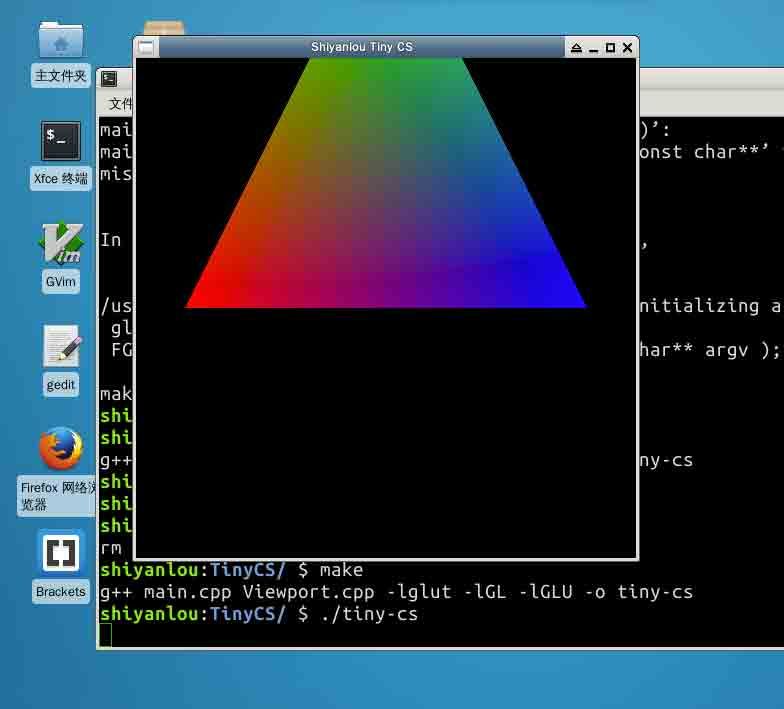
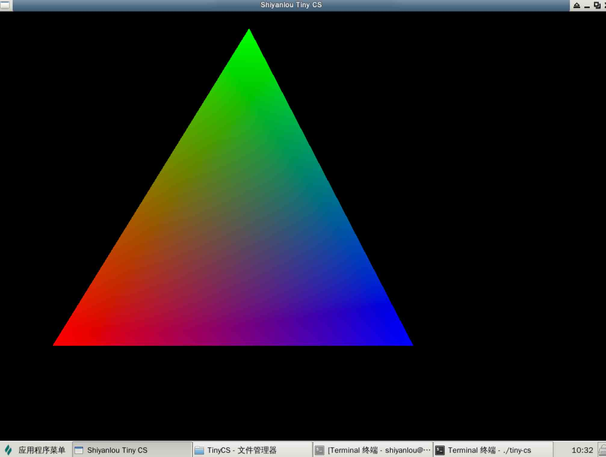
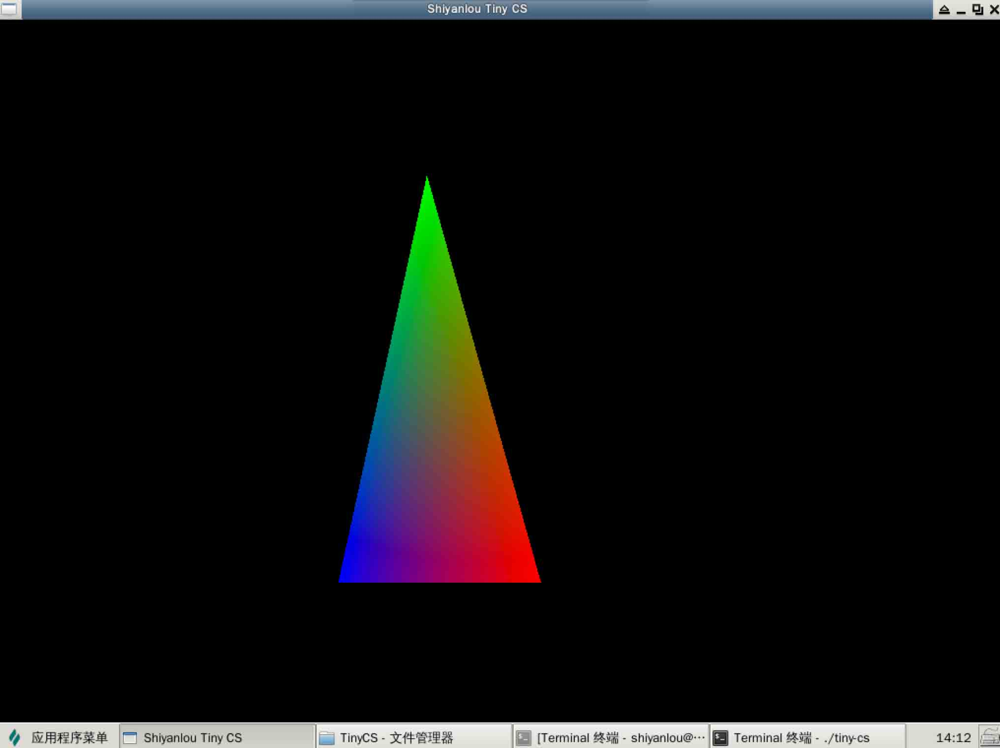

# 第 1 节 C++ 实现第一人称射击游戏 - 构建基础世界

## 一、概述

### 实验所需要的前置知识

*   基本的 C++ 语法知识
*   基本的 OpenGL 知识
*   基本的 Makefile

### 实验涉及的知识点

*   OOP 编程思想
*   OpenGL 的 3D 视角变换
*   OpenGL 材质加载

### 实验目标

此次的项目，我们将通过实验一步步使用 C++ 和 OpenGl 实现一个简单的第一人称射击游戏的基础世界，由于实验楼的环境所限，我们将学习实现以下几个射击游戏的基本需求来替代整个射击游戏的实现：

*   WASD 方向键的移动
*   鼠标点击事件的处理
*   鼠标移动时的视角处理
*   材质的加载

## 二、基本的 OpenGL 程序

首先需要在实验楼环境中安装 GLUT：

```cpp
sudo apt-get update && sudo apt-get install freeglut3 freeglut3-dev 
```

我们先来实现一个标准的 OpenGL 程序：

```cpp
//
// main.cpp
// TinyCS
//

#include <iostream>
using namespace std;

const int WINDOW_WIDTH = 500;
const int WINDOW_HEIGHT = 500;
const char* WINDOW_TITLE = "Shiyanlou Tiny CS";

int main(int argc, char *argv[]) {

    // 初始化 GLUT 和 OpenGL
    glutInit(&argc, argv);
    glutInitWindowPosition(0, 0);
    glutInitWindowSize(WINDOW_WIDTH, WINDOW_HEIGHT);
    glutInitDisplayMode(GLUT_RGBA | GLUT_DOUBLE | GLUT_DEPTH);

    // 创建 OpenGL
    glutCreateWindow(WINDOW_TITLE);

    // 初始化视窗
    Viewport::init();

    // Enter Main Loop
    glutMainLoop();

    return 0;
} 
```

在上面的代码还不能编译通过，因为有一个东西是我们需要继续讨论的`Viewport::init()`。

我们知道，在 OpenGL 中需要向 OpenGL 注册 display 回调，所以我们还需要实现这部分的代码。

在实现这部分代码之前，我们先考虑一下我们的类设计。

## 二、编写视窗类

1.  最重要的一个类，显然就是负责刷新整个视图的类，我们不妨称之为 `Viewport`。
2.  我们要响应键盘、鼠标的输入事件，所以还需要有 `Keyboard`, `Mouse` 类。
3.  另外，对于部分素材材质（如地面材质）等，我们可以设计一个 `Resources` 类来进行管理。

在设计最为重要的 `Viewport`之前，我们先实现一个通用文件，用于存储各种常量和头文件:

```cpp
//
//  common.hpp
//  TinyCS
//

#ifndef common_hpp
#define common_hpp

#include <GL/glut.h>

#endif /* common_hpp */ 
```

然后我们再来设计 Viewport：

```cpp
//
//  Viewport.hpp
//  TinyCS
//

#ifndef Viewport_hpp
#define Viewport_hpp

#include "common.hpp"

class Viewport {

public:

    // 鼠标指针是否显示
    static bool grabbed;

    // 视角宽度
    static int width;

    // 视角高度
    static int height;

    // 基本的初始化
    static void init();

    // 配置窗口可调整
    static void reshape(int w, int h);

    // 负责显示
    static void display();

    // 设置鼠标指针是否显示
    static void setGrabbed(bool value);
};

#endif /* Viewport_hpp */ 
```

在这个类中，我们定义了一些基本的属性和方法，例如鼠标指针是否显示、显示窗口的大小调整等基本需求。我们先实现这几个函数让整个 OpenGL 程序跑起来，再慢慢迭代整个程序，从而实现整个游戏。

首先，我们来实现 `Viewport::init()` 和 `setGrabbed`：

```cpp
//
//  Viewport.cpp
//  TinyCS
//

#include "Viewport.hpp"

int Viewport::width = 0;
int Viewport::height = 0;

bool Viewport::grabbed = false;

void Viewport::init() {
    // 设置 GLUT 回调函数
    glutReshapeFunc(Viewport::reshape);
    glutDisplayFunc(Viewport::display);
    glutIdleFunc(Viewport::display);

    // 启用深度测试，根据坐标的远近自动隐藏被遮住的图形
    glEnable(GL_DEPTH_TEST);

    // 启用二维纹理
    glEnable(GL_TEXTURE_2D);

    // 配置鼠标是否直接被 OpenGL 全局捕获并显示
    grabbed ? Viewport::setGrabbed(true) : Viewport::setGrabbed(false);
}

void Viewport::setGrabbed(bool value) {
    grabbed = value ? true : false;

    if (grabbed) {
        // 设置当前窗口的光标样式, 现在为禁用光标
        glutSetCursor(GLUT_CURSOR_NONE);
    } else {
        // 继承系统光标
        glutSetCursor(GLUT_CURSOR_INHERIT);
    }
} 
```

接下来再实现 `reshape()` 和 `display()`：

```cpp
// 
// Viewport.cpp
// TinyCS
//

// 处理当窗口长宽发生变化时候的渲染
void Viewport::reshape(int w, int h) {
    width = w;
    height = h;
    if (h <= 0) h = 1;
    // 计算长宽比
    float ratio = (float)w / h;

    // 在视图进行调整时，要切换矩阵模式
    glMatrixMode(GL_PROJECTION);
    // 将 PROJECTION 矩阵加载为单位阵
    glLoadIdentity();
    glViewport(0, 0, w, h);
    // 适当调整透视角
    gluPerspective(45, ratio, 0.01, 1000);
    // 切回 GL_MODELVIEW
    glMatrixMode(GL_MODELVIEW);
}
void Viewport::display() {

    // 清空当前 Viewport 中的缓冲
    glClear(GL_COLOR_BUFFER_BIT | GL_DEPTH_BUFFER_BIT);

    // 重置为单位矩阵
    glLoadIdentity();

    // 绘制一个三角形
    glBegin(GL_TRIANGLES);
        glColor3f(1.0, 0.0, 0.0);
        glVertex3f(-1, 0, -3);
        glColor3f(0.0, 1.0, 0.0);
        glVertex3f(0, 2, -3);
        glColor3f(0.0, 0.0, 1.0);
        glVertex3f(1, 0, -3);
    glEnd();

    // 绑定材质
    glBindTexture(GL_TEXTURE_2D, 0);

    // 将缓冲区的图像交换给显卡进行渲染,
    // 我们在 main.cpp 中注册了显示 GLUT_DOUBLE 双缓冲的显示模式
    glutSwapBuffers();
} 
```

完成上面的代码后，我们还要在 `main.cpp` 中引入这两个文件：

```cpp
//
// main.cpp
// TinyCS
//
#include "common.hpp"
#include "Viewport.hpp" 
```

> 这里不再叙述 Makefile 的编写，读者可以根据自己的喜好来编写 Makefile 编译代码或直接使用 g++

我们就可以获得下面的效果：



下面我们来实现视角的基本变换。

首先我们先在 `common.hpp` 中定义基本的向量结构：

```cpp
//
// common.hpp
// TinyCS
//
typedef struct Vector3f {
    float x = 0;
    float y = 0;
    float z = 0;
} Vector3f; 
```

再在 `Viewport.hpp` 中定义好相机的基本属性：

```cpp
//
// Viewport.hpp
// TinyCS
//
struct Camera {
    // 定义摄像机的最大倾斜角
    float maxTilt;

    // 保存摄像机的位置
    Vector3f position;

    // 保存摄像机的旋转
    Vector3f rotation;

    // 初始构造
    Camera():maxTilt(85) {}
}; 
```

并在 `Viewport` 类中定义相机属性：`static Camera camera;`，同时对 `Viewport.cpp` 的 `display()` 中初始化好相机的基本属性：

```cpp
void Viewport::display() {

    glClear(GL_COLOR_BUFFER_BIT | GL_DEPTH_BUFFER_BIT);
    glLoadIdentity();

    // 初始化相机的一些基本属性
    // 设置旋转矩阵变换
    glRotatef(camera.rotation.x, 1, 0, 0);
    glRotatef(camera.rotation.y, 0, 1, 0);
    glRotatef(camera.rotation.z, 0, 0, 1);
    // 设置平移矩阵变换
    glTranslatef(-camera.position.x, -camera.position.y, camera.position.z);

    glBegin(GL_TRIANGLES);
        glColor3f(1.0, 0.0, 0.0);
        …… 
```

## 三、实现鼠标类

视角的变换依赖于鼠标的移动，所以我们还需要实现鼠标的相关逻辑。首先我们先定义鼠标`Mouse`类：

```cpp
//
//  Mouse.hpp
//  TinyCS
//

#ifndef Mouse_hpp
#define Mouse_hpp

class Mouse {
public:

    // 记录鼠标的当前位置
    static int currentX;
    static int currentY;

    // 记录鼠标的上一次位置
    static int lastX;
    static int lastY;

    // 记录鼠标移动的变化量
    static int deltaX;
    static int deltaY;

    // 记录鼠标移动的灵敏度
    static float sensitivity;

    // 鼠标的三个按键
    static bool leftButton;
    static bool middleButton;
    static bool rightButton;

public:

    // 鼠标移动方法
    static void move(int x, int y);

    // 更新鼠标的相关事件信息
    static void update();

    // 鼠标位置
    static void click(int button, int state, int x, int y);

};

#endif /* Mouse_hpp */ 
```

对于这个类来说，我们要确定几个必要的逻辑：

1.  鼠标事件在什么时候处理?
2.  鼠标点击后会发生什么?
3.  鼠标移动后会发生什么?

如果能够回答这三个问题，那么我们就能够非常好的处理好鼠标事件了。

首先鼠标事件在什么时候处理？这个问题事实上还隐含了，鼠标事件应该由谁处理？

显然，鼠标类应该负责的是鼠标自身的行为，而鼠标的行为最终会扩散到 Viewport 上，所以，Viewport 才是应该处理鼠标事件的对象。

因此，我们先修改 `Viewport.cpp` 的逻辑， 那么还是回到刚才的问题上。究竟什么时候处理鼠标事件？从整个程序的流程上看：

1.  在 `display()` 绘制图像之前;
2.  在 `display()` 绘制图像期间;
3.  在 `display()` 绘制图像之后.

显然，我们在图像绘制之前处理鼠标事件是最好的，因为作为玩家，在看到整个画面加载好后，自然开始操作，所以我们应该提前注册好整个鼠标事件的响应。

> 这个道理自然也适用于键盘事件

因此，首先我们需要在 `init()` 方法中向 GLUT 注册鼠标回调：

```cpp
//
//  Viewport.cpp
//  TinyCS
//
void Viewport::init() {
    // 设置 GLUT 绘制相关的回调函数
    glutReshapeFunc(Viewport::reshape);
    glutDisplayFunc(Viewport::display);
    glutIdleFunc(Viewport::display);

    // 注册鼠标事件的相关回调
    // glutMotionFunc 会处理当鼠标按下时，鼠标的拖拽事件，我们将其注册到 Mouse 类的 move 函数上
    glutMotionFunc(Mouse::move);
    // glutPassiveMotionFunc 
    glutPassiveMotionFunc(Mouse::move);
    glutMouseFunc(Mouse::click);

    ……
} 
```

自然地， 在完成回调后，我们给 Viewport 类添加一个 `processEvents()` 方法：

```cpp
//
//  Viewport.cpp
//  TinyCS
//
void Viewport::processEvents() {

    // 根据鼠标更新渲染视窗
    Mouse::update();

    // 根据鼠标来处理相机的移动
    // 相机的轴旋转角度 = 原来的角度 + 鼠标移动距离*鼠标灵敏度
    camera.rotation.y += (float)Mouse::deltaX * Mouse::sensitivity;
    camera.rotation.x += (float)Mouse::deltaY * Mouse::sensitivity;

} 
```

并在 display() 方法的首先执行这个方法：

```cpp
void Viewport::display() {

    // 处理鼠标、键盘事件等相关回调
    processEvents();
    …… 
```

到现在为止我们解决了第一个逻辑：鼠标事件的注册期。现在来看第二个逻辑：鼠标点击之后应该干什么。

因为我们在 `Viewport` 类中定义了 `Viewport::grabbed` 为 `false`，所以到目前为止是无法捕获鼠标事件的。我们先来编写当鼠标被点击之后的处理方法 `click()`:

```cpp
//
//  Mouse.cpp
//  TinyCS
//
void Mouse::click(int button, int state, int x, int y) {

    // 当鼠标按键为左键时候 才响应这部分的逻辑
    if (button == GLUT_LEFT_BUTTON) {

        // 鼠标按下
        if (state == GLUT_DOWN) {

            // 设置鼠标左键被按下
            leftButton = true;

            // 仅当点击位置位于 GLUT 窗口内才处理此事件
            if (x >= 0 && Viewport::width && y >= 0 && y < Viewport::height) {
                // 捕获鼠标
                Viewport::setGrabbed(true);
            }
        }
        // 当鼠标按键被抬起时候，将左键设置为 false
        if (state == GLUT_UP) {
            leftButton = false;
        }

    }

    // 当鼠标中间按键被按下时候 才响应这部分逻辑
    if (button == GLUT_MIDDLE_BUTTON) {
        if (state == GLUT_DOWN) {
            middleButton = true;
        }
        if (state == GLUT_UP) {
            middleButton = false;
        }
    }

    // 当鼠标右键被按下时 才响应这部分逻辑
    if (button == GLUT_RIGHT_BUTTON) {
        if (state == GLUT_DOWN) {
            rightButton = true;
        }
        if (state == GLUT_UP) {
            rightButton = false;
        }
    }
} 
```

当鼠标被 GLUT 捕获到后，我们就要处理鼠标移动时，视角的变换逻辑了。首先我们要获得鼠标的位置，所以：

```cpp
//
//  Mouse.cpp
//  TinyCS
//
void Mouse::move(int x, int y) {
    currentX = x;
    currentY = y;
} 
```

有了这个函数，我们就能通过 GLUT 的鼠标事件回调获得当前的鼠标位置。那么和鼠标相关的最后一步，就是更新鼠标的位置更新 `Viewport` 中相机的位置：

```cpp
//
//  Mouse.cpp
//  TinyCS
//
void Mouse::update() {

    // 视角的变换仅在鼠标被 GLUT 捕获时才激活
    if (Viewport::grabbed) {

        // 计算鼠标前后的变化
        deltaX = currentX - lastX;
        deltaY = currentY - lastY;

        // 更新本次的记录
        lastX = currentX;
        lastY = currentY;

        // 处理当鼠标移出窗口的情况, 对位置进行置位
        if (currentX <= 0 || currentX >= Viewport::width) {
            lastX -= currentX - Viewport::width/2;
            glutWarpPointer(Viewport::width/2, currentY);
        }
        if (currentY <= 0 || currentY >= Viewport::height) {
            lastY -= currentY - Viewport::height/2;
            glutWarpPointer(currentX, Viewport::height/2);
        }
    }
} 
```

现在我们再重新编译整个代码，就已经可以使用鼠标来旋转整个视角了（灵敏度有些高，可以调整一下参数），移动一下鼠标，就能够看见整个三角形的全貌了：



## 四、响应键盘事件

键盘事件和鼠标事件类似，还是那几个问题：什么时候处理键盘事件、键盘要处理那些事件、处理时间时要干什么。

首先，对于第一个问题已经在鼠标事件中讨论过了，所以我们要在 `Viewport::init()` 中加入对键盘事件的回调，在加入回调之前，我们先创建键盘类用来提供回调：

```cpp
//
//  Keyboard.hpp
//  TinyCS
//

#ifndef Keyboard_hpp
#define Keyboard_hpp

#include <iostream>

class Keyboard {
public:
    static bool key[256];
public:
    static void keyDown(unsigned char k, int x, int y);
    static void keyUp(unsigned char k, int x, int y);
};

#endif /* Keyboard_hpp */ 
```

以及：

```cpp
//
//  Keyboard.cpp
//  TinyCS
//

#include "Keyboard.hpp"

bool Keyboard::key[256];

void Keyboard::keyDown(unsigned char k, int x, int y) {
    key[k] = true;
}
void Keyboard::keyUp(unsigned char k, int x, int y) {
    key[k] = false;
} 
```

然后在 `Viewport::init()` 中注册回调函数：

```cpp
//
//  Viewport.cpp
//  TinyCS
//
void Viewport::init() {
    // 设置 GLUT 回调函数
    glutReshapeFunc(Viewport::reshape);
    glutDisplayFunc(Viewport::display);
    glutIdleFunc(Viewport::display);

    // 注册键盘事件的相关回调
    glutKeyboardFunc(Keyboard::keyDown);
    glutKeyboardUpFunc(Keyboard::keyUp);

    // 注册鼠标事件的相关回调
    glutMotionFunc(Mouse::move);
    …… 
```

那么，第二个问题：键盘需要处理哪些事件呢？

对于射击类游戏来说 WASD 四个方向键是必不可少的，我们在 `processEvents()` 中处理它，我们假设主要实现这几个按键的处理ß：

```cpp
//
//  Viewport.cpp
//  TinyCS
//
if (Keyboard::key['w']) {
    // 向前移动 e.delta)*Math::dcos(camera.rotation.y);
}
if (Keyboard::key['s']) {
    // 向后移动
}
if (Keyboard::key['a']) {
    // 向左移动
}
if (Keyboard::key['d']) {
    // 向右移动
}
if (Keyboard::key[' ']) {
    // 跳跃

}
if (Keyboard::key[27]) {
    // esc, 退出控制
    Viewport::setGrabbed(false);
} 
```

而对于键盘 ESC 键来说，我们用 ASCII 来选择这个键，所以在 ESC 被按下时，GLUT 对键盘的捕获丢失，这时候视角不会再有变化。

那么最最核心的，当 WASD 四个键被按下时，应该处理什么？

我们先以 W 为例，来进行分析。

首先，当 W 被按下时，Viewport 中的物体坐标本质上并没有发生变化，但是相机本身的位置变化了，那么，它在 x 轴方向上的坐标变化应该为：

某个方向上的坐标值 = 行走速度 x 时间增量 x 相机的角度 y 轴上旋转角的正弦或者余弦

为了定义行走速度，我们定义：

```cpp
float WALKING_SPEED = 2.5; 
```

而为了获得时间标尺，我们可以使用 glutGet 方法，但我们需要先在 common.hpp 中定义一个时间结构：

```cpp
// 时间结构
typedef struct Time {
    float last;
    float current;
    float delta;
    Time():last(0), current(0), delta(0) {}
} Time; 
```

然后在 Viewport 中增加一个时间结构的成员，并在每一次的 processEvent 被调用时候，更新时间标尺：

```cpp
void Viewport::processEvents() {

    // 根据鼠标更新渲染视窗
    Mouse::update();

    // 根据鼠标来处理相机的移动
    // 相机的轴旋转角度 = 原来的角度 + 鼠标移动距离*鼠标灵敏度
    camera.rotation.y += (float)Mouse::deltaX*Mouse::sensitivity;
    camera.rotation.x += (float)Mouse::deltaY*Mouse::sensitivity;

    // 移动速度
    float WALKING_SPEED = 2.5;

    // 设置时间标尺
    time.current = (float)glutGet(GLUT_ELAPSED_TIME) / 1000;
    time.delta = time.current - time.last;
    time.last = time.current;

    …… 
```

至此，可以实现整个 WASD 处理逻辑：

```cpp
if (Keyboard::key['w']) {
        // 向前移动
        camera.position.x += (WALKING_SPEED*time.delta)*Math::dsin(camera.rotation.y);
        camera.position.z += (WALKING_SPEED*time.delta)*Math::dcos(camera.rotation.y);
    }
    if (Keyboard::key['s']) {
        // 向后移动
        camera.position.x += (WALKING_SPEED*time.delta)*Math::dsin(camera.rotation.y + 180);
        camera.position.z += (WALKING_SPEED*time.delta)*Math::dcos(camera.rotation.y + 180);
    }
    if (Keyboard::key['a']) {
        // 向左移动
        camera.position.x += (WALKING_SPEED*time.delta)*Math::dsin(camera.rotation.y + 270);
        camera.position.z += (WALKING_SPEED*time.delta)*Math::dcos(camera.rotation.y + 270);
    }
    if (Keyboard::key['d']) {
        // 向右移动
        camera.position.x += (WALKING_SPEED*time.delta)*Math::dsin(camera.rotation.y + 90);
        camera.position.z += (WALKING_SPEED*time.delta)*Math::dcos(camera.rotation.y + 90);
    } 
```

> 空格键的跳跃我们留作练习，请读者执行实现

其中，为了方便起见，我们定义了自己的 Math 工具类，封装了 math 库中 sin 只能计算弧度的需求, 并用 dsin 来直接计算角度值的三角函数值：

```cpp
//
//  Math.hpp
//  TinyCS
//

#ifndef Math_hpp
#define Math_hpp

#include <iostream>
#include <cmath>

class Math {
public:
    static double degressToRadians(double degress) {
        return degress*M_PI/180;
    }
    static double dsin(double theta) {
        return sin(degressToRadians(theta));
    }
    static double dcos(double theta) {
        return cos(degressToRadians(theta));
    }
};

#endif /* Math_hpp */ 
```

这时候我们再重新编译代码，就能够看到，我们能够通过 WASD 来全方面的移动自己的位置来观察已经有的三角形了。



不过，效果还不是很明显，我们需要为这个世界添加一些基本的参考元素，例如地面，才能够观察到更加明显的效果。

我们在下一个实验中完成这部分工作。

## 进一步参考的文献

1.  [GLUT API 文档](https://www.opengl.org/resources/libraries/glut/spec3/spec3.html)
2.  [OpenGL GLUT 官方页](https://www.opengl.org/resources/libraries/glut/)