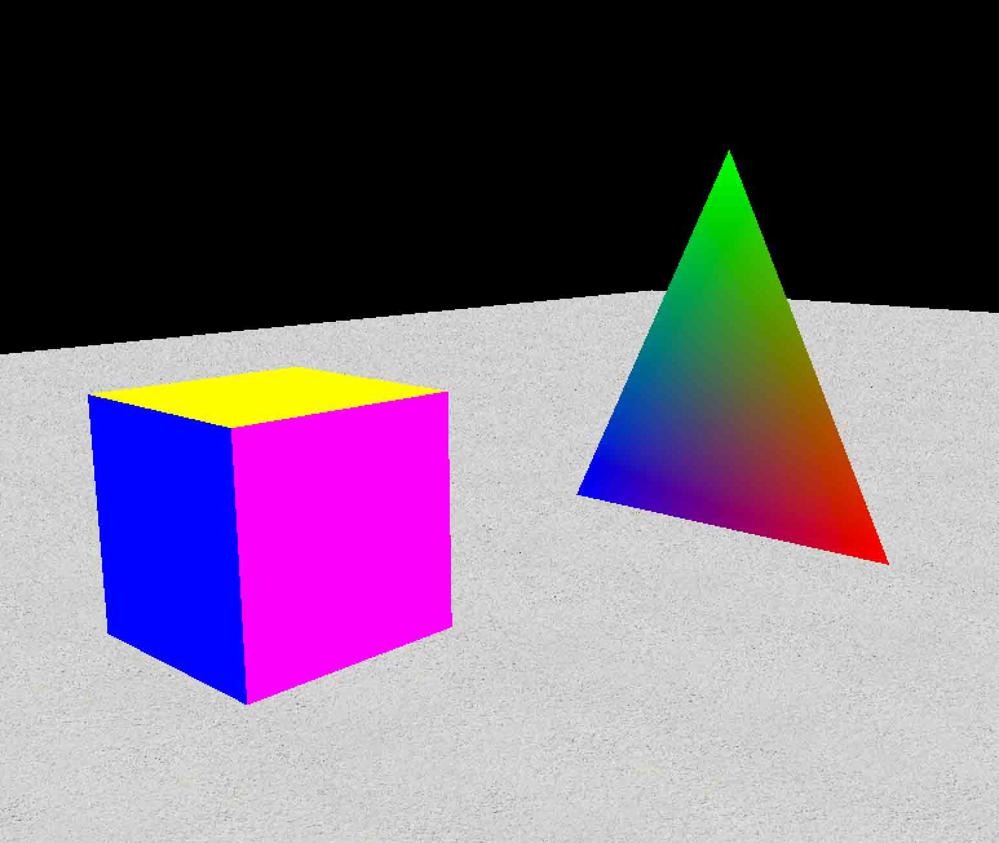

# 第 2 节 C++ 实现第一人称射击游戏 - 加载材质资源

## 一、概述

### 实验所需要的前置知识

*   基本的 C++ 语法知识
*   基本的 OpenGL 知识
*   基本的 Makefile

### 实验涉及的知识点

*   OOP 编程思想
*   OpenGL 的 3D 视角变换
*   OpenGL 材质加载

## 二、加载材质资源

上一节实验中，我们已经构建好的游戏世界里的一些基础行为，如视角的变换、镜头的移动等。本节实验中我们开始加载一些资源到游戏界面中。

同样还是上一节实验中介绍到的方法，我们要分析这样几个问题：

1.  资源在什么时候被加载
2.  资源应该如何被加载
3.  资源加载到哪里

我们先来解决第一个问题，资源在什么时候被加载。

观察 `main.cpp` 中的代码，我们可以确定两个位置，资源要么在 Viewport 加载前被加载，资源要么在 Viewport 加载后被加载。 显然，各种资源应该在视窗加载前被加载，因为视窗加载完成后，画面就已经开始被显示了，这时候再加载资源就会出现体验不友好的情况。

为此，我们创建一个 Resource 类：

```cpp
//
//  Resources.hpp
//  TinyCS
//

#ifndef Resources_hpp
#define Resources_hpp

#include <iostream>

#include "Texture.hpp"

class Resources {
public:

    // 材质指针
    static Texture* tex;

    // 加载材质
    static void load();

    // 重新加载
    static void regen();
};

#endif /* Resources_hpp */ 
```

在这个类中，我们使用了 Texture 类，我们之后再来详细讨论 Texture 类的实现细节。

我们首先编写加载地图的逻辑，实验楼已经为你准备好了材质文件，你只需要把材质下载到代码目录下即可：

```cpp
wget https://labfile.oss.aliyuncs.com/courses/559/map.bmp 
```

据此实现这个类：

```cpp
//
//  Resources.cpp
//  TinyCS
//

#include "Resources.hpp"

Texture* Resources::tex = NULL;

void Resources::load() {
    tex = Texture::loadBMP("map.bmp");
} 
```

下面我们来看如何加载整个材质，首先是 Texture 类的设计：

```cpp
//
//  Texture.hpp
//  TinyCS
//

#ifndef Texture_hpp
#define Texture_hpp

class Texture {
public:

    // 给出加载材质的 ID
    unsigned int textureID;

    // 存储材质数据
    void* data;

    // 材质的宽度
    int w;

    // 材质的高度
    int h;

    // 材质的格式
    unsigned char format;

    // 材质的构造方法
    Texture(void* data, int w, int h, int format);

    // 从 BMP 图像中加载材质
    static Texture* loadBMP(const char* filename);
};

#endif /* Texture_hpp */ 
```

我们从一张图片中加载材质文件，需要获取到图片的数据、宽高和格式，并统一封装作为一个材质指针来提供。

我们为你准备了 BMP 的图像文件，这种图像文件是 Windows 中的一种图像文件格式。

> 之所以使用这个格式，是因为我们需要手动编写加载这个图像的函数，并以此来联系 C++ 的编码能力。

首先，我们编写 Texture 的构造函数：

```cpp
Texture::Texture(void* data, int w, int h, int format) {

    // 用来生成文理，1 表示生成一个文理，textureID 是纹理的索引指针
    glGenTextures(1, &textureID);

    // 绑定材质，绑定到一个有名称的材质
    glBindTexture(GL_TEXTURE_2D, textureID);

    // 生成一个 2D 纹理
    glTexImage2D(GL_TEXTURE_2D, 0, GL_RGBA, w, h, 0, format, GL_UNSIGNED_BYTE, data);

    // glTexParameteri 是一种文理过滤函数，这里是 OpenGL 加载材质的一些基本初始化
    glTexParameteri(GL_TEXTURE_2D, GL_TEXTURE_WRAP_T, GL_REPEAT);
    glTexParameteri(GL_TEXTURE_2D, GL_TEXTURE_WRAP_S, GL_REPEAT);
    glTexParameteri(GL_TEXTURE_2D, GL_TEXTURE_MAG_FILTER, GL_LINEAR);
    glTexParameteri(GL_TEXTURE_2D, GL_TEXTURE_MIN_FILTER, GL_LINEAR);

    // 结束绑定
    glBindTexture(GL_TEXTURE_2D, 0);

    // 将数据、宽高、格式初始化到 Texture 类
    this->data = data;
    this->w = w;
    this->h = h;
    this->format = format;
} 
```

接下来就剩记载图像文件了。难点来了，如何加载一个 BMP 的图像文件呢？

我们需要了解一点图像文件的存储和压缩知识。图像文件按照一定规则存储在磁盘中的，每个字节的存储单元都有它自身代表的意思，下面是 BMP 图像文件的文件协议，这些内容不需要全部背下来，只是在用到的时候查阅一下就好，这里简单的罗列一下：

> 图像文件头 > > 1）第 1-2 个单元：图像文件头。0x4d42=’BM’，表示是 Windows 支持的 BMP 格式。(注意：查 ascii 表 B 0x42,M0x4d,bfType 为两个字节，B 为 low 字节，M 为 high 字节所以 bfType=0x4D42，而不是 0x424D，请注意) > > 2）第 3-6 个单元：用来存储整个文件大小。4690 0000，为 00009046h=36934。 > > 3）第 7-8 个单元：保留字段，必须设置为 0。 > > 4）第 9-10 个单元：保留字段，必须设置为 0。 > > 5）11-14：从文件开始到位图数据之间的偏移量(14+40+4*（2^biBitCount）)(在有颜色板的情况下)。4600 0000，为 00000046h=70，上面的文件头就是 35 字=70 字节。 位图信息头 > > 6）15-18：位图图信息头长度。 > > 7) 19-22：位图宽度，以像素为单位。8000 0000，为 00000080h=128。 > > 8）23-26：位图高度，以像素为单位。9000 0000，为 00000090h=144。 > > 9）27-28：位图的位面数，该值总是 1。0100，为 0001h=1。 > > 10）29-30：每个像素的位数。有 1（单色），4（16 色），8（256 色），16（64K 色，高彩色），24（16M 色，真彩色），32（4096M 色，增强型真彩色）。1000 为 0010h=16。 > > 11）31-34：压缩说明：有 0（不压缩），1（RLE 8，8 位 RLE 压缩），2（RLE 4，4 位 RLE 压缩，3（Bitfields，位域存放）。RLE 简单地说是采用像素数+像素值的方式进行压缩。T408 采用的是位域存放方式，用两个字节表示一个像素，位域分配为 r5b6g5。图中 0300 0000 为 00000003h=3(这张图片不存在颜色板)。 > > 12）35-38：用字节数表示的位图数据的大小，该数必须是 4 的倍数，数值上等于:一行所占的字节数×位图高度。0090 0000 为 00009000h=80×90×2h=36864。假设位图是 24 位,宽为 41，高为 30，则数值= (biWidth*biBitCount+31)/32*4*biHeight,即=(41*24+31)/32*4*30=3720 > > 13）39-42：用象素/米表示的水平分辨率。A00F 0000 为 0000 0FA0h=4000。 > > 14）43-46：用象素/米表示的垂直分辨率。A00F 0000 为 0000 0FA0h=4000。 > > 15）47-50：位图使用的颜色索引数。设为 0 的话，则说明使用所有调色板项。 > > 16）51-54：对图象显示有重要影响的颜色索引的数目。如果是 0，表示都重要。

我们只需要简单扫一眼这个文件协议即可。我们直接从实现中了解加载 BMP 图片的细节知识：

```cpp
Texture* Texture::loadBMP(const char* filename) {

    // 定义文件指针
    FILE* fp;

    // 读取文件
    fp = fopen(filename, "r");

    // 如果读取失败，则返回空指针，并关闭文件读取
    if (!fp) {
        cout << filename << " could not be opend!" << endl;
        fclose(fp);
        return NULL;
    }

    // 定义文件头字段指针
    char* headerField = new char[2];

    // 读取两个字节的内容
    fread(headerField, 2, sizeof(char), fp);

    // 如果这两个字节读到的内容不是 "BM" 则不是 BMP 格式的图像，不去读取
    if (strcmp(headerField, "BM")) {
        delete [] headerField;
        cout << "File is not a bitmap" << endl;
        fclose(fp);
        return NULL;
    }
    delete [] headerField;

    // 图像数据的位置
    unsigned int bmpDataLocation;

    // 图像的宽
    unsigned int bmpWidth;

    // 图像的高
    unsigned int bmpHeight;

    // 图像的颜色版
    unsigned short numColorPlanes;

    // 图像的像素
    unsigned short bitsPerPixel;

    // 图像的压缩方法
    unsigned int compressionMethod;

    // 图像数据的大小
    unsigned int bmpDataSize;

    // 从 0x000a 开始, 读取一个字节来获取图像数据的位置
    fseek(fp, 0x000a, SEEK_SET);
    fread(&bmpDataLocation, 1, sizeof(unsigned int), fp);

    // 从 0x0012 开始, 依次读取一个字节来获取文件的基本信息
    fseek(fp, 0x0012, SEEK_SET);
    fread(&bmpWidth, 1, sizeof(unsigned int), fp);
    fread(&bmpHeight, 1, sizeof(unsigned int), fp);
    fread(&numColorPlanes, 1, sizeof(unsigned short), fp);
    fread(&bitsPerPixel, 1, sizeof(unsigned short), fp);
    fread(&compressionMethod, 1, sizeof(unsigned int), fp);
    fread(&bmpDataSize, 1, sizeof(unsigned int), fp);

    // 处理不符合格式的图像，并关闭退出
    if (numColorPlanes != 1 || bitsPerPixel != 24 || compressionMethod != 0) {
        cout << "File Is Not Raw BMP24!" << endl;
        fclose(fp);
        return NULL;
    }

    // 准备图像数据指针
    unsigned char* bmpData = new unsigned char[bmpDataSize];

    // 从图像数据位置处开始读取图像数据
    fseek(fp, bmpDataLocation, SEEK_SET);
    fread(bmpData, bmpDataSize, sizeof(unsigned char), fp);
    fclose(fp);

    // 完成读取后，创建一个 Texture 对象并返回
    return new Texture(bmpData, bmpWidth, bmpHeight, GL_BGR);

} 
```

资源类和材质类编写完成后，我们还需要在显示图像的时候完成对图像数据的渲染工作，显然，这部分渲染是在 `Viewport::display()` 中完成的。

在 OpenGL 中加载完材质后，仍然需要渲染到地图上，其渲染方法是先绑定一个材质，绑定材质后的渲染就会被渲染为这种材质，在完成需要渲染的材质后，再解绑即可恢复到任意的渲染状态：

```cpp
void Viewport::display() {

    ……

    // 绘制一个三角形并上色
    glBegin(GL_TRIANGLES);
        glColor3f(1.0, 0.0, 0.0);
        glVertex3f(-1, 0, -3);
        glColor3f(0.0, 1.0, 0.0);
        glVertex3f(0, 2, -3);
        glColor3f(0.0, 0.0, 1.0);
        glVertex3f(1, 0, -3);
    glEnd();

    // 绑定材质    
    glBindTexture(GL_TEXTURE_2D, Resources::tex->textureID);

    glBegin(GL_QUADS);
    glColor3f(1, 1, 1);

    glTexCoord2f(100, 100);
    glVertex3f(100, 0, 100);

    glTexCoord2f(100, -100);
    glVertex3f(-100, 0, 100);

    glTexCoord2f(-100, -100);
    glVertex3f(-100, 0, -100);

    glTexCoord2f(-100, 100);
    glVertex3f(100, 0, -100);

    glEnd();

    // 结束绑定
    glBindTexture(GL_TEXTURE_2D, 0);

    // 将缓冲区的图像交换给显卡进行渲染,
    // 我们在 main.cpp 中注册了显示 GLUT_DOUBLE 双缓冲的显示模式
    glutSwapBuffers(); 
```

最后，我们调整一下每次加载界面时，摄像机的 y 轴位置:

```cpp
void Viewport::init() {
    ……

    camera.position.y = 1.75;
} 
```

这时候我们就能够看到所处的地面了：


但是稍加调整时候我们就会发现，这个相机并不符合一个人的视角，因为，会出现下图所示的情况：

 整个视角可以被倒过来。这不符合一个射击类游戏应该有的样子，因为视角最多只能指向地面。所以，我们还需要对视角的代码稍加调整，在 `processEvents` 中，增加多视角移动的限制：

```cpp
if (camera.rotation.x > Camera::maxTilt) {
    Camera::rotation.x = Camera::maxTilt;
}
if (Camera::rotation.x < -Camera::maxTilt) {
    Camera::rotation.x = -Camera::maxTilt;
} 
```

## 多增加一些元素

我们的要实现的射击游戏路还很长，但到目前为止，我们已经实现了所有的基本功能，现在，你可以按照自己的想法逐步构建这个世界了。我这里给你一个示范，在地面上增加一个方块：

```cpp
void addCube() {
    //  第一个面
    glBegin(GL_QUADS);
    glColor3f(1, 0, 0);
    glVertex3f(1, 0, -5);
    glVertex3f(1, 1, -5);
    glVertex3f(0, 1, -5);
    glVertex3f(0, 0, -5);
    glEnd();
    //  第二个面
    glBegin(GL_QUADS);
    glColor3f(0, 1, 0);
    glVertex3f(1, 0, -5);
    glVertex3f(1, 1, -5);
    glVertex3f(1, 1, -6);
    glVertex3f(1, 0, -6);
    glEnd();
    // 第三个面
    glBegin(GL_QUADS);
    glColor3f(0, 0, 1);
    glVertex3f(1, 0, -6);
    glVertex3f(1, 1, -6);
    glVertex3f(0, 1, -6);
    glVertex3f(0, 0, -6);
    glEnd();
    // 第四个面
    glBegin(GL_QUADS);
    glColor3f(1, 0, 1);
    glVertex3f(0, 1, -6);
    glVertex3f(0, 0, -6);
    glVertex3f(0, 0, -5);
    glVertex3f(0, 1, -5);
    glEnd();
    // 第五个面
    glBegin(GL_QUADS);
    glColor3f(1, 1, 0);
    glVertex3f(0, 1, -6);
    glVertex3f(1, 1, -6);
    glVertex3f(1, 1, -5);
    glVertex3f(0, 1, -5);
    glEnd();
} 
```

然后把 `addCube()` 增加到 `Viewport::display()` 中执行即可。

我们就能够全方位的走动，观察这个被添加到地面上的方块了：



### 任务

完善这个游戏，运用你到目前为止学到的 OpenGL 的知识继续完善这个项目，例如，找一个天空的材质，给这个世界增加一片天空。找一个枪声的音频，处理鼠标点击的事件并执行开枪的事件。

## 回顾

本节实验我们运用了大量的 OpenGL 的知识，实现了一个非常非常基本的射击游戏的基础世界，

本项目主要涉及了下面这些重要的知识点：

*   OOP 编程思想
*   OpenGL 的 3D 视角变换
*   OpenGL 材质加载
*   手动读取 BMP 文件

我们提供了源码，可以供你下载参考：

```cpp
wget https://labfile.oss.aliyuncs.com/courses/559/TinyCS.zip 
```

## 进一步参考的文献

1.  [GLUT API 文档](https://www.opengl.org/resources/libraries/glut/spec3/spec3.html)
2.  [OpenGL GLUT 官方页](https://www.opengl.org/resources/libraries/glut/)
3.  [BMP 图像文件格式](http://baike.baidu.com/link?url=ryMNGWth5Jq02FesNYFCYaaYD1YIUeaxsEt-H7Z_wCuTgAXvTA84xy9BWrNbtstCizfpTH1nRVlfgoPDg7MhizyiOeBZc6R6sNQgvAIPVZ_)