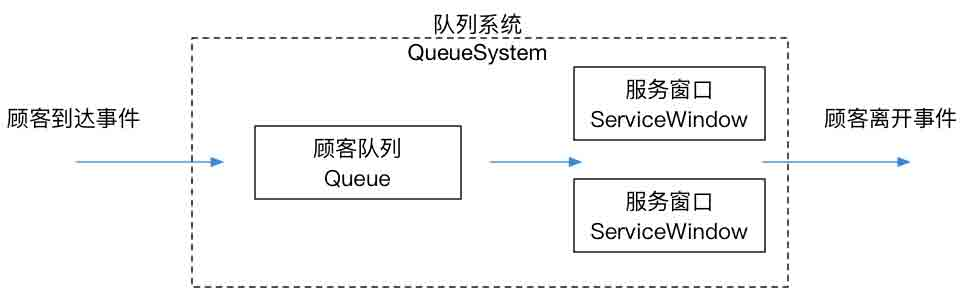
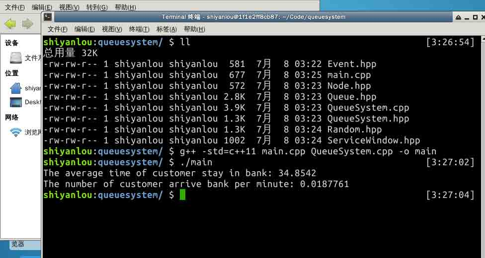
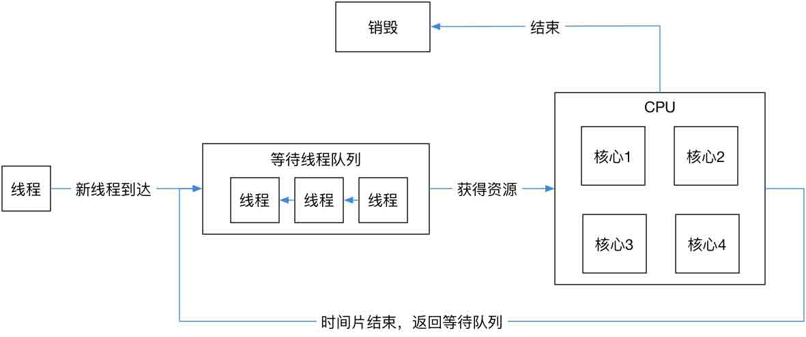
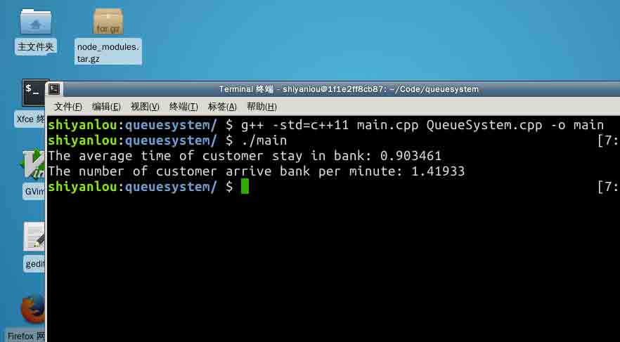

# C++ 实现银行排队服务模拟

使用 C++对银行排队服务进行模拟，以事件驱动为核心思想，手动实现模板链式队列、随机数产生器等内容，进而学习概率编程等知识。作为可选进阶，这个模型同时还能稍加修改的应用到 CPU 资源争夺模型中。

## # C++ 从实现银行排队服务到 CPU 资源争夺模拟 - 银行排队系统的设计与建模

## 一、概述

### 实验所需的前置知识

*   C++ 基本语法知识

### 实验所巩固并运用的知识

*   OOP 编程思想
*   `std::rand()` 函数原理
*   概率编程
*   排队理论
*   链式队列数据结构及其模板实现
*   事件驱动的设计
*   蒙特卡洛方法
*   CPU 资源争夺模型
*   时间片轮转调度

### 要解决的问题

蒙特卡洛方法这个名字听起来很高大上，但它的本质其实是使用计算机的方法对问题进行模拟和复现。本次实验将使用蒙特卡洛方法来模拟银行排队这个问题：

> 端午节当天，某个银行从早上八点开始服务并只服务到中午十二点就停止营业。假设当天银行只提供了 w 个服务窗口进行服务，问：

> 1\. 平均每分钟有多少个顾客抵达银行? > 2\. 平均每个顾客占用服务窗口的时间是多少？

我们先来分析一下这个业务的逻辑：

首先我们要分析银行提供服务的逻辑。在银行服务中，所有顾客都是通过取号排队的方式等待服务的，这和火车站买票有所不同，在火车站买票时，顾客必须在某一个窗口所排的队列下进行排队，且无法变更自己所属的窗口，否则只能从队尾重新排队。换句话说，对于银行提供的服务来说，所有用户都是位于同一个队列上的，当某个服务窗口可用时，才会从排队队列的队首取出一个新的用户来办理银行业务。即代码实现过程中，服务窗口可以创建 w 个，但只需要实现一个顾客队列即可。

其次，对于顾客而言，有两个属性是能够被抽象出来的：

1.  到达银行的时间；
2.  需要服务的时间。

并且，这两个属性是随机的。到此，我们整个的排队模型就变成了：



下面我们来详细对这个问题的实现逻辑进行分析，让我们的程序能够给出类似下面的结果：



## 一、计算机中的随机

### std::rand() 函数的原理

C++ 中的 `std::rand()` 函数产生的随机数并不是真正意义上的随机数，它并不服从数学上的均匀分布。为了使我们的模拟系统变得更加真实，我们需要知道 `std::rand()` 函数的原理。

`std::rand()` 生成的是一个随机的二进制序列（在硬件底层更好实现），这个序列的每一位 0 或者 1 的概率都是相等的。而对于 `std::rand()%n` 这个运算，会在 [0, n-1] 之间生成随机数，所以，如果 n-1 的二进制表示的值不都是由 1 组成，那么这里面的数是不会从均匀分布了（因为某些位可能不能为 1）。

所以，当且仅当 [0, n-1] 中的随机数可以用这个序列的子序列表示时，才能满足均匀分布。换句话说，仅当 n-1 的二进制数全为 1 时，0，1 出现的概率才是均等的。

我们先来实现随机这个类：

```cpp
//
//  Random.hpp
//  QueueSystem
//

#ifndef Random_hpp
#define Random_hpp

#include <cstdlib>
#include <cmath>

class Random {
public:
    // [0, 1) 之间的服从均匀分布的随机值
    static double uniform(double max = 1) {
        return ((double)std::rand() / (RAND_MAX))*max;
    }
};
#endif /* Random_hpp */ 
```

这样的话，当我们调用 `Random::uniform()` 时，便能获得真正的服从均匀分布的随机数了。当指定参数后，便能够生成 [0, max) 之间的随机值了。

## 二、主函数逻辑设计

对于一个银行而言，对外界来说只需要提供两个参数：

1.  总共的服务时间
2.  服务窗口的数量

所以我们希望实现这样的代码：

```cpp
//
// main.cpp
// QueueSystem
//

#include "QueueSystem.hpp"

#include <iostream>
#include <cstdlib>

int main() {

    std::srand((unsigned)std::time(0)); // 使用当前时间作为随机数种子

    int total_service_time = 240;       // 按分钟计算
    int window_num         = 4;
    int simulate_num       = 100000;    // 模拟次数

    QueueSystem system(total_service_time, window_num);
    system.simulate(simulate_num);

    std::cout << "The average time of customer stay in bank: "
              << system.getAvgStayTime() << std::endl;
    std::cout << "The number of customer arrive bank per minute: "
              << system.getAvgCustomers() << std::endl;

    return 0;
} 
```

## 三、对象及逻辑设计

> 总结一下，现在我们需要实现的东西有：

1.  服务窗口类(会被创建 w 个)
2.  顾客队列类(只会被创建一个)
3.  顾客结构(包含两个随机属性: 到达时间, 服务时间)

> 为了更好练习 C++，我们会弃用诸如 vector 这些快捷编码的标准库来进行『过度编码』，自行编写模板类。

根据前面的问题描述，我们可以初步确定这样一些类的设计需求：

1.  QueueSystem 类: 负责整个队列系统的模拟；
2.  ServiceWindow 类: 队列系统的服务窗口对象，每当一个银行创建时，服务窗口会被创建，为了让整个问题更加灵活，我们假设需要创建 window_num 个窗口；
3.  Queue 类: 银行队列系统的顾客排队的队列；
4.  Random 类: 在第二节中已经讨论过。

然而，在设计 ServiceWindow 之前，我们要考虑 ServiceWindow 类到底要放置什么成员，首先，对于一个服务窗口，会有一个顾客属性，用于存放顾客。另一方面，一个窗口只会有两种状态：要么正在服务（被占用），要么空闲。因此 ServiceWindow 中首先会有下面的枚举：

```cpp
//
// ServiceWindow.hpp
// QueueSystem
//

enum WindowStatus {
    SERVICE,
    IDLE,
}; 
```

既然我们要在 ServiceWindow 中存放顾客，由于顾客本身并不需要提供什么方法，因此可以直接将顾客设计为一个结构体 `Customer`，同时，顾客也会成为等待队列中的一员。所以，Customer 也可以被称之为队列的一个 `Node`，此外，每个顾客说需要的服务时间是随机的，但是到达时间并不应该由顾客自身确定（我们在下一节再讨论为什么），所以`Customer`结构的默认构造应该被设计出来：

```cpp
//
//  Node.hpp
//  QueueSystem
//

#ifndef Node_hpp
#define Node_hpp

#include "Random.hpp"

#define RANDOM_PARAMETER 100

struct Node {
    int arrive_time;
    int duration;
    struct Node *next;

    // 默认到达事件为 0，需要服务的事件是随机的
    Node(int arrive_time = 0,
         int duration = Random::uniform(RANDOM_PARAMETER)):
        arrive_time(arrive_time),
        duration(duration),
        next(NULL) {}
};

typedef struct Node Node;
typedef struct Node Customer;

#endif /* Node_h */ 
```

那么，结合前面的 `WindowStatus`枚举和 `Customer`结构，我们的 ServiceWindow 类可以这样设计，因为窗口本身涉及的操作还算是比较简单，比如设置窗口状态是否繁忙，获取当前服务顾客的到达时间来方便后续计算等等，因此我们直接将其设计成类内的 `inline` 函数：

```cpp
//
//  ServiceWindow.hpp
//  QueueSystem
//

#ifndef ServiceWindow_hpp
#define ServiceWindow_hpp

#include "Node.hpp"

enum WindowStatus {
    SERVICE,
    IDLE,
};

class ServiceWindow {
public:
    inline ServiceWindow() {
        window_status = IDLE;
    };
    inline bool isIdle() const {
        if (window_status == IDLE) {
            return true;
        } else {
            return false;
        }
    }
    inline void serveCustomer(Customer &customer) {
        this->customer = customer;
    }
    inline void setBusy() {
        window_status = SERVICE;
    }
    inline void setIdle() {
        window_status = IDLE;
    }
    inline int getCustomerArriveTime() const {
        return customer.arrive_time;
    }
    inline int getCustomerDuration() const {
        return customer.duration;
    }
private:
    Customer customer;
    WindowStatus window_status;
};

#endif /* ServiceWindow_hpp */ 
```

## 三、事件驱动的设计

有了上面的这些设计，似乎我们只要编写好用户排队队列，就已经足够描述整个排队的系统了，然而，在上面的设计中，还有一个很大的问题，那就是：整个系统还处于静止状态。当顾客位于等待队列时，窗口什么时候服务下一个顾客，如何处理这里面的逻辑，到目前为止，我们都没有思考过。

为了让整个系统『运行』起来，我们还要考虑整个系统的运行时间线。这里我们给出一种**事件驱动**的设计。

在前面的分析中，我们知道整个系统中，无非出现两种事件：

1.  有顾客到达
2.  有顾客离开

其中，第二种顾客离开的事件，同时还包含了窗口服务等待队列中的下一个顾客这个事件。所以，我们如果能够维护一个事件列表，那么就能够驱动整个队列系统的运行了。因为，当事件发生时，我们通知这个队列系统更新他自身的状态即可。

综上所述，我们可以先设计事件表中的事件结构：

```cpp
//
//  Event.hpp
//  QueueSystem
//

#ifndef Event_hpp
#define Event_hpp

#include "Random.hpp"
#define RANDOM_PARAMETER 100

struct Event {
    int occur_time;

    // 使用 -1 表示到达事件, >=0 表示离开事件, 同时数值表示所离开的服务窗口
    int event_type;

    Event* next;

    // 默认为到达事件，发生事件随机
    Event(int occur_time = Random::uniform(RANDOM_PARAMETER),
          int event_type = -1):
        occur_time(occur_time),
        event_type(event_type),
        next(NULL) {}
};

#endif /* Event_hpp */ 
```

这里我们使用了一个小小的 trick，那就是用整数来表示事件的类型，而不是简单的使用枚举。

这是因为，对于 ServiceWindow 来说，我们可以使用数组来管理多个 ServiceWindow，那么对应的事件类型如果涉及为整数，事件类型就可以同时作为 ServiceWindow 的索引下标了，当 `event_type` 大于等于 0 时，数值还表示离开的服务窗口。

又因为事件列表、顾客队列，本质上可以归类为同一个结构，那就是队列：只不过他们的入队方式有所差异，对于事件列表而言，入队方式必须按发生事件的时间顺序入队，而对于顾客，则是直接添加到队尾。考虑到了这一点，我们便能很容易的利用模板来设计队列的基本需求了：

```cpp
//
//  Queue.hpp
//  QueueSystem
//

#ifndef Queue_hpp
#define Queue_hpp

#include <iostream>
#include <cstdlib>

#include "Event.hpp"

// 带头结点的队列
template <typename T>
class Queue
{
public:
    Queue();
    ~Queue();
    void clearQueue();             // 清空队列
    T* enqueue(T &node);
    T* dequeue();
    T* orderEnqueue(Event &event); // 只适用于事件入队
    int  length();
private:
    T *front;  // 头结点
    T *rear;   // 队尾
};
#endif /* Queue_hpp */ 
```

## 四、QueueSystem

经过前面的讨论，我们已经完成了对所有基本结构的设计，根据这些设计，我们能够初步确定我们要实现的队列系统的基本结构。

首先，根据对主函数的设计，初始化整个队列系统我们需要两个参数：

1.  银行的总服务时间(分钟) `int total_service_time`
2.  银行开放的服务窗口数 `int window_num`

其次，我们需要 `QueueSystem` 发开放至少三个接口：

1.  模拟 `simulate()`
2.  获得顾客平均逗留时间 `getAvgStayTime()`
3.  获得平均每分钟顾客数 `getAvgCustomers()`

第三，内部需要实现的内容包括：

1.  系统运行前的初始化 `init()`
2.  让系统运行的 `run()`
3.  系统结束一次运行的清理工作 `end()`

第四，整个系统需要管理的核心成员有：

1.  可供服务的窗口 `ServiceWindow* windows`
2.  顾客等待队列 `Queue<Customer> customer_list`
3.  事件列表 `Queue<Event> event_list`
4.  当前的系统事件 `Event* current_event`

第五，处理事件的方法：

1.  处理顾客到达事件 `void customerArrived()`
2.  处理顾客离开事件 `void customerDeparture()`

最后，我们所希望的平均顾客逗留时间和平均每分钟的顾客数涉及的四个变量：

1.  顾客的总逗留时间 `int total_customer_stay_time`
2.  一次运行中系统服务的中顾客数量 `int total_customer_num`
3.  每分钟平均顾客数 `double avg_customers`
4.  顾客平均逗留时间 `double avg_stay_time`

> 事实上，可以预见的是，在处理顾客服务逻辑的时候，我们还需要一个方法 `getIdleServiceWindow` 来获取当前服务窗口的状态，从而增加代码的复用度。

所以，整个 QueueSystem 类的代码设计为：

```cpp
//
//  QueueSystem.hpp
//  QueueSystem
//

#ifndef QueueSystem_hpp
#define QueueSystem_hpp

#include "Event.hpp"
#include "Queue.hpp"
#include "ServiceWindow.hpp"

class QueueSystem {

public:
    // 初始化队列系统
    QueueSystem(int total_service_time, int window_num);

    // 销毁
    ~QueueSystem();

    // 启动模拟
    void simulate(int simulate_num);

    inline double getAvgStayTime() const {
        return avg_stay_time;
    }
    inline double getAvgCustomers() const {
        return avg_customers;
    }

private:
    // 让队列系统运行一次
    double run();

    // 初始化各种参数
    void init();

    // 清空各种参数
    void end();

    // 获得空闲窗口索引
    int getIdleServiceWindow();

    // 处理顾客到达事件
    void customerArrived();

    // 处理顾客离开事件
    void customerDeparture();

    // 服务窗口的总数
    int window_num;

    // 总的营业时间
    int total_service_time;

    // 顾客的逗留总时间
    int customer_stay_time;

    // 总顾客数
    int total_customer_num;

    // 核心成员
    ServiceWindow*  windows;
    Queue<Customer> customer_list;
    Queue<Event>       event_list;
    Event*          current_event;

    // 给外部调用的结果
    double avg_customers;
    double avg_stay_time;

};

#endif /* QueueSystem_hpp */ 
```

## 本节回顾

在这一节中，我们设计了整个银行排队系统的基本逻辑，并借鉴了事件驱动的思想设计了驱动队列系统的事件类。本节中我们一共创建了：

1.  `Event.hpp`
2.  `Node.hpp`
3.  `Queue.hpp`
4.  `Random.hpp`
5.  `ServiceWindow.hpp`
6.  `QueueSystem.hpp`
7.  `main.cpp`

现在我们的代码还不能够直接运行，本节我们先关注理清我们的业务逻辑。在下一节中，我们将实现这些代码的详细逻辑，这包括：

1.  `Queue.hpp` 中模板链式队列的具体实现
2.  `QueueSystem.cpp` 中的详细服务逻辑
3.  `Random.hpp` 中更复杂的随机概率分布

在这些实现中，我们将进一步巩固下面的知识的运用：

1.  C++ 类模板
2.  链式队列的数据结构
3.  概率编程

## 进一步阅读的参考

1.  [排队理论](https://zh.wikipedia.org/zh/等候理論)
2.  [随机过程](https://zh.wikipedia.org/zh/随机过程)
3.  [事件驱动程序设计](https://zh.wikipedia.org/wiki/事件驅動程式設計)

## # C++ 从实现银行排队服务到 CPU 资源争夺模拟 - 核心代码的实现

## 一、概述

### 实验所需的前置知识

*   C++ 基本语法知识

### 实验所巩固并运用的知识

*   OOP 编程思想
*   `std::rand()` 函数原理
*   概率编程
*   排队理论
*   链式队列数据结构及其模板实现
*   事件驱动的设计
*   蒙特卡洛方法
*   CPU 资源争夺模型
*   时间片轮转调度

### 要解决的问题

端午节当天，某个银行从早上八点开始服务并只服务到中午十二点就停止营业。假设当天银行只提供了 w 个服务窗口进行服务，问：

> 1\. 平均每分钟有多少个顾客抵达银行? > 2\. 平均每个顾客占用服务窗口的时间是多少？

### 上节实验回顾

在上一节实验中，我们已经理解清楚了整个队列系统的业务设计，并借鉴了事件驱动的思想设计了驱动队列系统的事件类，一共创建了：

1.  `Event.hpp`
2.  `Node.hpp`
3.  `Queue.hpp`
4.  `Random.hpp`
5.  `ServiceWindow.hpp`
6.  `QueueSystem.hpp`
7.  `main.cpp`

这样的几个文件。这次实验中，我们来专注实现这些代码的详细逻辑，这包括：

1.  `Queue.hpp` 中模板链式队列的具体实现
2.  `QueueSystem.cpp` 中的详细服务逻辑
3.  `Random.hpp` 中更复杂的随机概率分布

## 二、模板链队的实现

上节实验中我们给出了模板链队的基本设计需求，下面我们来实现这个队列。

### 链式队列的设计理由

首先解释为什么我们要使用链式队列，而不是用数组队列：我们知道，链表的优点是插入元素的算法复杂度是 $$O(1)$$ 的。虽然对于顾客的等待队列来说，我们不涉及在整个队列中插入元素，入队和出队都是发生在队列的两头。但是，我们在讨论事件的时候就遇到了这样的一个问题：事件在队列中的插入，是按事件发生时间的顺序进行插入的。这时，就不一定发生在队列的两端了。我们的队列要同时作为这两种结构的基础，显然，使用链表结构是最佳的选择。

### 实现

确定了使用链表结构，还需要面临一个链表是否需要设计头结点的问题。我们知道，有头结点的链表能够更加方便的进行代码实现，但是会损耗一个对象的空间来放置头结点。在早期的计算机软件开发中，内存是非常珍贵的，通常在设计队列的时候会设计成不带头结点的链表。但是在现在计算机中，这点内存就不值一提了，所以我们使用带头结点的链表结构。

那么，队列的构造和析构函数就需要负责管理整个链表的声明周期，维护好头结点和尾节点的变化：

```cpp
//
// Queue.hpp
// QueueSystem
//

// 构造一个带头结点的链式队列，节点位于队列尾部
Queue() {
    this->front = new T;
    // 如果内存申请失败，则不应该继续运行程序了
    if (!this->front) {
        exit(-1);
    }

    // 初始化节点
    this->front->next = NULL;
    this->rear = this->front;
}
// 销毁一个队列时候需要释放节点中申请的内存
~Queue() {
    // 清空当前队列中的元素
    this->clearQueue();

    // 再删除头结点
    delete this->front;
} 
```

其次，对于一般的入队和出队逻辑：

```cpp
//
// Queue.hpp
// QueueSystem
//

// 入队时，传递节点指针，外部数据不应该由此类进行管理，所以将数据拷贝一份
// 并返回头指针
T* enqueue(T &node) {
    T *new_node = new T;
    if (!new_node) {
        exit(-1);
    }
    *new_node = node;
    this->rear->next = new_node;
    this->rear = new_node;
    return this->front;
}
// 出队时，从队头元素出队
T* dequeue() {
    // 如果队列空，则返回空指针
    if (!this->front->next) {
        return NULL;
    }

    T *temp_node;
    temp_node = this->front->next;
    this->front->next = temp_node->next;

    // 如果队列中只有一个节点，那么记得将队尾节点指针置为头结点
    if (this->rear == temp_node) {
        this->rear = this->front;
    }
    return temp_node;
} 
```

对于事件的顺序入队逻辑：

```cpp
//
// Queue.hpp
// QueueSystem
//

// 事件时的顺序插入，事件有自身的发生事件，应该按事件顺序进行插入
T* orderEnqueue(Event &event) {
    Event* temp = new Event;
    if (!temp) {
        exit(-1);
    }
    *temp = event;

    // 如果这个列表里没有事件, 则把 temp 事件插入
    if (!this->front->next) {
        this->enqueue(*temp);
        return this->front;
    }

    // 按时间顺序插入
    Event *temp_event_list = this->front;

    // 如果有下一个事件，且下一个事件的发生时间小于要插入的时间的时间，则继续将指针后移
    while (temp_event_list->next && temp_event_list->next->occur_time < event.occur_time) {
        temp_event_list = temp_event_list->next;
    }

    // 将事件插入到队列中
    temp->next = temp_event_list->next;
    temp_event_list->next = temp;

    // 返回队列头指针
    return this->front;
} 
```

队列的长度计算：

```cpp
//
// Queue.hpp
// QueueSystem
//

int  length() {
    T *temp_node;
    temp_node = this->front->next;
    int length = 0;
    while (temp_node) {
        temp_node = temp_node->next;
        ++length;
    }
    return length;
} 
```

最后，清空当前队列中的元素：

```cpp
//
// Queue.hpp
// QueueSystem
//

void clearQueue() {
    T *temp_node;

    while (this->front->next) {
        temp_node = this->front->next;
        this->front->next = temp_node->next;
        delete temp_node;
    }

    this->front->next = NULL;
    this->rear = this->front;
} 
```

> 注意，清空队列的逻辑应该注意，我们在依次删除完队列中元素的内存时，应该将**头和尾**节点进行复位，否则会出现很严重的内存泄露问题，因为我们的入队是通过尾指针实现的。

在 C++ 中，一个非常头疼的事情就是对动态申请的内存进行有效的管理，一不小心就会出现内存泄露的问题。

我们来看入队方法和出队方法中两个很关键的设计：

1.  入队时尽管引用了外部的数据，但是并没有直接使用这个数据，反而是在内部新分配了一块内存，再将外部数据复制了一份。
2.  出队时，直接将分配的节点的指针返回了出去，而不是拷贝一份再返回。

在内存管理中，本项目的代码使用这样一个理念：**谁申请，谁释放**。

队列这个对象，应该管理的是自身内部使用的内存，释放在这个队列生命周期结束后，依然没有释放的内存。

## 三、队列系统的实现

首先，整个银行的队列系统在被构造出来时，可供服务的窗口就应该被创建好，于是我们有了对构造函数和析构函数的实现：

```cpp
//
// QueueSystem.cpp
// QueueSystem
//

QueueSystem::QueueSystem(int total_service_time, int window_num):
    total_service_time(total_service_time),
    window_num(window_num),
    total_customer_stay_time(0),
    total_customer_num(0) {
    // 创建服务窗口
    this->windows = new ServiceWindow[window_num];
}
QueueSystem::~QueueSystem() {
    delete[] windows;
}
void QueueSystem::simulate(int simulate_num) {
    double sum = 0;
    for (int i = 0; i != simulate_num; ++i) {
        sum += run();
    }
    avg_stay_time = (double)sum / simulate_num;
    avg_customers = (double)total_customer_num / (total_service_time*simulate_num);
} 
```

接下来，`simulate()` 方法：

```cpp
//
// QueueSystem.cpp
// QueueSystem
//

void QueueSystem::simulate(int simulate_num) {
    double sum = 0;
    for (int i = 0; i != simulate_num; ++i) {
        // 每一遍运行，我们都要增加在这一次模拟中，顾客逗留了多久
        sum += run();
    }

    // 计算平均逗留时间
    avg_stay_time = (double)sum / simulate_num;
    // 计算每分钟平均顾客数
    avg_customers = (double)total_customer_num / (total_service_time*simulate_num);
} 
```

然后，对于 `run()`, `init()`, `end()` 这三个方法，部署了整个系统的动态运行，同时运行又是由 `event_list` 来驱动的：

```cpp
//
// QueueSystem.cpp
// QueueSystem
//

// 系统开启运行, 初始化事件链表, 部署第一个事件
void QueueSystem::init() {
    // 第一个事件肯定是到达事件, 使用默认构造
    Event *event = new Event;
    current_event = event;
}
// 系统开始运行，不断消耗事件表，当消耗完成时结束运行
double QueueSystem::run() {
    this->init();
    while (current_event) {
        // 判断当前事件类型
        if (current_event->event_type == -1) {
            customerArrived();
        } else {
            customerDeparture();
        }
        delete current_event;
        // 获得新的事件
        current_event = event_list.dequeue();
    };
    this->end();
    // 返回顾客的平均逗留时间
    return (double)total_customer_stay_time/total_customer_num;
}
// 系统运行结束，将所有服务窗口置空闲，并清空用户的等待队列和事件列表
void QueueSystem::end() {
    // 设置所有窗口空闲
    for (int i=0; i != window_num; ++i) {
        windows[i].setIdle();
    }
    // 顾客队列清空
    customer_list.clearQueue();

    // 事件列表清空
    event_list.clearQueue();

} 
```

最后我们来到了最为核心的逻辑：处理顾客到达事件和顾客离开事件。

首先来看顾客到达事件的逻辑：

1.  顾客到达时，总的顾客数应该增加。
2.  而当前事件发生时，下一个顾客同时应该被创建，如果下一个到达的顾客在银行关门之前到达，那么久应该被添加到事件列表中。
3.  当前事件到达的顾客应该被插入到等待队列中。
4.  如果服务窗口有空闲，那么应该立即服务队列中的第一个顾客。
5.  顾客开始服务后，其离开时间应该被确定，这时候要向事件列表中顺序插入一个顾客离开的事件。

如果你还记的上一节实验中我们提到过 Customer 的到达时间不应该由自己决定，那么我们现在来解释这样设计的原因。

目前我们设计的系统是由事件来驱动的，而所有到达事件的创建，是在当前有顾客到达后，才会得到下一个顾客的到达时间。

这就是我们为什么没有将顾客的到达时间设计为让用户自己决定。

> 当然，你也可以让整个银行系统在创建之初就确定好当天的所有事件，这样的话顾客的到达时间就有其自身决定了。

```cpp
//
// QueueSystem.cpp
// QueueSystem
//

// 处理用户到达事件
void QueueSystem::customerArrived() {

    total_customer_num++;

    // 生成下一个顾客的到达事件

    int intertime = Random::uniform(100);  // 下一个顾客到达的时间间隔，我们假设 100 分钟内一定会出现一个顾客
    // 下一个顾客的到达时间 = 当前时间的发生时间 + 下一个顾客到达的时间间隔
    int time = current_event->occur_time + intertime;
    Event temp_event(time);
    // 如果下一个顾客的到达时间小于服务的总时间，就把这个事件插入到事件列表中
    // 同时将这个顾客加入到 customer_list 进行排队
    if (time < total_service_time) {
        event_list.orderEnqueue(temp_event);
    } // 否则不列入事件表，且不加入 cusomer_list

    // 处理当前事件中到达的顾客
    Customer *customer = new Customer(current_event->occur_time);
    if (!customer) {
        exit(-1);
    }
    customer_list.enqueue(*customer);

    // 如果当前窗口有空闲窗口，那么直接将这个顾客送入服务窗口
    int idleIndex = getIdleServiceWindow();
    if (idleIndex >= 0) {
        customer = customer_list.dequeue();
        windows[idleIndex].serveCustomer(*customer);
        windows[idleIndex].setBusy();

        // 顾客到窗口开始服务时，就需要插入这个顾客的一个离开事件到 event_list 中
        // 离开事件的发生时间 = 当前时间事件的发生时间 + 服务时间
        Event temp_event(current_event->occur_time + customer->duration, idleIndex);
        event_list.orderEnqueue(temp_event);
    }
    delete customer;
} 
```

其中，对于 `getIdleServiceWindow()` 方法的实现为：

```cpp
//
// QueueSystem.cpp
// QueueSystem
//

int QueueSystem::getIdleServiceWindow() {
    for (int i=0; i!=window_num; ++i) {
        if (windows[i].isIdle()) {
            return i;
        }
    }
    return -1;
} 
```

其次，处理顾客的离开事件，有一下几步逻辑：

1.  如果用户离开时，银行已经关门了，那么我们就不需要做任何处理了，因为所有队列都要被销毁了，且根据顾客的到达事件的处理设计，超过总服务事件的顾客到达后不会被加入到事件列表，所以赶紧处理完剩下的离开事件就好。
2.  顾客离开后，顾客在银行中的逗留时间应该为在队列中的等待时间，加上自身的服务时间。
3.  如果当前顾客离开后，等待队列中还有人等待，就应该马上服务等待的顾客，否则，当前窗口就应该被设置为空闲。

因此：

```cpp
//
// QueueSystem.cpp
// QueueSystem
//

// 处理用户离开事件
void QueueSystem::customerDeparture() {
    // 如果离开事件的发生时间比中服务时间大，我们就不需要做任何处理
    if (current_event->occur_time < total_service_time) {
        // 顾客逗留时间 = 当前顾客离开时间 - 顾客的到达时间
        total_customer_stay_time += current_event->occur_time - windows[current_event->event_type].getCustomerArriveTime();
        // 如果队列中有人等待，则立即服务等待的顾客
        if (customer_list.length()) {
            Customer *customer;
            customer = customer_list.dequeue();
            windows[current_event->event_type].serveCustomer(*customer);

            // 离开事件
            Event temp_event(
                current_event->occur_time + customer->duration,
                current_event->event_type
            );
            event_list.orderEnqueue(temp_event);

            delete customer;
        } else {
            // 如果队列没有人，且当前窗口的顾客离开了，则这个窗口是空闲的
            windows[current_event->event_type].setIdle();
        }

    }
} 
```

至此，我们修改了 `Queue.hpp` ，增加了 `QueueSystem.cpp`。我们来完成最后的运行工作：

```cpp
$ g++ -std=c++11 main.cpp QueueSystem.cpp -o main 
$ ./main 
```


可以看到，当每 100 分钟内至少出现一个顾客、且这个顾客的服务时间为 0 至 100 分钟的之间的均匀分布的随机值时，我们模拟了 100000 次，得到的结果为：

1.  平均每位顾客在银行中逗留了 34.85 分钟
2.  平均每分钟会有 0.01 个顾客到达，即每 100 分钟才会有一个顾客到达（这也侧面印证了我们的程序结果运行正确）

## 四、更符合现实规律的复杂概率分布(可选)

这样的结果还不够正确。

数学家们对排队问题进行了更加科学和严密的研究（其实是当年贝尔实验室解决电话接入等待问题进行了一系列的研究），提出了一套对于排队的理论，学名叫做`排队论`。他们证明了这样的两个结论：

**1\. 单位时间内平均到达的顾客数如果为 n ，那么到每两个顾客的达时间的时间间隔这个随机变量是服从参数为 1/n 的泊松分布；**

**2\. 每个顾客平均需要的服务时间如果为 t，那么 t 应该服从 参数为 1/t 的指数分布。**

> 看到这个结论，应该能够说服你我们为什么将下一个顾客的到达时间设计成当前顾客到达后再随机生成了，因为这个时间间隔是服从泊松分布的，能够让我们方便的验证实验结果。

对此，根据指数分布和泊松分布的公式：

**泊松分布**：

$$P(X=k)=\frac{e^{-\lambda}\lambda ^k}{k!}$$

**指数分布**：

当 $$x < 0$$ 时, $$P(x) = 0$$ 否则，$$P(x) = \lambda e^{-\lambda x}$$

我们先实现 `Random.hpp` 中的指数分布和泊松分布：

```cpp
//
//  Random.hpp
//  QueueSystem
//

#ifndef Random_hpp
#define Random_hpp

#include <cstdlib>
#include <cmath>

enum RandomType {
    UNIFORM,
    EXPONENTAIL,
    POISSON,
};

class Random {
public:

    // 给定分布类型和参数，获得随机值
    static double getRandom(RandomType type, double parameter) {
        switch (type) {
            case UNIFORM:
                return uniform(parameter);
                break;
            case EXPONENTAIL:
                return exponentail(parameter);
            case POISSON:
                return poisson(parameter);
            default:
                return 0;
                break;
        }
    }
    // 0, 1) 之间的服从均匀分布的随机值
    static double uniform(double max = 1) {
        return ((double)std::rand() / (RAND_MAX))*max;
    }
    // 服从 lambda-指数分布的随机值
    static double exponentail(double lambda) {
        return -log(1 - uniform()) / lambda;
    }
    // 服从 lambda-泊松分布的随机值
    static double poisson(double lambda) {
        int t = 0;
        double p = exp(-lambda);
        double f = p;
        double u = uniform();
        while (true) {
            if (f > u)
                break;
            t++;
            p = p*lambda / t;
            f += p;
        }
        return t;
    }
};

#endif /* Random_hpp */ 
```

然后我们再来修改队列系统中的随机数产生逻辑，我们假设平均每分钟到达 2 个顾客，那么在 `QueueSystem.cpp` 和 `Event.hpp` 中，应该修改到达事件的时间间隔和默认到达事件(第一个到达事件) 为泊松分布：

```cpp
// QueueSystem.cpp
int intertime = Random::uniform(100);  // 下一个顾客到达的时间间隔，我们假设 100 分钟内一定会出现一个顾客 
```

```cpp
// Event.hpp
Event(int occur_time = Random::uniform(RANDOM_PARAMETER),
          int event_type = -1): 
```

更改为：

```cpp
// QueueSystem.cpp
int intertime = Random::getgetRandom(POISSON, 0.5);  // 下一个顾客到达的时间间隔，服从参数为 2 的泊松分布 
```

```cpp
// Event.hpp
Event(int occur_time = Random::getRandom(POISSON, 0.5), int event_type = -1): 
```

而每个顾客平均需要的服务时间如果为 10 分钟，则 `Node.hpp` 的服务时间 `duration` 应该为更改为指数分布：

```cpp
// Node.hpp
Node(int arrive_time = 0,
         int duration = Random::uniform(RANDOM_PARAMETER)): 
```

更改为：

```cpp
// Node.hpp
Node(int arrive_time = 0,
         int duration = Random::getRandom(EXPONENTAIL, 0.1)): 
```

这时候，我们再重新运行：


2.  [泊松分布实现算法](https://zh.wikipedia.org/wiki/泊松分佈)
3.  [指数分布](https://zh.wikipedia.org/wiki/指数分布)
4.  [随机过程](https://zh.wikipedia.org/zh/随机过程)
5.  [事件驱动程序设计](https://zh.wikipedia.org/wiki/事件驅動程式設計)

## # C++ 从实现银行排队服务到 CPU 资源争夺模拟 - CPU 资源争夺的模拟

## 一、概述

### 实验所需的前置知识

*   C++ 基本语法知识

### 实验所巩固并运用的知识

*   OOP 编程思想
*   `std::rand()` 函数原理
*   概率编程
*   排队理论
*   链式队列数据结构及其模板实现
*   事件驱动的设计
*   蒙特卡洛方法
*   CPU 资源争夺模型
*   时间片轮转调度(Round Robin Scheduling)

### 要解决的问题

经过前面的两个实验，我们已经实现了一个服务于银行排队模拟的队列系统，本次实验我们将这一套代码进一步扩展，进而模拟计算机 CPU 资源争夺情况的模拟。

CPU 的每个核心就好像银行所开启的服务窗口，而顾客就好像是一个个进程。所以，我们几乎可以非常轻松的将前面的银行排队系统的整个模型稍加更改直接搬过来就能够编程 CPU 资源争夺的调度模型：



在 CPU 资源争夺中，上面的调度模型是一个被简化过的模型。在这个过程中，我们没有让 CPU 具备可抢占式的调度，每个进程必须等待队列前面任务被调度后再会被调度。

> 由于 CPU 的线程调度在断电之前是不会停止的，我们为了让程序结束运行，依然设置一个 CPU 的服务时间（银行的服务时间）。

## 轮转调度

轮转调度的基本思想其实很简单，系统会预设一个时间片常量。规定给每个进程服务一定的时间，当有新进程到达时，会被加入到进程的被调度队列中，CPU 具备多个核心，每个 CPU 核心服务一个进程一个时间片的时间，若进程被服务完，那么进程就会被送去销毁，否则在时间片结束后，就应该重新加入到等待队列。

## 需要修改的逻辑(错误的逻辑)

相比之前的银行队列系统，从表面逻辑上看，整个队列系统的逻辑其实只有离开事件的逻辑发生了变化：

1.  之前的银行队列系统的每个窗口会一直服务到顾客结束
2.  而 CPU 资源的轮转调度，则只会服务线程一个时间片的时间，一旦时间片结束，进程又会被重新插入到调度队列的队尾

因此，我们需要修改的代码就是 `QueueSystem.cpp` 中的 `customerDeparture()` 的逻辑：

1.  如果离开事件发生的时间比总服务时间大，则不需要做任何处理
2.  总的进程逗留时间 += 时间片时间
3.  当前服务的进程 duration 如果小于时间片时间，则直接送去销毁
4.  当前服务的进程 duration 如果大于时间片时间，则将 duration 减去时间片的时间再重新插入到等待队列中，
5.  如果队列中有进程等待被调度，则立刻服务等待的进程。
6.  如果没有进程，则设置当前的 CPU 核心为空闲。

这时候，我们的 `customerDeparture()` 就变成了：

```cpp
// QueueSystem.cpp

#define TIME_SEGMENT 10

// 处理进程结束调度事件
void QueueSystem::customerDeparture() {
    // 如果离开事件的发生时间比中服务时间大，我们就不需要做任何处理
    if (current_event->occur_time < total_service_time) {

        // 顾客逗留时间 += 时间片时间
        total_customer_stay_time += TIME_SEGMENT;

        // 如果当前服务的顾客 duration < 时间片时间，则此顾客完成服务，
        // 直接被销毁，否则就应该将为当前顾客重新插入到等待队列中，
        // 同时，还需要创建一个新的事件插入到事件列表，
        // 其发生时间是当前队列队尾顾客发生时间+时间片时间
        if (windows[current_event->event_type].getCustomerDuration() > TIME_SEGMENT) {

            // 将新的事件插入到事件表中
            Event temp_event(
                customer_list.getLastCustomer()->arrive_time
                +TIME_SEGMENT);
            event_list.enqueue(temp_event);

            // 将当前顾客重新插入到等待队列中
            Customer customer(customer_list.getLastCustomer()->arrive_time+TIME_SEGMENT, windows[current_event->event_type].getCustomerDuration() - TIME_SEGMENT);
            customer_list.enqueue(customer);
        }

        // 如果队列中有人等待，则立即服务等待的顾客
        if (customer_list.length()) {
            Customer *customer;
            customer = customer_list.dequeue();
            windows[current_event->event_type].serveCustomer(*customer);

            // 离开事件
            Event temp_event(
                             current_event->occur_time + customer->duration,
                             current_event->event_type
                             );
            event_list.orderEnqueue(temp_event);

            delete customer;
        } else {
            // 如果队列没有人，且当前窗口的顾客离开了，则这个窗口是空闲的
            windows[current_event->event_type].setIdle();
        }

    }
} 
```

其中，我们为队列增加了一个获取队尾元素的方法：

```cpp
// Queue.hpp

T* &getLastCustomer() {
        return this->rear;
} 
```

在这段代码中，我们真正修改过的代码只有：

```cpp
// 顾客逗留时间 += 时间片时间
total_customer_stay_time += TIME_SEGMENT;

// 如果当前服务的顾客 duration < 时间片时间，则此顾客完成服务，
// 直接被销毁，否则就应该将为当前顾客重新插入到等待队列中，
// 同时，还需要创建一个新的事件插入到事件列表，
// 其发生时间是当前队列队尾顾客发生时间+时间片时间
//
if (windows[current_event->event_type].getCustomerDuration() > TIME_SEGMENT) {

    // 将新的事件插入到事件表中
    Event temp_event(
        customer_list.getLastCustomer()->arrive_time
        +TIME_SEGMENT);
    event_list.enqueue(temp_event);

    // 将当前顾客重新插入到等待队列中
    Customer customer(customer_list.getLastCustomer()->arrive_time+TIME_SEGMENT, 
                      windows[current_event->event_type].getCustomerDuration() - TIME_SEGMENT);
            customer_list.enqueue(customer);
} 
```

现在我们把时间片设置为 10，也就是说，每十分钟完成一次轮转调度，再重新运行整个代码，可以看到这样的结果：



1.  平均每个进程在在 CPU 中逗留了 0.9 分钟
2.  平均每分钟会有 1.42 个顾客到达

**这个结果是不正确的**。如果你认为这就完事儿了，说明你的思维还不够严密。

## 需要修改的逻辑(正确的逻辑)

我们每次处理顾客到达事件时，都会让顾客数增加一个计数，实际上，有大量的顾客是之前未完成服务的顾客。这就是我们整个逻辑上的漏洞。对应的，要解决这个问题，等待队列的初始化逻辑和进程到达的逻辑都应该被重写。

### `customerArrived` 到达事件的处理逻辑

对于到达事件，可能是新的进程到达，也可能是旧的进程到达（所以我们可以约定 event_type 为 -1 时表示新进程到达，-2 表示旧进程到达）：

1.  如果是新的进程到达，则生成一个新的进程，并插入等待队列
2.  如果是旧进程到达，则向队列中插入一个之前的进程

这时，每个事件应该带上一个 id 属性，如果 id 的值为 0 则说明这个事件是为新进程准备的，否则，就应该用这个 id 去索引之前的进程。

这就面临一个新的问题，之前的进程从哪里索引得到？所以我们还要往 QueueSystem 中加入一个缓存，用来保存离开事件中离开、但仍应该被加入到等待调度队列中的进程。

这样我们就能够在实现这部分逻辑的时候，从这个 buffer 里面取出还需要服务的进程。

所以，重写 `customerArrived` 的逻辑思路为：

1.  根据到达事件的类型确定是否应该创建一个新的进程;
2.  如果是新进程到达，则直接插入到等待队列的；
3.  如果是旧进程到达，则应该从缓存中取出应该到达的进程，然后再插入到等待队列；
4.  如果当前进程的 id 大于我们记录到的服务过的进程 id 要小，说明是一个之前的进程，总进程数就不应该再增加了
5.  生成下一个顾客的到达事件，并将到达事件和顾客同时插入到队列中，否则就不进行处理，直接服务当前的顾客
6.  如果当前有空闲窗口立刻服务这个顾客，并增加一个离开事件，其离开事件的发生事件是当前时间加时间片，否则就什么也不做。

### `customerDeparture` 离开事件的处理逻辑

离开时间的逻辑几乎没有变化，但是为了让事件去比较缓存中的 id，我们同样需要给进程节点增加一个 id 属性，其他的基本逻辑没有发生变化：

1.  如果离开事件发生的时间比总服务时间大，则不需要做任何处理
2.  总的进程逗留时间 += 时间片时间
3.  当前服务的进程 duration 如果小于时间片时间，则直接送去销毁
4.  当前服务的进程 duration 如果大于时间片时间，则将 duration 减去时间片的时间再放置到缓存中，等待被获取，而缓存的索引 id 则被设置为进程的 id，这样就能让到达事件进程处理；而对于离开事件也应该被插入到事件列表中，事件的发生事件是当前时间加上时间片的时间
5.  如果队列中有进程等待被调度，则立刻服务等待的进程。
6.  如果没有进程，则设置当前的 CPU 核心为空闲。

既然逻辑都已经确定了，剩下的代码就作为练习让读者自行实现了。

## 回顾

本节中，将整个银行队列系统进行了重新设计，详细分析讲解了 `customerArrived()` 和 `customerDeparture()` 这两个队事件调度的逻辑。

经过这三次实验，我们从对日常生活中的银行队列系统的设计和建模，一步步实现后并探讨实现了将这个模型稍作修改后给出的 CPU 资源争夺模型，并探讨了一个非抢占式调度的时间片轮转调度过程。

在计算机科学中，并没有什么特别复杂高深的理论，很多的算法理念其实都来自现实生活，所以我们在学习计算机科学的时候，多联系实际，往往能够做到事半功倍。

## 进一步阅读的参考

1.  [轮转调度(Round Robin Scheduling)算法](https://en.wikipedia.org/wiki/Round-robin_scheduling)