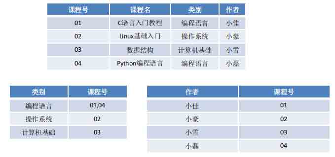

# 第 1 节 基本概念

## 实验简介

这一章节我们主要讲什么是数据结构，什么是算法，数据结构由数据和结构组成，它是一门研究非数值计算的程序设计问题中计算机的操作对象以及它们之间的关系和操作等的学科，数据结构是数据存储的方式，算法则是处理数据的方法，通常我们通过分析算法的时间复杂度和空间复杂度来判断它的好坏。

## 一、课程概述

### 1\. 课程介绍

本门课讲解的是数据结构，来让大家了解数据在计算机中的存储结构，数据结构的灵活应用能让计算机更高效地工作。

**注：本门课中的代码使用的是 C 语言。**

### 2\. 预备知识

学习本门课之前最好掌握一门编程语言基础，还没掌握的可以先学习下[C 语言入门教程](http://www.shiyanlou.com/courses/57)。

### 3\. 课程纲要

1--基本概念 2--线性表 3--栈和队列 4--树 5--图 6--查找 7--排序

### 4\. 学习方法

建议边学边敲代码，这样能帮助你更深入地理解，实验中有任何问题欢迎到[实验楼问答](http://www.shiyanlou.com/questions)提问。跟大家一起交流。

### 5.代码下载

```cpp
git clone http://git.shiyanlou.com/shiyanlou/datastructure_code 
```

## 二、基本概念

### 1\. 什么是数据结构

数据结构是由数据和结构两方面组成，下面举一个例子可以让大家很快地理解数据结构：

比如我们实验楼的课程管理系统，每一门课程由课程号、课程名、类别、作者等组成，每门课的课程号是唯一的，但不同的课程可能属于同一个类别，或者是同一个作者写的，由此我们可以建立一张按课程号顺序排列的课程表和两张按类别和作者名顺序排列的索引表，如下图所示，这样我们就可以按课程号或课程名或类别或作者名快速地找到我们想要学的那门课程。



在这个例子中，**数据**就是课程、类别和作者，**结构**就是课程与类别和作者的关系，它体现了一种最简单的线性关系，除了线性结构外，还有集合结构和更为复杂的树形结构和图结构，简单来说，数据结构是一门研究非数值计算的程序设计问题中计算机的操作对象以及它们之间的关系和操作等的学科，，学好数据结构可以使计算机更高效地工作。

### 2\. 什么是算法

通常我们学数据结构的同时也会学习算法，数据结构是数据存储的方式，而算法就是处理数据的方法，数据结构的不同就会导致算法的不同，数据结构的选择对算法效率会产生重大的影响，所以数据结构与算法紧密联系。

一个问题可能会有多种算法，我们当然会采用最好的那个算法，但是怎么判断一个问题的好坏与否呢？我们一般会通过分析它们的时间复杂度和空间复杂度来进行比较。

一般情况下，算法的基本操作重复执行的次数是模块 n 的某一个函数 f(n)，因此，算法的**时间复杂度**记做：T(n)=O(f(n))。

在计算时间复杂度的时候，先找出算法的基本操作，然后根据相应的各语句确定它的执行次数，再找出 T(n) 的同数量级（它的同数量级有以下：1，log(2)n，n，n log(2)n ，n 的平方，n 的三次方，2 的 n 次方，n!），找出后，f(n) = 该数量级，若 T(n)/f(n) 求极限可得到一常数 c，则时间复杂度 T(n) = O(f(n))。

例如：

```cpp
for(i=1;i<=n;++i)
{
    for(j=1;j<=n;++j)
    {
        c[i][j]=0;//该步骤属于基本操作执行次数：n 的平方次
        for(k=1;k<=n;++k)
            c[i][j]+=a[i][k]*b[k][j];//该步骤属于基本操作执行次数：n 的三次方次
    }
} 
```

则有 T(n) = n 的平方+n 的三次方，根据上面括号里的同数量级，我们可以确定 n 的三次方为 T（n）的同数量级 则有 f(n) = n 的三次方，然后根据 T(n)/f(n) 求极限可得到常数 c 则该算法的时间复杂度：T(n) = O(n³) 注：n³ 即是 n 的 3 次方。

那么什么是**空间复杂度**呢？一个程序的空间复杂度是指运行完一个程序所需内存的大小。利用程序的空间复杂度，可以对程序的运行所需要的内存多少有个预先估计。一个程序执行时除了需要存储空间和存储本身所使用的指令、常数、变量和输入数据外，还需要一些对数据进行操作的工作单元和存储一些为现实计算所需信息的辅助空间。程序执行时所需存储空间包括以下两部分： （1）固定部分。这部分空间的大小与输入/输出的数据的个数多少、数值无关。主要包括指令空间（即代码空间）、数据空间（常量、简单变量）等所占的空间。这部分属于静态空间。 （2）可变空间。这部分空间的主要包括动态分配的空间，以及递归栈所需的空间等。这部分的空间大小与算法有关。 一个算法所需的存储空间用 f(n)表示。 S(n)=O(f(n)) 其中 n 为问题的规模，S(n)表示空间复杂度。

上述对时间复杂度和空间复杂度的解释来自[百度百科](http://baike.baidu.com/view/104946.htm?fr=aladdin)

## 作业

输入一组整数，求出这组数字子序列和中的最大值，只要求出最大子序列的和，不必求出最大值对应的序列。

> 最大子序列和：整数序列 A1， A2，... An （可能有负数），求 A1~An 的一个子序列 Ai~Aj，使得 Ai 到 Aj 的和最大。

例如：

序列：-2, 11, -4, 13, -5, 2, -5, -3, 12, -9，则最大子序列和为 21。

序列：0, -3, 6, 8, -20, 21, 8, -9, 10, -1, 3, 6, 5，则最大子序列和为 43。

实验中有任何问题欢迎到[实验楼问答](http://www.shiyanlou.com/questions)提问。