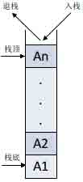

# 第 3 节 线性结构-栈和队列

## 实验简介

前一章我们讲了线性结构中的线性表，这一章我们来讲解线性结构中的栈和队列，其实栈和队列也是线性表，只是它们是操作受限的线性表。

## 一、栈

首先我们来讲讲栈，栈是只能在表尾进行插入或删除操作的线性表，通常我们称表尾端为栈顶，表头端为栈底，它是一种先进后出的线性表，既只能在表尾端插入元素，称为入栈，也只能在表尾端删除元素，称为退栈，如下图所示



栈既然也是线性表，那么它也有顺序存储结构和链式存储结构两种表示方法，这两种表示方法实现类似，我们这里讲解一下顺序存储结构的代码实现：

```cpp
#include <stdio.h>
#include <stdlib.h>

#define TRUE 1
#define FALSE 0
#define OK 1
#define ERROR 0
#define OVERFLOW -2
#define INIT_SIZE 20
#define INCREMENT_SIZE 5

typedef int SElemType;
typedef int Status;

/*
 * 存储结构
 */
typedef struct
{
    SElemType *base;    //栈尾指针
    SElemType *top;     //栈顶指针
    int size;           //栈的大小
}SqStack;

/*
 * 初始化栈
 */
Status InitStack(SqStack *S)
{
    S->base = (SElemType*) malloc(INIT_SIZE * sizeof(SElemType));
    if (!S->base)
    {
        exit(OVERFLOW);
    }
    S->top = S->base;
    S->size = INIT_SIZE;
    return OK;
}

/*
 * 销毁栈
 */
Status DestroyStack(SqStack *S)
{
    free(S->base);
    S->base = NULL;
    S->top = NULL;
    S->size = 0;
    return OK;
}

/*
 * 清空栈
 */
Status ClearStack(SqStack *S)
{
    S->top = S->base;
    return OK;
}

/*
 * 判断栈是否为空
 */
Status IsEmpty(SqStack S)
{
    if (S.top == S.base)
    {
        return TRUE;
    }
    else
        return FALSE;
}

/*
 * 获取栈的长度
 */
int GetLength(SqStack S)
{
    return S.top - S.base;
}

/*
 * 获取栈顶元素
 */
Status GetTop(SqStack S, SElemType *e)
{
    if (S.top > S.base)
    {
        *e = *(--S.top);
        return OK;
    }
    else
    {
        return ERROR;
    }
}

/*
 * 压栈
 */
Status Push(SqStack *S, SElemType e)
{
    if ((S->top - S->base) / sizeof(SElemType) >= S->size)
    {
        S->base = (SElemType*) realloc(S->base, (S->size + INCREMENT_SIZE) * sizeof(SElemType));
        if (!S->base)
        {
            exit(OVERFLOW);
        }
        S->top = S->base + S->size;
        S->size += INCREMENT_SIZE;
    }
    *S->top = e;
    S->top++;
    return OK;
}

/*
 * 退栈
 */
Status Pop(SqStack *S, SElemType *e)
{
    if (S->top == S->base)
    {
        return ERROR;
    }
    S->top--;
    *e = *S->top;
    return OK;
}

/*
 * 访问元素
 */
void visit(SElemType e)
{
    printf("%d ", e);
}

/*
 * 遍历栈
 */
Status TraverseStack(SqStack S, void (*visit)(SElemType))
{
    while (S.top > S.base)
    {
        visit(*S.base);
        S.base++;
    }
    return OK;
}

int main()
{
    SqStack S;
    if (InitStack(&S))
    {
        SElemType e;
        int i;

        printf("init_success\n");

        if (IsEmpty(S))
        {
            printf("Stack is empty\n");
        }

        for (i = 0; i < 10; i++)
        {
            Push(&S, i);
        }

        GetTop(S, &e);
        printf("The first element is %d\n", e);

        printf("length is %d\n", GetLength(S));

        Pop(&S, &e);
        printf("Pop element is %d\n", e);

        TraverseStack(S, *visit);

        if (DestroyStack(&S))
        {
            printf("\ndestroy_success\n");
        }
    }
} 
```

通过栈可以解决很多问题，例如数值转换、括号匹配、迷宫求解、表达式求值和汉诺塔等等问题。

## 二、队列

上面我们讲了栈，接下来我们讲下队列，队列刚好和栈相反，它是一种先进先出的线性表，只能在一端插入元素，在另一端删除元素，如下图所示，允许插入元素的一端称为队尾，允许删除元素的一端称为队头。


队列也一样有顺序和链式存储结构两种表示方法，前面的栈我们实现了顺序存储结构，这里我们就代码实现下队列的链式存储结构：

```cpp
#include <stdio.h>
#include <stdlib.h>

#define TRUE 1
#define FALSE 0
#define OK 1
#define ERROR 0
#define OVERFLOW -2

typedef int QElemType;
typedef int Status;

/*
 * 存储结构
 */
typedef struct QNode
{
    QElemType data;
    struct QNode *next;
}QNode, *QueuePtr;

typedef struct
{
    QueuePtr front; //队头指针
    QueuePtr rear;  //队尾指针
}LinkQueue;

/*
 * 初始化队列
 */
Status InitQueue(LinkQueue *Q)
{
    Q->front = Q->rear = (QueuePtr) malloc(sizeof(QNode));
    if (!Q->front)
    {
        exit(OVERFLOW);
    }
    Q->front->next = NULL;
    return OK;
}

/*
 * 销毁队列
 */
Status DestroyQueue(LinkQueue *Q)
{
    while (Q->front)
    {
        Q->rear = Q->front->next;
        free(Q->front);
        Q->front = Q->rear;
    }
    return OK;
}

/*
 * 清空队列
 */
Status ClearQueue(LinkQueue *Q)
{
    DestroyQueue(Q);
    InitQueue(Q);
}

/*
 * 判断队列是否为空
 */
Status IsEmpty(LinkQueue Q)
{
    if (Q.front->next == NULL)
    {
        return TRUE;
    }
    else
    {
        return FALSE;
    }
}

/*
 * 获取队列的长度
 */
int GetLength(LinkQueue Q)
{
    int i = 0;
    QueuePtr p = Q.front;
    while (Q.rear != p)
    {
        i++;
        p = p->next;
    }
    return i;
}

/*
 * 获取队头元素
 */
Status GetHead(LinkQueue Q, QElemType *e)
{
    QueuePtr p;
    if (Q.front == Q.rear)
    {
        return ERROR;
    }
    p = Q.front->next;
    *e = p->data;
    return OK;
}

/*
 * 入队
 */
Status EnQueue(LinkQueue *Q, QElemType e)
{
    QueuePtr p = (QueuePtr) malloc(sizeof(QNode));
    if (!p)
    {
        exit(OVERFLOW);
    }
    p->data = e;
    p->next = NULL;
    Q->rear->next = p;
    Q->rear = p;
    return OK;
}

/*
 * 出队
 */
Status DeQueue(LinkQueue *Q, QElemType *e)
{
    QueuePtr p;
    if (Q->front == Q->rear)
    {
        return ERROR;
    }
    p = Q->front->next;
    *e = p->data;
    Q->front->next = p->next;
    if (Q->rear == p)
    {
        Q->rear = Q->front;
    }
    free(p);
    return OK;
}

/*
 * 访问元素
 */
void visit(QElemType e)
{
    printf("%d ", e);
}

/*
 * 遍历队列
 */
Status TraverseQueue(LinkQueue Q, void (*visit)(QElemType))
{
    QueuePtr p = Q.front->next;
    while (p)
    {
        visit(p->data);
        p = p->next;
    }
    return OK;
}

int main()
{
    LinkQueue Q;
    if (InitQueue(&Q))
    {
        QElemType e;
        int i;

        printf("init_success\n");

        if (IsEmpty(Q))
        {
            printf("queue is empty\n");
        }

        for (i = 0; i < 10; i++)
        {
            EnQueue(&Q, i);
        }

        GetHead(Q, &e);
        printf("The first element is %d\n", e);

        printf("length is %d\n", GetLength(Q));

        DeQueue(&Q, &e);
        printf("delete element is %d\n", e);

        TraverseQueue(Q, *visit);

        if (DestroyQueue(&Q))
        {
            printf("\ndestroy_success\n");
        }
    }
} 
```

上面实现的是链式存储结构，使用顺序存储结构可以实现循环队列，有兴趣的童鞋可以查查资料哦。

## 三、小结

这一章我们讲了栈和队列，本质上它们也是线性表，栈是先进后出，而队列是先进先出。

## 作业

1、把一个十进制的数转换为一个二进制的数，例如 9 转换为二进制是 1001，可以使用栈来实现。

2、用两个栈来实现一个队列，完成队列的 Push 和 Pop 操作。 队列中的元素为 int 类型。

实验中有任何问题欢迎到[实验楼问答](http://www.shiyanlou.com/questions)提问。