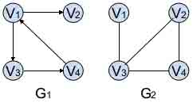

# 第 5 节 非线性结构-图

## 实验简介

前面已经讲了几种线性结构和树形结构，本章来讲解比它们更为复杂的图结构。在线性结构中，元素之间是一种线性关系，只有一个直接前驱和一个直接后继，而树结构体现的是一种层次关系，在图中每个元素之间都可能是有关联的。

## 1.什么是图

下面就通过一个例子来让大家快速地知道什么是图，如下图所示，G1 是有向图，G2 是无向图，每个数据元素称为**顶点**，在有向图中，从 V1 到 V3 称为一条**弧**，V3 到 V1 为另一条弧，V1 称为**弧尾**，V3 称为**弧头**，在无向图中，从 V1 到 V3 称为一条**边**。有 n 个顶点，1/2*n*(n-1)条边的无向图称为**完全图**，有 n*(n-1)条弧有向图称为**有向完全图**，有很少条边或图称为**稀疏图**，反之称为**稠密图**。在 G2 无向图中，类似 V3 与 V1、V2 和 V4 之间有边的互称为**邻接点**，与顶点相关联的边数称为顶点的**度**，例如 V3 顶点的度为 3，而在 G1 有向图中，顶点的**度**是顶点的出度和入度之和，以顶点为头的弧的数目称为**入度**，为尾的弧的数目称为**出度**，例如 V1 顶点的出度为 2，入度为 1，它的度为 1+2=3。从一个顶点到另一个顶点的顶点序列称为**路径**，在有向图中，路径是有方向的，路径上边或弧的数目称为路径的长度，如果一条路径中的起始顶点跟结束结点相同，那么称这个路径为**环或回路**，不出现重复顶点的路径称为**简单路径**。无向图中，如果一个顶点到另一个顶点有路径，那么它们就是**连通的**，如果图中的任意两个顶点都是连通的，那么这个图就是**连通图**，无向图中的极大连通子图称为连通分量，如果是有向图中的任意一对顶点都有路径，那么这个就是**强连通图**，相应的它的极大连通子图就称为**强连通分量**。一个连通图的一个极小连通子图，它包含所有顶点，但足以构成一棵树的 n-1 条边，加一条边必定会形成环，这个就称为**生成树**。



## 2\. 图的表示和实现

表示图通常有四种方法--数组表示法、邻接表、十字链表和邻接多重表。邻接表是图的一种链式存储结构，十字链表是有向图的另一种链式存储结构，邻接多重表是无向图的另一种链式存储结构。这里主要讲解一下邻接表的表示和实现，邻接表中有两种结点，一种是头结点，另一种是表结点，头结点中存储一个顶点的数据和指向链表中第一个结点，表结点中存储当前顶点在图中的位置和指向下一条边或弧的结点，表头结点用链式或顺序结构方式存储，如下图所示就是上图 G2 无向图的邻接表表示。


## 3\. 图的遍历

通常图的遍历有两种：深度优先搜索和广度优先搜索。

**深度优先搜索**是树的先根遍历的推广，它的基本思想是：从图 G 的某个顶点 v0 出发，访问 v0，然后选择一个与 v0 相邻且没被访问过的顶点 vi 访问，再从 vi 出发选择一个与 vi 相邻且未被访问的顶点 vj 进行访问，依次继续。如果当前被访问过的顶点的所有邻接顶点都已被访问，则退回到已被访问的顶点序列中最后一个拥有未被访问的相邻顶点的顶点 w，从 w 出发按同样的方法向前遍历，直到图中所有顶点都被访问。

**广度优先搜索**是树的按层次遍历的推广，它的基本思想是：首先访问初始点 vi，并将其标记为已访问过，接着访问 vi 的所有未被访问过的邻接点 vi1,vi2,…, vin，并均标记已访问过，然后再按照 vi1,vi2,…, vin 的次序，访问每一个顶点的所有未被访问过的邻接点，并均标记为已访问过，依次类推，直到图中所有和初始点 vi 有路径相通的顶点都被访问过为止。

如下图


深度优先搜索：0->1->3->7->4->2->5->6

广度优先搜索：0->1->2->3->4->5->6->7

下面是邻接表的创建和图的遍历的代码实现：

```cpp
#include <stdio.h>
#include <stdlib.h>

#define TRUE 1
#define FALSE 0
#define OK 1
#define ERROR 0
#define OVERFLOW -2
#define MAX_NUM 20

typedef int Status;
typedef int QElemType;
typedef char VexType;

/*
 * 邻接表存储结构
 */
typedef struct EdgeNode
{
    int adjvex; //顶点的位置
    struct EdgeNode *next; //指向下一条边的指针
}EdgeNode, *EdgeLink;

typedef struct VexNode
{
    VexType data;   //顶点数据
    EdgeNode *firstEdge;    //指向第一条依附该顶点的边的指针
}VexNode, AdjList[MAX_NUM];

typedef struct
{
    AdjList adjList;
    int vexNum, edgeNum;    //顶点数和边数
}ALGraph;

/*
 * 队列存储结构(用于图的遍历)
 */
typedef struct QNode
{
    QElemType data; //结点数据
    struct QNode *next; //指向下一个结点
}QNode, *QueuePtr;

typedef struct
{
    QueuePtr front; //队头指针
    QueuePtr rear;  //队尾指针
}LinkQueue;

/*
 * 初始化队列
 */
Status InitQueue(LinkQueue *Q)
{
    Q->front = Q->rear = (QueuePtr) malloc(sizeof(QNode));
    if (!Q->front)
    {
        exit(OVERFLOW);
    }
    Q->front->next = NULL;
    return OK;
}

/*
 * 判断队列是否为空
 */
Status IsEmpty(LinkQueue Q)
{
    if (Q.front->next == NULL)
    {
        return TRUE;
    }
    else
    {
        return FALSE;
    }
}

/*
 * 入队
 */
Status EnQueue(LinkQueue *Q, QElemType e)
{
    QueuePtr p = (QueuePtr) malloc(sizeof(QNode));
    if (!p)
    {
        exit(OVERFLOW);
    }
    p->data = e;
    p->next = NULL;
    Q->rear->next = p;
    Q->rear = p;
    return OK;
}

/*
 * 出队
 */
Status DeQueue(LinkQueue *Q, QElemType *e)
{
    QueuePtr p;
    if (Q->front == Q->rear)
    {
        return ERROR;
    }
    p = Q->front->next;
    *e = p->data;
    Q->front->next = p->next;
    if (Q->rear == p)
    {
        Q->rear = Q->front;
    }
    free(p);
    return OK;
}

/*
 * 创建图
 */
Status CreateGraph(ALGraph *G)
{
    int i, j, k;
    EdgeLink e;
    printf("请输入顶点数目和边数:\n");
    scanf("%d", &G->vexNum);
    scanf("%d", &G->edgeNum);
    getchar();
    printf("请输入各顶点的数据:\n");
    for (i = 0; i < G->vexNum; i++)
    {
        scanf("%c",&G->adjList[i].data);
        if (G->adjList[i].data == '\n')
        {
            i--;
            continue;
        }
        G->adjList[i].firstEdge = NULL;
    }

    printf("请依次输入边(Vi,Vj)的顶点序号:\n");
    for (k = 0; k < G->edgeNum; k++)
    {
        scanf("%d", &i);
        scanf("%d", &j);
        e = (EdgeLink) malloc(sizeof(EdgeNode));
        e->adjvex = j;
        e->next = G->adjList[i].firstEdge;
        G->adjList[i].firstEdge = e;
        e = (EdgeLink) malloc(sizeof(EdgeNode));
        e->adjvex = i;
        e->next = G->adjList[j].firstEdge;
        G->adjList[j].firstEdge = e;
    }
    return OK;
}

int visited[MAX_NUM];    //用于记录遍历状态

/*
 * 递归从第 i 个结点深度优先遍历图
 */
void DFS(ALGraph G, int i)
{
    EdgeLink p;
    visited[i] = TRUE;
    printf("%c ", G.adjList[i].data);
    p = G.adjList[i].firstEdge;
    while (p)
    {
        if (!visited[p->adjvex])
        {
            DFS(G, p->adjvex);
        }
        p = p->next;
    }
}

/*
 * 深度优先遍历
 */
Status DFSTraverse(ALGraph G)
{
    int i;
    for (i = 0; i < MAX_NUM; i++)
    {
        visited[i] = FALSE;
    }
    for (i = 0; i < G.vexNum; i++)
    {
        if (!visited[i])
        {
            DFS(G, i);
        }
    }
    return OK;
}

/*
 * 广度优先遍历
 */
Status BFSTraverse(ALGraph G)
{
    int i;
    EdgeLink p;
    LinkQueue Q;
    InitQueue(&Q);
    for (i = 0; i < MAX_NUM; i++)
    {
        visited[i] = FALSE;
    }
    for (i = 0; i < G.vexNum; i++)
    {
        if (!visited[i])
        {
            visited[i] = TRUE;
            printf("%c ", G.adjList[i].data);
            EnQueue(&Q, i);
            while (!IsEmpty(Q))
            {
                DeQueue(&Q, &i);
                p = G.adjList[i].firstEdge;
                while (p)
                {
                    if (!visited[p->adjvex])
                    {
                        visited[p->adjvex] = TRUE;
                        printf("%c ", G.adjList[p->adjvex].data);
                        EnQueue(&Q, p->adjvex);
                    }
                    p = p->next;
                }
            }
        }
    }
    return OK;
}

int main()
{
    ALGraph G;
    CreateGraph(&G);
    printf("深度优先遍历:");
    DFSTraverse(G);
    printf("\n 广度优先遍历:");
    BFSTraverse(G);
    printf("\n");
} 
```


## 4\. 最小生成树

一个有 n 个结点的连通图的生成树是原图的极小连通子图，且包含原图中的所有 n 个结点，并且有保持图连通的最少的边。最小生成树可以用 kruskal（克鲁斯卡尔）算法或 Prim（普里姆）算法求出。

应用：例如要在 n 个城市之间铺设光缆，主要目标是要使这 n 个城市的任意两个之间都可以通信，但铺设光缆的费用很高，且各个城市之间铺设光缆的费用不同，因此另一个目标是要使铺设光缆的总费用最低。这就需要找到带权的最小生成树。

参考自[百度百科](http://baike.baidu.com/view/288214.htm?fr=aladdin)。

## 5\. 拓扑排序

拓扑排序简单地说，就是在有向图中，想访问一个顶点需要先访问它的所有前驱顶点。它的执行步骤为：

1.  在有向图中选一个没有前驱的顶点输出。
2.  从图中删除该顶点和所有以它为尾的弧。 重复上述步骤直到所有顶点都输出或者图中不存在无前驱的顶点为止，后者说明图中有环。


如上图，它的拓扑序列就为： Linux 基础入门->Vim 编辑器->Git Community Book->HTML 基础入门->SQL 基础课程->MySQL 参考手册中文版->Python 编程语言->Python Flask Web 框架->Flask 开发轻博客

## 6\. 最短路径问题

最短路径问题是图论研究中的一个经典算法问题，旨在寻找图（由结点和路径组成的）中两结点之间的最短路径。Dijkstra(迪杰斯特拉)算法是典型的最短路径路由算法，用于计算一个节点到其他所有节点的最短路径。主要特点是以起始点为中心向外层层扩展，直到扩展到终点为止。Dijkstra 算法能得出最短路径的最优解，但由于它遍历计算的节点很多，所以效率低。 其采用的是贪心法的算法策略，大概过程为先创建两个表，OPEN 和 CLOSE 表，OPEN 表保存所有已生成而未考察的节点，CLOSED 表中记录已访问过的节点，然后： 1． 访问路网中距离起始点最近且没有被检查过的点，把这个点放入 OPEN 组中等待检查。 2． 从 OPEN 表中找出距起始点最近的点，找出这个点的所有子节点，把这个点放到 CLOSE 表中。 3． 遍历考察这个点的子节点。求出这些子节点距起始点的距离值，放子节点到 OPEN 表中。 4． 重复第 2 和第 3 步,直到 OPEN 表为空，或找到目标点。

参考自[百度百科](http://baike.baidu.com/view/349189.htm?fr=aladdin)。

## 小结

这一章讲了图结构，它分为有向图和无向图，常见的表示方法有数组表示法、邻接表、十字链表和邻接多重表，通常它的遍历方式有两种深度优先遍历和广度优先遍历。常见的跟图相关的有最小生成树、拓扑排序和最短路径问题。

## 作业

实现 Dijkstra(迪杰斯特拉)算法。

实验中有任何问题欢迎到[实验楼问答](http://www.shiyanlou.com/questions)提问。