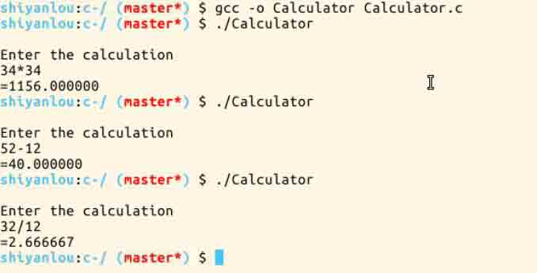

# 第 1 节 C 语言制作简单计算器

## 一. 项目说明

本实验环境采用带桌面的 Ubuntu Linux 环境，实验中会用到桌面上的程序：

1.  LX 终端（LXTerminal）: Linux 命令行终端，打开后会进入 Bash 环境，可以使用 Linux 命令

2.  Firefox：浏览器，可以用在需要前端界面的课程里，只需要打开环境里写的 HTML/JS 页面即可

3.  GVim：非常好用的编辑器，最简单的用法可以参考课程[Vim 编辑器](http://www.shiyanlou.com/courses/2)

### 1\. 环境使用

使用 GVim 编辑器输入实验所需的代码及文件，使用 LX 终端（LXTerminal）运行所需命令进行操作。

实验报告可以在个人主页中查看，其中含有每次实验的截图及笔记，以及每次实验的有效学习时间（指的是在实验桌面内操作的时间，如果没有操作，系统会记录为发呆时间）。这些都是您学习的真实性证明。

本课程中的所有源码可以通过以下方式下载:

```cpp
$ git clone http://git.shiyanlou.com/shiyanlou/Calculator 
```

## 二、项目介绍

我们要用 c 语言做一个简单的计算器，进行加、减、乘、除操作。本程序涉及的所有数学知识都很简单，但输入过程会增加复杂性。我们需要检查输入，确保用户没有要求计算机完成不可能的任务。还必须允许用户一次输入一个计算式，例如： 32.4+32 或者 9*3.2

### 项目效果图



### 编写这个程序的步骤如下：

*   获得用户要求计算机执行计算所需的输入。
*   检查输入，确保输入可以理解。
*   执行计算。
*   显示结果。

## 三、解决方案

### 1.步骤 1

获得用户输入是很简单的，可以使用 printf()和 scanf()。下面是读取用户输入的程序代码：

```cpp
#include<stdio.h>
int main()
{
   double number1=0.0;     //定义第一个操作值
   double number2=0.0;     //定义第二个操作值
   char operation=0;       //operation 必须是'+''-''*''/'或'%'

   printf("\nEnter the calculation\n");
   scanf("%lf%c%lf",&number1,&operation,&number2);

   return 0;  
} 
```

### 2.步骤 2

接着，检查输入是否正确。最明显的检查是要执行的操作是否有效。有效的操作有+、-、*、/和%，所以需要检查输入的操作是否是其中的一个。

还需要检查第二个数字，如果操作是/或者%，第二个数字就不能是 0。如果右操作数是 0，这些操作就是无效的。这些操作都可以用 if 语句来完成，switch 语句则为此提供了一种更好的方式，因此它比一系列 if 语句更容易理解。

```cpp
switch(operation)
   {
      case '+':
           printf("=%lf\n",number1+number2);
          break;

      case '-':
           printf("=%lf\n",number1-number2);
           break;

      case '*':
           printf("=%lf\n",number1*number2);
           break;

      case '/':
           if(number2==0)
             printf("\n\n\aDavision by zero error!\n");
           else
             printf("=%lf\n",number1/number2);
           break;

      case '%':
           if((long)number2==0)  
             printf("\n\n\aDavision by zero error!\n"); 
           else
             printf("=%ld\n",(long)number1%(long)number2);      
           break;

      default:
          printf("\n\n\aDavision by zero error!\n");
          break; 
```

取余运算符对 float 或 double 类型是没有意义的，因为他们可以表示精确的结果。只有把%运算符应用于整数类型才有意义。因此在应用这个运算符前，把操作数转换为整数。当运算符是%时，将第二个操作数转换为一个整数，所以仅仅检查第二个操作数是否为 0 是不够的，还必须检查 number2 在转换为 long 时，值是否为 0.例如 0.5 不是 0，但是转换为整数时就是 0。

## 四、程序的完整代码

```cpp
#include<stdio.h>
int main()
{
   double number1=0.0;
   double number2=0.0;
   char operation=0;

   printf("\nEnter the calculation\n");
   scanf("%lf%c%lf",&number1,&operation,&number2);

   switch(operation)
   {
      case '+':
           printf("=%lf\n",number1+number2);
          break;

      case '-':
           printf("=%lf\n",number1-number2);
           break;

      case '*':
           printf("=%lf\n",number1*number2);
           break;

      case '/':
           if(number2==0)
             printf("\n\n\aDavision by zero error!\n");
           else
             printf("=%lf\n",number1/number2);
           break;

      case '%':
           if((long)number2==0)  
             printf("\n\n\aDavision by zero error!\n"); 
           else
             printf("=%ld\n",(long)number1%(long)number2);      
           break;

      default:
          printf("\n\n\aDavision by zero error!\n");
          break;          

    }
    return 0;
} 
```