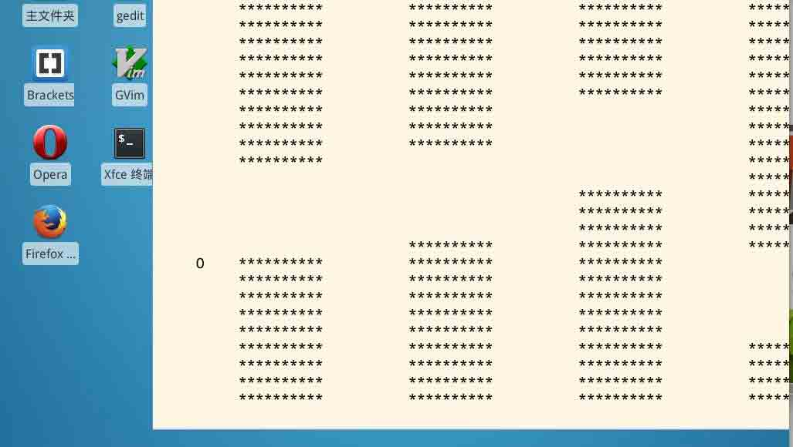

# 第 1 节 C 语言版 flappy bird

## 一、实验说明

### 1\. 环境登录

无需密码自动登录，系统用户名 shiyanlou。

### 2\. 环境介绍

本实验环境采用带桌面的 Ubuntu Linux 环境，实验中会用到桌面上的程序：

1.  LX 终端（LXTerminal）：Linux 命令行终端，打开后会进入 Bash 环境，可以使用 Linux 命令。
2.  GVim：非常好用的编辑器，最简单的用法可以参考课程 [Vim 编辑器](http://www.shiyanlou.com/courses/2)。

### 3.环境使用

使用 GVim 编辑器输入实验所需的代码及文件，使用 LX 终端（LXTerminal）运行所需命令进行操作。 实验报告可以在个人主页中查看，其中含有每次实验的截图及笔记，以及每次实验的有效学习时间（指的是在实验桌面内操作的时间，如果没有操作，系统会记录为发呆时间）。这些都是您学习的真实性证明。

### 4\. 项目介绍

这次我们的项目是 flappy bird 游戏，准备好砸你的键盘吧。

最终效果图是这样的：



如果需要先学习 C 语言教程，请点击：

*   [C 语言入门教程](https://www.shiyanlou.com/courses/57)

## 二、项目准备

### 1\. 基础知识

我们的项目用到了一点数据结构的知识，还涉及到了 linux 的一些系统调用，有助于我们加深对 linux 下的程序设计的深入理解。此外，我们还用了一个文本界面的屏幕绘图库 ncurses。因此编译时需要加上 -lcurses 选项。

**安装 ncurses 库**

```cpp
sudo apt-get install libncurses5-dev 
```

### 2\. 设计思路

我们的 flappy bird 游戏里最关键的两点就是响应键盘输入和定时绘图。这就需要结合 linux 提供的系统函数和我们使用的 ncurses 库来完成了。另一个问题是如何使 bird 能看起来像是在向前飞一样，如果一直移动 bird 势必会超出屏幕范围。我们不妨反过来想，让 bird 一直保持在原地，而让背景一直向 bird 的方向移动。这样，就造成了好像 bird 一直向前移动的效果。

## 三、常量定义

让我们先来完成一些基础工作，因为我们是终端字符界面，所以一切离不开 ASCII 字符，我们需要定义一些常量。我们用 `*` 来表示背景里的柱子，用 `O` 来表示 bird。好了，代码如下：

```cpp
 #include <curses.h>
    #include <stdlib.h>
    #include <signal.h>
    #include <sys/time.h>

    #define CHAR_BIRD 'O'
    #define CHAR_STONE '*'
    #define CHAR_BLANK ' ' 
```

背景上的柱子用链表结构表示，定义为结构体如下：

```cpp
 typedef struct node {
        int x, y;
        struct node *next;
    }node, *Node; 
```

还需要几个全局变量：

```cpp
 Node head, tail;
    int bird_x, bird_y;
    int ticker; 
```

为了调用起来方便，我们先声明一下我们定义的函数：

```cpp
 void init();
    void init_bird();
    void init_draw();
    void init_head();
    void init_wall();
    void drop(int sig);
    int set_ticker(int n); 
```

## 四、定时问题

现在我们来解决如何让背景定时移动的问题。linux 系统为我们提供了信号这一概念，可以解决我们的问题。不知道什么是信号？没关系，说白了就是 linux 内核有个定时器，它每隔一段时间就会向我们的程序发送一个信号，我们的信号接收函数就会被自动执行，我们只要在接受信号的函数里移动背景就行了。因为是内核发送的信号，所以不会因为我们的键盘接受阻塞而阻塞。下面就来写我们的代码：

```cpp
 int set_ticker(int n_msec)
        {
            struct itimerval timeset;
            long n_sec, n_usec;

            n_sec = n_msec / 1000;
            n_usec = (n_msec % 1000) * 1000L;

            timeset.it_interval.tv_sec = n_sec;
            timeset.it_interval.tv_usec = n_usec;

            timeset.it_value.tv_sec = n_sec;
            timeset.it_value.tv_usec = n_usec;

            return setitimer(ITIMER_REAL, &timeset, NULL);
        } 
```

以上代码用来设定内核的定时周期，下面是我们的信号接受函数：

```cpp
 void drop(int sig)
    {
        int j;
        Node tmp, p;
    //draw bird
        move(bird_y, bird_x);
        addch(CHAR_BLANK);
        refresh();
        bird_y++;
        move(bird_y, bird_x);
        addch(CHAR_BIRD);
        refresh();
        if((char)inch() == CHAR_STONE) {
            set_ticker(0);
            sleep(1);
            endwin();
            exit(0);
        }
    //first wall out of screen?
        p = head->next;
        if(p->x < 0) {
            head->next = p->next;
            free(p);
            tmp = malloc(sizeof(node));
            tmp->x = 99;
            do {
                tmp->y = rand() % 16;
            } while(tmp->y < 5);
            tail->next = tmp;
            tmp->next = NULL;
            tail = tmp;
            ticker -= 10;  //speed up!
            set_ticker(ticker);
        }
    //draw new walls
        for(p = head->next; p->next != NULL; p->x--, p = p->next) {
            for(j = 0; j < p->y; j++) {
                move(j, p->x);
                addch(CHAR_BLANK);
                refresh();
            }
            for(j = p->y+5; j <= 23; j++) {
                move(j, p->x);
                addch(CHAR_BLANK);
                refresh();
            }

            if(p->x-10 >= 0 && p->x < 80) {
                for(j = 0; j < p->y; j++) {
                    move(j, p->x-10);
                    addch(CHAR_STONE);
                    refresh();
                }
                for(j = p->y + 5; j <= 23; j++) {
                    move(j, p->x-10);
                    addch(CHAR_STONE);
                    refresh();
                }
            }
        }
        tail->x--;
    } 
```

我们在信号接收函数里将背景向前移动一列，并且让 bird 向下掉落一行，而且要检测 bird 是否撞到柱子，是的话就 game over 了。

## 五、main 函数

先看看代码：

```cpp
 int main()
    {
        char ch;

        init();
        while(1) {
            ch = getch();
            if(ch == ' ' || ch == 'w' || ch == 'W') {
                move(bird_y, bird_x);
                addch(CHAR_BLANK);
                refresh();
                bird_y--;
                move(bird_y, bird_x);
                addch(CHAR_BIRD);
                refresh();
                if((char)inch() == CHAR_STONE) {
                    set_ticker(0);
                    sleep(1);
                    endwin();
                    exit(0);
                }
            }
            else if(ch == 'z' || ch == 'Z') {
                set_ticker(0);
                do {
                    ch = getch();
                } while(ch != 'z' && ch != 'Z');
                set_ticker(ticker);
            }
            else if(ch == 'q' || ch == 'Q') {
                sleep(1);
                endwin();
                exit(0);
            }
        }

        return 0;
    } 
```

我们在 main 函数里先做好初始化，然后在循环中接受键盘输入。如果是 w 或空格键被按下，我们的 bird 就向上飞两行，如果是 q 被按下就退出游戏，z 被按下游戏则会暂停。

下面看一下 init 函数：

```cpp
 void init()
    {
        initscr();
        cbreak();
        noecho();
        curs_set(0);
        srand(time(0));
        signal(SIGALRM, drop);

        init_bird();
        init_head();
        init_wall();
        init_draw();
        sleep(1);
        ticker = 500;
        set_ticker(ticker);
    } 
```

init 函数首先初始化屏幕，调用了 ncurses 提供的函数，然后调用各个子函数进行初始化。注意，我们安装了信号接收函数 drop，并且设定了定时时间。各个初始化子函数如下。

初始化 bird 位置:

```cpp
 void init_bird()
    {
        bird_x = 5;
        bird_y = 15;
        move(bird_y, bird_x);
        addch(CHAR_BIRD);
        refresh();
        sleep(1);
    } 
```

初始化背景里的柱子链表结构:

```cpp
 void init_head()  //with header
    {
        Node tmp;

        tmp = malloc(sizeof(node));
        tmp->next = NULL;
        head = tmp;
        tail = head;
    }

    void init_wall()
    {
        int i;
        Node tmp, p;

        p = head;
        for(i = 19; i <= 99; i += 20) {
            tmp = malloc(sizeof(node));
            tmp->x = i;
            do {
                tmp->y = rand() % 16;
            }while(tmp->y < 5);
            p->next = tmp;
            tmp->next = NULL;
            p = tmp;
        }
        tail = p;
    } 
```

初始化屏幕:

```cpp
 void init_draw()
    {
        Node p;
        int i, j;

        for(p = head->next; p->next != NULL; p = p->next) {
            for(i = p->x; i > p->x-10; i--) {
                for(j = 0; j < p->y; j++) {
                    move(j, i);
                    addch(CHAR_STONE);
                    refresh();
                }
                for(j = p->y+5; j <= 23; j++) {
                    move(j, i);
                    addch(CHAR_STONE);
                    refresh();
                }
            }
            sleep(1);
        }
    } 
```

## 六、编译

```cpp
gcc flappy_bird.c -o flappy_bird -lcurses 
```

到此，我们的 flappy_bird 游戏就完成了。

## 七、作业思考

定时问题和游戏难度的关系是怎样的？