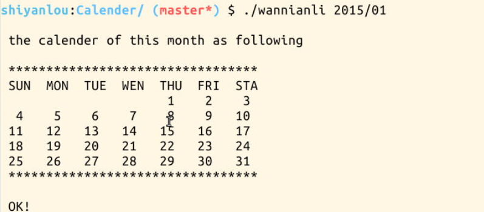
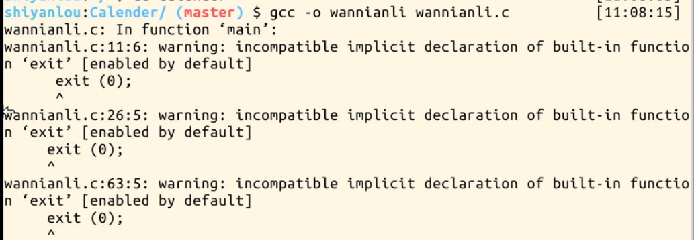

# 第 1 节 C 语言简单编写万年历

## 一、项目说明

### 1\. 工具介绍

>1、本实验环境采用带桌面的 Ubuntu Linux 环境，实验中会用到桌面上的程序：

>2、LX 终端（LXTerminal）: Linux 命令行终端，打开后会进入 Bash 环境，可以使用 Linux 命令

>3、Firefox：浏览器，可以用在需要前端界面的课程里，只需要打开环境里写的 HTML/JS 页面即可

>4、GVim：非常好用的编辑器，最简单的用法可以参考课程[vim](http://www.shiyanlou.com/courses/2)编辑器

### 2\. 环境使用

>使用 GVim 编辑器输入实验所需的代码及文件，使用 LX 终端（LXTerminal）运行所需命令进行操作。

>实验报告可以在个人主页中查看，其中含有每次实验的截图及笔记，以及每次实验的有效学习时间（指的是在实验桌面内操作的时间，如果没有操作，系统会记录为发呆时间）。这些都是您学习的真实性证明。

### 3\. 项目介绍

2015 新年已经到来，小伙伴们要抓紧时间认真学习哦，相信漫游在实验楼中，大家都会有所收获的！可能学习太认真了，突然忘记今天是星期几了，这样就可以通过万年历来查询。现在就让我们通过 C 语言一起来制作一个简单的 **万年历** 吧！

所有的代码都可以通过以下方式下载：

```cpp
$ git clone http://github.com/zhouhaner/Calender.git 
```

得到的实验效果是这样的： 

如果大家对在实验楼环境下编写和调试 C 语言程序还不是很熟悉，那么大家可以先学习 [C 语言入门教程](https://www.shiyanlou.com/courses/57)。

## 二、设计思路

问题来了。设计一个万年历的思路是什么呢，其实很简单，万年历的主要功能是提供给使用者查询日期时间。那么万年历具有什么特点呢？

（1）平年 365 天（52 周+1 天），闰年 366 天（52 周+2 天），平年 2 月 28 天，闰年 2 月 29 天。由于公元 1 月 1 日设为星期六，故 3 月 1 日为星期三。为使算法达到最简，故本算法以“星期”为计算单位，且选 3 月 1 日为基月。

（2）每 400 年整一闰，或每 4 年且不为百年的一闰，即凡能被 400 整除，或不能被 100 整除但能被 4 整除的年份为润年。

（3）每 4 年（3 个平年+1 个闰年）共 208 周+5 天 每百年共 100*（208 周+5 天）-1 天=5217 周+5 天 每 400 年共 4*（5217 周+5 天）+1 天（整 400 年闰）=20871 周+0 天，即每 400 年一个轮回。

## 三、计算模块

所谓 计算模块 就是通过用户所输入的日期如：2015/1，通过一定的算法来得到这一个月的日期和星期的分布，这里当然就是使用**设计思路**里面所讲的算法。其代码如下：

```cpp
 int year=0,month=0,day=0,week;
    int d,i,dm,dy,m2;
    char WEEK[9];
    if (a==1)
    {
     printf ("\n ERROR! you forgot to enter the date you want to view\n");
     exit (0);
    }
   i=0; d=-1;
   while (date[1][i])/*遍历传入的参数日期，计算出 year，month，day*/
    {if ((date[1][i]=='/'||date[1][i]=='.')&&d==-1) { d=0; i++; continue; }
     if ((date[1][i]=='/'||date[1][i]=='.')&&d==0) { d=1; i++; continue; }
     if (d==-1) year=year*10+(date[1][i]-'0');
     if (d==0) month=month*10+(date[1][i]-'0');
     if (d==1) day=day*10+(date[1][i]-'0');
     i++;
    }
   if (month<1||month>12)/*若月份传入错误数字*/
   {
       printf ("\n ERROR! the entered MONTH is invalid\n");
       exit (0);
   }
   if (year==2000)
   {
       dy=0;                /*年引起的星期差为 0 个*/
       m2=1;                /*2 月引起的星期差为 1 个*/
       goto la_100;
   }
   if (year>2000)
       d=(year-1-2000)/4-(year-1-2000)/100+(year-1-2000)/400+1;
   else
       d=(year-2000)/4-(year-2000)/100+(year-2000)/400;
       dy=(year-2000)+d;     /*** 该年 1 月 1 号 到 2000 年 1 月 1 号的 " 星期差 " ***/
   if((year%4==0&&year%100!=0)||(year%100==0&&year%400==0))
       m2=1;
   else
       m2=0;  /*** 该年是否润 ***/
       la_100:                    /**** la_100 ****/
          /*** 该月以前的月所引起的 " 星期差 " ***/
   switch (month)
    {
     case 1: dm=0; month=31; break;       /*** month 在此存放该月天数 ***/
     case 2: dm=3; month=d==1? 29:28; break;
     case 3: dm=3+m2; month=31; break;
     case 4: dm=6+m2; month=30; break;
     case 5: dm=1+m2; month=31; break;
     case 6: dm=4+m2; month=30; break;
     case 7: dm=6+m2; month=31; break;
     case 8: dm=2+m2; month=31; break;
     case 9: dm=5+m2; month=30; break;
     case 10: dm=m2; month=31; break;
     case 11: dm=3+m2; month=30; break;
     case 12: dm=5+m2; month=31; break;
    } 
```

通过上面的代码，我们便可以将用户所输入的日期的月历计算出来。当然这是很简单的啦。并且，大家应该注意啦，这些是零散的算法而不是**函数**！其实读者自己也可以将其写作函数形式，便于以后调用！ 月历计算出来之后，可以通过很简单的 case 语句判断相应的日期所对应的星期：

```cpp
switch (week)
      {
       case 0: strcpy (WEEK,"SUNDAY"); break;
       case 1: strcpy (WEEK,"MONDAY"); break;
       case 2: strcpy (WEEK,"TUESDAY"); break;
       case 3: strcpy (WEEK,"WEDNESDAY"); break;
       case 4: strcpy (WEEK,"THURSDAY"); break;
       case 5: strcpy (WEEK,"FRIDAY"); break;
       case 6: strcpy (WEEK,"SATURDAY"); break;
       default: "null";break;
      } 
```

## 四、显示模块

最终，将这个月历显示在终端上应该怎么操作呢，其实很简单，原理和 **for** 循环输出矩阵是一样的：

```cpp
week=++week%7;
     printf ("\n the calender of this month as following\n");
     printf ("\n *********************************\n");
     printf (" SUN  MON  TUE  WEN  THU  FRI  STA\n");
     for (i=0;i<week;i++)
         printf ("     ");
     for (i=1;i<=month;i++)
     {
         printf (" %2d  ",i);
         week++;
         if (week%7==0&&i!=month)
             printf ("\n");
     }
     printf ("\n *********************************\n");
     printf ("\n OK!\n"); 
```

最后，这些部分都只是一些分散的代码，那么应该怎么解决呢。两个方法，第一种是将每个模块写为函数形式，然后在 main 函数中调用各个模块函数。第二种方法是直接定义一个 main 函数将上面分散的代码合在主函数中。这里所采取的是第二种方法。定义主函数：

```cpp
main(int a,char **date) 
```

这样总的程序就写好了，在实验楼环境中通过命令：

```cpp
gcc -o wannianli wannianli.c 
```

编译运行，而此时，意想不到的结果出现了（出现了 warning）：



如果继续执行程序也是可以执行并且能够得到结果的，但是追求完美的话，那么应该怎样解决这个问题呢，其实有很多方法，这里介绍两个方法，方法一是增加头文件**stdlib.h**，第二种方法是编译时使用*** [-fno-builtin-exit]*** 选项关闭警告：

```cpp
gcc -fno-builtin-exit demo.c 
```

这样警告就消失了。

## 五、作业思考

完成 main() 函数；万年历是一个很简单的 C 语言项目，逻辑上也只是很简单的数学运算，考虑如何实现更加高级的万年历功能！