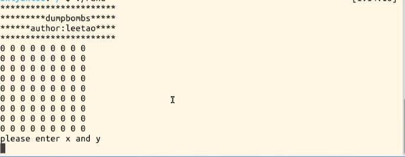
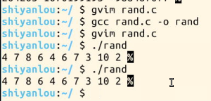
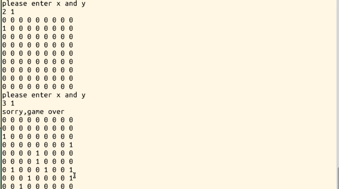

# 第 1 节 C 语言版扫雷游戏

## 一、实验说明

### 1\. 环境登录

无需密码自动登录，系统用户名 shiyanlou

### 2\. 环境介绍

本实验环境采用带桌面的 Ubuntu Linux 环境，实验中会用到桌面上的程序：

1.  LX 终端（LXTerminal）: Linux 命令行终端，打开后会进入 Bash 环境，可以使用 Linux 命令 2.Gvim：非常好用的编辑器

### 3\. 项目介绍

本项目是由 c 语言编写的简单的 9*9 扫雷程序。简单说下，扫雷中的数字的含义是以该方格为中心的，3*3 矩阵中所有的雷的个数，知道这个前提下，我们的程序就好写多了。

根据您的基础，您可能需要选择先了解 C 语言。

[C 语言入门教程](https://www.shiyanlou.com/courses/57)

最终的效果如下： 

## 二、代码实现 - 布置雷

需要采用 c 语言中的随机数 rand，直接使用是不行的，需要和 srand() 一起使用，原因看下面例子

```cpp
#include<stdlib.h>
int main()
{
    int i,j;
    for(i=0;i<10;i++)
    {
        j=1+(int)(rand()%10);
        printf("%d ",j);
    }
} 
```

你们会发现这个程序连续 N 次输出的结果都是一样的。

如图：



所以扫雷中的布雷函数为

```cpp
void makebomb()
{
    srand((int)time(0));
    int i,j;
    //要取得[a,b]的随机整数，使用(rand() % (b-a+1))+ a
    while(count>0)
    {

                int x=(rand()%(9-1+1))+1;
                int y=(rand()%(9-1+1))+1;
                if(disbomb[x][y]!=1) 
                {
                    disbomb[x][y]=1;
                    count--;
                }
        }   
} 
```

## 三、统计雷的个数

统计方格周围其他八个方格中雷的个数（这里需要想下边界怎么统计，思考下然后看下代码，比较分析思路）

```cpp
int countbomb(int x,int y)
{
    int countbomb=0;
    int i,j;
    //当且仅当该方块存在且含有雷，countbomb++
    if((disbomb[x-1][y-1])&&(disbomb[x-1][y-1]==1)) 
                    countbomb+=1;
    if((disbomb[x][y-1])&&(disbomb[x][y-1]==1)) 
                    countbomb+=1;
    if((disbomb[x+1][y-1])&&(disbomb[x+1][y-1]==1)) 
                    countbomb+=1;
    if((disbomb[x-1][y])&&(disbomb[x-1][y]==1)) 
                    countbomb+=1;
    if((disbomb[x+1][y])&&(disbomb[x+1][y]==1)) 
                    countbomb+=1;
    if((disbomb[x-1][y+1])&&(disbomb[x-1][y+1]==1)) 
                    countbomb+=1;
    if((disbomb[x][y+1])&&(disbomb[x][y+1]==1)) 
                    countbomb+=1;
    if((disbomb[x+1][y+1])&&(disbomb[x+1][y+1]==1)) 
                    countbomb+=1;

        a[x][y]=countbomb;
    return countbomb;
} 
```

这俩大难点解决了，整个扫雷剩下的就很简单了，剩下代码如下：

```cpp
#include<stdio.h>
#include<stdlib.h>
#include<time.h> 
int count=10;
int flag=1;
int disbomb[10][10];   
int a[10][10];//显示数组

//打印
void printbomb()
{
    int i,j;
    for( i=1;   i<10;    i++)
        {   
            for( j=1;   j<10;    j++)
                {

                printf("%d ",a[i][j]);
                }
            printf("\n");
        }

}

//游戏结束后将所有雷打印出来
void gameover()
{
    int i,j;
    for(i=1;    i<10;    i++)
        {
            for( j=1;   j<10;    j++)
            {

                printf("%d ",disbomb[i][j]);
            }
            printf("\n");
        }
}
int main()
{
    int X,Y;
    int i,j;
    printf("***********************\n");
    printf("*********扫雷**********\n");
    printf("******author:leetao****\n");
    printf("***********************\n");
    for( i=1;   i<10;    i++)
        {
            for( j=1;   j<10;    j++)
            {
                disbomb[i][j]=0;
                printf("%d ",disbomb[i][j]);
            }
            printf("\n");
        }
    makebomb();
    while(flag)
    {
        printf("输入 x，y 坐标\n");
        scanf("%d%d",&X,&Y);
        if(disbomb[X][Y]==0)
        {
            countbomb(X,Y);
            printbomb();
        }
        else
        {
            printf("sorry,game over\n");
            gameover();
            flag=-1;
            return 0;

        }       
    }
    return 0;
} 
```

一个简单的 c 语言扫雷程序就完成了，游戏结束如图：



如果有什么问题欢迎指正 leetao94@cn.gmail.com

## 四、作业和思考

将上面的扫雷游戏示例，改成更多格（例如 16*16）的扫雷。