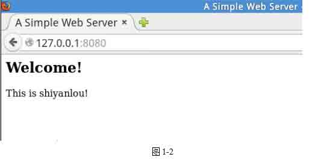
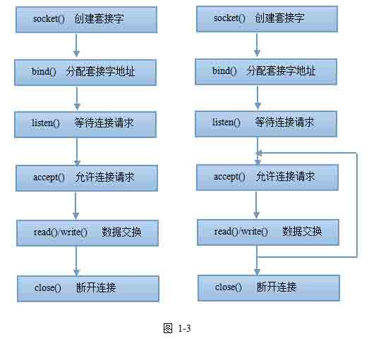

# 第 1 节 C 语言实现一个支持 PHP 的简易 WEB 服务器

## 一、实验说明及介绍

本项目课带领你使用 C 语言实现一个简易的 WEB 服务器，并能支持动态解析 PHP 程序。主要涉及到的技术有：Linux Socket 编程，HTTP 协议（只实现 GET 请求），Fast-CGI 协议。通过本项目你会掌握 Linux 下的网络编程，如何用 C 语言实现一个应用层协议（Fast-CGI 协议），不足之处请谅解，欢迎留言批评指正。

## 二、实现一个最基础的 WEB 服务器

首先我们来实现一个最基础的 WEB 服务器。可以 Git Clone 下载代码：

```cpp
git clone http://git.shiyanlou.com/shiyanlou/php-server 
```

下面的代码在 server01.c 文件中。

代码如下：

```cpp
#include <stdio.h>
#include <stdlib.h>
#include <string.h>
#include <unistd.h>
#include <arpa/inet.h>
#include <sys/socket.h>

#define PORT 8080                       // 服务器监听端口

void errorHandling(char *message);  // 错误处理

int main(int argc, char *argv[]){

    int serv_sock;             // 保存后面创建的服务器套接字
    int clnt_sock;             // 保存接受请求的客户端套接字

    char buf[1024];      // 缓冲区

    struct sockaddr_in serv_addr; // 保存服务器套接字地址信息
    struct sockaddr_in clnt_addr; // 保存客户端套接字地址信息
    socklen_t clnt_addr_size;   // 客户端套接字地址变量的大小

    // 发送给客户端的固定内容
    char status[] = "HTTP/1.0 200 OK\r\n";
    char header[] = "Server: A Simple Web Server\r\nContent-Type: text/html\r\n\r\n";
    char body[] = "<html><head><title>A Simple Web Server</title></head><body><h2>Welcome!</h2><p>This is shiyanlou!</p></body></html>";

    // 创建一个服务器套接字
    serv_sock = socket(PF_INET, SOCK_STREAM, 0);
    if(-1 == serv_sock){
        errorHandling("socket() error");
    }

    // 配置套接字 IP 和端口信息
    memset(&serv_addr, 0, sizeof(serv_addr));
    serv_addr.sin_family = AF_INET;
    serv_addr.sin_addr.s_addr = htonl(INADDR_ANY);
    serv_addr.sin_port = htons(PORT);

    // 绑定服务器套接字
    if(-1 == bind(serv_sock, (struct sockaddr*)&serv_addr, sizeof(serv_addr))){
        errorHandling("bind() error");
    }

    // 监听服务器套接字
    if(-1 == listen(serv_sock, 5)){
        errorHandling("listen() error");
    }

    // 接受客户端的请求
    clnt_addr_size = sizeof(clnt_addr);
    clnt_sock = accept(serv_sock, (struct sockaddr *) &clnt_addr, &clnt_addr_size);
    if(-1 == clnt_sock){
        errorHandling("accept() error");
    }

    // 读取客户端请求
    read(clnt_sock, buf, sizeof(buf) -1);
    printf("%s", buf);

    // 向客户端套接字发送信息
    write(clnt_sock, status, sizeof(status));
    write(clnt_sock, header, sizeof(header));
    write(clnt_sock, body, sizeof(body));

    // 关闭套接字
    close(clnt_sock);
    close(serv_sock);

    return 0;

}

void errorHandling(char *message){
    fputs(message, stderr);
    fputc('\n', stderr);
    exit(1);
} 
```

在命令行下编译并执行，然后打开浏览器，输入地址：127.0.0.1:8080/，就可以看到结果了。具体操作和结果下 图 1-1 和 图 1-2 所示：




我们来分析下上面的程序代码。首先通过 socket() 函数创建一个服务器套接字，然后调用 bind() 函数分配 IP 地址和端口号，这里使用的端口号是 8080。

```cpp
#define PORT 8080     // 服务器监听端口 
```

之后调用 listen() 函数等待连接请求，只要有请求就会接受，accept() 函数接受浏览器的请求，并且通过 read() 函数读取浏览器的请求数据，将请求数据打印出来。

然后通过 write() 函数向浏览器发送响应数据，包括响应头部和 HTML 内容。

浏览器接收到服务器的响应数据后就会在浏览器上显示出来。

根据上面的分析画出如下 图 1-3 左边所示的服务器默认函数调用顺序流程图。本项目 WEB 服务器的代码实现流程大致如此，唯一区别在于，上面的程序接受一个请求处理完成后就会结束，而本项目最终的程序会循环接受请求，如 图 1-3 右边所示。



下面针对上面代码中使用到的 socket 相关函数简单说明一下。

socket() 函数：

```cpp
#include <sys/socket.h>
int socket（int domain , int type , int protocol）; 
```

首先，domain 需要被设置为 “AF*INET”，就像上面的 struct sockaddr*in。然后，type 参数告诉内核这个 socket 是什么类型，“SOCK*STREAM” 或是 “SOCK*DGRAM”，SOCK*STREAM 使用 TCP 协议传输数据，SOCK*DGRAM 使用 UDP 协议传输数据。最后，只需要把 protocol 设置为 0。

socket() 函数调用成功时返回套接字描述符。如果发生错误，socket() 函数返回 -1。

bind() 函数：

```cpp
#include <sys/socket.h>
int bind (int sockfd , struct sockaddr *my_addr , int addrlen) ; 
```

sockfd 是由 socket() 函数返回的套接字描述符。

my_addr 是一个指向 struct sockaddr 的指针，包含有关你的地址的信息：名称、端口和 IP 地址。

addrlen 可以设置为 sizeof(struct sockaddr)。

当 bind() 函数调用成功时返回 0，失败时返回 -1。

当调用 bind() 的时候，不要把端口数设置的过小，小于 1024 的所有端口都是保留下来作为系统使用端口的，没有 root 权利无法使用。可以使用 1024 以上的任何端口，一直到 65535。

listen() 函数：

```cpp
#include <sys/socket.h>
int listen(int sockfd, int backlog); 
```

sockfd 是一个套接字描述符，由 socket()系统调用获得。

backlog 是未经过处理的连接请求队列可以容纳的最大数目。

backlog 具体是什么意思呢？每一个连接请求都会进入一个连接请求队列，等待 listen 的程序调用 accept() 函数来接受这个连接。当系统还没有调用 accept() 函数的时候，如果有很多连接，那么本地能够等待的最大数目就是 backlog 的数值。可以将其设成 5 到 10 之间的数值。listen() 函数调用成功返回 0，失败返回 -1。

accept() 函数

当调用它的时候，大致过程是下面这样的：

1、远程客户端（比如浏览器）连接你的机器上的某个端口（当然是已经在 listen() 的）。

2、它的连接将被 listen 加入等待队列，等待 accept() 函数的调用（加入等待队列的最多数目由调用 listen() 函数的第二个参数 backlog 来决定）。

3、调用 accept() 函数，告诉远程客户端准备连接。

```cpp
#include <sys/socket.h>
int accept(int sockfd, void *addr, int *addrlen); 
```

sockfd 是正在 listen() 的一个套接字描述符。

addr 一般是一个指向 struct sockaddr_in 结构的指针，里面存储着远程连接过来的计算机的信息（比如远程计算机的 IP 地址和端口）。

addrlen 是一个本地的整型数值，在它的地址传给 accept() 前它的值应该是 sizeof(struct sockaddr_in)，accept() 不会在 addr 中存储多余 addrlen bytes 大小的数据。如果 accept() 函数在 addr 中存储的数据量不足 addrlen，则 accept() 函数会改变 addrlen 的值来反应这个情况。

accept() 调用成功时返回一个新的套接字描述符，这个描述符就代表了与远程客户端的连接。调用失败时返回 -1。

## 三、WEB 服务器执行的任务

上面的程序只是一个 WEB 服务器的小例子。最先进的商用 WEB 服务器要比它复杂得多，那商用 WEB 服务器都要执行哪些任务呢，大致如下：

（1）建立连接——接受一个客户端连接。 （2）接收请求——从网络中读取一条 HTTP 请求报文。 （3）处理请求——对请求报文进行解释，并采取行动（上面程序未实现）。 （4）访问资源——访问报文中指定的资源（上面程序未实现）。 （5）构建响应——创建带有正确首部的 HTTP 响应报文。 （6）发送响应——将响应回送给客户端。 （7）记录事务处理过程——将与已完成事务有关的内容记录在一个日志文件中（本项目将忽略）。

下面仔细说下接收请求、处理请求、访问资源和构建响应。

### 1\. 接收请求

接收请求主要是从网络中读取一条 HTTP 请求报文。那请求报文格式什么样呢？如下 图 1-4 所示。


一个 HTTP 请求报文由请求行（request line）、请求头部（header）、空行和请求数据 4 个部分组成。例如当我们在浏览器中访问：127.0.0.1/index.html 时，浏览器发送给 WEB 服务器的请求报文大致如下：

```cpp
GET  /index.html  HTTP/1.1
User-Agent: Mozilla/5.0 
```

请求行由请求方法字段、URL 字段和 HTTP 协议版本字段 3 个字段组成，它们用空格分隔。例如上面的

```cpp
GET  /index.html  HTTP/1.1 
```

HTTP 协议的请求方法有 GET、POST、HEAD、PUT、DELETE、OPTIONS、TRACE、CONNECT。本项目只实现 GET 方法。

请求头部由 `关键字/值`对 组成，每行一对，关键字和值用英文冒号 “:” 分隔。请求头部通知服务器有关于客户端请求的信息，典型的请求头有：

User-Agent：产生请求的浏览器类型。 Accept：客户端可识别的内容类型列表。 Host：请求的主机名，允许多个域名同处一个 IP 地址，即虚拟主机。

最后一个请求头之后是一个空行，发送回车符和换行符，通知服务器以下不再有请求头。

请求数据不在 GET 方法中使用，而是在 POST 方法中使用。POST 方法适用于需要客户填写表单的场合。

### 2\. 处理请求

处理请求，一旦 Web 服务器收到了请求，就可以根据方法、资源、首部和可选的主体部分来对请求进行处理了。

本项目中处理请求的流程是，首先检查请求协议是否是 HTTP 协议，然后，检查请求是否是 GET 请求，最后，提取浏览器请求的文件名。由 void requestHandling(void *sock) 函数实现，具体代码如下所示：

```cpp
/**
 * 处理浏览器请求
 * 参数：客户端套接字地址
 */
void requestHandling(void *sock){
    int clnt_sock = *((int *) sock);
    char buf[1024];          // 缓冲区
    char method[10];         // 保存请求方法，GET
    char filename[20];       // 保存请求的文件名

    // 读取浏览器请求内容
    read(clnt_sock, buf, sizeof(buf) - 1);

    // 检查请求协议是否正确
    if(NULL == strstr(buf, "HTTP/")){
        sendError(sock);
        close(clnt_sock);
        return ;
    }

    // 提取请求方法至 method 数组中
    strcpy(method, strtok(buf, " /"));

    // 提取请求文件名至 filename 数组中
    strcpy(filename, strtok(NULL, " /"));

    // 判断请求方法是否是 GET，不是 GET 则进行请求错误处理
    if( 0 != strcmp(method, "GET") ){
        sendError(sock);
        close(clnt_sock);
        return ;
    }
    // 访问请求文件
    sendData(sock, filename);
} 
```

### 3\. 访问资源

访问资源，根据浏览器请求的文件名读取文件内容，并将内容发送给浏览器。本项目实现了读取静态 html、jpg 和 php 文件。由下列函数实现：

```cpp
void sendData(void *sock, char *filename);
void catHTML(void *sock, char *filename);
void catJPEG(void *sock, char *filename); 
```

具体代码如下所示，处理 php 文件的函数和代码在后面讲解。

```cpp
/**
 * 处理浏览器请求的文件
 * 参数：客户端套接字地址
 *       请求文件名
 */
void sendData(void *sock, char *filename){
    int clnt_sock = *((int *) sock);
    char buf[20];
    char ext[10];

    strcpy(buf, filename);

    // 判断文件类型
    strtok(buf, ".");
    strcpy(ext, strtok(NULL, "."));
    if(0 == strcmp(ext, "php")){ // 如果是 php 文件
        // 暂未处理
    }else if(0 == strcmp(ext, "html")){  // 如果是 html 文件
        catHTML(sock, filename);
    }else if(0 == strcmp(ext, "jpg")){ // 如果是 jpg 图片
        catJPEG(sock, filename);
    }else{
        sendError(sock);
        close(clnt_sock);
        return ;
    }
}

/**
 * 读取 HTML 文件内容发送
 * 参数：客户端套接字地址
 *       文件名
 */
void catHTML(void *sock, char *filename){
    int clnt_sock = *((int *) sock);
    char buf[1024];
    FILE *fp;

    char status[] = "HTTP/1.0 200 OK\r\n";
    char header[] = "Server: A Simple Web Server\r\nContent-Type: text/html\r\n\r\n";
    // 发送响应报文状态行
    write(clnt_sock, status, strlen(status));
    // 发送响应报文消息头
    write(clnt_sock, header, strlen(header));

    fp = fopen(filename, "r");
    if(NULL == fp){
        sendError(sock);
        close(clnt_sock);
        errorHandling("opne file failed!");
        return ;
    }

    // 读取文件内容并发送
    fgets(buf, sizeof(buf), fp);
    while (!feof(fp))
    {
        write(clnt_sock, buf, strlen(buf));
        fgets(buf, sizeof(buf), fp);
    }

    fclose(fp);
    close(clnt_sock);
}
/**
 * 读取 JPEG 文件内容发送
 * 参数：客户端套接字地址
 *       文件名
 */
void catJPEG(void *sock, char *filename){
       int clnt_sock = *((int *) sock);
    char buf[1024];
    FILE *fp;
    FILE *fw;

    char status[] = "HTTP/1.0 200 OK\r\n";
    char header[] = "Server: A Simple Web Server\r\nContent-Type: image/jpeg\r\n\r\n";

    // 发送响应报文状态行
    write(clnt_sock, status, strlen(status));
    // 发送响应报文消息头
    write(clnt_sock, header, strlen(header));
    // 图片文件以二进制格式打开
    fp = fopen(filename, "rb");
    if(NULL == fp){
        sendError(sock);
        close(clnt_sock);
        errorHandling("opne file failed!");
        return ;
    }

    // 在套接字上打开一个文件句柄
    fw = fdopen(clnt_sock, "w");
    fread(buf, 1, sizeof(buf), fp);
    while (!feof(fp)){
        fwrite(buf, 1, sizeof(buf), fw);
        fread(buf, 1, sizeof(buf), fp);
    }

    fclose(fw);
    fclose(fp);
    close(clnt_sock);
} 
```

### 4\. 构建响应

构建响应就是构建一个响应报文发送给浏览器。那响应报文格式什么样呢？如下 图 1-5 所示。


HTTP 响应报文主要由状态行、响应头部、空行以及响应正文 4 部分组成。

状态行由 3 部分组成，分别为：HTTP 协议版本，状态代码，状态代码描述。

状态代码为 3 位数字，由 1、2、3、4 以及 5 开头，2 开头的指响应成功，3 开头的指重定向，4 开头的指客户端错误，5 开头的指服务端错误。详细的状态码就不介绍了，这里列举几个常见的：

200：响应成功 400：错误的请求，用户发送的 HTTP 请求不正确 404：文件不存在，也就是 HTTP 请求 URI 错误 500：服务器内部错误

响应头部与请求头部类似，也包含了很多有用的信息。如响应内容的类型，图片类型为： `Content-Type:image/jpeg`。本项目中响应报文的构建参见如下所示代码：

```cpp
char status[] = "HTTP/1.0 200 OK\r\n";
char header[] = "Server: A Simple Web Server\r\nContent-Type: image/jpeg\r\n\r\n";
write(clnt_sock, status, strlen(status));     // 发送响应报文状态行
write(clnt_sock, header, strlen(header));     // 发送响应报文消息头
// 响应正文
......... 
```

## 四、WEB 服务器的几种模型

高性能的 WEB 服务器能够同时支持数千条连接。这些连接使得服务器可以与世界各地的客户端进行通信，每个客户端都向服务器打开了一条或多条连接。因为请求可能会在任意时刻到达，所以 WEB 服务器会不停地观察有无新的 WEB 请求。不同的 WEB 服务器模型会以不同的方式为请求服务。

### 1\. 单线程 WEB 服务器

单线程的 WEB 服务器一次只处理一个请求，直到其完成为止。一个事务处理结束之后，才去处理下一条连接。这种结构易于实现，但在处理过程中，所有其他连接都会被忽略。这样会造成严重的性能问题，只适用于低负荷的服务器，本项目使用的是该模型。

### 2\. 多进程及多线程 WEB 服务器

多进程和多线程 WEB 服务器用多个进程， 或更高效的线程同时对请求进行处理。 可以根据需要创建，或者预先创建一些线程 / 进程。 有些服务器会为每条连接分配一个线程 / 进程，但当服务器同时要处理成百、上千，甚至数以万计的连接时，需要的进程或线程数量可能会消耗太多的内存或系统资源。因此，很多多线程 WEB 服务器都会对线程 / 进程的最大数量进行限制。

### 3\. 复用 I/O 的服务器

为了支持大量的连接，很多 WEB 服务器都采用了复用结构。在复用结构中，要同时监视所有连接上的活动。当连接的状态发生变化时（比如，有数据可用，或出现错误时） ，就对那条连接进行少量的处理；处理结束之后，将连接返回到开放连接列表中，等待下一次状态变化。只有在有事情可做时才会对连接进行处理；在空闲连接上等待的时候并不会绑定线程和进程。

### 4\. 复用的多线程 WEB 服务器

有些系统会将多线程和复用功能结合在一起，以利用计算机平台上的多个 CPU。多个线程（通常是一个物理处理器）中的每一个都在观察打开的连接（或打开的连接中的一个子集） ，并对每条连接执行少量的任务。

**运行**

下面进入之前从 git 上下载下来的目录，在命令行下编译并执行，然后打开浏览器，分别输入地址：`127.0.0.1:8080/one.html` 和 `127.0.0.1:8080/two.html`，就可以看到结果了。具体操作和结果下 图 1-6、图 1-7 和 图 1-8 所示：


## 五、PHP 支持

目前 WEB 服务器可以处理 html 文件和 jpg 图片了。下面考虑怎样支持解析 php 文件，以前要执行动态程序都是通过 CGI 接口来完成的。CGI 全称是 “通用网关接口”(Common Gateway Interface)， 它可以让一个客户端，从网页浏览器向执行在 Web 服务器上的程序请求数据。 CGI 描述了客户端和这个程序之间传输数据的一种标准。 CGI 的一个目的是要独立于任何语言的，所以 CGI 可以用任何一种语言编写，只要这种语言具有标准输入、输出和环境变量， 如 php 等。

FastCGI 是 Web 服务器和处理程序之间通信的一种协议， 是 CGI 的一种改进方案，它为所有因特网应用提供高性能。FastCGI 像是一个常驻 (long-live) 型的 CGI， 它可以一直执行，在请求到达时不会花费时间去 fork 一个进程来处理(这是 CGI 最为人诟病的 fork-and-execute 模式)。 正是因为他只是一个通信协议，它还支持分布式的运算，即 FastCGI 程序可以在网站服务器以外的主机上执行并且接受来自其它网站服务器来的请求。

FastCGI 是语言无关的、可伸缩架构的 CGI 开放扩展，将 CGI 解释器进程保持在内存中，以此获得较高的性能。 CGI 程序反复加载是 CGI 性能低下的主要原因，如果 CGI 程序保持在内存中并接受 FastCGI 进程管理器调度， 则可以提供良好的性能、伸缩性、Fail-Over 特性等。

一般情况下，FastCGI 的整个工作流程是这样的：

1.Web Server 启动时载入 FastCGI 进程管理器（PHP-FPM 或 Apache Module)。

2.FastCGI 进程管理器自身初始化，启动多个 CGI 解释器进程(可见多个 php-cgi)并等待来自 Web Server 的连接。

3.当客户端请求到达 Web Server 时，FastCGI 进程管理器选择并连接到一个 CGI 解释器。 Web server 将 CGI 环境变量和标准输入发送到 FastCGI 子进程 php-cgi。

4.FastCGI 子进程完成处理后将标准输出和错误信息从同一连接返回 Web Server。当 FastCGI 子进程关闭连接时， 请求便告处理完成。FastCGI 子进程接着等待并处理来自 FastCGI 进程管理器(运行在 Web Server 中)的下一个连接。在 CGI 模式中，php-cgi 在此便退出了。

## 六、FastCGI 协议规范

当 WEB 服务器接收到一个 PHP 文件请求时，WEB 服务器会通过 FastCGI 将请求转发给 FastCGI 进程管理器（即 PHP-FPM），FastCGI 进程管理器接收到请求后，调用 php 解释器执行 php 文件，然后将执行结果返回给 WEB 服务器，之后 WEB 服务器再将 FastCGI 进程管理器返回的结果处理成 HTTP 响应报文格式发送给浏览器。

从上面描述可以看出，浏览器与 WEB 服务器之间的通信协议是 HTTP 协议，那么 WEB 服务器与 FastCGI 进程管理器之间通信协议是什么呢，答案就是 FastCGI 协议。

详细协议规范可参见： 中文版：http://andylin02.iteye.com/blog/648412 英文版：http://www.fastcgi.com/devkit/doc/fcgi-spec.html

FastCGI 协议大概流程如下 图 1-9 所示。


请求由 FCGI*BEGIN*REQUEST 开始，FCGI*PARAMS 表示需要传递环境变量 (PHP 中的 $*SERVER 数组就是通过 FCGI*PARAMS 来传递的，当然您还可以附加自定义的数据)。FCGI*STDIN 表示一个输入的开始，比如您需要 POST 过去的数据。FCGI*STDOUT 和 FCGI*STDERR 标识应用开始响应。FCGI*END*REQUEST 表示一次请求的完成，由应用发送。

FastCGI 是基于流的协议，并且是 8 字节对齐，因此不需要考虑字节序，但是要考虑填充。FastCGI 的包头是固定的 8 字节，不同的请求有不同的包体结构。包头和包体组成一个 Record(记录)。具体请参考协议规范。包头见下面的 FCGI*Header 结构体，FCGI*BEGIN*REQUEST 请求包体见下面的 FCGI*BeginRequestBody 结构体， FCGI*BEGIN*REQUEST 请求记录见下面的 FCGI*BeginRequestRecord 结构体，FCGI*PARAMS 传递参数记录见下面的 FCGI_ParamsRecord 结构体：

```cpp
/*
 * 包头
 */
typedef struct{
    unsigned char version;
    unsigned char type;
    unsigned char requestIdB1;
    unsigned char requestIdB0;
    unsigned char contentLengthB1;
    unsigned char contentLengthB0;
    unsigned char paddingLength;
    unsigned char reserved;
}FCGI_Header;

/*
 * FCGI_BEGIN_REQUEST 请求包体
 */
typedef struct{
    unsigned char roleB1;
    unsigned char roleB0;
    unsigned char flags;
    unsigned char reserved[5];
}FCGI_BeginRequestBody;

/*
 * FCGI_BEGIN_REQUEST 请求记录
 */
typedef struct{
    FCGI_Header header;
    FCGI_BeginRequestBody body;
}FCGI_BeginRequestRecord;

/*
 * FCGI_PARAMS 传递参数记录
 */
typedef struct{
    FCGI_Header header;
    unsigned char nameLength;
    unsigned char valueLength;
    unsigned char data[0];
}FCGI_ParamsRecord; 
```

为了简化项目的复杂性，项目中会忽略 FCGI*STDERR 和 FCGI*END*REQUEST。WEB 服务器处理 PHP 文件请求时，首先会使用 FCGI*BEGIN*REQUEST 记录结构体向 FastCGI 进程管理器开始请求，然后使用 FCGI*PARAMS 记录结构体向 FastCGI 进程管理器传递参数，包含 php 文件名、query 字符串，HTTP 请求方法，之后发送一个空包体的 STDIN 包来结束这次请求。由于是空包体，所以直接发送 type 为 FCGI*STDIN 的 FCGI*Header 结构体就行了。

```cpp
 // 首先构造一个 FCGI_BeginRequestRecord 结构
    FCGI_BeginRequestRecord beginRecord;
    beginRecord.header =
        makeHeader(FCGI_BEGIN_REQUEST, FCGI_REQUEST_ID, sizeof(beginRecord.body), 0);
    beginRecord.body = makeBeginRequestBody(FCGI_RESPONDER);
    str_len = write(sock, &beginRecord, sizeof(beginRecord)); 
```

上面的代码构造一个 FCGI*Header 结构体和 FCGI*BeginRequestBody 结构体组成一个 FCGI*BEGIN*REQUEST 记录，发送给 FastCGI 进程管理器表示开始请求。

```cpp
 // 传递 FCGI_PARAMS 参数
    char *params[][2] = {
        {"SCRIPT_FILENAME", "/home/shiyanlou/php-server/test.php"},
        {"REQUEST_METHOD", "GET"},
        {"QUERY_STRING", "name=shiyanlou"},
        {"", ""}
    };

    int i, contentLength, paddingLength;
    FCGI_ParamsRecord *paramsRecordp;
    for(i = 0; params[i][0] != ""; i++){
        contentLength = strlen(params[i][0]) + strlen(params[i][1]) + 2; // 2 字节是两个长度值
        paddingLength = (contentLength % 8) == 0 ? 0 : 8 - (contentLength % 8);
        paramsRecordp = (FCGI_ParamsRecord *)malloc(sizeof(FCGI_ParamsRecord) + contentLength + paddingLength);
        paramsRecordp->nameLength = (unsigned char)strlen(params[i][0]);    // 填充参数值
        paramsRecordp->valueLength = (unsigned char)strlen(params[i][1]);   // 填充参数名
        paramsRecordp->header =
            makeHeader(FCGI_PARAMS, FCGI_REQUEST_ID, contentLength, paddingLength);
        memset(paramsRecordp->data, 0, contentLength + paddingLength);
        memcpy(paramsRecordp->data, params[i][0], strlen(params[i][0]));
        memcpy(paramsRecordp->data + strlen(params[i][0]), params[i][1], strlen(params[i][1]));
        str_len = write(sock, paramsRecordp, 8 + contentLength + paddingLength);

        if(-1 == str_len){
            errorHandling("Write beginRecord failed!");
        }
        printf("Write params %s  %s\n",params[i][0], params[i][1]);
        free(paramsRecordp);
    } 
```

请求开始后，WEB 服务器通过上面的代码向 FastCGI 进程管理器发送 FCGI_PARAMS 记录，由于 FastCGI 协议规定数据 8 字节对齐，需要对数据进行 8 字节对齐。

```cpp
 // 传递 FCGI_STDIN 参数
    FCGI_Header stdinHeader;
    stdinHeader = makeHeader(FCGI_STDIN, FCGI_REQUEST_ID, 0, 0);
    write(sock, &stdinHeader, sizeof(stdinHeader)); 
```

传递完 FCGI*PARAMS 参数后，通过上面的代码向 FastCGI 进程管理器发送一个空包体的 FCGI*STDIN 记录，表示请求发送完毕。

```cpp
 // 读取 FastCGI 进程管理器响应的数据
    FCGI_Header respHeader;
    char *message;
    str_len = read(sock, &respHeader, 8);
    if(-1 == str_len){
        errorHandling("read responder failed!");
    }
    //printf("Start read....\n");
    //printf("fastcgi responder is : %X\n", respHeader.type);
    //printf("fastcgi responder is : %X\n", respHeader.contentLengthB1);
    //printf("fastcgi responder is : %X\n", respHeader.contentLengthB0);
    if(respHeader.type == FCGI_STDOUT){
        int contentLengthR =
            ((int)respHeader.contentLengthB1 << 8) + (int)respHeader.contentLengthB0;
        message = (char *)malloc(contentLengthR);
        read(sock, message, contentLengthR);
        //printf("%s",message);
        free(message);
    } 
```

上面的代码首先读取 FastCGI 进程管理器响应数据的前 8 字节数据，这 8 字节数据正好是一个 FCGI_Header 结构体变量。然后通过判断 type 是否是 FastCGI 进程管理器响应数据。如果是，读取响应数据长度，之后继续读取该长度的数据。至此，WEB 服务器与 FastCGI 进程管理器的交互结束了。

## 七、运行

首先安装 php-fpm，使用如下命令：

```cpp
sudo apt-get install php5-fpm 
```

然后修改 php5-fpm 的配置文件，即 `/etc/php5/fpm/pool.d/www.conf` 文件。

定位到第 33 行，将 `listen = /var/run/php5-fpm.sock` 改为 `listen = 127.0.0.1:9000`，然后执行以下命令运行 php-fpm。

```cpp
sudo php5-fpm 
```

使用 netstat -apn | head -10 可 以查看是否启动成功，如下 图 1-10 所示表示启动成功。 （FastCGI 和 PHP-FPM 的关系可参见：http://segmentfault.com/q/1010000000256516）


接下来进入之前从 git 上下载下来的目录，请求的 test.php 文件内容为：

```cpp
<?php
echo "This is a test!\n";
echo "The name is " . $_GET['name'];
?> 
```

php 文件会打印 WEB 服务器传递的 {"QUERY_STRING", "name=shiyanlou"} 参数。在命令编译并执行 fastcgi01.c 文件，运行结果如下 图 1-11 所示：


从上面的运行结果可以看出，test.php 运行成功了！

下面将 fastcgi01.c 与 server02.c 两个文件整理一下，见 php-server 目录中的 server03.c、fastcgi.h 和 fastcgi.c 三个文件。编译运行，并在浏览器中输入：127.0.0.1:8080/test.php?name=shiyanlou，运行结果见下 图 1-12 和 图 1-13 所示。


从上面的运行结果可以看出，WEB 服务器已经成功处理 php 文件请求。至此我们的 WEB 服务器项目已经完成了。

## 八、参考资料

文档中部分知识点参考以下资料：

1.  [`blog.csdn.net/a19881029/article/details/14002273`](http://blog.csdn.net/a19881029/article/details/14002273)
2.  [`www.php-internals.com/book/?p=chapt02/02-02-03-fastcgi`](http://www.php-internals.com/book/?p=chapt02/02-02-03-fastcgi)
3.  [`my.oschina.net/goal/blog/196599`](http://my.oschina.net/goal/blog/196599)

## 九、作业思考

本次项目课内容较多，建议多多思考消化。