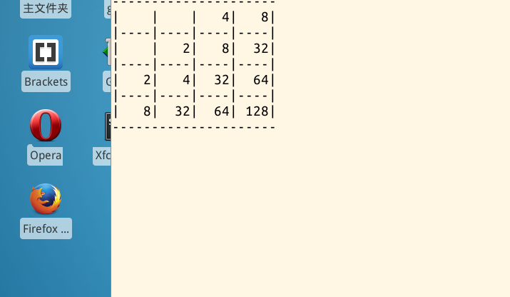

# 第 1 节 C 语言制作 2048

## 一、实验说明

### 1\. 环境登录

无需密码自动登录，系统用户名 shiyanlou。

### 2\. 环境介绍

本实验环境采用带桌面的 Ubuntu Linux 环境，实验中会用到桌面上的程序：

1.  LX 终端（LXTerminal）：Linux 命令行终端，打开后会进入 Bash 环境，可以使用 Linux 命令。
2.  GVim：非常好用的编辑器，最简单的用法可以参考课程 [Vim 编辑器](http://www.shiyanlou.com/courses/2)。

### 3.环境使用

使用 GVim 编辑器输入实验所需的代码及文件，使用 LX 终端（LXTerminal）运行所需命令进行操作。 实验报告可以在个人主页中查看，其中含有每次实验的截图及笔记，以及每次实验的有效学习时间（指的是在实验桌面内操作的时间，如果没有操作，系统会记录为发呆时间）。这些都是您学习的真实性证明。

### 4\. 项目介绍

这次我们的项目是 2048 游戏，也是一个非常热门的游戏。

最终效果图是这样的：



如果需要先学习 C 语言教程，请点击：

*   [C 语言入门教程](https://www.shiyanlou.com/courses/57)

## 二、项目准备

### 1\. 基础知识

我们的项目用到了一点数据结构的知识，还涉及到了 linux 的一些系统调用，有助于我们加深对 linux 下的程序设计的深入理解。此外，我们还用了一个文本界面的屏幕绘图库 ncurses，编译时需要加上 -lcurses 选项。

**安装 ncurses 库**

```cpp
sudo apt-get install libncurses5-dev 
```

### 2\. 设计思路

我们的 2048 游戏里最关键的就是消掉方块和在屏幕任意位置输出数据。后者通过 ncurses 库可以轻松实现，前者就需要我们开动脑筋了。

## 三、 基础工作

让我们先来完成一些基础工作，首先是头文件：

```cpp
#include <stdio.h>
#include <stdlib.h>
#include <curses.h>
#include <time.h>
#include <unistd.h>
#include <signal.h> 
```

还需要几个全局变量：

```cpp
// 4*4 方格
int a[4][4] = {0};
// 方格里空格的个数
int empty;
int old_y, old_x; 
```

为了调用起来方便，我们先声明一下我们定义的函数:

```cpp
void draw();
void play();
void init();
void draw_one(int y, int x);
void cnt_value(int *new_y, int *new_x);
int game_over();
int cnt_one(int y, int x); 
```

## 四、main 函数

先看看代码：

```cpp
int main()
{
    init();
    play();
    endwin();

    return 0;
} 
```

我们在 main 里先做好初始化，然后就进入 play 子函数。

下面看一下 init 函数：

```cpp
void init()
{
    int x, y;

    initscr();
    cbreak();
    noecho();
    curs_set(0);

    empty = 15;
    srand(time(0));
    x = rand() % 4;
    y = rand() % 4;
    a[y][x] = 2;
    draw();
} 
```

init 函数首先初始化屏幕，在方格中随机生成一个位置并放入数字 2。

然后绘制方格，draw 函数代码如下：

```cpp
void draw()
{
    int n, m, x, y;
    char c[4] = {'0', '0', '0', '0'};

    clear();
    for(n = 0; n < 9; n += 2)   //横线
        for(m = 0; m < 21; m++) {
            move(n, m);
            addch('-');
            refresh();
        }
    for(m = 0; m < 22; m += 5)  //竖线
        for(n = 1; n < 8; n++) {
            move(n, m);
            addch('|');
            refresh();
        }
    for(y = 0; y < 4; y++)     //数字
        for(x = 0; x < 4; x++) {
            draw_one(y, x);
        }
} 
```

其中 draw_one 函数用于绘制单个数字：

```cpp
void draw_one(int y, int x)
{
    int i, m, k, j;
    char c[4] = {'0', '0', '0', '0'};

    i = a[y][x];
    m = 0;
    do {
        j = i % 10;
        c[m++] = j + '0';
        i = i / 10;
    }while(i > 0);
    m = 0;
    k = (x + 1) * 5 - 1;
    while(c[m] != '0') {
        move(2*y+1, k);
        addch(c[m++]);
        k--;
    }
} 
```

## 五、play 函数

然后我们看看 play 函数，我们用 wsad 来表示上下左右方向。这次的 play 函数有点长，希望大家耐着性子看下去。其实总体结构很简单，只是比较繁琐。

```cpp
void play()
{
    int x, y, i, new_x, new_y, tmp;
    int old_empty, move;
    char ch;

    while(1) {
        move = 0;
        old_empty = empty;
        //draw();
        ch = getch();
        switch(ch) {
            case 'A':
            case 'a':
                //从左向右消去相同方块
                for(y = 0; y < 4; y++)
                    for(x = 0; x < 4; ) {
                        if(a[y][x] == 0) {
                            x++;
                            continue;
                        } else {
                            for(i = x + 1; i < 4; i++) {
                                if(a[y][i] == 0) {
                                    continue;
                                }
                                else {
                                    if(a[y][x] == a[y][i]) {
                                        a[y][x] += a[y][i];
                                        a[y][i] = 0;
                                        x = i + 1;
                                        empty++;
                                        break;
                                    }
                                    else {
                                        x = i;
                                        break;
                                    }
                                }
                            }
                            x = i;
                        }
                    }
                //向左移动方块
                for(y = 0; y < 4; y++)
                    for(x = 0; x < 4; x++) {
                        if(a[y][x] == 0) {
                            continue;
                        } else {
                            for(i = x; (i > 0) && (a[y][i-1] == 0); i--) {
                                a[y][i-1] = a[y][i];
                                a[y][i] = 0;
                            move = 1;
                            }
                        }
                    }
                break;
            case 'D':
            case 'd':
                //从右向左消去相同方块
                for(y = 0; y < 4; y++)
                    for(x = 3; x >= 0; ) {
                        if(a[y][x] == 0) {
                            x--;
                            continue;
                        } else {
                            for(i = x - 1; i >= 0; i--) {
                                if(a[y][i] == 0) {
                                    continue;
                                } else if(a[y][x] == a[y][i]) {
                                    a[y][x] += a[y][i];
                                    a[y][i] = 0;
                                    x = i - 1;
                                    empty++;
                                    break;
                                } else {
                                    x = i;
                                    break;
                                }
                            }
                            x = i;
                        }
                    }
                //向右移动方块
                for(y = 0; y < 4; y++)
                    for(x = 3; x >= 0; x--) {
                        if(a[y][x] == 0) {
                            continue;
                        } else {
                            for(i = x; (i < 3) && (a[y][i+1] == 0); i++) {
                                a[y][i+1] = a[y][i];
                                a[y][i] = 0;
                            move = 1;
                            }
                        }
                    }
                break;
            case 'W':
            case 'w':
                //从上向下消去相同方块
                for(x = 0; x < 4; x++)
                    for(y = 0; y < 4; ) {
                        if(a[y][x] == 0) {
                            y++;
                            continue;
                        } else {
                            for(i = y + 1; i < 4; i++) {
                                if(a[i][x] == 0) {
                                    continue;
                                } else if(a[y][x] == a[i][x]) {
                                    a[y][x] += a[i][x];
                                    a[i][x] = 0;
                                    y = i + 1;
                                    empty++;
                                    break;
                                } else {
                                    y = i;
                                    break;
                                }
                            }
                            y = i;
                        }
                    }
                //向上移动方块
                for(x = 0; x < 4; x++)
                    for(y = 0; y < 4; y++) {
                        if(a[y][x] == 0) {
                            continue;
                        } else {
                            for(i = y; (i > 0) && (a[i-1][x] == 0); i--) {
                                a[i-1][x] = a[i][x];
                                a[i][x] = 0;
                            move = 1;
                            }
                        }
                    }
                break;
            case 'S':
            case 's':
                //从下向上消去相同方块
                for(x = 0; x < 4; x++)
                    for(y = 3; y >= 0; ) {
                        if(a[y][x] == 0) {
                            y--;
                            continue;
                        } else {
                            for(i = y - 1; i >= 0; i--) {
                                if(a[i][x] == 0) {
                                    continue;
                                } else if(a[y][x] == a[i][x]) {
                                    a[y][x] += a[i][x];
                                    a[i][x] = 0;
                                    y = i -1;
                                    empty++;
                                    break;
                                } else {
                                    y = i;
                                    break;
                                }
                            }
                            y = i;
                        }
                    }
                //向下移动方块
                for(x = 0; x < 4; x++)
                    for(y = 3; y >= 0; y--) {
                        if(a[y][x] == 0) {
                            continue;
                        } else {
                            for(i = y; (i < 3) && (a[i+1][x] == 0); i++) {
                                a[i+1][x] = a[i][x];
                                a[i][x] = 0;
                            move = 1;
                            }
                        }
                    }
                break;
            case 'Q':
            case 'q':
                game_over();
                break;
            default:
                continue;
                break;
        }

        if(empty <= 0)
            game_over();
        draw();
        //生成新方块
        if((empty != old_empty) || (move == 1)) {  //修复了不移动或消除方块也生成新方块的 bug
            do {
                new_x = rand() % 4;
                new_y = rand() % 4;
            }while(a[new_y][new_x] != 0);

            cnt_value(&new_y, &new_x);

            do {
                tmp = rand() % 4;
            }while(tmp == 0 || tmp == 2);
            a[new_y][new_x] = tmp + 1;
            empty--;

            draw_one(new_y, new_x);
        }
    }
} 
```

## 六、其他部分

下面的函数用于生成新数字的位置，判断方法比较简单。

```cpp
int cnt_one(int y, int x)
{
    int value = 1;

                if(y - 1 > 0)  
                    a[y-1][x] ? 0 : value++;
                if(y + 1 < 4)
                    a[y+1][x] ? 0 : value++;
                if(x - 1 >= 0)
                    a[y][x-1] ? 0 : value++;
                if(x + 1 < 4)
                    a[y][x+1] ? 0 : value++;
                if(y - 1 >= 0 && x - 1 >= 0)
                    a[y-1][x-1] ? 0 : value++;
                if(y - 1 >= 0 && x + 1 < 4)
                    a[y-1][x+1] ? 0 : value++;
                if(y + 1 < 4 && x - 1 >= 0)
                    a[y+1][x-1] ? 0 : value++;
                if(y + 1 < 4 && x + 1 < 4)
                    a[y+1][x+1] ? 0 : value++;

    return value;
}

void cnt_value(int *new_y, int *new_x)
{
    int max_x, max_y, x, y, value;
    int max = 0;

    max = cnt_one(*new_y, *new_x);
    for(y = 0; y < 4; y++)
        for(x = 0; x < 4; x++) {
            if(!a[y][x]) {
                value = cnt_one(y, x);
                if(value > max && old_y != y && old_x != x) {  //避免在同一位置反复出现新方块
                    *new_y = y;
                    *new_x = x;
                    old_x = x;
                    old_y = y;
                    break;
                }
            }
        }
} 
```

游戏结束子函数。

```cpp
int game_over()
{
    sleep(1);
    endwin();
    exit(0);
} 
```

## 七、编译

```cpp
$ gcc 2048.c -o 2048 -lcurses 
```

到此，我们的 2048 游戏就完成了。如果你愿意，可以将简陋的 ASCII 字符换成漂亮的图片，再加上积分牌等等。总之，程序会随着你的想象力越长越大。

## 八、作业思考

尝试将 2048 改成 4096。