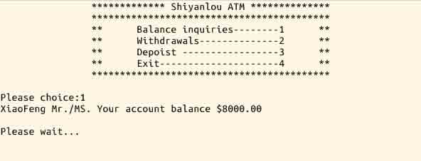
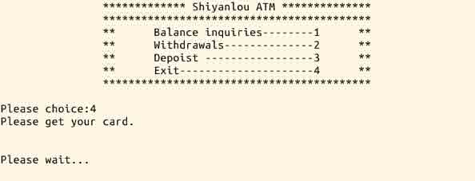

# 第 1 节 C 语言模拟 ATM 自动取款机系统

## 一. 项目说明

### 1\. 环境介绍

本实验环境采用带桌面的 Ubuntu Linux 环境，实验中会用到桌面上的程序：

1.  LX 终端（LXTerminal）: Linux 命令行终端，打开后会进入 Bash 环境，可以使用 Linux 命令
2.  Firefox：浏览器，可以用在需要前端界面的课程里，只需要打开环境里写的 HTML/JS 页面即可
3.  GVim：非常好用的编辑器，最简单的用法可以参考课程 [Vim 编辑器](http://www.shiyanlou.com/courses/2)

### 2\. 环境使用

使用 GVim 编辑器输入实验所需的代码及文件，使用 LX 终端（LXTerminal）运行所需命令进行操作。

实验报告可以在个人主页中查看，其中含有每次实验的截图及笔记，以及每次实验的有效学习时间（指的是在实验桌面内操作的时间，如果没有操作，系统会记录为发呆时间）。这些都是您学习的真实性证明。

### 3\. 项目介绍

日常生活中大家肯定都使用过 ATM 自助取款机，那么今天我们就用 C 语言编写个小程序来简单模仿 ATM 取款机的查询、存取款等功能。

**主要功能：**

1.  账号及密码输入：允许用户输入账号、密码，对用户由于疏忽录入的非法数据，能够及时提示并更正。
2.  登陆成功界面：共有四个选项，查询余额、取款、存款、退出分别对应 1、2、3、4 选项，若序号输入不正确会予以提示。
3.  选定 1 后，进入查询余额界面； 选定 2 后，进入取款界面； 选定 3 后，进入存款界面； 选定 4 后，进入退出界面，系统会延迟 3 秒重新跳回登陆界面，供其他用户使用。

**项目效果图**





## 二、项目实战

### 1\. 声明和定义函数

我们用到了 sleep() 这个函数，所以需要 unistd.h 这个头文件。

```cpp
#include <stdio.h>
#include <stdlib.h>
#include <unistd.h>
int x;                 //记录下标
void show_menu();      //登录成功后出现的界面
void land();           //登录
void inquiry();        //查询
void withdrawals();    //取款
void depoist();        //存款
void out();            //退卡
void cls();            //延时清屏 
```

### 2\. 用户信息

用结构体来描述用户的姓名、卡号、密码以及金额。

```cpp
struct atm
{
    char name[10];
    int account;       //卡号
    int password;      //密码
    float money;       //金额
}
at[10]={{"XiaoFeng",1,1,8000},{"XiaoQiang",2,2,100},
{"MM",3,3,5888},{"XiaoYi",4,4,7543},
{"ShiWei",5,5,10000},{"ShiLei",6,6,12000},
{"DaDa",7,7,2765},{"XiaoXiao",8,8,4530},
{"FangFang",9,9,5693},{"YuanYuan",10,10,7543}}; 
```

### 3\. 主函数和延时清屏函数

sleep 函数的功能是执行挂起一段时间，sleep() 单位为秒。

```cpp
void main(){
    printf("\t\t******************Welcome to ATM******************\n");
    printf("\t\t**************************************************\n");         //这些*号是为了使界面更加好看。
    land();
}

void cls()
{
    printf("\n\nPlease wait...\n");
    sleep(3);
    system("clear");   //清除控制台屏幕
} 
```

### 4\. 登录函数

```cpp
 void land(){
    int a;             //临时记录下标
    int account;       //卡号
    int password;      //密码
    printf("Please input your account:");
    scanf("%d",&account);
    for(a=0;a<=9;a++){
        if(account==at[a].account)
        {
            x=a;        //将临时变量下标值存储到全局下标变量中
            printf("Please input your password:");
            scanf("%d",&password);
            if(password==at[a].password)
            {
            cls();
            show_menu();
            break;}
        else
                {
                printf("The password is wrong .\n");
                cls();
                main();
                land(); //递归(调用自己,再来一次)
                }
        }
    }
    printf("Warning : error !\n");
    cls();
    main();
    land();            //递归(调用自己,再来一次)
} 
```

### 5\. 登陆成功界面

```cpp
void show_menu()
{
    int z;
    printf("\t\t************* Shiyanlou ATM **************\n");
    printf("\t\t******************************************\n");
    printf("\t\t**\tBalance inquiries--------1\t**\n");
    printf("\t\t**\tWithdrawals--------------2\t**\n");
    printf("\t\t**\tDepoist -----------------3\t**\n");
    printf("\t\t**\tExit---------------------4\t**\n");
    printf("\t\t******************************************");
    while(1)//循环语句与选择性分支语句的嵌套 
    {
    printf("\n\nPlease choice:");
    scanf("%d",&z);
    switch(z)
        {
        case 1:inquiry();break;       //查询余额
        case 2:withdrawals();break;   //取款
        case 3:depoist();break;       //存款
        case 4:out();break;           //退卡
        default:printf("Warning: illegal operation!");
        return;
        }
    }
} 
```

### 6\. 查询余额

```cpp
void inquiry()
{
    printf("%s Mr./MS. Your account balance $%7.2f ",at[x].name,at[x].money);
    cls();
    show_menu();
} 
```

### 7\. 取款和取款

```cpp
void withdrawals()
{
    float a;
    printf("Please input the amount of money $");
    scanf("%f",&a);
    if(a>at[x].money)
    printf("Your account balance is not enough .");
    else
    {
        printf("Transaction completed .");
        at[x].money=at[x].money-a;
    }
    cls();
    show_menu();
}

void depoist()
{
    float a;
    printf("Please input the amount of deposit $");
    scanf("%f",&a);
    if(a>10000)
    printf("Maximum deposit $10000 ");
    else
    {
        printf("You have been deposited $%7.2f",a);
        at[x].money=at[x].money+a;
    }
    cls();
    show_menu();
} 
```

### 8\. 退卡

```cpp
void out()
{

    printf("Please get your card.\n");
    cls();
    main();          //回初始界面，供其他用户使用
} 
```

## 三、程序的完整代码

```cpp
#include <stdio.h>
#include <stdlib.h>
#include<unistd.h>
int x;
void show_menu();
void land();
void inquiry();
void withdrawals();
void depoist();
void out();
void cls();
struct atm
{
    char name[10];
    int account;
    int password;
    float money;
}
at[10]={{"XiaoFeng",1,1,8000},{"XiaoQiang",2,2,100},
{"MM",3,3,5888},{"XiaoYi",4,4,7543},
{"ShiWei",5,5,10000},{"ShiLei",6,6,12000},
{"DaDa",7,7,2765},{"XiaoXiao",8,8,4530},
{"FangFang",9,9,5693},{"YuanYuan",10,10,7543}};

void main(){
    printf("\t\t******************Welcome to ATM******************\n");
    printf("\t\t**************************************************\n");
    land();
}

void cls()
{
    printf("\n\nPlease wait...\n");
    sleep(3);
    system("clear");
}

void land(){
    int a;
    int account;
    int password;
    printf("Please input your account:");
    scanf("%d",&account);
    for(a=0;a<=9;a++){
        if(account==at[a].account)
        {
            x=a;
            printf("Please input your password:");
            scanf("%d",&password);
            if(password==at[a].password)
            {
            cls();
            show_menu();
            break;}
        else
                {
                printf("The password is wrong .\n");
                cls();
                main();
                land();
                }
        }
    }
    printf("Warning : error !\n");
    cls();
    main();
    land();
}

void show_menu()
{
    int z;
    printf("\t\t************* Shiyanlou ATM **************\n");
    printf("\t\t******************************************\n");
    printf("\t\t**\tBalance inquiries--------1\t**\n");
    printf("\t\t**\tWithdrawals--------------2\t**\n");
    printf("\t\t**\tDepoist -----------------3\t**\n");
    printf("\t\t**\tExit---------------------4\t**\n");
    printf("\t\t******************************************");
    while(1)
    {
    printf("\n\nPlease choice:");
    scanf("%d",&z);
    switch(z)
    {
    case 1:inquiry();break;
    case 2:withdrawals();break;
    case 3:depoist();break;
    case 4:out();break;
    default:printf("Warning: illegal operation!");
    return;
    }
    }
}

void inquiry()
{
    printf("%s Mr./MS. Your account balance $%7.2f ",at[x].name,at[x].money);
    cls();
    show_menu();
}

void withdrawals()
{
    float a;
    printf("Please input the amount of money $");
    scanf("%f",&a);
    if(a>at[x].money)
    printf("Your account balance is not enough .");
    else
    {
        printf("Transaction completed .");
        at[x].money=at[x].money-a;
    }
    cls();
    show_menu();
}

void depoist()
{
    float a;
    printf("Please input the amount of deposit $");
    scanf("%f",&a);
    if(a>10000)
    printf("Maximum deposit $10000 ");
    else
    {
        printf("You have been deposited $%7.2f",a);
        at[x].money=at[x].money+a;
    }
    cls();
    show_menu();
}

void out()
{

    printf("Please get your card.\n");
    cls();
    main();
} 
```

## 四、作业思考

模拟实现 “转账” 功能。