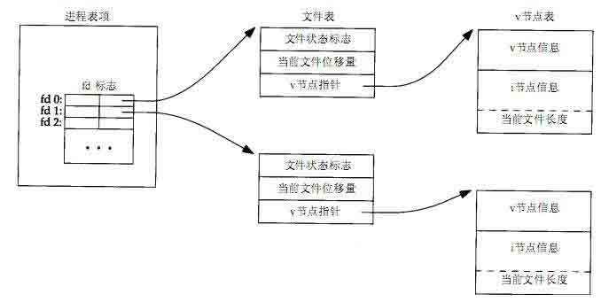

# 第 8 节 多进程编程(二)

## 一、实验说明

### 1\. 课程说明

本节继续介绍 Linux 系统多进程编程。上节课程主要介绍了 fork，这节课程将介绍另一个重要的进程相关的 exec。

### 2\. 如果首次使用 Linux，建议首先学习：

1.  [Linux 基础入门](http://www.shiyanlou.com/courses/1)
2.  [Vim 编辑器](http://www.shiyanlou.com/courses/2)

### 3\. 环境介绍

本实验环境采用带桌面的 Ubuntu Linux 环境，实验中会用到桌面上的程序： 1.命令行终端: Linux 命令行终端，打开后会进入 Bash 环境，可以使用 Linux 命令

2.Firefox 及 Opera：浏览器，可以用在需要前端界面的课程里，只需要打开环境里写的 HTML/JS 页面即可

3.gvim：非常好用的 Vim 编辑器，最简单的用法可以参考课程[Vim 编辑器](http://www.shiyanlou.com/courses/2)

4.gedit 及 Brackets：如果您对 gvim 的使用不熟悉，可以用这两个作为代码编辑器，其中 Brackets 非常适用于前端代码开发

## 二、揭秘文件描述符的本质

### 1\. 文件描述符的本质是数组元素的下标



右侧的表称为 i 节点表，在整个系统中只有 1 张。该表可以视为结构体数组，该数组的一个元素对应于一个物理文件。

中间的表称为文件表，在整个系统中只有 1 张。该表可以视为结构体数组，一个结构体中有很多字段，其中有 3 个字段比较重要：

1.  **file status flags**：用于记录文件被打开来读的，还是写的。其实记录的就是 open 调用中用户指定的第 2 个参数
2.  **current file offset**：用于记录文件的当前读写位置（指针）。正是由于此字段的存在，使得一个文件被打开并读取后，下一次读取将从上一次读取的字符后开始读取
3.  **v-node ptr**：该字段是指针，指向右侧表的一个元素，从而关联了物理文件。

左侧的表称为文件描述符表，每个进程有且仅有 1 张。该表可以视为指针数组，数组的元素指向文件表的一个元素。最重要的是：数组元素的下标就是大名鼎鼎的文件描述符。

open 系统调用执行的操作：新建一个 i 节点表元素，让其对应打开的物理文件（如果对应于该物理文件的 i 节点元素已经建立，就不做任何操作）；新建一个文件表的元素，根据 open 的第 2 个参数设置**file status flags**字段，将**current file offset**字段置 0，将 v-node ptr 指向刚建立的 i 节点表元素；在文件描述符表中，寻找 1 个尚未使用的元素，在该元素中填入一个指针值，让其指向刚建立的文件表元素。最重要的是：将该元素的下标作为 open 的返回值返回。

这样一来，当调用 read（write）时，根据传入的文件描述符，OS 就可以找到对应的文件描述符表元素，进而找到文件表的元素，进而找到 i 节点表元素，从而完成对物理文件的读写。

### 2\. fork 对文件描述符的影响

fork 会导致子进程继承父进程打开的文件描述符，其本质是将父进程的整个文件描述符表复制一份，放到子进程的 PCB 中。因此父、子进程中相同文件描述符（文件描述符为整数）指向的是同一个文件表元素，这将导致父（子）进程读取文件后，子（父）进程将读取同一文件的后续内容。

案例分析（forkfd.c）：

```cpp
 1 #include <stdio.h>
 2 #include <stdlib.h>
 3 #include <fcntl.h>
 4 #include <sys/types.h>
 5 #include <unistd.h>
 6 #include <sys/types.h>
 7
 8 int main(void)
 9 {
10         int fd, pid, status;
11         char buf[10];
12         if ((fd = open("./test.txt", O_RDONLY)) < 0) {
13                 perror("open");  exit(-1);
14         }
15         if ((pid = fork()) < 0) {
16                 perror("fork");  exit(-1);
17         } else if (pid == 0) {  //child
18                 read(fd, buf, 2);
19                 write(STDOUT_FILENO, buf, 2);
20         } else {  //parent
21                 sleep(2);
23                 lseek(fd, SEEK_CUR, 1);
24                 read(fd, buf, 3);
25                 write(STDOUT_FILENO, buf, 3);
26                 write(STDOUT_FILENO, "\n", 1);
27         }
28         return 0;
29 } 
```

假设，./test.txt 的内容是 abcdefg。那么子进程的 18 行将读到字符 ab；由于，父、子进程的文件描述符 fd 都指向同一个文件表元素，因此当父进程执行 23 行时，fd 对应的文件的读写指针将移动到字符 d，而不是字符 b，从而 24 行读到的是字符 def，而不是字符 bcd。程序运行的最终结果是打印 abdef，而不是 abbcd。

相对应的，如果是两个进程独立调用 open 去打开同一个物理文件，就会有 2 个文件表元素被创建，并且他们都指向同一个 i 节点表元素。两个文件表元素都有自己独立的 current file offset 字段，这将导致 2 个进程独立的对同一个物理文件进行读写，因此第 1 个进程读取到文件的第 1 个字符后，第 2 个进程再去读取该文件时，仍然是读到的是文件的第 1 个字符，而不是第 1 个字符的后续字符。

对应用程序员而言，最重要结论是： 如果子进程不打算使用父进程打开的文件，那么应该在 fork 返回后立即调用 close 关闭该文件。

## 三、父子进程同步的功臣— wait

### 1\. wait 的作用

在 forkbase.c 中，fork 出子进程后，为了保证子进程先于父进程运行，在父进程中使用了 sleep（2）的方式让父进程睡眠 2 秒。但实际上这样做，并不能 100%保证子进程先于父进程运行，因为在负荷非常重的系统中，有可能在父进程睡眠 2 秒期间，OS 并没有调度到子进程运行，并且当父进程睡醒后，首先调度到父进程运行。那么，如何才能 100%保证父、子进程完全按程序员的安排来进行同步呢？答案是：系统调用 wait！

需要包含的头文件： **<sys/types.h>**、**<sys/wait.h>** 函数原型：**pid_t wait(int * status)** 功能：等待进程结束。 返回值：若成功则为子进程 ID 号，若出错则为-1. 参数说明： **status**：用于存放进程结束状态。

wait 函数用于使父进程阻塞，直到一个子进程结束。父进程调用 wait，该父进程可能会：

1.  阻塞(如果其所有子进程都还在运行)。
2.  带子进程的终止状态立即返回(如果一个子进程已终止，正等待父进程存取其终止状态)。
3.  出错立即返回(如果它没有任何子进程)。

### 2\. 调用 wait 的实例

**wait.c**

```cpp
1 #include <stdio.h>
2 #include <stdlib.h>
3 #include <sys/types.h>
4 #include <unistd.h>
5 #include <wait.h>
6 void pr_exit(intstatus);
7 int main(void)
8 {
9         pid_t pid;
10        int  status;
11        if ( (pid = fork()) < 0)
12            { perror("fork");exit(-1); }
13        else if (pid == 0) {            /* child */
14            sleep(1);
15            printf("inchild\n");
16            exit(101);
17        }
18        if (wait(&status) != pid)    /* wait for child */
19            { perror("wait");exit(-2); }
20        printf("in parent\n");
21        pr_exit(status);               /* and print itsstatus */
22        if ( (pid = fork()) < 0)
23            { perror("fork");exit(-1); }
24        else if (pid == 0)              /*child */
25            abort();                    /* generates SIGABRT */
26        if (wait(&status) != pid)               /* wait for child */
27            { perror("wait");exit(-2); }
28        pr_exit(status);                      /* and printits status */
29        if ( (pid = fork()) < 0)
30            { perror("fork");exit(-1); }
31        else if (pid == 0)              /*child */
32            status /= 0;            /* divide by 0 generates SIGFPE */
33        if (wait(&status) != pid)               /* wait for child */
34            { perror("wait");exit(-1); }
35        pr_exit(status);       /* and printits status */
36        exit(0);
37 }
38 void pr_exit(int status) {
39        if (WIFEXITED(status))
40            printf("normallytermination, low-order 8 bit of exit status = %d\n", WEXITSTATUS(status));
41        else if(WIFSIGNALED(status))
42            printf("abnormallytermination, singal number = %d\n", WTERMSIG(status));
43 } 
```

**运行结果分析：**

11 行创建了一个子进程，13 行根据 fork 的返回值区分父、子进程。 我们先看父进程，父进程从 18 行运行，这里调用了 wait 函数等待子进程结束，并将子进程结束的状态保存在 status 中。这时，父进程就阻塞在 wait 这里了，这样就保证了子进程先运行。子进程从 13 行开始运行，然后 sleep 1 秒，打印出“in child”后，调用 exit 函数退出进程。这里 exit 中有个参数 101，表示退出的值是 101。.子进程退出后，父进程 wait 到了子进程的状态，并把状态保存到了 status 中。后面的**pr_exit**函数是用来对进程的退出状态进行打印。接下来，父进程又创建一个子进程，然后又一次调用 wait 函数等待子进程结束，父进程这时候阻塞在了 wait 这里。子进程开始执行，子进程里面只有一句话：abort（），abort 会结束子进程并发送一个 SIGABORT 信号，唤醒父进程。所以父进程会接受到一个 SIGABRT 信号，并将子进程的退出状态保存到 status 中。然后调用**pr_exit**函数打印出子进程结束的状态。然后父进程再次创建了一个子进程，依然用 wait 函数等待子进程结束并获取子进程退出时的状态。子进程里面就一句 status/= 0，这里用 0 做了除数，所以子进程会终止，并发送一个 SIGFPE 信号，这个信号是用来表示浮点运算异常，比如运算溢出，除数不能为 0 等。这时候父进程 wait 函数会捕捉到子进程的退出状态，然后调用 pr*exit 处理。 **pr***exit 函数将 status 状态传入，然后判断该状态是不是正常退出，如果是正常退出会打印出退出值；不是正常退出会打印出退出时的异常信号。这里用到了几个宏，简单解释如下：

**WIFEXITED**： 这个宏是用来判断子进程的返回状态是不是为正常，如果是正常退出，这个宏返回真。 **WEXITSTATUS**： 用来返回子进程正常退出的状态值。 **WIFSIGNALED**： 用来判断子进程的退出状态是否是非正常退出，若非正常退出时发送信号，则该宏返回真。 **WTERMSIG**： 用来返回非正常退出状态的信号 number。 所以这段代码的结果是分别打印出了三个子进程的退出状态和异常结束的信号编号。

## 四、进程控制地字第 1 号系统调用 — exec

当一个程序调用 fork 产生子进程，通常是为了让子进程去完成不同于父进程的某项任务，因此含有 fork 的程序，通常的编程模板如下：

```cpp
if ((pid = fork()) == 0) {
       dosomething in child process;
       exit(0);
}
do something in parent process; 
```

这样的编程模板使得父、子进程各自执行同一个二进制文件中的不同代码段，完成不同的任务。这样的编程模板在大多数情况下都能胜任，但仔细观察这种编程模板，你会发现它要求程序员在编写源代码的时候，就要预先知道子进程要完成的任务是什么。这本不是什么过分的要求，但在某些情况下，这样的前提要求却得不到满足，最典型的例子就是 Linux 的基础应用程序 —— shell。你想一想，在编写 shell 的源代码期间，程序员是不可能知道当 shell 运行时，用户输入的命令是 ls 还是 cp，难道你要在 shell 的源代码中使用 if--elseif--else if--else if ……结构，并拷贝 ls、cp 等等外部命令的源代码到 shell 源代码中吗？退一万步讲，即使这种弱智的处理方式被接受的话，你仍然会遇到无法解决的难题。想一想，如果用户自己编写了一个源程序，并将其编译为二进制程序 test，然后再在 shell 命令提示符下输入./test，对于采用前述弱智方法编写的 shell，它将情何以堪？

看来天字 1 号虽然很牛，但亦难以独木擎天，必要情况下，也需要地字 1 号予以协作，啊，伟大的团队精神！

### 1\. exec 的机制和用法

下面就详细介绍一下进程控制地字第 1 号系统调用——exec 的机制和用法。

#### （1）exec 的机制：

在用 fork 函数创建子进程后，子进程往往要调用 exec 函数以执行另一个程序。 当子进程调用 exec 函数时，会将一个二进制可执行程序的全路径名作为参数传给 exec，exec 会用新程序代换子进程原来全部进程空间的内容，而新程序则从其 main 函数开始执行，这样子进程要完成的任务就变成了新程序要完成的任务了。 因为调用 exec 并不创建新进程，所以前后的进程 ID 并未改变。exec 只是用另一个新程序替换了当前进程的正文、数据、堆和栈段。进程还是那个进程，但实质内容已经完全改变。呵呵，这是不是和中国 A 股的借壳上市有异曲同工之妙？ 顺便说一下，新程序的 bss 段清 0 这个操作，以及命令行参数和环境变量的指定，也是由 exec 完成的。

#### （2）exec 的用法：

函数原型： **int execle(const char * pathname,const char * arg0, ... (char *)0, char * const envp [] )**

返回值： exec 执行失败返回-1，成功将永不返回（想想为什么？）。哎，牛人就是有脾气，天字 1 号是调用 1 次，返回 2 次；地字 1 号，干脆就不返回了，你能奈我何？

参数： **pathname**：新程序的二进制文件的全路径名 **arg0**：新程序的第 1 个命令行参数 argv[0]，之后是新程序的第 2、3、4……个命令行参数，以(char*)0 表示命令行参数的结束 **envp**：新程序的环境变量

### 2\. exec 的使用实例

**echoall.c**

```cpp
 1 #include <stdio.h>
  2 #include <stdlib.h>
  3 #include <unistd.h>
  4
  5 int main(int argc, char*argv[])
  6 {
 7         int  i;
 8         char **ptr;
 9         extern char  **environ;
 10         for (i = 0; i < argc; i++)   /* echo all command-line args */
 11             printf("argv[%d]:%s\n", i, argv[i]);
 12         for (ptr = environ; *ptr != 0;ptr++)  /* and all env strings */
 13             printf("%s\n",*ptr);
 21 } 
```

将此程序进行编译，生成二进制文件命名为 echoall，放在当前目录下。很容易看出，此程序运行将打印进程的所有命令行参数和环境变量。

！源文件过长，请直接查看源代码 **exec.c**

程序运行结果：

```cpp
 1 argv[0]: echoall
 2 argv[1]: myarg1
 3 argv[2]: MY ARG2
 4 USER=unknown
 5 PATH=/tmp
 6 argv[0]: echoall
 7 argv[1]: only 1 arg
 8 ORBIT_SOCKETDIR=/tmp/orbit-dennis
 9 SSH_AGENT_PID=1792
10 TERM=xterm
11 SHELL=/bin/bash
12 XDG_SESSION_COOKIE=0a13eccc45d521c3eb847f7b4bf75275-1320116445.669339
13 GTK_RC_FILES=/etc/gtk/gtkrc:/home/dennis/.gtkrc-1.2-gnome2
14 WINDOWID=62919986
15 GTK_MODULES=canberra-gtk-module
16 USER=dennis
....... 
```

运行结果分析： 1-5 行是第 1 个子进程 14 行运行新程序 echoall 的结果，其中：1-3 行打印的是命令行参数；4、5 行打印的是环境变量。 6 行之后是第 2 个子进程 23 行运行新程序 echoall 的结果，其中：6、7 行打印的是命令行参数；8 行之后打印的是环境变量。之所以第 2 个子进程的环境变量那么多，是因为程序 23 行调用 execlp 时，没有给出环境变量参数，因此子进程就会继承父进程的全部环境变量。