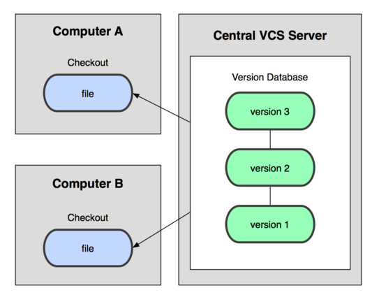
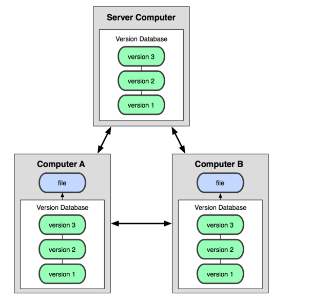

# Git 实战教程

本课程为《Git Community Book 中文版》提供配套实验，汇聚了 Git 社区的很多精华, 帮助你尽快的掌握 Git。感谢译者@liuhui998 授权。

## 一、实验说明

### 1\. 环境登录

无需密码自动登录，系统用户名 shiyanlou 若不小心登出后，直接刷新页面即可

### 2\. 环境使用

实验报告可以在个人主页中查看，其中含有每次实验的截图及笔记，以及每次实验的有效学习时间（指的是在实验桌面内操作的时间，如果没有操作，系统会记录为发呆时间）。这些都是您学习的真实性证明。

### 3\. 课程来源

感谢译者@liuhui998 授权，本课程为[《Git Community Book 中文版》](http://gitbook.liuhui998.com/)提供配套实验。

### 4.课程学习说明

学习本课程需要有一定的 Linux 基础，熟悉 Linux 的常用命令。

**建议初学者只需要学习前三个实验即可，基本用法已经涵盖了最常用的 git 操作。中级与高级用法使用很少，可以简单了解，用到时再查详细文档。**

## 二、git 诞生

同生活中的许多伟大事件一样，Git 诞生于一个极富纷争大举创新的年代。1991 年，Linus 创建了开源的 Linux，并且有着为数众多的参与者。虽然有世界各地的志愿者为 Linux 编写代码，但是绝大多数的 Linux 内核维护工作都花在了提交补丁和保存归档的繁琐事务上（1991－2002 年间）。在这期间，所有的源代码都是由 Linus 手工合并。因为 Linus 坚定地反对 CVS 和 SVN，这些集中式的版本控制系统（集中式和分布式我们会在接下来的内容讲解）不但速度慢，而且必须联网才能使用。虽然有一些商用的版本控制系统，比 CVS、SVN 好用，但那是付费的，和 Linux 的开源精神不符。

不过，到了 2002 年，Linux 系统已经发展了十年了，代码库之大让 Linus 很难继续通过手工方式管理了，社区的弟兄们也对这种方式表达了强烈不满，于是整个项目组启用了一个商业版本的分布式版本控制系统 BitKeeper 来管理和维护代码。BitKeeper 的东家 BitMover 公司出于人道主义精神，授权 Linux 社区免费使用这个版本控制系统。安定团结的大好局面在 2005 年被打破，开发 BitKeeper 的商业公司同 Linux 内核开源社区的合作关系结束，原因是 Linux 社区牛人聚集，开发 Samba 的 Andrew 试图破解 BitKeeper 的协议，这么干的其实也不只他一个，但是被 BitMover 公司发现了，于是 BitMover 公司收回了 Linux 社区的免费使用权。这就迫使 Linux 开源社区（ 特别是 Linux 的缔造者 Linus Torvalds ）不得不吸取教训，只有开发一套属于自己的版本控制系统才不至于重蹈覆辙。

他们对新的系统制订了若干目标：速度 、 简单的设计 、 对非线性开发模式的强力支持（允许上千个并行开发的分支）、完全分布式、有能力高效管理类似 Linux 内核一样的超大规模项目（速度和数据量）。自诞生于 2005 年以来，Git 日臻成熟完善，迅速成为最流行的分布式版本控制系统，在高度易用的同时，仍然保留着初期设定的目标。它的速度飞快，极其适合管理大项目，它还有着令人难以置信的非线性分支管理系统，可以应付各种复杂的项目开发需求。2008 年，GitHub 网站上线了，它为开源项目免费提供 Git 存储，无数开源项目开始迁移至 GitHub，包括 jQuery，PHP，Ruby 等等。

历史就是这么偶然，如果不是当年 BitMover 公司威胁 Linux 社区，可能现在我们就没有免费而超级好用的 Git 了。

## 三、版本控制系统

Linus 一直痛恨的 CVS 及 SVN 都是集中式的版本控制系统，而 Git 是分布式版本控制系统，集中式和分布式版本控制系统有什么区别呢？

先说集中式版本控制系统，版本库是集中存放在中央服务器的，而大家工作的时候，用的都是自己的电脑，所以要先从中央服务器取得最新的版本，然后开始工作，工作完成，再把自己的修订推送给中央服务器。这类系统，都有一个单一的集中管理的服务器，保存所有文件的修订版本，而协同工作的人们都通过客户端连到这台服务器，取出最新的文件或者提交更新。



那分布式版本控制系统与集中式版本控制系统有何不同呢？首先，分布式版本控制系统根本没有“中央服务器”，每个人的电脑上都是一个完整的版本库，这样，你工作的时候，就不需要联网了，因为版本库就在你自己的电脑上。既然每个人电脑上都有一个完整的版本库，那多个人如何协作呢？比方说你在自己电脑上改了文件 A，你的同事也在他的电脑上改了文件 A，这时，你们俩之间只需把各自的修改推送给对方，就可以互相看到对方的修改了。

和集中式版本控制系统相比，分布式版本控制系统的安全性要高很多，因为每个人电脑里都有完整的版本库，某一个人的电脑坏掉了不要紧，随便从其他人那里复制一个就可以了。而集中式版本控制系统的中央服务器要是出了问题，所有人都没法干活了。

在实际使用分布式版本控制系统的时候，其实很少在两人之间的电脑上推送版本库的修改，因为可能你们俩不在一个局域网内，两台电脑互相访问不了，也可能今天你的同事病了，他的电脑压根没有开机。因此，分布式版本控制系统通常也有一台充当“中央服务器”的电脑，但这个服务器的作用仅仅是用来方便“交换”大家的修改，没有它大家也一样干活，只是交换修改不方便而已。



许多这类系统都可以指定和若干不同的远端代码仓库进行交互。籍此，你就可以在同一个项目中，分别和不同工作小组的人相互协作。你可以根据需要设定不同的协作流程，比如层次模型式的工作流，而这在以前的集中式系统中是无法实现的。

## 一、实验说明

本节实验为 Git 入门第一个实验，可以帮助大家熟悉如何创建和使用 git 仓库。

## 二、git 的初始化

在使用 git 进行代码管理之前，我们首先要对 git 进行初始化。

### 1.Git 配置

使用 Git 的第一件事就是设置你的名字和`email`,这些就是你在提交`commit`时的签名，每次提交记录里都会包含这些信息。使用`git config`命令进行配置：

```
$ git config --global user.name "Scott Chacon"
$ git config --global user.email "schacon@gmail.com" 
```

执行了上面的命令后,会在家目录(`/home/shiyanlou`)下建立一个叫`.gitconfig` 的文件（该文件问隐藏文件，需要使用`ls -al`查看到）. 内容一般像下面这样，可以使用 vim 或 cat 查看文件内容:

```
$ cat ~/.gitconfig
[user]
        email = schacon@gmail.com
        name = Scott Chacon 
```

上面的配置文件就是 Git 全局配置的文件，一般配置方法是`git config --global <配置名称> <配置的值>`。

如果你想使项目里的某个值与前面的全局设置有区别(例如把私人邮箱地址改为工作邮箱)，你可以在项目中使用`git config` 命令不带 `--global` 选项来设置. 这会在你当前的项目目录下创建 `.git/config`，从而使用针对当前项目的配置。

## 三、获得一个 Git 仓库

既然我们现在把一切都设置好了，那么我们需要一个 Git 仓库。有两种方法可以得到它：一种是从已有的 Git 仓库中 clone (克隆，复制)；还有一种是新建一个仓库，把未进行版本控制的文件进行版本控制。

### 1.Clone 一个仓库

为了得一个项目的拷贝(copy),我们需要知道这个项目仓库的地址(Git URL). Git 能在许多协议下使用，所以 Git URL 可能以 ssh://, http(s)://, git://. 有些仓库可以通过不只一种协议来访问。

我们在`git.shiyanlou.com`上提供了一个名字为`gitproject`的供大家测试的公有仓库，这个仓库可以使用下面方式进行 clone：

```
$ git clone http://git.shiyanlou.com/shiyanlou/gitproject 
```

clone 操作完成后，会发现当前目录下多了一个`gitproject`文件夹，这个文件夹里的内容就是我们刚刚 clone 下来的代码。由于当前`gitproject 仅是测试项目，里面仅有一个 README.md 文件。

```
$ cd gitproject/
(master)$ ls 
README.md 
```

细心的同学可以发现在命令提示符`$`前面多了个`(master)`。这是由于实验楼的 Linux 使用的是 zsh Shell，zsh 会判断当前的目录是否有 Git 仓库，如果是的话则自动把目前所在的 git 分支显示在提示符中。Git 分支的概念我们会在稍后介绍。

### 2.初始化一个新的仓库

可以对一个已存在的文件夹用下面的命令让它置于 Git 的版本控制管理之下。

创建代码目录`project`：

```
$ cd /home/shiyanlou/
$ mkdir project 
```

进入到代码目录，创建并初始化 Git 仓库：

```
$ cd project
$ git init 
```

Git 会输出:

```
Initialized empty Git repository in /home/shiyanlou/project/.git/ 
```

通过`ls -la`命令会发现 project 目录下会有一个名叫`.git` 的目录被创建，这意味着一个仓库被初始化了。可以进入到`.git`目录查看下有哪些内容。

## 四、正常的工作流程

### 1\. 正常的工作流程

git 的基本流程如下：

1.  创建或修改文件
2.  使用`git add`命令添加新创建或修改的文件到本地的缓存区（Index）
3.  使用`git commit`命令提交到本地代码库
4.  （可选，有的时候并没有可以同步的远端代码库）使用`git push`命令将本地代码库同步到远端代码库

进入我们刚才建立的`project`目录，分别创建文件`file1`，`file2`，`file3`：

```
$ cd project
$ touch file1 file2 file3 
```

修改文件，可以使用 vim 编辑内容，也可以直接 echo 添加测试内容。

```
$ echo "testcontent1" >> file1
$ echo "testcontent2" >> file2
$ echo "testcontent3" >> file3 
```

此时可以使用`git status`命令查看当前 git 仓库的状态：

```
$ git status
On branch master

Initial commit

Untracked files:
   (use "git add <file>...") to include in what will be committed)

       file1
       file2
       file3
nothing added to commit but untracked files present (use "git add" to track) 
```

可以发现，有三个文件处于`untracked`状态，下一步我们就需要用`git add`命令将他们加入到缓存区（Index）。

使用`git add`命令将新建的文件添加到：

```
$ git add file1 file2 file3 
```

然后再次执行`git status`就会发现新的变化：

```
$ git status
On branch master

Initial commit

Changes to be committed:
    (use "git rm --cached <file>..." to unstage)

       new file: file1
       new file: file2
       new file: file3 
```

你现在为`commit`做好了准备，你可以使用 `git diff` 命令再加上 `--cached` 参数，看看缓存区中哪些文件被修改了。进入到`git diff --cached`界面后需要输入`q`才可以退出：

```
$ git diff --cached 
```

如果没有`--cached`参数，`git diff` 会显示当前你所有已做的但没有加入到索引里的修改。

如果你要做进一步的修改, 那就继续做, 做完后就把新修改的文件加入到缓存区中。

当所有新建，修改的文件都被添加到了缓存区，我们就要使用`git commit`提交到本地仓库：

```
$ git commit -m "add 3 files" 
```

需要使用`-m`添加本次修改的注释，完成后就会记录一个新的项目版本。除了用`git add` 命令，我们还可以用下面的命令将所有没有加到缓存区的修改也一起提交，但`-a`命令不会添加新建的文件。

```
$ git commit -a -m "add 3 files" 
```

再次输入`git status`查看状态，会发现当前的代码库已经没有待提交的文件了，缓存区已经被清空。

至此，我们完成了第一次代码提交，这次提交的代码中我们创建了三个新文件。需要注意的是如果是修改文件，也需要使用`git add`命令添加到缓存区才可以提交。如果是删除文件，则直接使用`git rm`命令删除后会自动将已删除文件的信息添加到缓存区，`git commit`提交后就会将本地仓库中的对应文件删除。

这个时候如果本地的仓库连接到了远程 Git 服务器，可以使用下面的命令将本地仓库同步到远端服务器：

```
$ git push origin master 
```

这时候可能需要你输入在 Git 服务器上的用户名和密码。可以参考[实验楼的代码库](https://www.shiyanlou.com/questions/360)中的说明练习这个命令。

## 五、分支与合并

Git 的分支可以让你在主线（master 分支）之外进行代码提交，同时又不会影响代码库主线。分支的作用体现在多人协作开发中，比如一个团队开发软件，你负责独立的一个功能需要一个月的时间来完成，你就可以创建一个分支，只把该功能的代码提交到这个分支，而其他同事仍然可以继续使用主线开发，你每天的提交不会对他们造成任何影响。当你完成功能后，测试通过再把你的功能分支合并到主线。

### 1.分支

一个 Git 仓库可以维护很多开发分支。现在我们来创建一个新的叫 experimental 的分支：

```
$ git branch experimental 
```

运行`git branch`命令可以查看当前的分支列表，已经目前的开发环境处在哪个分支上：

```
$ git branch
 experimental
* master 
```

experimental 分支是你刚才创建的，master 分支是 Git 系统默认创建的主分支。星号标识了你当工作在哪个分支下，输入`git checkout 分支名`可以切换到其他分支：

```
$ git checkout experimental
Switched to branch 'experimental' 
```

切换到`experimental`分支，切换完成后，先编辑里面的一个文件，再提交(commit)改动，最后切换回 “master”分支：

```
# 修改文件 file1
$ echo "update" >> file1
# 查看当前状态
$ git status
# 添加并提交 file1 的修改
$ git add file1
$ git commit -m "update file1"
# 查看 file1 的内容
$ cat file1
test
update
# 切换到 master 分支
$ git checkout master 
```

查看下`file1`中的内容会发现刚才做的修改已经看不到了。因为刚才的修改时在`experimental`分支下，现在切换回了`master`分支，目录下的文件都是`master`分支上的文件了。

现在可以在`master`分支下再作一些不同的修改:

```
# 修改文件 file2
$ echo "update again" >> file2
# 查看当前状态
$ git status
# 添加并提交 file2 的修改
$ git add file2
$ git commit -m "update file2 on master"
# 查看 file2 的内容
$ cat file2
test
update again 
```

这时，两个分支就有了各自不同的修改，分支的内容都已经不同，如何将多个分支进行合并呢？

可以通过下面的`git merge`命令来合并`experimental`到主线分支`master`:

```
# 切换到 master 分支
$ git checkout master
# 将 experimental 分支合并到 master
$ git merge  -m 'merge experimental branch' experimental 
```

`-m`参数仍然是需要填写合并的注释信息。

由于两个 branch 修改了两个不同的文件，所以合并时不会有冲突，执行上面的命令后合并就完成了。

如果有冲突，比如两个分支都改了一个文件 file3，则合并时会失败。首先我们在 master 分支上修改 file3 文件并提交：

```
# 切换到 master 分支
$ git checkout master
# 修改 file3 文件
$ echo "master: update file3" >> file3
# 提交到 master 分支
$ git commit -a -m 'update file3 on master' 
```

然后切换到 experimental，修改 file3 并提交：

```
# 切换到 experimental 分支
$ git checkout experimental
# 修改 file3 文件
$ echo "experimental: update file3" >> file3
# 提交到 master 分支
$ git commit -a -m 'update file3 on experimental' 
```

切换到 master 进行合并：

```
$ git checkout master
$ git merge experimental
Auto-merging file3
CONFLICT (content): Merge conflict in file3
Automatic merge failed; fix conflicts and then commit the result. 
```

合并失败后先用`git status`查看状态，会发现 file3 显示为`both modified`，查看 file3 内容会发现：

```
$ cat file3
test
<<<<<<< HEAD
master: update file3
=======
experimental: update file3
>>>>>>> experimental 
```

上面的内容也可以使用`git diff`查看，先前已经提到`git diff`不加参数可以显示未提交到缓存区中的修改内容。

可以看到冲突的内容都被添加到了 file3 中，我们使用 vim 编辑这个文件，去掉 git 自动产生标志冲突的`<<<<<<`等符号后，根据需要只保留我们需要的内容后保存，然后使用`git add file3`和`git commit`命令来提交合并后的 file3 内容，这个过程是手动解决冲突的流程。

```
# 编辑冲突文件
$ vim file3
# 提交修改后的文件
$ git add file3
$ git commit -m 'merge file3' 
```

当我们完成合并后，不再需要`experimental`时，可以使用下面的命令删除：

```
$ git branch -d experimental 
```

`git branch -d`只能删除那些已经被当前分支的合并的分支. 如果你要强制删除某个分支的话就用`git branch –D`

### 2.撒销一个合并

如果你觉得你合并后的状态是一团乱麻，想把当前的修改都放弃，你可以用下面的命令回到合并之前的状态：

```
$ git reset --hard HEAD^
# 查看 file3 的内容，已经恢复到合并前的 master 上的文件内容
$ cat file3 
```

### 3.快速向前合并

还有一种需要特殊对待的情况，在前面没有提到。通常，一个合并会产生一个合并提交(commit), 把两个父分支里的每一行内容都合并进来。

但是，如果当前的分支和另一个分支没有内容上的差异，就是说当前分支的每一个提交(commit)都已经存在另一个分支里了，git 就会执行一个“快速向前"(fast forward)操作；git 不创建任何新的提交(commit),只是将当前分支指向合并进来的分支。

## 六、Git 日志

### 1.查看日志

git log 命令可以显示所有的提交(commit)：

```
$ git log 
```

如果提交的历史纪录很长，回车会逐步显示，输入`q`可以退出。

`git log`有很多选项，可以使用`git help log`查看，例如下面的命令就是找出所有从"v2.5“开始在 fs 目录下的所有 Makefile 的修改：

```
$ git log v2.5.. Makefile fs/ 
```

Git 会根据 git log 命令的参数，按时间顺序显示相关的提交(commit)。

### 2.日志统计

如果用--stat 选项使用'git log',它会显示在每个提交(commit)中哪些文件被修改了, 这些文件分别添加或删除了多少行内容，这个命令相当于打印详细的提交记录：

```
$ git log --stat 
```

### 3.格式化日志

你可以按你的要求来格式化日志输出。`--pretty` 参数可以使用若干表现格式，如`oneline`:

```
$ git log --pretty=oneline 
```

或者你也可以使用 `short` 格式:

```
$ git log --pretty=short 
```

你也可用`medium`,`full`,`fuller`,`email` 或`raw`。 如果这些格式不完全符合你的相求， 你也可以用`--pretty=format`参数定义格式。

`--graph` 选项可以可视化你的提交图(commit graph)，会用 ASCII 字符来画出一个很漂亮的提交历史(commit history)线：

```
$ git log --graph --pretty=oneline 
```

### 4.日志排序

日志记录可以按不同的顺序来显示。如果你要指定一个特定的顺序，可以为`git log`命令添加顺序参数。

按默认情况，提交会按逆时间顺序显示，可以指定`--topo-order`参数，让提交按拓扑顺序来显示(就是子提交在它们的父提交前显示):

```
$ git log --pretty=format:'%h : %s' --topo-order --graph 
```

你也可以用 `--reverse`参数来逆向显示所有提交日志。

## 七、小结

本节讲解了几个基本命令：

*   git config：配置相关信息
*   git clone：复制仓库
*   git init：初始化仓库
*   git add：添加更新内容到索引中
*   git diff：比较内容
*   git status：获取当前项目状况
*   git commit：提交
*   git branch：分支相关
*   git checkout：切换分支
*   git merge：合并分支
*   git reset：恢复版本
*   git log：查看日志

## 八、练习

开通[实验楼的代码库](https://www.shiyanlou.com/questions/360)，在`/home/shiyanlou/Code`目录下练习一遍上述所讲的内容。

## 一、实验说明

本节实验为 Git 入门第二个实验，继续练习最常用的 git 命令。

### 1.1 实验准备

在进行该实验之前，可以先 clone 一个练习项目`gitproject`:

```
$ git clone http://git.shiyanlou.com/shiyanlou/gitproject 
```

本节中的实验操作都是在该项目中完成。

## 二、比较内容

### 1.比较提交 - Git Diff

现在我们对项目做些修改：

```
$ cd gitproject
# 向 README 文件添加一行
$ echo "new line" >> README.md
# 添加新的文件 file1
$ echo "new file" >> file1 
```

使用`git status`查看当前修改的状态：

```
$ git status
On branch master
Your branch is up-to-date with 'origin/master'.

Changes not staged for commit:
  (use "git add <file>..." to update what will be committed)
  (use "git checkout -- <file>..." to discard changes in working directory)

    modified:   README.md

Untracked files:
  (use "git add <file>..." to include in what will be committed)

    file1

no changes added to commit (use "git add" and/or "git commit -a") 
```

可以看到一个文件修改了，另外一个文件添加了。如何查看修改的文件内容呢，那就需要使用`git diff`命令。`git diff`命令的作用是比较修改的或提交的文件内容。

```
$ git diff
diff --git a/README.md b/README.md
index 21781dd..410e719 100644
--- a/README.md
+++ b/README.md
@@ -1,2 +1,3 @@
 gitproject
 ==========
+new line 
```

上面的命令执行后需要使用`q`退出。命令输出当前工作目录中修改的内容，并不包含新加文件，请注意这些内容还没有添加到本地缓存区。

将修改内容添加到本地缓存区，通配符可以把当前目录下所有修改的新增的文件都自动添加：

```
$ git add * 
```

再执行`git diff`会发现没有任何内容输出，说明当前目录的修改都被添加到了缓存区，如何查看缓存区内与上次提交之间的差别呢？需要使用`--cached`参数：

```
$ git diff --cached
diff --git a/README.md b/README.md
index 21781dd..410e719 100644
--- a/README.md
+++ b/README.md
@@ -1,2 +1,3 @@
 gitproject
 ==========
+new line
diff --git a/file1 b/file1
new file mode 100644
index 0000000..fa49b07
--- /dev/null
+++ b/file1
@@ -0,0 +1 @@
+new file 
```

可以看到输出中已经包含了新加文件的内容，因为 file1 已经添加到了缓存区。

最后我们提交代码：

```
$ git commit -m 'update code' 
```

提交后`git diff`与`git diff --cached`都不会有任何输出了。

### 2.比较分支

可以用 git diff 来比较项目中任意两个分支的差异。

我们首先创建一个新的分支`test`，并在该分支上提交一些修改：

```
# 创建 test 分支并切换到该分支
$ git branch test
$ git checkout test
# 添加新的一行到 file1
$ echo "branch test" >> file1
# 创建新的文件 file2
$ echo "new file2" >> file2
# 提交所有修改
$ git add *
$ git commit -m 'update test branch' 
```

然后，我们查看 test 分支和 master 之间的差别：

```
$ git diff master test
diff --git a/file1 b/file1
index fa49b07..17059cd 100644
--- a/file1
+++ b/file1
@@ -1 +1,2 @@
 new file
+branch test
diff --git a/file2 b/file2
new file mode 100644
index 0000000..80e7991
--- /dev/null
+++ b/file2
@@ -0,0 +1 @@
+new file2 
```

git diff 是一个难以置信的有用的工具，可以找出你项目上任意两个提交点间的差异。可以使用`git help diff`详细查看其他参数和功能。

### 3.更多的比较选项

如果你要查看当前的工作目录与另外一个分支的差别，你可以用下面的命令执行:

```
# 切换到 master
$ git checkout master

# 查看与 test 分支的区别
$ git diff test
diff --git a/file1 b/file1
index 17059cd..fa49b07 100644
--- a/file1
+++ b/file1
@@ -1,2 +1 @@
 new file
-branch test
diff --git a/file2 b/file2
deleted file mode 100644
index 80e7991..0000000
--- a/file2
+++ /dev/null
@@ -1 +0,0 @@
-new file2 
```

你也以加上路径限定符，来只比较某一个文件或目录：

```
$ git diff test file1
diff --git a/file1 b/file1
index 17059cd..fa49b07 100644
--- a/file1
+++ b/file1
@@ -1,2 +1 @@
 new file
-branch test 
```

上面这条命令会显示你当前工作目录下的 file1 与 test 分支之间的差别。

`--stat` 参数可以统计一下有哪些文件被改动，有多少行被改动：

```
$ git diff test --stat
 file1 | 1 -
 file2 | 1 -
 2 files changed, 2 deletions(-) 
```

## 三、分布式的工作流程

### 1.分布式的工作流程

你目前的项目在`/home/shiyanlou/gitproject`目录下，这是我们的 git 仓库(repository)，另一个用户也想与你协作开发。他的工作目录在这台机器上，如何让他提交代码到你的 git 仓库呢？

首先，我们假设另一个用户也用 shiyanlou 用户登录，只是工作在不同的目录下开发代码，实际工作中不太可能发生，大部分情况都是多个用户，这个假设只是为了让实验简化。

该用户需要从 git 仓库进行克隆：

```
# 进入到临时目录
$ cd /tmp
# 克隆 git 仓库
$ git clone /home/shiyanlou/gitproject myrepo
$ ls -l myrepo
-rw-rw-r-- 1 shiyanlou shiyanlou 31 Dec 22 08:24 README.md
-rw-rw-r-- 1 shiyanlou shiyanlou  9 Dec 22 08:24 file1 
```

这就建了一个新的叫"myrepo"的目录，这个目录里包含了一份 gitproject 仓库的克隆。这份克隆和原始的项目一模一样，并且拥有原始项目的历史记录。

在 myrepo 做了一些修改并且提交:

```
$ cd myrepo

# 添加新的文件 newfile
$ echo "newcontent" > newfile

# 提交修改
$ git add newfile
$ git commit -m "add newfile" 
```

myrepo 修改完成后，如果我们想合并这份修改到`gitproject`的 git 仓库该如何做呢？

可以在仓库`/home/shiyanlou/gitproject`中把 myrepo 的修改给拉 (pull)下来。执行下面几条命令:

```
$ cd /home/shiyanlou/gitproject
$ git pull /tmp/myrepo master
remote: Counting objects: 5, done.
remote: Compressing objects: 100% (2/2), done.
remote: Total 3 (delta 0), reused 0 (delta 0)
Unpacking objects: 100% (3/3), done.
From /tmp/myrepo
 * branch            master     -> FETCH_HEAD
Updating 8bb57aa..866c452
Fast-forward
 newfile | 1 +
 1 file changed, 1 insertion(+)
 create mode 100644 newfile

# 查看当前目录文件
$ ls                                                                                                    [8:28:02]
README.md  file1  newfile 
```

这就把`myrepo`的主分支合并到了`gitproject`的当前分支里了。

如果`gitproject`在`myrepo`修改文件内容的同时也做了修改的话，可能需要手工去修复冲突。

如果你要经常操作远程分支(remote branch),你可以定义它们的缩写:

```
$ git remote add myrepo /tmp/myrepo 
```

git pull 命令执行两个操作: 它从远程分支(remote branch)抓取修改`git fetch`的内容，然后把它合并`git merge`进当前的分支。

`gitproject`里可以用`git fetch` 来执行`git pull`前半部分的工作， 但是这条命令并不会把抓下来的修改合并到当前分支里：

```
$ git fetch myrepo
From /tmp/myrepo
 * [new branch]      master     -> myrepo/master 
```

获取后，我们可以通过`git log`查看远程分支做的所有修改，由于我们已经合并了所有修改，所以不会有任何输出：

```
$ git log -p master..myrepo/master 
```

当检查完修改后，`gitproject`可以把修改合并到它的主分支中：

```
$ git merge myrepo/master
Already up-to-date. 
```

如果我们在`myrepo`目录下执行`git pull`会发生什么呢？

`myrepo`会从克隆的位置拉取代码并更新本地仓库，就是把`gitproject`上的修改同步到本地:

```
# 进入到 gitproject
$ cd /home/shiyanlou/gitproject

# 添加一行内容到 newfile
$ echo "gitproject: new line" >> newfile

# 提交修改
$ git commit -a -m 'add newline to newfile'
[master 8c31532] add newline to newfile
 1 file changed, 1 insertion(+)

# 进入 myrepo 目录
$ cd /tmp/myrepo

# 同步 gitproject 的所有修改
$ git pull
remote: Counting objects: 6, done.
remote: Compressing objects: 100% (2/2), done.
remote: Total 3 (delta 1), reused 0 (delta 0)
Unpacking objects: 100% (3/3), done.
From /home/shiyanlou/gitproject
   8bb57aa..8c31532  master     -> origin/master
Updating 866c452..8c31532
Fast-forward
 newfile | 1 +
 1 file changed, 1 insertion(+) 
```

因为`myrepo`是从`gitproject`仓库克隆的，那么他就不需要指定`gitproject`仓库的地 址。因为 Git 把`gitproject`仓库的地址存储到`myrepo`的配置文件中，这个地址就是在`git pull`时默认使用的远程仓库：

```
$ git config --get remote.origin.url
/home/shiyanlou/gitproject 
```

如果`myrepo`和`gitproject`在不同的主机上，可以通过 ssh 协议来执行`clone` 和`pull`操作：

```
$ git clone localhost:/home/shiyanlou/gitproject test 
```

这个命令会提示你输入 shiyanlou 用户的密码，用户密码随机，可以点击屏幕上方的`SSH`按钮查看。

### 2.公共 Git 仓库

开发过程中，通常大家都会使用一个公共的仓库，并 clone 到自己的开发环境中，完成一个阶段的代码后可以告诉目标仓库的维护者来`pull`自己的代码。

如果你和维护者都在同一台机器上有帐号，那么你们可以互相从对 方的仓库目录里直接拉所作的修改，git 命令里的仓库地址也可以是本地的某个目录名：

```
$ git clone /path/to/repository
$ git pull /path/to/other/repository 
```

也可以是一个 ssh 地址：

```
$ git clone ssh://yourhost/~you/repository 
```

### 3.将修改推到一个公共仓库

通过 http 或是 git 协议，其它维护者可以通过远程访问的方式抓取(fetch)你最近的修改，但是他们 没有写权限。如何将本地私有仓库的最近修改主动上传到公共仓库中呢？

最简单的办法就是用`git push`命令，推送本地的修改到远程 Git 仓库，执行下面的命令:

```
$ git push ssh://yourserver.com/~you/proj.git master:master 
```

或者

```
$ git push ssh://yourserver.com/~you/proj.git master 
```

`git push`命令的目地仓库可以是`ssh`或`http/https`协议访问。

### 4.当推送代码失败时要怎么办

如果推送(push)结果不是快速向前`fast forward`，可能会报像下面一样的错误：

```
error: remote 'refs/heads/master' is not an ancestor of
local  'refs/heads/master'.
Maybe you are not up-to-date and need to pull first?
error: failed to push to 'ssh://yourserver.com/~you/proj.git' 
```

这种情况通常是因为没有使用`git pull`获取远端仓库的最新更新，在本地修改的同时，远端仓库已经变化了（其他协作者提交了代码），此时应该先使用`git pull`合并最新的修改后再执行`git push`：

```
$ git pull
$ git push ssh://yourserver.com/~you/proj.git master 
```

## 四、Git 标签

### 1.轻量级标签

我们可以用 git tag 不带任何参数创建一个标签(tag)指定某个提交(commit):

```
# 进入到 gitproject 目录
$ cd /home/shiyanlou/gitproject

# 查看 git 提交记录
$ git log

# 选择其中一个记录标志位 stable-1 的标签，注意需要将后面的 8c315325 替换成仓库下的真实提交内，commit 的名称很长，通常我们只需要写前面 8 位即可
$ git tag stable-1 8c315325

# 查看当前所有 tag
$ git tag
stable-1 
```

这样，我们可以用 stable-1 作为提交 `8c315325` 的代称。

前面这样创建的是一个“轻量级标签”。

如果你想为一个 tag 添加注释，或是为它添加一个签名, 那么我们就需要创建一个 "标签对象"。

#### 标签对象

`git tag`中使用`-a`， `-s` 或是 `-u`三个参数中任意一个，都会创建一个标签对象，并且需要一个标签消息(tag message)来为 tag 添加注释。 如果没有`-m` 或是 `-F` 这些参数，命令执行时会启动一个编辑器来让用户输入标签消息。

当这样的一条命令执行后，一个新的对象被添加到 Git 对象库中，并且标签引用就指向了一个标签对象，而不是指向一个提交，这就是与轻量级标签的区别。

下面是一个创建标签对象的例子:

```
$ git tag -a stable-2 8c315325 -m "stable 2"
$ git tag
stable-1
stable-2 
```

### 2.签名的标签

签名标签可以让提交和标签更加完整可信。如果你配有`GPG key`，那么你就很容易创建签名的标签。首先你要在你的 `.git/config` 或 `~/.gitconfig` 里配好 key。

下面是示例:

```
[user]
    signingkey = <gpg-key-id> 
```

你也可以用命令行来配置:

```
$ git config (--global) user.signingkey <gpg-key-id> 
```

现在你可以在创建标签的时候使用`-s` 参数来创建“签名的标签”：

```
$ git tag -s stable-1 1b2e1d63ff 
```

如果没有在配置文件中配 GPG key,你可以用`-u`参数直接指定。

```
$ git tag -u <gpg-key-id> stable-1 1b2e1d63ff 
```

## 五、小结

本节学习了下面知识点：

*   git diff
*   分布式的工作流程
*   git tag

对于初学者，如果不想深入 git 强大的高级功能的话，学完这个实验就可以了，因为后续实验内容用到的比较少，并且理解难度大。如果仍然感兴趣，建议使用一段时间 git 后再仔细学习后续实验，会有更好的收获。

## 六、练习

使用[实验楼的代码库](https://www.shiyanlou.com/questions/360)，在`/home/shiyanlou/Code`目录下练习一遍本节所讲的内容。

## 一、实验说明

从本节开始，我们会介绍一些中级和高级的用法，这些用法很少用到，前面三节的内容已经满足了日常工作需要，从本节开始的内容可以简单了解，需要的时候再详细查看。

### 1.1 下载测试项目环境

通过下列命令获得 gitproject 项目环境，该项目默认只有一个文件 README.md，可以用来进行后续 git 实验

```
$ git clone http://git.shiyanlou.com/shiyanlou/gitproject 
```

## 二、忽略某些文件

### 1.忽略某些文件

项目中经常会生成一些 Git 系统不需要追踪(track)的文件。典型的是在编译生成过程中产生的文件或是编程器生成的临时备份文件。当然，你不追踪(track)这些文件，可以 平时不用"git add"去把它们加到索引中。 但是这样会很快变成一件烦人的事，你发现 项目中到处有未追踪(untracked)的文件; 这样也使"git add ." 和"git commit -a" 变得实际上没有用处，同时"git status"命令的输出也会有它们。 你可以在你的顶层工作目录中添加一个叫".gitignore"的文件，来告诉 Git 系统要忽略掉哪些文件，下面是文件内容的示例: 以'#' 开始的行，被视为注释。 忽略掉所有文件名是 foo.txt 的文件。

```
foo.txt 
```

忽略所有生成的 html 文件。

```
*.html 
```

foo.html 是手工维护的，所以例外。

```
!foo.html 
```

忽略所有.o 和 .a 文件。

```
*.[oa] 
```

## 三、rebase

### 1.rebase

假设你现在基于远程分支"origin"，创建一个叫"mywork"的分支。

```
$ git checkout -b mywork origin 
```

现在我们在这个分支做一些修改，然后生成两个提交(commit)。

```
$ vi file.txt
$ git commit
$ vi otherfile.txt
$ git commit 
```

但是与此同时，有些人也在"origin"分支上做了一些修改并且做了提交了。这就意味着"origin"和"mywork"这两个分支各自"前进"了，它们之间"分叉"了。 在这里，你可以用"pull"命令把"origin"分支上的修改拉下来并且和你的修改合并； 结果看起来就像一个新的"合并的提交"(merge commit): 但是，如果你想让"mywork"分支历史看起来像没有经过任何合并一样，你也许可以用 git rebase:

```
$ git checkout mywork
$ git rebase origin 
```

这些命令会把你的"mywork"分支里的每个提交(commit)取消掉，并且把它们临时保存为补丁(patch)(这些补丁放到".git/rebase"目录中),然后把"mywork"分支更新 到最新的"origin"分支，最后把保存的这些补丁应用到"mywork"分支上。 当'mywork'分支更新之后，它会指向这些新创建的提交(commit),而那些老的提交会被丢弃。 如果运行垃圾收集命令(pruning garbage collection), 这些被丢弃的提交就会删除。 在 rebase 的过程中，也许会出现冲突(conflict). 在这种情况，Git 会停止 rebase 并会让你去解决冲突；在解决完冲突后，用"git-add"命令去更新这些内容的索引(index), 然后，你无需执行 git-commit,只要执行:

```
$ git rebase --continue 
```

这样 git 会继续应用(apply)余下的补丁。 在任何时候，你可以用--abort 参数来终止 rebase 的行动，并且"mywork" 分支会回到 rebase 开始前的状态。

```
$ git rebase --abort 
```

## 四、交互式 rebase

### 1.交互式 rebase

你亦可以选择进行交互式的 rebase。这种方法通常用于在向别处推送提交之前对它们进行重写。交互式 rebase 提供了一个简单易用的途径让你在和别人分享提交之前对你的提交进行分割、合并或者重排序。在把从其他开发者处拉取的提交应用到本地时，你也可以使用交互式 rebase 对它们进行清理。 如果你想在 rebase 的过程中对一部分提交进行修改，你可以在'git rebase'命令中加入'-i'或'--interactive'参数去调用交互模式。

```
$ git rebase -i origin/master 
```

这个命令会执行交互式 rebase 操作，操作对象是那些自最后一次从 origin 仓库拉取或者向 origin 推送之后的所有提交。 若想查看一下将被 rebase 的提交，可以用如下的 log 命令：

```
$ git log github/master.. 
```

一旦你完成对提交信息的编辑并且退出编辑器，这个新的提交及提交信息会被保存起来。 如果指定进行'edit'操作，git 会完成同样的工作，但是在对下一提交进行操作之前，它会返回到命令行让你对提交进行修正，或者对提交内容进行修改。 例如你想要分割一个提交，你需要对那个提交指定'edit'操作： 你会进入到命令行，撤销（revert）该提交，然后创建两个（或者更多个）新提交。假设提交 21d80a5 修改了两个文件，file1 和 file2，你想把这两个修改放到不同的提交里。你可以在进入命令行之后进行如下的操作：

```
$ git reset HEAD
$ git add file1
$ git commit -m 'first part of split commit'
$ git add file2
$ git commit -m 'second part of split commit'
$ git rebase --continue 
```

交互式 rebase 的最后一个作用是丢弃提交。如果把一行删除而不是指定'pick'、'squash'和'edit'中的任何一个，git 会从历史中移除该提交

## 五、交互式添加

### 1.交互式添加

交互式添加提供友好的界面去操作 Git 索引（index），同时亦提供了可视化索引的能力。只需简单键入'git add -i'，即可使用此功能。Git 会列出所有修改过的文件及它们的状态。

```
$ git add -i 
```

在这个例子中，我们可以看到有 5 个修改过的文件还没有被加入到索引中（unstaged），甚至可以看到每个文件增加和减少的行数。紧接着是一个交互式的菜单，列出了我们可以在此模式中使用的命令。 如果我们想要暂存（stage）这些文件，我们可以键入'2'或者'u'进入更新（update）模式。然后我们可以通过键入文件的范围（本例中是 1-4）来决定把哪些文件加入到索引之中。

```
What now> 2
           staged     unstaged path
  1:    unchanged        +4/-0 assets/stylesheets/style.css
  2:    unchanged      +23/-11 layout/book_index_template.html
  3:    unchanged        +7/-7 layout/chapter_template.html
  4:    unchanged        +3/-3 script/pdf.rb
  5:    unchanged      +121/-0 text/14_Interactive_Rebasing/0_ Interactive_Rebasing.markdown
Update>> 1-4
           staged     unstaged path
* 1:    unchanged        +4/-0 assets/stylesheets/style.css
* 2:    unchanged      +23/-11 layout/book_index_template.html
* 3:    unchanged        +7/-7 layout/chapter_template.html
* 4:    unchanged        +3/-3 script/pdf.rb
  5:    unchanged      +121/-0 text/14_Interactive_Rebasing/0_ Interactive_Rebasing.markdown
Update>> 
```

如果键入回车，我会回到主菜单中，同时可以看到那些指定文件的状态已经发生了改变：

```
What now> status
           staged     unstaged path
  1:        +4/-0      nothing assets/stylesheets/style.css
  2:      +23/-11      nothing layout/book_index_template.html
  3:        +7/-7      nothing layout/chapter_template.html
  4:        +3/-3      nothing script/pdf.rb
  5:    unchanged      +121/-0 text/14_Interactive_Rebasing/0_ Interactive_Rebasing.markdown 
```

现在我们可以看到前 4 个文件已经被暂存，但是最后一个没有。基本上，这是一个更加紧凑的查看状态的方式，实质上的信息与我们在命令行中运行'git status'是一致的：

```
$ git status 
```

### 六、储藏

### 1.储藏

当你正在做一项复杂的工作时, 发现了一个和当前工作不相关但是又很讨厌的 bug. 你这时想先修复 bug 再做手头的工作, 那么就可以用 git stash 来保存当前的工作状态, 等你修复完 bug 后,执行'反储藏'(unstash)操作就可以回到之前的工作里。

```
$ git stash save "work in progress for foo feature" 
```

上面这条命令会保存你的本地修改到储藏(stash)中, 然后将你的工作目录和索引里的内容全部重置, 回到你当前所在分支的上次提交时的状态。 好了, 你现在就可以开始你的修复工作了。

```
$ git commit -a -m "blorpl: typofix" 
```

当你修复完 bug 后, 你可以用 git stash apply 来回复到以前的工作状态。

```
$ git stash apply 
```

### 2.储藏队列

你也可多次使用'git stash'命令,　每执行一次就会把针对当前修改的‘储藏’(stash)添加到储藏队列中. 用'git stash list'命令可以查看你保存的'储藏'(stashes):

```
$ git stash list 
```

可以用类似'git stash apply stash@{1}'的命令来使用在队列中的任意一个'储藏'(stashes). 'git stash clear‘则是用来清空这个队列。

## 七、Git 树名

### 1.Git 树名

不用 40 个字节长的 SHA 串来表示一个提交(commit)或是其它 git 对象,有很多种名字表示方法。在 Git 里,这些名字就叫'树名'(treeish)

### 2.Sha 短名

如果你的一个提交(commit)的 sha 名字是 '980e3ccdaac54a0d4de358f3fe5d718027d96aae', git 会把下面的串视为等价的:

```
980e3ccdaac54a0d4de358f3fe5d718027d96aae
980e3ccdaac54a0d4
980e3cc 
```

只要你的‘sha 短名’(Partial Sha)是不重复的(unique)，它就不会和其它名字冲突(如果你使用了 5 个字节以上那是很难重复的)，git 也会把‘sha 短名’(Partial Sha)自动补全。

### 3.分支, Remote 或 标签

你可以使用分支,remote 或标签名来代替 SHA 串名, 它们只是指向某个对象的指针。假设你的 master 分支目前在提交(commit):'980e3'上, 现在把它推送(push)到 origin 上并把它命名为标签'v1.0', 那么下面的串都会被 git 视为等价的:

```
980e3ccdaac54a0d4de358f3fe5d718027d96aae
origin/master
refs/remotes/origin/master
master
refs/heads/master
v1.0
refs/tags/v1.0 
```

这意味着你执行下面的两条命令会有同样的输出:

```
$ git log master
$ git log refs/tags/v1.0 
```

### 4.日期标识符

Git 的引用日志(Ref Log)可以让你做一些‘相对'查询操作

```
master@{yesterday}
master@{1 month ago}: 
```

上面的第一条命令是:'master 分支的昨天状态(head)的缩写‘。注意: 即使在两个有相同 master 分支指向的仓库上执行这条命令, 但是如果这个两个仓库在不同机器上,　那么执行结果也很可能会不一样。

### 5.顺序标识符

这种格式用来表达某点前面的第 N 个提交(ref)。

```
master@{5} 
```

上面的表达式代表着 master 前面的第 5 个提交(ref)。

### 6.多个父对象

这能告诉你某个提交的第 N 个直接父提交(parent)。这种格式在合并提交(merge commits)时特别有用, 这样就可以使提交对象(commit object)有多于一个直接父对象(direct parent)。

```
master² 
```

### 7.波浪号

波浪号用来标识一个提交对象(commit object)的第 N 级嫡(祖)父对象(Nth grandparent)。 例如:

```
master~2 
```

就代表 master 所指向的提交对象的第一个父对象的第一个父对象(译者:你可以理解成是嫡系爷爷:))。 它和下面的这个表达式是等价的:

```
master^^ 
```

你也可以把这些‘标识符'(spec)叠加起来, 下面这个 3 个表达式都是指向同一个提交(commit):

```
master^^^^^^
master~3^~2
master~6 
```

### 8.树对象指针

如果大家对第一章 Git 对象模型还有印象的话, 就记得提交对象(commit object)是指向一个树对象(tree object)的. 假如你要得到一个提交对象(commit object)指向的树对象(tree object)的 sha 串名, 你就可以在‘树名'的后面加上'{tree}'来得到它:

```
master^{tree} 
```

### 9.二进制标识符

如果你要某个二进制对象(blob)的 sha 串名,你可以在'树名'(treeish)后添加二进制对象(blob)对应的文件路径来得到它。

```
master:/path/to/file 
```

### 10.区间

最后, 你可以用".."来指两个提交(commit)之间的区间. 下面的命令会给出你在"7b593b5" 和"51bea1"之间除了"7b593b5 外"的所有提交(commit)(注意:51bea1 是最近的提交)。

```
7b593b5..51bea1 
```

这会包括所有 从 7b593b 开始的提交(commit). 译者注: 相当于 7b593b..HEAD

```
7b593b.. 
```

## 八、小结

本节讲解了 git 的中级知识，在添加索引时可以通过配置.gitignore 文件来忽略文件，又讲解了 git rebase、git stash 和 git 树名。

## 九、练习

请在你自己的仓库上操作一遍，并深入理解这些命令。

## 一、实验说明

### 1\. 环境登录

无需密码自动登录，系统用户名 shiyanlou 若不小心登出后，直接刷新页面即可

### 2\. 环境使用

实验报告可以在个人主页中查看，其中含有每次实验的截图及笔记，以及每次实验的有效学习时间（指的是在实验桌面内操作的时间，如果没有操作，系统会记录为发呆时间）。这些都是您学习的真实性证明。

### 3.下载测试项目环境

通过下列命令获得 gitproject 项目环境，该项目默认只有一个文件 README.md，可以用来进行后续 git 实验

```
$ git clone http://git.shiyanlou.com/shiyanlou/gitproject 
```

## 二、追踪分支

### 1.追踪分支

在 Git 中‘追踪分支’是用于联系本地分支和远程分支的. 如果你在’追踪分支'(Tracking Branches)上执行推送(push)或拉取(pull)时,它会自动推送(push)或拉取(pull)到关联的远程分支上. 如果你经常要从远程仓库里拉取(pull)分支到本地,并且不想很麻烦的使用"git pull "这种格式; 那么就应当使用‘追踪分支'(Tracking Branches). git clone‘命令会自动在本地建立一个'master'分支，它是'origin/master'的‘追踪分支’. 而'origin/master'就是被克隆(clone)仓库的'master'分支. 你可以在使用'git branch'命令时加上'--track'参数, 来手动创建一个'追踪分支'.

```
$ git branch --track experimental origin/experimental 
```

当你运行下命令时:

```
$ git pull experimental 
```

它会自动从‘origin'抓取(fetch)内容，再把远程的'origin/experimental'分支合并进(merge)本地的'experimental'分支. 当要把修改推送(push)到 origin 时, 它会将你本地的'experimental'分支中的修改推送到 origin 的‘experimental'分支里,　而无需指定它(origin).

## 三、使用 Git Grep 进行搜索

### 1.使用 Git Grep 进行搜索

用 git grep 命令查找 Git 库里面的某段文字是很方便的. 当然, 你也可以用 unix 下的'grep'命令进行搜索, 但是'git grep'命令能让你不用签出(checkout)历史文件, 就能查找它们. 例如, 你要看 git.git 这个仓库里每个使用'xmmap'函数的地方, 你可以运行下面的命令:

```
$ git grep xmmap 
```

如果你要显示行号, 你可以添加'-n'选项:

```
$ git grep -n xmmap 
```

如果我们想只显示文件名, 我们可以使用'--name-onley'选项:

```
$ git grep --name-only xmmap 
```

我们用'-c'选项可以查看每个文件里有多少行匹配内容(line matches):

```
$ git grep -c xmmap 
```

现在, 如果我们要查找 git 仓库里某个特定版本里的内容, 我们可以像下面一样在命令行末尾加上标签名(tag reference):

```
$ git grep xmmap v1.5.0 
```

我们也可以组合一些搜索条件, 下面的命令就是查找我们在仓库的哪个地方定义了'SORT_DIRENT'.

```
$ git grep -e '#define' --and -e SORT_DIRENT 
```

我不但可以进行“与"(both)条件搜索操作，也可以进行"或"(either)条件搜索操作.

```
$ git grep --all-match -e '#define' -e SORT_DIRENT 
```

我们也可以查找出符合一个条件(term)且符合两个条件(terms)之一的文件行.例如我们要找出名字中含有‘PATH'或是'MAX'的常量定义:

```
$ git grep -e '#define' --and \( -e PATH -e MAX \) 
```

## 四、Git 的撤销操作 - 重置, 签出 和 撤销

### 1.修复未提交文件中的错误(重置)

如果你现在的工作目录(work tree)里搞的一团乱麻, 但是你现在还没有把它们提交; 你可以通过下面的命令, 让工作目录回到上次提交时的状态(last committed state):

```
$ git reset --hard HEAD 
```

这条命令会把你工作目录中所有未提交的内容清空(当然这不包括未置于版控制下的文件 untracked files). 从另一种角度来说, 这会让"git diff" 和"git diff --cached"命令的显示法都变为空. 如果你只是要恢复一个文件,如"hello.rb", 你就要使用 git checkout

```
$ git checkout -- hello.rb 
```

这条命令把 hello.rb 从 HEAD 中签出并且把它恢复成未修改时的样子.

### 2.修复已提交文件中的错误

如果你已经做了一个提交(commit),但是你马上后悔了, 这里有两种截然不同的方法去处理这个问题: 创建一个新的提交(commit), 在新的提交里撤消老的提交所作的修改. 这种作法在你已经把代码发布的情况下十分正确. 你也可以去修改你的老提交(old commit). 但是如果你已经把代码发布了,那么千万别这么做; git 不会处理项目的历史会改变的情况,如果一个分支的历史被改变了那以后就不能正常的合并. 创建新提交来修复错误 创建一个新的，撤销(revert)了前期修改的提交(commit)是很容易的; 只要把出错的提交(commit)的名字(reference)做为参数传给命令: git revert 就可以了; 下面这条命令就演示了如何撤消最近的一个提交:

```
$ git revert HEAD 
```

这样就创建了一个撤消了上次提交(HEAD)的新提交, 你就有机会来修改新提交(new commit)里的提交注释信息. 你也可撤消更早期的修改, 下面这条命令就是撤销“上上次”(next-to-last)的提交:

```
$ git revert HEAD^ 
```

在这种情况下,git 尝试去撤销老的提交,然后留下完整的老提交前的版本.　如果你最近的修改和要撤销的修改有重叠(overlap),那么就会被要求手工解决冲突(conflicts),　就像解决合并(merge)时出现的冲突一样. 译者注: git revert 其实不会直接创建一个提交(commit), 把撤销后的文件内容放到索引(index)里,你需要再执行 git commit 命令，它们才会成为真正的提交(commit). 修改提交来修复错误 如果你刚刚做了某个提交(commit), 但是你又想马上修改这个提交; git commit 现在支持一个叫--amend 的参数，它能让你修改刚才的这个提交(HEAD commit). 这项机制能让你在代码发布前,添加一些新的文件或是修改你的提交注释(commit message). 如果你在老提交(older commit)里发现一个错误, 但是现在还没有发布到代码服务器上. 你可以使用 git rebase 命令的交互模式, "git rebase -i"会提示你在编辑中做相关的修改. 这样其实就是让你在 rebase 的过程来修改提交.

## 五、维护 Git

### 1.保证良好的性能

在大的仓库中, git 靠压缩历史信息来节约磁盘和内存空间. 压缩操作并不是自动进行的, 你需要手动执行 git gc:

```
$ git gc 
```

压缩操作比较耗时, 你运行 git gc 命令最好是在你没有其它工作的时候.

### 2.保持可靠性

git fsck 运行一些仓库的一致性检查, 如果有任何问题就会报告. 这项操作也有点耗时, 通常报的警告就是“悬空对象"(dangling objects).

```
$ git fsck 
```

“悬空对象"(dangling objects)并不是问题, 最坏的情况只是它们多占了一些磁盘空间. 有时候它们是找回丢失的工作的最后一丝希望.

## 六、建立一个公共仓库

### 1.建立一个公共仓库

假设你个人的仓库在目录 ~/proj. 我们先克隆一个新的“裸仓库“,并且创建一个标志文件告诉 git-daemon 这是个公共仓库.

```
$ git clone --bare ~/proj proj.git
$ touch proj.git/git-daemon-export-ok 
```

上面的命令创建了一个 proj.git 目录, 这个目录里有一个“裸 git 仓库" -- 即只有'.git'目录里的内容,没有任何签出(checked out)的文件. 下一步就是你把这个 proj.git　目录拷到你打算用来托管公共仓库的主机上. 你可以用 scp, rsync 或其它任何方式.

### 2.通过 git 协议导出 git 仓库

用 git 协议导出 git 仓库, 这是推荐的方法. 如果这台服务器上有管理员，TA 们要告诉你把仓库放在哪一个目录中, 并且“git:// URL”除仓库目录部分外是什么. 你现在要做的是启动 git daemon; 它会监听在 9418 端口. 默认情况下它会允许你访问所有的 git 目录(看目录中是否有 git-daemon-export-ok 文件). 如果以某些目录做为 git-daemon 的参数, 那么 git-daemon 会限制用户通过 git 协议只能访问这些目录. 你可以在 inetd service 模式下运行 git-daemon; 点击 git daemon　可以查看帮助信息.

### 3.通过 http 协议导出 git 仓库

git 协议有不错的性能和可靠性, 但是如果主机上已经配好了一台 web 服务器,使用 http 协议(git over http)可能会更容易配置一些. 你需要把新建的"裸仓库"放到 Web 服务器的可访问目录里, 同时做一些调整,以便让 web 客户端获得它们所需的额外信息.

```
$ mv proj.git /home/you/public_html/proj.git
$ cd proj.git
$ git --bare update-server-info
$ chmod a+x hooks/post-update 
```

$ git clone http://yourserver.com/~you/proj.git

```
$ git clone http://yourserver.com/~you/proj.git 
```

## 七、建立一个私有仓库

### 1.通过 SSH 协议来访问仓库　

通常最简单的办法是通 ssh 协议访问 Git(Git Over SSH). 如果你在一台机器上有了一个 ssh 帐号, 你只要把“git 祼仓库"放到任何一个可以通过 ssh 访问的目录, 然后可以像 ssh 登录一样简单的使用它. 假设你现在有一个仓库，并且你要把它建成可以在网上可访问的私有仓库. 你可以用下面的命令, 导出一个"祼仓库", 然后用 scp 命令把它们拷到你的服务器上:

```
$ git clone --bare /home/user/myrepo/.git /tmp/myrepo.git
$ scp -r /tmp/myrepo.git myserver.com:/opt/git/myrepo.git 
```

如果其它人也在 myserver.com　这台服务器上有 ssh 帐号，那么 TA 也可以从这台服务器上克隆(clone)代码:

```
$ git clone myserver.com:/opt/git/myrepo.git 
```

上面的命令会提示你输入 ssh 密码或是使用公钥(public key).

## 八、小结

本节讲了追踪分支，使用 Git Grep 进行搜索，Git 的撤消操作（git reset、git checkout、git revert），维护 Git（git gc、git fsck）以及建立公有和私有仓库。

## 九、练习

请自己建一个公有仓库让小伙伴可以访问。

## 一、实验说明

### 1\. 环境登录

无需密码自动登录，系统用户名 shiyanlou 若不小心登出后，直接刷新页面即可

### 2\. 环境使用

实验报告可以在个人主页中查看，其中含有每次实验的截图及笔记，以及每次实验的有效学习时间（指的是在实验桌面内操作的时间，如果没有操作，系统会记录为发呆时间）。这些都是您学习的真实性证明。

### 3.下载测试项目环境

通过下列命令获得 gitproject 项目环境，该项目默认只有一个文件 README.md，可以用来进行后续 git 实验

```
$ git clone http://git.shiyanlou.com/shiyanlou/gitproject 
```

## 二、创建新的空分支

### 1.创建新的空分支

在偶尔的情况下，你可能会想要保留那些与你的代码没有共同祖先的分支。例如在这些分支上保留生成的文档或者其他一些东西。如果你需要创建一个不使用当前代码库作为父提交的分支，你可以用如下的方法创建一个空分支：

```
git symbolic-ref HEAD refs/heads/newbranch 
rm .git/index 
git clean -fdx 
<do work> 
git add your files 
git commit -m 'Initial commit' 
```

## 三、修改你的历史

### 1.修改你的历史

交互式洐合是修改单个提交的好方法。 git filter-branch 是修改大量提交的好方法。

## 四、高级分支与合并

### 1.在合并过程中得到解决冲突的协助

git 会把所有可以自动合并的修改加入到索引中去, 所以 git diff 只会显示有冲突的部分. 它使用了一种不常见的语法:

```
$ git diff 
```

回忆一下, 在我们解决冲突之后, 得到的提交会有两个而不是一个父提交: 一个父提交会成为 HEAD, 也就是当前分支的 tip; 另外一个父提交会成为另一分支的 tip, 被暂时存在 MERGE_HEAD. 在合并过程中, 索引中保存着每个文件的三个版本. 三个"文件暂存(file stage)"中的每一个都代表了文件的不同版本:

```
$ git show :1:file.txt 
$ git show :2:file.txt
$ git show :3:file.txt 
```

当你使用 git diff 去显示冲突时, 它在工作树(work tree), 暂存 2(stage 2)和暂存 3(stage 3)之间执行三路 diff 操作, 只显示那些两方都有的块(换句话说, 当一个块的合并结果只从暂存 2 中得到时, 是不会被显示出来的; 对于暂存 3 来说也是一样). 上面的 diff 结果显示了 file.txt 在工作树, 暂存 2 和暂存 3 中的差异. git 不在每行前面加上单个'+'或者'-', 相反地, 它使用两栏去显示差异: 第一栏用于显示第一个父提交与工作目录文件拷贝的差异, 第二栏用于显示第二个父提交与工作文件拷贝的差异. (参见 git diff-files 中的"COMBINED DIFF FORMAT"取得此格式详细信息.) 在用直观的方法解决冲突之后(但是在更新索引之前), diff 输出会变成下面的样子:

```
$ git diff
diff --cc file.txt
index 802992c,2b60207..0000000
--- a/file.txt
+++ b/file.txt
@@@ -1,1 -1,1 +1,1 @@@
- Hello world
-Goodbye
++Goodbye world 
```

上面的输出显示了解决冲突后的版本删除了第一个父版本提供的"Hello world"和第二个父版本提供的"Goodbye", 然后加入了两个父版本中都没有的"Goodbye world". 一些特别 diff 选项允许你对比工作目录和三个暂存中任何一个的差异:

```
$ git diff -1 file.txt 
$ git diff --base file.txt  
$ git diff -2 file.txt      
$ git diff --ours file.txt       
$ git diff -3 file.txt      
$ git diff --theirs file.txt 
```

git log 和 gitk 命令也为合并操作提供了特别的协助:

```
$ git log --merge
$ gitk --merge 
```

这会显示所有那些只在 HEAD 或者只在 MERGE_HEAD 中存在的提交, 还有那些更新(touch)了未合并文件的提交. 你也可以使用 git mergetool, 它允许你使用外部工具如 emacs 或 kdiff3 去合并文件. 每次你解决冲突之后, 应该更新索引:

```
$ git add file.txt 
```

完成索引更新之后, git-diff(缺省地)不再显示那个文件的差异, 所以那个文件的不同暂存版本会被"折叠"起来.

### 2.多路合并

你可以一次合并多个头, 只需简单地把它们作为 git merge 的参数列出. 例如,

```
$ git merge scott/master rick/master tom/master 
```

相当于

```
$ git merge scott/master
$ git merge rick/master
$ git merge tom/master 
```

### 3.子树

有时会出现你想在自己项目中引入其他独立开发项目的内容的情况. 在没有路径冲突的前提下, 你只需要简单地从其他项目拉取内容即可. 如果有冲突的文件, 那么就会出现问题. 可能的例子包括 Makefile 和其他一些标准文件名. 你可以选择合并这些冲突的文件, 但是更多的情况是你不愿意把它们合并. 一个更好解决方案是把外部项目作为一个子目录进行合并. 这种情况不被递归合并策略所支持, 所以简单的拉取是无用的. 在这种情况下, 你需要的是子树合并策略. 这下面例子中, 我们设定你有一个仓库位于/path/to/B (如果你需要的话, 也可以是一个 URL). 你想要合并那个仓库的 master 分支到你当前仓库的 dir-B 子目录下. 下面就是你所需要的命令序列:

```
$ git remote add -f Bproject /path/to/B (1)
$ git merge -s ours --no-commit Bproject/master (2)
$ git read-tree --prefix=dir-B/ -u Bproject/master (3)
$ git commit -m "Merge B project as our subdirectory" (4)
$ git pull -s subtree Bproject master (5) 
```

子树合并的好处就是它并没有给你仓库的用户增加太多的管理负担. 它兼容于较老(版本号小于 1.5.2)的客户端, 克隆完成之后马上可以得到代码. 然而, 如果你使用子模块(submodule), 你可以选择不传输这些子模块对象. 这可能在子树合并过程中造成问题. 另外, 若你需要修改内嵌外部项目的内容, 使用子模块方式可以更容易地提交你的修改.

## 查找问题的利器 - Git Bisect

### 4.查找问题的利器 - Git Bisect

假设你在项目的'2.6.18'版上面工作, 但是你当前的代码(master)崩溃(crash)了. 有时解决这种问题的最好办法是: 手工逐步恢复(brute-force regression)项目历史,　找出是哪个提交(commit)导致了这个问题. 但是 linkgit:git-bisect1 可以更好帮你解决这个问题:

```
$ git bisect start
$ git bisect good v2.6.18
$ git bisect bad master 
```

如果你现在运行"git branch",　会发现你现在所在的是"no branch"(译者注:这是进行 git bisect 的一种状态). 这时分支指向提交（commit):"69543", 此提交刚好是在"v2.6.18"和“master"中间的位置. 现在在这个分支里,　编译并测试项目代码, 查看它是否崩溃(crash). 假设它这次崩溃了, 那么运行下面的命令:

```
$ git bisect bad 
```

现在 git 自动签出(checkout)一个更老的版本. 继续这样做, 用"git bisect good","git bisect bad"告诉 git 每次签出的版本是否没有问题; 你现在可以注意一下当前的签出的版本, 你会发现 git 在用"二分查找(binary search)方法"签出"bad"和"good"之间的一个版本(commit or revison). 在这个项目(case)中, 经过 13 次尝试, 找出了导致问题的提交(guilty commit). 你可以用 git show 命令查看这个提交(commit), 找出是谁做的修改，然后写邮件给 TA. 最后, 运行:

```
$ git bisect reset 
```

这会到你之前(执行 git bisect start 之前)的状态. 注意: git-bisect 每次所选择签出的版本, 只是一个建议; 如果你有更好的想法, 也可以去试试手工选择一个不同的版本. 运行:

```
$ git bisect visualize 
```

这会运行 gitk, 界面上会标识出"git bisect"命令自动选择的提交(commit). 你可以选择一个相邻的提交(commit), 记住它的 SHA 串值, 用下面的命令把它签出来:

```
$ git reset --hard fb47ddb2db... 
```

然后进行测试, 再根据测试结果执行”bisect good"或是"bisect bad"; 就这样反复执行, 直到找出问题为止.

## 五、查找问题的利器 - Git Blame

### 1.查找问题的利器 - Git Blame

如果你要查看文件的每个部分是谁修改的, 那么 git blame 就是不二选择. 只要运行'git blame [filename]', 你就会得到整个文件的每一行的详细修改信息:包括 SHA 串,日期和作者:

```
$ git blame sha1_file.c 
```

如果文件被修改了(reverted),或是编译(build)失败了; 这个命令就可以大展身手了. 你也可以用"-L"参数在命令(blame)中指定开始和结束行:

```
$ git blame -L 160,+10 sha1_file.c 
```

## 六、Git 和 Email

### 1.向一个项目提交补丁

如果你只做了少量的改动, 最简单的提交方法就是把它们做成补丁(patch)用邮件发出去: 首先, 使用 git format-patch; 例如:

```
$ git format-patch origin 
```

这会在当前目录生成一系统编号的补丁文件, 每一个补丁文件都包含了当前分支和 origin/HEAD 之间的差异内容. 然后你可以手工把这些文件导入你的 Email 客户端. 但是如果你需要一次发送很多补丁, 你可能会更喜欢使用 git send-email 脚本去自动完成这个工作. 在发送之前, 应当先到项目的邮件列表上咨询一下项目管理者, 了解他们管理这些补丁的方式.

### 2.向一个项目中导入补丁

Git 也提供了一个名为 git am 的工具(am 是"apply mailbox"的缩写)去应用那些通过 Email 寄来的系列补丁. 你只需要按顺序把所有包含补丁的消息存入单个的 mailbox 文件, 比如说"patches.mbox", 然后运行

```
$ git am -3 patches.mbox 
```

Git 会按照顺序应用每一个补丁; 如果发生了冲突, git 会停下来让你手工解决冲突从而完成合并. ("-3"选项会让 git 执行合并操作; 如果你更喜欢中止并且不改动你的工作树和索引, 你可以省略"-3"选项.) 在解决冲突和更新索引之后, 你不需要再创建一个新提交, 只需要运行

```
$ git am --resolved 
```

这时 git 会为你创建一个提交, 然后继续应用 mailbox 中余下的补丁. 最后的效果是, git 产生了一系列提交, 每个提交是原来 mailbox 中的一个补丁, 补丁中的作者信息和提交日志也一并被记录下来.

## 七、定制 Git

### 1.更改你的编辑器

```
$ git config --global core.editor vim 
```

### 2.添加别名

```
$ git config --global alias.last 'cat-file commit HEAD'
$ git last
$ git cat-file commit HEAD 
```

### 3.添加颜色

```
$ git config color.branch auto
$ git config color.diff auto
$ git config color.interactive auto
$ git config color.status auto 
```

或者你可以通过 color.ui 选项把颜色全部打开:

```
$ git config color.ui true 
```

### 4.提交模板

```
$ git config commit.template '/etc/git-commit-template' 
```

### 5.日志格式

```
$ git config format.pretty oneline 
```

## 八、Git Hooks

### 1.Git Hooks

钩子(hooks)是一些在"$GIT-DIR/hooks"目录的脚本, 在被特定的事件(certain points)触发后被调用。当"git init"命令被调用后, 一些非常有用的示例钩子文件(hooks)被拷到新仓库的 hooks 目录中; 但是在默认情况下这些钩子(hooks)是不生效的。 把这些钩子文件(hooks)的".sample"文件名后缀去掉就可以使它们生效了。

### 2.applypatch-msg

```
GIT_DIR/hooks/applypatch-msg 
```

当'git-am'命令执行时，这个钩子就被调用。它只有一个参数：就是存有提交消息(commit log message)的文件的名字。如果钩子的执行结果是非零，那么补丁(patch)就不会被应用(apply)。

这个钩子用于在其它地方编辑提交消息，并且可以把这些消息规范成项目的标。它也可以在分析(inspect)完消息文件后拒绝此次提交(commit)。

### 3.pre-applypatch

```
GIT_DIR/hooks/pre-applypatch 
```

当'git-am'命令执行时，这个钩子就被调用。它没有参数，并且是在一个补丁(patch)被应用后还未提交(commit)前被调用。如果钩子的执行结果是非零，那么刚才应用的补丁(patch)就不会被提交。

它用于检查当前的工作树，当提交的补丁不能通过特定的测试就拒绝将它提交(commit)进仓库。

### 4.post-applypatch

```
GIT_DIR/hooks/post-applypatch 
```

当'git-am'命令执行时，这个钩子就被调用。它没有参数，并且是在一个补丁(patch)被应用且在完成提交(commit)情况下被调用。 这个钩子的主要用途是通知提示(notification)，它并不会影响'git-am'的执行和输出。

### 5.pre-commit

```
GIT_DIR/hooks/pre-commit 
```

这个钩子被 'git-commit' 命令调用, 而且可以通过在命令中添加--no-verify 参数来跳过。这个钩子没有参数，在得到提交消息和开始提交(commit)前被调用。如果钩子执行结果是非零，那么 'git-commit' 命令就会中止执行。 当默认的'pre-commit'钩子开启时，如果它发现文件尾部有空白行，那么就会中止此次提交。

### 6.prepare-commit-msg

```
GIT_DIR/hooks/prepare-commit-msg 
```

当'git-commit'命令执行时：在编辑器(editor)启动前，默认提交消息准备好后，这个钩子就被调用。 如果钩子的执行结果是非零的话，那么'git-commit'命令就会被中止执行。

### 7.commit-msg

```
GIT_DIR/hooks/commit-msg 
```

当'git-commit'命令执行时，这个钩子被调用；也可以在命令中添加--no-verify 参数来跳过。这个钩子有一个参数：就是被选定的提交消息文件的名字。如这个钩子的执行结果是非零，那么'git-commit'命令就会中止执行。 这个钩子为提交消息更适当，可以用于规范提交消息使之符合项目的标准(如果有的话)；如果它检查完提交消息后，发现内容不符合某些标准，它也可以拒绝此次提交(commit)。 默认的'commit-msg'钩子启用后，它检查里面是否有重复的签名结束线(Signed-off-by lines)，如果找到它就是中止此次提交(commit)操作。

### 8.post-commit

```
GIT_DIR/hooks/post-commit 
```

当'git-commit'命令执行时，这个钩子就被调用。它没有参数，并且是在一个提交(commit)完成时被调用。 这个钩子的主要用途是通知提示(notification)，它并不会影响'git-commit'的执行和输出。

### 9.pre-rebase

```
GIT_DIR/hooks/pre-rebase 
```

当'git-base'命令执行时，这个钩子就被调用；主要目的是阻止那些不应被 rebase 的分支被 rebase(例如，一个已经发布的分支提交就不应被 rebase)。

### 10.post-checkout

```
GIT_DIR/hooks/post-checkout 
```

当'git-checkout'命令更新完整个工作树(worktree)后，这个钩子就会被调用。这个钩子有三个参数：前一个 HEAD 的 ref，新 HEAD 的 ref，判断一个签出是分支签出还是文件签出的标识符(分支签出＝1，文件签出＝0)。这个钩子不会影响'git-checkout'命令的输出。 这个钩子可以用于检查仓库的一致性，自动显示签出前后的代码的区别，也可以用于设置目录的元数据属性。

### 11.post-merge

```
GIT_DIR/hooks/post-merge 
```

### 12.pre-receive

当用户在本地仓库执行'git-push'命令时，服务器上远端仓库就会对应执行'git-receive-pack'命令，而'git-receive-pack'命令会调用 pre-receive 钩子。在开始更新远程仓库上的 ref 之前，这个钩子被调用。钩子的执行结果(exit status)决定此次更新能否成功。 每执行一个接收(receive)操作都会调用一次这个钩子。它没有命令行参数，但是它会从标准输入(standard input)读取需要更新的 ref，格式如下：

```
SP SP LF(SP 是空格，LF 是回车。) 
```

`<old-value>`是保存在 ref 里的老对象的名字，`<new-value>`是保存在 ref 里的新对象的名字，`<ref-name>`就是此次要更新的 ref 的全名。如果是创建一个新的 ref，那么`<old-value>`就是由 40 个 0 组成的字符串表示。 如果钩子的执行结果是非零，那么没有引用(ref)会被更新。如果执行结果为零，更新操作还可以被后面的`<<update,'update'>>`钩子所阻止。 钩子(hook)的标准输出和标准错误输出(stdout & stderr)都会通过'git-send-pack'转发给客户端(other end)，你可以把这个信息回显(echo)给用户。 如果你用 ruby,那么可以像下面的代码一样得到它们的参数。

```
rev_old, rev_new, ref = STDIN.read.split(" ") 
```

### 13.update

```
GIT_DIR/hooks/update 
```

当用户在本地仓库执行'git-push'命令时，服务器上远端仓库就会对应执行'git-receive-pack'，而'git-receive-pack'会调用 update 钩子。在更新远程仓库上的 ref 之前，这个钩子被调用。钩子的执行结果(exit status)决定此次 update 能否成功。

### 14.post-receive

```
GIT_DIR/hooks/post-receive 
```

当用户在本地仓库执行'git-push'命令时，服务器上远端仓库就会对应执行'git-receive-pack'命令；在所有远程仓库的引用(ref)都更新后，这个钩子就会被'git-receive-pack'调用。

## 九、找回丢失的对象

### 1.准备

我们先创建一个用以实验的仓库，在里面创建了若干个提交和分支。

```
$ mkdir recovery
$ cd recovery
$ git init
$ touch file
$ git add file
$ git commit -m "First commit"
$ echo "Hello World" > file
$ git add .
$ git commit -m "Greetings"
$ git branch cool_branch　
$ git checkout cool_branch
$ echo "What up world?" > cool_file
$ git add .
$ git commit -m "Now that was cool"
$ git checkout master
$ echo "What does that mean?" >> file 
```

### 2.恢复已删除分支提交

现在 repo 里有两个 branch

```
$ git branch
cool_branch
* master 
```

存储当前仓库未提交的改动

```
$ git stash save "temp save" 
```

删除一个分支

```
$ git branch -D cool_branch
$ git branch
* master 
```

用 git fsck --lost-found 命令找出刚才删除的分支里面的提交对象。

```
$ git fsck --lost-found 
```

用 git show 命令查看一个找到的对象的内容，看是否为我们所找的。

```
git show 2e43cd56ee4fb08664cd843cd32836b54fbf594a 
```

这个提交对象确实是我们在前面删除的分支的内容；下面我们就要考虑一下要如何来恢复它了。 使用 git rebase　进行恢复

```
$ git rebase 2e43cd56ee4fb08664cd843cd32836b54fbf594a 
```

现在我们用 git log 命令看一下，看看它有没有恢复:

```
$ git log 
```

使用 git merge　进行恢复,我们把刚才的恢复的提交删除

```
$ git reset --hard HEAD^ 
```

再把刚删的提交给找回来：

```
$ git fsck --lost-found 
```

不过这回我们用是合并命令进行恢复：

```
$ git merge 2e43cd56ee4fb08664cd843cd32836b54fbf594a 
```

### 3.git stash 的恢复

前面我们用 git stash 把没有提交的内容进行了存储，如果这个存储不小心删了怎么办呢？ 当前 repo 里有的存储：

```
$ git stash list 
```

把它们清空：

```
$ git stash clear 
```

再用 git fsck --lost-found 找回来：

```
$ git fsck --lost-found 
```

用 git show 看一下回来的内容对不对：

```
$ git show 674c0618ca7d0c251902f0953987ff71860cb067 
```

看起来没有问题，好的，那么我就把它恢复了吧：

```
$ git merge 674c0618ca7d0c251902f0953987ff71860cb067 
```

## 十、子模块

### 1.子模块

一个大项目通常由很多较小的, 自完备的模块组成. 例如, 一个嵌入式 Linux 发行版的代码树会包含每个进行过本地修改的软件的代码; 一个电影播放器可能需要基于一个知名解码库的特定版本完成编译; 数个独立的程序可能会共用同一个创建脚本. 在集中式版本管理系统中, 可以通过把每个模块放在一个单独的仓库中来完成上述的任务. 开发者可以把所有模块都签出(checkout), 也可以选择只签出他需要的模块. 在移动文件, 修改 API 和翻译时, 他们甚至可以在一个提交中跨多个模块修改文件 为说明子模块的使用方法, 创建 4 个用作子模块的示例仓库:

```
$ mkdir ~/git
$ cd ~/git
$ for i in a b c d
do
    mkdir $i
    cd $i
    git init
    echo "module $i" > $i.txt
    git add $i.txt
    git commit -m "Initial commit, submodule $i"
    cd ..
done 
```

现在创建父项目, 加入所有的子模块

```
$ mkdir super
$ cd super
$ git init
$ for i in a b c d
do
    git submodule add ~/git/$i $i
done 
```

注意: 如果你想对外发布你的父项目, 请不要使用本地的地址! 列出 git-submodule 创建文件:

```
$ ls -a
git-submodule add 命令进行了如下的操作: 
```

它在当前目录下克隆各个子模块, 默认签出 master 分支. 它把子模块的克隆路径加入到 gitmodules 文件中, 然后把这个文件加入到索引, 准备进行提交. 它把子模块的当前提交 ID 加入到索引中, 准备进行提交. 提交父项目:

```
$ git commit -m "Add submodules a, b, c and d." 
```

现在克隆父项目:

```
$ cd ..
$ git clone super cloned
$ cd cloned 
```

子模块的目录创建好了, 但是它们是空的:

```
$ ls -a a
$ git submodule status 
```

注意: 上面列出的提交对象的名字会和你的项目中看到的有所不同, 但是它们应该和 HEAD 的提交对象名字一致. 你可以运行 git ls-remote ../git/a 进行检验. 拉取子模块需要进行两步操作. 首先运行 git submodule init, 把子模块的 URL 加入到.git/config:

```
$ git submodule init 
```

现在使用 git-submodule update 去克隆子模块的仓库和签出父项目中指定的那个版本:

```
$ git submodule update
$ cd a
$ ls -a 
```

git-submodule update 和 git-submodule add 的一个主要区别就是 git-submodule update 签出一个指定的提交, 而不是该分支的 tip. 它就像签出一个标签(tag): 头指针脱离, 你不在任何一个分支上工作.

```
$ git branch 
```

如何你需要对子模块进行修改, 同时头指针又是脱离的状态, 那么你应该创建或者签出一个分支, 进行修改, 发布子模块的修改, 然后更新父项目让其引用新的提交:

```
$ git checkout master 
```

或者

```
$ git checkout -b fix-up 
```

然后

```
$ echo "adding a line again" >> a.txt
$ git commit -a -m "Updated the submodule from within the superproject."
$ git push
$ cd ..
$ git diff
$ git add a
$ git commit -m "Updated submodule a."
$ git push 
```

如果你想要更新子模块, 你应该在 git pull 之后运行 git submodule update.

### 2.子模块方式的陷阱

你应该总是在发布父项目的修改之前发布子模块修改. 如果你忘记发布子模块的修改, 其他人就无法克隆你的仓库了:

```
$ cd ~/git/super/a
$ echo i added another line to this file >> a.txt
$ git commit -a -m "doing it wrong this time"
$ cd ..
$ git add a
$ git commit -m "Updated submodule a again."
$ git push
$ cd ~/git/cloned
$ git pull
$ git submodule update 
```

如果你暂存了一个更新过的子模块, 准备进行手工提交, 注意不要在路径后面加上斜杠. 如果加上了斜杠, git 会认为你想要移除那个子模块然后签出那个目录内容到父仓库.

```
$ cd ~/git/super/a
$ echo i added another line to this file >> a.txt
$ git commit -a -m "doing it wrong this time"
$ cd ..
$ git add a/
$ git status 
```

为了修正这个错误的操作, 我们应该重置(reset)这个修改, 然后在 add 的时候不要加上末尾斜杠.

```
$ git reset HEAD A
$ git add a
$ git status 
```

## 十一、小结

本节讲解了创建新的空分支，修改历史，高级分支与合并，查找问题的利器 Git Bisect 和 Git Blame，Git 和 Email，定制 Git，Git Hooks，找回丢失的对象以及子模块。

## 十二、练习

本节所讲是高级内容，请在自己的仓库中选做几个上面的操作。