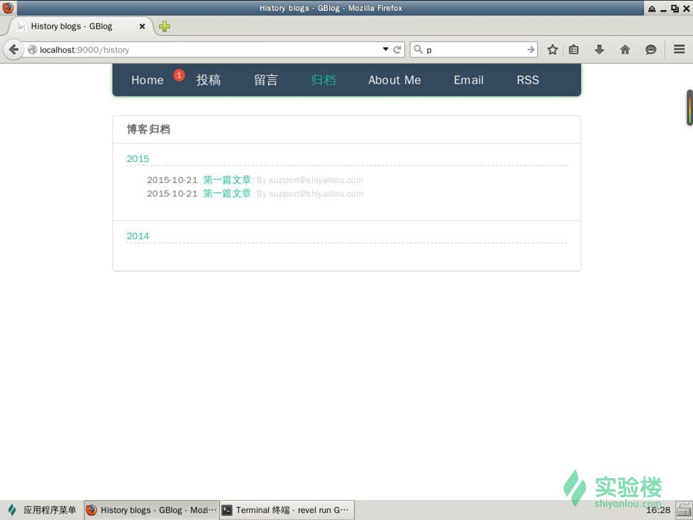
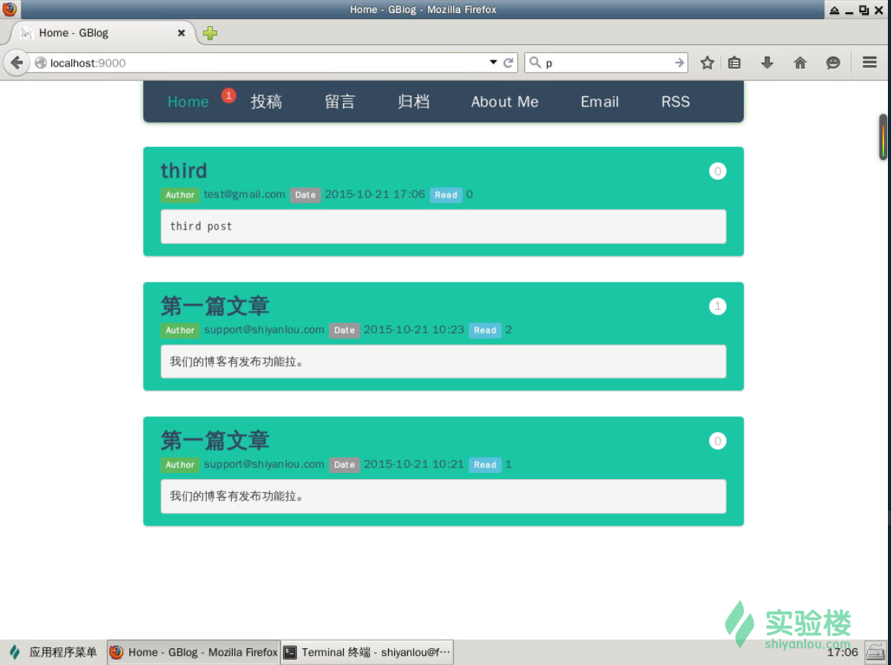
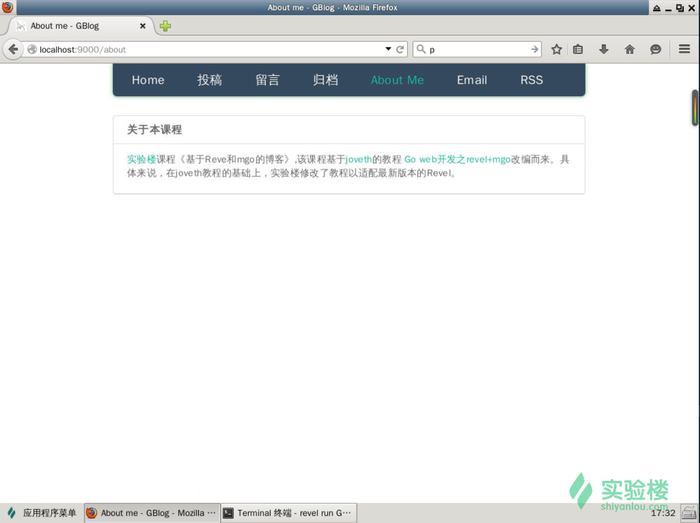

# 第 3 节 归档功能和提醒功能

## 实验说明

这一节实验中，主要讲解怎么样实现博客的评论和留言功能。

本实验属于[实验楼](https://www.shiyanlou.com)课程《基于 Reve 和 mgo 的博客》,该课程基于[joveth](http://blog.csdn.net/joveth)的教程[Go web 开发之 revel+mgo](http://blog.csdn.net/jov123/article/category/2216585)改编而来。具体来说，在[joveth](http://blog.csdn.net/joveth)教程的基础上，实验楼修改了教程以适配最新版本的`Revel`。

为了能正常开始实验，我们需要设置 `GOPATH` 环境变量以及启动 mongodb，每次开始实验前，请执行以下命令：

```go
$ cd /home/shiyanlou/revel_mgo_blog
$ export GOPATH=`pwd`
$ export PATH=$PATH:$GOPATH/bin
$ sudo mongod --fork -f /etc/mongodb.conf 
```

## 归档功能

我们实现的归档功能将按照年份来归档。

还是按照之前实现其他功能的步骤，先实现 model，然后实现 controller，接着实现页面，添加路由这样一个功能就完成啦。下面就让我们实现归档功能。

首先创建`/home/shiyanlou/revel_mgo_blog/src/GBlog/app/models/history.go`文件，输入以下内容：

```go
package models
import (
  "github.com/revel/revel"
  "gopkg.in/mgo.v2/bson"
  "time"
)
type History struct {
  Year int
  Blogs []Blog
}

// 插入归档
func (dao *Dao) InsertHistory(history *History) error {
  historyCollection := dao.session.DB(DbName).C(HistoryCollection)
  err := historyCollection.Insert(history)
  if err != nil {
    revel.WARN.Printf("Unable to save History: %v error %v", history, err)
  }
  return err
}

// 查找归档
func (dao *Dao) FindHistory() []History{
  historyCollection := dao.session.DB(DbName).C(HistoryCollection)
  his := []History{}
  query := historyCollection.Find(bson.M{}).Sort("-year")
  query.All(&his)
  return his
}

// 删除归档
func (dao *Dao) RemoveAll() error{
  historyCollection := dao.session.DB(DbName).C(HistoryCollection)
  _,err := historyCollection.RemoveAll(bson.M{})
  if err != nil {
    revel.WARN.Printf("Unable to RemoveAll: error %v",  err)
  }
  return err
}

// 创建所有归档
func (dao *Dao) CreateAllHistory() {
  dao.RemoveAll();
  var end int = time.Now().Year();
  for i:=BaseYear;i<=end;i++{
    history := new(History);
    history.Year = i;
    dao.InsertHistory(history);
  }
} 
```

然后我们实现相应的 controller，编辑`/home/shiyanlou/revel_mgo_blog/src/GBlog/app/controllers/app.go`，添加以下方法：

```go
func (c App) History() revel.Result {
  dao, err := models.NewDao()
  if err != nil {
    c.Response.Status = 500
    return c.RenderError(err)
  }
  defer dao.Close()
  dao.CreateAllHistory();
  historys := dao.FindHistory();
  for i,_ := range historys{
    historys[i].Blogs =dao.FindBlogsByYear(historys[i].Year); 
  }
  return c.Render(historys)
} 
```

可以看到我们用到了一个新方法`FindBlogsByYear`，下面我们编辑`/home/shiyanlou/revel_mgo_blog/src/GBlog/app/models/blog.go`添加该方法：

```go
func (dao *Dao) FindBlogsByYear(year int) []Blog{
  blogCollection := dao.session.DB(DbName).C(BlogCollection)
  blogs := []Blog{}
  query := blogCollection.Find(bson.M{"year":year}).Sort("-cdate")
  query.All(&blogs)
  return blogs
} 
```

然后我们添加`History.html`页面，用于显示归档。创建文件`/home/shiyanlou/revel_mgo_blog/src/GBlog/app/views/App/History.html`, 输入以下内容：

```go
 {{set . "title" "History blogs - GBlog"}}
  {{set . "history" "active" }}
  {{template "header.html" .}}
  <div class="content">
      <div class="history-nav" id="his">
         <div class="history-title">
           File
         </div>
         {{if .historys}}
         {{range $index,$history :=.historys}}
         <div class="history-cell">
            <div class="panel-heading" style="padding:0;border-bottom: 1px dashed #ccc;">
              <a data-toggle="collapse" data-toggle="collapse" data-parent="#his" href="#collapseOne{{$index}}">{{$history.Year}}</a>
            </div>
            <div id="collapseOne{{$index}}" class="panel-collapse collapse in">
              <div class="panel-body" style="padding:0 20px;">
                <ul style="padding:10px 10px;list-style:none;">
                  {{if $history.Blogs }}
                  {{range $blog :=$history.Blogs}}
                  <li><time>{{$blog.CDate.Format "2006-01-02"}}</time><a href="#">{{$blog.GetShortTitle }}</a><span class="history-auth">By {{$blog.Email}}</span></li>
                  {{end}}
                  {{end}}
                </ul>
              </div>
            </div>
         </div>
         {{end}}
         {{end}}
      </div>
  </div>
  {{template "footer.html" .}} 
```

最后，我们添加相应的路由，编辑`/home/shiyanlou/revel_mgo_blog/src/GBlog/conf/routes`文件，添加以下路由：

```go
GET     /history                                App.History 
```

到这里，整个归档功能就实现了，效果如下：



## 提醒功能

在之前的设计中，博客菜单栏最左边有红色的提醒标志，是怎么实现的呢？ 它的作用是提醒最近一小时内的更新，所以我们应该有一个可以根据时间查询博客文章的方法。编辑`/home/shiyanlou/revel_mgo_blog/src/GBlog/app/models/blog.go`文件，添加以下方法：

```go
func (dao *Dao) FindBlogsByDate(start time.Time) int{
  blogCollection := dao.session.DB(DbName).C(BlogCollection)
  query := blogCollection.Find(bson.M{"cdate":bson.M{"$gte": start}})
  cnt,err := query.Count();
  if err!=nil{
    revel.WARN.Printf("Unable to Count blog: error %v", err)
  }
  return cnt
} 
```

我们这里使用`$gte`高级查询，具体可以查看[mgo 的文档](https://godoc.org/gopkg.in/mgo.v2)。

接着我们修改`/home/shiyanlou/revel_mgo_blog/src/GBlog/app/controllers/app.go`中的`Index`方法为以下内容：

```go
func (c App) Index() revel.Result {
  dao, err := models.NewDao()
  if err != nil {
    c.Response.Status = 500
    return c.RenderError(err)
  }
  defer dao.Close()
  //dao := models.NewDao(c.MongoSession)
  blogs := dao.FindBlogs()
  now := time.Now().Add(-1 * time.Hour)
  recentCnt :=dao.FindBlogsByDate(now);
  return c.Render(blogs,recentCnt)
} 
```

以上代码相比以前增加了查询最近一小时更新文章数量的代码。我们在引用了`time`模块，所以不要忘记在`app.go`中导入`time`模块。

接着，我们在模板中显示传递的`recentCnt`参数。修改`/home/shiyanlou/revel_mgo_blog/src/GBlog/app/views/header.html`中的代码块：

```go
 <li class="{{.home}}">
                <a href="/" >Home</a>
                <span class="navbar-news " title="There is an update in the last 1 hours">1</span>
    </li> 
```

为以下内容：

```go
 <li class="{{.home}}">
            <a href="/" >Home</a>
            {{if .recentCnt}}
            {{if gt .recentCnt 0}}
            <span class="navbar-news " title="There is {{.recentCnt}} update in the last 1 hours">{{.recentCnt}}</span>
            {{end}}
            {{end}}
          </li> 
```

再次刷新页面，就可以看到效果啦，如果没有效果，点击投稿，再次发布一篇文章就可以看到效果了。



## about 页面

经过之前的学习，相信添加 about 页面的工作已经信手拈来啦。创建文件`/home/shiyanlou/revel_mgo_blog/src/GBlog/app/views/App/About.html`，输入以下内容：

```go
{{set . "title" "About me - GBlog"}}
{{set . "about" "active" }}
{{template "header.html" .}}
<div class="content">
    <div class="history-nav" id="his">
       <div class="history-title">
       About the course
       </div>
       <div class="history-cell">
        <p>
        <a href="https://www.shiyanlou.com">shiyanlou's</a>Course《Based on Revel and MgO's blog.》,The course reference：<a href="http://blog.csdn.net/joveth">joveth's</a>Article<a href="http://blog.csdn.net/jov123/article/category/2216585"> </a
        </p>
       </div>
    </div>
</div>
{{template "footer.html" .}} 
```

编辑文件`/home/shiyanlou/revel_mgo_blog/src/GBlog/app/controllers/app.go`，添加以下方法：

```go
func (c App) revel.Result {
    return c.Render()
} 
```

接着添加路由，编辑文件: ``，添加以下路由：

```go
GET    /about                                   App.About 
```

现在让我们看下效果：



到目前为止整个课程就完结了。但是我们还有一些功能没有实现，比如菜单栏中的`Email`和`RSS`功能，这些功能我们将作为练习，由你自己完成。

## 练习

*   在于[joveth](http://blog.csdn.net/joveth)原来的教程中，还有一个 email 墙功能，你能参考目前我们实现的其他功能实现它吗？ 提示：你需要实现一个`Email`model 用于存储邮箱地址，一个 controller 和相应的页面用于显示 email 地址。同时 email 地址，可以在发布文章时，评论时和留言的时候收集。