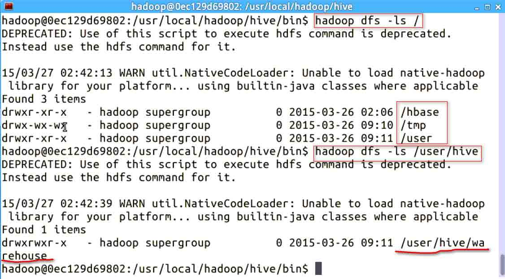
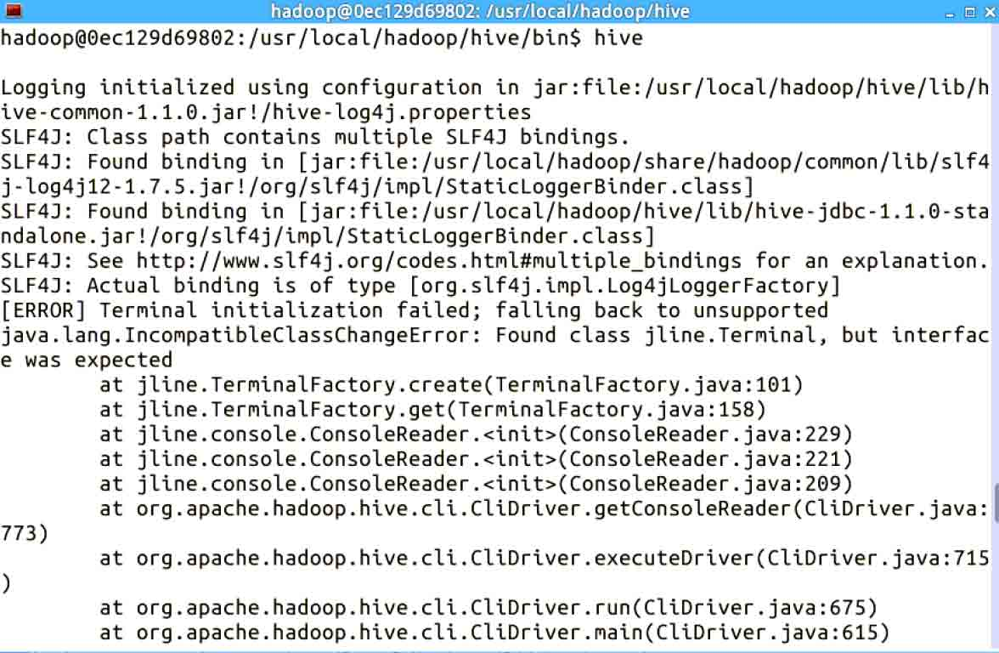
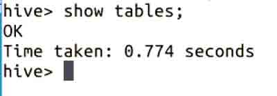

# 第 2 节 Hive 安装配置

* * *

## 实验简介

本次课程学习了如何安装配置 Hive。

* * *

## 一、实验环境说明

**1\. 环境登录**

无需密码自动登录，系统用户名 shiyanlou

**2\. 环境介绍**

本实验环境采用带桌面的 Ubuntu Linux 环境，实验中会用到桌面上的程序：

> * XfceTerminal: Linux 命令行终端，打开后会进入 Bash 环境，可以使用 Linux 命令；

*   Firefox：浏览器，可以用在需要前端界面的课程里，只需要打开环境里写的 HTML/JS 页面即可；
*   GVim：非常好用的编辑器，最简单的用法可以参考课程[Vim 编辑器](http://www.shiyanlou.com/courses/2)。
*   Eclipse：Eclipse 是著名的跨平台的自由集成开发环境（IDE）。主要用来 Java 语言开发，但是目前亦有人通过插件使其作为 C++和 Python 等语言的开发工具。

**3\. 环境使用**

使用 GVim 编辑器输入实验所需的代码，然后使用 XfceTerminal 命令行环境进行编译运行，查看运行结果，运行后可以截图并分享自己的实验成果，实验楼提供的截图是后台截图，无法作弊，可以真实有效证明您已经完成了实验。

实验报告可以在个人主页中查看，其中含有每次实验的截图及笔记，以及每次实验的有效学习时间（指的是在实验桌面内操作的时间，如果没有操作，系统会记录为发呆时间）。这些都是您学习的真实性证明。

## 二、Hive 运行模式

与 Hadoop 类似，Hive 也有 3 种运行模式：

> **1\. 内嵌模式** > 将元数据保存在本地内嵌的 Derby 数据库中，这是使用 Hive 最简单的方式。但是这种方式缺点也比较明显，因为一个内嵌的 Derby 数据库每次只能访问一个数据文件，这也就意味着它不支持多会话连接。

> **2\. 本地模式** > 这种模式是将元数据保存在本地独立的数据库中（一般是 MySQL），这用就可以支持多会话和多用户连接了。

> **3\. 远程模式** > 此模式应用于 Hive 客户端较多的情况。把 MySQL 数据库独立出来，将元数据保存在远端独立的 MySQL 服务中，避免了在每个客户端都安装 MySQL 服务从而造成冗余浪费的情况。

## 三、下载安装 Hive（该步骤已由实验楼完成）

上节课程我们已经了解到，Hive 是基于 Hadoop 文件系统之上的数据仓库。因此，安装 Hive 之前必须确保 Hadoop 已经成功安装。本次实验，使用 Hive V2.0.0 版本。Hive V2.2.0 可以在 Hadoop V2.4.x 以上环境中工作。

*   下载 apache-hive-2.0.0-bin.tar.gz 后，对其进行解压： `tar zxvf apache-hive-2.0.0-bin.tar.gz`

## 四、配置系统环境变量（该步骤已由实验楼完成）

修改 /etc/profile 文件，这个我们在 Hadoop 和 [HBase 的课程](http://www.shiyanlou.com/courses/37) 中也修改过，应该比较熟悉了。

```java
sudo vim /etc/profile
# Hive environment
    export HIVE_HOME=/opt/apache-hive-2.0.0-bin
    export PATH=$PATH:$HIVE_HOME/bin 
```

## 五、内嵌模式

**（1）hive-site.xml**

$HIVE_HOME/conf 对应的是 Hive 的配置文件路径，类似于之前学习的 HBase, 该路径下的 hive-site.xml 是 Hive 工程的配置文件。默认情况下，该文件并不存在，我们需要拷贝它的模版来实现（这里暂时不需要修改，先拷贝）：

```java
$ cp hive-default.xml.template hive-site.xml 
```

hive-site.xml 的主要配置有：


> * **hive.metastore.warehouse.dir** > 该参数指定了 Hive 的数据存储目录，默认位置在 HDFS 上面的 /user/hive/warehouse 路径下。

> * **hive.exec.scratchdir** > 该参数指定了 Hive 的数据临时文件目录，默认位置为 HDFS 上面的 /tmp/hive 路径下。

同时我们还要修改 Hive 目录下 /conf/hive-env.sh 文件（请根据自己的实际路径修改），该文件默认也不存在，同样是拷贝它的模版来修改：

```java
export HADOOP_HEAPSIZE=1024

# Set HADOOP_HOME to point to a specific hadoop install directory
HADOOP_HOME=/opt/hadoop-2.4.1

# Hive Configuration Directory can be controlled by:
export HIVE_CONF_DIR=/opt/apache-hive-2.0.0-bin/conf

# Folder containing extra ibraries required for hive compilation/execution can be controlled by:
export HIVE_AUX_JARS_PATH=/opt/apache-hive-2.0.0-bin/lib 
```

**（2）创建必要目录**

前面我们看到 hive-site.xml 文件中有两个重要的路径，切换到 hadoop 用户下查看 HDFS （需要先启动 Hadoop）是否有这些路径：

```java
$ hadoop dfs -ls / 
```


没有发现上面提到的路径，因此我们需要自己新建这些目录，并且给它们赋予用户写（W）权限。

```java
$ hadoop dfs -mkdir /user/hive/warehouse
$ hadoop dfs -mkdir /tmp/hive
$ hadoop dfs -chmod 777 /user/hive/warehouse
$ hadoop dfs -chmod 777 /tmp/hive 
```

如果你遇到 `no such file or directory` 类似的错误，就一步一步新建目录，例如：

```java
$ hadoop dfs -mkdir /tmp
$ hadoop dfs -mkdir /tmp/hive 
```

检查是否新建成功 `hadoop dfs -ls /` 以及 `hadoop dfs -ls /user/hive/` ：



**（3）修改 io.tmpdir 路径**

同时，要修改 hive-site.xml 中所有包含 `${system:java.io.tmpdir}` 字段的 value 即路径（vim 下 / 表示搜索，后面跟你的关键词，比如搜索 hello，则为 `/hello` , 再回车即可），你可以自己新建一个目录来替换它，例如 `/home/hive/iotmp` . 同样注意修改写权限。（以下是一个修改示例，其他的同理）

将

```java
<value>${system:java.io.tmpdir}/${system:user.name}</value> 
```

改成

```java
<value>/home/hive/iotmp</value> 
```

如果不修改这个目录，你很可能会出现如下错误：


**（4）运行 Hive**

前面我们已经提到过，内嵌模式使用默认配置和 Derby 数据库，所以无需其它特别修改直接运行 `hive`（确保 Hadoop 已经先启动）。完整步骤如下：

```java
su hadoop                             # 进入 hadoop 用户，密码：hadoop
ssh localhost                         # 确保 ssh 直连
start-all.sh                          # 启动 hadoop
schematool -dbType mysql -initSchema  # 初始化 hive 的元数据库
hive                                  # 启动 hive 
```

**你很可能会遇到这个错误：**



这是因为 Hive 中的 Jline jar 包和 Hadoop 中的 Jline 冲突了，在路径：$HADOOP_HOME/share/hadoop/yarn/lib/jline-0.9.94.jar 将其删除。

再次启动 `hive`，就 OK 了:


`show tables;` 注意不要漏写了 **分号**。



## 六、本地模式

现在我们替换默认的 Derby 数据库为 MySQL 数据库。

**（1）下载安装 MySQL**

```java
$ sudo apt-get install mysql-server 
```

本实验环境下默认是安装了 MySQL 的，直接启动它：

```java
$ sudo service mysql start 
```

添加 root 用户，创建 hive 数据库：


虽然 MySQL 已经默认安装，但我们还需要下载一个 MySQL 的 JDBC 驱动包。这里使用的是 `mysql-connector-java-5.1.35-bin.jar`，你需要将其复制到 $HIVE_HOME/lib 目录下面：

```java
$ wget http://labfile.oss.aliyuncs.com/mysql-connector-java-5.1.35.tar.gz

$ tar zxvf mysql-connector-java-5.1.35.tar.gz

$ cd mysql-connector-java-5.1.35

$ mv mysql-connector-java-5.1.35-bin.jar /usr/local/hadoop/hive/lib/ 
```

**（2）修改 hive-site.xml 配置文件**

最后，依然是修改 $HIVE_HOME/conf 下的 hive-site.xml 文件，把默认的 Derby 修改为 MySQL :

```java
<property>
    <name>javax.jdo.option.ConnectionURL</name>
    //所连接的 MySQL 数据库实例
    <value>jdbc:mysql://localhost:3306/hive?createDatabaseIfNotExist=true</value>
</property>

<property>
    <name>javax.jdo.option.ConnectionDriverName</name>
    //连接的 MySQL 数据库驱动
    <value>com.mysql.jdbc.Driver</value>
</property>

<property>
    <name>javax.jdo.option.ConnectionUserName</name>
    //连接的 MySQL 数据库用户名
    <value>hive</value>
</property>

<property>
    <name>javax.jdo.option.ConnectionPassword</name>
    //连接的 MySQL 数据库密码
    <value>hive</value>
</property> 
```

**（3）启动 Hive**

启动 Hive 的方式同内嵌模式一样：


## 作业

有条件的同学，可以自行尝试安装配置远程模式下的 Hive。

## 参考文档

> * 《Hadoop 实战 第 2 版》陆嘉恒，机械工业出版社；

*   [【Hive 一】Hive 入门](http://bit1129.iteye.com/blog/2169918)；
*   [Hive 安装配置](http://hatech.blog.51cto.com/8360868/1427748)；