# 第 5 节 Hive 接口介绍（Web UI/JDBC）

* * *

## 实验简介

本次实验学习 Hive 的两种接口：Web UI 以及 JDBC。

* * *

## 一、实验环境说明

**1\. 环境登录**

无需密码自动登录，系统用户名 shiyanlou

**2\. 环境介绍**

本实验环境采用带桌面的 Ubuntu Linux 环境，实验中会用到桌面上的程序：

> * XfceTerminal: Linux 命令行终端，打开后会进入 Bash 环境，可以使用 Linux 命令；

*   Firefox：浏览器，可以用在需要前端界面的课程里，只需要打开环境里写的 HTML/JS 页面即可；
*   GVim：非常好用的编辑器，最简单的用法可以参考课程[Vim 编辑器](http://www.shiyanlou.com/courses/2)。
*   Eclipse：Eclipse 是著名的跨平台的自由集成开发环境（IDE）。主要用来 Java 语言开发，但是目前亦有人通过插件使其作为 C++和 Python 等语言的开发工具。

**3\. 环境使用**

使用 GVim 编辑器输入实验所需的代码，然后使用 XfceTerminal 命令行环境进行编译运行，查看运行结果，运行后可以截图并分享自己的实验成果，实验楼提供的截图是后台截图，无法作弊，可以真实有效证明您已经完成了实验。

实验报告可以在个人主页中查看，其中含有每次实验的截图及笔记，以及每次实验的有效学习时间（指的是在实验桌面内操作的时间，如果没有操作，系统会记录为发呆时间）。这些都是您学习的真实性证明。

**4\. 其他**

之前的实验中，我们使用的是 Hadoop V2.4.1 版本。 我们在测试的时候，发现 Hive V1.1.0 在进行 Session 查询的时候需要 Hadoop V2.6 以上版本，因此本次实验的 Hadoop 版本基于 V2.6.0 版本。由于已经修改 Hadoop 目录、Hive 目录为普通权限，如果提示 hadoop 或 hive 为无效命令，请 `source /etc/profile` 来使配置文件生效。

Hadoop 目录为 ： `/usr/local/hadoop-2.6.0` Hive 目录为： `/usr/local/hive-1.1.0`

## 二、Hive 网络接口（Web UI）

**（1）Web UI 简介**

Hive Web UI 提供了图像化的操作界面，通过 Hive Web UI 接口可以更方便、更直观地操作，特别是对刚刚接触 Hive 的用户来说。Hive Web UI 具有一下特性：

>**分离查询的执行**

>在命令行（CLI）下，要执行多个查询就得打开多个终端，而通过 Web UI，就可以同时执行多个查询，还可以在网络服务器上管理会话 Session。

>**不依赖本地 Hive**

>用户需要安装本地 Hive，就可以通过网络浏览器访问 Hive 并进行相关操作。如果想通过 Web 与 Hadoop 以及 Hive 交互，那么需要访问多个端口。

**（2）配置 hive-site.xml**

修改 `$HIVE_HOME/conf` 目录下的 hive-site.xml 文件。

我们可以看一下默认配置是什么：

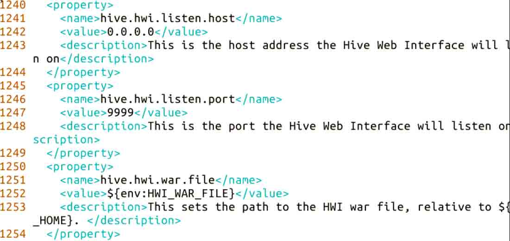

我们只需要修改 `hive.hwi.war.file`，你应该先在 `$HIVE_HOME/lib` 目录下检查一下 hwi 的版本：

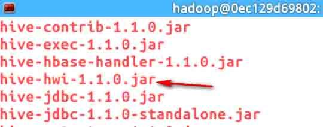

结果令人吃惊的是，居然没有那个 `war` 文件！ 只有一个同名的 jar 包，没有 war 文件。解决办法是自行下载对应 Hive 的源码包再打包成 war 文件。

下载 Hive 源码（注意这里是 src 包，不是 bin 包。上次我们使用的是 1.1.0 版本）

```java
$ wget http://labfile.oss.aliyuncs.com/apache-hive-1.1.0-src.tar.gz 
```

解压：

```java
$ tar zxvf apache-hive-1.1.0.src.tar.gz 
```

再进入 hwi 目录，打包 war 文件（注意命令末尾有一个点 `.`）：

```java
$ cd apache-hive-1.1.0-src/hwi
$ jar cvfM0 hive-hwi-1.1.0.war -C web/ . 
```

打包完成后，有了我们需要的 war 文件，再复制到 $HIVE_HOME/lib 目录下：

```java
$ cp hive-hwi-1.1.0.war /usr/local/hive-1.1.0/lib 
```

另外我们还需要拷贝一个 Java 的 tools.jar 到 $HIVE_HOME/lib 目录下：

```java
$ cp /usr/local/jdk1.7.0_67/lib/tools.jar /usr/local/hive-1.1.0/lib 
```

否则会出现类似于下面的错误（因为 JAVA_HOME 指到 `$JAVA_HOME/jre` 下了，而其 lib 下的 tools.jar 跟 `$JAVA_HOME/lib/tools.jar` 不一样，编译的时候需要用到后者）：

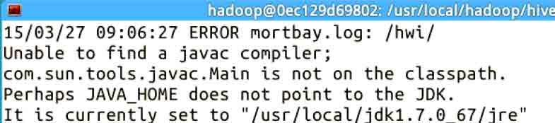

最后，我们将 hive-site.xml 文件修改为：

```java
<property>
    <name>hive.hwi.war.file</name>
    <value>/lib/hive-hwi-1.1.0.war</value>
    <description>This sets the path to the HWI war file, relative to ${HIVE_HOME}. </description>
</property> 
```

**（3）启动 hwi**

在 $HIVE_HOME/bin 目录下，启动 hwi（由于我们之前已经修改了 Derby 为 MySQL 数据库，所以在启动 hwi 之前，**请确保 MySQL 和 Hadoop 已经成功启动**）：

```java
$ hive --service hwi 
```

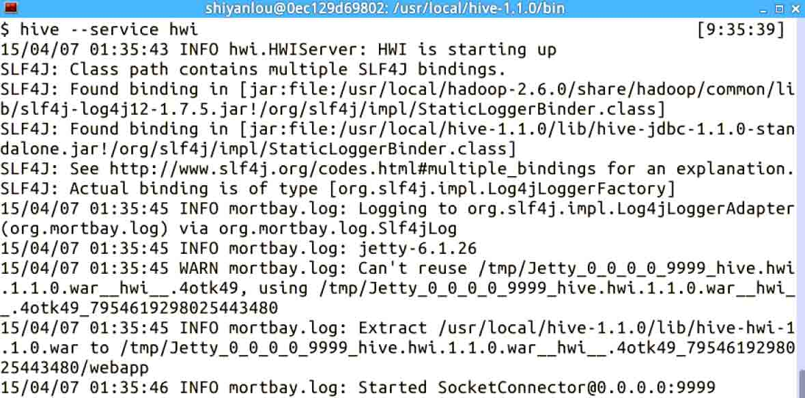

现在，我们可以在浏览器中打开网络接口的地址：`localhost:9999/hwi`, 启动成功：

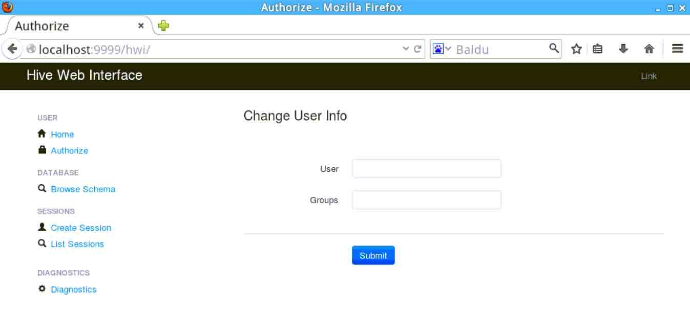

**（4）Web UI 操作实例**

**数据库及表信息查询**

在查询之前，我们先新建一个 person 表 以方便后续的查询操作。启动 Hive 后，输入如下命令（这个 table 只是一个示例，你可以根据需要自己创建其他的）：

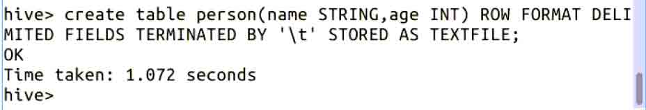

新建一个 txt 文件（路径自定义，比如我是 /home/hadoop/hive/person.txt），写一些示例数据，数据之间是以 `\t` 划分的；实验中已经写好，直接导入即可：

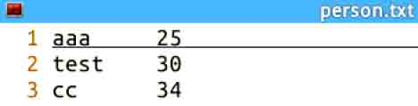

再把数据导入到 person 表 中：

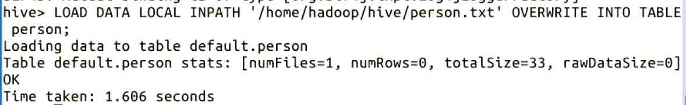

单击 `Browse Schema` 可以查看当前 Hive 中的数据库，显示的是当前可以是使用的数据库信息，只包含一个默认数据库（default）：


再单击 default 就可以看到 default 数据库中包含的所有表的信息了（这里有我们刚刚新建的 table : person 表）：

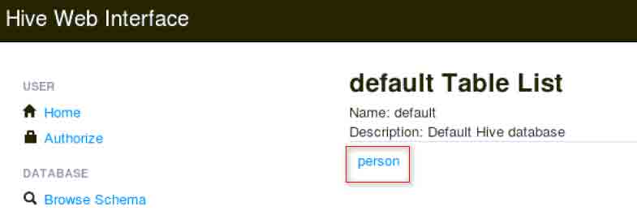

点击 person 表即可看到具体信息。

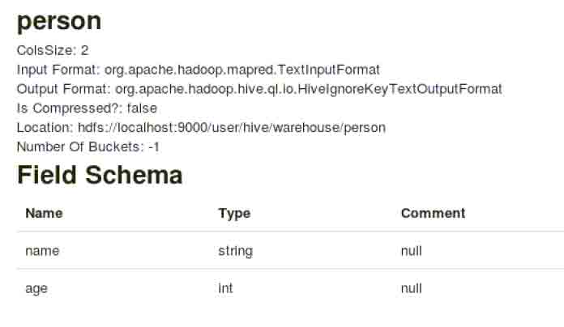

**Hive Session 查询**

在进行查询之前我们需要新建一个 Session（注意每次重启 hwi 后，之前的 Session 将会失效）。点击 Create Session 来新建：

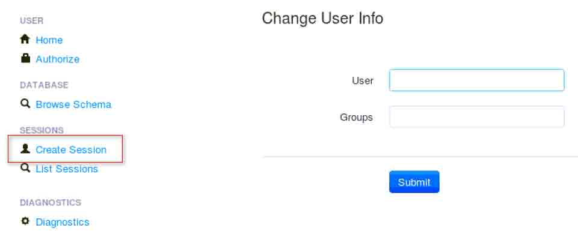

填入以下信息，打框的必填：

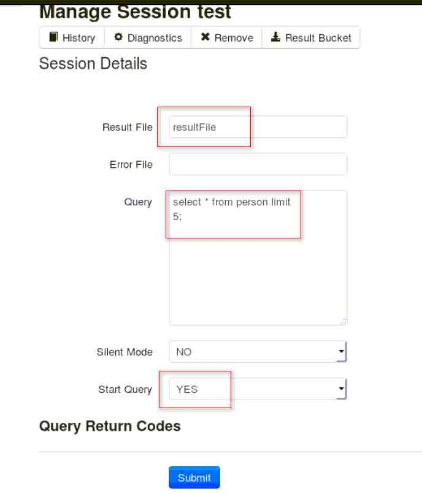

> 其中： > **Result File** 为最后的查询结果文件； > > **Query** 为你的查询语句； > > **Start Query** 设为 YES，表示开始查询；

点击 Submit 提交后，即可看到 View File：


点击 View File 即可看到最后的查询结果：

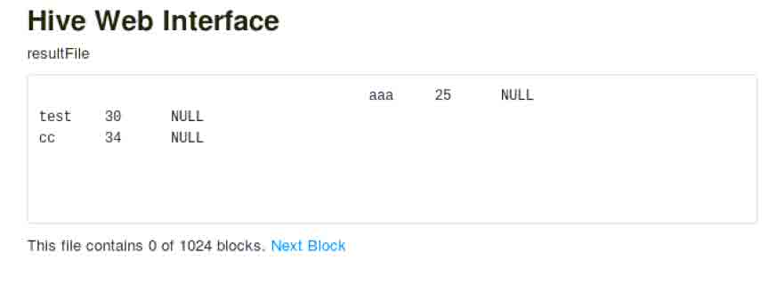

通过以上的学习，我们可以了解到 Web UI 虽然提供了可视化的查询操作，但最大的缺点就是用户不能实时了解查询的状态，交互能力较差。

## 三、**JDBC**

在 Eclipse 中新建一个 Java 工程，例如 HiveJdbc. 然后添加所需要的 jar 包，右击工程，依次选择 Properties -> Java Build Path -> Libraries -> Add External Jars 来添加。所需 jar 包如下（如不清楚你可以直接添加所有的 jar 包；遇到没有权限添加的，请拷贝 jar 包到其他有权限的目录再添加，实验中已经拷贝到 `/home/hadoop/hive`）：

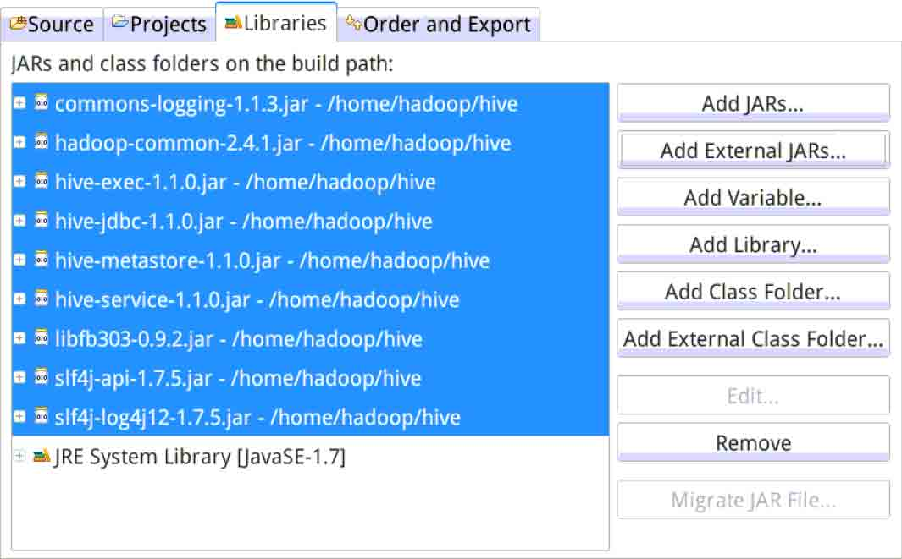

新建包和类，添加如下代码：

```java
import java.sql.SQLException;
import java.sql.Connection;
import java.sql.ResultSet;
import java.sql.Statement;
import java.sql.DriverManager;

public class HiveJdbc {

    private static String driverName = 
                   "org.apache.hive.jdbc.HiveDriver";

    public static void main(String[] args) 
                            throws SQLException {
        try {
            Class.forName(driverName);
        } catch (ClassNotFoundException e) {
            e.printStackTrace();
            System.exit(1);
        }

        Connection con = DriverManager.getConnection(
"jdbc:hive2://localhost:10000/default", "", "");
        Statement stmt = con.createStatement();
        String tableName = "hive_jdbc";
        stmt.execute("drop table if exists " + tableName);
        stmt.execute("create table " + tableName + 
                                     " (key int, value string)");
        System.out.println("Create table success!");
        // show tables
        String sql = "show tables '" + tableName + "'";
        System.out.println("Running: " + sql);
        ResultSet res = stmt.executeQuery(sql);
        if (res.next()) {
            System.out.println(res.getString(1));
        }

        // describe table
        sql = "describe " + tableName;
        System.out.println("Running: " + sql);
        res = stmt.executeQuery(sql);
        while (res.next()) {
            System.out.println(res.getString(1) + "\t" + res.getString(2));
        }

        sql = "select * from " + tableName;
        res = stmt.executeQuery(sql);
        while (res.next()) {
            System.out.println(String.valueOf(res.getInt(1)) + "\t"
                                               + res.getString(2));
        }

        sql = "select count(1) from " + tableName;
        System.out.println("Running: " + sql);
        res = stmt.executeQuery(sql);
        while (res.next()) {
            System.out.println(res.getString(1));
        }
    }
} 
```

> 从上述代码可以看出，在进行查询之前需要做的工作有： > > * 通过 Class.ForName("org.apache.hive.jdbc.HiveDriver"); 来注册 Hive 驱动； > > * 通过 Connection con = DriverManager.getConnection( "jdbc:hive2://localhost:10000/default", "", ""); 来与 Hive 数据库建立连接；

运行之前需要启动 hiveserver，但目前 Hive 摒弃了 hiveserver 转而改用了 hiveserver2，反映在代码中有两点不同。一是，driverName 由 `org.apache.hadoop.hive.jdbc.HiveDriver` 改成了 `org.apache.hive.jdbc.HiveDriver` ；二是，Connection 由 `jdbc:hive://localhost:10000/default` 改成了 `jdbc:hive2://localhost:10000/default`。

因此，在运行程序前启动 hiveserver 也改成了启动 hiveserver2，在 $HIVE_HOME/bin 目录下来启动。

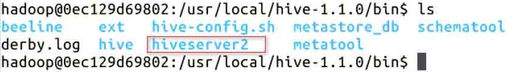

最后程序运行结果如下：

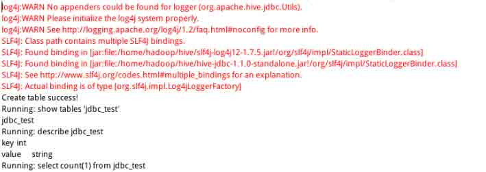

## 作业

Web UI 和 JDBC 两种接口有什么异同？

## 参考文档

> * 《Hadoop 实战 第 2 版》陆嘉恒，机械工业出版社；

*   [Hive Web 接口 HWI 的操作及使用](http://www.ithao123.cn/content-648234.html)；
*   [hive jdbc 调用](http://www.bubuko.com/infodetail-641646.html)；