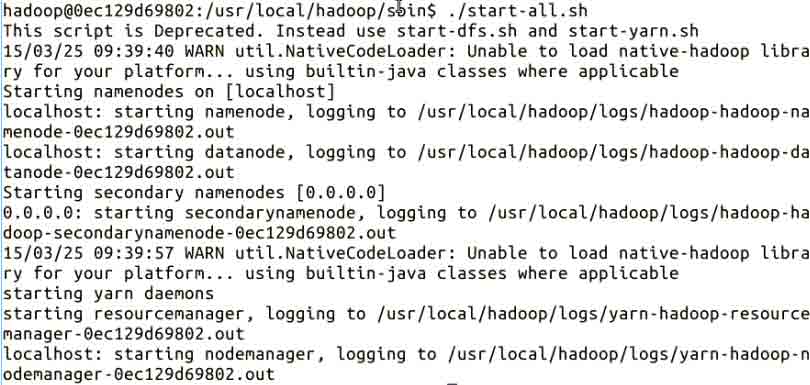
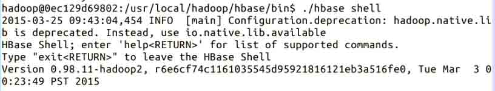

# 第 2 节 HBase 的安装与配置

## 实验简介

本次实验学习和了解 HBase 在不同模式下的配置和安装，以及 HBase 后续的启动和停止等。

## 一、实验环境说明

**1\. 环境登录**

无需密码自动登录，系统用户名 shiyanlou

**2\. 环境介绍**

本实验环境采用带桌面的 Ubuntu Linux 环境，实验中会用到桌面上的程序：

> * XfceTerminal: Linux 命令行终端，打开后会进入 Bash 环境，可以使用 Linux 命令；

*   Firefox：浏览器，可以用在需要前端界面的课程里，只需要打开环境里写的 HTML/JS 页面即可；
*   GVim：非常好用的编辑器，最简单的用法可以参考课程[Vim 编辑器](http://www.shiyanlou.com/courses/2)。

**3\. 环境使用**

使用 GVim 编辑器输入实验所需的代码，然后使用 XfceTerminal 命令行环境进行编译运行，查看运行结果，运行后可以截图并分享自己的实验成果，实验楼提供的截图是后台截图，无法作弊，可以真实有效证明您已经完成了实验。

实验报告可以在个人主页中查看，其中含有每次实验的截图及笔记，以及每次实验的有效学习时间（指的是在实验桌面内操作的时间，如果没有操作，系统会记录为发呆时间）。这些都是您学习的真实性证明。

* * *

## 二、安装之前 - 检查必要条件

**(1) Java （需要安装 1.6.x 及其以上版本)**

在终端输入 `java -version` 来查看你机子上的 Java 版本；


**(2) Hadoop**

Hadoop 的具体安装可以参见我们以前的课程：[Hadoop 部署及管理](http://www.shiyanlou.com/courses/35)。需要注意的是伪分布模式下，HBase 的版本需要和 Hadoop 版本 `匹配` ，不然很可能容易出错。你可以在 HBase 的 lib 目录下看到对应的 Hadoop 的 Jar 文件版本。

在这里，我们使用了 Hadoop V2.4.1 版本以及 HBase V0.98.11 版本。

**(3) SSH**

SSH 的安装，在[Hadoop 部署及管理](http://www.shiyanlou.com/courses/35)中也涵盖了这部分内容。SSH 用来管理远程 Hadoop 和 HBase 守护进程。

**本实验环境下，为了大家的方便，我们已经为大家准备好了这些必要条件，你只需要专注于 HBase 的安装配置即可。**

* * *

## 三、安装进行时 - 安装和配置**HBase**

确认上面的条件我们都准备好了之后，就可以开始安装 HBase 了。实验开始前，你应该切换到 hadoop 用户：

```java
$ su hadoop 
```

HBase 的安装通常分为 3 种模式：

**1\. 单机模式 安装**

**（1）下载和解压**

单机模式的安装非常简单，几乎不用对安装文件做什么修改就可以使用。单机模式下，HBase 并不使用 HDFS，因此将安装文件解压后就几乎可以直接运行。输入命令下载 HBase：

```java
$ wget http://labfile.oss.aliyuncs.com/hbase-0.98.11-hadoop2-bin.tar.gz 
```

再将其压缩包解压：

```java
$ tar zxvf hbase-0.98.11-hadoop2-bin.tar.gz 
```

由于解压出来的文件名可能很长，建议修改为较短文件名，例如：

```java
$ mv hbase-0.98.11-hadoop2 hbase 
```

**（2）配置 hbase-site.xml**

在运行之前，我们需要对 HBase 进行相关配置。建议大家修改 ${HBase-Dir}/conf/hbase-site.xml 文件，因为即使你修改了 hbase-default.xml 文件，也会被 hbase-site.xml 中的配置所覆盖。也就是说，最终是以 hbase-site.xml 中的配置为准的。我们做如下修改：

```java
<configuration>
    <property>
        <name>hbase.rootdir</name>
        <value>file:///tmp/hbase-${user.name}/hbase</value>
    </property>
</configuration> 
```

*注意：修改 `${user.name}`为你自己的 hadoop 用户名*

**2\. 伪分布模式 安装**

伪分布模式是一个运行在单台机器上的分布式模式。此模式下，HBase 所有的守护进程将运行在同一个节点之上，而且需要依赖 HDFS，因此在此之前必须保证 HDFS 已经成功运行，请参考我们前面的课程：[Hadoop 伪分布模式配置部署](http://www.shiyanlou.com/courses/35)。确认无误后，我们就可以开始配置 HBase 的参数了。

**（1）配置 hbase-site.xml 文件**

```java
<configuration>
    <property>
        <name>hbase.rootdir</name>
        <value>hdfs://localhost:9000/hbase</value>
    </property>
    <property>
        <name>hbase.cluster.distributed</name>
        <value>true</value>
    </property>
</configuration> 
```

> **hbase.rootdir**：该参数制定了 HReion 服务器的位置，即数据存放的位置。主要端口号要和 Hadoop 相应配置一致。 > **hbase.cluster.distributed**：HBase 的运行模式。false 是单机模式，true 是分布式模式。若为 false, HBase 和 Zookeeper 会运行在同一个 JVM 里面。默认为 false.

**（2）设置环境变量**

另外，我们需要设置一些环境变量。修改 HBase 下的 conf 目录中的 hbase-env.sh 文件（你的 jdk 路径可能不一样）：

```java
export JAVA_HOME=/usr/local/jdk1.7.0_67
export HBASE_MANAGES_ZK=true 
```

```java
此配置信息，表示设置由 hbase 自己管理 zookeeper，不需要单独的 zookeeper, 本文搭建的 Hbase  用的是自带的 zookeeper，故设置为 true.

最后修改添加 PATH, 则输入： 
```

$ sudo vim /etc/profile

```java
来修改 /etc/profile 文件： 
```

## set hbase path

export PATH=$PATH:/usr/local/hadoop/hbase/bin ```

**3\. 完全分布模式 安装**

由于完全分布模式需要多台机器，在这里我们就不给出演示了。

* * *

## 四、安装之后 - 运行和停止 **HBase**

正如上面我们提到的，HBase 安装分为 3 个模式，因此 HBase 的运行自然也分为同样的 3 个模式。

**1\. 单机模式 运行**

**（1）启动**

单机模式下不需要 HDFS，因此不需要事先启动 Hadoop，直接启动 HBase 即可。终端下输入命令：`./start-hbase.sh`


*注意：**路径要正确**，应为：$HBASE_HOME/bin 目录，否则会找不到 start-hbase.sh 这个文件，就会出现错误*

**（2）查看进程**

我们可以通过 `jps` 来查看当前 HBase 的进程：


**（3）停止 HBase 服务**

输入 `./stop-hbase.sh`


**2\. 伪分布模式 运行**

**（1）启动和查看进程**

前面我们提到过，伪分布模式下，必须先确保 HDFS 已经启动。因此，我们先启动 HDFS，输入命令： `./start-all.sh`



使用 `jps` 查看目前 Hadoop 的进程：


HDFS 成功启动之后，我们再启动 HBase，这里和单机模式下启动 HBase 的方法一样，输入命令： `./start-hbase.sh`：


此时再使用 `jps`查看，可以看到多了 HBase 的相关进程：


**（2）进入 HBase Shell**

通过 HBase Shell 用户可以方便地创建、删除以及修改表，还可以向表中添加数据、列出表中的相关相信等。



输入 `help` 来查看其所支持的命令，可以根据自己的需要选择。


**（3）停止 HBase**

根据依赖关系，我们需要先关闭 HBase, `./stop-hbase.sh`：


通过 `jps` 可以看到，HBase 相关的进程没有了：


再关闭 HDFS, `./stop-all.sh`.


最后，再通过 `jps` 发现 HDFS 的进程也没有了：


**3\. 完全分布模式 运行**

*略。*

* * *

## 作业

有条件的同学，可以尝试 HBase 的完全分布模式下的配置与安装。

* * *

## 参考文档

> * 《Hadoop 实战 第 2 版》陆嘉恒，机械工业出版社； > * [Hadoop2.6.0 伪分布环境搭建](http://blog.csdn.net/baolibin528/article/details/42939477) > * [Hadoop-2.6.0 伪分布--安装配置 hbase](http://blog.csdn.net/baolibin528/article/details/43174179)