# 第 4 节 HBase 应用程序开发

* * *

## 实验简介

本次实验学习和了解如何在 Eclipse 下使用 HBase API 进行一些 Java 应用程序开发。

* * *

## 一、实验环境说明

**1\. 环境登录**

无需密码自动登录，系统用户名 shiyanlou

**2\. 环境介绍**

本实验环境采用带桌面的 Ubuntu Linux 环境，实验中会用到桌面上的程序：

> * XfceTerminal: Linux 命令行终端，打开后会进入 Bash 环境，可以使用 Linux 命令；

*   Firefox：浏览器，可以用在需要前端界面的课程里，只需要打开环境里写的 HTML/JS 页面即可；
*   GVim：非常好用的编辑器，最简单的用法可以参考课程[Vim 编辑器](http://www.shiyanlou.com/courses/2)。
*   eclipse：eclipse 是著名的跨平台的自由集成开发环境（IDE）。主要用来 Java 语言开发，但是目前亦有人通过插件使其作为 C++和 Python 等语言的开发工具。

**3\. 环境使用**

使用 GVim 编辑器输入实验所需的代码，然后使用 XfceTerminal 命令行环境进行编译运行，查看运行结果，运行后可以截图并分享自己的实验成果，实验楼提供的截图是后台截图，无法作弊，可以真实有效证明您已经完成了实验。

实验报告可以在个人主页中查看，其中含有每次实验的截图及笔记，以及每次实验的有效学习时间（指的是在实验桌面内操作的时间，如果没有操作，系统会记录为发呆时间）。这些都是您学习的真实性证明。

* * *

## 二、配置 Eclipse

上次实验，我们学习了 HBase 的安装和配置。有了对 HBase 一定的了解后，我们趁热打铁，开始学习 HBase 应用程序开发。因为我们在开发过程中需要用到 Eclipse, 所以需要先对 Eclipse 进行配置。

**（1） 新建工程**

我们在 Eclipse 中新建一个 Java Project, 选择 File->New->Java Project

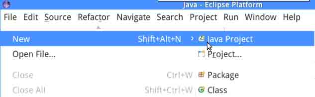

**（2）指定 HBase 配置文件的位置**

当第三方程序访问 HBase 的时候，首选需要访问 Zookeeper. Zookeeper 是一个为分布式应用所设计的开源协调服务，默认情况下 HBase 自身有一组默认的 Zookeeper 实例，当然用户也可以配置其他独立的 Zookeeper. 因为 HBase 的重要信息保存在 Zookeeper 之中。而 Zookeeper 的集群的信息由 `${HBASE_DIR}/conf/hbase-site.xml` 文件指定，因此需要通过 CLASSPATH 来指定 HBase 配置文件（即 ${HBASE_DIR}/conf/）的位置。

在你的工程目录下新建一个名为 conf 的文件夹，将 Hbase 的配置文件 hbase-site.xml 复制到该目录。

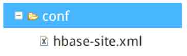

然后右击项目工程，选择 Properties->Java Build Path->Libraries->Add Class Folder, 将刚刚增加的 conf 目录选上。

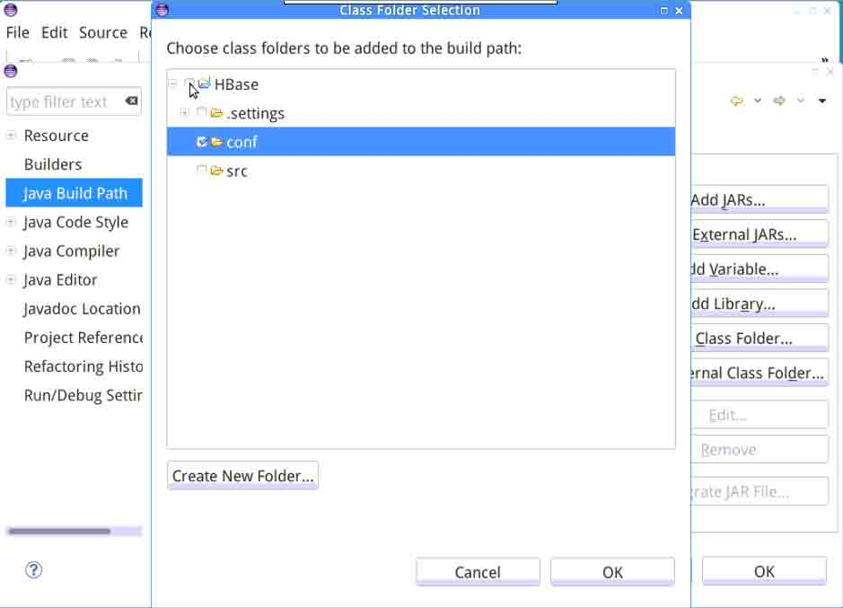

**（3）添加 jar 包**

右击项目工程，选择 Properties->Java Build Path->Libraries->Add External JARs, 选择添加所需的 jar 包（ jar 包的位置在 ${HBASE_DIR}/lib/ 中）。**为了避免不同版本等可能引发的问题，我们建议你在实验过程中，直接添加 lib 目录下的全部 jar 包即可。**

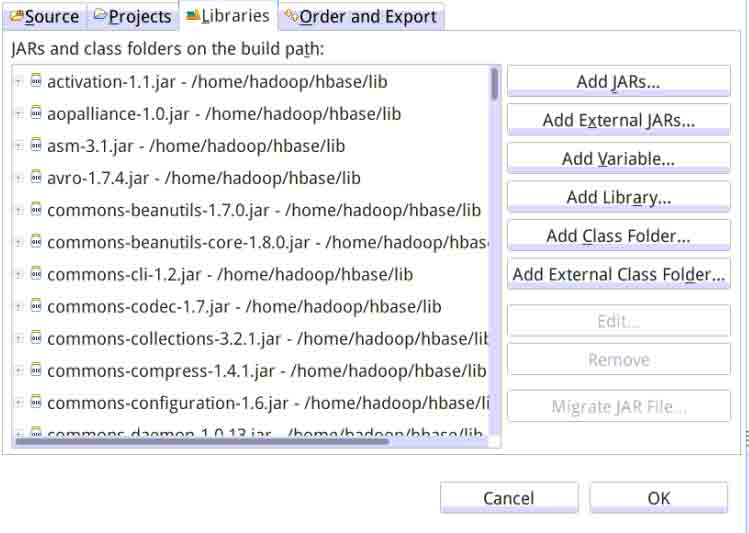

***注意：如果你不能或没有权限添加 conf 文件夹和 jar 包，请先将其复制到一个用户目录，再进行添加。***

## 三、在 Eclipse 中编写测试代码

按照你的命名习惯，新建一个 Test 类，

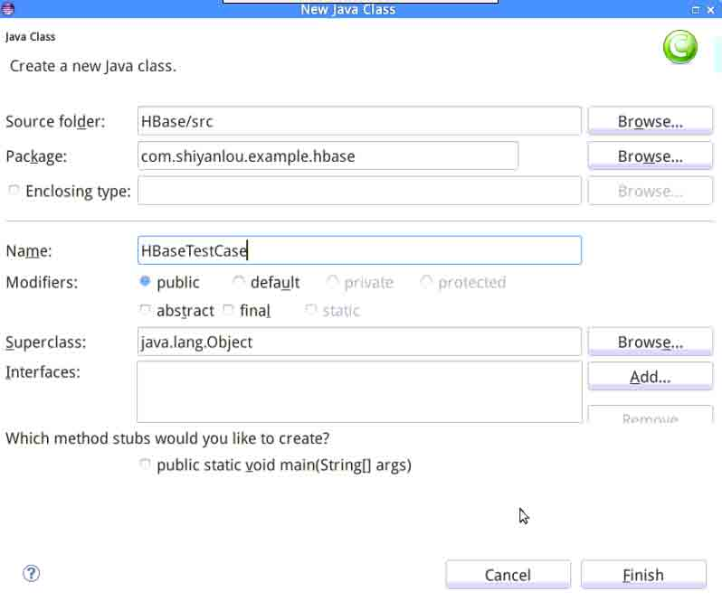

添加如下代码:

```java
import java.io.IOException;

import org.apache.hadoop.conf.Configuration;
import org.apache.hadoop.hbase.HBaseConfiguration;
import org.apache.hadoop.hbase.HColumnDescriptor;
import org.apache.hadoop.hbase.HTableDescriptor;
import org.apache.hadoop.hbase.client.Get;
import org.apache.hadoop.hbase.client.HBaseAdmin;
import org.apache.hadoop.hbase.client.HTable;
import org.apache.hadoop.hbase.client.Put;
import org.apache.hadoop.hbase.client.Result;
import org.apache.hadoop.hbase.client.ResultScanner;
import org.apache.hadoop.hbase.client.Scan;
import org.apache.hadoop.hbase.util.Bytes;

public class HBaseTestCase {       
    //声明静态配置 HBaseConfiguration
    static Configuration cfg=HBaseConfiguration.create();

    //创建一张表，通过 HBaseAdmin HTableDescriptor 来创建
    public static void creat(String tablename,String columnFamily) throws Exception {
        HBaseAdmin admin = new HBaseAdmin(cfg);
        if (admin.tableExists(tablename)) {
            System.out.println("table Exists!");
            System.exit(0);
        }
        else{
            HTableDescriptor tableDesc = new HTableDescriptor(tablename);
            tableDesc.addFamily(new HColumnDescriptor(columnFamily));
            admin.createTable(tableDesc);
            System.out.println("create table success!");
        }
    }

    //添加一条数据，通过 HTable Put 为已经存在的表来添加数据
    public static void put(String tablename,String row, String columnFamily,String column,String data) throws Exception {
        HTable table = new HTable(cfg, tablename);
        Put p1=new Put(Bytes.toBytes(row));
        p1.add(Bytes.toBytes(columnFamily), Bytes.toBytes(column), Bytes.toBytes(data));
        table.put(p1);
        System.out.println("put '"+row+"','"+columnFamily+":"+column+"','"+data+"'");
    }

   public static void get(String tablename,String row) throws IOException{
        HTable table=new HTable(cfg,tablename);
        Get g=new Get(Bytes.toBytes(row));
        Result result=table.get(g);
        System.out.println("Get: "+result);
    }
    //显示所有数据，通过 HTable Scan 来获取已有表的信息
    public static void scan(String tablename) throws Exception{
         HTable table = new HTable(cfg, tablename);
         Scan s = new Scan();
         ResultScanner rs = table.getScanner(s);
         for(Result r:rs){
             System.out.println("Scan: "+r);
         }
    }

    public static boolean delete(String tablename) throws IOException{

        HBaseAdmin admin=new HBaseAdmin(cfg);
        if(admin.tableExists(tablename)){
            try
            {
                admin.disableTable(tablename);
                admin.deleteTable(tablename);
            }catch(Exception ex){
                ex.printStackTrace();
                return false;
            }

        }
        return true;
    }

    public static void  main (String [] agrs) {
        String tablename="hbase_tb";
    String columnFamily="cf";

        try {           
            HBaseTestCase.creat(tablename, columnFamily);
            HBaseTestCase.put(tablename, "row1", columnFamily, "cl1", "data");
            HBaseTestCase.get(tablename, "row1");
            HBaseTestCase.scan(tablename);
 /*           if(true==HBaseTestCase.delete(tablename))
                System.out.println("Delete table:"+tablename+"success!");
 */      
        }
        catch (Exception e) {
            e.printStackTrace();
        }    
}
} 
```

我们在该类中，实现了类似 HBase Shell 的表 create, Put, Get, Scan 以及 delete 等操作。

简单分析一下，在上面的代码中，我们通过第 3 行加载 HBase 默认配置 cfg; 然后，通过 HbaseAdmin 接口来管理现有数据库，见第 7 行。第 8 行 ~ 第 18 行通过 HTableDescriptor（指定表相关信息） 和 HColumnDescriptor（指定表内列族相关信息）来创建一个 HBase 数据库，并设置其拥有的列族成员；put 函数通过 HTable 和 Put 类为该表添加值，见第 21 行 ~ 第 27 行；get 函数通过 HTable 和 Get 读取刚刚添加的值，见第 29 行 ~ 第 34 行；Scan 函数通过 HTable 和 Scan 类读取表中的所有记录，见第 36 行 ~ 第 43 行；delete 函数，通过 HBaseAdmin 首先将表置为无效（第 51 行），然后将其删除（第 52 行）。

## 四、启动 Hadoop 和 HBase 集群

在开始运行程序之前，我们必须先启动 Hadoop 或 HBase 集群，我们在上节实验中已经详细介绍了，你可以点击[HBase 安装配置](http://www.shiyanlou.com/courses/37)回顾一下。

如果你是 **伪分布模式** 部署的，请在相关目录下依次输入命令 `./start-all.sh` 和 `./start-hbase.sh` 来启动。而如果是 **单机模式**，只需在 HBase 的正确路径下输入 `./start-hbase.sh` 来启动。本次实验以 *伪分布模式* 示例。

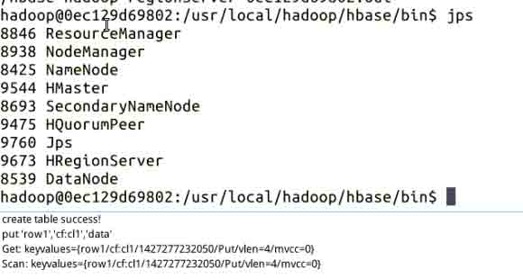

* * *

## 五、运行 Java 程序

运行程序非常简单，右击项目工程，Run As -> Java Application 就 OK 了。然后你可以在 Console（控制台）看到程序运行的情况：

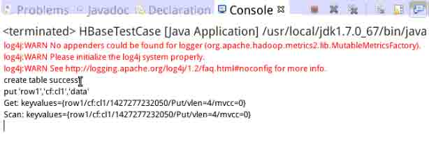

如果你没有在 Eclipse 中看到 Console 窗口，请依次选择 Window->Show View->Other->General->Console.

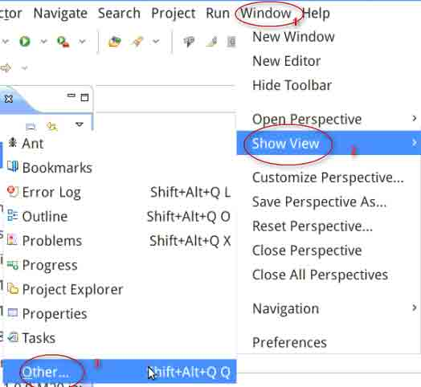

然后：

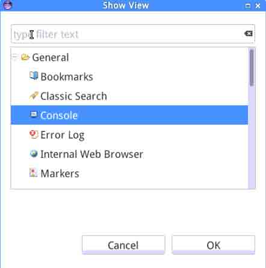

## 六、使用 HBase Shell 对比查看

Java 程序成功运行之后，由于此程序是一个模拟数据库相关操作的，因此我们可以通过 HBase Shell 来对比查看该 Java 程序的运行结果。

输入 `./hbase shell` 进入来 HBase Shell

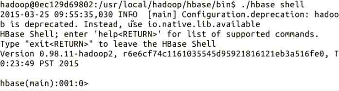

输入 `list` 查看表的列项，可以看到已经成功创建了名为 'hbase_tb' 的一张表：

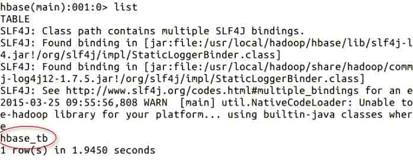

再输入 `scan 'hbase_tb'` 来查看表的内容：

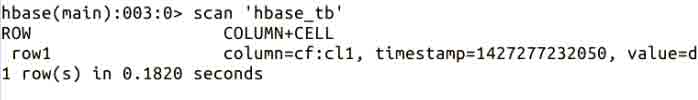

对比 Eclipse 中 Console 中打印的结果，可以发现二者是一致的。

* * *

## 作业

大家可以思考一下，如何把 HBase 和 MapReduce 结合起来开发编程，从而完成我们之前那个 WordCount 的例子。

* * *

## 参考文档

> * 《Hadoop 实战第 2 版》 陆嘉恒，机械工业出版社； > * [使用 Eclipse 开发 HBase 应用程序](http://mmicky.blog.163.com/blog/static/1502901542013101911950800/)