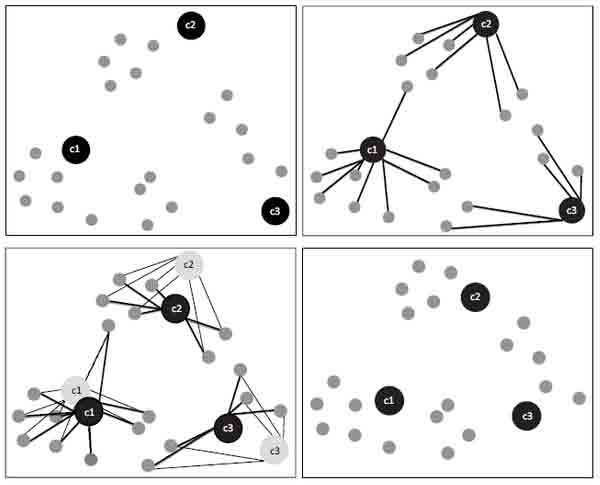
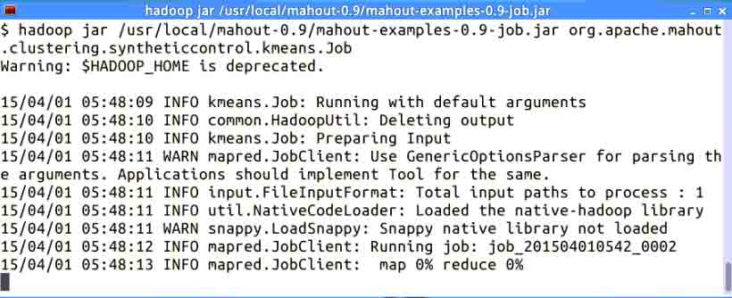
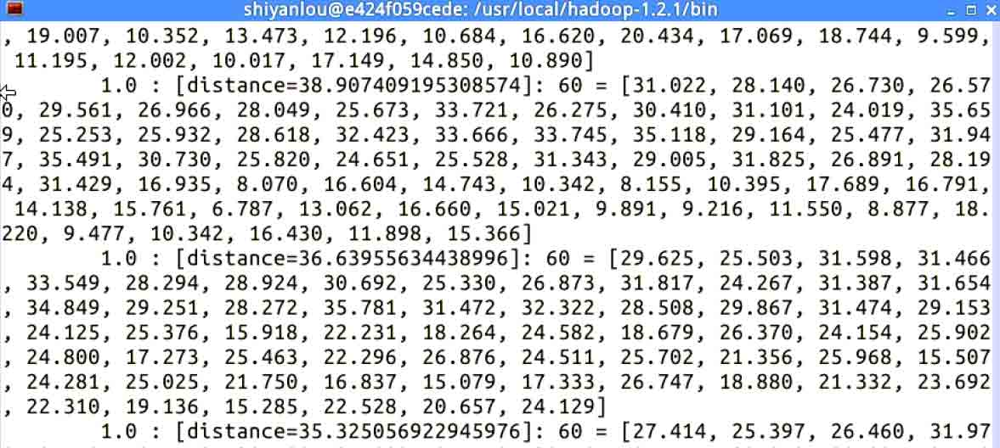
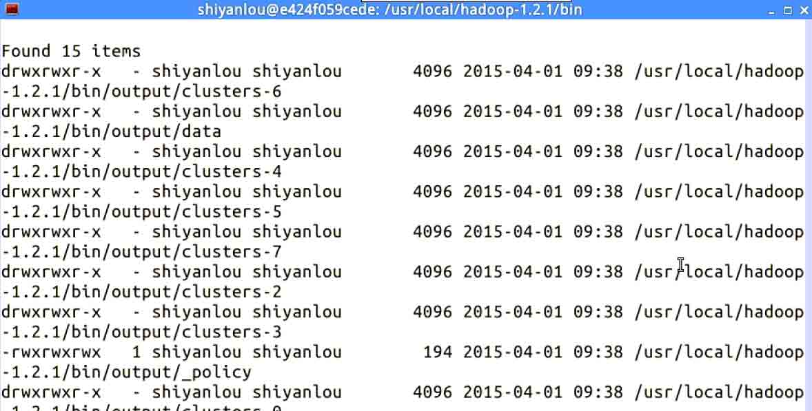
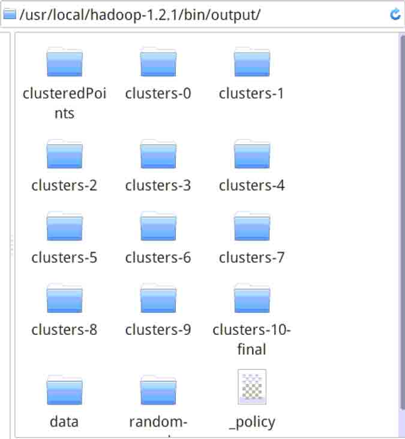

# 第 3 节 Mahout 聚类算法

* * *

## 实验简介

本次课程学习 Mahout 的 K-Means 聚类算法。

* * *

## 一、实验环境说明

**1\. 环境登录**

无需密码自动登录，系统用户名 shiyanlou

**2\. 环境介绍**

本实验环境采用带桌面的 Ubuntu Linux 环境，实验中会用到桌面上的程序：

> * XfceTerminal: Linux 命令行终端，打开后会进入 Bash 环境，可以使用 Linux 命令；

*   Firefox：浏览器，可以用在需要前端界面的课程里，只需要打开环境里写的 HTML/JS 页面即可；
*   GVim：非常好用的编辑器，最简单的用法可以参考课程 [Vim 编辑器](http://www.shiyanlou.com/courses/2)。
*   Eclipse：Eclipse 是著名的跨平台的自由集成开发环境（IDE）。主要用来 Java 语言开发，但是目前亦有人通过插件使其作为 C++ 和 Python 等语言的开发工具。

**3\. 环境使用**

使用 GVim 编辑器输入实验所需的代码，然后使用 XfceTerminal 命令行环境进行编译运行，查看运行结果，运行后可以截图并分享自己的实验成果，实验楼提供的截图是后台截图，无法作弊，可以真实有效证明您已经完成了实验。

实验报告可以在个人主页中查看，其中含有每次实验的截图及笔记，以及每次实验的有效学习时间（指的是在实验桌面内操作的时间，如果没有操作，系统会记录为发呆时间）。这些都是您学习的真实性证明。

## 二、聚类算法

为了让大家明白什么是聚类算法，这里引用一个例子。

比如你是一个拥有众多藏书的图书馆馆长，但是图书馆里面的藏书全部都是混乱无序的。来到图书馆看书的读者如果要找一本书，则相当麻烦。如果所有的图书是按照书名首字母排序的，那么查找图书就会变得容易得多；或者你也可以按照图书的主题来分类。因此，你需要按照某种规则来把图书排成一列，当遇到与之前规则一样的图书，就可以把它们放在一起；当你遍历完所有读书时，众多的书籍已经被分成了若干类，一遍 `聚类` 也就完成了。

如果你觉得第一遍聚类的结果还不够精细，你还可以进行第二遍聚类，直到结果令人满意为止。

## 三、K-Means 聚类算法

K-Means 算法是 Mahout 中的一种聚类算法。它的应用很广泛，因此本次实验主要介绍 K-Means 聚类算法。其中，K 是聚类的数目，在算法中会要求用户输入。

K-Means 聚类算法主要可分为 3 步：

*   为 待聚类 的点寻找聚类中心；

*   计算每个点到聚类中心的距离，将每个点聚类到离改点最近的聚类中去；

*   计算聚类中所有点的坐标平均值，并将这个平均值作为新的聚类中心点。重复步骤 2，直到聚类中心不再进行大范围移动，或者聚类次数达到要求为止；

例如下图，解释了 K-Means 算法的第一轮：



> **1\. 为 待聚类 的点寻找聚类中心；** > *我们选择了 c1、c2、c3 作为聚类中心*

> **2\. 计算每个点到聚类中心的距离，将每个点聚类到离该点最近的聚类中心去；** > *在图 2，我们将每个点连线到了其距离最近的聚类中心，形成了 3 个新的聚类；*

> **3\. 计算聚类中所有点的坐标平均值，并将这个平均值作为新的聚类中心点。重复步骤 2，直到聚类中心不再进行大范围移动，或者聚类次数达到要求为止；** > *计算了每个聚类的平均值，即新的 c1、c2、c3，同时也被作为了新的聚类中心点；重复步骤 2 ...*

## 四、K-Means 算法应用实例

这里我们举一个简单的例子，来展现 K-Means 算法的应用。

本实验环境默认集成的 Hadoop 是单机模式的，现在只需在 $HADOOP_HOME/bin 下新建一个测试目录；如果你是伪分布模式或者分布模式，则需在 hdfs 上新建这个目录。

（注意文件夹名只能是：`testdata`）

```java
$ sudo mkdir testdata
$ cd testdata 
```

进入 testdata 目录，在此目录中下载一个 test 文件（testdata 里面是一大堆数字）：

```java
$ wget http://labfile.oss.aliyuncs.com/synthetic_control.data 
```

运行 K-Means 算法（你必须先启动 Hadoop；注意根据你实际的 Mahout 路径来输入，`J` 为大写），可以看到类似下图的提示：

```java
$ source /etc/profile

$ hadoop jar /usr/local/mahout-0.9/mahout-examples-0.9-job.jar org.apache.mahout.clustering.syntheticcontrol.kmeans.Job 
```

 *图示：K-Means 正在运行 Map-Reduce*

 *图示：K-Means 正在运算中*

查看输出结果 output（它位于： `/usr/local/hadoop-1.2.1/bin/output`）：

```java
$ hadoop fs -ls output 
```

 *图示：终端查看*

 *图示：视图查看*

* * *

*   ···/output/clusteredPoints 存放的是最后的聚类结果；查看 clusteredPoints 使用命令为：

```java
$ mahout seqdumper -i /usr/local/hadoop-1.2.1/bin/output/clusteredPoints/part-m-00000 
```

 *图示：distance 为点到中心的距离；*

*   ···/output/data 存放的是原始数据，这个文件夹下的数据可以用 Mahout Vectordump 来读取，因为原始数据都是向量形式的；查看 data 使用命令为：

```java
$ mahout vectordump -i /usr/local/hadoop-1.2.1/bin/output/data/part-m-00000 
```

 *图示：原始数据*

*   ···/output/clusters-n 为第 n 次迭代产生的结果集。可以看到 K-Means 算法进行了多次迭代（默认为 10 次迭代，所以最后应该是 clusters-10）。例如，查看 clusters-10：

```java
$ mahout clusterdump -i /usr/local/hadoop-1.2.1/bin/output/clusters-10/part-r-00000 
```

 *图示：n=116，表示这一聚类有 116 个点；c 表示的是中心点的坐标；r 表示的是半径；*

## 作业

同学们不妨在伪分布模式下的 Hadoop 和 Mahout 中, 然后再尝试运行 K-Means 算法。

## 参考文档

> * 《Hadoop 实战 第 2 版》陆嘉恒，机械工业出版社；

*   [Hadoop 家族安装系列(2)——安装 Mahout0.9 框架](http://gaoxianwei.iteye.com/blog/2028095)；

l