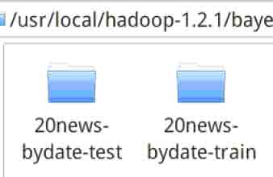
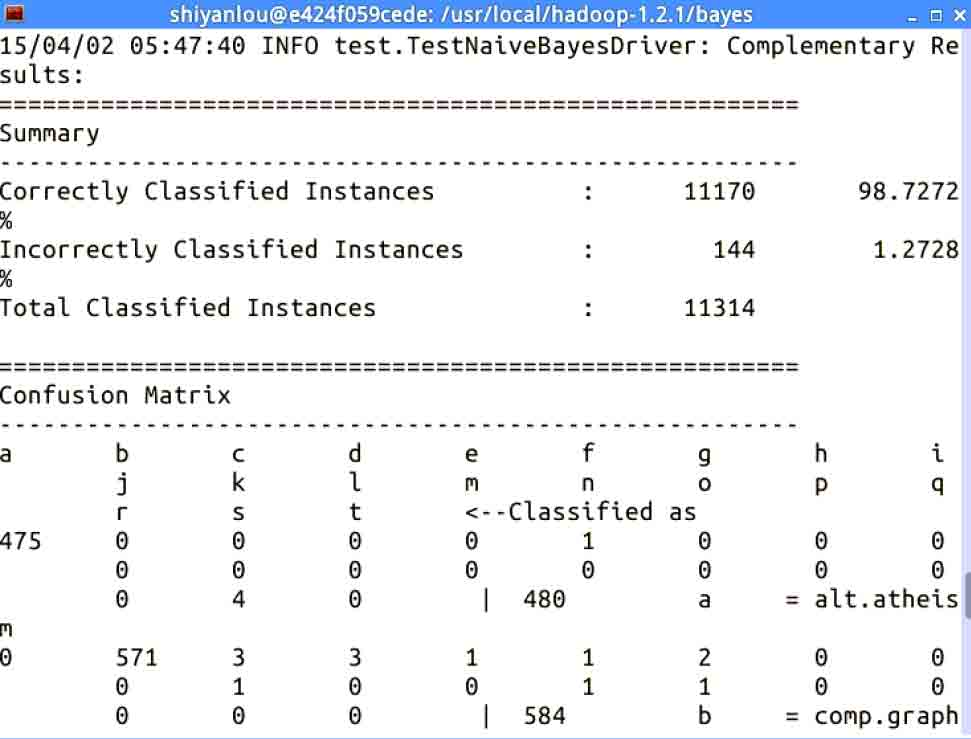

# 第 4 节 Mahout 分类算法

* * *

## 实验简介

本次课程学习了 Mahout 的 Bayes 分类算法。

* * *

## 一、实验环境说明

**1\. 环境登录**

无需密码自动登录，系统用户名 shiyanlou

**2\. 环境介绍**

本实验环境采用带桌面的 Ubuntu Linux 环境，实验中会用到桌面上的程序：

> * XfceTerminal: Linux 命令行终端，打开后会进入 Bash 环境，可以使用 Linux 命令；

*   Firefox：浏览器，可以用在需要前端界面的课程里，只需要打开环境里写的 HTML/JS 页面即可；
*   GVim：非常好用的编辑器，最简单的用法可以参考课程 [Vim 编辑器](http://www.shiyanlou.com/courses/2)。
*   Eclipse：Eclipse 是著名的跨平台的自由集成开发环境（IDE）。主要用来 Java 语言开发，但是目前亦有人通过插件使其作为 C++ 和 Python 等语言的开发工具。

**3\. 环境使用**

使用 GVim 编辑器输入实验所需的代码，然后使用 XfceTerminal 命令行环境进行编译运行，查看运行结果，运行后可以截图并分享自己的实验成果，实验楼提供的截图是后台截图，无法作弊，可以真实有效证明您已经完成了实验。

实验报告可以在个人主页中查看，其中含有每次实验的截图及笔记，以及每次实验的有效学习时间（指的是在实验桌面内操作的时间，如果没有操作，系统会记录为发呆时间）。这些都是您学习的真实性证明。

## 二、分类算法

为了让大家明白什么是聚类算法，这里我们同样引用一个例子。

假设在一个几岁的小孩面前摆放了一些水果，并告诉他 红色的圆的是苹果，而橘黄色的圆的是橘子。然后把这些水果拿开，再重新拿一个红色的圆的苹果问他是不是苹果。小孩回答是，这就是一个简单的分类算法过程。

在这个过程中，主要涉及两个阶段，第一是建立模型阶段，即告诉小孩哪种特征的是苹果这一个过程；第二就是使用模型的阶段，即询问小孩新的水果是不是苹果，小孩回答是，这一过程。

## 三、Bayes 分类算法

Bayes（贝叶斯） 分类算法是 Mahout 中的一种分类算法。Bayes 分类算法是一种基于统计的分类算法，用来预测某个样本属于某个分类的概率有多大。Bayes 分类算法是基于 Bayes 定理的分类算法。

Bayes 分类算法有很多变种。本次实验主要介绍 朴素 Bayes 分类算法。所为朴素，就是假设各个属性之间是相互独立的，它的思想基础是这样的：对于给出的待分类项，求解在此项出现的条件下各个类别出现的概率哪个最大，就认为此待分类项属于哪个类别。

当针对大数据的应用时，Bayes 分类算法具有方法简单、准确率高和速度快的优势。但事实上，Bayes 分类算法也有它的缺点，就是 Bayes 定理假设一个属性值对给定类的影响独立于其他属性的值，而这个假设在实际情况中几乎是不成立的。因此其分类准确率可能会下降。朴素 Bayes 分类算法是一种监督学习算法，使用朴素 Bayes 分类算法对文本进行分类，主要有两种模型：多项式模型（Multinomial Model）和伯努利模型（Bernoulli Model）。Mahout 中的朴素 Bayes 分类算法使用的是多项式模型，如果有兴趣深入研究，你可以前往 [这里](http://people.csail.mit.edu/jrennie/papers/icml03-nb.pdf) 查看具体的论文（英文稿）。

下面照例举个例子，来阐述 Bayes 分类算法。给定一组分类号的文本训练数据，如下图所示：


给定一个新的文档样本：“中国，中国，中国，东京，日本”，对该样本进行分类。该文本属性向量可以表示为 d=(中国，中国，中国，东京，日本)，类别集合 Y={是，否}. 类别 `“是”`下共有 8 个单词，`“否”` 类别下共有 3 个单词。训练样本单词总数为 8+3=11\. 因此 P(是)=8/11，P(否)=3/11.

类条件概率计算如下：

*   P(中国|是)=(5+1)/(8+6)=6/14=3/7
*   P(日本|是)=P(东京|是)=(0+1)/(8+6)=1/14
*   P(中国|否)=(1+1)/(3+6)=2/9
*   P(日本|否)=P(东京|否)=(1+1)/(3+6)=2/9

> 其中：

> * 分母中的 8，表示 `“是”` 类别下训练样本的单词总数； > * 6 表示训练样本有 “中国，北京，上海，澳门东京，日本” 共 6 个单词； > * 3 表示 `“否”` 类别下共有 3 个单词。

有了以上的类条件概率计算结果，就可以开始计算后验概率了：

*   P(是|d)=(3/7)3×1/14×1/14×1/14×8/11=108/184877=0.00058417
*   P(否|d)=(2/9)3×2/9×2/9×3/11=32/216513=0.00014780

最后我们就可以得出结论：这个文档属于类别 `中国`，这就是 Mahout 中实现的 Bayes 分类算法的主要思想。

## 四、Bayes 分类算法应用实例

本次实验，依然通过一组具体的实例来给大家演示。

（1）在 `/usr/local/hadoop-1.2.1` 下新建一个测试目录，下载测试数据 20news-bydate.tar.gz 并解压（这个测试数据包含多个新闻组文档，这些文档内又分为了多个新闻组）：

```java
$ sudo mkdir bayes

$ cd bayes

$ sudo wget http://labfile.oss.aliyuncs.com/20news-bydate.tar.gz

$ sudo tar zxvf 20news-bydate.tar.gz 
```

解压之后，它已经为我们划分好了训练集（Train）和测试集（Test）。我们只需要转换数据格式。



（2）使用 mahout seqdirectory 命令将目录下的所有样本文件转换成 `<Text, Text>` 格式的 SequenceFile. Mahout 会自动执行 Hadoop Map-Reduce 来进行处理，输出结果放到 20news-seq 目录中：

```java
$ source /etc/profile

$ mahout seqdirectory -i 20news-bydate-train -o 20news-bydate-train-seq

$ mahout seqdirectory -i 20news-bydate-test -o 20news-bydate-test-seq 
```

 *图示：正在执行 Map-Reduce 作业*

（3）再使用 mahout seq2sparse 命令将生成的 SequenceFile 文件转换成 `<Text, VectorWritable>` 格式的向量文件，同样会执行 Hadoop Map-Reduce 来进行处理，输出结果放到 20news-vectors 目录中（命令较为复杂，执行前请确认是否输入正确）：

```java
$ mahout seq2sparse -i 20news-bydate-train-seq -o 20news-bydate-train-vectors -lnorm -nv -wt tfidf

$ mahout seq2sparse -i 20news-bydate-test-seq -o 20news-bydate-test-vectors -lnorm -nv -wt tfidf 
```

 *图示：向量化执行完毕后部分输出内容*

（4）数据格式转换完成后，我们就可以开始训练数据集了。

```java
$ mahout trainnb -i 20news-bydate-train-vectors/tfidf-vectors -el -o model -li labelindex -ow 
```

 *图示：训练完成后部分输出内容*

（5）训练完成后，开始测试：

```java
$ mahout testnb -i 20news-bydate-test-vectors/tfidf-vectors -m model -l labelindex -ow -o test-relust -c 
```



 *图示：上面两张图为测试结果信息*

（6）这里解释一下上面那个混合矩阵输出信息的意思：

上述 `a` 到 `t` 分别是代表了有 20 个类别，你可以在 train 或者 test 文件夹下看到这 20 个类别。列中的数据表示每个类别中被分配到的字节个数，classified 表示应该被分配到的总数。例如：


它表示 alt.atheis 本来是属于 a，有 475 篇文档被划为了 a 类，这个是正确的数据；其它的则依次表示划到 b~t 类中的数目。我们可以看到其准确率为 475/480=0.9895833··· , 可见其准确率是很高的。

同样，从 Summary 和 Statistics 统计信息，我们也可以看到结果的准确率和可靠性都是很高的。

## 作业

大家不妨在伪分布模式下的 Hadoop 和 Mahout 中, 再尝试运行 Bayes 分类算法实例。

## 参考文档

> * 《Hadoop 实战 第 2 版》陆嘉恒，机械工业出版社；

*   [Mahout 0.6 之后运行 20news 贝叶斯分类测试的方法](http://f.dataguru.cn/thread-381700-1-1.html)；