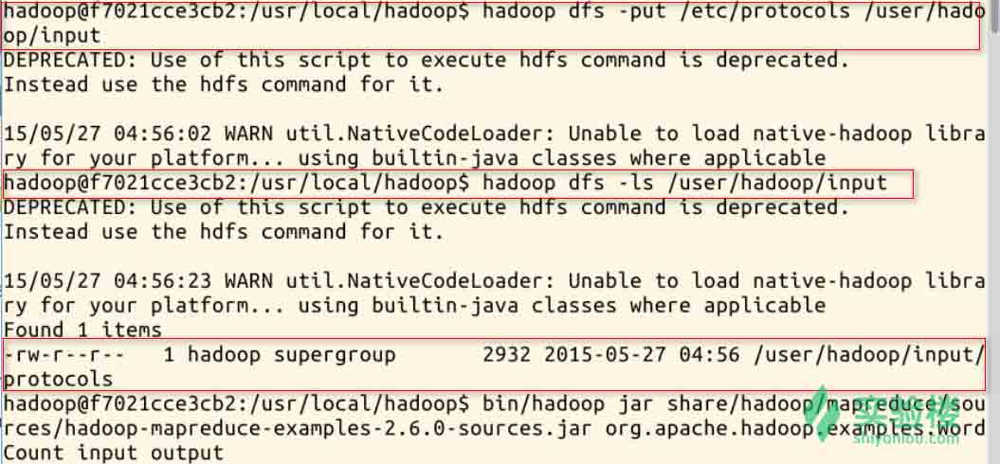
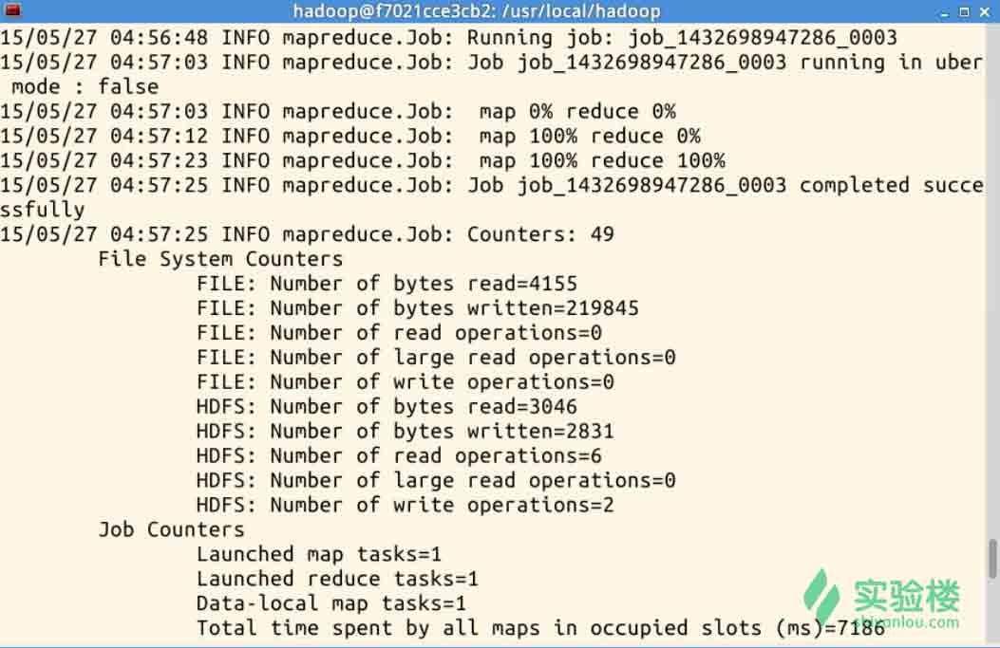
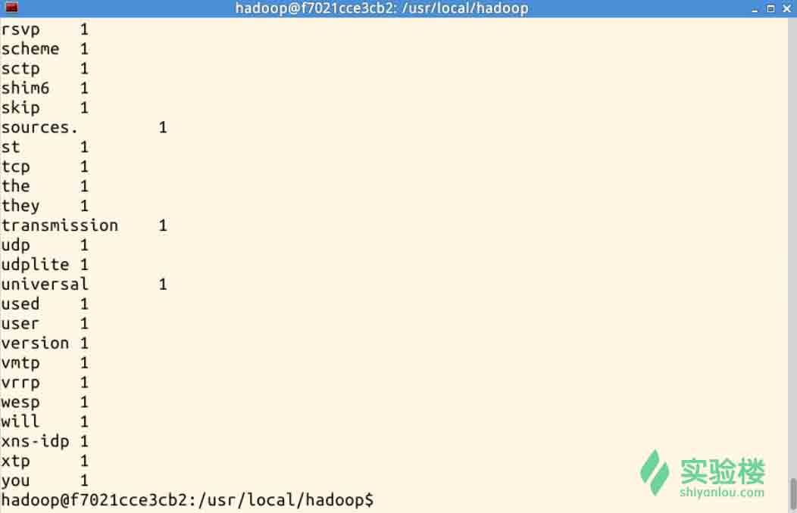

# Hadoop 部署及管理

Hadoop 是一款支持数据密集型分布式应用并以 Apache 2.0 许可协议发布的开源软件框架，本实验学习并实践 Hadoop 系统的不同模式的部署，以及基本的系统使用与管理。

## 一、课程简介

### 1\. Hadoop 是什么？

Apache Hadoop 是一款支持数据密集型分布式应用并以 Apache 2.0 许可协议发布的开源软件框架。它支持在商品硬件构建的大型集群上运行的应用程序。Hadoop 是根据 Google 公司发表的 MapReduce 和 Google 档案系统的论文自行实作而成。

Hadoop 框架透明地为应用提供可靠性和数据移动。它实现了名为 MapReduce 的编程范式：应用程序被分割成许多小部分，而每个部分都能在集群中的任意节点上执行或重新执行。此外，Hadoop 还提供了分布式文件系统，用以存储所有计算节点的数据，这为整个集群带来了非常高的带宽。MapReduce 和分布式文件系统的设计，使得整个框架能够自动处理节点故障。它使应用程序与成千上万的独立计算的电脑和 PB 级的数据。现在普遍认为整个 Apache Hadoop“平台”包括 Hadoop 内核、MapReduce、Hadoop 分布式文件系统（HDFS）以及一些相关项目，有 Apache Hive 和 Apache HBase 等等。

Hadoop 的框架最核心的设计就是：HDFS 和 MapReduce.HDFS 为海量的数据提供了存储，则 MapReduce 为海量的数据提供了计算。

### 2\. Hadoop 历史

Hadoop 由 Apache Software Foundation 公司于 2005 年秋天作为 Lucene 的子项目 Nutch 的一部分正式引入。它受到最先由 Google Lab 开发的 Map/Reduce 和 Google File System(GFS) 的启发。

2006 年 3 月份，Map/Reduce 和 Nutch Distributed File System (NDFS) 分别被纳入称为 Hadoop 的项目中。

Hadoop 是最受欢迎的在 Internet 上对搜索关键字进行内容分类的工具，但它也可以解决许多要求极大伸缩性的问题。例如，如果您要 grep 一个 10TB 的巨型文件，会出现什么情况？在传统的系统上，这将需要很长的时间。但是 Hadoop 在设计时就考虑到这些问题，采用并行执行机制，因此能大大提高效率。

目前有很多公司开始提供基于 Hadoop 的商业软件、支持、服务以及培训。Cloudera 是一家美国的企业软件公司，该公司在 2008 年开始提供基于 Hadoop 的软件和服务。GoGrid 是一家云计算基础设施公司，在 2012 年，该公司与 Cloudera 合作加速了企业采纳基于 Hadoop 应用的步伐。Dataguise 公司是一家数据安全公司，同样在 2012 年该公司推出了一款针对 Hadoop 的数据保护和风险评估。

### 3\. Hadoop 相关项目

*   Hadoop Common：在 0.20 及以前的版本中，包含 HDFS、MapReduce 和其他项目公共内容，从 0.21 开始 HDFS 和 MapReduce 被分离为独立的子项目，其余内容为 Hadoop Common
*   HDFS：Hadoop 分布式文件系统（Distributed File System）－HDFS（Hadoop Distributed File System）
*   MapReduce：并行计算框架，0.20 前使用 org.apache.hadoop.mapred 旧接口，0.20 版本开始引入 org.apache.hadoop.mapreduce 的新 API
*   Apache HBase：分布式 NoSQL 列数据库，类似谷歌公司 BigTable。
*   Apache Hive：构建于 hadoop 之上的数据仓库，通过一种类 SQL 语言 HiveQL 为用户提供数据的归纳、查询和分析等功能。Hive 最初由 Facebook 贡献。
*   Apache Mahout：机器学习算法软件包。
*   Apache Sqoop：结构化数据（如关系数据库）与 Apache Hadoop 之间的数据转换工具。
*   Apache ZooKeeper：分布式锁设施，提供类似 Google Chubby 的功能，由 Facebook 贡献。
*   Apache Avro：新的数据序列化格式与传输工具，将逐步取代 Hadoop 原有的 IPC 机制。

### 4\. Hadoop 优点

*   高可靠性。Hadoop 按位存储和处理数据的能力值得人们信赖。
*   高扩展性。Hadoop 是在可用的计算机集簇间分配数据并完成计算任务的，这些集簇可以方便地扩展到数以千计的节点中。
*   高效性。Hadoop 能够在节点之间动态地移动数据，并保证各个节点的动态平衡，因此处理速度非常快。
*   高容错性。Hadoop 能够自动保存数据的多个副本，并且能够自动将失败的任务重新分配。
*   低成本。与一体机、商用数据仓库以及 QlikView、Yonghong Z-Suite 等数据集市相比，hadoop 是开源的，项目的软件成本因此会大大降低。

Hadoop 带有用 Java 语言编写的框架，因此运行在 Linux 生产平台上是非常理想的。Hadoop 上的应用程序也可以使用其他语言编写，比如 C++。

### 5\. Hadoop 应用场景

美国着名科技博客 GigaOM 的专栏作家 Derrick Harris 在一篇文章中总结了 10 个 Hadoop 的应用场景：

*   在线旅游：全球 80%的在线旅游网站都是在使用 Cloudera 公司提供的 Hadoop 发行版，其中 SearchBI 网站曾经报道过的 Expedia 也在其中。
*   移动数据：Cloudera 运营总监称，美国有 70%的智能手机数据服务背后都是由 Hadoop 来支撑的，也就是说，包括数据的存储以及无线运营商的数据处理等，都是在利用 Hadoop 技术。
*   电子商务：这一场景应该是非常确定的，eBay 就是最大的实践者之一。国内的电商在 Hadoop 技术上也是储备颇为雄厚的。
*   能源开采：美国 Chevron 公司是全美第二大石油公司，他们的 IT 部门主管介绍了 Chevron 使用 Hadoop 的经验，他们利用 Hadoop 进行数据的收集和处理，其中这些数据是海洋的地震数据，以便于他们找到油矿的位置。
*   节能：另外一家能源服务商 Opower 也在使用 Hadoop,为消费者提供节约电费的服务，其中对用户电费单进行了预测分析。
*   基础架构管理：这是一个非常基础的应用场景，用户可以用 Hadoop 从服务器、交换机以及其他的设备中收集并分析数据。
*   图像处理：创业公司 Skybox Imaging 使用 Hadoop 来存储并处理图片数据，从卫星中拍摄的高清图像中探测地理变化。
*   诈骗检测：这个场景用户接触的比较少，一般金融服务或者政府机构会用到。利用 Hadoop 来存储所有的客户交易数据，包括一些非结构化的数据，能够帮助机构发现客户的异常活动，预防欺诈行为。
*   IT 安全：除企业 IT 基础机构的管理之外，Hadoop 还可以用来处理机器生成数据以便甄别来自恶意软件或者网络中的攻击。
*   医疗保健：医疗行业也会用到 Hadoop,像 IBM 的 Watson 就会使用 Hadoop 集群作为其服务的基础，包括语义分析等高级分析技术等。医疗机构可以利用语义分析为患者提供医护人员，并协助医生更好地为患者进行诊断。

### 文档来源说明

本文档部分内容来自维基百科及百度百科。

## 二、实验环境说明

### 1\. 环境登录

无需密码自动登录，系统用户名 shiyanlou

### 2\. 环境介绍

本实验环境采用带桌面的 Ubuntu Linux 环境，实验中会用到桌面上的程序：

1.  XfceTerminal: Linux 命令行终端，打开后会进入 Bash 环境，可以使用 Linux 命令
2.  Firefox：浏览器，可以用在需要前端界面的课程里，只需要打开环境里写的 HTML/JS 页面即可
3.  GVim：非常好用的编辑器，最简单的用法可以参考课程[Vim 编辑器](http://www.shiyanlou.com/courses/2)

### 3\. 环境使用

使用 GVim 编辑器输入实验所需的代码，也可以对配置文件进行编辑；如果需要查看网站页面，可以使用 Firefox 浏览器打开文件或地址。

实验报告可以在个人主页中查看，其中含有每次实验的截图及笔记，以及每次实验的有效学习时间（指的是在实验桌面内操作的时间，如果没有操作，系统会记录为发呆时间）。这些都是您学习的真实性证明。

## 一、实验环境说明

### 1\. 环境登录

无需密码自动登录，系统用户名 shiyanlou

### 2\. 环境介绍

本实验环境采用带桌面的 Ubuntu Linux 环境，实验中会用到桌面上的程序：

*   XfceTerminal: Linux 命令行终端，打开后会进入 Bash 环境，可以使用 Linux 命令
*   Firefox：浏览器，可以用在需要前端界面的课程里，只需要打开环境里写的 HTML/JS 页面即可
*   GVim：非常好用的编辑器，最简单的用法可以参考课程[Vim 编辑器](http://www.shiyanlou.com/courses/2)

### 3\. 环境使用

使用 GVim 编辑器输入实验所需的代码，然后使用 XfceTerminal 命令行环境进行编译运行，查看运行结果，运行后可以截图并分享自己的实验成果，实验楼提供的截图是后台截图，无法作弊，可以真实有效证明您已经完成了实验。

实验报告可以在个人主页中查看，其中含有每次实验的截图及笔记，以及每次实验的有效学习时间（指的是在实验桌面内操作的时间，如果没有操作，系统会记录为发呆时间）。这些都是您学习的真实性证明。

### 4\. 参考文档

本实验参考下列文档内容制作：

*   http://hadoop.apache.org/docs/r2.6.0/hadoop-project-dist/hadoop-common/SingleCluster.html
*   http://www.cnblogs.com/kinglau/p/3794433.html

## 二、Hadoop 启动模式

Hadoop 集群有三种启动模式：

*   单机模式：默认情况下运行为一个单独机器上的独立 Java 进程，主要用于调试环境
*   伪分布模式：在单个机器上模拟成分布式多节点环境，每一个 Hadoop 守护进程都作为一个独立的 Java 进程运行
*   完全分布式模式：真实的生产环境，搭建在完全分布式的集群环境

## 三、用户及用户组

需要先添加用来运行 Hadoop 进程的用户组 hadoop 及用户 hadoop。

### 1\. 添加用户及用户组

创建用户 hadoop

```java
$ sudo adduser hadoop 
```

需要输入 shiyanlou 的密码。并按照提示输入 hadoop 用户的密码。

### 2\. 添加 sudo 权限

将 hadoop 用户添加进 sudo 用户组

```java
$ sudo usermod -G sudo hadoop 
```

## 四、安装及配置依赖的软件包

### 1\. 安装 openssh-server、java、rsync 等

```java
$ sudo apt-get update
$ sudo apt-get install openssh-server rsync
$ sudo service ssh restart
$ sudo apt-get install openjdk-7-jdk
$ java -version 
```

### 2\. 配置 ssh 免密码登录

切换到 hadoop 用户，需要输入添加 hadoop 用户时配置的密码。后续步骤都将在 hadoop 用户的环境中执行。

```java
$ su -l hadoop 
```

配置 ssh 环境免密码登录。

```java
$ ssh-keygen -t rsa -P "" 
```

在/home/hadoop/.ssh 目录下生成了 id*rsa（私钥）和 id*rsa.pub（公钥）两个文件,将公钥追加到 authorized_keys 中，该文件保存所有允许以当前用户身份登录到 ssh 客户端用户的公钥内容。

```java
$ cat ~/.ssh/id_rsa.pub >> ~/.ssh/authorized_keys 
```

验证登录本机是否还需要密码，配置正确的话是可以不需密码登录的。

```java
$ ssh localhost 
```

## 五、下载并安装 Hadoop

在 hadoop 用户登录的环境中进行下列操作：

### 1\. 下载 Hadoop 2.6.0

```java
$ wget http://labfile.oss.aliyuncs.com/hadoop-2.6.0.tar.gz 
```

### 2\. 解压并安装

```java
$ tar zxvf hadoop-2.6.0.tar.gz
$ sudo mv hadoop-2.6.0 /usr/local/hadoop
$ sudo chmod 774 /usr/local/hadoop 
```

### 3\. 配置 Hadoop

```java
$ vim /home/hadoop/.bashrc 
```

在/home/hadoop/.bashrc 文件末尾添加下列内容：

```java
#HADOOP START
export JAVA_HOME=/usr/lib/jvm/java-7-openjdk-amd64
export HADOOP_INSTALL=/usr/local/hadoop
export PATH=$PATH:$HADOOP_INSTALL/bin
export PATH=$PATH:$HADOOP_INSTALL/sbin
export HADOOP_MAPRED_HOME=$HADOOP_INSTALL
export HADOOP_COMMON_HOME=$HADOOP_INSTALL
export HADOOP_HDFS_HOME=$HADOOP_INSTALL
export YARN_HOME=$HADOOP_INSTALL
export HADOOP_COMMON_LIB_NATIVE_DIR=$HADOOP_INSTALL/lib/native
export HADOOP_OPTS="-Djava.library.path=$HADOOP_INSTALL/lib"
#HADOOP END 
```

保存退出后，激活新加的环境变量

```java
$ source ~/.bashrc 
```

至此，Hadoop 单机模式安装完成，可以通过下述步骤的测试来验证安装是否成功。

## 六、测试验证

创建输入的数据，暂时采用/etc/protocols 文件作为测试

```java
$ cd /usr/local/hadoop
$ sudo mkdir input
$ sudo cp /etc/protocols ./input 
```

执行 Hadoop WordCount 应用（词频统计）

```java
$ bin/hadoop jar share/hadoop/mapreduce/sources/hadoop-mapreduce-examples-2.6.0-sources.jar org.apache.hadoop.examples.WordCount input output 
```

查看生成的单词统计数据

```java
$ cat output/* 
```

**注意**：如果要继续下一节“伪分布式部署”实验，请勿停止本实验环境，直接点击文档上方的“下一个实验”按钮进入，因为伪分布式部署模式需要在单机模式基础上进行配置。

## 七、小结

本实验中介绍了 Hadoop 单机模式的安装方法，并运行 wordcount 进行基本测试。

## 八、思考题

请使用 hadoop 的 wordcount 对日志文件/var/log/dpkg.log 进行词频统计。

实验中有任何问题欢迎到[实验楼问答](http://www.shiyanlou.com/questions)提问。

## 一、实验环境说明

*   **注意：本实验需要按照上一节单机模式部署后继续进行操作**

### 1\. 环境登录

无需密码自动登录，系统用户名 shiyanlou

### 2\. 环境介绍

本实验环境采用带桌面的 Ubuntu Linux 环境，实验中会用到桌面上的程序：

*   XfceTerminal：Linux 命令行终端，打开后会进入 Bash 环境，可以使用 Linux 命令
*   Firefox：浏览器，可以用在需要前端界面的课程里，只需要打开环境里写的 HTML/JS 页面即可
*   GVim：非常好用的编辑器，最简单的用法可以参考课程 Vim 编辑器

### 3\. 环境使用

使用 Vim 编辑器输入实验所需的代码，然后使用 Xfce 终端命令行环境进行编译运行，查看运行结果，运行后可以截图并分享自己的实验报告，实验报告中的数据可以真实有效证明您已经完成了实验。

实验报告页面可以在“我的主页”中查看，其中含有每次实验的截图及笔记，以及每次实验的有效学习时间（指的是在实验桌面内操作的时间，如果没有操作，系统会记录为发呆时间）。这些都是您学习的真实性证明。

### 4\. 参考文档

本实验参考下列文档内容制作：

*   http://www.cnblogs.com/kinglau/p/3796164.html
*   http://www.linuxidc.com/Linux/2012-01/50880p2.html

## 二、Hadoop 伪分布式模式配置

### 注意：本实验需要按照上一节单机模式部署后继续进行操作，因此您必须先完成上一节实验。

### 1\. 相关配置文件修改

#### 1).修改`core-site.xml`:

```java
$ sudo gvim /usr/local/hadoop/etc/hadoop/core-site.xml 
```

```java
<?xml version="1.0"?>
<?xml-stylesheet type="text/xsl" href="configuration.xsl"?>

<!-- Put site-specific property overrides in this file. -->

<configuration>
    <property>
        <name>fs.default.name</name>
        <value>hdfs://localhost:9000</value>
    </property>
    <property>
        <name>hadoop.tmp.dir</name>
        <value>/home/hadoop/tmp</value>
   </property>
</configuration> 
```

常用配置项说明：

*   `fs.default.name`这是一个描述集群中 NameNode 结点的 URI(包括协议、主机名称、端口号)，集群里面的每一台机器都需要知道 NameNode 的地址。DataNode 结点会先在 NameNode 上注册，这样它们的数据才可以被使用。独立的客户端程序通过这个 URI 跟 DataNode 交互，以取得文件的块列表。
*   `hadoop.tmp.dir` 是 hadoop 文件系统依赖的基础配置，很多路径都依赖它。如果 hdfs-site.xml 中不配置 namenode 和 datanode 的存放位置，默认就放在`/tmp/hadoop-${user.name}`这个路径中

更多说明请参考[core-default.xml](http://hadoop.apache.org/docs/stable/hadoop-project-dist/hadoop-common/core-default.xml)，包含配置文件所有配置项的说明和默认值。

#### 2).修改`hdfs-site.xml`:

```java
$ sudo gvim /usr/local/hadoop/etc/hadoop/hdfs-site.xml 
```

```java
<?xml version="1.0"?>
<?xml-stylesheet type="text/xsl" href="configuration.xsl"?>

<!-- Put site-specific property overrides in this file. -->

<configuration>
    <property>
        <name>dfs.replication</name>
        <value>1</value>
    </property>
</configuration> 
```

常用配置项说明：

*   `dfs.replication`它决定着系统里面的文件块的数据备份个数。对于一个实际的应用，它应该被设为 3（这个数字并没有上限，但更多的备份可能并没有作用，而且会占用更多的空间）。少于三个的备份，可能会影响到数据的可靠性(系统故障时，也许会造成数据丢失)
*   `dfs.data.dir`这是 DataNode 结点被指定要存储数据的本地文件系统路径。DataNode 结点上的这个路径没有必要完全相同，因为每台机器的环境很可能是不一样的。但如果每台机器上的这个路径都是统一配置的话，会使工作变得简单一些。默认的情况下，它的值为`file://${hadoop.tmp.dir}/dfs/data`这个路径只能用于测试的目的，因为它很可能会丢失掉一些数据。所以这个值最好还是被覆盖。
*   `dfs.name.dir`这是 NameNode 结点存储 hadoop 文件系统信息的本地系统路径。这个值只对 NameNode 有效，DataNode 并不需要使用到它。上面对于/temp 类型的警告，同样也适用于这里。在实际应用中，它最好被覆盖掉。

更多说明请参考[hdfs-default.xml](http://hadoop.apache.org/docs/stable/hadoop-project-dist/hadoop-hdfs/hdfs-default.xml)，包含配置文件所有配置项的说明和默认值。

#### 3).修改`mapred-site.xml`:

```java
$ sudo cp /usr/local/hadoop/etc/hadoop/mapred-site.xml.template /usr/local/hadoop/etc/hadoop/mapred-site.xml
$ sudo gvim /usr/local/hadoop/etc/hadoop/mapred-site.xml 
```

```java
<?xml version="1.0"?>
<?xml-stylesheet type="text/xsl" href="configuration.xsl"?>

<!-- Put site-specific property overrides in this file. -->

<configuration>
    <property>
        <name>mapreduce.framework.name</name>
        <value>yarn</value>
    </property>
</configuration> 
```

常用配置项说明：

*   `mapred.job.tracker`JobTracker 的主机（或者 IP）和端口。

更多说明请参考[mapred-default.xml](http://hadoop.apache.org/docs/stable/hadoop-mapreduce-client/hadoop-mapreduce-client-core/mapred-default.xml)，包含配置文件所有配置项的说明和默认值

#### 4).修改`yarn-site.xml`:

```java
<configuration>
    <property>
        <name>yarn.nodemanager.aux-services</name>
        <value>mapreduce_shuffle</value>
    </property>
    <property>
        <name>yarn.nodemanager.aux-services.mapreduce.shuffle.class</name>
        <value>org.apache.hadoop.mapred.ShuffleHandler</value>
    </property>
</configuration> 
```

常用配置项说明：

*   `yarn.nodemanager.aux-services`通过该配置，用户可以自定义一些服务

更多说明请参考[yarn-default.xml](http://hadoop.apache.org/docs/stable/hadoop-yarn/hadoop-yarn-common/yarn-default.xml)，包含配置文件所有配置项的说明和默认值

#### 5). 修改 `hadoop-env.sh`:

```java
$ sudo vim /usr/local/hadoop/etc/hadoop/hadoop-env.sh 
```

修改 JAVA_HOME 如下：


这样简单的伪分布式模式就配置好了。

## 三、格式化 HDFS 文件系统

在使用 hadoop 前，必须格式化一个全新的 HDFS 安装，通过创建存储目录和 NameNode 持久化数据结构的初始版本，格式化过程创建了一个空的文件系统。由于 NameNode 管理文件系统的元数据，而 DataNode 可以动态的加入或离开集群，因此这个格式化过程并不涉及 DataNode。同理，用户也无需关注文件系统的规模。集群中 DataNode 的数量决定着文件系统的规模。DataNode 可以在文件系统格式化之后的很长一段时间内按需增加。

### 1.先切换到 hadoop 账户，按照提示输入账户密码

```java
$ su hadoop 
```

### 2.格式化 HDFS 文件系统

```java
$ hadoop namenode -format 
```

会输出如下信息，则表格式化 HDFS 成功：

```java
DEPRECATED: Use of this script to execute hdfs command is deprecated.
Instead use the hdfs command for it.

INFO namenode.NameNode: STARTUP_MSG:
/************************************************************
STARTUP_MSG: Starting NameNode
STARTUP_MSG:   host = [你的主机名]/127.0.0.1
STARTUP_MSG:   args = [-format]
STARTUP_MSG:   version = 2.4.1
...
...
INFO util.ExitUtil: Exiting with status 0
INFO namenode.NameNode: SHUTDOWN_MSG:
/************************************************************
SHUTDOWN_MSG: Shutting down NameNode at [你的主机名]/127.0.0.1
************************************************************/ 
```

## 四、Hadoop 集群启动

### 1.启动 hdfs 守护进程，分别启动 NameNode 和 DataNode

```java
$ hadoop-daemon.sh start namenode
$ hadoop-daemon.sh start datanode 
```

或者一次启动

```java
$ start-dfs.sh 
```

输出如下（可以看出分别启动了 namenode, datanode, secondarynamenode，因为我们没有配置 secondarynamenode，所以地址为 0.0.0.0）：

```java
Starting namenodes on []
hadoop@localhost's password:
localhost: starting namenode, logging to /usr/local/hadoop/logs/hadoop-hadoop-namenode-G470.out
hadoop@localhost's password:
localhost: starting datanode, logging to /usr/local/hadoop/logs/hadoop-hadoop-datanode-G470.out
localhost: OpenJDK 64-Bit Server VM warning: You have loaded library /usr/local/hadoop/lib/native/libhadoop.so.1.0.0 which might have disabled stack guard. The VM will try to fix the stack guard now.
localhost: It's highly recommended that you fix the library with 'execstack -c <libfile>', or link it with '-z noexecstack'.
Starting secondary namenodes [0.0.0.0]
hadoop@0.0.0.0's password:
0.0.0.0: starting secondarynamenode, logging to /usr/local/hadoop/logs/hadoop-hadoop-secondarynamenode-G470.out 
```

### 2.启动 yarn,使用如下命令启 ResourceManager 和 NodeManager:

```java
$ yarn-daemon.sh start resourcemanager
$ yarn-daemon.sh start nodemanager 
```

或者一次启动：

```java
$ start-yarn.sh 
```

### 3.检查是否运行成功

打开浏览器

*   输入：`http://localhost:8088`进入 ResourceManager 管理页面
*   输入：`http://localhost:50070`进入 HDFS 页面

#### 可能出现的问题及调试方法：

启动伪分布后，如果活跃节点显示为零，说明伪分布没有真正的启动。原因是有的时候数据结构出现问题会造成无法启动 datanode。如果使用`hadoop namenode -format`重新格式化仍然无法正常启动，原因是`/tmp`中的文件没有清除，则需要先清除`/tmp/hadoop/*`再执行格式化，即可解决 hadoop datanode 无法启动的问题。具体步骤如下所示：

```java
# 删除 hadoop:/tmp
$ hadoop fs -rmr /tmp
# 停止 hadoop
$ stop-all.sh
# 删除/tmp/hadoop*
$ rm -rf /tmp/hadoop*
# 格式化
$ hadoop namenode -format
# 启动 hadoop
$ start-all.sh 
```

## 六、测试验证

测试验证还是使用上一节的 WordCount。

不同的是，这次是伪分布模式，使用到了 hdfs，因此我们需要把文件拷贝到 hdfs 上去。

首先创建相关文件夹（要一步一步的创建）：

```java
$ hadoop dfs -mkdir /user
$ hadoop dfs -mkdir /user/hadoop
$ hadoop dfs -mkdir /user/hadoop/input 
```

### 1.创建输入的数据，采用/etc/protocols 文件作为测试

先将文件拷贝到 hdfs 上：

```java
$ hadoop dfs -put /etc/protocols /user/hadoop/input 
```



### 2.执行 Hadoop WordCount 应用（词频统计）

```java
# 如果存在上一次测试生成的 output，由于 hadoop 的安全机制，直接运行可能会报错，所以请手动删除上一次生成的 output 文件夹
$ bin/hadoop jar share/hadoop/mapreduce/sources/hadoop-mapreduce-examples-2.6.0-sources.jar org.apache.hadoop.examples.WordCount input output 
```

执行过程截图（部分）：



### 3.查看生成的单词统计数据

```java
$ hadoop dfs -cat /user/hadoop/output/* 
```



## 七、关闭服务

输入命令

```java
$ hadoop-daemon.sh stop namenode
$ hadoop-daemon.sh stop datanode
$ yarn-daemon.sh stop resourcemanager
$ yarn-daemon.sh stop nodemanager 
```

或者

```java
$ stop-dfs.sh
$ stop-yarn.sh 
```

最后一步：点击屏幕上方的“实验截图”将上述命令执行后的截图保存并分享给朋友们吧，这是你学习 Hadoop 安装的证明。

## 八、小结

本实验讲解如何在单机模式下继续部署 Hadoop 为伪分布模式。

## 九、思考题

伪分布模式和单机模式配置上的区别主要是哪些？是否可以推论出如何部署真实的分布式 Hadoop 环境？

实验中有任何问题欢迎到[实验楼问答](http://www.shiyanlou.com/questions)提问。