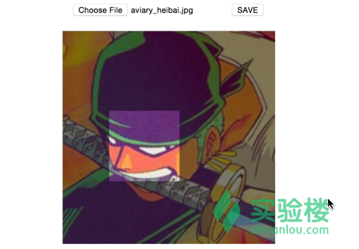
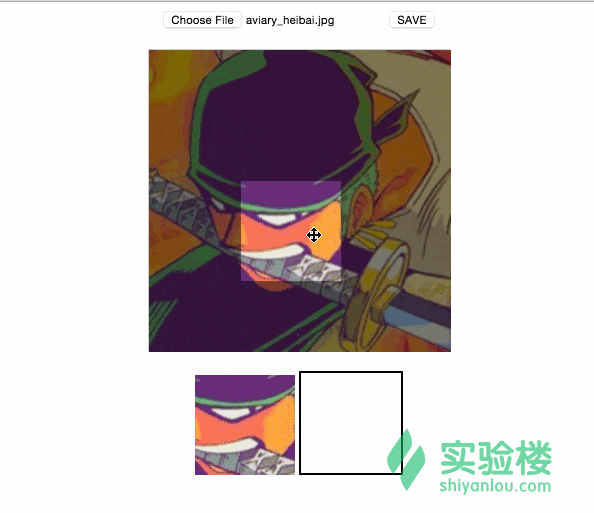
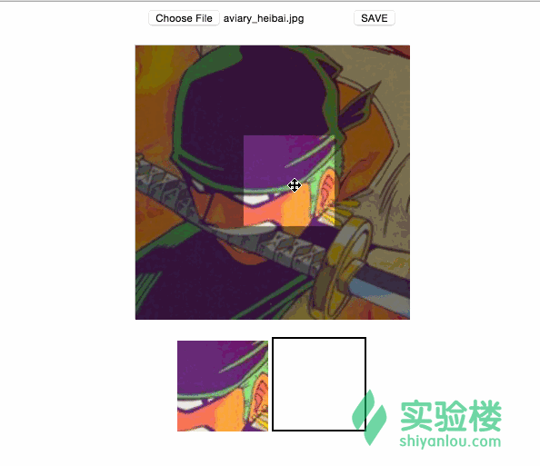

# HTML5 本地裁剪图片

利用 HTML5 的 File API 和 Canvas 实现本地的图片裁剪

## HTML5 本地裁剪图片

## 实验简介

本期实验意在实现利用 HTML5 的 canvas 技术，结合 HTML5 的 File API 来实现图片的本地裁剪。本课程都是前端的内容，可以直接在 Brakects 编辑器里面编写。

本实验基于以下链接博文：

http://www.cnblogs.com/Travel/p/4624929.html

## 前期准备

首先获取实验所需要的图片，在命令行中执行：

```js
cd Desktop

wget http://labfile.oss.aliyuncs.com/courses/363/aviary_heibai.jpg 
```

获取到实验所需要的图片之后，我们就可以尽情开始实验了。

## 课程总览

我们首先需要创建一个`index.html`文件，里面写上一些简单的`html`和`css`代码：

```js
<!DOCTYPE html>
<html>
<head>
    <title>HTML5 Crop Image</title>
</head>
<style type="text/css">
body{text-align:center;}
#label{border:1px solid #ccc;background-color:#fff;text-align:center;height:300px; width:300px;margin:20px auto;position:relative;}
#get_image{position:absolute;}
#edit_pic{position:absolute;display:none;background:#000;}
#cover_box{position: absolute;z-index: 9999;display:none;top:0px;left:0px;}
#show_edit{margin: 0 auto;display:inline-block;}
#show_pic{height:100px;width:100px;border:2px solid #000;overflow:hidden;margin:0 auto;display:inline-block; }
</style>
<body>
<input type="file" name="file" id="post_file">
<button id="save_button">SAVE</button>
<div id="label">
    <canvas id="get_image"></canvas>
    <p>
        <canvas id="cover_box"></canvas>
        <canvas id="edit_pic"></canvas>
    </p>
</div>
<p>
    <span id="show_edit"></span>
    <span id="show_pic"></span>
</p>
<script type="text/javascript" src="js/js.js"></script>
</body>
</html> 
```

以上的三个`<canvas>`标签都是用来处理跟图片相关的内容的，详细的处理会在后续的 js 代码中给出。而`id`为`show_edit` 和`id`为`show_pic`这两个是为了图片的预览和查看最后的图片生成结果。做完 html 和 css 的布局之后，我们就可以进入 js 代码，实现本节课的图片裁剪功能。

## 实现图片裁剪的 init 函数：

```js
var postFile = { 
        init: function() {
        var t = this;
        t.regional = document.getElementById('label');
        t.getImage = document.getElementById('get_image');
        t.editPic = document.getElementById('edit_pic');
        t.editBox = document.getElementById('cover_box');
        t.px = 0;    //background image x
        t.py = 0;    //background image y
        t.sx = 15;    //crop area x
        t.sy = 15;    //crop area y
        t.sHeight = 150;    //crop area height
        t.sWidth = 150    //crop area width
        document.getElementById('post_file').addEventListener("change", t.handleFiles, false);
    },

} 
```

我们将所有的函数和变量都是封装在`postFile`这个对象里面的，上面的 init 函数主要是设置一些初始值

```js
t.px = 0;    
t.py = 0;    
t.sx = 15;   
t.sy = 15;   
t.sHeight = 100;    
t.sWidth = 100 
```

以上的`t.px` `t.py`分别表示在实时预览区域的背景图片的坐标；`t.sx`，`t.sy`， `t.sHeight`， `t.sWidth`分别表示图片的横纵坐标和宽高。

并且我们通过`document.getElementById`获取了多个稍后需要操作的元素，注意到：

```js
document.getElementById('post_file').addEventListener("change", t.handleFiles, false); 
```

我们通过监听`id`为`post_file`的`input`表单的`change`事件来处理用户上传的文件，在这我们交给了`handleFiles`函数来处理，所以下面我们就来实现`handleFiles`函数。

## 实现 handleFiles，获取文件，读取文件并生成 url

```js
 handleFiles: function() {
        var fileList = this.files[0];
        var oFReader = new FileReader();
        oFReader.readAsDataURL(fileList);
        oFReader.onload = function (oFREvent) { 
            postFile.paintImage(oFREvent.target.result);
        };
    }, 
```

上面这几行代码就可以基本实现`handleFiles`的处理功能，我们在这里就使用了 HTML5 的 File API，首先通过`new FileReader()`来实例化一个 FileReader 对象`oFReader`，再调用其`readAsDataURL()`方法将文件的内容读取出来并处理成 base64 编码的格式。

如果你对`var fileList = this.files[0];`有疑问，不妨在在这里打印出来看看：

```js
console.log(this.files); 
```

你将会看到类似于这样的打印输出：


最后，当文件读取完毕并完成加载的时候，我们通过 postFile.paintImage(oFREvent.target.result)处理我们读取到的图片，说白了就是将读取到的图片数据重新绘画到浏览器上。

关于`oFREvent`究竟是什么东西，你可以通过 console.log(oFREvent)来查看。你还可以查看这里的链接来获取更多的 FileReader 的知识：

https://developer.mozilla.org/zh-CN/docs/Web/API/FileReader

## 实现 paintImage 方法

```js
 paintImage: function(url) {
        var t = this;
        var createCanvas = t.getImage.getContext("2d");
        var img = new Image();
        img.src = url;
        img.onload = function(){

            if ( img.width < t.regional.offsetWidth && img.height < t.regional.offsetHeight) {
                t.imgWidth = img.width;
                t.imgHeight = img.height;

            } else {
                var pWidth = img.width / (img.height / t.regional.offsetHeight);
                var pHeight = img.height / (img.width / t.regional.offsetWidth);
                t.imgWidth = img.width > img.height ? t.regional.offsetWidth : pWidth;
                t.imgHeight = img.height > img.width ? t.regional.offsetHeight : pHeight;
            }
            t.px = (t.regional.offsetWidth - t.imgWidth) / 2 + 'px';
            t.py = (t.regional.offsetHeight - t.imgHeight) / 2 + 'px';

            t.getImage.height = t.imgHeight;
            t.getImage.width = t.imgWidth;
            t.getImage.style.left = t.px;
            t.getImage.style.top = t.py;

            createCanvas.drawImage(img,0,0,t.imgWidth,t.imgHeight);
            t.imgUrl = t.getImage.toDataURL();
            t.cutImage(); 
            t.drag();
        };
    }, 
```

以上最重要的就是根据容器的大小使用 canvas 绘制图片。在上一步使用 File API 的 FileReader 已经得到了需要上传图片的地址了(oFREvent.target.result 这个值)，接下来需要使用 canvas 把这个图片绘制出来。我们首先使用到 getImage.getContext 来获取<canvas id="get_image"></canvas>的 2d 内容，简单理解就是图像内容，然后利用 new Image()来得到一个标签，设置 src 属性的值，如果你 console.log(img),得到的大概是这样的结果：

```js
 
```

在`img.onload`函数里，我们的主要目的是为了将图片按照原大小等比例地重画出来，所以才有 if 条件判断，最后我们通过`createCanvas.drawImage(img,0,0,t.imgWidth,t.imgHeight);`这一行代码来实现真正的绘画图片，效果大概是这样的：



这里为什么不直接插入`img`而用`canvas`重新绘制呢，这不是多此一举了吗？其实不然。如果用`img`直接插入页面，就无法自适应居中了，如果使用`canvas`绘制图片，不但能使图片自适应居中以及能等比例缩放，并且方便把图片的坐标，尺寸大小传给后来的遮罩层(`id`为`label`的 div)，这样能根据图片的坐标以及图片的尺寸大小来绘制遮罩层。

如果你`对 drawImage()`有任何疑问，点击下面的链接进行详细的了解：

https://developer.mozilla.org/zh-CN/docs/Web/API/CanvasRenderingContext2D/drawImage

到这里，前期的一小半工作其实已经完成了，我们按照上面的思路，接下来就把`cutImage`和`drag`这两个方法实现就可以了。

## 实现 cutImage 方法

在上一张图片中，我们其实很清楚地看到了两个明暗不一的层，这是因为我们根据背景图的坐标和尺寸来绘制遮罩层覆盖在背景上面，并且使用 canvas 的`clearRect`方法清空出一块裁剪区域，使之与不裁剪的地方做明暗对比，这样的目的一个是为了更好地看到对比，一个就是为了用户体验：

```js
cutImage: function() {
    var t = this;

    t.editBox.height = t.imgHeight;
    t.editBox.width = t.imgWidth;
    t.editBox.style.display = 'block';
    t.editBox.style.left = t.px;
    t.editBox.style.top = t.py;

    var cover = t.editBox.getContext("2d");
    cover.fillStyle = "rgba(0, 0, 0, 0.5)";
    cover.fillRect (0,0, t.imgWidth, t.imgHeight);
    cover.clearRect(t.sx, t.sy, t.sHeight, t.sWidth);

    document.getElementById('show_edit').style.background = 'url(' + t.imgUrl + ')' + -t.sx + 'px ' + -t.sy + 'px no-repeat';
    document.getElementById('show_edit').style.height = t.sHeight + 'px';
    document.getElementById('show_edit').style.width = t.sWidth + 'px';
}, 
```

以上的`cutImage`方法主要是负责两个事情，一个是制造遮罩层，一个是利用 css 的`background`属性将选中的裁剪区域实时预览。


`但是需要注意的是，这里的遮罩层仅仅是用来做显示效果，并没有做裁剪图片的工作。`

## 编写 drag 方法

在很多 web 应用中，使用截图上传头像功能时我们希望能裁剪到满意的图片，所以裁剪框就需要不停的变动才得以裁剪出完美的图片。前几步已经把裁剪图片的基本功能做出来了，所以现在需要做的就是裁剪框跟进鼠标的移动来实时裁剪图片

先来一张预览图片：



```js
 drag: function() {
        var t = this;
        var draging = false;
        var startX = 0;
        var startY = 0;

        document.getElementById('cover_box').onmousemove = function(e) {

            var pageX = e.pageX - ( t.regional.offsetLeft + this.offsetLeft );
            var pageY = e.pageY - ( t.regional.offsetTop + this.offsetTop );

            if ( pageX > t.sx && pageX < t.sx + t.sWidth && pageY > t.sy && pageY < t.sy + t.sHeight ) {
                this.style.cursor = 'move';

                this.onmousedown = function(){
                    draging = true;

                    t.ex = t.sx; 
                    t.ey = t.sy;

                    startX = e.pageX - ( t.regional.offsetLeft + this.offsetLeft );
                    startY = e.pageY - ( t.regional.offsetTop + this.offsetTop );

                }
                window.onmouseup = function() {
                    draging = false;
                }

                if (draging) {

                    if ( t.ex + (pageX - startX) < 0 ) {
                        t.sx = 0;
                    } else if ( t.ex + (pageX - startX) + t.sWidth > t.imgWidth) {
                        t.sx = t.imgWidth - t.sWidth;
                    } else {
                        t.sx = t.ex + (pageX - startX);
                    };

                    if (t.ey + (pageY - startY) < 0) {
                        t.sy = 0;
                    } else if ( t.ey + (pageY - startY) + t.sHeight > t.imgHeight ) {
                        t.sy = t.imgHeight - t.sHeight;
                    } else {
                        t.sy = t.ey + (pageY - startY);
                    }

                    t.cutImage();
                }
            } else{
                this.style.cursor = 'auto';
            }
        };
    } 
```

这个方法里要理解一下几个主要的点：

```js
var pageX = e.pageX - ( t.regional.offsetLeft + this.offsetLeft );
var pageY = e.pageY - ( t.regional.offsetTop + this.offsetTop ); 
```

我们通过上面两行代码来获取`鼠标距离背景图片的距离`，e.pageX 代表鼠标到浏览器左边缘的距离，t.regional.offsetLeft + this.offsetLeft 可以计算出图片到浏览器的左边边缘的距离。上边的距离同理可得。

```js
 if ( pageX > t.sx && pageX < t.sx + t.sWidth && pageY > t.sy && pageY < t.sy + t.sHeight ) 
```

在理解了`鼠标距离背景图片的距离`距离之后，这个应该很容易理解：就是判断鼠标是否在图片的区域内部。

```js
t.ex = t.sx; 
t.ey = t.sy;

startX = e.pageX - ( t.regional.offsetLeft + this.offsetLeft );
startY = e.pageY - ( t.regional.offsetTop + this.offsetTop ); 
```

这两段代码也是要拿出来说说的，头两行是为了记录上一次截图时候的坐标（没有上一次就是初始化的时候的坐标）；后两行记录鼠标按下时候的坐标。你都可以通过`console.log()`来分别查看这几个值。

```js
if (draging) {

    if ( t.ex + (pageX - startX) < 0 ) {
        t.sx = 0;
    } else if ( t.ex + (pageX - startX) + t.sWidth > t.imgWidth) {
        t.sx = t.imgWidth - t.sWidth;
    } else {
        t.sx = t.ex + (pageX - startX);
    };

    if (t.ey + (pageY - startY) < 0) {
        t.sy = 0;
    } else if ( t.ey + (pageY - startY) + t.sHeight > t.imgHeight ) {
        t.sy = t.imgHeight - t.sHeight;
    } else {
        t.sy = t.ey + (pageY - startY);
    }

    t.cutImage();
} 
```

上面这一行代码就是说：如果实在拖动的情况下，我们需要根据坐标的变化来实时更新`t.sx`和`t.sy`的值,并且实时调用`cutImage`方法实现预览。

`移动时裁剪区域的坐标 = 上次记录的定位 + (当前鼠标的位置 - 按下鼠标的位置)`

## 最后，将裁剪的图片进行保存

从一开始，我们就有一个`save`按钮在页面上，我们的目的就是在用户点击 save 按钮的时候，将裁剪出来的图片保存到预览右边的方框内，于是，我们在`init`方法里面添加下面的代码：

```js
document.getElementById('save_button').onclick = function() {
    t.editPic.height = t.sHeight;
    t.editPic.width = t.sWidth;
    var ctx = t.editPic.getContext('2d');
    var images = new Image();
    images.src = t.imgUrl;

    images.onload = function(){
        ctx.drawImage(images,t.sx, t.sy, t.sHeight, t.sWidth, 0, 0, t.sHeight, t.sWidth); 
        document.getElementById('show_pic').getElementsByTagName('img')[0].src = t.editPic.toDataURL();
    }

} 
```

跟实现`painImage`方法类似，首先监听 save 按钮的点击事件，然后我们将选中区域的图片利用`drawImage`方法绘制出来，最后利用`toDataURL`方法转换成 base64 编码格式并将该值赋予`show_pic`下`img`的`src`属性，这样就完成了图片的裁剪保存。效果如图：



## 调用 init 方法

最后别忘了在开始之前调用`init`方法，在 js 文件的最后一行加上：

```js
postFile.init(); 
```

最后的代码布局应该时这样的：

```js
var postFile = {

    init: function() {
        //codes
        },

    handleFiles: function() {
        //codes
        },

    //...methods
}
postFile.init(); 
```

## 作业

考虑一种实现改变拖动框大小的思路。