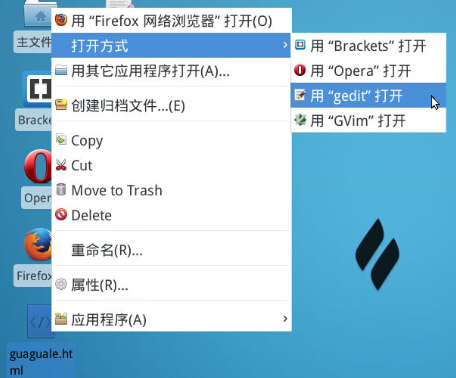

# 第 1 节 HTML5 三步实现刮刮乐

## 一、实验说明

### 1\. 环境登录

无需密码自动登录，系统用户名 shiyanlou

### 2\. 环境介绍

本实验环境采用带桌面的 Ubuntu Linux 环境，实验中会用到桌面上的程序：

>1\. Firefox：浏览器，项目完成后会使用它来打开我们的页面。

>2\. gedit：非常好用的编辑器，用来编辑我们的页面。

### 3\. 环境使用

实验报告可以在个人主页中查看，其中含有每次实验的截图及笔记，以及每次实验的有效学习时间（指的是在实验桌面内操作的时间，如果没有操作，系统会记录为发呆时间）。这些都是您学习的真实性证明。

本课程中的项目源码请点击 [我要源码](http://labfile.oss.aliyuncs.com/files0422/guaguale.zip)；

**说明：**此处源码文件以及课程后面的图片文件都已经存放百度云，你只需点击下载就可以使用！

## 4\. 项目介绍

hello，大家好！欢迎来到实验楼之**HTML5 三步实现刮刮乐**的课程，在正式开始项目之前，给大伙来小小一段笑话：

>“我的密码都很简单，都是我女朋友的姓名首字母加生日……所以……我养成了经常更换密码的好习惯。”

开心过后，咱们就开始一起干项目吧！别害怕，就算你看不懂，你只需花上短短十分钟，把代码敲上去，你也可以实现刮刮乐的效果，come on！

来！咱们先看看效果图：


**说明：**本课程重点是为了实现刮刮乐效果，如果你想学习 HTML5 的更多知识，可以点击：

*   [HTML5 基础入门](http://www.shiyanlou.com/courses/43)

## 二、HTML 部分

### 1\. 新建 `guaguale.html` 文件

在右边桌面鼠标右键----从模板创建----空文件，并将其命名为：guaguale.html，如下图：


### 2\. 编辑 `guaguale.html` 文件

在刚创建的文件上右击----打开方式----用 “gedit” 打开，如下图：



### 3\. 编写 HTML5 基础代码

代码后的注释部分只是方便你理解代码，不是必须敲进去的。

```js
<!--代码注释：可理解为声明文档类型为 HTML-->
<!DOCTYPE HTML> 
<html>
<head>

<!--代码注释：设置编码为 utf-8-->
<meta charset="utf-8">

<!--代码注释：此段代码的效果你可以理解为实现自动适应屏幕的效果-->
<meta name="viewport" content="width=device-width; initial-scale=1.0">

<title>使用 HTML5 实现刮刮乐效果</title>
</head>
<body>

<!--代码注释：第二步中的 JavaScript 代码就放在这 -->

</body>
</html> 
```

恭喜你，第一步搞定！

## 三、JavaScript 部分

伙伴们，把下面一段代码敲入< body>与< /body>标签之间，你就成功了！

```js
<body>

<div id="main">
   <div class="msg">Feeling Lucky? Try!<a href="javascript:void(0)" onClick="window.location.reload()">Try Again</a></div>
<!--代码注释：window.location.reload()可理解为刷新页面的意思-->

   <div>
   <!--代码注释：下面就是引入<canvas>-->
           <canvas></canvas> 
   </div>
</div>

<!--代码注释：< script>和< /script>标签是声明中间的代码为 JavaScript 代码哦 -->
<script type="text/javascript">

//代码注释:首先，我们要禁用页面的鼠标选中拖动的事件，就是不运行执行选中操作。
var bodyStyle = document.body.style; 
bodyStyle.mozUserSelect = 'none'; 
bodyStyle.webkitUserSelect = 'none'; 

//代码注释:接着我们定义图片类，获取 canvas 元素，并设置背景和位置属性。
var img = new Image();
var canvas = document.querySelector('canvas');
canvas.style.backgroundColor='transparent';
canvas.style.position = 'absolute';

//代码注释:我们在本例中用到两张随机照片，每次刷新随机一张图片作为背景。
var imgs = ['p_0.jpg','p_1.jpg'];
var num = Math.floor(Math.random()*2);
img.src = imgs[num];

//然后进入主体，当检测到图片加载完的时候，首先定义一些属性和函数，函数 layer()用来绘制一个灰色的正方形，eventDown()定义了按下事件 eventUp()定义了松开事件，eventMove()定义了移动事件，其中当按下时，获取坐标位移，并通过 arc(x, y, 10, 0, Math.PI * 2)来绘制小圆点。
img.addEventListener('load', function(e) {
    var ctx;
    var w = img.width,
        h = img.height;
    var offsetX = canvas.offsetLeft,
        offsetY = canvas.offsetTop;
    var mousedown = false;

    function layer(ctx) {
        ctx.fillStyle = 'gray';
        ctx.fillRect(0, 0, w, h);
    }

    function eventDown(e){
        e.preventDefault();
        mousedown=true;
    }

    function eventUp(e){
        e.preventDefault();
        mousedown=false;
    }

    function eventMove(e){
        e.preventDefault();
        if(mousedown) {
             if(e.changedTouches){
                 e=e.changedTouches[e.changedTouches.length-1];
             }
             var x = (e.clientX + document.body.scrollLeft || e.pageX) - offsetX || 0,
                 y = (e.clientY + document.body.scrollTop || e.pageY) - offsetY || 0;
             with(ctx) {
                 beginPath()

                 //代码注释：绘制圆点。 
                 arc(x, y, 10, 0, Math.PI * 2);
                 fill();
             }
        }
    }

    //最后，通过 canvas 调用以上函数，绘制图形，并且侦听触控及鼠标事件，调用相应的函数。
    canvas.width=w;
    canvas.height=h;
    canvas.style.backgroundImage='url('+img.src+')';
    ctx=canvas.getContext('2d');
    ctx.fillStyle='transparent';
    ctx.fillRect(0, 0, w, h);//代码注释：绘制矩形。 
    layer(ctx);

    ctx.globalCompositeOperation = 'destination-out';

    canvas.addEventListener('touchstart', eventDown);
    canvas.addEventListener('touchend', eventUp);
    canvas.addEventListener('touchmove', eventMove);
    canvas.addEventListener('mousedown', eventDown);
    canvas.addEventListener('mouseup', eventUp);
    canvas.addEventListener('mousemove', eventMove);
});
</script>

</body> 
```

## 四、摘下成功果实

>1、保存刚编写的代码后退出

>2、下载两张图片

```js
$ wget http://labfile.oss.aliyuncs.com/courses/133/p_0.jpg
$ wget http://labfile.oss.aliyuncs.com/courses/133/p_1.jpg 
```

>3、将其解压并将其中的两张图片复制到桌面即可

>4、并使用 **Firefox 浏览器** 打开 guaguale.html 文件

**注意：html 文件和两张图片必须在同一路径下（例如实验环境中，它们都是在桌面路径下）**

恭喜你成功了！**赶紧把此课程分享给你的好友吧**！

**想学习更多我的课程，可点击 [这里](http://www.shiyanlou.com/courses/154) !**